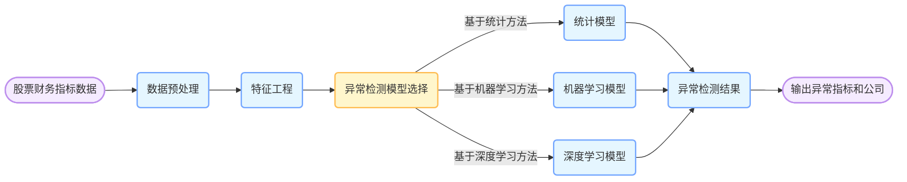

# AI驱动的股票财务指标异常检测

> 关键词：AI、股票财务指标、异常检测、机器学习、深度学习

> 摘要：本文围绕AI驱动的股票财务指标异常检测展开深入探讨。首先介绍了该研究的背景、目的、预期读者等信息，明确文章的范围和结构。接着阐述了核心概念与联系，包括股票财务指标和异常检测的原理及架构。详细讲解了核心算法原理，并用Python代码进行说明，同时给出了相关数学模型和公式。通过项目实战展示了如何搭建开发环境、实现源代码并进行解读分析。还探讨了实际应用场景，推荐了学习资源、开发工具框架以及相关论文著作。最后总结了未来发展趋势与挑战，提供了常见问题解答和扩展阅读参考资料，旨在为读者全面呈现AI在股票财务指标异常检测中的应用。

## 1. 背景介绍 
### 1.1 目的和范围
在金融市场中，股票财务指标是评估上市公司经营状况和投资价值的重要依据。然而，财务数据可能会受到各种因素的影响而出现异常，这些异常可能暗示着公司存在财务造假、经营风险等问题。传统的财务指标分析方法往往依赖于人工经验和简单的统计方法，难以发现复杂的异常模式。本文章的目的在于介绍如何利用人工智能技术实现对股票财务指标的异常检测，提高检测的准确性和效率。范围涵盖了常见的股票财务指标，如盈利能力指标（净利润率、净资产收益率等）、偿债能力指标（资产负债率、流动比率等），以及常见的人工智能算法，如机器学习算法（如孤立森林、One-Class SVM等）和深度学习算法（如自编码器等）。

### 1.2 预期读者
本文的预期读者包括金融分析师、投资者、金融科技从业者、数据科学家以及对人工智能在金融领域应用感兴趣的技术爱好者。对于金融从业者来说，本文可以帮助他们更好地利用AI技术进行财务分析和风险预警；对于数据科学家和技术爱好者，本文提供了一个将AI算法应用于实际金融场景的案例。

### 1.3 文档结构概述
本文将按照以下结构进行组织：首先介绍核心概念与联系，包括股票财务指标和异常检测的基本原理和架构；接着详细讲解核心算法原理，并给出具体的Python操作步骤；然后介绍相关的数学模型和公式，并通过举例进行说明；之后进行项目实战，包括开发环境搭建、源代码实现和代码解读；再探讨实际应用场景；推荐相关的工具和资源；最后总结未来发展趋势与挑战，提供常见问题解答和扩展阅读参考资料。

### 1.4 术语表
#### 1.4.1 核心术语定义
- **股票财务指标**：是指用于衡量上市公司财务状况和经营成果的一系列数据，如营业收入、净利润、资产负债率等。
- **异常检测**：是指从数据中识别出与正常模式不同的异常数据点或模式的过程。
- **机器学习**：是一门多领域交叉学科，涉及概率论、统计学、逼近论、凸分析、算法复杂度理论等多门学科。它专门研究计算机怎样模拟或实现人类的学习行为，以获取新的知识或技能，重新组织已有的知识结构使之不断改善自身的性能。
- **深度学习**：是机器学习的一个分支领域，它是一种基于对数据进行表征学习的方法。深度学习通过构建具有很多层的神经网络模型，自动从数据中学习复杂的特征和模式。

#### 1.4.2 相关概念解释
- **特征工程**：是指从原始数据中提取特征，并将其转换为适合机器学习算法处理的格式的过程。在股票财务指标异常检测中，特征工程包括选择合适的财务指标、对数据进行标准化处理等。
- **模型评估**：是指使用一定的指标和方法来评估机器学习模型的性能。常见的评估指标包括准确率、召回率、F1值等。

#### 1.4.3 缩略词列表
- **ROE**：净资产收益率（Return on Equity）
- **ROA**：总资产收益率（Return on Assets）
- **CR**：流动比率（Current Ratio）
- **QR**：速动比率（Quick Ratio）
- **AI**：人工智能（Artificial Intelligence）
- **ML**：机器学习（Machine Learning）
- **DL**：深度学习（Deep Learning）

## 2. 核心概念与联系 
### 股票财务指标
股票财务指标可以分为多个类别，常见的有盈利能力指标、偿债能力指标、营运能力指标和成长能力指标等。

#### 盈利能力指标
- **净利润率**：是指净利润与营业收入的比率，反映了公司每单位营业收入所获得的净利润。公式为：$净利润率=\frac{净利润}{营业收入}\times100\%$。
- **净资产收益率（ROE）**：是指净利润与平均净资产的比率，衡量了公司运用自有资本的效率。公式为：$ROE=\frac{净利润}{平均净资产}\times100\%$。

#### 偿债能力指标
- **资产负债率**：是指负债总额与资产总额的比率，反映了公司的长期偿债能力。公式为：$资产负债率=\frac{负债总额}{资产总额}\times100\%$。
- **流动比率**：是指流动资产与流动负债的比率，衡量了公司的短期偿债能力。公式为：$流动比率=\frac{流动资产}{流动负债}$。

#### 营运能力指标
- **存货周转率**：是指营业成本与平均存货余额的比率，反映了公司存货的周转速度。公式为：$存货周转率=\frac{营业成本}{平均存货余额}$。
- **应收账款周转率**：是指营业收入与平均应收账款余额的比率，衡量了公司应收账款的回收速度。公式为：$应收账款周转率=\frac{营业收入}{平均应收账款余额}$。

#### 成长能力指标
- **营业收入增长率**：是指本期营业收入与上期营业收入之差与上期营业收入的比率，反映了公司营业收入的增长情况。公式为：$营业收入增长率=\frac{本期营业收入 - 上期营业收入}{上期营业收入}\times100\%$。
- **净利润增长率**：是指本期净利润与上期净利润之差与上期净利润的比率，衡量了公司净利润的增长情况。公式为：$净利润增长率=\frac{本期净利润 - 上期净利润}{上期净利润}\times100\%$。

### 异常检测
异常检测的目标是识别出数据中与正常模式不同的异常数据点或模式。在股票财务指标异常检测中，异常可能表现为某个财务指标的值明显偏离历史均值、与同行业其他公司的指标差异过大等。

异常检测的方法可以分为基于统计的方法、基于机器学习的方法和基于深度学习的方法。

#### 基于统计的方法
基于统计的方法通过计算数据的统计特征，如均值、标准差等，来确定正常数据的范围。常见的方法有Z-score方法、基于百分位数的方法等。

#### 基于机器学习的方法
基于机器学习的方法通过训练模型来学习正常数据的模式，然后使用模型来识别异常数据。常见的算法有孤立森林、One-Class SVM等。

#### 基于深度学习的方法
基于深度学习的方法通过构建深度神经网络模型来学习数据的复杂特征和模式。常见的模型有自编码器、变分自编码器等。

### 核心概念架构示意图


该架构图展示了AI驱动的股票财务指标异常检测的整体流程。首先，收集股票财务指标数据，然后进行数据预处理和特征工程。接着，根据具体情况选择合适的异常检测模型，包括基于统计的方法、基于机器学习的方法和基于深度学习的方法。最后，通过模型进行异常检测，并输出异常指标和对应的公司。

## 3. 核心算法原理 & 具体操作步骤 
### 孤立森林算法原理
孤立森林（Isolation Forest）是一种基于树结构的异常检测算法，它的核心思想是通过随机划分数据空间，将异常点孤立出来。具体来说，孤立森林通过构建多棵二叉树（称为孤立树），每棵树都是随机选择一个特征和一个分割点，将数据空间划分为两部分，然后递归地进行划分，直到每个数据点都被孤立出来。异常点由于其离群性，更容易在较少的划分步骤中被孤立出来，因此可以通过计算每个数据点在所有孤立树中的平均路径长度来判断其是否为异常点。

### Python代码实现
```python
import numpy as np
from sklearn.ensemble import IsolationForest

# 生成示例数据
np.random.seed(42)
X = np.random.randn(100, 2)  # 生成100个二维数据点
X = np.vstack([X, np.array([[10, 10], [15, 15]])])  # 添加两个异常点

# 创建孤立森林模型
clf = IsolationForest(n_estimators=100, contamination=0.02)

# 训练模型
clf.fit(X)

# 预测异常点
y_pred = clf.predict(X)

# 输出异常点
anomaly_indices = np.where(y_pred == -1)[0]
print("异常点的索引：", anomaly_indices)
```
### 代码解释
1. **数据生成**：使用`numpy`生成100个二维的随机数据点，并添加两个异常点。
2. **模型创建**：使用`sklearn.ensemble`中的`IsolationForest`类创建孤立森林模型，设置树的数量为100，异常点的比例为0.02。
3. **模型训练**：使用`fit`方法对模型进行训练。
4. **异常点预测**：使用`predict`方法对数据进行预测，输出结果为1表示正常点，-1表示异常点。
5. **异常点输出**：使用`numpy`的`where`函数找出异常点的索引并输出。

### One-Class SVM算法原理
One-Class SVM是一种基于支持向量机的异常检测算法，它的目标是找到一个超平面，将正常数据点与原点尽可能地分开。在训练过程中，只使用正常数据点进行训练，通过最大化超平面与原点的距离，使得正常数据点都在超平面的一侧，而异常点则在另一侧。

### Python代码实现
```python
import numpy as np
from sklearn.svm import OneClassSVM

# 生成示例数据
np.random.seed(42)
X = np.random.randn(100, 2)  # 生成100个二维数据点
X = np.vstack([X, np.array([[10, 10], [15, 15]])])  # 添加两个异常点

# 创建One-Class SVM模型
clf = OneClassSVM(nu=0.02, kernel="rbf", gamma=0.1)

# 训练模型
clf.fit(X)

# 预测异常点
y_pred = clf.predict(X)

# 输出异常点
anomaly_indices = np.where(y_pred == -1)[0]
print("异常点的索引：", anomaly_indices)
```
### 代码解释
1. **数据生成**：与孤立森林算法相同，生成100个二维的随机数据点并添加两个异常点。
2. **模型创建**：使用`sklearn.svm`中的`OneClassSVM`类创建One-Class SVM模型，设置异常点的比例为0.02，核函数为径向基函数（RBF），核系数为0.1。
3. **模型训练**：使用`fit`方法对模型进行训练。
4. **异常点预测**：使用`predict`方法对数据进行预测，输出结果为1表示正常点，-1表示异常点。
5. **异常点输出**：使用`numpy`的`where`函数找出异常点的索引并输出。

### 自编码器算法原理
自编码器（Autoencoder）是一种无监督学习的神经网络模型，它的目标是将输入数据进行编码，然后再将编码后的数据进行解码，使得解码后的输出尽可能地接近输入数据。在正常数据上训练自编码器后，当输入异常数据时，解码后的输出与输入数据之间的重构误差会增大，因此可以通过设置一个重构误差的阈值来判断数据是否为异常点。

### Python代码实现
```python
import numpy as np
import tensorflow as tf
from tensorflow.keras.layers import Input, Dense
from tensorflow.keras.models import Model

# 生成示例数据
np.random.seed(42)
X = np.random.randn(100, 2)  # 生成100个二维数据点
X = np.vstack([X, np.array([[10, 10], [15, 15]])])  # 添加两个异常点

# 定义自编码器模型
input_layer = Input(shape=(2,))
encoded = Dense(1, activation='relu')(input_layer)
decoded = Dense(2, activation='linear')(encoded)
autoencoder = Model(input_layer, decoded)

# 编译模型
autoencoder.compile(optimizer='adam', loss='mse')

# 训练模型
autoencoder.fit(X, X, epochs=50, batch_size=16, shuffle=True)

# 计算重构误差
reconstructions = autoencoder.predict(X)
mse = np.mean(np.power(X - reconstructions, 2), axis=1)

# 设置阈值
threshold = np.mean(mse) + np.std(mse)

# 找出异常点
anomaly_indices = np.where(mse > threshold)[0]
print("异常点的索引：", anomaly_indices)
```
### 代码解释
1. **数据生成**：与前面的算法相同，生成100个二维的随机数据点并添加两个异常点。
2. **模型定义**：使用`tensorflow.keras`定义一个简单的自编码器模型，包括一个输入层、一个编码层和一个解码层。
3. **模型编译**：使用`adam`优化器和均方误差（MSE）损失函数对模型进行编译。
4. **模型训练**：使用`fit`方法对模型进行训练，训练50个epoch，批次大小为16。
5. **重构误差计算**：使用训练好的模型对数据进行预测，计算输入数据与重构数据之间的均方误差。
6. **阈值设置**：将重构误差的均值加上标准差作为阈值。
7. **异常点找出**：找出重构误差大于阈值的点的索引并输出。

## 4. 数学模型和公式 & 详细讲解 & 举例说明 
### 孤立森林数学模型
#### 平均路径长度公式
在孤立森林中，每个数据点的平均路径长度是判断其是否为异常点的重要依据。设$h(x)$表示数据点$x$在一棵孤立树中的路径长度，$E(h(x))$表示数据点$x$在所有孤立树中的平均路径长度。对于一个包含$n$个数据点的数据集，$c(n)$是一个与$n$有关的函数，用于修正路径长度，其公式为：
$$c(n)=2H(n - 1)-\frac{2(n - 1)}{n}$$
其中$H(k)$是调和数，$H(k)=\sum_{i = 1}^{k}\frac{1}{i}$。

数据点$x$的异常得分$s(x,n)$的计算公式为：
$$s(x,n)=2^{-\frac{E(h(x))}{c(n)}}$$
当$s(x,n)$接近1时，数据点$x$为异常点；当$s(x,n)$接近0时，数据点$x$为正常点。

#### 举例说明
假设我们有一个包含5个数据点的数据集，某个数据点$x$在3棵孤立树中的路径长度分别为$h_1(x)=2$，$h_2(x)=3$，$h_3(x)=2$，则$E(h(x))=\frac{2 + 3 + 2}{3}=\frac{7}{3}$。

$n = 5$时，$c(5)=2H(4)-\frac{2\times4}{5}$，$H(4)=\sum_{i = 1}^{4}\frac{1}{i}=1+\frac{1}{2}+\frac{1}{3}+\frac{1}{4}=\frac{25}{12}$，$c(5)=2\times\frac{25}{12}-\frac{8}{5}=\frac{25}{6}-\frac{8}{5}=\frac{125 - 48}{30}=\frac{77}{30}$。

异常得分$s(x,5)=2^{-\frac{\frac{7}{3}}{\frac{77}{30}}}=2^{-\frac{70}{77}}\approx0.59$，如果我们设置异常得分的阈值为0.8，则该数据点不是异常点。

### One-Class SVM数学模型
#### 优化目标函数
One-Class SVM的优化目标是找到一个超平面$w\cdot x + b = 0$，使得正常数据点与原点的距离最大化。其优化目标函数为：
$$\min_{w,\xi,\rho}\frac{1}{2}\|w\|^2+\frac{1}{\nu n}\sum_{i = 1}^{n}\xi_i-\rho$$
$$\text{s.t. } w\cdot x_i\geq\rho-\xi_i,\quad\xi_i\geq0,\quad i = 1,\cdots,n$$
其中$w$是超平面的法向量，$\xi_i$是松弛变量，$\rho$是超平面与原点的距离，$\nu$是一个控制异常点比例的参数，$n$是数据点的数量。

#### 举例说明
假设我们有一个二维数据集，数据点$x_1=(1,1)$，$x_2=(2,2)$，$x_3=(3,3)$。使用One-Class SVM进行异常检测，设置$\nu = 0.1$。通过求解上述优化目标函数，得到超平面的参数$w=(0.5,0.5)$，$b = -2$，$\rho = 1$。对于一个新的数据点$x=(10,10)$，计算$w\cdot x + b=0.5\times10 + 0.5\times10 - 2 = 8$，由于$8\gt\rho = 1$，所以该数据点为正常点（在实际应用中，还需要根据模型的预测结果进行判断）。

### 自编码器数学模型
#### 重构误差公式
自编码器的重构误差通常使用均方误差（MSE）来衡量，设输入数据为$x$，重构数据为$\hat{x}$，则重构误差$L(x,\hat{x})$的计算公式为：
$$L(x,\hat{x})=\frac{1}{m}\sum_{i = 1}^{m}(x_i-\hat{x}_i)^2$$
其中$m$是数据的维度。

#### 举例说明
假设我们有一个二维输入数据$x=(1,2)$，经过自编码器重构后得到$\hat{x}=(1.1,1.9)$，则重构误差$L(x,\hat{x})=\frac{(1 - 1.1)^2+(2 - 1.9)^2}{2}=\frac{0.01 + 0.01}{2}=0.01$。如果我们设置重构误差的阈值为0.05，则该数据点为正常点。

## 5. 项目实战：代码实际案例和详细解释说明 
### 5.1  开发环境搭建
#### 操作系统
可以选择Windows、Linux或macOS操作系统，本项目推荐使用Linux系统，如Ubuntu 18.04及以上版本。

#### 编程语言和版本
使用Python 3.7及以上版本，Python是一种广泛使用的编程语言，具有丰富的科学计算和机器学习库。

#### 安装依赖库
可以使用`pip`或`conda`来安装所需的库，主要的库包括：
- `numpy`：用于数值计算。
- `pandas`：用于数据处理和分析。
- `scikit-learn`：用于机器学习算法的实现。
- `tensorflow`或`pytorch`：用于深度学习模型的实现。
- `matplotlib`：用于数据可视化。

以下是使用`pip`安装这些库的命令：
```bash
pip install numpy pandas scikit-learn tensorflow matplotlib
```

### 5.2  源代码详细实现和代码解读
#### 数据获取和预处理
```python
import pandas as pd
import numpy as np

# 读取股票财务指标数据
data = pd.read_csv('stock_financial_data.csv')

# 选择需要的财务指标列
selected_columns = ['ROE', 'ROA', 'CR', 'QR', 'InventoryTurnover', 'AccountsReceivableTurnover']
X = data[selected_columns]

# 数据标准化
from sklearn.preprocessing import StandardScaler
scaler = StandardScaler()
X_scaled = scaler.fit_transform(X)
```
#### 代码解读
1. **数据读取**：使用`pandas`的`read_csv`函数读取股票财务指标数据，假设数据存储在`stock_financial_data.csv`文件中。
2. **特征选择**：选择需要的财务指标列，如净资产收益率（ROE）、总资产收益率（ROA）等。
3. **数据标准化**：使用`sklearn.preprocessing`中的`StandardScaler`对数据进行标准化处理，使得数据的均值为0，标准差为1。

#### 异常检测模型训练和预测
```python
from sklearn.ensemble import IsolationForest

# 创建孤立森林模型
clf = IsolationForest(n_estimators=100, contamination=0.05)

# 训练模型
clf.fit(X_scaled)

# 预测异常点
y_pred = clf.predict(X_scaled)

# 将预测结果添加到原始数据中
data['anomaly'] = y_pred
```
#### 代码解读
1. **模型创建**：使用`sklearn.ensemble`中的`IsolationForest`类创建孤立森林模型，设置树的数量为100，异常点的比例为0.05。
2. **模型训练**：使用`fit`方法对模型进行训练，输入为标准化后的数据。
3. **异常点预测**：使用`predict`方法对数据进行预测，输出结果为1表示正常点，-1表示异常点。
4. **结果添加**：将预测结果添加到原始数据中，方便后续分析。

#### 结果可视化
```python
import matplotlib.pyplot as plt

# 绘制散点图
plt.scatter(data['ROE'], data['ROA'], c=data['anomaly'], cmap='viridis')
plt.xlabel('ROE')
plt.ylabel('ROA')
plt.title('Stock Financial Anomaly Detection')
plt.show()
```
#### 代码解读
1. **导入库**：导入`matplotlib.pyplot`用于数据可视化。
2. **绘制散点图**：使用`scatter`函数绘制散点图，将净资产收益率（ROE）作为x轴，总资产收益率（ROA）作为y轴，颜色表示异常点的标签。
3. **设置坐标轴和标题**：设置x轴、y轴的标签和图表的标题。
4. **显示图表**：使用`show`函数显示图表。

### 5.3  代码解读与分析
#### 数据预处理的重要性
数据预处理是异常检测的重要步骤，通过数据标准化可以消除不同特征之间的量纲差异，使得模型能够更好地学习数据的特征。例如，如果不进行数据标准化，某些特征的数值范围可能会比其他特征大很多，这会导致模型在训练过程中更关注这些特征，从而影响模型的性能。

#### 异常检测模型的选择
在本项目中，我们选择了孤立森林模型进行异常检测。孤立森林模型具有计算效率高、对异常点敏感等优点，适合处理高维数据。然而，不同的异常检测模型具有不同的特点和适用场景，在实际应用中需要根据数据的特点和问题的需求选择合适的模型。

#### 结果可视化的作用
结果可视化可以帮助我们直观地观察异常点的分布情况，发现数据中的潜在模式。通过绘制散点图，我们可以看到异常点在净资产收益率和总资产收益率两个特征上的分布情况，从而更好地理解异常点的特征和可能的原因。

## 6. 实际应用场景 
### 金融监管机构
金融监管机构可以利用AI驱动的股票财务指标异常检测技术，对上市公司的财务数据进行实时监测，及时发现财务造假、操纵利润等违规行为。例如，通过分析上市公司的盈利能力指标、偿债能力指标等，识别出指标异常的公司，进行进一步的调查和监管。

### 投资者
投资者可以使用该技术辅助投资决策，筛选出财务状况良好的公司，避免投资存在财务风险的公司。例如，在选择股票时，投资者可以查看公司的财务指标异常检测结果，排除那些存在异常指标的公司，提高投资的安全性和回报率。

### 审计机构
审计机构在进行财务审计时，可以利用AI技术对公司的财务数据进行全面的异常检测，提高审计的效率和准确性。例如，通过分析公司的营运能力指标、成长能力指标等，发现可能存在的财务问题，为审计工作提供线索和依据。

### 上市公司自身
上市公司可以利用该技术对自身的财务状况进行自我评估和监控，及时发现潜在的财务风险，采取相应的措施进行改进。例如，通过分析公司的财务指标异常情况，找出经营管理中存在的问题，优化业务流程，提高财务管理水平。

## 7. 工具和资源推荐
### 7.1 学习资源推荐
#### 7.1.1 书籍推荐
- 《机器学习》（周志华著）：该书是机器学习领域的经典教材，全面介绍了机器学习的基本概念、算法和应用，对于理解异常检测算法的原理和实现有很大的帮助。
- 《深度学习》（Ian Goodfellow、Yoshua Bengio和Aaron Courville著）：该书是深度学习领域的权威著作，深入讲解了深度学习的理论和实践，适合想要深入学习深度学习在异常检测中应用的读者。
- 《Python数据分析实战》（韦斯·麦金尼著）：该书介绍了如何使用Python进行数据分析和处理，包括数据获取、清洗、可视化等方面的内容，对于处理股票财务指标数据非常有用。

#### 7.1.2 在线课程
- Coursera上的“机器学习”课程（由Andrew Ng教授授课）：该课程是机器学习领域的经典在线课程，通过视频讲解、编程作业等方式，系统地介绍了机器学习的基本概念和算法。
- edX上的“深度学习基础”课程（由deeplearning.ai提供）：该课程深入讲解了深度学习的基本原理和应用，包括神经网络、卷积神经网络、循环神经网络等内容。
- Kaggle上的“机器学习微课程”：该课程提供了一系列的机器学习微课程，内容简洁明了，适合快速入门和学习。

#### 7.1.3 技术博客和网站
- Towards Data Science：该网站是一个专注于数据科学和机器学习的技术博客平台，提供了大量的高质量文章和教程，包括异常检测、金融数据分析等方面的内容。
- Medium上的AI板块：Medium是一个知名的在线写作平台，其AI板块有很多优秀的技术文章和案例分享，对于了解AI在金融领域的应用有很大的帮助。
- 知乎上的数据科学和机器学习话题：知乎是一个知识分享平台，上面有很多关于数据科学和机器学习的问题和回答，以及一些优秀的专栏文章，可以从中获取到很多有价值的信息。

### 7.2 开发工具框架推荐
#### 7.2.1 IDE和编辑器
- PyCharm：是一款专门为Python开发设计的集成开发环境（IDE），具有代码自动补全、调试、版本控制等功能，适合开发大型的Python项目。
- Jupyter Notebook：是一个基于Web的交互式计算环境，支持Python、R等多种编程语言，适合进行数据探索、模型实验和代码演示。
- Visual Studio Code：是一款轻量级的代码编辑器，支持多种编程语言和插件扩展，具有丰富的开发工具和功能，适合快速开发和调试代码。

#### 7.2.2 调试和性能分析工具
- `pdb`：是Python自带的调试器，可以在代码中设置断点，逐步执行代码，查看变量的值和程序的执行流程。
- `scikit-learn`中的`cross_val_score`和`GridSearchCV`：可以用于模型的交叉验证和超参数调优，帮助提高模型的性能。
- `tensorboard`：是TensorFlow提供的可视化工具，可以用于可视化模型的训练过程、损失函数的变化等，帮助分析模型的性能和问题。

#### 7.2.3 相关框架和库
- `scikit-learn`：是一个广泛使用的机器学习库，提供了各种机器学习算法的实现，包括分类、回归、聚类、异常检测等，使用方便，文档丰富。
- `tensorflow`和`pytorch`：是两个流行的深度学习框架，提供了高效的深度学习模型训练和部署工具，支持GPU加速，适合处理大规模的数据集和复杂的模型。
- `pandas`和`numpy`：是Python中常用的数据处理和数值计算库，提供了丰富的数据结构和函数，用于数据的读取、清洗、处理和分析。

### 7.3 相关论文著作推荐
#### 7.3.1 经典论文
- “Isolation Forest”（由Fei Tony Liu、Kai Ming Ting和Zhi-Hua Zhou发表）：该论文提出了孤立森林算法，是异常检测领域的经典论文，详细介绍了算法的原理和实现。
- “One-Class SVM for Novelty Detection”（由Bernhard Schölkopf、John C. Platt、John Shawe-Taylor、Alex J. Smola和Robert C. Williamson发表）：该论文介绍了One-Class SVM算法在异常检测中的应用，为基于支持向量机的异常检测方法奠定了基础。
- “Auto-Encoding Variational Bayes”（由Diederik P. Kingma和Max Welling发表）：该论文提出了变分自编码器（VAE），是自编码器领域的重要研究成果，为深度学习在异常检测中的应用提供了新的思路。

#### 7.3.2 最新研究成果
- 关注顶级学术会议如NeurIPS、ICML、KDD等上发表的关于异常检测和金融数据分析的论文，这些论文反映了该领域的最新研究动态和技术进展。
- 关注知名学术期刊如Journal of Machine Learning Research、ACM Transactions on Knowledge Discovery from Data等上的相关研究成果。

#### 7.3.3 应用案例分析
- 一些金融科技公司和研究机构会发布关于AI在金融领域应用的案例分析报告，可以通过搜索引擎或专业的金融科技网站获取这些报告，了解实际应用中的问题和解决方案。

## 8. 总结：未来发展趋势与挑战
### 未来发展趋势
#### 多模态数据融合
未来的股票财务指标异常检测将不仅仅依赖于财务数据，还会融合文本数据（如公司公告、新闻报道等）、图像数据（如财务报表的截图等）和社交媒体数据等多模态数据，以更全面地了解公司的经营状况和市场环境，提高异常检测的准确性和可靠性。

#### 实时监测和预警
随着金融市场的快速变化，实时监测和预警将成为异常检测的重要发展方向。通过建立实时数据采集和处理系统，及时发现股票财务指标的异常变化，并发出预警信号，帮助投资者和监管机构及时做出决策。

#### 可解释性AI
在金融领域，模型的可解释性非常重要。未来的异常检测模型将更加注重可解释性，不仅能够准确地识别异常点，还能够解释异常产生的原因和影响，为决策者提供更有价值的信息。

#### 强化学习与异常检测的结合
强化学习可以通过与环境的交互不断优化模型的决策策略。将强化学习与异常检测相结合，可以使模型在动态的金融市场环境中更好地适应变化，提高异常检测的效果。

### 挑战
#### 数据质量和隐私问题
股票财务指标数据的质量直接影响异常检测的结果。数据可能存在缺失值、错误值等问题，需要进行有效的数据清洗和预处理。同时，金融数据涉及到公司的隐私和商业机密，如何在保护数据隐私的前提下进行有效的异常检测是一个挑战。

#### 模型的泛化能力
不同行业、不同公司的财务指标具有不同的特点和分布规律，模型在一个数据集上训练得到的结果可能在另一个数据集上表现不佳。如何提高模型的泛化能力，使其能够适应不同的金融场景和数据分布，是需要解决的问题。

#### 算法的复杂性和计算资源需求
深度学习算法通常具有较高的复杂性和计算资源需求，对于大规模的股票财务指标数据，训练和部署模型需要大量的计算资源和时间。如何优化算法的性能，降低计算成本，是一个亟待解决的问题。

#### 监管和合规问题
在金融领域，异常检测的结果可能会对公司的声誉和市场价值产生影响。因此，需要建立相应的监管和合规机制，确保异常检测的过程和结果符合法律法规和行业规范。

## 9. 附录：常见问题与解答
### 问题1：如何选择合适的异常检测模型？
答：选择合适的异常检测模型需要考虑多个因素，包括数据的特点（如数据的维度、分布、规模等）、问题的需求（如异常点的定义、检测的精度要求等）和计算资源的限制。一般来说，对于高维数据和大规模数据集，可以选择孤立森林等基于树结构的算法；对于数据分布较为复杂的情况，可以选择One-Class SVM等基于核函数的算法；对于需要学习数据复杂特征的情况，可以选择自编码器等深度学习模型。

### 问题2：异常检测的阈值如何设置？
答：异常检测的阈值设置是一个关键问题，不同的算法有不同的阈值设置方法。对于基于统计的方法，可以根据数据的统计特征（如均值、标准差等）来设置阈值；对于基于机器学习的方法，可以通过交叉验证等方法来选择最优的阈值；对于基于深度学习的方法，可以根据重构误差的分布情况来设置阈值。在实际应用中，还需要结合业务需求和经验来调整阈值。

### 问题3：如何评估异常检测模型的性能？
答：评估异常检测模型的性能可以使用多种指标，常见的指标包括准确率、召回率、F1值、ROC曲线和AUC值等。准确率是指模型正确预测的样本数占总样本数的比例；召回率是指模型正确预测的异常样本数占实际异常样本数的比例；F1值是准确率和召回率的调和平均数；ROC曲线是反映模型在不同阈值下的真正率和假正率之间的关系；AUC值是ROC曲线下的面积，反映了模型的整体性能。

### 问题4：异常检测结果如何进行解释？
答：异常检测结果的解释需要结合具体的业务场景和数据特点。对于异常点，可以分析其对应的财务指标值，与同行业其他公司的指标进行比较，查看公司的历史数据和公告等信息，找出可能导致异常的原因。同时，还可以使用特征重要性分析等方法，了解哪些特征对异常检测结果的影响较大。

## 10. 扩展阅读 & 参考资料
### 扩展阅读
- 《金融计量学：从初级到高级建模技术》（克里斯托弗·布鲁克斯著）：该书介绍了金融计量学的基本理论和方法，包括时间序列分析、风险度量等内容，对于深入理解金融数据和异常检测有很大的帮助。
- 《Python金融大数据分析》（Yves Hilpisch著）：该书介绍了如何使用Python进行金融数据分析和建模，包括数据获取、处理、可视化和机器学习等方面的内容，提供了很多实际的案例和代码。
- 《人工智能时代的金融风险管理》（陈忠阳等著）：该书探讨了人工智能在金融风险管理中的应用，包括信用风险、市场风险、操作风险等方面的内容，对于了解AI在金融领域的应用和发展趋势有一定的参考价值。

### 参考资料
- 上海证券交易所、深圳证券交易所等官方网站，获取股票财务指标数据和相关公告信息。
- Kaggle、Dataverse等数据平台，获取金融数据集和相关代码。
- IEEE Xplore、ACM Digital Library等学术数据库，获取相关的学术论文和研究报告。