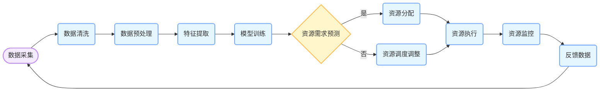

# AI驱动的软件项目智能资源管理策略

> 关键词：AI、软件项目、智能资源管理、策略、资源优化、机器学习、深度学习

> 摘要：本文围绕AI驱动的软件项目智能资源管理策略展开深入探讨。首先介绍了该领域的背景知识，包括目的、预期读者等内容。接着阐述了核心概念及联系，分析了核心算法原理并给出具体操作步骤，通过数学模型和公式进行详细讲解与举例说明。然后结合项目实战，给出代码实际案例及详细解释。同时探讨了实际应用场景，推荐了相关工具和资源。最后总结了未来发展趋势与挑战，解答了常见问题并提供扩展阅读与参考资料，旨在为软件项目的资源管理提供全面、深入且实用的指导，借助AI技术实现资源的高效利用和项目的成功交付。

## 1. 背景介绍 
### 1.1 目的和范围
在当今数字化时代，软件项目的规模和复杂度不断增加，传统的资源管理方式已经难以满足高效、精准的项目需求。AI驱动的软件项目智能资源管理策略的目的在于利用人工智能技术，优化软件项目中的资源分配、调度和监控，提高项目的执行效率、降低成本，并提升项目的成功率。

本策略的范围涵盖了软件项目从需求分析、设计、开发、测试到上线维护的全生命周期中的各类资源，包括人力资源、硬件资源、软件工具资源等。通过运用AI算法和模型，对这些资源进行智能管理和动态调整，以适应项目的变化和不确定性。

### 1.2 预期读者
本文的预期读者主要包括软件项目的管理者、项目经理、资源分配人员、AI技术开发者以及对软件项目管理和AI应用感兴趣的研究人员和从业者。对于软件项目管理者来说，本文可以提供实用的资源管理策略和方法，帮助他们更好地规划和组织项目资源；对于AI技术开发者，可从中获取在软件项目资源管理领域的应用场景和技术实现思路；而对于研究人员和从业者，能作为了解该领域前沿动态和发展趋势的参考资料。

### 1.3 文档结构概述
本文将按照以下结构进行阐述：首先介绍背景知识，让读者了解AI驱动的软件项目智能资源管理策略的相关背景信息；接着阐述核心概念与联系，帮助读者理解该领域的基本概念和内在逻辑；然后详细讲解核心算法原理及具体操作步骤，并通过Python代码进行说明；再介绍数学模型和公式，辅以举例说明；之后结合项目实战，给出代码实际案例和详细解释；探讨实际应用场景；推荐相关的工具和资源；总结未来发展趋势与挑战；解答常见问题；最后提供扩展阅读和参考资料，方便读者进一步深入学习和研究。

### 1.4 术语表
#### 1.4.1 核心术语定义
- **AI（Artificial Intelligence）**：即人工智能，是指计算机系统能够执行通常需要人类智能才能完成的任务，如学习、推理、解决问题等。
- **软件项目资源管理**：是指对软件项目中所需的各种资源进行规划、分配、调度和监控，以确保项目能够按时、按质量要求完成的过程。
- **智能资源管理**：利用AI技术对资源进行自动化、智能化的管理，能够根据项目的实时状态和需求，动态调整资源的分配和使用。
- **机器学习（Machine Learning）**：是AI的一个分支，它使计算机系统能够通过数据学习模式和规律，从而做出预测和决策，而无需明确的编程指令。
- **深度学习（Deep Learning）**：是机器学习的一种特殊形式，它使用多层神经网络来学习数据的复杂表示和模式，在图像识别、自然语言处理等领域取得了显著的成果。

#### 1.4.2 相关概念解释
- **资源分配**：根据项目的需求和资源的可用性，将资源合理地分配到项目的各个任务和阶段中。
- **资源调度**：在项目执行过程中，根据任务的优先级和资源的使用情况，动态调整资源的使用顺序和时间，以提高资源的利用效率。
- **资源监控**：对资源的使用状态、性能指标等进行实时监测，及时发现资源的异常情况，并采取相应的措施进行调整。

#### 1.4.3 缩略词列表
- **AI**：Artificial Intelligence（人工智能）
- **ML**：Machine Learning（机器学习）
- **DL**：Deep Learning（深度学习）
- **CPU**：Central Processing Unit（中央处理器）
- **GPU**：Graphics Processing Unit（图形处理器）

## 2. 核心概念与联系 

### 核心概念原理
AI驱动的软件项目智能资源管理策略的核心在于利用AI技术对软件项目中的资源进行智能分析、预测和决策。其基本原理是通过收集软件项目中的各种数据，包括项目进度、任务需求、资源使用情况等，利用机器学习和深度学习算法对这些数据进行建模和分析，挖掘数据中的潜在模式和规律，从而实现对资源的智能管理。

例如，通过对历史项目数据的学习，机器学习模型可以预测项目在不同阶段所需的资源量，帮助管理者提前做好资源规划；深度学习模型可以对资源的使用情况进行实时监测和分析，及时发现资源的瓶颈和浪费现象，并提出优化建议。

### 架构的文本示意图
AI驱动的软件项目智能资源管理系统主要由数据采集层、数据处理层、模型训练层、决策支持层和资源执行层组成。

- **数据采集层**：负责收集软件项目中的各种数据，包括项目文档、代码库、任务管理系统、资源监控系统等数据源中的数据。
- **数据处理层**：对采集到的数据进行清洗、预处理和特征提取，将原始数据转换为适合模型训练的格式。
- **模型训练层**：利用机器学习和深度学习算法对处理后的数据进行训练，构建资源管理模型。
- **决策支持层**：根据训练好的模型，对项目的资源需求和使用情况进行预测和分析，为资源分配和调度提供决策支持。
- **资源执行层**：根据决策支持层的建议，对资源进行实际的分配和调度操作。

### Mermaid流程图


## 3. 核心算法原理 & 具体操作步骤 

### 核心算法原理
在AI驱动的软件项目智能资源管理中，常用的核心算法包括线性回归、决策树、神经网络等。下面以线性回归算法为例，详细介绍其原理和应用。

线性回归是一种用于建立自变量和因变量之间线性关系的统计模型。在软件项目资源管理中，我们可以将项目的某些特征（如任务复杂度、团队规模等）作为自变量，将资源需求（如人力工时、硬件资源占用等）作为因变量，通过线性回归模型来预测资源需求。

线性回归模型的一般形式为：
$$y = \theta_0 + \theta_1x_1 + \theta_2x_2 + \cdots + \theta_nx_n + \epsilon$$
其中，$y$ 是因变量，$x_1, x_2, \cdots, x_n$ 是自变量，$\theta_0, \theta_1, \theta_2, \cdots, \theta_n$ 是模型的参数，$\epsilon$ 是误差项。

### 具体操作步骤
以下是使用Python实现线性回归算法进行资源需求预测的具体步骤：

#### 步骤1：导入必要的库
```python
import numpy as np
import pandas as pd
from sklearn.model_selection import train_test_split
from sklearn.linear_model import LinearRegression
from sklearn.metrics import mean_squared_error
```

#### 步骤2：加载和准备数据
假设我们有一个包含项目特征和资源需求的数据集 `project_data.csv`，可以使用以下代码加载和准备数据：
```python
# 加载数据
data = pd.read_csv('project_data.csv')

# 分离自变量和因变量
X = data.drop('resource_demand', axis=1)
y = data['resource_demand']

# 划分训练集和测试集
X_train, X_test, y_train, y_test = train_test_split(X, y, test_size=0.2, random_state=42)
```

#### 步骤3：训练线性回归模型
```python
# 创建线性回归模型
model = LinearRegression()

# 训练模型
model.fit(X_train, y_train)
```

#### 步骤4：进行预测和评估
```python
# 进行预测
y_pred = model.predict(X_test)

# 计算均方误差
mse = mean_squared_error(y_test, y_pred)
print(f"均方误差: {mse}")
```

#### 步骤5：使用模型进行资源需求预测
```python
# 假设我们有一个新的项目特征数据
new_project_features = np.array([[1, 2, 3, 4]])  # 根据实际情况修改特征值

# 进行预测
predicted_resource_demand = model.predict(new_project_features)
print(f"预测的资源需求: {predicted_resource_demand}")
```

## 4. 数学模型和公式 & 详细讲解 & 举例说明 

### 线性回归模型的数学原理
线性回归模型的目标是找到一组参数 $\theta_0, \theta_1, \theta_2, \cdots, \theta_n$，使得预测值 $\hat{y}$ 与真实值 $y$ 之间的误差最小。常用的误差度量方法是均方误差（Mean Squared Error, MSE），其公式为：
$$MSE = \frac{1}{m} \sum_{i=1}^{m} (y^{(i)} - \hat{y}^{(i)})^2$$
其中，$m$ 是样本数量，$y^{(i)}$ 是第 $i$ 个样本的真实值，$\hat{y}^{(i)}$ 是第 $i$ 个样本的预测值。

为了找到最优的参数 $\theta$，我们可以使用最小二乘法。最小二乘法的目标是最小化均方误差，即求解以下优化问题：
$$\min_{\theta} \frac{1}{m} \sum_{i=1}^{m} (y^{(i)} - \theta_0 - \theta_1x_1^{(i)} - \theta_2x_2^{(i)} - \cdots - \theta_nx_n^{(i)})^2$$

通过对均方误差关于 $\theta$ 求偏导数，并令其等于零，可以得到最优参数的解析解：
$$\theta = (X^T X)^{-1} X^T y$$
其中，$X$ 是自变量矩阵，$y$ 是因变量向量。

### 举例说明
假设我们有一个简单的软件项目数据集，包含两个特征：任务复杂度（$x_1$）和团队规模（$x_2$），以及对应的资源需求（$y$）。数据集如下：

| 任务复杂度 ($x_1$) | 团队规模 ($x_2$) | 资源需求 ($y$) |
|---|---|---|
| 1 | 2 | 5 |
| 2 | 3 | 7 |
| 3 | 4 | 9 |
| 4 | 5 | 11 |

我们可以使用线性回归模型来预测资源需求。首先，将数据集表示为矩阵形式：
$$X = \begin{bmatrix}
1 & 1 & 2 \\
1 & 2 & 3 \\
1 & 3 & 4 \\
1 & 4 & 5
\end{bmatrix}$$
$$y = \begin{bmatrix}
5 \\
7 \\
9 \\
11
\end{bmatrix}$$

然后，根据最小二乘法的公式计算最优参数 $\theta$：
$$\theta = (X^T X)^{-1} X^T y$$

使用Python代码实现如下：
```python
import numpy as np

# 定义自变量矩阵 X
X = np.array([[1, 1, 2], [1, 2, 3], [1, 3, 4], [1, 4, 5]])

# 定义因变量向量 y
y = np.array([[5], [7], [9], [11]])

# 计算最优参数 theta
theta = np.linalg.inv(X.T.dot(X)).dot(X.T).dot(y)

print(f"最优参数 theta: {theta}")
```

运行上述代码，我们可以得到最优参数 $\theta$ 的值。根据这些参数，我们就可以对新的项目特征进行资源需求预测。

## 5. 项目实战：代码实际案例和详细解释说明 

### 5.1  开发环境搭建
在进行AI驱动的软件项目智能资源管理的项目实战之前，需要搭建相应的开发环境。以下是具体的步骤：

#### 安装Python
首先，确保你已经安装了Python。建议使用Python 3.7及以上版本。你可以从Python官方网站（https://www.python.org/downloads/）下载并安装Python。

#### 安装必要的库
在安装好Python之后，需要安装一些必要的库，包括 `numpy`、`pandas`、`scikit-learn` 等。可以使用以下命令进行安装：
```sh
pip install numpy pandas scikit-learn
```

#### 准备数据集
在项目实战中，需要准备一个包含项目特征和资源需求的数据集。可以使用CSV文件格式来存储数据集。确保数据集的列名和数据类型与代码中的要求一致。

### 5.2  源代码详细实现和代码解读
以下是一个完整的Python代码示例，用于实现AI驱动的软件项目智能资源管理的资源需求预测：

```python
import numpy as np
import pandas as pd
from sklearn.model_selection import train_test_split
from sklearn.linear_model import LinearRegression
from sklearn.metrics import mean_squared_error

# 步骤1：加载和准备数据
def load_and_prepare_data(file_path):
    # 加载数据
    data = pd.read_csv(file_path)
    
    # 分离自变量和因变量
    X = data.drop('resource_demand', axis=1)
    y = data['resource_demand']
    
    # 划分训练集和测试集
    X_train, X_test, y_train, y_test = train_test_split(X, y, test_size=0.2, random_state=42)
    
    return X_train, X_test, y_train, y_test

# 步骤2：训练线性回归模型
def train_model(X_train, y_train):
    # 创建线性回归模型
    model = LinearRegression()
    
    # 训练模型
    model.fit(X_train, y_train)
    
    return model

# 步骤3：进行预测和评估
def predict_and_evaluate(model, X_test, y_test):
    # 进行预测
    y_pred = model.predict(X_test)
    
    # 计算均方误差
    mse = mean_squared_error(y_test, y_pred)
    print(f"均方误差: {mse}")
    
    return y_pred

# 步骤4：使用模型进行资源需求预测
def predict_resource_demand(model, new_project_features):
    # 进行预测
    predicted_resource_demand = model.predict(new_project_features)
    print(f"预测的资源需求: {predicted_resource_demand}")
    
    return predicted_resource_demand

# 主函数
def main():
    # 数据集文件路径
    file_path = 'project_data.csv'
    
    # 加载和准备数据
    X_train, X_test, y_train, y_test = load_and_prepare_data(file_path)
    
    # 训练模型
    model = train_model(X_train, y_train)
    
    # 进行预测和评估
    y_pred = predict_and_evaluate(model, X_test, y_test)
    
    # 假设我们有一个新的项目特征数据
    new_project_features = np.array([[1, 2, 3, 4]])  # 根据实际情况修改特征值
    
    # 使用模型进行资源需求预测
    predict_resource_demand(model, new_project_features)

if __name__ == "__main__":
    main()
```

### 5.3  代码解读与分析
- **`load_and_prepare_data` 函数**：该函数用于加载和准备数据。它读取CSV文件中的数据，分离出自变量和因变量，并将数据集划分为训练集和测试集。
- **`train_model` 函数**：该函数用于训练线性回归模型。它创建一个线性回归模型对象，并使用训练集数据对模型进行训练。
- **`predict_and_evaluate` 函数**：该函数用于进行预测和评估。它使用训练好的模型对测试集数据进行预测，并计算预测结果的均方误差。
- **`predict_resource_demand` 函数**：该函数用于使用模型进行资源需求预测。它接受一个新的项目特征数据作为输入，并返回预测的资源需求。
- **`main` 函数**：该函数是主函数，它调用上述各个函数，完成数据加载、模型训练、预测和评估等任务。

通过以上代码，我们可以实现一个简单的AI驱动的软件项目智能资源管理的资源需求预测系统。

## 6. 实际应用场景 
AI驱动的软件项目智能资源管理策略在多个实际应用场景中具有重要的价值和作用。

### 项目规划阶段
在项目规划阶段，通过对历史项目数据的分析和学习，AI可以预测项目在不同阶段所需的资源量，帮助项目管理者制定合理的资源计划。例如，根据项目的规模、复杂度、技术要求等因素，预测所需的开发人员数量、硬件资源配置等，从而提前做好资源的采购和招聘工作，避免资源短缺或浪费。

### 项目执行阶段
在项目执行过程中，AI可以实时监测资源的使用情况，及时发现资源的瓶颈和浪费现象，并提出优化建议。例如，当某个任务的执行进度滞后，而相关资源却处于闲置状态时，AI可以自动调整资源的分配，将闲置资源调配到急需的任务中，提高资源的利用效率。同时，AI还可以根据任务的优先级和实时状态，动态调整资源的调度顺序，确保关键任务能够及时得到所需的资源支持。

### 项目风险管理
AI可以对项目中的风险进行预测和评估，帮助项目管理者提前采取措施，降低风险对项目资源的影响。例如，通过分析项目的历史数据和当前状态，预测可能出现的技术难题、人员流动等风险，并评估这些风险对项目资源的需求和使用的影响。基于这些预测结果，项目管理者可以提前做好资源的储备和调整，以应对可能出现的风险。

### 团队协作与沟通
AI可以通过分析团队成员的工作习惯、技能水平、协作模式等数据，优化团队的资源配置和协作方式。例如，根据团队成员的技能互补性，合理分配任务，提高团队的整体工作效率；通过分析团队成员之间的沟通频率和方式，发现沟通瓶颈，并提供相应的改进建议，促进团队成员之间的有效沟通和协作。

## 7. 工具和资源推荐
### 7.1 学习资源推荐
#### 7.1.1 书籍推荐
- 《机器学习》（周志华著）：这本书是机器学习领域的经典教材，系统地介绍了机器学习的基本概念、算法和应用。
- 《深度学习》（Ian Goodfellow、Yoshua Bengio和Aaron Courville著）：该书全面介绍了深度学习的理论和实践，是深度学习领域的权威著作。
- 《Python数据分析实战》（Sebastian Raschka著）：这本书通过实际案例介绍了Python在数据分析中的应用，包括数据处理、可视化、机器学习等方面的内容。

#### 7.1.2 在线课程
- Coursera平台上的“机器学习”课程（由Andrew Ng教授授课）：该课程是机器学习领域的经典在线课程，内容丰富，讲解清晰，适合初学者学习。
- edX平台上的“深度学习”课程（由MIT等高校提供）：该课程系统地介绍了深度学习的理论和实践，包括神经网络、卷积神经网络、循环神经网络等内容。
- 阿里云大学的“人工智能基础”课程：该课程结合实际案例，介绍了人工智能的基本概念、算法和应用，适合对人工智能感兴趣的初学者学习。

#### 7.1.3 技术博客和网站
- Medium：这是一个技术博客平台，上面有很多关于AI、机器学习、深度学习等领域的优秀文章和教程。
- Towards Data Science：该网站专注于数据科学和机器学习领域，提供了大量的技术文章、案例分析和教程。
- AI研习社：这是一个专注于人工智能领域的社区，提供了丰富的技术文章、视频教程、数据集等资源。

### 7.2 开发工具框架推荐
#### 7.2.1 IDE和编辑器
- PyCharm：这是一款专门为Python开发设计的集成开发环境（IDE），具有代码编辑、调试、版本控制等功能，适合Python开发者使用。
- Jupyter Notebook：这是一个交互式的开发环境，支持Python、R等多种编程语言，适合数据科学和机器学习领域的开发和实验。
- Visual Studio Code：这是一款轻量级的代码编辑器，支持多种编程语言和插件扩展，具有丰富的功能和良好的用户体验。

#### 7.2.2 调试和性能分析工具
- TensorBoard：这是TensorFlow框架提供的一个可视化工具，用于可视化训练过程中的各种指标，如损失函数、准确率等，帮助开发者调试和优化模型。
- Py-Spy：这是一个Python性能分析工具，用于分析Python程序的性能瓶颈，找出程序中耗时较长的代码段。
- cProfile：这是Python标准库中提供的一个性能分析模块，用于分析Python程序的性能，输出函数调用的时间和次数等信息。

#### 7.2.3 相关框架和库
- TensorFlow：这是一个开源的机器学习框架，由Google开发，提供了丰富的工具和接口，支持深度学习、机器学习等多种算法和应用。
- PyTorch：这是一个开源的深度学习框架，由Facebook开发，具有动态计算图、易于使用等特点，受到了很多研究者和开发者的喜爱。
- Scikit-learn：这是一个开源的机器学习库，提供了丰富的机器学习算法和工具，包括分类、回归、聚类等算法，适合初学者和快速开发。

### 7.3 相关论文著作推荐
#### 7.3.1 经典论文
- “Gradient-Based Learning Applied to Document Recognition”（Yann LeCun、Léon Bottou、Yoshua Bengio和Patrick Haffner著）：该论文介绍了卷积神经网络（CNN）在手写数字识别中的应用，是CNN领域的经典论文。
- “ImageNet Classification with Deep Convolutional Neural Networks”（Alex Krizhevsky、Ilya Sutskever和Geoffrey E. Hinton著）：该论文介绍了AlexNet网络在ImageNet图像分类竞赛中的应用，开创了深度学习在计算机视觉领域的新纪元。
- “Long Short-Term Memory”（Sepp Hochreiter和Jürgen Schmidhuber著）：该论文介绍了长短期记忆网络（LSTM）的原理和应用，是循环神经网络领域的经典论文。

#### 7.3.2 最新研究成果
- 可以关注顶级学术会议和期刊的最新研究成果，如NeurIPS（神经信息处理系统大会）、ICML（国际机器学习会议）、CVPR（计算机视觉与模式识别会议）、Journal of Artificial Intelligence Research（JAIR）等。

#### 7.3.3 应用案例分析
- 可以参考一些实际应用案例分析的书籍和文章，了解AI在软件项目资源管理等领域的具体应用和实践经验。例如，一些大型软件公司的技术博客和案例分享，会介绍他们在实际项目中使用AI技术进行资源管理的方法和效果。

## 8. 总结：未来发展趋势与挑战
### 未来发展趋势
- **更智能的资源管理**：随着AI技术的不断发展，未来的软件项目智能资源管理将更加智能化。例如，AI将能够自动识别项目中的潜在需求和风险，提前进行资源的优化和调整，实现资源的自适应管理。
- **跨领域融合**：AI将与其他领域的技术，如物联网、区块链等进行深度融合，实现软件项目资源管理的全面升级。例如，通过物联网技术实时获取硬件资源的状态信息，结合AI算法进行智能调度；利用区块链技术确保资源管理数据的安全性和可信度。
- **个性化资源管理**：未来的资源管理将更加注重个性化。根据项目的特点、团队成员的技能和偏好等因素，为每个项目和团队成员提供个性化的资源配置和管理方案，提高资源的利用效率和团队的工作满意度。
- **人机协作**：AI将与人类管理者进行更加紧密的协作。AI可以为人类管理者提供决策支持和建议，而人类管理者则可以根据实际情况进行最终的决策和调整，实现人机优势互补。

### 挑战
- **数据质量和安全问题**：AI驱动的资源管理依赖于大量的数据，数据的质量和安全直接影响到模型的性能和决策的准确性。因此，如何保证数据的质量和安全是一个重要的挑战。
- **模型可解释性问题**：一些复杂的AI模型，如深度学习模型，往往具有较高的复杂度和黑盒性，其决策过程难以解释。在软件项目资源管理中，需要对模型的决策进行解释和理解，以便人类管理者能够信任和使用这些决策结果。
- **技术人才短缺**：AI技术的应用需要具备相关专业知识和技能的人才。目前，AI领域的技术人才相对短缺，这给软件项目智能资源管理的推广和应用带来了一定的困难。
- **伦理和法律问题**：随着AI技术的广泛应用，伦理和法律问题也日益凸显。例如，AI模型的决策可能会对人类的利益产生影响，如何确保AI的决策符合伦理和法律的要求是一个需要解决的问题。

## 9. 附录：常见问题与解答
### 问题1：AI驱动的软件项目智能资源管理策略适用于所有类型的软件项目吗？
解答：虽然AI驱动的软件项目智能资源管理策略具有很多优势，但并不是适用于所有类型的软件项目。对于一些规模较小、复杂度较低的软件项目，传统的资源管理方式可能已经足够满足需求。而对于一些大型、复杂的软件项目，尤其是涉及到大量数据和复杂任务的项目，AI驱动的资源管理策略可以发挥更大的作用。

### 问题2：如何选择合适的AI算法和模型？
解答：选择合适的AI算法和模型需要考虑多个因素，包括项目的特点、数据的类型和规模、问题的复杂度等。一般来说，可以先对数据进行分析和探索，了解数据的特征和规律，然后根据问题的类型（如分类、回归、聚类等）选择合适的算法和模型。同时，还可以通过实验和比较不同算法和模型的性能，选择最优的方案。

### 问题3：如何保证AI模型的准确性和可靠性？
解答：保证AI模型的准确性和可靠性需要从多个方面入手。首先，要确保数据的质量，包括数据的准确性、完整性、一致性等。其次，要选择合适的算法和模型，并进行合理的参数调优。此外，还需要对模型进行评估和验证，使用交叉验证、留出法等方法来评估模型的性能。最后，要对模型进行持续的监控和更新，根据新的数据和反馈信息对模型进行优化和调整。

### 问题4：AI驱动的软件项目智能资源管理策略会取代人类管理者吗？
解答：不会。虽然AI可以为软件项目资源管理提供很多帮助和支持，但它并不能完全取代人类管理者。人类管理者具有丰富的经验、判断力和创造力，能够根据实际情况进行综合决策和灵活调整。AI驱动的资源管理策略更像是人类管理者的助手，它可以为人类管理者提供决策支持和建议，帮助人类管理者更好地完成资源管理任务。

## 10. 扩展阅读 & 参考资料
### 扩展阅读
- 《人工智能：现代方法》（Stuart Russell和Peter Norvig著）：这本书全面介绍了人工智能的理论和方法，是人工智能领域的经典著作，适合深入学习人工智能的读者阅读。
- 《数据挖掘：概念与技术》（Jiawei Han、Jian Pei和Jianwen Yin著）：该书系统地介绍了数据挖掘的基本概念、算法和应用，对于理解AI驱动的资源管理中的数据处理和分析有很大的帮助。
- 《敏捷项目管理》（Jim Highsmith著）：这本书介绍了敏捷项目管理的理念和方法，与AI驱动的软件项目智能资源管理策略相结合，可以更好地实现项目的高效管理。

### 参考资料
- 相关的学术论文和研究报告，可以通过学术数据库（如IEEE Xplore、ACM Digital Library等）进行查找和阅读。
- 各大技术公司的官方文档和技术博客，如Google、Facebook、Microsoft等公司的官方网站，提供了很多关于AI技术和应用的最新信息和实践经验。
- 开源项目的文档和代码，如TensorFlow、PyTorch等开源框架的官方文档和GitHub代码库，可以帮助读者深入了解和学习相关技术。