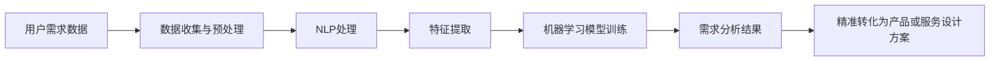

# AI驱动的需求分析：精准转化方案

> 关键词：AI、需求分析、精准转化、机器学习、自然语言处理、数据分析、方案设计

> 摘要：本文聚焦于AI驱动的需求分析精准转化方案。首先介绍了该主题的背景，包括目的、预期读者等内容。接着阐述了核心概念与联系，通过文本示意图和Mermaid流程图展示其架构。详细讲解了核心算法原理和具体操作步骤，并结合Python代码进行说明。深入探讨了数学模型和公式，通过举例加深理解。在项目实战部分，从开发环境搭建到源代码实现及解读进行了全面分析。介绍了实际应用场景，推荐了相关工具和资源，包括学习资源、开发工具框架和论文著作等。最后总结了未来发展趋势与挑战，还提供了常见问题解答和扩展阅读参考资料，旨在为读者提供全面、深入的AI驱动需求分析精准转化的知识和实践指导。

## 1. 背景介绍 
### 1.1 目的和范围
在当今数字化时代，企业面临着海量的需求信息，如何从这些繁杂的需求中准确提取有价值的信息，并将其转化为可行的产品或服务方案，是企业提高竞争力的关键。AI驱动的需求分析精准转化方案旨在利用人工智能技术，如机器学习、自然语言处理等，高效、准确地分析用户需求，实现需求到解决方案的精准转化。本方案的范围涵盖了从需求数据的收集、处理、分析到转化为具体产品或服务设计的整个过程。

### 1.2 预期读者
本文的预期读者包括企业的产品经理、项目经理、需求分析师、数据科学家以及对AI在需求分析领域应用感兴趣的技术爱好者。对于产品和项目管理人员，可借助本文了解如何利用AI技术提升需求分析的效率和准确性；数据科学家可从中获取相关算法和技术的应用思路；技术爱好者则能拓宽对AI在商业领域应用的认知。

### 1.3 文档结构概述
本文将按照以下结构展开：首先介绍核心概念与联系，明确AI驱动需求分析的基本原理和架构；接着阐述核心算法原理和具体操作步骤，结合Python代码进行详细说明；然后讲解相关的数学模型和公式，并举例说明其应用；在项目实战部分，介绍开发环境搭建、源代码实现及代码解读；之后介绍实际应用场景；推荐相关的工具和资源；最后总结未来发展趋势与挑战，提供常见问题解答和扩展阅读参考资料。

### 1.4 术语表
#### 1.4.1 核心术语定义
- **需求分析**：对用户或市场提出的需求进行收集、整理、理解和评估的过程，以确定产品或服务应具备的功能和特性。
- **AI（人工智能）**：使计算机系统能够执行通常需要人类智能才能完成的任务的技术，如学习、推理、解决问题等。
- **精准转化**：将分析得到的需求准确无误地转化为具体的产品或服务设计方案，确保满足用户的期望。
- **机器学习**：AI的一个分支，通过让计算机从数据中学习模式和规律，从而实现预测和决策。
- **自然语言处理（NLP）**：处理和分析人类语言的技术，使计算机能够理解、生成和处理自然语言文本。

#### 1.4.2 相关概念解释
- **数据标注**：为原始数据添加标签或注释，以便机器学习模型能够学习数据的特征和模式。例如，在文本数据中标记出需求的类型、优先级等信息。
- **特征工程**：从原始数据中提取和选择对模型训练有意义的特征，以提高模型的性能。比如，从用户需求文本中提取关键词、短语等作为特征。
- **模型评估**：使用特定的指标和方法来评估机器学习模型的性能，如准确率、召回率、F1值等，以确定模型的有效性和可靠性。

#### 1.4.3 缩略词列表
- **AI**：Artificial Intelligence（人工智能）
- **ML**：Machine Learning（机器学习）
- **NLP**：Natural Language Processing（自然语言处理）
- **API**：Application Programming Interface（应用程序编程接口）

## 2. 核心概念与联系 

### 核心概念原理
AI驱动的需求分析精准转化方案主要基于机器学习和自然语言处理技术。其原理是通过收集用户需求数据，利用NLP技术对文本数据进行处理，提取关键信息和特征，然后使用机器学习模型对需求进行分类、聚类和预测，最后将分析结果转化为具体的产品或服务设计方案。

例如，对于用户提交的需求文本，NLP技术可以进行分词、词性标注、命名实体识别等操作，将文本转化为计算机能够理解的格式。机器学习模型可以根据这些处理后的数据，学习需求的模式和规律，预测需求的类型、优先级等信息。

### 架构的文本示意图
以下是AI驱动的需求分析精准转化方案的架构示意图：

用户需求数据 -> 数据收集与预处理 -> NLP处理（分词、词性标注、命名实体识别等） -> 特征提取 -> 机器学习模型训练（分类、聚类、预测） -> 需求分析结果 -> 精准转化为产品或服务设计方案

### Mermaid流程图


## 3. 核心算法原理 & 具体操作步骤 

### 核心算法原理
在AI驱动的需求分析中，常用的算法包括文本分类算法、聚类算法和预测算法。

#### 文本分类算法
文本分类是将文本数据划分到不同类别的过程。常用的文本分类算法有朴素贝叶斯算法、支持向量机（SVM）和深度学习算法（如卷积神经网络CNN、循环神经网络RNN等）。

以朴素贝叶斯算法为例，其基本原理是基于贝叶斯定理，通过计算文本属于各个类别的概率，将文本分类到概率最大的类别中。贝叶斯定理的公式为：

$P(C|D)=\frac{P(D|C)P(C)}{P(D)}$

其中，$P(C|D)$ 表示在文本 $D$ 出现的情况下，属于类别 $C$ 的概率；$P(D|C)$ 表示在类别 $C$ 下文本 $D$ 出现的概率；$P(C)$ 表示类别 $C$ 出现的先验概率；$P(D)$ 表示文本 $D$ 出现的概率。

#### 聚类算法
聚类算法是将相似的文本数据划分到同一个簇中的过程。常用的聚类算法有K-Means算法、层次聚类算法等。

K-Means算法的基本原理是随机选择 $K$ 个中心点，然后将每个数据点分配到距离最近的中心点所在的簇中，接着更新中心点的位置，重复这个过程直到中心点不再变化或达到最大迭代次数。

#### 预测算法
预测算法用于预测需求的某些属性，如需求的优先级、完成时间等。常用的预测算法有线性回归、决策树、随机森林等。

以线性回归为例，其基本原理是通过找到一个线性函数来拟合数据，使得预测值与实际值之间的误差最小。线性回归的公式为：

$y = \beta_0 + \beta_1x_1 + \beta_2x_2 + \cdots + \beta_nx_n$

其中，$y$ 是预测值，$x_1, x_2, \cdots, x_n$ 是特征变量，$\beta_0, \beta_1, \cdots, \beta_n$ 是回归系数。

### 具体操作步骤
#### 数据收集与预处理
1. 收集用户需求数据，可以通过问卷调查、用户反馈、市场调研等方式获取。
2. 对收集到的数据进行清洗，去除噪声数据、重复数据等。
3. 对文本数据进行预处理，如分词、去除停用词、词干提取等。

#### 特征提取
1. 从预处理后的数据中提取特征，如关键词、短语、词频等。
2. 可以使用TF-IDF（词频 - 逆文档频率）方法来计算特征的权重，突出重要的特征。

#### 模型训练
1. 选择合适的机器学习算法，如朴素贝叶斯、SVM等。
2. 将数据集划分为训练集和测试集，一般比例为7:3或8:2。
3. 使用训练集对模型进行训练，调整模型的参数，以提高模型的性能。

#### 模型评估
1. 使用测试集对训练好的模型进行评估，计算准确率、召回率、F1值等指标。
2. 根据评估结果，对模型进行优化和调整。

#### 需求转化
1. 使用训练好的模型对新的需求数据进行分析和预测。
2. 根据分析结果，将需求转化为具体的产品或服务设计方案。

### Python源代码实现
以下是一个使用朴素贝叶斯算法进行文本分类的Python示例代码：

```python
import numpy as np
from sklearn.feature_extraction.text import TfidfVectorizer
from sklearn.naive_bayes import MultinomialNB
from sklearn.model_selection import train_test_split
from sklearn.metrics import accuracy_score

# 示例数据
documents = [
    "我想要一个功能强大的智能手机",
    "我需要一款舒适的运动鞋",
    "我希望有一个高效的办公软件",
    "我想要一件时尚的外套"
]
labels = ["电子产品", "运动用品", "软件", "服装"]

# 数据预处理和特征提取
vectorizer = TfidfVectorizer()
X = vectorizer.fit_transform(documents)

# 划分训练集和测试集
X_train, X_test, y_train, y_test = train_test_split(X, labels, test_size=0.2, random_state=42)

# 模型训练
clf = MultinomialNB()
clf.fit(X_train, y_train)

# 模型预测
y_pred = clf.predict(X_test)

# 模型评估
accuracy = accuracy_score(y_test, y_pred)
print("准确率:", accuracy)
```

## 4. 数学模型和公式 & 详细讲解 & 举例说明 

### 贝叶斯定理
贝叶斯定理的公式为：

$$P(C|D)=\frac{P(D|C)P(C)}{P(D)}$$

其中：
- $P(C|D)$：后验概率，表示在观察到数据 $D$ 的情况下，类别 $C$ 发生的概率。
- $P(D|C)$：似然概率，表示在类别 $C$ 发生的情况下，观察到数据 $D$ 的概率。
- $P(C)$：先验概率，表示类别 $C$ 发生的概率。
- $P(D)$：证据概率，表示观察到数据 $D$ 的概率。

#### 详细讲解
贝叶斯定理的核心思想是通过先验知识和新的观察数据来更新对某个事件发生概率的估计。在文本分类中，我们可以通过计算文本属于各个类别的后验概率，将文本分类到后验概率最大的类别中。

#### 举例说明
假设我们有一个文本分类问题，要将文本分为“体育”和“科技”两类。我们已经有了一些先验知识，即“体育”类别的先验概率 $P(体育)=0.6$，“科技”类别的先验概率 $P(科技)=0.4$。

现在有一篇新的文本 $D$，经过计算得到在“体育”类别下文本 $D$ 出现的似然概率 $P(D|体育)=0.8$，在“科技”类别下文本 $D$ 出现的似然概率 $P(D|科技)=0.3$。

首先计算证据概率 $P(D)$：

$P(D)=P(D|体育)P(体育)+P(D|科技)P(科技)=0.8\times0.6 + 0.3\times0.4 = 0.48 + 0.12 = 0.6$

然后计算后验概率：

$P(体育|D)=\frac{P(D|体育)P(体育)}{P(D)}=\frac{0.8\times0.6}{0.6}=0.8$

$P(科技|D)=\frac{P(D|科技)P(科技)}{P(D)}=\frac{0.3\times0.4}{0.6}=0.2$

由于 $P(体育|D)>P(科技|D)$，所以将文本 $D$ 分类为“体育”类别。

### TF-IDF公式
TF-IDF（词频 - 逆文档频率）是一种常用的特征提取方法，用于衡量一个词在文档中的重要性。其公式为：

$TF-IDF(t, d, D)=TF(t, d)\times IDF(t, D)$

其中：
- $TF(t, d)$：词频，表示词 $t$ 在文档 $d$ 中出现的频率。
- $IDF(t, D)$：逆文档频率，表示词 $t$ 在整个文档集合 $D$ 中的普遍程度。

$TF(t, d)=\frac{词 t 在文档 d 中出现的次数}{文档 d 中的总词数}$

$IDF(t, D)=\log\frac{文档集合 D 中的文档总数}{包含词 t 的文档数 + 1}$

#### 详细讲解
TF-IDF的核心思想是，如果一个词在某个文档中出现的频率很高，但在整个文档集合中出现的频率很低，那么这个词对于该文档来说是比较重要的。通过TF-IDF可以突出文档中的重要关键词。

#### 举例说明
假设我们有一个文档集合 $D$ 包含3篇文档：

文档 $d_1$：“苹果 手机 性能 好”
文档 $d_2$：“苹果 电脑 功能 强大”
文档 $d_3$：“香蕉 水果 营养 丰富”

计算词“苹果”在文档 $d_1$ 中的TF-IDF值：

- 计算词频 $TF(苹果, d_1)$：词“苹果”在文档 $d_1$ 中出现1次，文档 $d_1$ 中的总词数为4，所以 $TF(苹果, d_1)=\frac{1}{4}=0.25$。
- 计算逆文档频率 $IDF(苹果, D)$：文档集合 $D$ 中的文档总数为3，包含词“苹果”的文档数为2，所以 $IDF(苹果, D)=\log\frac{3}{2 + 1}=\log1 = 0$。
- 计算TF-IDF值：$TF-IDF(苹果, d_1, D)=TF(苹果, d_1)\times IDF(苹果, D)=0.25\times0 = 0$

### 线性回归公式
线性回归的公式为：

$$y = \beta_0 + \beta_1x_1 + \beta_2x_2 + \cdots + \beta_nx_n$$

其中：
- $y$：因变量，表示要预测的值。
- $x_1, x_2, \cdots, x_n$：自变量，表示特征变量。
- $\beta_0, \beta_1, \cdots, \beta_n$：回归系数，表示每个特征变量对因变量的影响程度。

#### 详细讲解
线性回归的目标是找到一组回归系数，使得预测值与实际值之间的误差最小。通常使用最小二乘法来求解回归系数。

#### 举例说明
假设我们要预测房价 $y$，考虑两个特征变量：房屋面积 $x_1$ 和房间数量 $x_2$。我们有以下训练数据：

| 房屋面积 $x_1$ | 房间数量 $x_2$ | 房价 $y$ |
| --- | --- | --- |
| 100 | 2 | 500 |
| 120 | 3 | 600 |
| 150 | 4 | 700 |

使用线性回归模型 $y = \beta_0 + \beta_1x_1 + \beta_2x_2$，通过最小二乘法求解回归系数 $\beta_0, \beta_1, \beta_2$。

最终得到回归方程，如 $y = 100 + 3x_1 + 50x_2$。当我们有一个新的房屋，面积为130，房间数量为3时，预测房价为：

$y = 100 + 3\times130 + 50\times3 = 100 + 390 + 150 = 640$

## 5. 项目实战：代码实际案例和详细解释说明 

### 5.1  开发环境搭建
#### 安装Python
首先，确保你已经安装了Python 3.x版本。可以从Python官方网站（https://www.python.org/downloads/）下载并安装。

#### 安装必要的库
使用以下命令安装必要的Python库：

```bash
pip install numpy pandas scikit-learn nltk
```

- `numpy`：用于数值计算。
- `pandas`：用于数据处理和分析。
- `scikit-learn`：提供了丰富的机器学习算法和工具。
- `nltk`：自然语言处理工具包。

### 5.2  源代码详细实现和代码解读
以下是一个完整的AI驱动需求分析精准转化的Python代码示例：

```python
import numpy as np
import pandas as pd
from sklearn.feature_extraction.text import TfidfVectorizer
from sklearn.naive_bayes import MultinomialNB
from sklearn.model_selection import train_test_split
from sklearn.metrics import accuracy_score
import nltk
from nltk.corpus import stopwords
from nltk.stem import PorterStemmer
import string

# 下载停用词和词干提取器所需的数据
nltk.download('stopwords')

# 数据预处理函数
def preprocess_text(text):
    # 转换为小写
    text = text.lower()
    # 去除标点符号
    text = text.translate(str.maketrans('', '', string.punctuation))
    # 分词
    tokens = text.split()
    # 去除停用词
    stop_words = set(stopwords.words('english'))
    tokens = [token for token in tokens if token not in stop_words]
    # 词干提取
    stemmer = PorterStemmer()
    tokens = [stemmer.stem(token) for token in tokens]
    # 重新组合成文本
    preprocessed_text = ' '.join(tokens)
    return preprocessed_text

# 加载数据
data = pd.read_csv('demand_data.csv')

# 数据预处理
data['preprocessed_text'] = data['demand_text'].apply(preprocess_text)

# 特征提取
vectorizer = TfidfVectorizer()
X = vectorizer.fit_transform(data['preprocessed_text'])
y = data['category']

# 划分训练集和测试集
X_train, X_test, y_train, y_test = train_test_split(X, y, test_size=0.2, random_state=42)

# 模型训练
clf = MultinomialNB()
clf.fit(X_train, y_train)

# 模型预测
y_pred = clf.predict(X_test)

# 模型评估
accuracy = accuracy_score(y_test, y_pred)
print("准确率:", accuracy)

# 精准转化示例
new_demand = "我想要一个轻便的笔记本电脑"
preprocessed_new_demand = preprocess_text(new_demand)
new_demand_vector = vectorizer.transform([preprocessed_new_demand])
predicted_category = clf.predict(new_demand_vector)[0]
print("新需求的预测类别:", predicted_category)
```

### 5.3  代码解读与分析
#### 数据预处理部分
- `preprocess_text` 函数：对文本数据进行预处理，包括转换为小写、去除标点符号、分词、去除停用词和词干提取等操作。这些操作可以减少数据的噪声，提高模型的性能。
- `data['preprocessed_text'] = data['demand_text'].apply(preprocess_text)`：对数据集中的每个需求文本应用预处理函数。

#### 特征提取部分
- `TfidfVectorizer`：使用TF-IDF方法将文本数据转换为数值特征向量。
- `X = vectorizer.fit_transform(data['preprocessed_text'])`：对预处理后的文本数据进行特征提取。

#### 模型训练和评估部分
- `train_test_split`：将数据集划分为训练集和测试集。
- `MultinomialNB`：使用朴素贝叶斯算法进行文本分类。
- `clf.fit(X_train, y_train)`：使用训练集对模型进行训练。
- `y_pred = clf.predict(X_test)`：使用测试集对模型进行预测。
- `accuracy_score(y_test, y_pred)`：计算模型的准确率。

#### 精准转化部分
- `new_demand`：新的需求文本。
- `preprocessed_new_demand = preprocess_text(new_demand)`：对新需求文本进行预处理。
- `new_demand_vector = vectorizer.transform([preprocessed_new_demand])`：将预处理后的新需求文本转换为特征向量。
- `predicted_category = clf.predict(new_demand_vector)[0]`：使用训练好的模型对新需求进行分类预测。

## 6. 实际应用场景 
### 产品研发
在产品研发过程中，AI驱动的需求分析精准转化方案可以帮助企业准确把握用户需求，提高产品的市场适应性。通过对用户反馈、市场调研等数据的分析，企业可以了解用户对产品功能、性能、外观等方面的需求，从而有针对性地进行产品设计和开发。例如，手机制造商可以通过分析用户对手机拍照功能的需求，开发出具有更好拍照效果的手机。

### 客户服务
在客户服务领域，该方案可以帮助企业快速响应客户需求，提高客户满意度。通过对客户咨询、投诉等文本数据的分析，企业可以自动识别客户问题的类型和优先级，将问题分配给合适的客服人员进行处理。同时，还可以根据客户历史需求数据，为客户提供个性化的服务和解决方案。

### 市场营销
在市场营销中，AI驱动的需求分析精准转化方案可以帮助企业制定更有效的营销策略。通过对市场需求、消费者偏好等数据的分析，企业可以了解目标客户群体的需求特点，制定针对性的广告宣传、促销活动等方案。例如，电商平台可以根据用户的购物历史和搜索记录，为用户推荐符合其需求的商品。

### 项目管理
在项目管理中，该方案可以帮助项目经理准确把握项目需求，合理安排项目进度和资源。通过对项目需求文档、用户反馈等数据的分析，项目经理可以了解项目的关键需求和风险，制定相应的应对措施。同时，还可以根据需求的优先级和重要性，合理分配项目资源，提高项目的成功率。

## 7. 工具和资源推荐
### 7.1 学习资源推荐
#### 7.1.1 书籍推荐
- 《Python机器学习》：详细介绍了Python在机器学习领域的应用，包括各种机器学习算法的原理和实现。
- 《自然语言处理入门》：适合初学者学习自然语言处理的基础知识和技术。
- 《统计学习方法》：深入讲解了机器学习的统计理论和方法，是机器学习领域的经典教材。

#### 7.1.2 在线课程
- Coursera上的“机器学习”课程：由斯坦福大学教授Andrew Ng主讲，是机器学习领域的经典课程。
- edX上的“自然语言处理”课程：提供了自然语言处理的系统学习内容。
- 阿里云天池的“AI训练营”：包含了丰富的AI实践项目和教学内容。

#### 7.1.3 技术博客和网站
- 博客园：有很多技术博主分享AI和机器学习的相关知识和经验。
- 机器之心：专注于AI领域的资讯和技术分享。
- 开源中国：提供了大量的开源项目和技术文章。

### 7.2 开发工具框架推荐
#### 7.2.1 IDE和编辑器
- PyCharm：功能强大的Python集成开发环境，提供了代码编辑、调试、版本控制等功能。
- Jupyter Notebook：交互式的开发环境，适合进行数据探索和模型实验。
- Visual Studio Code：轻量级的代码编辑器，支持多种编程语言和插件扩展。

#### 7.2.2 调试和性能分析工具
- TensorBoard：用于可视化深度学习模型的训练过程和性能指标。
- Py-Spy：用于分析Python代码的性能瓶颈。
- Scikit-learn的模型评估工具：提供了各种模型评估指标的计算方法。

#### 7.2.3 相关框架和库
- TensorFlow：开源的深度学习框架，广泛应用于图像识别、自然语言处理等领域。
- PyTorch：另一个流行的深度学习框架，具有简洁易用的特点。
- NLTK：自然语言处理工具包，提供了丰富的文本处理功能。

### 7.3 相关论文著作推荐
#### 7.3.1 经典论文
- 《A Mathematical Theory of Communication》：信息论的奠基之作，对自然语言处理和机器学习有重要影响。
- 《Support-Vector Networks》：介绍了支持向量机的原理和应用。
- 《ImageNet Classification with Deep Convolutional Neural Networks》：开创了深度学习在图像识别领域的应用。

#### 7.3.2 最新研究成果
- arXiv上关于AI和机器学习的最新论文：可以及时了解该领域的最新研究动态。
- NeurIPS、ICML等顶级学术会议的论文：代表了该领域的最高研究水平。

#### 7.3.3 应用案例分析
- 《AI in Business: Real-World Use Cases》：介绍了AI在商业领域的实际应用案例。
- 各大科技公司的技术博客：分享了他们在AI应用方面的实践经验和案例。

## 8. 总结：未来发展趋势与挑战
### 未来发展趋势
#### 更强大的模型和算法
随着深度学习技术的不断发展，未来将会出现更强大的模型和算法，能够更准确地分析和理解用户需求。例如，基于Transformer架构的模型在自然语言处理领域取得了显著的成果，未来可能会在需求分析中得到更广泛的应用。

#### 多模态需求分析
除了文本数据，未来的需求分析将越来越多地考虑多模态数据，如图像、音频、视频等。通过综合分析多种模态的数据，可以更全面地了解用户需求，提供更精准的解决方案。

#### 实时需求分析
在快速变化的市场环境中，实时需求分析将变得越来越重要。未来的系统将能够实时收集和分析用户需求数据，及时调整产品和服务策略，以满足用户的动态需求。

#### 与其他技术的融合
AI驱动的需求分析将与物联网、大数据、区块链等技术深度融合。例如，通过物联网设备收集用户的行为数据，结合需求分析结果，实现更智能化的产品和服务。

### 挑战
#### 数据质量和隐私问题
需求分析依赖于大量的数据，但数据质量参差不齐，可能存在噪声、缺失值等问题。同时，数据隐私也是一个重要的挑战，如何在保护用户隐私的前提下，合理使用数据进行需求分析是需要解决的问题。

#### 模型解释性和可解释性
深度学习模型通常是黑盒模型，其决策过程难以解释。在需求分析中，需要向用户和决策者解释模型的分析结果和决策依据，因此提高模型的解释性和可解释性是一个挑战。

#### 人才短缺
AI驱动的需求分析需要具备机器学习、自然语言处理等多方面知识的专业人才。目前，这类人才相对短缺，如何培养和吸引相关人才是企业面临的挑战之一。

#### 技术更新换代快
AI技术发展迅速，新的模型和算法不断涌现。企业需要不断跟进技术发展，及时更新和优化需求分析系统，以保持竞争力。

## 9. 附录：常见问题与解答
### 1. 如何选择合适的机器学习算法进行需求分析？
选择合适的机器学习算法需要考虑多个因素，如数据类型、数据规模、问题类型等。如果数据是文本数据，常用的算法有朴素贝叶斯、支持向量机、深度学习算法等。如果数据规模较小，可以选择简单的算法，如朴素贝叶斯；如果数据规模较大，可以考虑使用深度学习算法。

### 2. 数据预处理的步骤有哪些？
数据预处理的步骤包括数据清洗、数据转换和特征提取。数据清洗主要是去除噪声数据、重复数据等；数据转换包括将文本数据转换为数值数据、对数据进行归一化等；特征提取是从原始数据中提取对模型训练有意义的特征。

### 3. 如何评估机器学习模型的性能？
常用的评估指标包括准确率、召回率、F1值、均方误差等。对于分类问题，通常使用准确率、召回率和F1值；对于回归问题，通常使用均方误差。可以使用交叉验证等方法来评估模型的稳定性和泛化能力。

### 4. 如何解决数据不足的问题？
可以采用数据增强、迁移学习等方法来解决数据不足的问题。数据增强是通过对现有数据进行变换来生成新的数据；迁移学习是利用在其他数据集上训练好的模型，将其知识迁移到当前数据集上。

### 5. 如何确保模型的可解释性？
可以采用一些可解释性的模型，如决策树、线性回归等。此外，还可以使用模型解释工具，如LIME、SHAP等，来解释模型的决策过程。

## 10. 扩展阅读 & 参考资料
### 扩展阅读
- 《人工智能简史》：了解人工智能的发展历程和重要里程碑。
- 《AI未来进行式》：探讨人工智能对未来社会和经济的影响。
- 《智能时代》：介绍人工智能在各个领域的应用和发展趋势。

### 参考资料
- 相关学术论文和研究报告，如IEEE、ACM等学术会议和期刊上的论文。
- 各大科技公司的官方文档和技术博客，如Google、Microsoft、Facebook等。
- 开源项目的文档和代码，如TensorFlow、PyTorch等。