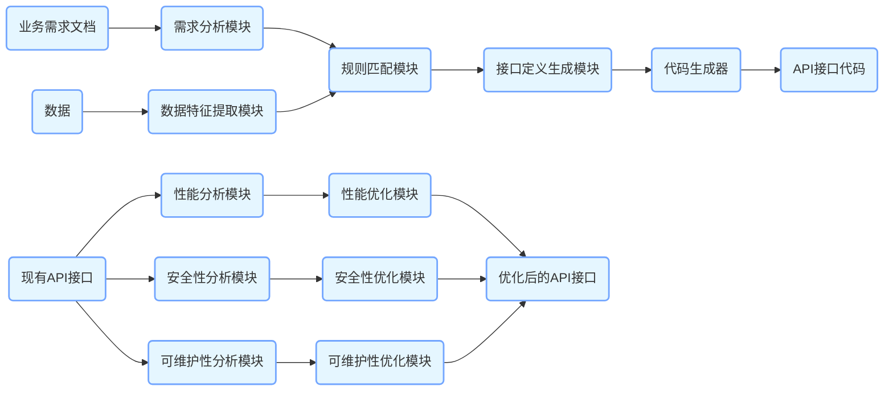

# API设计的未来：智能接口生成与优化

> 关键词：API设计、智能接口生成、接口优化、未来趋势、自动化、机器学习

> 摘要：本文深入探讨了API设计的未来发展方向，聚焦于智能接口生成与优化这两个核心方面。首先介绍了API设计在当今数字化时代的重要性以及本文的研究目的和范围。接着详细阐述了智能接口生成与优化的核心概念、原理架构，并通过Python代码示例讲解了相关算法。同时，引入数学模型和公式来加深对其本质的理解，并结合实际案例进行分析。还探讨了智能接口生成与优化在不同领域的实际应用场景，推荐了相关的学习资源、开发工具和研究论文。最后对API设计未来的发展趋势与挑战进行了总结，并提供了常见问题的解答和扩展阅读参考资料，旨在为开发者和相关从业者提供全面而深入的技术指导。

## 1. 背景介绍 

### 1.1 目的和范围
在当今数字化的时代，API（Application Programming Interface，应用程序编程接口）已经成为了软件系统之间进行交互和集成的关键桥梁。随着技术的不断发展，对API设计的要求也越来越高。本文的目的在于深入探讨API设计的未来发展方向，尤其是智能接口生成与优化这两个重要方面。通过对相关概念、算法、模型的详细分析，结合实际案例和应用场景，为开发者和企业提供全面的技术指导，帮助他们更好地应对未来API设计的挑战。

本文的范围涵盖了智能接口生成与优化的核心原理、算法实现、数学模型、实际应用等多个方面。同时，还会介绍相关的学习资源、开发工具和研究论文，以帮助读者进一步深入学习和实践。

### 1.2 预期读者
本文的预期读者主要包括以下几类人群：
- **API开发者**：希望了解API设计的最新趋势和技术，提升自己的API设计能力，掌握智能接口生成与优化的方法。
- **软件架构师**：需要在系统架构设计中考虑API的设计和优化，以提高系统的可扩展性、灵活性和性能。
- **技术管理者**：关注企业的技术发展方向，希望了解API设计的未来趋势对企业业务的影响，以便做出合理的技术决策。
- **研究人员**：对API设计、人工智能、自动化等领域的研究感兴趣，希望从本文中获取相关的研究思路和方法。

### 1.3 文档结构概述
本文将按照以下结构进行组织：
- **核心概念与联系**：介绍智能接口生成与优化的核心概念，包括其原理和架构，并通过文本示意图和Mermaid流程图进行直观展示。
- **核心算法原理 & 具体操作步骤**：详细讲解智能接口生成与优化的核心算法原理，并使用Python源代码进行具体实现和详细阐述。
- **数学模型和公式 & 详细讲解 & 举例说明**：引入相关的数学模型和公式，对智能接口生成与优化的原理进行深入分析，并通过具体的例子进行说明。
- **项目实战：代码实际案例和详细解释说明**：通过一个实际的项目案例，展示智能接口生成与优化的具体实现过程，包括开发环境搭建、源代码实现和代码解读。
- **实际应用场景**：探讨智能接口生成与优化在不同领域的实际应用场景，如金融、医疗、电商等。
- **工具和资源推荐**：推荐相关的学习资源、开发工具和研究论文，帮助读者进一步深入学习和实践。
- **总结：未来发展趋势与挑战**：对API设计未来的发展趋势进行总结，并分析可能面临的挑战。
- **附录：常见问题与解答**：提供常见问题的解答，帮助读者解决在学习和实践过程中遇到的问题。
- **扩展阅读 & 参考资料**：提供相关的扩展阅读资料和参考文献，方便读者进一步深入研究。

### 1.4 术语表

#### 1.4.1 核心术语定义
- **API（Application Programming Interface）**：应用程序编程接口，是一组定义了软件组件之间如何交互的规则和协议。
- **智能接口生成**：利用人工智能技术自动生成API接口的过程，通过分析业务需求和数据特征，生成符合规范和要求的接口定义。
- **接口优化**：对已有的API接口进行性能、安全性、可维护性等方面的优化，以提高接口的质量和效率。
- **机器学习**：一门多领域交叉学科，涉及概率论、统计学、逼近论、凸分析、算法复杂度理论等多门学科。它专门研究计算机怎样模拟或实现人类的学习行为，以获取新的知识或技能，重新组织已有的知识结构使之不断改善自身的性能。
- **自动化**：是指机器设备、系统或过程（生产、管理过程）在没有人或较少人的直接参与下，按照人的要求，经过自动检测、信息处理、分析判断、操纵控制，实现预期的目标的过程。

#### 1.4.2 相关概念解释
- **API设计模式**：在API设计过程中总结出来的一些通用的设计方法和原则，如RESTful API设计模式、GraphQL API设计模式等。
- **API网关**：是一种位于应用程序和后端服务之间的中间层，用于处理API请求、路由、认证、限流等功能。
- **代码生成器**：一种工具，用于根据特定的规则和模板自动生成代码，在API设计中可以用于生成接口定义代码、客户端代码等。

#### 1.4.3 缩略词列表
- **REST**：Representational State Transfer，表述性状态转移，是一种软件架构风格，常用于设计Web API。
- **JSON**：JavaScript Object Notation，一种轻量级的数据交换格式，常用于API数据传输。
- **XML**：eXtensible Markup Language，可扩展标记语言，也是一种常用的数据交换格式。

## 2. 核心概念与联系 

### 智能接口生成的原理
智能接口生成的核心原理是利用机器学习和自然语言处理技术，对业务需求和数据特征进行分析和理解，然后根据预定义的规则和模板自动生成API接口的定义。具体来说，它包括以下几个步骤：
1. **需求分析**：通过自然语言处理技术对业务需求文档进行解析，提取关键信息，如接口名称、参数、返回值等。
2. **数据特征提取**：对相关的数据进行分析，提取数据的结构、类型、关系等特征，为接口的设计提供依据。
3. **规则匹配**：根据预定义的规则和模板，将需求分析和数据特征提取的结果进行匹配，生成符合规范的接口定义。
4. **代码生成**：根据生成的接口定义，使用代码生成器生成具体的代码实现。

### 接口优化的原理
接口优化的原理是通过对API接口的性能、安全性、可维护性等方面进行分析和评估，找出存在的问题，并采取相应的措施进行优化。具体来说，它包括以下几个方面：
1. **性能优化**：通过优化算法、缓存机制、数据库查询等方式，提高接口的响应速度和吞吐量。
2. **安全性优化**：通过身份认证、授权、数据加密等方式，保障接口的安全性。
3. **可维护性优化**：通过遵循良好的编码规范、设计模式，提高接口的可读性和可维护性。

### 核心概念的架构
以下是智能接口生成与优化的架构示意图：



从这个架构图可以看出，智能接口生成主要包括需求分析、数据特征提取、规则匹配、接口定义生成和代码生成等环节；而接口优化则包括性能分析、安全性分析、可维护性分析以及相应的优化模块。

## 3. 核心算法原理 & 具体操作步骤 

### 智能接口生成的核心算法

#### 自然语言处理算法用于需求分析
在需求分析阶段，我们可以使用自然语言处理算法来解析业务需求文档。这里以Python的`nltk`库为例，介绍如何进行文本分词和词性标注：

```python
import nltk
from nltk.tokenize import word_tokenize
from nltk import pos_tag

nltk.download('punkt')
nltk.download('averaged_perceptron_tagger')

# 示例业务需求文档
requirement = "创建一个用户注册接口，接收用户名和密码作为参数，返回注册结果。"

# 分词
tokens = word_tokenize(requirement)

# 词性标注
pos_tags = pos_tag(tokens)

print("分词结果:", tokens)
print("词性标注结果:", pos_tags)
```

#### 规则匹配算法
规则匹配算法用于将需求分析和数据特征提取的结果与预定义的规则和模板进行匹配，生成接口定义。以下是一个简单的规则匹配示例：

```python
# 预定义的规则和模板
rules = {
    "创建一个用户注册接口": {
        "name": "user_register",
        "parameters": ["username", "password"],
        "return_value": "registration_result"
    }
}

# 根据需求匹配规则
matched_rule = None
for key in rules.keys():
    if key in requirement:
        matched_rule = rules[key]
        break

if matched_rule:
    print("匹配到的规则:", matched_rule)
else:
    print("未匹配到规则")
```

### 接口优化的核心算法

#### 性能优化算法 - 缓存机制
缓存机制是一种常用的性能优化方法，通过将经常访问的数据存储在缓存中，减少对数据库的访问次数。以下是一个使用Python的`functools.lru_cache`实现简单缓存的示例：

```python
import functools

@functools.lru_cache(maxsize=128)
def get_user_info(user_id):
    # 模拟从数据库中获取用户信息
    print(f"从数据库中获取用户 {user_id} 的信息")
    return f"用户 {user_id} 的信息"

# 第一次调用，会从数据库中获取信息
print(get_user_info(1))

# 第二次调用，会从缓存中获取信息
print(get_user_info(1))
```

#### 安全性优化算法 - 身份认证
身份认证是保障接口安全性的重要手段，以下是一个简单的基于Token的身份认证示例：

```python
import hashlib
import time

# 生成Token
def generate_token(user_id, secret_key):
    timestamp = str(int(time.time()))
    token_str = f"{user_id}{timestamp}{secret_key}"
    token = hashlib.sha256(token_str.encode()).hexdigest()
    return token

# 验证Token
def verify_token(user_id, token, secret_key):
    new_token = generate_token(user_id, secret_key)
    return new_token == token

# 示例
user_id = 1
secret_key = "my_secret_key"
token = generate_token(user_id, secret_key)

print("生成的Token:", token)
print("验证结果:", verify_token(user_id, token, secret_key))
```

### 具体操作步骤

#### 智能接口生成的操作步骤
1. **准备业务需求文档和相关数据**：收集业务需求文档，并整理相关的数据。
2. **进行需求分析和数据特征提取**：使用自然语言处理算法对需求文档进行解析，提取关键信息；对数据进行分析，提取数据特征。
3. **进行规则匹配**：将需求分析和数据特征提取的结果与预定义的规则和模板进行匹配，生成接口定义。
4. **生成代码**：根据生成的接口定义，使用代码生成器生成具体的代码实现。

#### 接口优化的操作步骤
1. **对现有API接口进行分析**：使用性能分析工具、安全性分析工具和可维护性分析工具对现有API接口进行评估。
2. **找出存在的问题**：根据分析结果，找出接口在性能、安全性、可维护性等方面存在的问题。
3. **采取相应的优化措施**：针对存在的问题，采取性能优化、安全性优化、可维护性优化等措施。
4. **测试和验证**：对优化后的接口进行测试和验证，确保优化效果符合预期。

## 4. 数学模型和公式 & 详细讲解 & 举例说明 

### 智能接口生成的数学模型

#### 需求分析的向量空间模型
在需求分析阶段，我们可以使用向量空间模型将业务需求文档表示为向量。假设我们有一个包含 $n$ 个关键词的词汇表 $V = \{w_1, w_2, \cdots, w_n\}$，对于一个业务需求文档 $d$，我们可以计算每个关键词在文档中的词频 $tf_{i,d}$ 和逆文档频率 $idf_i$，然后将文档表示为一个 $n$ 维向量 $\mathbf{v}_d = [tf_{1,d} \times idf_1, tf_{2,d} \times idf_2, \cdots, tf_{n,d} \times idf_n]$。

词频 $tf_{i,d}$ 表示关键词 $w_i$ 在文档 $d$ 中出现的次数，逆文档频率 $idf_i$ 计算公式为：

$$idf_i = \log \frac{N}{df_i}$$

其中，$N$ 是文档集合的总数，$df_i$ 是包含关键词 $w_i$ 的文档数。

以下是一个简单的Python示例，演示如何使用向量空间模型表示文档：

```python
import math
from collections import Counter

# 示例文档集合
documents = [
    "创建一个用户注册接口，接收用户名和密码作为参数，返回注册结果。",
    "创建一个用户登录接口，接收用户名和密码作为参数，返回登录结果。"
]

# 构建词汇表
vocab = set()
for doc in documents:
    tokens = doc.split()
    vocab.update(tokens)

vocab = sorted(vocab)

# 计算词频和逆文档频率
N = len(documents)
idf = {}
for term in vocab:
    df = sum(term in doc for doc in documents)
    idf[term] = math.log(N / df)

# 表示文档为向量
document_vectors = []
for doc in documents:
    counter = Counter(doc.split())
    vector = [counter[term] * idf[term] for term in vocab]
    document_vectors.append(vector)

print("词汇表:", vocab)
print("文档向量:", document_vectors)
```

#### 规则匹配的相似度计算模型
在规则匹配阶段，我们可以使用余弦相似度来计算需求文档向量和规则模板向量之间的相似度。余弦相似度的计算公式为：

$$\cos(\mathbf{v}_1, \mathbf{v}_2) = \frac{\mathbf{v}_1 \cdot \mathbf{v}_2}{\|\mathbf{v}_1\| \|\mathbf{v}_2\|}$$

其中，$\mathbf{v}_1$ 和 $\mathbf{v}_2$ 是两个向量，$\cdot$ 表示向量的点积，$\|\mathbf{v}\|$ 表示向量的模。

以下是一个简单的Python示例，演示如何计算余弦相似度：

```python
import numpy as np

def cosine_similarity(v1, v2):
    v1 = np.array(v1)
    v2 = np.array(v2)
    dot_product = np.dot(v1, v2)
    norm_v1 = np.linalg.norm(v1)
    norm_v2 = np.linalg.norm(v2)
    return dot_product / (norm_v1 * norm_v2)

# 示例向量
v1 = [1, 2, 3]
v2 = [4, 5, 6]

similarity = cosine_similarity(v1, v2)
print("余弦相似度:", similarity)
```

### 接口优化的数学模型

#### 性能优化的排队论模型
在性能优化中，排队论模型可以用于分析接口的响应时间和吞吐量。假设接口的请求到达服从泊松分布，服务时间服从指数分布，我们可以使用 $M/M/1$ 排队模型来计算系统的平均响应时间 $W$ 和平均队列长度 $L$。

$M/M/1$ 排队模型的相关公式如下：

- 系统的利用率 $\rho = \frac{\lambda}{\mu}$，其中 $\lambda$ 是请求的到达率，$\mu$ 是服务率。
- 平均队列长度 $L = \frac{\rho^2}{1 - \rho}$
- 平均响应时间 $W = \frac{1}{\mu - \lambda}$

以下是一个简单的Python示例，演示如何使用排队论模型计算平均响应时间和平均队列长度：

```python
# 示例参数
lambda_ = 2  # 请求到达率
mu = 3  # 服务率

# 计算系统利用率
rho = lambda_ / mu

# 计算平均队列长度
L = rho ** 2 / (1 - rho)

# 计算平均响应时间
W = 1 / (mu - lambda_)

print("系统利用率:", rho)
print("平均队列长度:", L)
print("平均响应时间:", W)
```

### 举例说明

#### 智能接口生成的举例
假设我们有一个业务需求文档：“创建一个商品查询接口，接收商品ID作为参数，返回商品信息。”

1. **需求分析**：使用向量空间模型将需求文档表示为向量，然后与预定义的规则模板向量进行相似度计算。
2. **规则匹配**：假设我们有一个规则模板：“创建一个商品查询接口，接收商品ID作为参数，返回商品信息。”，通过计算相似度，发现需求文档与该规则模板的相似度很高，匹配成功。
3. **接口定义生成**：根据匹配到的规则模板，生成接口定义，如接口名称为`product_query`，参数为`product_id`，返回值为`product_info`。
4. **代码生成**：使用代码生成器生成具体的代码实现，如以下Python Flask示例：

```python
from flask import Flask, request, jsonify

app = Flask(__name__)

@app.route('/product_query', methods=['GET'])
def product_query():
    product_id = request.args.get('product_id')
    # 模拟从数据库中获取商品信息
    product_info = f"商品 {product_id} 的信息"
    return jsonify({"product_info": product_info})

if __name__ == '__main__':
    app.run(debug=True)
```

#### 接口优化的举例
假设我们有一个API接口，其请求到达率为 $\lambda = 10$ 次/秒，服务率为 $\mu = 15$ 次/秒。

1. **性能分析**：使用排队论模型计算系统的平均响应时间和平均队列长度。
    - 系统利用率 $\rho = \frac{\lambda}{\mu} = \frac{10}{15} = \frac{2}{3}$
    - 平均队列长度 $L = \frac{\rho^2}{1 - \rho} = \frac{(\frac{2}{3})^2}{1 - \frac{2}{3}} = \frac{4}{3}$
    - 平均响应时间 $W = \frac{1}{\mu - \lambda} = \frac{1}{15 - 10} = 0.2$ 秒

2. **性能优化**：为了降低平均响应时间和平均队列长度，我们可以增加服务率 $\mu$，例如通过优化算法、增加服务器资源等方式。假设我们将服务率提高到 $\mu = 20$ 次/秒。
    - 系统利用率 $\rho = \frac{\lambda}{\mu} = \frac{10}{20} = \frac{1}{2}$
    - 平均队列长度 $L = \frac{\rho^2}{1 - \rho} = \frac{(\frac{1}{2})^2}{1 - \frac{1}{2}} = \frac{1}{2}$
    - 平均响应时间 $W = \frac{1}{\mu - \lambda} = \frac{1}{20 - 10} = 0.1$ 秒

通过优化，平均队列长度和平均响应时间都得到了显著降低。

## 5. 项目实战：代码实际案例和详细解释说明 

### 5.1  开发环境搭建
在这个项目实战中，我们将使用Python和Flask框架来实现一个简单的API接口，并进行智能接口生成和优化。以下是开发环境搭建的步骤：

1. **安装Python**：从Python官方网站（https://www.python.org/downloads/）下载并安装Python 3.x版本。
2. **创建虚拟环境**：打开命令行工具，进入项目目录，使用以下命令创建虚拟环境：
```sh
python -m venv myenv
```
3. **激活虚拟环境**：
- 在Windows系统上，使用以下命令激活虚拟环境：
```sh
myenv\Scripts\activate
```
- 在Linux或Mac系统上，使用以下命令激活虚拟环境：
```sh
source myenv/bin/activate
```
4. **安装依赖库**：使用以下命令安装Flask和其他必要的库：
```sh
pip install flask nltk
```

### 5.2  源代码详细实现和代码解读

#### 智能接口生成
以下是一个简单的智能接口生成的示例代码：

```python
import nltk
from nltk.tokenize import word_tokenize
from nltk import pos_tag
from flask import Flask, request, jsonify

nltk.download('punkt')
nltk.download('averaged_perceptron_tagger')

app = Flask(__name__)

# 预定义的规则和模板
rules = {
    "创建一个用户注册接口": {
        "name": "user_register",
        "parameters": ["username", "password"],
        "return_value": "registration_result"
    }
}

# 需求分析函数
def analyze_requirement(requirement):
    tokens = word_tokenize(requirement)
    pos_tags = pos_tag(tokens)
    return tokens, pos_tags

# 规则匹配函数
def match_rule(requirement):
    matched_rule = None
    for key in rules.keys():
        if key in requirement:
            matched_rule = rules[key]
            break
    return matched_rule

# 接口生成函数
def generate_interface(matched_rule):
    if matched_rule:
        interface_code = f"""
@app.route('/{matched_rule["name"]}', methods=['POST'])
def {matched_rule["name"]}():
    {', '.join([f'{param} = request.json.get("{param}")' for param in matched_rule["parameters"]])}
    # 模拟业务逻辑
    result = "{matched_rule["return_value"]}"
    return jsonify({{"{matched_rule["return_value"]}": result}})
"""
        return interface_code
    return None

# 主路由
@app.route('/generate_interface', methods=['POST'])
def generate():
    requirement = request.json.get('requirement')
    tokens, pos_tags = analyze_requirement(requirement)
    matched_rule = match_rule(requirement)
    interface_code = generate_interface(matched_rule)
    if interface_code:
        return jsonify({"interface_code": interface_code})
    return jsonify({"error": "未匹配到规则"})

if __name__ == '__main__':
    app.run(debug=True)
```

**代码解读**：
- `analyze_requirement`函数：使用`nltk`库对需求文档进行分词和词性标注。
- `match_rule`函数：将需求文档与预定义的规则和模板进行匹配，找出匹配的规则。
- `generate_interface`函数：根据匹配到的规则生成接口代码。
- 主路由`/generate_interface`：接收需求文档，调用上述函数进行需求分析、规则匹配和接口生成，并返回生成的接口代码。

#### 接口优化
以下是一个简单的接口优化的示例代码，使用缓存机制提高接口性能：

```python
import functools
from flask import Flask, request, jsonify

app = Flask(__name__)

# 模拟数据库
database = {
    1: "用户1的信息",
    2: "用户2的信息"
}

# 带有缓存的用户信息获取函数
@functools.lru_cache(maxsize=128)
def get_user_info(user_id):
    print(f"从数据库中获取用户 {user_id} 的信息")
    return database.get(user_id)

# 用户信息查询接口
@app.route('/user_info', methods=['GET'])
def user_info():
    user_id = int(request.args.get('user_id'))
    info = get_user_info(user_id)
    if info:
        return jsonify({"user_info": info})
    return jsonify({"error": "用户信息不存在"})

if __name__ == '__main__':
    app.run(debug=True)
```

**代码解读**：
- `get_user_info`函数：使用`functools.lru_cache`装饰器实现缓存机制，避免重复从数据库中获取相同的用户信息。
- 用户信息查询接口`/user_info`：接收用户ID作为参数，调用`get_user_info`函数获取用户信息，并返回结果。

### 5.3  代码解读与分析

#### 智能接口生成代码分析
- **优点**：
    - 代码结构清晰，将需求分析、规则匹配和接口生成等功能模块化，易于维护和扩展。
    - 使用`nltk`库进行自然语言处理，能够对需求文档进行基本的解析。
    - 通过预定义的规则和模板，能够快速生成符合规范的接口代码。
- **缺点**：
    - 规则和模板的定义比较简单，对于复杂的业务需求可能无法准确匹配。
    - 缺乏对需求文档的深度理解，只能进行简单的关键词匹配。

#### 接口优化代码分析
- **优点**：
    - 使用缓存机制有效地减少了对数据库的访问次数，提高了接口的性能。
    - `functools.lru_cache`装饰器使用简单，无需额外的配置。
- **缺点**：
    - 缓存的更新机制比较简单，当数据库中的数据发生变化时，缓存不会自动更新。
    - 缓存的大小是固定的，当缓存达到最大容量时，可能会出现缓存淘汰的情况。

## 6. 实际应用场景 

### 金融领域
在金融领域，API接口的设计和优化至关重要。智能接口生成可以根据金融业务的需求，如账户查询、交易处理等，自动生成相应的API接口，提高开发效率。接口优化可以通过性能优化和安全性优化，保障金融交易的快速性和安全性。例如，银行可以使用智能接口生成技术快速开发新的理财产品查询接口，同时通过接口优化技术提高接口的响应速度和数据安全性。

### 医疗领域
医疗领域的数据安全和隐私保护要求较高，API接口的设计需要严格遵守相关法规和标准。智能接口生成可以根据医疗业务的需求，如病历查询、诊断结果获取等，生成符合规范的API接口。接口优化可以通过安全性优化，保障医疗数据的隐私和安全。例如，医院可以使用智能接口生成技术开发电子病历查询接口，同时通过接口优化技术对接口进行加密和身份认证。

### 电商领域
电商领域的业务变化频繁，需要快速开发和迭代API接口。智能接口生成可以根据电商业务的需求，如商品查询、订单处理等，自动生成相应的API接口，缩短开发周期。接口优化可以通过性能优化，提高接口的响应速度和吞吐量，提升用户体验。例如，电商平台可以使用智能接口生成技术快速开发新的促销活动接口，同时通过接口优化技术提高接口的性能。

### 物联网领域
物联网领域涉及大量的设备和数据，API接口的设计需要考虑设备的多样性和数据的实时性。智能接口生成可以根据物联网业务的需求，如设备状态查询、数据采集等，生成适应不同设备的API接口。接口优化可以通过性能优化和可维护性优化，保障物联网系统的稳定性和可靠性。例如，智能家居系统可以使用智能接口生成技术开发设备控制接口，同时通过接口优化技术提高接口的性能和可维护性。

## 7. 工具和资源推荐

### 7.1 学习资源推荐

#### 7.1.1 书籍推荐
- 《RESTful API 设计实战》：本书详细介绍了RESTful API的设计原则、方法和实践案例，对于学习API设计有很大的帮助。
- 《Python自然语言处理》：介绍了Python在自然语言处理领域的应用，包括文本分词、词性标注、命名实体识别等技术，对于理解智能接口生成中的需求分析部分很有帮助。
- 《机器学习实战》：通过实际案例介绍了机器学习的基本算法和应用，对于理解智能接口生成中的规则匹配和预测部分有很大的帮助。

#### 7.1.2 在线课程
- Coursera上的“API Design and Development Specialization”：由专业的讲师讲解API设计和开发的相关知识，包括RESTful API设计、GraphQL API设计等。
- edX上的“Natural Language Processing with Python and NLTK”：介绍了使用Python和NLTK库进行自然语言处理的方法和技术。
- Udemy上的“Machine Learning A-Z™: Hands-On Python & R In Data Science”：涵盖了机器学习的各种算法和应用，通过实际案例进行讲解。

#### 7.1.3 技术博客和网站
- API Evangelist（https://apievangelist.com/）：提供了丰富的API设计和开发的案例、趋势和技术文章。
- Stack Overflow（https://stackoverflow.com/）：一个技术问答社区，你可以在上面找到关于API设计和开发的各种问题和解决方案。
- Medium上的“API Design”主题：有很多开发者分享的API设计和开发的经验和技巧。

### 7.2 开发工具框架推荐

#### 7.2.1 IDE和编辑器
- PyCharm：一款专业的Python集成开发环境，提供了代码编辑、调试、版本控制等功能，对于Python开发非常方便。
- Visual Studio Code：一款轻量级的代码编辑器，支持多种编程语言，通过安装插件可以实现丰富的功能，如代码高亮、代码自动补全、调试等。

#### 7.2.2 调试和性能分析工具
- Postman：一款强大的API调试工具，可以发送各种类型的HTTP请求，查看请求和响应的详细信息，对于API开发和调试非常有用。
- New Relic：一款性能分析工具，可以实时监控API接口的性能指标，如响应时间、吞吐量、错误率等，帮助开发者找出性能瓶颈。

#### 7.2.3 相关框架和库
- Flask：一个轻量级的Python Web框架，易于学习和使用，适合快速开发API接口。
- Django REST framework：基于Django框架的RESTful API开发框架，提供了丰富的功能和工具，如序列化、视图集、权限认证等。
- NLTK：Python的自然语言处理库，提供了丰富的自然语言处理工具和数据集，如分词、词性标注、命名实体识别等。

### 7.3 相关论文著作推荐

#### 7.3.1 经典论文
- “Architectural Styles and the Design of Network-based Software Architectures”：介绍了REST架构风格的概念和原则，是RESTful API设计的经典论文。
- “Natural Language Processing: An Introduction”：对自然语言处理的基本概念、技术和应用进行了全面的介绍。
- “Machine Learning: A Probabilistic Perspective”：从概率的角度介绍了机器学习的基本算法和理论。

#### 7.3.2 最新研究成果
- 可以通过IEEE Xplore、ACM Digital Library等学术数据库搜索关于API设计、智能接口生成、接口优化等方面的最新研究成果。

#### 7.3.3 应用案例分析
- 一些知名企业的技术博客会分享他们在API设计和开发方面的应用案例，如Google、Facebook、Amazon等，可以从中学习到实际的经验和技巧。

## 8. 总结：未来发展趋势与挑战

### 未来发展趋势

#### 智能化程度不断提高
未来，智能接口生成与优化技术将不断发展，智能化程度将不断提高。机器学习和自然语言处理技术将更加成熟，能够对业务需求进行更深入的理解和分析，生成更加准确和复杂的API接口。同时，接口优化也将更加智能化，能够自动识别和解决接口存在的问题。

#### 与人工智能的深度融合
API设计将与人工智能技术深度融合，例如使用深度学习模型进行需求预测和接口优化。通过对大量的历史数据进行学习，预测用户的需求，提前生成相应的API接口，提高系统的响应速度和用户体验。

#### 标准化和规范化
随着API的广泛应用，标准化和规范化将成为未来的发展趋势。行业将制定更加统一的API设计标准和规范，提高API的互操作性和可维护性。同时，API的文档和测试也将更加标准化，方便开发者使用和维护。

#### 云原生API设计
云原生技术的发展将推动API设计向云原生方向发展。云原生API设计将更加注重容器化、微服务化和自动化，提高API的部署和管理效率。同时，云原生API设计也将更加注重安全性和可靠性，保障系统的稳定运行。

### 挑战

#### 数据质量和安全问题
智能接口生成与优化需要大量的高质量数据作为支撑，数据的质量和安全问题将成为一个挑战。数据的准确性、完整性和一致性将直接影响智能接口生成和优化的效果。同时，数据的安全问题也需要得到重视，防止数据泄露和滥用。

#### 技术复杂度和人才短缺
智能接口生成与优化涉及到机器学习、自然语言处理、软件开发等多个领域的技术，技术复杂度较高。目前，相关领域的专业人才短缺，这将限制智能接口生成与优化技术的发展和应用。

#### 兼容性和互操作性问题
随着API的广泛应用，不同系统和平台之间的兼容性和互操作性问题将越来越突出。如何确保API在不同系统和平台之间的兼容性和互操作性，是一个需要解决的挑战。

#### 法律法规和合规性问题
API的设计和使用需要遵守相关的法律法规和合规性要求，如数据保护法、隐私法等。如何确保API的设计和使用符合法律法规和合规性要求，是一个需要考虑的问题。

## 9. 附录：常见问题与解答

### 智能接口生成的准确性如何保证？
智能接口生成的准确性可以通过以下几个方面来保证：
- **高质量的训练数据**：使用大量的高质量的业务需求文档和接口定义作为训练数据，让机器学习模型学习到更多的模式和规则。
- **多维度的特征提取**：除了关键词匹配，还可以提取更多的特征，如语义特征、语法特征等，提高对需求文档的理解和分析能力。
- **人工审核和调整**：在生成接口定义后，进行人工审核和调整，确保接口定义符合业务需求和规范。

### 接口优化是否会影响接口的稳定性？
接口优化一般不会影响接口的稳定性，反而可以提高接口的稳定性。通过性能优化可以减少接口的响应时间和错误率，提高接口的可用性；通过安全性优化可以保障接口的安全性，防止接口被攻击和滥用。但是，在进行接口优化时，需要进行充分的测试和验证，确保优化措施不会引入新的问题。

### 如何选择适合的API设计模式？
选择适合的API设计模式需要考虑以下几个因素：
- **业务需求**：根据业务需求的特点和复杂度，选择合适的API设计模式。例如，如果业务需求比较简单，可以选择RESTful API设计模式；如果业务需求比较复杂，需要进行灵活的查询和数据获取，可以选择GraphQL API设计模式。
- **系统架构**：考虑系统的架构和设计，选择与系统架构相匹配的API设计模式。例如，如果系统采用微服务架构，可以选择RESTful API设计模式，方便各个微服务之间的通信和集成。
- **开发团队的技术栈**：考虑开发团队的技术栈和经验，选择开发团队熟悉和擅长的API设计模式。例如，如果开发团队熟悉Python和Flask框架，可以选择RESTful API设计模式，使用Flask框架进行开发。

### 智能接口生成与优化技术是否适用于所有类型的API？
智能接口生成与优化技术适用于大多数类型的API，但并不是适用于所有类型的API。对于一些特殊类型的API，如实时性要求很高的API、对安全性要求极高的API等，可能需要进行特殊的设计和优化。同时，智能接口生成与优化技术也需要根据具体的业务需求和场景进行调整和优化，不能一概而论。

## 10. 扩展阅读 & 参考资料

### 扩展阅读
- 《API Security in Action》：深入介绍了API安全的相关知识和技术，包括身份认证、授权、数据加密等。
- 《GraphQL in Action》：详细介绍了GraphQL API的设计和开发，包括GraphQL的语法、查询、突变等。
- 《Microservices Patterns: With Examples in Java》：介绍了微服务架构的设计模式和实践经验，对于理解API在微服务架构中的应用有很大的帮助。

### 参考资料
- RESTful API Tutorial（https://www.restapitutorial.com/）
- GraphQL官方文档（https://graphql.org/learn/）
- Python官方文档（https://docs.python.org/3/）
- NLTK官方文档（https://www.nltk.org/）
- Flask官方文档（https://flask.palletsprojects.com/）
- Django REST framework官方文档（https://www.django-rest-framework.org/）