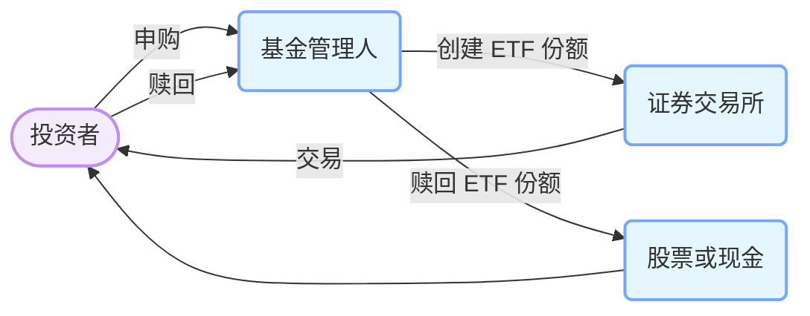
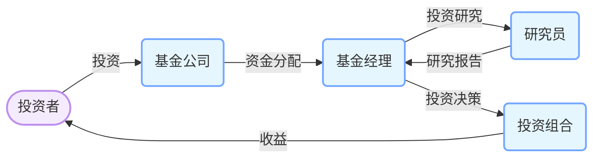

# ETF vs 主动管理基金：哪个更适合当前市场

> 关键词：ETF、主动管理基金、市场环境、投资策略、风险收益特征

> 摘要：本文旨在深入探讨 ETF（交易型开放式指数基金）与主动管理基金在当前市场环境下的适用性。通过对两者核心概念、算法原理、数学模型、实际案例等多方面的分析，对比它们的特点与优劣，帮助投资者更好地理解这两种投资工具，从而根据自身需求和市场状况做出更合适的投资决策。

## 1. 背景介绍 
### 1.1 目的和范围
随着金融市场的不断发展，ETF 和主动管理基金成为投资者广泛关注的两种投资工具。本文章的目的在于全面、深入地比较这两种基金在当前市场环境下的特点和适用性，分析它们的投资策略、风险收益特征等，为投资者提供有价值的参考。文章的范围涵盖了 ETF 和主动管理基金的基本概念、运作原理、数学模型、实际应用案例以及未来发展趋势等多个方面。

### 1.2 预期读者
本文预期读者包括对金融投资有一定了解的个人投资者、金融从业者、投资研究人员以及对金融市场感兴趣的相关人士。无论您是初涉投资领域，还是希望进一步深入了解 ETF 和主动管理基金的专业人士，都能从本文中获取有价值的信息。

### 1.3 文档结构概述
本文将按照以下结构进行阐述：首先介绍 ETF 和主动管理基金的核心概念与联系，包括它们的原理和架构；接着深入探讨核心算法原理和具体操作步骤，并结合数学模型和公式进行详细讲解；然后通过项目实战案例，展示两者在实际应用中的表现；之后分析它们的实际应用场景；再推荐相关的学习资源、开发工具框架和论文著作；最后总结未来发展趋势与挑战，并提供常见问题解答和扩展阅读参考资料。

### 1.4 术语表
#### 1.4.1 核心术语定义
- **ETF（交易型开放式指数基金）**：一种在交易所上市交易的、基金份额可变的开放式基金，它通常跟踪特定的指数，如股票指数、债券指数等，试图复制指数的表现。
- **主动管理基金**：由基金经理主动进行投资决策，通过深入研究和分析市场、行业和公司等，试图超越市场平均表现，获取超额收益的基金。

#### 1.4.2 相关概念解释
- **跟踪误差**：ETF 与所跟踪指数之间的收益率差异，反映了 ETF 复制指数表现的准确程度。
- **阿尔法（α）**：衡量主动管理基金经理投资能力的指标，表示基金超越市场基准的超额收益。
- **贝塔（β）**：衡量基金相对于市场波动的敏感度，反映基金的系统性风险。

#### 1.4.3 缩略词列表
- **ETF**：Exchange Traded Fund（交易型开放式指数基金）
- **CAPM**：Capital Asset Pricing Model（资本资产定价模型）

## 2. 核心概念与联系 

### 2.1 ETF 的核心概念与原理
ETF 是一种特殊的开放式基金，它结合了封闭式基金和开放式基金的特点。一方面，它可以像封闭式基金一样在交易所上市交易，投资者可以在二级市场买卖 ETF 份额；另一方面，它又像开放式基金一样，可以进行申购和赎回。ETF 的投资策略主要是跟踪特定的指数，通过购买指数成分股或其他相关资产，尽可能准确地复制指数的表现。

ETF 的架构通常包括基金管理人、托管人、证券公司等参与方。基金管理人负责基金的投资管理和运作，托管人负责保管基金资产，证券公司则为投资者提供交易渠道。

下面是 ETF 运作原理的 Mermaid 流程图：


### 2.2 主动管理基金的核心概念与原理
主动管理基金由基金经理根据自己的投资判断和研究分析，主动选择投资标的和投资时机，试图超越市场平均表现，获取超额收益。基金经理会对宏观经济、行业发展、公司基本面等进行深入研究，通过构建投资组合来实现基金的投资目标。

主动管理基金的架构主要包括基金公司、基金经理、研究员等。基金公司负责基金的运营和管理，基金经理负责投资决策，研究员则为基金经理提供研究支持。

下面是主动管理基金运作原理的 Mermaid 流程图：


### 2.3 ETF 与主动管理基金的联系
ETF 和主动管理基金都是基金的一种形式，它们的投资者都是将资金交给专业的机构或个人进行管理，以实现资产的增值。此外，它们都受到金融监管机构的监管，需要遵守相关的法律法规和投资限制。

然而，两者也存在明显的区别。ETF 主要是被动跟踪指数，投资策略相对固定，而主动管理基金则依赖基金经理的主动决策，投资策略更加灵活。ETF 的费用通常较低，而主动管理基金由于需要支付基金经理的研究和管理费用，费用相对较高。

## 3. 核心算法原理 & 具体操作步骤 

### 3.1 ETF 的核心算法原理及操作步骤
#### 3.1.1 核心算法原理
ETF 的核心算法原理是通过复制指数的成分股及其权重，来实现对指数的跟踪。常见的复制方法有完全复制法和抽样复制法。

完全复制法是指 ETF 按照指数的成分股及其权重，全部买入指数的成分股，以实现对指数的精确跟踪。抽样复制法是指 ETF 只买入指数成分股中的一部分股票，通过合理的抽样和权重调整，来近似复制指数的表现。

#### 3.1.2 具体操作步骤
以下是使用 Python 实现简单的完全复制法的示例代码：
```python
import pandas as pd

# 假设这是指数的成分股及其权重
index_components = {
    'stock1': 0.2,
    'stock2': 0.3,
    'stock3': 0.5
}

# 假设这是投资者的总资金
total_funds = 10000

# 计算每种股票的投资金额
investment_amounts = {}
for stock, weight in index_components.items():
    investment_amounts[stock] = total_funds * weight

# 输出每种股票的投资金额
for stock, amount in investment_amounts.items():
    print(f"投资 {stock} 的金额为: {amount} 元")
```
在上述代码中，我们首先定义了指数的成分股及其权重，然后根据投资者的总资金，计算出每种股票的投资金额。

### 3.2 主动管理基金的核心算法原理及操作步骤
#### 3.2.1 核心算法原理
主动管理基金的核心算法原理是基于基金经理的投资分析和决策，通过构建投资组合来实现基金的投资目标。常见的投资分析方法包括基本面分析、技术分析等。

基本面分析是指通过研究公司的财务报表、行业发展趋势、宏观经济环境等因素，评估公司的内在价值，从而选择具有投资价值的股票。技术分析是指通过研究股票的价格走势、成交量等技术指标，预测股票的未来走势，从而选择投资时机。

#### 3.2.2 具体操作步骤
以下是一个简单的基于基本面分析的主动管理基金投资决策的 Python 示例代码：
```python
import pandas as pd

# 假设这是一些公司的财务数据
company_data = {
    'company1': {
        'pe_ratio': 15,
        'roe': 0.2,
        'debt_ratio': 0.3
    },
    'company2': {
        'pe_ratio': 20,
        'roe': 0.15,
        'debt_ratio': 0.4
    },
    'company3': {
        'pe_ratio': 12,
        'roe': 0.25,
        'debt_ratio': 0.2
    }
}

# 定义评分标准
def score_company(company_data):
    score = 0
    if company_data['pe_ratio'] < 15:
        score += 1
    if company_data['roe'] > 0.2:
        score += 1
    if company_data['debt_ratio'] < 0.3:
        score += 1
    return score

# 计算每个公司的得分
company_scores = {}
for company, data in company_data.items():
    company_scores[company] = score_company(data)

# 按照得分排序
sorted_companies = sorted(company_scores.items(), key=lambda item: item[1], reverse=True)

# 输出排序结果
for company, score in sorted_companies:
    print(f"{company} 的得分是: {score}")
```
在上述代码中，我们首先定义了一些公司的财务数据，然后根据评分标准计算每个公司的得分，最后按照得分对公司进行排序，基金经理可以根据排序结果选择投资标的。

## 4. 数学模型和公式 & 详细讲解 & 举例说明 

### 4.1 ETF 的数学模型和公式
#### 4.1.1 跟踪误差的计算
跟踪误差是衡量 ETF 与所跟踪指数之间收益率差异的指标，通常用标准差来表示。其计算公式为：
$$
TE = \sqrt{\frac{1}{n-1} \sum_{i=1}^{n} (R_{ETF,i} - R_{index,i})^2}
$$
其中，$TE$ 表示跟踪误差，$n$ 表示样本数量，$R_{ETF,i}$ 表示 ETF 在第 $i$ 期的收益率，$R_{index,i}$ 表示指数在第 $i$ 期的收益率。

例如，假设我们有 5 期的 ETF 和指数的收益率数据如下：
| 期数 | ETF 收益率 | 指数收益率 |
| ---- | ---- | ---- |
| 1 | 0.05 | 0.06 |
| 2 | 0.03 | 0.04 |
| 3 | 0.02 | 0.03 |
| 4 | 0.04 | 0.05 |
| 5 | 0.06 | 0.07 |

首先计算每期的收益率差异：
| 期数 | 收益率差异 |
| ---- | ---- |
| 1 | 0.05 - 0.06 = -0.01 |
| 2 | 0.03 - 0.04 = -0.01 |
| 3 | 0.02 - 0.03 = -0.01 |
| 4 | 0.04 - 0.05 = -0.01 |
| 5 | 0.06 - 0.07 = -0.01 |

然后计算跟踪误差：
$$
TE = \sqrt{\frac{1}{5-1} \times ((-0.01)^2 + (-0.01)^2 + (-0.01)^2 + (-0.01)^2 + (-0.01)^2)} = \sqrt{\frac{1}{4} \times 0.0005} \approx 0.0112
$$

#### 4.1.2 复制误差的计算
复制误差是指 ETF 由于采用抽样复制法等原因，与完全复制指数之间的误差。其计算方法与跟踪误差类似，但主要考虑的是由于抽样等因素导致的误差。

### 4.2 主动管理基金的数学模型和公式
#### 4.2.1 阿尔法（α）的计算
阿尔法是衡量主动管理基金经理投资能力的指标，表示基金超越市场基准的超额收益。其计算公式基于资本资产定价模型（CAPM）：
$$
R_i = R_f + \beta_i (R_m - R_f) + \alpha_i
$$
其中，$R_i$ 表示基金 $i$ 的实际收益率，$R_f$ 表示无风险收益率，$\beta_i$ 表示基金 $i$ 的贝塔系数，$R_m$ 表示市场收益率，$\alpha_i$ 表示基金 $i$ 的阿尔法系数。

例如，假设无风险收益率 $R_f$ 为 0.03，市场收益率 $R_m$ 为 0.1，基金的贝塔系数 $\beta$ 为 1.2，基金的实际收益率 $R$ 为 0.15。则可以计算出该基金的阿尔法系数：
$$
\alpha = R - R_f - \beta (R_m - R_f) = 0.15 - 0.03 - 1.2 \times (0.1 - 0.03) = 0.15 - 0.03 - 0.084 = 0.036
$$
这表示该基金在承担了相应的市场风险后，还获得了 3.6% 的超额收益。

#### 4.2.2 贝塔（β）的计算
贝塔是衡量基金相对于市场波动的敏感度，反映基金的系统性风险。其计算公式为：
$$
\beta_i = \frac{Cov(R_i, R_m)}{Var(R_m)}
$$
其中，$Cov(R_i, R_m)$ 表示基金 $i$ 的收益率与市场收益率的协方差，$Var(R_m)$ 表示市场收益率的方差。

例如，假设我们有基金和市场的收益率数据，通过计算协方差和方差，就可以得到基金的贝塔系数。

## 5. 项目实战：代码实际案例和详细解释说明 

### 5.1  开发环境搭建
#### 5.1.1 安装 Python
首先，需要安装 Python 环境。可以从 Python 官方网站（https://www.python.org/downloads/） 下载适合自己操作系统的 Python 安装包，并按照安装向导进行安装。

#### 5.1.2 安装必要的库
在进行 ETF 和主动管理基金的模拟分析时，需要安装一些必要的 Python 库，如 Pandas、Numpy 等。可以使用以下命令进行安装：
```sh
pip install pandas numpy
```

### 5.2  源代码详细实现和代码解读
#### 5.2.1 ETF 模拟分析代码
```python
import pandas as pd
import numpy as np

# 模拟指数收益率数据
np.random.seed(0)
index_returns = pd.Series(np.random.normal(0.01, 0.02, 100))

# 模拟 ETF 收益率数据，加入一定的跟踪误差
etf_returns = index_returns + pd.Series(np.random.normal(0, 0.005, 100))

# 计算跟踪误差
tracking_error = np.sqrt(((etf_returns - index_returns) ** 2).mean())

print(f"ETF 的跟踪误差为: {tracking_error}")
```
代码解读：
- 首先，使用 `numpy` 库生成模拟的指数收益率数据，假设指数的平均收益率为 1%，标准差为 2%。
- 然后，在指数收益率数据的基础上，加入一定的随机误差，生成模拟的 ETF 收益率数据。
- 最后，根据跟踪误差的计算公式，计算 ETF 的跟踪误差并输出。

#### 5.2.2 主动管理基金模拟分析代码
```python
import pandas as pd
import numpy as np

# 模拟市场收益率数据
np.random.seed(0)
market_returns = pd.Series(np.random.normal(0.01, 0.02, 100))

# 模拟无风险收益率
risk_free_rate = 0.005

# 模拟基金收益率数据
fund_returns = pd.Series(np.random.normal(0.015, 0.025, 100))

# 计算基金的贝塔系数
beta = np.cov(fund_returns, market_returns)[0][1] / np.var(market_returns)

# 计算基金的阿尔法系数
alpha = fund_returns.mean() - risk_free_rate - beta * (market_returns.mean() - risk_free_rate)

print(f"基金的贝塔系数为: {beta}")
print(f"基金的阿尔法系数为: {alpha}")
```
代码解读：
- 首先，使用 `numpy` 库生成模拟的市场收益率数据，假设市场的平均收益率为 1%，标准差为 2%。
- 然后，定义无风险收益率为 0.5%。
- 接着，生成模拟的基金收益率数据，假设基金的平均收益率为 1.5%，标准差为 2.5%。
- 最后，根据贝塔系数和阿尔法系数的计算公式，计算基金的贝塔系数和阿尔法系数并输出。

### 5.3  代码解读与分析
#### 5.3.1 ETF 代码分析
在 ETF 模拟分析代码中，我们通过生成模拟的指数收益率数据和 ETF 收益率数据，计算了 ETF 的跟踪误差。跟踪误差反映了 ETF 与指数之间的收益率差异，跟踪误差越小，说明 ETF 对指数的跟踪效果越好。

#### 5.3.2 主动管理基金代码分析
在主动管理基金模拟分析代码中，我们通过生成模拟的市场收益率数据、无风险收益率和基金收益率数据，计算了基金的贝塔系数和阿尔法系数。贝塔系数反映了基金相对于市场的波动敏感度，阿尔法系数反映了基金超越市场基准的超额收益。如果阿尔法系数为正，说明基金经理具有一定的投资能力，能够获得超额收益。

## 6. 实际应用场景 
### 6.1 ETF 的实际应用场景
#### 6.1.1 资产配置
ETF 可以作为一种有效的资产配置工具，投资者可以通过购买不同类型的 ETF，如股票 ETF、债券 ETF、商品 ETF 等，来实现资产的多元化配置，降低投资风险。例如，投资者可以将一部分资金投资于股票 ETF，以获取股票市场的收益，同时将另一部分资金投资于债券 ETF，以获取债券市场的稳定收益。

#### 6.1.2 短期交易
由于 ETF 可以在交易所上市交易，具有交易成本低、流动性好等特点，因此适合进行短期交易。投资者可以根据市场行情的变化，通过买卖 ETF 来获取短期的差价收益。例如，当市场出现短期波动时，投资者可以买入低估的 ETF，待其价格上涨后卖出。

#### 6.1.3 跟踪市场指数
对于那些希望跟踪市场指数表现的投资者来说，ETF 是一种理想的投资工具。ETF 可以准确地复制指数的表现，投资者可以通过购买 ETF 来获得与指数相同的收益率。例如，投资者如果看好沪深 300 指数的表现，可以购买沪深 300 ETF。

### 6.2 主动管理基金的实际应用场景
#### 6.2.1 追求超额收益
主动管理基金的主要目标是超越市场平均表现，获取超额收益。对于那些相信基金经理的投资能力，希望通过专业的投资管理来获得更高收益的投资者来说，主动管理基金是一种不错的选择。例如，一些优秀的基金经理通过深入的研究和分析，能够发现被市场低估的股票，从而为投资者带来超额收益。

#### 6.2.2 投资特定领域
主动管理基金可以投资于特定的领域或行业，如科技、医疗、消费等。对于那些对特定领域有深入了解或看好其发展前景的投资者来说，可以选择投资相关的主动管理基金。例如，投资者如果看好科技行业的发展，可以选择投资科技主题的主动管理基金。

#### 6.2.3 长期投资
主动管理基金通常采用长期投资策略，基金经理会根据市场变化和公司基本面的变化，适时调整投资组合。对于那些具有长期投资目标，不追求短期波动收益的投资者来说，主动管理基金是一种合适的投资工具。例如，投资者可以将一部分资金长期投资于主动管理基金，以实现资产的长期增值。

## 7. 工具和资源推荐
### 7.1 学习资源推荐
#### 7.1.1 书籍推荐
- 《聪明的投资者》：作者本杰明·格雷厄姆，被誉为投资界的圣经，介绍了价值投资的基本理念和方法。
- 《漫步华尔街》：作者伯顿·马尔基尔，以生动的语言介绍了各种投资理论和投资策略，包括 ETF 和主动管理基金的相关内容。
- 《解读基金：我的投资观与实践》：作者季凯帆，详细介绍了基金投资的基本知识和技巧，适合初学者阅读。

#### 7.1.2 在线课程
- Coursera 上的“投资学原理”课程：由知名高校的教授授课，系统地介绍了投资学的基本原理和方法。
- 中国大学 MOOC 上的“金融市场学”课程：讲解了金融市场的基本概念和运行机制，包括基金市场的相关内容。

#### 7.1.3 技术博客和网站
- 雪球网：提供了丰富的基金投资资讯和讨论社区，投资者可以在上面了解基金的最新动态和其他投资者的观点。
- 东方财富网：提供了全面的金融数据和分析工具，包括基金的净值、收益率、评级等信息。

### 7.2 开发工具框架推荐
#### 7.2.1 IDE和编辑器
- PyCharm：一款功能强大的 Python 集成开发环境，适合进行 Python 代码的开发和调试。
- Jupyter Notebook：一种交互式的开发环境，适合进行数据分析和可视化，方便对基金数据进行分析和展示。

#### 7.2.2 调试和性能分析工具
- PDB：Python 自带的调试工具，可以帮助开发者调试 Python 代码，查找代码中的错误。
- cProfile：Python 自带的性能分析工具，可以分析 Python 代码的性能瓶颈，帮助开发者优化代码。

#### 7.2.3 相关框架和库
- Pandas：一个强大的数据分析库，提供了丰富的数据结构和数据处理方法，适合对基金数据进行分析和处理。
- Numpy：一个科学计算库，提供了高效的数组操作和数学函数，适合进行基金数据的数值计算。

### 7.3 相关论文著作推荐
#### 7.3.1 经典论文
- 《资本资产定价模型：理论与实证》：介绍了资本资产定价模型的基本原理和实证研究结果，对于理解基金的风险和收益特征具有重要意义。
- 《有效市场假说：理论与挑战》：探讨了有效市场假说的基本概念和相关争议，对于理解基金投资的市场环境具有重要参考价值。

#### 7.3.2 最新研究成果
- 可以关注金融领域的顶级学术期刊，如《Journal of Finance》《Review of Financial Studies》等，获取关于 ETF 和主动管理基金的最新研究成果。

#### 7.3.3 应用案例分析
- 可以参考一些金融机构的研究报告和案例分析，了解 ETF 和主动管理基金在实际应用中的表现和效果。

## 8. 总结：未来发展趋势与挑战
### 8.1 未来发展趋势
#### 8.1.1 ETF 的发展趋势
- **产品创新**：未来 ETF 产品将不断创新，除了现有的股票 ETF、债券 ETF、商品 ETF 等，还可能出现更多类型的 ETF，如 ESG ETF、智能贝塔 ETF 等。
- **国际化发展**：随着全球金融市场的一体化，ETF 的国际化发展趋势将更加明显。投资者可以通过购买跨境 ETF，投资全球不同市场的资产。
- **低成本竞争**：ETF 的费用通常较低，未来随着市场竞争的加剧，ETF 的费用可能会进一步降低，吸引更多的投资者。

#### 8.1.2 主动管理基金的发展趋势
- **智能化投资**：随着人工智能和大数据技术的发展，主动管理基金将越来越多地应用智能化投资策略，提高投资决策的效率和准确性。
- **个性化服务**：主动管理基金将更加注重个性化服务，根据投资者的风险偏好、投资目标等，为投资者提供定制化的投资方案。
- **长期投资理念强化**：在市场波动加剧的情况下，主动管理基金将更加注重长期投资理念，通过深入研究和分析，挖掘具有长期投资价值的资产。

### 8.2 挑战
#### 8.2.1 ETF 面临的挑战
- **跟踪误差控制**：尽管 ETF 试图复制指数的表现，但由于各种因素的影响，跟踪误差仍然难以完全消除。如何有效控制跟踪误差，提高 ETF 的跟踪效果，是 ETF 面临的一个重要挑战。
- **市场流动性风险**：在市场极端情况下，ETF 的流动性可能会受到影响，导致投资者无法及时买卖 ETF 份额。如何应对市场流动性风险，保障投资者的利益，是 ETF 市场需要解决的问题。

#### 8.2.2 主动管理基金面临的挑战
- **业绩持续性**：主动管理基金的业绩在很大程度上依赖于基金经理的投资能力，但基金经理的业绩往往难以持续。如何提高基金经理的业绩持续性，是主动管理基金面临的一个重要挑战。
- **竞争压力**：随着 ETF 等低成本投资工具的发展，主动管理基金面临着越来越大的竞争压力。如何在竞争中脱颖而出，为投资者提供更高的收益，是主动管理基金需要思考的问题。

## 9. 附录：常见问题与解答
### 9.1 ETF 和主动管理基金的费用有什么区别？
一般来说，ETF 的费用相对较低，主要包括管理费、托管费等，通常在 0.1% - 1% 之间。而主动管理基金的费用相对较高，除了管理费、托管费外，还可能包括业绩报酬等，费用通常在 1% - 3% 之间。

### 9.2 ETF 和主动管理基金哪个风险更高？
ETF 和主动管理基金的风险取决于多种因素，不能简单地说哪个风险更高。ETF 主要跟踪指数，其风险与所跟踪指数的风险相关。主动管理基金的风险则取决于基金经理的投资决策和投资组合的配置。一般来说，主动管理基金的风险可能相对较高，因为其投资策略更加灵活，可能会面临更大的市场波动风险。

### 9.3 如何选择 ETF 和主动管理基金？
选择 ETF 还是主动管理基金，需要根据投资者的投资目标、风险偏好、投资经验等因素来综合考虑。如果投资者希望跟踪市场指数，获取市场平均收益，且注重投资成本和流动性，那么 ETF 可能是一个不错的选择。如果投资者相信基金经理的投资能力，希望超越市场平均表现，获取超额收益，那么主动管理基金可能更适合。

## 10. 扩展阅读 & 参考资料
- [1] 约翰·博格. 《共同基金常识》. 中国人民大学出版社.
- [2] 瑞·达利欧. 《原则》. 中信出版社.
- [3] 上海证券交易所. 《ETF 投资指南》.
- [4] 中国证券投资基金业协会. 《基金投资知识手册》.
- [5] 金融学术期刊和研究报告，如《Journal of Finance》《Review of Financial Studies》等。