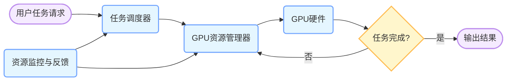

# GPU资源管理:大规模AI推理的优化策略

> 关键词：GPU资源管理、大规模AI推理、优化策略、深度学习、资源分配、性能提升

> 摘要：本文围绕GPU资源管理在大规模AI推理中的优化策略展开。首先介绍了相关背景，包括目的、预期读者、文档结构和术语表。接着阐述了核心概念及其联系，通过文本示意图和Mermaid流程图展示架构。详细讲解了核心算法原理和具体操作步骤，使用Python代码进行说明。给出了相关数学模型和公式，并举例说明。通过项目实战展示代码实现和解读。分析了实际应用场景，推荐了学习资源、开发工具框架和相关论文著作。最后总结了未来发展趋势与挑战，并提供了常见问题解答和扩展阅读参考资料，旨在为从业者提供全面的GPU资源管理优化方案，提升大规模AI推理的效率和性能。

## 1. 背景介绍 
### 1.1 目的和范围
随着人工智能的快速发展，大规模AI推理任务日益增多，对计算资源尤其是GPU的需求也急剧增加。GPU以其强大的并行计算能力，成为加速AI推理的关键硬件。然而，GPU资源昂贵且有限，如何高效地管理GPU资源，优化大规模AI推理过程，成为当前亟待解决的问题。

本文的目的在于深入探讨GPU资源管理在大规模AI推理中的优化策略，涵盖从理论原理到实际应用的各个方面。范围包括核心概念的介绍、算法原理的分析、数学模型的构建、项目实战的演示以及实际应用场景的讨论等，旨在为相关领域的研究者和开发者提供全面、系统的指导。

### 1.2 预期读者
本文预期读者主要包括人工智能领域的研究者、深度学习工程师、数据科学家、GPU资源管理员以及对GPU资源管理和大规模AI推理优化感兴趣的技术爱好者。无论是想要深入了解GPU资源管理原理的初学者，还是希望在实际项目中提高AI推理效率的专业人士，都能从本文中获得有价值的信息。

### 1.3 文档结构概述
本文的文档结构如下：
1. **背景介绍**：阐述本文的目的、范围、预期读者和文档结构概述，并提供相关术语的定义和解释。
2. **核心概念与联系**：介绍GPU资源管理和大规模AI推理的核心概念，通过文本示意图和Mermaid流程图展示其架构和联系。
3. **核心算法原理 & 具体操作步骤**：详细讲解GPU资源管理的核心算法原理，并使用Python源代码进行具体操作步骤的说明。
4. **数学模型和公式 & 详细讲解 & 举例说明**：构建GPU资源管理的数学模型，给出相关公式，并通过具体例子进行详细讲解。
5. **项目实战：代码实际案例和详细解释说明**：通过实际项目案例，展示GPU资源管理优化策略的代码实现和详细解读。
6. **实际应用场景**：分析GPU资源管理优化策略在不同实际应用场景中的应用。
7. **工具和资源推荐**：推荐学习资源、开发工具框架和相关论文著作，帮助读者进一步深入学习和实践。
8. **总结：未来发展趋势与挑战**：总结GPU资源管理在大规模AI推理中的未来发展趋势和面临的挑战。
9. **附录：常见问题与解答**：解答读者在学习和实践过程中可能遇到的常见问题。
10. **扩展阅读 & 参考资料**：提供扩展阅读的建议和参考资料，方便读者进一步探索相关领域。

### 1.4 术语表
#### 1.4.1 核心术语定义
- **GPU（Graphics Processing Unit）**：图形处理器，一种专门设计用于处理图形和图像的硬件，具有强大的并行计算能力，广泛应用于人工智能、深度学习等领域。
- **AI推理（AI Inference）**：指在训练好的人工智能模型上进行预测或分类等操作的过程，将输入数据通过模型得到输出结果。
- **GPU资源管理**：对GPU的计算资源、内存资源等进行合理分配和调度，以提高GPU的使用效率和系统性能。
- **大规模AI推理**：处理大量数据或复杂模型的AI推理任务，通常需要多个GPU或分布式计算环境来完成。

#### 1.4.2 相关概念解释
- **并行计算**：指同时使用多个计算资源（如多个GPU核心）来执行多个任务或计算步骤，以提高计算速度。
- **资源分配**：根据任务的需求和GPU的状态，将GPU的计算资源和内存资源分配给不同的任务。
- **调度策略**：决定任务在GPU上执行的顺序和时间，以优化系统的整体性能。

#### 1.4.3 缩略词列表
- **CUDA（Compute Unified Device Architecture）**：NVIDIA推出的一种并行计算平台和编程模型，用于在GPU上进行通用计算。
- **TensorFlow**：一个开源的机器学习框架，广泛应用于深度学习任务的开发和部署。
- **PyTorch**：另一个流行的开源深度学习框架，具有动态图和易于使用的特点。

## 2. 核心概念与联系 
### 核心概念原理
GPU资源管理的核心目标是在大规模AI推理中实现高效的资源利用和性能提升。其原理基于对GPU的硬件特性和AI推理任务的特点进行分析和优化。

GPU具有大量的并行计算核心，可以同时处理多个数据元素。在AI推理中，许多计算任务（如矩阵乘法、卷积运算等）具有高度的并行性，适合在GPU上进行加速。然而，不同的AI推理任务对GPU资源的需求不同，包括计算资源、内存资源等。因此，需要合理地分配和调度GPU资源，以确保每个任务都能得到足够的资源支持，同时避免资源的浪费。

### 架构的文本示意图
以下是一个简单的GPU资源管理架构的文本示意图：

```plaintext
用户任务请求 -> 任务调度器 -> GPU资源管理器 -> GPU硬件
                              |
                              v
                      资源监控与反馈
```

用户将AI推理任务请求发送给任务调度器，任务调度器根据任务的优先级和资源需求，将任务分配给GPU资源管理器。GPU资源管理器负责对GPU的计算资源和内存资源进行分配和管理，将任务调度到合适的GPU上执行。同时，资源监控模块会实时监控GPU的使用情况，并将反馈信息提供给任务调度器和GPU资源管理器，以便进行动态的资源调整。

### Mermaid流程图


该流程图展示了GPU资源管理的主要流程。用户任务请求首先进入任务调度器，任务调度器将任务分配给GPU资源管理器，GPU资源管理器将任务调度到GPU硬件上执行。在任务执行过程中，资源监控与反馈模块会实时监控GPU的使用情况，并将信息反馈给任务调度器和GPU资源管理器。如果任务完成，则输出结果；否则，继续进行资源分配和任务调度。

## 3. 核心算法原理 & 具体操作步骤 
### 核心算法原理
GPU资源管理的核心算法主要包括任务调度算法和资源分配算法。

#### 任务调度算法
任务调度算法的目标是决定任务在GPU上执行的顺序和时间，以优化系统的整体性能。常见的任务调度算法有先来先服务（FCFS）、最短作业优先（SJF）、优先级调度等。

- **先来先服务（FCFS）**：按照任务到达的先后顺序依次执行，简单易实现，但可能导致长任务阻塞短任务，影响系统的整体性能。
- **最短作业优先（SJF）**：优先执行执行时间最短的任务，能够减少平均等待时间，但需要预先知道任务的执行时间，实际应用中较难实现。
- **优先级调度**：根据任务的优先级进行调度，优先级高的任务先执行。优先级可以根据任务的重要性、紧急程度等因素来确定。

#### 资源分配算法
资源分配算法的目标是根据任务的需求和GPU的状态，将GPU的计算资源和内存资源分配给不同的任务。常见的资源分配算法有首次适应（FF）、最佳适应（BF）、最坏适应（WF）等。

- **首次适应（FF）**：从可用的GPU资源中，选择第一个满足任务需求的资源进行分配。该算法简单快速，但可能导致内存碎片问题。
- **最佳适应（BF）**：从可用的GPU资源中，选择最适合任务需求的资源进行分配，即选择大小最接近任务需求的资源。该算法可以减少内存碎片，但分配时间较长。
- **最坏适应（WF）**：从可用的GPU资源中，选择最大的资源进行分配。该算法可以减少内存碎片，但可能导致大任务无法得到足够的资源。

### 具体操作步骤
以下是一个使用Python实现的简单的GPU资源管理示例，采用先来先服务的任务调度算法和首次适应的资源分配算法：

```python
import time

# 模拟GPU资源
class GPU:
    def __init__(self, id, total_memory):
        self.id = id
        self.total_memory = total_memory
        self.used_memory = 0
        self.is_busy = False

    def allocate_memory(self, memory):
        if self.used_memory + memory <= self.total_memory:
            self.used_memory += memory
            self.is_busy = True
            return True
        return False

    def release_memory(self, memory):
        self.used_memory -= memory
        if self.used_memory == 0:
            self.is_busy = False

# 模拟任务
class Task:
    def __init__(self, id, memory_requirement, execution_time):
        self.id = id
        self.memory_requirement = memory_requirement
        self.execution_time = execution_time

# 任务调度器
class TaskScheduler:
    def __init__(self, gpus):
        self.gpus = gpus
        self.task_queue = []

    def add_task(self, task):
        self.task_queue.append(task)

    def schedule_tasks(self):
        for task in self.task_queue:
            allocated = False
            for gpu in self.gpus:
                if gpu.allocate_memory(task.memory_requirement):
                    print(f"Task {task.id} allocated to GPU {gpu.id}")
                    self.execute_task(task, gpu)
                    allocated = True
                    break
            if not allocated:
                print(f"Task {task.id} cannot be allocated due to insufficient resources")

    def execute_task(self, task, gpu):
        print(f"Task {task.id} started on GPU {gpu.id}")
        time.sleep(task.execution_time)
        gpu.release_memory(task.memory_requirement)
        print(f"Task {task.id} completed on GPU {gpu.id}")

# 主程序
if __name__ == "__main__":
    # 初始化GPU资源
    gpus = [GPU(0, 16000), GPU(1, 16000)]

    # 初始化任务调度器
    scheduler = TaskScheduler(gpus)

    # 添加任务
    tasks = [
        Task(1, 4000, 2),
        Task(2, 8000, 3),
        Task(3, 6000, 4)
    ]
    for task in tasks:
        scheduler.add_task(task)

    # 调度任务
    scheduler.schedule_tasks()
```

### 代码解释
1. **GPU类**：模拟GPU资源，包含GPU的ID、总内存、已使用内存和忙碌状态等属性，提供了分配内存和释放内存的方法。
2. **Task类**：模拟任务，包含任务的ID、内存需求和执行时间等属性。
3. **TaskScheduler类**：任务调度器，包含GPU列表和任务队列，提供了添加任务、调度任务和执行任务的方法。
4. **主程序**：初始化GPU资源和任务调度器，添加任务并调度任务。

在这个示例中，任务按照先来先服务的顺序进行调度，使用首次适应的资源分配算法将任务分配到合适的GPU上执行。

## 4. 数学模型和公式 & 详细讲解 & 举例说明 
### 数学模型
为了更精确地描述GPU资源管理问题，我们可以构建一个数学模型。假设我们有 $n$ 个任务 $\{T_1, T_2, \cdots, T_n\}$ 和 $m$ 个GPU $\{G_1, G_2, \cdots, G_m\}$。

#### 任务属性
- 每个任务 $T_i$ 有一个内存需求 $M_i$ 和一个执行时间 $E_i$。
- 任务 $T_i$ 的优先级为 $P_i$。

#### GPU属性
- 每个GPU $G_j$ 有一个总内存 $C_j$ 和一个可用内存 $A_j$。

#### 决策变量
- $x_{ij}$ 是一个二进制变量，如果任务 $T_i$ 分配给GPU $G_j$，则 $x_{ij} = 1$，否则 $x_{ij} = 0$。

### 目标函数
我们的目标是最小化所有任务的完成时间总和，同时满足资源约束条件。目标函数可以表示为：

$$
\min \sum_{i=1}^{n} \sum_{j=1}^{m} x_{ij} E_i
$$

### 约束条件
1. **每个任务只能分配到一个GPU上**：
$$
\sum_{j=1}^{m} x_{ij} = 1, \quad \forall i = 1, 2, \cdots, n
$$

2. **GPU的内存使用不能超过其总内存**：
$$
\sum_{i=1}^{n} x_{ij} M_i \leq C_j, \quad \forall j = 1, 2, \cdots, m
$$

3. **$x_{ij}$ 是二进制变量**：
$$
x_{ij} \in \{0, 1\}, \quad \forall i = 1, 2, \cdots, n; j = 1, 2, \cdots, m
$$

### 详细讲解
目标函数 $\sum_{i=1}^{n} \sum_{j=1}^{m} x_{ij} E_i$ 表示所有任务的完成时间总和。通过最小化这个目标函数，我们可以优化任务的调度，使所有任务的完成时间最短。

约束条件1确保每个任务只能分配到一个GPU上，避免任务的重复分配。约束条件2确保每个GPU的内存使用不超过其总内存，避免内存溢出。约束条件3定义了决策变量 $x_{ij}$ 为二进制变量，符合实际情况。

### 举例说明
假设我们有2个任务 $T_1$ 和 $T_2$，2个GPU $G_1$ 和 $G_2$。任务和GPU的属性如下：

| 任务 | 内存需求 ($M$) | 执行时间 ($E$) |
| ---- | -------------- | -------------- |
| $T_1$ | 4000 | 2 |
| $T_2$ | 8000 | 3 |

| GPU | 总内存 ($C$) |
| ---- | -------------- |
| $G_1$ | 16000 |
| $G_2$ | 16000 |

我们的目标是找到最优的任务分配方案，使得所有任务的完成时间总和最小。

设 $x_{11}$ 表示任务 $T_1$ 是否分配给GPU $G_1$，$x_{12}$ 表示任务 $T_1$ 是否分配给GPU $G_2$，$x_{21}$ 表示任务 $T_2$ 是否分配给GPU $G_1$，$x_{22}$ 表示任务 $T_2$ 是否分配给GPU $G_2$。

目标函数为：
$$
\min 2(x_{11} + x_{12}) + 3(x_{21} + x_{22})
$$

约束条件为：
$$
x_{11} + x_{12} = 1
$$
$$
x_{21} + x_{22} = 1
$$
$$
4000x_{11} + 8000x_{21} \leq 16000
$$
$$
4000x_{12} + 8000x_{22} \leq 16000
$$
$$
x_{ij} \in \{0, 1\}, \quad i = 1, 2; j = 1, 2
$$

通过求解这个线性规划问题，我们可以得到最优的任务分配方案。在这个例子中，一种可能的最优方案是 $x_{11} = 1$，$x_{12} = 0$，$x_{21} = 1$，$x_{22} = 0$，即任务 $T_1$ 和 $T_2$ 都分配给GPU $G_1$，此时所有任务的完成时间总和为 $2 + 3 = 5$。

## 5. 项目实战：代码实际案例和详细解释说明 
### 5.1  开发环境搭建
在进行GPU资源管理的项目实战之前，我们需要搭建相应的开发环境。以下是具体的搭建步骤：

#### 硬件要求
- **GPU**：建议使用NVIDIA GPU，如NVIDIA Tesla V100、NVIDIA RTX 30系列等，确保GPU支持CUDA。
- **CPU**：多核CPU，如Intel Xeon系列，以提供足够的计算能力。
- **内存**：至少16GB的系统内存，以支持大规模AI推理任务。

#### 软件要求
- **操作系统**：建议使用Linux系统，如Ubuntu 18.04或更高版本。
- **CUDA**：安装与GPU兼容的CUDA版本，可从NVIDIA官方网站下载。
- **cuDNN**：安装与CUDA版本兼容的cuDNN库，用于加速深度学习计算。
- **Python**：安装Python 3.6或更高版本。
- **深度学习框架**：安装TensorFlow或PyTorch等深度学习框架。

#### 安装步骤
1. **安装CUDA**：
    - 从NVIDIA官方网站下载适合你GPU和操作系统的CUDA安装包。
    - 按照安装向导进行安装，注意设置环境变量。

2. **安装cuDNN**：
    - 从NVIDIA官方网站下载与CUDA版本兼容的cuDNN库。
    - 将cuDNN库文件复制到CUDA安装目录下。

3. **安装Python和深度学习框架**：
    - 使用Anaconda或pip安装Python 3.6或更高版本。
    - 使用pip安装TensorFlow或PyTorch，例如：
```bash
pip install tensorflow-gpu
```
或
```bash
pip install torch torchvision torchaudio --extra-index-url https://download.pytorch.org/whl/cu113
```

### 5.2  源代码详细实现和代码解读
以下是一个使用PyTorch实现的大规模AI推理任务的GPU资源管理示例：

```python
import torch
import torch.nn as nn
import torch.optim as optim
import time

# 定义一个简单的神经网络模型
class SimpleModel(nn.Module):
    def __init__(self):
        super(SimpleModel, self).__init__()
        self.fc1 = nn.Linear(10, 20)
        self.fc2 = nn.Linear(20, 1)

    def forward(self, x):
        x = torch.relu(self.fc1(x))
        x = self.fc2(x)
        return x

# 模拟多个任务
def simulate_tasks(num_tasks, model, input_size, device):
    tasks = []
    for i in range(num_tasks):
        input_data = torch.randn(input_size).to(device)
        tasks.append(input_data)
    return tasks

# 任务执行函数
def execute_task(model, input_data):
    output = model(input_data)
    return output

# GPU资源管理函数
def manage_gpu_resources(num_gpus, num_tasks, input_size):
    # 初始化GPU设备
    devices = [torch.device(f'cuda:{i}') for i in range(num_gpus)]

    # 初始化模型并复制到每个GPU上
    models = [SimpleModel().to(device) for device in devices]

    # 模拟任务
    tasks = simulate_tasks(num_tasks, models[0], input_size, devices[0])

    # 任务分配和执行
    task_index = 0
    results = []
    while task_index < num_tasks:
        for i, device in enumerate(devices):
            if task_index < num_tasks:
                model = models[i]
                input_data = tasks[task_index].to(device)
                start_time = time.time()
                output = execute_task(model, input_data)
                end_time = time.time()
                print(f"Task {task_index} completed on GPU {i} in {end_time - start_time:.4f} seconds")
                results.append(output)
                task_index += 1

    return results

# 主程序
if __name__ == "__main__":
    num_gpus = 2
    num_tasks = 10
    input_size = 10

    results = manage_gpu_resources(num_gpus, num_tasks, input_size)
    print(f"All tasks completed. Total results: {len(results)}")
```

### 代码解读
1. **SimpleModel类**：定义了一个简单的神经网络模型，包含两个全连接层。
2. **simulate_tasks函数**：模拟多个任务，生成随机输入数据并将其移动到指定的GPU设备上。
3. **execute_task函数**：执行单个任务，将输入数据通过模型得到输出结果。
4. **manage_gpu_resources函数**：管理GPU资源，初始化GPU设备和模型，模拟任务，将任务分配到不同的GPU上执行，并记录每个任务的执行时间。
5. **主程序**：设置GPU数量、任务数量和输入数据大小，调用`manage_gpu_resources`函数执行任务，并输出所有任务的执行结果。

### 5.3  代码解读与分析
在这个示例中，我们使用PyTorch实现了一个简单的GPU资源管理系统。通过将多个任务分配到不同的GPU上并行执行，我们可以提高大规模AI推理的效率。

#### 优点
- **并行计算**：利用多个GPU的并行计算能力，加速任务的执行。
- **资源利用率**：合理分配任务到不同的GPU上，提高GPU的资源利用率。

#### 缺点
- **任务分配简单**：采用简单的轮询方式分配任务，可能无法充分利用GPU的资源。
- **缺乏动态调度**：没有考虑任务的优先级和GPU的实时状态，无法进行动态的任务调度。

在实际应用中，我们可以根据任务的特点和GPU的状态，采用更复杂的任务调度算法和资源分配算法，以进一步优化GPU资源管理。

## 6. 实际应用场景 
GPU资源管理的优化策略在许多实际应用场景中都具有重要的意义，以下是一些常见的应用场景：

### 图像识别与分类
在图像识别和分类任务中，需要对大量的图像数据进行处理和分析。使用GPU可以加速卷积神经网络（CNN）的推理过程，提高识别和分类的准确率和效率。通过合理的GPU资源管理，可以同时处理多个图像识别任务，满足大规模图像数据的处理需求。

例如，在安防监控系统中，需要实时对监控摄像头拍摄的图像进行分析，识别是否存在异常行为。通过将不同摄像头的图像数据分配到不同的GPU上进行处理，可以实现高效的实时监控。

### 自然语言处理
自然语言处理任务（如文本分类、情感分析、机器翻译等）通常需要处理大量的文本数据。使用GPU可以加速循环神经网络（RNN）、长短时记忆网络（LSTM）、Transformer等模型的推理过程。通过优化GPU资源管理，可以提高自然语言处理系统的响应速度和处理能力。

例如，在智能客服系统中，需要实时对用户的问题进行分析和回答。通过将不同用户的问题分配到不同的GPU上进行处理，可以实现高效的智能客服服务。

### 自动驾驶
自动驾驶技术需要实时处理大量的传感器数据（如摄像头图像、雷达数据等），进行目标检测、路径规划等任务。使用GPU可以加速深度学习模型的推理过程，提高自动驾驶系统的安全性和可靠性。通过合理的GPU资源管理，可以确保在不同的驾驶场景下，都能高效地处理传感器数据。

例如，在自动驾驶汽车中，需要同时处理多个摄像头的图像数据，进行实时的目标检测和识别。通过将不同摄像头的图像数据分配到不同的GPU上进行处理，可以实现高效的自动驾驶。

### 医疗影像分析
在医疗影像分析领域，需要对大量的医学图像（如X光、CT、MRI等）进行分析和诊断。使用GPU可以加速医学图像分析模型的推理过程，提高诊断的准确率和效率。通过优化GPU资源管理，可以同时处理多个患者的医学图像，满足大规模医疗影像分析的需求。

例如，在医院的影像科中，需要对大量患者的医学图像进行分析和诊断。通过将不同患者的医学图像分配到不同的GPU上进行处理，可以实现高效的医疗影像分析。

## 7. 工具和资源推荐
### 7.1 学习资源推荐
#### 7.1.1 书籍推荐
- 《深度学习》（Deep Learning）：由Ian Goodfellow、Yoshua Bengio和Aaron Courville所著，是深度学习领域的经典教材，涵盖了深度学习的基本原理、算法和应用。
- 《Python深度学习》（Deep Learning with Python）：由Francois Chollet所著，结合Keras框架介绍了深度学习的实践方法，适合初学者入门。
- 《GPU高性能编程CUDA实战》（CUDA by Example: An Introduction to General-Purpose GPU Programming）：由Jason Sanders和Edward Kandrot所著，详细介绍了CUDA编程的基本原理和实践方法。

#### 7.1.2 在线课程
- Coursera上的“深度学习专项课程”（Deep Learning Specialization）：由Andrew Ng教授授课，涵盖了深度学习的多个方面，包括神经网络、卷积神经网络、循环神经网络等。
- Udemy上的“GPU编程与深度学习”（GPU Programming and Deep Learning）：介绍了GPU编程和深度学习的基础知识和实践方法。
- edX上的“使用TensorFlow进行深度学习”（Deep Learning with TensorFlow）：结合TensorFlow框架介绍了深度学习的实践方法。

#### 7.1.3 技术博客和网站
- NVIDIA开发者博客（https://developer.nvidia.com/blog/）：提供了关于GPU技术、深度学习、人工智能等方面的最新资讯和技术文章。
- TensorFlow官方博客（https://blog.tensorflow.org/）：提供了关于TensorFlow框架的最新动态和技术文章。
- PyTorch官方博客（https://pytorch.org/blog/）：提供了关于PyTorch框架的最新动态和技术文章。

### 7.2 开发工具框架推荐
#### 7.2.1 IDE和编辑器
- PyCharm：一款功能强大的Python集成开发环境，支持代码编辑、调试、版本控制等功能。
- Visual Studio Code：一款轻量级的代码编辑器，支持多种编程语言和插件扩展，适合快速开发和调试。
- Jupyter Notebook：一种交互式的开发环境，适合进行数据探索、模型训练和实验。

#### 7.2.2 调试和性能分析工具
- NVIDIA Nsight Compute：一款用于GPU性能分析的工具，可以帮助开发者找出GPU代码中的性能瓶颈。
- TensorBoard：TensorFlow提供的可视化工具，可以用于监控模型训练过程、可视化模型结构和分析性能指标。
- PyTorch Profiler：PyTorch提供的性能分析工具，可以帮助开发者分析模型的性能瓶颈。

#### 7.2.3 相关框架和库
- TensorFlow：一个开源的机器学习框架，提供了丰富的深度学习模型和工具，支持GPU加速。
- PyTorch：另一个流行的开源深度学习框架，具有动态图和易于使用的特点，支持GPU加速。
- NumPy：一个用于科学计算的Python库，提供了高效的多维数组对象和各种数学函数。
- Pandas：一个用于数据处理和分析的Python库，提供了数据结构和数据操作工具。

### 7.3 相关论文著作推荐
#### 7.3.1 经典论文
- “ImageNet Classification with Deep Convolutional Neural Networks”：Alex Krizhevsky、Ilya Sutskever和Geoffrey E. Hinton发表的论文，介绍了AlexNet模型，开启了深度学习在图像识别领域的应用。
- “Long Short-Term Memory”：Sepp Hochreiter和Jürgen Schmidhuber发表的论文，介绍了长短时记忆网络（LSTM），解决了循环神经网络中的梯度消失问题。
- “Attention Is All You Need”：Ashish Vaswani等人发表的论文，介绍了Transformer模型，在自然语言处理领域取得了巨大的成功。

#### 7.3.2 最新研究成果
- 关注顶级学术会议（如NeurIPS、ICML、CVPR等）上发表的关于GPU资源管理和大规模AI推理优化的研究论文，了解最新的研究动态和技术进展。
- 关注知名学术期刊（如Journal of Artificial Intelligence Research、IEEE Transactions on Pattern Analysis and Machine Intelligence等）上发表的相关研究论文。

#### 7.3.3 应用案例分析
- 参考NVIDIA、Google、Facebook等公司发布的技术报告和应用案例，了解他们在GPU资源管理和大规模AI推理优化方面的实践经验和最佳实践。
- 关注开源项目（如TensorFlow、PyTorch等）的文档和示例代码，学习如何在实际项目中应用GPU资源管理和大规模AI推理优化技术。

## 8. 总结：未来发展趋势与挑战
### 未来发展趋势
#### 硬件技术的发展
随着GPU硬件技术的不断发展，GPU的计算能力和内存容量将不断提高，同时功耗将不断降低。未来的GPU可能会采用更先进的制程工艺、更高效的架构设计和更智能的电源管理技术，以满足大规模AI推理对计算资源的需求。

#### 软件框架的优化
深度学习框架（如TensorFlow、PyTorch等）将不断优化GPU资源管理功能，提供更高效的任务调度算法和资源分配算法。同时，软件框架将支持更多的硬件平台和计算后端，实现跨平台的GPU资源管理和大规模AI推理。

#### 分布式计算的应用
为了处理更大规模的AI推理任务，分布式计算将得到更广泛的应用。未来的GPU资源管理系统将支持多节点、多GPU的分布式计算，通过网络连接多个GPU服务器，实现大规模AI推理任务的并行处理。

#### 智能化的资源管理
未来的GPU资源管理系统将引入人工智能技术，实现智能化的资源管理。通过对任务的特征和GPU的状态进行实时监测和分析，自动调整任务调度和资源分配策略，以提高系统的整体性能和资源利用率。

### 挑战
#### 资源竞争问题
随着大规模AI推理任务的增加，GPU资源的竞争将越来越激烈。如何合理地分配和调度GPU资源，避免资源竞争导致的性能下降，是一个亟待解决的问题。

#### 任务调度的复杂性
大规模AI推理任务通常具有不同的特点和需求，如计算复杂度、内存需求、执行时间等。如何设计高效的任务调度算法，根据任务的特点和GPU的状态进行动态调度，是一个具有挑战性的问题。

#### 数据通信瓶颈
在分布式计算环境中，数据通信是一个关键的瓶颈。如何减少数据传输的时间和带宽消耗，提高数据通信的效率，是实现高效分布式GPU资源管理的关键。

#### 能源消耗问题
GPU的计算能力强大，但同时也消耗大量的能源。如何降低GPU的能源消耗，提高能源利用效率，是一个重要的挑战。

## 9. 附录：常见问题与解答
### 1. 如何判断我的GPU是否支持CUDA？
可以通过NVIDIA官方网站查询你的GPU型号是否支持CUDA。另外，也可以在终端中运行以下命令来检查CUDA是否安装成功：
```bash
nvcc --version
```
如果显示CUDA的版本信息，则说明你的GPU支持CUDA且CUDA已经安装成功。

### 2. 如何选择合适的任务调度算法？
选择合适的任务调度算法需要考虑任务的特点和系统的需求。如果任务的执行时间差异不大，可以选择先来先服务（FCFS）算法；如果任务的执行时间差异较大，可以选择最短作业优先（SJF）算法或优先级调度算法。同时，还需要考虑算法的复杂度和实现难度。

### 3. 如何优化GPU的内存使用？
可以通过以下方法优化GPU的内存使用：
- 减少不必要的中间变量和缓存，及时释放不再使用的内存。
- 采用合适的批量大小进行训练和推理，避免内存溢出。
- 使用混合精度训练，减少内存占用。

### 4. 如何处理GPU资源不足的情况？
可以采取以下措施处理GPU资源不足的情况：
- 优化模型结构，减少模型的参数数量和计算复杂度。
- 采用分布式计算，将任务分配到多个GPU或服务器上执行。
- 调整任务的优先级，优先执行重要的任务。

### 5. 如何评估GPU资源管理系统的性能？
可以通过以下指标评估GPU资源管理系统的性能：
- **任务完成时间**：所有任务的完成时间总和，反映系统的整体效率。
- **GPU利用率**：GPU的实际使用时间与总时间的比值，反映GPU的资源利用效率。
- **吞吐量**：单位时间内完成的任务数量，反映系统的处理能力。

## 10. 扩展阅读 & 参考资料
### 扩展阅读
- 《人工智能：现代方法》（Artificial Intelligence: A Modern Approach）：由Stuart Russell和Peter Norvig所著，全面介绍了人工智能的基本原理、算法和应用。
- 《机器学习》（Machine Learning）：由Tom M. Mitchell所著，是机器学习领域的经典教材，涵盖了机器学习的基本概念、算法和应用。
- 《高性能计算实战》（High Performance Computing: Modern Systems and Practices）：由Jack Dongarra等人所著，介绍了高性能计算的基本原理、技术和应用。

### 参考资料
- NVIDIA官方文档（https://docs.nvidia.com/）：提供了关于NVIDIA GPU、CUDA、cuDNN等的详细文档和技术资料。
- TensorFlow官方文档（https://www.tensorflow.org/api_docs）：提供了关于TensorFlow框架的详细文档和API参考。
- PyTorch官方文档（https://pytorch.org/docs/stable/index.html）：提供了关于PyTorch框架的详细文档和API参考。