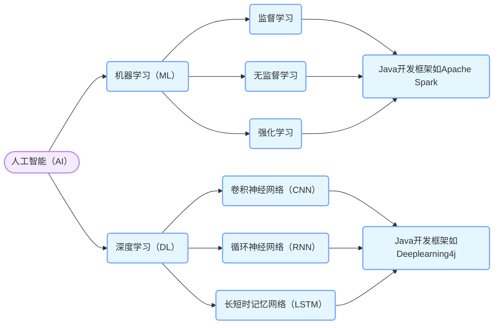

# Java工程师的转型之路:应对AI挑战

> 关键词：Java工程师、AI挑战、转型、人工智能、机器学习、深度学习、技术融合

> 摘要：随着人工智能（AI）技术的迅猛发展，Java工程师面临着新的挑战与机遇。本文旨在深入探讨Java工程师如何应对AI带来的挑战，实现成功转型。文章首先介绍了相关背景，包括目的、预期读者等。接着阐述了核心概念，如AI、机器学习、深度学习与Java的联系。详细讲解了核心算法原理，通过Python代码示例进行说明。同时给出了相关数学模型和公式，并结合实际案例进行讲解。通过项目实战，展示了Java与AI结合的代码实现及解读。分析了AI在不同领域的实际应用场景。推荐了学习AI的工具和资源，包括书籍、在线课程、开发工具等。最后总结了未来发展趋势与挑战，提供常见问题解答及参考资料，助力Java工程师顺利转型。

## 1. 背景介绍 
### 1.1 目的和范围
在当今数字化时代，人工智能技术正以前所未有的速度改变着各个行业。Java作为一种广泛应用的编程语言，Java工程师在软件开发领域发挥着重要作用。然而，AI技术的崛起对Java工程师的技能结构提出了新的要求。本文的目的在于帮助Java工程师了解AI技术的发展趋势，掌握应对AI挑战的方法，实现从传统Java开发向融合AI技术的转型。文章的范围涵盖了AI相关的核心概念、算法原理、数学模型、项目实战、应用场景以及学习资源等方面，旨在为Java工程师提供全面、系统的转型指导。

### 1.2 预期读者
本文主要面向有一定Java编程基础的工程师，包括正在从事Java开发工作的专业人士、希望提升自身技能的Java初学者以及对AI技术在Java领域应用感兴趣的技术爱好者。同时，也可供相关技术管理人员、教育工作者参考，以了解Java工程师转型的需求和方向。

### 1.3 文档结构概述
本文将按照以下结构进行组织：首先介绍背景信息，让读者了解文章的目的、预期读者和整体结构。接着阐述AI与Java相关的核心概念及其联系，为后续的技术讲解奠定基础。然后详细讲解核心算法原理，通过Python代码示例展示算法的实现过程。同时给出相关的数学模型和公式，并结合具体例子进行说明。在项目实战部分，将展示Java与AI结合的实际案例，包括开发环境搭建、源代码实现和代码解读。之后分析AI在不同领域的实际应用场景。推荐学习AI的工具和资源，包括书籍、在线课程、开发工具等。最后总结未来发展趋势与挑战，提供常见问题解答及参考资料，方便读者进一步学习和研究。

### 1.4 术语表
#### 1.4.1 核心术语定义
- **人工智能（AI）**：是一门研究如何使计算机能够模拟人类智能的学科，包括学习、推理、问题解决、感知等多个方面。
- **机器学习（ML）**：是人工智能的一个分支，致力于研究如何让计算机从数据中自动学习模式和规律，从而进行预测和决策。
- **深度学习（DL）**：是机器学习的一个子领域，基于人工神经网络，通过构建多层的神经网络模型来学习数据的深层次特征。
- **Java**：是一种广泛使用的高级编程语言，具有跨平台、面向对象、安全稳定等特点，常用于企业级应用开发。

#### 1.4.2 相关概念解释
- **神经网络**：是一种模仿人类神经系统的计算模型，由大量的神经元组成，通过神经元之间的连接和信号传递来处理信息。
- **训练集**：用于训练机器学习模型的数据集合，模型通过学习训练集中的数据来调整自身的参数。
- **测试集**：用于评估训练好的机器学习模型性能的数据集合，通过在测试集上的表现来衡量模型的泛化能力。
- **过拟合**：指模型在训练集上表现良好，但在测试集或新数据上表现不佳的现象，通常是由于模型过于复杂，过度拟合了训练数据中的噪声和细节。

#### 1.4.3 缩略词列表
- **AI**：Artificial Intelligence（人工智能）
- **ML**：Machine Learning（机器学习）
- **DL**：Deep Learning（深度学习）
- **API**：Application Programming Interface（应用程序编程接口）
- **GPU**：Graphics Processing Unit（图形处理器）

## 2. 核心概念与联系 
### 核心概念原理
#### 人工智能（AI）
人工智能的目标是使计算机能够像人类一样进行智能活动，如感知环境、理解语言、做出决策等。它涉及多个领域的知识和技术，包括计算机科学、数学、心理学、语言学等。人工智能的实现方式有多种，其中机器学习和深度学习是目前最常用的方法。

#### 机器学习（ML）
机器学习是让计算机通过数据自动学习模式和规律的技术。其基本流程包括数据收集、数据预处理、模型选择、模型训练、模型评估和模型应用。常见的机器学习算法包括监督学习、无监督学习和强化学习。监督学习是指在有标签的数据上进行学习，通过学习输入数据和对应的标签之间的关系来进行预测；无监督学习是指在无标签的数据上进行学习，通过发现数据中的内在结构和模式来进行聚类、降维等任务；强化学习是指智能体通过与环境进行交互，根据环境反馈的奖励信号来学习最优的行为策略。

#### 深度学习（DL）
深度学习是机器学习的一个子领域，基于人工神经网络。神经网络由多个神经元组成，每个神经元接收输入信号，经过加权求和和非线性变换后输出信号。深度学习通过构建多层的神经网络模型，让模型自动学习数据的深层次特征。常见的深度学习模型包括卷积神经网络（CNN）、循环神经网络（RNN）和长短时记忆网络（LSTM）等。卷积神经网络主要用于图像和视频处理，循环神经网络和长短时记忆网络主要用于序列数据处理，如自然语言处理和时间序列分析。

#### Java与AI的联系
Java作为一种成熟的编程语言，在企业级应用开发中具有广泛的应用。虽然Java本身并不是专门为AI设计的语言，但它具有丰富的开发框架和工具，如Apache Spark、Deeplearning4j等，可以用于构建和训练机器学习和深度学习模型。同时，Java在分布式计算、大数据处理等方面具有优势，可以与AI技术相结合，实现大规模数据的处理和分析。此外，Java的跨平台性和安全性也使得它在企业级AI应用中具有重要的地位。

### 架构的文本示意图
```plaintext
                          +-----------------+
                          |    人工智能（AI）   |
                          +-----------------+
                                 |
                                 |
           +----------------------+----------------------+
           |                                          |
 +-----------------+                            +-----------------+
 |  机器学习（ML）  |                            |  深度学习（DL）  |
 +-----------------+                            +-----------------+
           |                                          |
           |                                          |
 +----------------------+----------------------+   +----------------------+----------------------+
 |                  |                  |      |   |                  |                  |      |
 |  监督学习        |  无监督学习      |  强化学习 |   |  卷积神经网络（CNN） |  循环神经网络（RNN） |  长短时记忆网络（LSTM） |
 +----------------------+----------------------+   +----------------------+----------------------+
           |                                          |
           |                                          |
 +----------------------+                      +----------------------+
 |      Java 开发框架     |                      |      Java 开发框架     |
 |  （如 Apache Spark）  |                      |  （如 Deeplearning4j） |
 +----------------------+                      +----------------------+
```

### Mermaid流程图


## 3. 核心算法原理 & 具体操作步骤 
### 线性回归算法原理
线性回归是一种简单而常用的监督学习算法，用于预测连续值的输出。其基本思想是通过找到一条最佳的直线或超平面，使得所有数据点到该直线或超平面的距离之和最小。线性回归的数学模型可以表示为：

$$y = \theta_0 + \theta_1x_1 + \theta_2x_2 + \cdots + \theta_nx_n + \epsilon$$

其中，$y$ 是输出变量，$x_1, x_2, \cdots, x_n$ 是输入变量，$\theta_0, \theta_1, \cdots, \theta_n$ 是模型的参数，$\epsilon$ 是误差项。

### Python代码实现线性回归
```python
import numpy as np
from sklearn.linear_model import LinearRegression
from sklearn.model_selection import train_test_split
from sklearn.metrics import mean_squared_error

# 生成一些示例数据
np.random.seed(0)
X = 2 * np.random.rand(100, 1)
y = 4 + 3 * X + np.random.randn(100, 1)

# 划分训练集和测试集
X_train, X_test, y_train, y_test = train_test_split(X, y, test_size=0.2, random_state=42)

# 创建线性回归模型
model = LinearRegression()

# 训练模型
model.fit(X_train, y_train)

# 预测测试集
y_pred = model.predict(X_test)

# 计算均方误差
mse = mean_squared_error(y_test, y_pred)
print(f"均方误差: {mse}")

# 输出模型参数
print(f"截距: {model.intercept_}")
print(f"系数: {model.coef_}")
```

### 具体操作步骤
1. **数据准备**：收集和整理相关的数据，将其划分为输入变量 $X$ 和输出变量 $y$。
2. **数据划分**：将数据集划分为训练集和测试集，通常按照 80:20 或 70:30 的比例进行划分。
3. **模型选择**：选择合适的机器学习模型，这里选择线性回归模型。
4. **模型训练**：使用训练集数据对模型进行训练，通过最小化损失函数来调整模型的参数。
5. **模型预测**：使用训练好的模型对测试集数据进行预测。
6. **模型评估**：使用评估指标（如均方误差）来评估模型的性能。

### 逻辑回归算法原理
逻辑回归是一种用于分类问题的监督学习算法，它通过逻辑函数将线性回归的输出映射到概率值。逻辑回归的数学模型可以表示为：

$$P(y = 1|x) = \frac{1}{1 + e^{-(\theta_0 + \theta_1x_1 + \theta_2x_2 + \cdots + \theta_nx_n)}}$$

其中，$P(y = 1|x)$ 是给定输入 $x$ 时输出为 1 的概率，$\theta_0, \theta_1, \cdots, \theta_n$ 是模型的参数。

### Python代码实现逻辑回归
```python
from sklearn.datasets import make_classification
from sklearn.linear_model import LogisticRegression
from sklearn.model_selection import train_test_split
from sklearn.metrics import accuracy_score

# 生成一些示例数据
X, y = make_classification(n_samples=100, n_features=10, n_informative=5, n_redundant=0, random_state=42)

# 划分训练集和测试集
X_train, X_test, y_train, y_test = train_test_split(X, y, test_size=0.2, random_state=42)

# 创建逻辑回归模型
model = LogisticRegression()

# 训练模型
model.fit(X_train, y_train)

# 预测测试集
y_pred = model.predict(X_test)

# 计算准确率
accuracy = accuracy_score(y_test, y_pred)
print(f"准确率: {accuracy}")

# 输出模型参数
print(f"截距: {model.intercept_}")
print(f"系数: {model.coef_}")
```

### 具体操作步骤
1. **数据准备**：收集和整理相关的数据，将其划分为输入变量 $X$ 和输出变量 $y$。
2. **数据划分**：将数据集划分为训练集和测试集，通常按照 80:20 或 70:30 的比例进行划分。
3. **模型选择**：选择合适的机器学习模型，这里选择逻辑回归模型。
4. **模型训练**：使用训练集数据对模型进行训练，通过最大化似然函数来调整模型的参数。
5. **模型预测**：使用训练好的模型对测试集数据进行预测。
6. **模型评估**：使用评估指标（如准确率）来评估模型的性能。

## 4. 数学模型和公式 & 详细讲解 & 举例说明 
### 线性回归的数学模型和公式
线性回归的目标是找到一组参数 $\theta = [\theta_0, \theta_1, \cdots, \theta_n]^T$，使得预测值 $\hat{y}$ 与真实值 $y$ 之间的误差最小。通常使用均方误差（MSE）作为损失函数，其定义为：

$$MSE(\theta) = \frac{1}{m}\sum_{i=1}^{m}(y^{(i)} - \hat{y}^{(i)})^2$$

其中，$m$ 是样本数量，$y^{(i)}$ 是第 $i$ 个样本的真实值，$\hat{y}^{(i)}$ 是第 $i$ 个样本的预测值。

为了最小化均方误差，我们可以使用梯度下降法来更新模型的参数。梯度下降法的更新公式为：

$$\theta_j := \theta_j - \alpha\frac{\partial MSE(\theta)}{\partial \theta_j}$$

其中，$\alpha$ 是学习率，控制参数更新的步长。

### 详细讲解
梯度下降法的基本思想是沿着损失函数的负梯度方向更新模型的参数，直到损失函数达到最小值。在每一次迭代中，我们计算损失函数对每个参数的偏导数，然后根据偏导数的方向和学习率来更新参数。

### 举例说明
假设我们有一个简单的线性回归问题，输入变量 $x$ 和输出变量 $y$ 之间的关系为 $y = 2x + 1$，我们收集了一些样本数据：

| $x$ | $y$ |
|---|---|
| 1 | 3 |
| 2 | 5 |
| 3 | 7 |

我们的目标是找到一条直线 $\hat{y} = \theta_0 + \theta_1x$，使得均方误差最小。

首先，我们初始化模型的参数 $\theta_0 = 0$ 和 $\theta_1 = 0$。然后，我们使用梯度下降法来更新参数。

损失函数的偏导数为：

$$\frac{\partial MSE(\theta)}{\partial \theta_0} = -\frac{2}{m}\sum_{i=1}^{m}(y^{(i)} - \hat{y}^{(i)})$$

$$\frac{\partial MSE(\theta)}{\partial \theta_1} = -\frac{2}{m}\sum_{i=1}^{m}(y^{(i)} - \hat{y}^{(i)})x^{(i)}$$

假设学习率 $\alpha = 0.1$，我们进行多次迭代，直到损失函数收敛。

经过多次迭代后，我们得到的参数 $\theta_0 \approx 1$ 和 $\theta_1 \approx 2$，这与真实的参数非常接近。

### 逻辑回归的数学模型和公式
逻辑回归的目标是找到一组参数 $\theta = [\theta_0, \theta_1, \cdots, \theta_n]^T$，使得模型能够正确地分类样本。通常使用对数损失函数（也称为交叉熵损失函数）作为损失函数，其定义为：

$$J(\theta) = -\frac{1}{m}\sum_{i=1}^{m}[y^{(i)}\log(h_{\theta}(x^{(i)})) + (1 - y^{(i)})\log(1 - h_{\theta}(x^{(i)}))]$$

其中，$m$ 是样本数量，$y^{(i)}$ 是第 $i$ 个样本的真实标签（0 或 1），$h_{\theta}(x^{(i)})$ 是第 $i$ 个样本的预测概率。

为了最小化对数损失函数，我们同样可以使用梯度下降法来更新模型的参数。梯度下降法的更新公式为：

$$\theta_j := \theta_j - \alpha\frac{\partial J(\theta)}{\partial \theta_j}$$

### 详细讲解
对数损失函数的基本思想是惩罚模型对正样本预测为负样本和对负样本预测为正样本的情况。当模型的预测概率接近真实标签时，损失函数的值较小；当模型的预测概率远离真实标签时，损失函数的值较大。

### 举例说明
假设我们有一个二分类问题，输入变量 $x$ 和输出变量 $y$ 之间的关系为：

当 $x > 0$ 时，$y = 1$；当 $x \leq 0$ 时，$y = 0$。

我们收集了一些样本数据：

| $x$ | $y$ |
|---|---|
| -1 | 0 |
| 1 | 1 |
| 2 | 1 |

我们的目标是找到一个逻辑回归模型，使得模型能够正确地分类这些样本。

首先，我们初始化模型的参数 $\theta_0 = 0$ 和 $\theta_1 = 0$。然后，我们使用梯度下降法来更新参数。

损失函数的偏导数为：

$$\frac{\partial J(\theta)}{\partial \theta_0} = \frac{1}{m}\sum_{i=1}^{m}(h_{\theta}(x^{(i)}) - y^{(i)})$$

$$\frac{\partial J(\theta)}{\partial \theta_1} = \frac{1}{m}\sum_{i=1}^{m}(h_{\theta}(x^{(i)}) - y^{(i)})x^{(i)}$$

假设学习率 $\alpha = 0.1$，我们进行多次迭代，直到损失函数收敛。

经过多次迭代后，我们得到的参数 $\theta_0$ 和 $\theta_1$ 能够使得模型正确地分类这些样本。

## 5. 项目实战：代码实际案例和详细解释说明 
### 5.1  开发环境搭建
#### 安装Java开发环境
1. **下载JDK**：访问Oracle官方网站或OpenJDK官网，根据自己的操作系统选择合适的JDK版本进行下载。
2. **安装JDK**：按照安装向导的提示进行安装，安装完成后配置环境变量，将JDK的bin目录添加到系统的PATH环境变量中。
3. **验证安装**：打开命令行工具，输入 `java -version` 和 `javac -version` 命令，如果能够正确显示Java和Java编译器的版本信息，则说明安装成功。

#### 安装Python开发环境
1. **下载Python**：访问Python官方网站，根据自己的操作系统选择合适的Python版本进行下载。
2. **安装Python**：按照安装向导的提示进行安装，安装过程中勾选“Add Python to PATH”选项，以便将Python的bin目录添加到系统的PATH环境变量中。
3. **验证安装**：打开命令行工具，输入 `python --version` 命令，如果能够正确显示Python的版本信息，则说明安装成功。

#### 安装相关库和框架
1. **安装NumPy**：在命令行中输入 `pip install numpy` 命令进行安装。
2. **安装Scikit-learn**：在命令行中输入 `pip install scikit-learn` 命令进行安装。
3. **安装Deeplearning4j**：如果需要使用Java进行深度学习开发，可以通过Maven或Gradle添加Deeplearning4j的依赖。

### 5.2  源代码详细实现和代码解读
#### Java实现简单的线性回归
```java
import java.util.Arrays;

public class LinearRegression {
    private double[] theta;

    public void fit(double[][] X, double[] y) {
        int m = X.length;
        int n = X[0].length;

        // 添加偏置项
        double[][] X_b = new double[m][n + 1];
        for (int i = 0; i < m; i++) {
            X_b[i][0] = 1;
            System.arraycopy(X[i], 0, X_b[i], 1, n);
        }

        // 计算参数 theta
        double[][] X_b_transpose = transpose(X_b);
        double[][] X_b_transpose_X_b = matrixMultiply(X_b_transpose, X_b);
        double[][] inverse = inverse(X_b_transpose_X_b);
        double[][] inverse_X_b_transpose = matrixMultiply(inverse, X_b_transpose);
        theta = matrixVectorMultiply(inverse_X_b_transpose, y);
    }

    public double[] predict(double[][] X) {
        int m = X.length;
        int n = X[0].length;

        // 添加偏置项
        double[][] X_b = new double[m][n + 1];
        for (int i = 0; i < m; i++) {
            X_b[i][0] = 1;
            System.arraycopy(X[i], 0, X_b[i], 1, n);
        }

        // 预测结果
        return matrixVectorMultiply(X_b, theta);
    }

    private double[][] transpose(double[][] matrix) {
        int m = matrix.length;
        int n = matrix[0].length;
        double[][] transposed = new double[n][m];
        for (int i = 0; i < m; i++) {
            for (int j = 0; j < n; j++) {
                transposed[j][i] = matrix[i][j];
            }
        }
        return transposed;
    }

    private double[][] matrixMultiply(double[][] A, double[][] B) {
        int m = A.length;
        int n = A[0].length;
        int p = B[0].length;
        double[][] result = new double[m][p];
        for (int i = 0; i < m; i++) {
            for (int j = 0; j < p; j++) {
                for (int k = 0; k < n; k++) {
                    result[i][j] += A[i][k] * B[k][j];
                }
            }
        }
        return result;
    }

    private double[][] inverse(double[][] matrix) {
        int n = matrix.length;
        double[][] augmented = new double[n][2 * n];
        for (int i = 0; i < n; i++) {
            System.arraycopy(matrix[i], 0, augmented[i], 0, n);
            augmented[i][i + n] = 1;
        }

        // 高斯消元法
        for (int i = 0; i < n; i++) {
            // 选主元
            int maxRow = i;
            for (int k = i + 1; k < n; k++) {
                if (Math.abs(augmented[k][i]) > Math.abs(augmented[maxRow][i])) {
                    maxRow = k;
                }
            }
            double[] temp = augmented[i];
            augmented[i] = augmented[maxRow];
            augmented[maxRow] = temp;

            // 消元
            for (int j = i + 1; j < n; j++) {
                double factor = augmented[j][i] / augmented[i][i];
                for (int k = 0; k < 2 * n; k++) {
                    augmented[j][k] -= factor * augmented[i][k];
                }
            }
        }

        // 回代
        for (int i = n - 1; i >= 0; i--) {
            double factor = augmented[i][i];
            for (int k = 0; k < 2 * n; k++) {
                augmented[i][k] /= factor;
            }
            for (int j = i - 1; j >= 0; j--) {
                factor = augmented[j][i];
                for (int k = 0; k < 2 * n; k++) {
                    augmented[j][k] -= factor * augmented[i][k];
                }
            }
        }

        // 提取逆矩阵
        double[][] inverse = new double[n][n];
        for (int i = 0; i < n; i++) {
            System.arraycopy(augmented[i], n, inverse[i], 0, n);
        }
        return inverse;
    }

    private double[] matrixVectorMultiply(double[][] matrix, double[] vector) {
        int m = matrix.length;
        int n = matrix[0].length;
        double[] result = new double[m];
        for (int i = 0; i < m; i++) {
            for (int j = 0; j < n; j++) {
                result[i] += matrix[i][j] * vector[j];
            }
        }
        return result;
    }

    public static void main(String[] args) {
        double[][] X = {{1}, {2}, {3}};
        double[] y = {3, 5, 7};

        LinearRegression model = new LinearRegression();
        model.fit(X, y);

        double[][] X_test = {{4}};
        double[] y_pred = model.predict(X_test);
        System.out.println("预测结果: " + Arrays.toString(y_pred));
    }
}
```

#### 代码解读
1. **fit方法**：该方法用于训练线性回归模型，通过最小二乘法计算模型的参数 $\theta$。首先，添加偏置项到输入数据 $X$ 中，然后计算 $X^T X$ 的逆矩阵，最后计算参数 $\theta$。
2. **predict方法**：该方法用于预测新的数据，首先添加偏置项到输入数据 $X$ 中，然后计算预测结果。
3. **transpose方法**：该方法用于计算矩阵的转置。
4. **matrixMultiply方法**：该方法用于计算两个矩阵的乘积。
5. **inverse方法**：该方法用于计算矩阵的逆矩阵，使用高斯消元法实现。
6. **matrixVectorMultiply方法**：该方法用于计算矩阵和向量的乘积。
7. **main方法**：该方法是程序的入口，创建线性回归模型，训练模型并进行预测。

#### Python实现简单的线性回归
```python
import numpy as np

class LinearRegression:
    def __init__(self):
        self.theta = None

    def fit(self, X, y):
        m, n = X.shape
        X_b = np.c_[np.ones((m, 1)), X]
        self.theta = np.linalg.inv(X_b.T.dot(X_b)).dot(X_b.T).dot(y)

    def predict(self, X):
        m, n = X.shape
        X_b = np.c_[np.ones((m, 1)), X]
        return X_b.dot(self.theta)

if __name__ == "__main__":
    X = np.array([[1], [2], [3]])
    y = np.array([3, 5, 7])

    model = LinearRegression()
    model.fit(X, y)

    X_test = np.array([[4]])
    y_pred = model.predict(X_test)
    print("预测结果:", y_pred)
```

#### 代码解读
1. **__init__方法**：该方法用于初始化模型的参数 $\theta$。
2. **fit方法**：该方法用于训练线性回归模型，通过最小二乘法计算模型的参数 $\theta$。首先，添加偏置项到输入数据 $X$ 中，然后计算 $X^T X$ 的逆矩阵，最后计算参数 $\theta$。
3. **predict方法**：该方法用于预测新的数据，首先添加偏置项到输入数据 $X$ 中，然后计算预测结果。
4. **主程序**：创建线性回归模型，训练模型并进行预测。

### 5.3  代码解读与分析
#### Java代码分析
- **优点**：Java是一种面向对象的编程语言，具有良好的封装性和可维护性。代码中使用了矩阵运算的基本方法，如转置、乘法和求逆，实现了线性回归模型的训练和预测。
- **缺点**：Java的矩阵运算相对繁琐，需要手动实现矩阵的各种操作，代码量较大。同时，Java的计算效率相对较低，对于大规模数据的处理可能会比较慢。

#### Python代码分析
- **优点**：Python是一种简洁、高效的编程语言，具有丰富的科学计算库，如NumPy。代码中使用了NumPy的矩阵运算函数，实现了线性回归模型的训练和预测，代码量较小，易于理解和维护。
- **缺点**：Python是一种解释型语言，计算效率相对较低，对于大规模数据的处理可能会比较慢。同时，Python的类型系统相对较弱，可能会导致一些潜在的错误。

## 6. 实际应用场景 
### 金融领域
- **风险评估**：Java工程师可以利用AI技术构建风险评估模型，通过分析客户的信用历史、财务状况等数据，预测客户的违约风险。例如，使用逻辑回归模型对客户的信用评分进行分类，判断客户是否有违约的可能性。
- **股票预测**：结合Java的分布式计算能力和AI的机器学习算法，对股票市场的历史数据进行分析，预测股票价格的走势。例如，使用循环神经网络（RNN）或长短时记忆网络（LSTM）对股票价格的时间序列数据进行建模，预测未来的股票价格。

### 医疗领域
- **疾病诊断**：Java工程师可以开发基于AI的疾病诊断系统，通过分析患者的病历、影像数据等，辅助医生进行疾病诊断。例如，使用卷积神经网络（CNN）对医学影像（如X光、CT等）进行分析，检测疾病的存在和程度。
- **药物研发**：利用AI技术对药物分子的结构和活性进行预测，加速药物研发的过程。例如，使用深度学习模型对药物分子的化学结构进行建模，预测药物的活性和副作用。

### 交通领域
- **自动驾驶**：Java工程师可以参与自动驾驶系统的开发，利用AI技术实现车辆的感知、决策和控制。例如，使用卷积神经网络（CNN）对摄像头采集的图像进行分析，识别道路、交通标志和其他车辆；使用强化学习算法训练车辆的决策模型，实现自动驾驶。
- **智能交通管理**：结合Java的分布式计算能力和AI的数据分析技术，对交通流量进行实时监测和预测，优化交通信号灯的控制策略，提高交通效率。例如，使用机器学习算法对交通流量数据进行建模，预测未来的交通流量，调整交通信号灯的配时。

### 教育领域
- **个性化学习**：Java工程师可以开发基于AI的个性化学习系统，根据学生的学习习惯、学习进度等数据，为学生提供个性化的学习方案。例如，使用机器学习算法对学生的学习数据进行分析，推荐适合学生的学习资源和练习题目。
- **智能辅导**：利用AI技术实现智能辅导系统，帮助学生解决学习中遇到的问题。例如，使用自然语言处理技术对学生的问题进行理解和回答，提供实时的辅导和反馈。

## 7. 工具和资源推荐
### 7.1 学习资源推荐
#### 7.1.1 书籍推荐
- 《机器学习》（周志华著）：本书是机器学习领域的经典教材，全面介绍了机器学习的基本概念、算法和应用。
- 《深度学习》（Ian Goodfellow、Yoshua Bengio和Aaron Courville著）：本书是深度学习领域的权威著作，详细介绍了深度学习的原理、模型和应用。
- 《Python机器学习》（Sebastian Raschka著）：本书以Python为工具，介绍了机器学习的基本算法和实践应用。
- 《Java核心技术》（Cay S. Horstmann著）：本书是Java编程领域的经典教材，全面介绍了Java的语言特性、编程技巧和应用开发。

#### 7.1.2 在线课程
- Coursera平台的“机器学习”课程（Andrew Ng教授主讲）：该课程是机器学习领域的经典在线课程，由斯坦福大学的Andrew Ng教授主讲，全面介绍了机器学习的基本概念、算法和应用。
- edX平台的“深度学习”课程（由全球顶尖大学的教授联合授课）：该课程是深度学习领域的权威在线课程，介绍了深度学习的原理、模型和应用。
- 中国大学MOOC平台的“Java程序设计”课程：该课程是Java编程领域的优质在线课程，全面介绍了Java的语言特性、编程技巧和应用开发。

#### 7.1.3 技术博客和网站
- 博客园（https://www.cnblogs.com/）：是一个技术博客平台，有很多Java和AI领域的技术文章和经验分享。
- 开源中国（https://www.oschina.net/）：是一个开源技术社区，提供了很多Java和AI领域的开源项目和技术资讯。
- Kaggle（https://www.kaggle.com/）：是一个数据科学竞赛平台，提供了很多AI领域的数据集和竞赛项目，可以帮助Java工程师学习和实践AI技术。

### 7.2 开发工具框架推荐
#### 7.2.1 IDE和编辑器
- IntelliJ IDEA：是一款功能强大的Java集成开发环境，支持代码编辑、调试、版本控制等功能，提高Java开发的效率。
- PyCharm：是一款专门为Python开发设计的集成开发环境，支持代码编辑、调试、自动补全等功能，方便Python开发。
- Visual Studio Code：是一款轻量级的代码编辑器，支持多种编程语言，包括Java和Python，具有丰富的插件生态系统，可以扩展其功能。

#### 7.2.2 调试和性能分析工具
- JProfiler：是一款专业的Java性能分析工具，可以帮助Java工程师分析Java程序的性能瓶颈，优化代码。
- Py-Spy：是一款Python性能分析工具，可以实时分析Python程序的性能，找出性能瓶颈。
- TensorBoard：是TensorFlow的可视化工具，可以帮助AI工程师可视化训练过程和模型结构，分析模型的性能。

#### 7.2.3 相关框架和库
- Deeplearning4j：是一个基于Java的深度学习框架，提供了丰富的深度学习模型和工具，方便Java工程师进行深度学习开发。
- Apache Spark：是一个开源的分布式计算框架，支持大规模数据的处理和分析，可以与AI技术相结合，实现大规模数据的机器学习和深度学习。
- Scikit-learn：是一个Python的机器学习库，提供了丰富的机器学习算法和工具，方便Python工程师进行机器学习开发。

### 7.3 相关论文著作推荐
#### 7.3.1 经典论文
- “Gradient-based learning applied to document recognition”（Yann LeCun等著）：该论文介绍了卷积神经网络（CNN）的基本原理和应用，是深度学习领域的经典论文。
- “Long Short-Term Memory”（Sepp Hochreiter和Jürgen Schmidhuber著）：该论文介绍了长短时记忆网络（LSTM）的基本原理和应用，是循环神经网络领域的经典论文。
- “A Logical Calculus of the Ideas Immanent in Nervous Activity”（Warren S. McCulloch和Walter Pitts著）：该论文提出了人工神经网络的基本模型，是人工智能领域的经典论文。

#### 7.3.2 最新研究成果
- 关注顶级学术会议（如NeurIPS、ICML、CVPR等）的最新论文，了解AI领域的最新研究成果和技术趋势。
- 关注知名学术期刊（如Journal of Artificial Intelligence Research、Artificial Intelligence等）的最新论文，了解AI领域的前沿研究。

#### 7.3.3 应用案例分析
- 关注AI领域的知名公司（如Google、Microsoft、Facebook等）的技术博客和研究报告，了解AI技术在实际应用中的案例和经验。
- 关注行业报告和白皮书，了解AI技术在不同行业的应用现状和发展趋势。

## 8. 总结：未来发展趋势与挑战
### 未来发展趋势
- **AI与Java的深度融合**：未来，AI技术将与Java开发更加紧密地结合，Java工程师将能够利用AI技术解决更多复杂的问题。例如，在企业级应用开发中，利用AI技术实现智能客服、智能推荐等功能。
- **边缘计算与AI的结合**：随着物联网的发展，边缘计算将成为未来的发展趋势。Java工程师将需要掌握边缘计算和AI技术，开发能够在边缘设备上运行的智能应用。例如，在智能家居、智能交通等领域，利用边缘计算和AI技术实现设备的智能控制和决策。
- **AI的自动化和智能化**：未来，AI技术将越来越自动化和智能化，Java工程师将能够利用自动化工具和平台进行AI模型的开发和部署。例如，利用AutoML技术自动选择和优化AI模型，提高开发效率。

### 挑战
- **技术更新换代快**：AI技术发展迅速，新的算法和模型不断涌现。Java工程师需要不断学习和更新自己的知识，跟上技术发展的步伐。
- **数据安全和隐私问题**：AI技术的应用需要大量的数据支持，数据安全和隐私问题成为了一个重要的挑战。Java工程师需要掌握数据安全和隐私保护的技术，确保数据的安全和隐私。
- **人才竞争激烈**：随着AI技术的发展，对AI人才的需求越来越大，人才竞争也越来越激烈。Java工程师需要不断提升自己的技能和竞争力，才能在激烈的人才市场中脱颖而出。

## 9. 附录：常见问题与解答
### 问题1：Java工程师转型AI需要具备哪些基础知识？
答：Java工程师转型AI需要具备一定的数学基础，包括线性代数、概率论、数理统计等；需要掌握Python编程语言，因为Python是AI领域最常用的编程语言；需要了解机器学习和深度学习的基本概念和算法。

### 问题2：Java和Python在AI开发中各有什么优势？
答：Java具有良好的封装性和可维护性，在企业级应用开发中具有优势；Java的分布式计算能力较强，适合处理大规模数据。Python是一种简洁、高效的编程语言，具有丰富的科学计算库，如NumPy、Scikit-learn等，适合快速开发和实验。

### 问题3：如何选择适合自己的AI学习资源？
答：可以根据自己的学习目标和基础水平选择适合自己的学习资源。如果是初学者，可以选择一些基础的教材和在线课程；如果已经有一定的基础，可以选择一些高级的教材和研究论文。同时，可以参考其他学习者的评价和推荐，选择质量较高的学习资源。

### 问题4：AI技术在实际应用中会遇到哪些问题？
答：AI技术在实际应用中会遇到数据质量问题、模型过拟合问题、模型解释性问题等。数据质量问题会影响模型的性能和准确性；模型过拟合问题会导致模型在训练集上表现良好，但在测试集上表现不佳；模型解释性问题会影响人们对模型决策的信任度。

### 问题5：Java工程师转型AI需要多长时间？
答：Java工程师转型AI需要的时间因人而异，取决于个人的学习能力、基础水平和学习投入时间。一般来说，如果每天投入2-3小时的学习时间，可能需要3-6个月的时间掌握AI的基础知识和基本技能；如果要深入掌握AI技术，可能需要更长的时间。

## 10. 扩展阅读 & 参考资料
### 扩展阅读
- 《人工智能时代：人类将何去何从》（李开复、王咏刚著）：本书探讨了人工智能对人类社会的影响和挑战，以及人类应该如何应对。
- 《智能时代：大数据与智能革命重新定义未来》（吴军著）：本书介绍了大数据和人工智能的发展趋势，以及它们对各个行业的影响和变革。
- 《思考，快与慢》（丹尼尔·卡尼曼著）：本书介绍了人类思维的两种模式，以及它们在决策、判断等方面的应用，对于理解AI的决策机制有一定的帮助。

### 参考资料
- 相关学术论文和研究报告，如NeurIPS、ICML、CVPR等会议的论文，以及Journal of Artificial Intelligence Research、Artificial Intelligence等期刊的论文。
- 相关技术文档和官方网站，如Deeplearning4j、Apache Spark、Scikit-learn等框架和库的官方文档。
- 相关书籍和在线课程，如《机器学习》《深度学习》《Python机器学习》等书籍，以及Coursera、edX、中国大学MOOC等平台的在线课程。