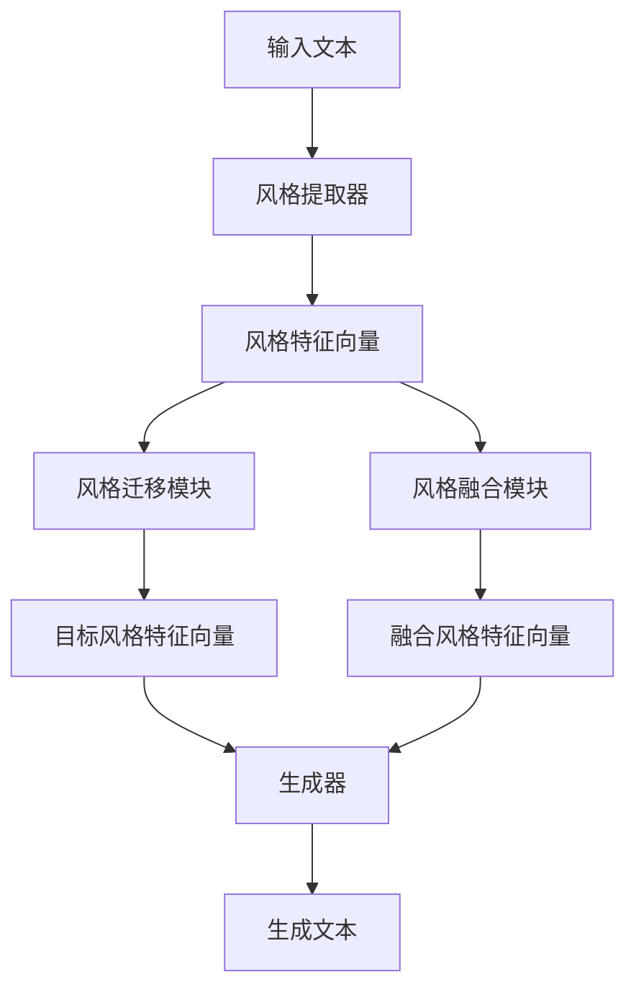

# LLM在AI Agent中的文本风格迁移与融合

> 关键词：大语言模型（LLM）、AI Agent、文本风格迁移、文本风格融合、自然语言处理

> 摘要：本文聚焦于大语言模型（LLM）在AI Agent中实现文本风格迁移与融合的技术。首先介绍了相关背景，包括目的范围、预期读者等内容。接着阐述了核心概念，通过文本示意图和Mermaid流程图展示其原理和架构。详细讲解了核心算法原理，结合Python代码进行说明，同时给出数学模型和公式，并举例解释。在项目实战部分，从开发环境搭建到源代码实现及解读进行了全面分析。探讨了该技术的实际应用场景，推荐了学习、开发工具及相关论文著作。最后总结了未来发展趋势与挑战，提供了常见问题解答和扩展阅读参考资料，旨在为相关领域的研究者和开发者提供全面深入的技术指导。

## 1. 背景介绍 

### 1.1 目的和范围
随着人工智能技术的飞速发展，大语言模型（LLM）如GPT系列、BLOOM等展现出了强大的语言理解和生成能力。AI Agent作为能够自主执行任务的智能实体，在众多领域得到了广泛应用。文本风格迁移与融合技术旨在让AI Agent能够根据不同的需求，将一种文本风格转换为另一种风格，或者将多种风格融合在一起，以满足多样化的语言表达需求。本文的范围涵盖了从核心概念的阐述、算法原理的分析、数学模型的构建，到实际项目的开发和应用场景的探讨，旨在全面深入地介绍LLM在AI Agent中文本风格迁移与融合的相关技术。

### 1.2 预期读者
本文预期读者包括自然语言处理领域的研究者、AI Agent开发者、对文本风格处理技术感兴趣的程序员以及相关专业的学生。希望通过本文的内容，能够帮助读者深入理解文本风格迁移与融合的技术原理，并掌握实际应用的方法。

### 1.3 文档结构概述
本文按照以下结构进行组织：首先介绍背景信息，包括目的、预期读者和文档结构。接着阐述核心概念，展示其原理和架构。然后详细讲解核心算法原理，并结合Python代码进行说明。随后给出数学模型和公式，并举例解释。在项目实战部分，从开发环境搭建到源代码实现及解读进行全面分析。探讨实际应用场景，推荐学习、开发工具及相关论文著作。最后总结未来发展趋势与挑战，提供常见问题解答和扩展阅读参考资料。

### 1.4 术语表

#### 1.4.1 核心术语定义
- **大语言模型（LLM）**：是一种基于深度学习的语言模型，通过在大规模文本数据上进行训练，能够学习到语言的模式和规律，具备强大的语言理解和生成能力。
- **AI Agent**：能够感知环境、进行决策并自主执行任务的智能实体，在自然语言处理中可以用于文本生成、对话等任务。
- **文本风格迁移**：将源文本的风格转换为目标风格的过程，例如将正式风格的文本转换为口语化风格。
- **文本风格融合**：将多种不同的文本风格融合在一起，生成具有混合风格的文本。

#### 1.4.2 相关概念解释
- **风格特征**：文本中体现特定风格的特征，如词汇选择、语法结构、修辞手法等。
- **风格表示**：用向量或其他形式对文本风格进行量化表示，以便在模型中进行处理。
- **微调（Fine-tuning）**：在预训练模型的基础上，使用特定的数据集对模型进行进一步训练，以适应特定的任务或风格。

#### 1.4.3 缩略词列表
- **LLM**：Large Language Model（大语言模型）
- **NLP**：Natural Language Processing（自然语言处理）
- **BERT**：Bidirectional Encoder Representations from Transformers（基于Transformer的双向编码器表示）
- **GPT**：Generative Pretrained Transformer（生成式预训练Transformer）

## 2. 核心概念与联系 

### 核心概念原理
文本风格迁移与融合的核心在于对文本风格的理解和操控。首先，需要对文本的风格进行表示，通常可以使用基于机器学习或深度学习的方法，将文本映射到一个风格特征空间中。在这个空间中，不同风格的文本具有不同的位置和分布。

对于文本风格迁移，通过学习源风格和目标风格在特征空间中的差异，找到一种映射关系，将源文本的风格特征转换为目标风格的特征。例如，可以使用对抗训练的方法，让生成器学习如何将源文本转换为目标风格的文本，同时让判别器判断生成的文本是否具有目标风格。

对于文本风格融合，需要将多种风格的特征进行融合。可以通过加权平均等方法，将不同风格的特征向量进行组合，生成具有混合风格的特征向量，然后根据这个特征向量生成融合风格的文本。

### 架构示意图
以下是文本风格迁移与融合的架构示意图：

```plaintext
输入文本 ---> 风格提取器 ---> 风格特征向量
                        |
                        |-- 风格迁移模块 ---> 目标风格特征向量
                        |
                        |-- 风格融合模块 ---> 融合风格特征向量
                        |
生成器 ---> 生成文本
```

### Mermaid流程图


## 3. 核心算法原理 & 具体操作步骤 

### 核心算法原理
#### 基于编码器 - 解码器的风格迁移
在基于编码器 - 解码器的风格迁移方法中，编码器将输入文本编码为一个中间表示，然后通过一个风格转换模块将中间表示的风格特征进行转换，最后解码器根据转换后的中间表示生成目标风格的文本。

以下是一个简化的Python代码示例：
```python
import torch
import torch.nn as nn

# 定义编码器
class Encoder(nn.Module):
    def __init__(self, input_size, hidden_size):
        super(Encoder, self).__init__()
        self.embedding = nn.Embedding(input_size, hidden_size)
        self.gru = nn.GRU(hidden_size, hidden_size)

    def forward(self, input):
        embedded = self.embedding(input)
        output, hidden = self.gru(embedded.view(1, 1, -1))
        return output, hidden

# 定义风格转换模块
class StyleTransferModule(nn.Module):
    def __init__(self, hidden_size):
        super(StyleTransferModule, self).__init__()
        self.fc = nn.Linear(hidden_size, hidden_size)

    def forward(self, hidden):
        transferred_hidden = self.fc(hidden)
        return transferred_hidden

# 定义解码器
class Decoder(nn.Module):
    def __init__(self, hidden_size, output_size):
        super(Decoder, self).__init__()
        self.embedding = nn.Embedding(output_size, hidden_size)
        self.gru = nn.GRU(hidden_size, hidden_size)
        self.out = nn.Linear(hidden_size, output_size)
        self.softmax = nn.LogSoftmax(dim=1)

    def forward(self, input, hidden):
        output = self.embedding(input).view(1, 1, -1)
        output = torch.relu(output)
        output, hidden = self.gru(output, hidden)
        output = self.softmax(self.out(output[0]))
        return output, hidden

# 初始化模型
input_size = 1000
hidden_size = 256
output_size = 1000
encoder = Encoder(input_size, hidden_size)
style_transfer = StyleTransferModule(hidden_size)
decoder = Decoder(hidden_size, output_size)

# 输入文本编码
input_text = torch.tensor([1, 2, 3])
output, hidden = encoder(input_text)

# 风格转换
transferred_hidden = style_transfer(hidden)

# 生成目标风格文本
target_style_text = []
decoder_input = torch.tensor([[0]])  # 起始符号
for _ in range(10):
    output, transferred_hidden = decoder(decoder_input, transferred_hidden)
    topv, topi = output.topk(1)
    decoder_input = topi.squeeze().detach()
    target_style_text.append(decoder_input.item())

print("目标风格文本:", target_style_text)
```

#### 基于对抗训练的风格迁移
基于对抗训练的风格迁移方法使用生成对抗网络（GAN）的思想。生成器尝试生成具有目标风格的文本，判别器则判断生成的文本是否具有目标风格。通过不断的对抗训练，生成器逐渐学会生成更逼真的目标风格文本。

以下是一个简化的基于对抗训练的风格迁移代码示例：
```python
import torch
import torch.nn as nn
import torch.optim as optim

# 定义生成器
class Generator(nn.Module):
    def __init__(self, input_size, hidden_size, output_size):
        super(Generator, self).__init__()
        self.embedding = nn.Embedding(input_size, hidden_size)
        self.gru = nn.GRU(hidden_size, hidden_size)
        self.out = nn.Linear(hidden_size, output_size)
        self.softmax = nn.LogSoftmax(dim=1)

    def forward(self, input, hidden):
        output = self.embedding(input).view(1, 1, -1)
        output = torch.relu(output)
        output, hidden = self.gru(output, hidden)
        output = self.softmax(self.out(output[0]))
        return output, hidden

# 定义判别器
class Discriminator(nn.Module):
    def __init__(self, input_size, hidden_size):
        super(Discriminator, self).__init__()
        self.embedding = nn.Embedding(input_size, hidden_size)
        self.gru = nn.GRU(hidden_size, hidden_size)
        self.out = nn.Linear(hidden_size, 1)
        self.sigmoid = nn.Sigmoid()

    def forward(self, input):
        embedded = self.embedding(input)
        output, hidden = self.gru(embedded.view(1, 1, -1))
        output = self.sigmoid(self.out(hidden.squeeze()))
        return output

# 初始化模型
input_size = 1000
hidden_size = 256
output_size = 1000
generator = Generator(input_size, hidden_size, output_size)
discriminator = Discriminator(input_size, hidden_size)

# 定义优化器和损失函数
g_optimizer = optim.Adam(generator.parameters(), lr=0.001)
d_optimizer = optim.Adam(discriminator.parameters(), lr=0.001)
criterion = nn.BCELoss()

# 训练过程
for epoch in range(100):
    # 生成器生成文本
    input_text = torch.tensor([1, 2, 3])
    hidden = torch.zeros(1, 1, hidden_size)
    generated_text = []
    decoder_input = torch.tensor([[0]])  # 起始符号
    for _ in range(10):
        output, hidden = generator(decoder_input, hidden)
        topv, topi = output.topk(1)
        decoder_input = topi.squeeze().detach()
        generated_text.append(decoder_input.item())
    generated_text = torch.tensor(generated_text)

    # 判别器训练
    d_optimizer.zero_grad()
    real_label = torch.tensor([1.0])
    fake_label = torch.tensor([0.0])

    # 计算判别器对真实文本的损失
    real_text = torch.tensor([4, 5, 6])
    real_output = discriminator(real_text)
    d_loss_real = criterion(real_output, real_label)

    # 计算判别器对生成文本的损失
    fake_output = discriminator(generated_text)
    d_loss_fake = criterion(fake_output, fake_label)

    # 总判别器损失
    d_loss = d_loss_real + d_loss_fake
    d_loss.backward()
    d_optimizer.step()

    # 生成器训练
    g_optimizer.zero_grad()
    fake_output = discriminator(generated_text)
    g_loss = criterion(fake_output, real_label)
    g_loss.backward()
    g_optimizer.step()

    if epoch % 10 == 0:
        print(f'Epoch {epoch}, D Loss: {d_loss.item()}, G Loss: {g_loss.item()}')
```

### 具体操作步骤
1. **数据准备**：收集具有不同风格的文本数据，并进行预处理，包括分词、词向量编码等。
2. **模型选择与初始化**：选择合适的模型架构，如上述的编码器 - 解码器模型或基于对抗训练的模型，并进行初始化。
3. **模型训练**：使用准备好的数据对模型进行训练，调整模型的参数以提高性能。
4. **风格迁移与融合**：在训练好的模型上，输入源文本，进行风格迁移或融合操作，生成目标风格或融合风格的文本。
5. **评估与优化**：使用评估指标对生成的文本进行评估，根据评估结果对模型进行优化。

## 4. 数学模型和公式 & 详细讲解 & 举例说明 

### 基于编码器 - 解码器的风格迁移数学模型
#### 编码器
编码器将输入文本 $\mathbf{x} = [x_1, x_2, \cdots, x_T]$ 编码为中间表示 $\mathbf{h} = [h_1, h_2, \cdots, h_T]$。对于每个时间步 $t$，编码器的输出 $h_t$ 可以通过以下公式计算：

$$
h_t = \text{GRU}(E(x_t), h_{t - 1})
$$

其中 $E$ 是词嵌入函数，将输入词 $x_t$ 映射到词向量空间，$\text{GRU}$ 是门控循环单元。

#### 风格转换模块
风格转换模块将编码器的最终隐藏状态 $h_T$ 转换为目标风格的隐藏状态 $h_T'$。可以使用一个全连接层来实现：

$$
h_T' = W_s h_T + b_s
$$

其中 $W_s$ 是权重矩阵，$b_s$ 是偏置向量。

#### 解码器
解码器根据转换后的隐藏状态 $h_T'$ 生成目标风格的文本。对于每个时间步 $t$，解码器的输出 $y_t$ 可以通过以下公式计算：

$$
y_t = \text{softmax}(W_d s_t + b_d)
$$

其中 $s_t$ 是解码器在时间步 $t$ 的隐藏状态，$W_d$ 是权重矩阵，$b_d$ 是偏置向量。

### 基于对抗训练的风格迁移数学模型
#### 生成器
生成器的目标是生成具有目标风格的文本。设生成器的输入为噪声向量 $\mathbf{z}$，生成器的输出为生成文本 $\mathbf{\hat{x}}$。生成器的损失函数可以定义为：

$$
L_G = -\log(D(G(\mathbf{z})))
$$

其中 $D$ 是判别器，$G$ 是生成器。

#### 判别器
判别器的目标是区分真实文本 $\mathbf{x}$ 和生成文本 $\mathbf{\hat{x}}$。判别器的损失函数可以定义为：

$$
L_D = -\log(D(\mathbf{x})) - \log(1 - D(G(\mathbf{z})))
$$

### 举例说明
假设我们有一个简单的输入文本 “This is a test.”，我们希望将其风格从正式风格转换为口语化风格。

#### 基于编码器 - 解码器的风格迁移
- **编码器**：将输入文本 “This is a test.” 分词后，通过词嵌入层将每个词转换为词向量，然后输入到GRU中，得到中间表示。
- **风格转换模块**：将编码器的最终隐藏状态通过全连接层进行转换，得到目标风格的隐藏状态。
- **解码器**：根据目标风格的隐藏状态，逐步生成口语化风格的文本，如 “This is just a test, ya know.”

#### 基于对抗训练的风格迁移
- **生成器**：生成器尝试生成口语化风格的文本，如 “This is just a test, ya know.”
- **判别器**：判别器判断生成的文本是否具有口语化风格，如果判断错误，生成器和判别器的参数会进行相应的调整，直到生成器能够生成更逼真的口语化风格文本。

## 5. 项目实战：代码实际案例和详细解释说明 

### 5.1  开发环境搭建
#### 安装Python和相关库
首先，确保你已经安装了Python 3.7或更高版本。然后，使用以下命令安装所需的库：
```sh
pip install torch
pip install transformers
pip install numpy
```

#### 数据集准备
收集具有不同风格的文本数据集，例如正式文本和口语化文本。可以使用公开的数据集，也可以自己标注数据。将数据集分为训练集、验证集和测试集。

### 5.2  源代码详细实现和代码解读
以下是一个基于Hugging Face Transformers库的文本风格迁移项目示例：

```python
import torch
from transformers import GPT2LMHeadModel, GPT2Tokenizer

# 加载预训练模型和分词器
model_name = "gpt2"
tokenizer = GPT2Tokenizer.from_pretrained(model_name)
model = GPT2LMHeadModel.from_pretrained(model_name)

# 定义源文本和目标风格提示
source_text = "This is a formal statement."
target_style_prompt = "Please convert the following text to a casual style: "

# 构建输入文本
input_text = target_style_prompt + source_text
input_ids = tokenizer.encode(input_text, return_tensors='pt')

# 生成目标风格文本
output = model.generate(input_ids, max_length=50, num_beams=5, no_repeat_ngram_size=2, early_stopping=True)
generated_text = tokenizer.decode(output[0], skip_special_tokens=True)

# 提取生成的目标风格文本
target_style_text = generated_text.replace(input_text, "")

print("源文本:", source_text)
print("目标风格文本:", target_style_text)
```

### 代码解读与分析
1. **加载预训练模型和分词器**：使用Hugging Face Transformers库加载预训练的GPT - 2模型和对应的分词器。
2. **定义源文本和目标风格提示**：指定要进行风格迁移的源文本和目标风格的提示信息。
3. **构建输入文本**：将目标风格提示和源文本拼接在一起，作为模型的输入。
4. **生成目标风格文本**：使用模型的 `generate` 方法生成目标风格的文本。可以通过调整 `max_length`、`num_beams` 等参数来控制生成文本的长度和质量。
5. **提取生成的目标风格文本**：从生成的文本中提取出目标风格的部分。

## 6. 实际应用场景 
### 智能写作助手
在写作过程中，用户可能需要将文章的风格从正式风格转换为口语化风格，或者将不同风格的段落进行融合。AI Agent可以利用文本风格迁移与融合技术，根据用户的需求自动调整文本风格，提高写作效率和质量。

### 多语言翻译
在多语言翻译中，除了准确翻译文本内容外，还需要考虑目标语言的风格。通过文本风格迁移技术，可以将源语言文本的风格转换为目标语言的合适风格，使翻译结果更加自然流畅。

### 虚拟客服
虚拟客服需要根据不同的客户需求和场景，使用不同的语言风格进行回复。例如，对于友好型客户，可以使用亲切的口语化风格；对于专业型客户，可以使用正式的专业风格。文本风格迁移与融合技术可以帮助虚拟客服实现灵活的风格切换。

### 文化传播与娱乐
在文化传播和娱乐领域，需要根据不同的文化背景和受众群体，调整文本的风格。例如，在将古代文学作品改编为现代影视剧本时，可以使用文本风格迁移技术将古代文言文的风格转换为现代白话文的风格，同时保留一定的文化韵味。

## 7. 工具和资源推荐
### 7.1 学习资源推荐
#### 7.1.1 书籍推荐
- 《自然语言处理入门》：介绍了自然语言处理的基本概念和方法，对于理解文本风格迁移与融合的基础原理有很大帮助。
- 《深度学习》：深入讲解了深度学习的理论和算法，为理解基于深度学习的文本风格处理技术提供了理论支持。
- 《Python自然语言处理实战》：通过实际案例介绍了如何使用Python进行自然语言处理任务，包括文本风格处理。

#### 7.1.2 在线课程
- Coursera上的“Natural Language Processing Specialization”：提供了全面的自然语言处理课程，包括文本生成、风格迁移等内容。
- edX上的“Deep Learning for Natural Language Processing”：深入讲解了深度学习在自然语言处理中的应用，适合有一定基础的学习者。
- 哔哩哔哩上有很多关于自然语言处理和大语言模型的教程视频，可以作为辅助学习资源。

#### 7.1.3 技术博客和网站
- Hugging Face博客：提供了关于大语言模型和自然语言处理的最新技术和研究成果。
- Medium上的自然语言处理相关博客：有很多专业人士分享的技术文章和实践经验。
- arXiv.org：可以获取最新的自然语言处理研究论文。

### 7.2 开发工具框架推荐
#### 7.2.1 IDE和编辑器
- PyCharm：功能强大的Python集成开发环境，提供了代码编辑、调试、版本控制等功能。
- Visual Studio Code：轻量级的代码编辑器，支持多种编程语言，有丰富的插件可以扩展功能。
- Jupyter Notebook：适合进行交互式编程和数据分析，方便代码的调试和展示。

#### 7.2.2 调试和性能分析工具
- TensorBoard：用于可视化深度学习模型的训练过程和性能指标，帮助开发者监控模型的训练情况。
- Py-Spy：可以对Python代码进行性能分析，找出代码中的性能瓶颈。
- PDB：Python自带的调试器，用于调试Python代码。

#### 7.2.3 相关框架和库
- Hugging Face Transformers：提供了丰富的预训练模型和工具，方便进行自然语言处理任务，包括文本生成、风格迁移等。
- PyTorch：深度学习框架，具有灵活的计算图和强大的GPU支持，广泛应用于自然语言处理领域。
- NLTK：自然语言处理工具包，提供了各种自然语言处理的工具和数据集。

### 7.3 相关论文著作推荐
#### 7.3.1 经典论文
- “Attention Is All You Need”：介绍了Transformer架构，为现代大语言模型的发展奠定了基础。
- “Generative Adversarial Nets”：提出了生成对抗网络（GAN）的概念，为文本风格迁移中的对抗训练方法提供了理论支持。
- “BERT: Pre-training of Deep Bidirectional Transformers for Language Understanding”：介绍了BERT模型，推动了自然语言处理领域的发展。

#### 7.3.2 最新研究成果
- 在ACL（Association for Computational Linguistics）、EMNLP（Conference on Empirical Methods in Natural Language Processing）等自然语言处理顶级会议上可以获取最新的研究成果。
- arXiv.org上也有很多关于文本风格迁移与融合的最新研究论文。

#### 7.3.3 应用案例分析
- 可以关注一些实际应用案例的论文，了解文本风格迁移与融合技术在不同领域的应用方法和效果。例如，一些关于智能写作助手、虚拟客服等应用的论文。

## 8. 总结：未来发展趋势与挑战
### 未来发展趋势
- **多模态融合**：未来的文本风格迁移与融合技术可能会与图像、音频等多模态信息进行融合，实现更加丰富和多样化的风格表达。例如，在视频内容创作中，将文本风格与视频的视觉风格、音频风格进行融合。
- **个性化风格定制**：根据用户的个人喜好和使用习惯，实现个性化的文本风格迁移与融合。例如，为每个用户定制独特的写作风格模板。
- **跨领域应用拓展**：除了现有的应用场景，文本风格迁移与融合技术可能会在更多领域得到应用，如法律文书写作、医学报告生成等。

### 挑战
- **风格定义和表示的准确性**：准确地定义和表示文本风格是一个挑战，不同的人对同一种风格可能有不同的理解。需要建立更加客观和准确的风格表示方法。
- **数据的多样性和质量**：高质量的数据集是训练模型的关键，但收集具有丰富风格的数据集并不容易。同时，数据的标注也需要耗费大量的人力和时间。
- **模型的可解释性**：目前的深度学习模型大多是黑盒模型，缺乏可解释性。在文本风格迁移与融合中，需要提高模型的可解释性，以便更好地理解模型的决策过程。

## 9. 附录：常见问题与解答
### 问题1：文本风格迁移与文本翻译有什么区别？
文本翻译主要是将一种语言的文本转换为另一种语言的文本，重点在于语义的准确传达。而文本风格迁移是在同一种语言内，将文本的风格从一种转换为另一种，重点在于风格的改变，语义基本保持不变。

### 问题2：如何评估文本风格迁移的效果？
可以使用人工评估和自动评估两种方法。人工评估可以邀请专业人士或普通用户对生成的文本进行打分，评价其风格的准确性和自然度。自动评估可以使用一些指标，如困惑度、BLEU分数等，但这些指标对于风格评估的准确性有限。

### 问题3：文本风格融合是否会导致语义混乱？
如果融合方法不当，可能会导致语义混乱。在进行文本风格融合时，需要合理地选择融合策略，确保在融合风格的同时，保持语义的清晰和连贯。

### 问题4：如何选择合适的模型进行文本风格迁移与融合？
可以根据任务的需求和数据集的特点选择合适的模型。如果数据集较小，可以选择预训练模型进行微调；如果数据集较大，可以考虑使用基于对抗训练的模型或自定义的模型架构。

## 10. 扩展阅读 & 参考资料
- Hugging Face官方文档：https://huggingface.co/docs
- PyTorch官方文档：https://pytorch.org/docs/stable/index.html
- 《自然语言处理实战：基于Python和深度学习》
- ACL、EMNLP等会议论文集