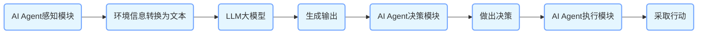

# LLM大模型在AI Agent开发中的核心作用

> 关键词：LLM大模型、AI Agent、自然语言处理、智能决策、自主交互

> 摘要：本文深入探讨了LLM大模型在AI Agent开发中的核心作用。首先介绍了研究的背景、目的、预期读者、文档结构和相关术语。接着阐述了LLM大模型与AI Agent的核心概念及其联系，通过文本示意图和Mermaid流程图进行了清晰展示。详细讲解了核心算法原理，并给出Python源代码示例。同时，介绍了相关的数学模型和公式，并举例说明。通过项目实战，给出了开发环境搭建、源代码实现和解读。分析了LLM大模型在AI Agent中的实际应用场景，推荐了学习资源、开发工具框架和相关论文著作。最后总结了未来发展趋势与挑战，解答了常见问题，并提供了扩展阅读和参考资料。

## 1. 背景介绍 
### 1.1 目的和范围
随着人工智能技术的快速发展，AI Agent的应用越来越广泛。LLM大模型作为自然语言处理领域的重要突破，为AI Agent的开发带来了新的机遇和挑战。本文的目的是深入探讨LLM大模型在AI Agent开发中的核心作用，包括其原理、算法、应用场景等方面。范围涵盖了从基础概念到实际应用的各个层面，旨在为开发者和研究者提供全面的参考。

### 1.2 预期读者
本文的预期读者包括人工智能领域的开发者、研究者、学生，以及对AI Agent和LLM大模型感兴趣的技术爱好者。无论是初学者还是有一定经验的专业人士，都能从本文中获得有价值的信息。

### 1.3 文档结构概述
本文共分为十个部分。第一部分为背景介绍，包括目的、范围、预期读者和文档结构概述。第二部分阐述核心概念与联系，展示LLM大模型与AI Agent的关系。第三部分讲解核心算法原理和具体操作步骤，并给出Python代码示例。第四部分介绍数学模型和公式，并举例说明。第五部分通过项目实战，详细介绍开发环境搭建、源代码实现和解读。第六部分分析实际应用场景。第七部分推荐学习资源、开发工具框架和相关论文著作。第八部分总结未来发展趋势与挑战。第九部分解答常见问题。第十部分提供扩展阅读和参考资料。

### 1.4 术语表
#### 1.4.1 核心术语定义
- **LLM大模型**：Large Language Model，即大型语言模型，是一种基于深度学习的自然语言处理模型，通过大量的文本数据进行训练，能够生成高质量的自然语言文本。
- **AI Agent**：Artificial Intelligence Agent，即人工智能智能体，是一种能够感知环境、做出决策并采取行动的智能实体。
- **自然语言处理**：Natural Language Processing，简称NLP，是人工智能的一个重要领域，旨在让计算机能够理解、处理和生成自然语言。

#### 1.4.2 相关概念解释
- **预训练**：在大规模无监督数据上对模型进行训练，以学习语言的通用特征和模式。
- **微调**：在预训练模型的基础上，使用特定任务的有监督数据对模型进行进一步训练，以适应具体任务的需求。
- **上下文学习**：模型能够根据输入的上下文信息，生成更符合语境的输出。

#### 1.4.3 缩略词列表
- **LLM**：Large Language Model
- **AI**：Artificial Intelligence
- **NLP**：Natural Language Processing

## 2. 核心概念与联系 

### 核心概念原理
#### LLM大模型原理
LLM大模型通常基于Transformer架构，通过多头自注意力机制和前馈神经网络来学习语言的表示和模式。在预训练阶段，模型使用大规模的无监督文本数据进行训练，学习语言的通用特征。例如，通过预测下一个单词的任务，模型能够学习到单词之间的语义和语法关系。在微调阶段，模型使用特定任务的有监督数据进行进一步训练，以适应具体任务的需求。

#### AI Agent原理
AI Agent是一个能够感知环境、做出决策并采取行动的智能实体。它通常由感知模块、决策模块和执行模块组成。感知模块用于获取环境信息，决策模块根据感知到的信息做出决策，执行模块根据决策采取相应的行动。

### 架构的文本示意图
LLM大模型为AI Agent提供了强大的自然语言处理能力。AI Agent的感知模块可以将环境信息转换为自然语言文本，输入到LLM大模型中。LLM大模型根据输入的文本生成相应的输出，为AI Agent的决策模块提供参考。决策模块根据LLM大模型的输出和其他信息做出决策，执行模块根据决策采取行动。

### Mermaid流程图


## 3. 核心算法原理 & 具体操作步骤 

### 核心算法原理
LLM大模型的核心算法基于Transformer架构，其中多头自注意力机制是其关键组成部分。多头自注意力机制允许模型在不同的表示子空间中并行地关注输入序列的不同部分，从而捕捉到更丰富的语义信息。

以下是多头自注意力机制的Python代码实现：
```python
import torch
import torch.nn as nn

class MultiHeadAttention(nn.Module):
    def __init__(self, embed_size, num_heads):
        super(MultiHeadAttention, self).__init__()
        self.embed_size = embed_size
        self.num_heads = num_heads
        self.head_dim = embed_size // num_heads

        assert (
            self.head_dim * num_heads == embed_size
        ), "Embedding size needs to be divisible by heads"

        self.values = nn.Linear(self.head_dim, self.head_dim, bias=False)
        self.keys = nn.Linear(self.head_dim, self.head_dim, bias=False)
        self.queries = nn.Linear(self.head_dim, self.head_dim, bias=False)
        self.fc_out = nn.Linear(num_heads * self.head_dim, embed_size)

    def forward(self, values, keys, query, mask):
        N = query.shape[0]
        value_len, key_len, query_len = values.shape[1], keys.shape[1], query.shape[1]

        # Split the embedding into self.num_heads different pieces
        values = values.reshape(N, value_len, self.num_heads, self.head_dim)
        keys = keys.reshape(N, key_len, self.num_heads, self.head_dim)
        queries = query.reshape(N, query_len, self.num_heads, self.head_dim)

        values = self.values(values)
        keys = self.keys(keys)
        queries = self.queries(queries)

        # Scaled dot-product attention
        energy = torch.einsum("nqhd,nkhd->nhqk", [queries, keys])
        if mask is not None:
            energy = energy.masked_fill(mask == 0, float("-1e20"))

        attention = torch.softmax(energy / (self.embed_size ** (1 / 2)), dim=3)

        out = torch.einsum("nhql,nlhd->nqhd", [attention, values]).reshape(
            N, query_len, self.num_heads * self.head_dim
        )

        out = self.fc_out(out)
        return out
```

### 具体操作步骤
1. **数据预处理**：将输入的文本数据进行分词、编码等处理，转换为模型可以接受的输入格式。
2. **模型加载**：加载预训练的LLM大模型。
3. **输入文本处理**：将预处理后的文本输入到模型中。
4. **模型推理**：模型根据输入的文本进行推理，生成相应的输出。
5. **输出处理**：对模型的输出进行解码、后处理等操作，得到最终的结果。

以下是一个简单的示例代码：
```python
import torch
from transformers import AutoTokenizer, AutoModelForCausalLM

# 加载预训练的模型和分词器
tokenizer = AutoTokenizer.from_pretrained("gpt2")
model = AutoModelForCausalLM.from_pretrained("gpt2")

# 输入文本
input_text = "Hello, how are you?"

# 数据预处理
input_ids = tokenizer.encode(input_text, return_tensors="pt")

# 模型推理
output = model.generate(input_ids, max_length=50, num_return_sequences=1)

# 输出处理
output_text = tokenizer.decode(output[0], skip_special_tokens=True)
print(output_text)
```

## 4. 数学模型和公式 & 详细讲解 & 举例说明 

### 数学模型和公式
#### 多头自注意力机制
多头自注意力机制的核心公式如下：

$$
\text{Attention}(Q, K, V) = \text{softmax}(\frac{QK^T}{\sqrt{d_k}})V
$$

其中，$Q$ 是查询矩阵，$K$ 是键矩阵，$V$ 是值矩阵，$d_k$ 是键的维度。

多头自注意力机制将输入的嵌入向量分成多个头，每个头独立地进行自注意力计算，最后将结果拼接起来：

$$
\text{MultiHead}(Q, K, V) = \text{Concat}(\text{head}_1, \ldots, \text{head}_h)W^O
$$

其中，$\text{head}_i = \text{Attention}(QW_i^Q, KW_i^K, VW_i^V)$，$W_i^Q$、$W_i^K$、$W_i^V$ 是投影矩阵，$W^O$ 是输出投影矩阵。

#### 交叉熵损失函数
在微调阶段，通常使用交叉熵损失函数来训练模型：

$$
L = -\frac{1}{N}\sum_{i=1}^{N}\sum_{j=1}^{C}y_{ij}\log(p_{ij})
$$

其中，$N$ 是样本数量，$C$ 是类别数量，$y_{ij}$ 是真实标签，$p_{ij}$ 是模型预测的概率。

### 详细讲解
#### 多头自注意力机制
多头自注意力机制允许模型在不同的表示子空间中并行地关注输入序列的不同部分。通过将输入的嵌入向量分成多个头，每个头可以学习到不同的语义信息。最后将所有头的结果拼接起来，得到最终的输出。这种机制可以提高模型的表达能力和捕捉语义信息的能力。

#### 交叉熵损失函数
交叉熵损失函数用于衡量模型预测的概率分布与真实标签的差异。在分类任务中，模型的目标是使预测的概率分布尽可能接近真实标签的概率分布。交叉熵损失函数可以有效地引导模型进行学习，使模型的预测结果更加准确。

### 举例说明
假设我们有一个输入序列 $x = [x_1, x_2, x_3]$，嵌入维度为 $d = 6$，头的数量为 $h = 2$。则每个头的维度为 $d_k = d / h = 3$。

首先，将输入序列的嵌入向量 $x$ 分别投影到查询矩阵 $Q$、键矩阵 $K$ 和值矩阵 $V$：

$$
Q = xW^Q, \quad K = xW^K, \quad V = xW^V
$$

然后，计算每个头的注意力分数：

$$
\text{Attention}_i(Q_i, K_i, V_i) = \text{softmax}(\frac{Q_iK_i^T}{\sqrt{d_k}})V_i
$$

最后，将所有头的结果拼接起来，并通过输出投影矩阵 $W^O$ 得到最终的输出：

$$
\text{MultiHead}(Q, K, V) = \text{Concat}(\text{Attention}_1, \text{Attention}_2)W^O
$$

## 5. 项目实战：代码实际案例和详细解释说明 

### 5.1  开发环境搭建
#### 安装Python
首先，确保你已经安装了Python 3.7或更高版本。可以从Python官方网站（https://www.python.org/downloads/）下载并安装。

#### 创建虚拟环境
为了避免不同项目之间的依赖冲突，建议使用虚拟环境。可以使用`venv`或`conda`来创建虚拟环境。

使用`venv`创建虚拟环境的命令如下：
```bash
python -m venv myenv
```

激活虚拟环境：
```bash
source myenv/bin/activate  # Linux/Mac
myenv\Scripts\activate  # Windows
```

#### 安装依赖库
在虚拟环境中安装所需的依赖库，包括`transformers`、`torch`等。可以使用`pip`来安装：
```bash
pip install transformers torch
```

### 5.2  源代码详细实现和代码解读
以下是一个使用LLM大模型实现简单问答系统的示例代码：
```python
import torch
from transformers import AutoTokenizer, AutoModelForQuestionAnswering

# 加载预训练的模型和分词器
tokenizer = AutoTokenizer.from_pretrained("bert-large-uncased-whole-word-masking-finetuned-squad")
model = AutoModelForQuestionAnswering.from_pretrained("bert-large-uncased-whole-word-masking-finetuned-squad")

# 输入文本和问题
context = "Albert Einstein was a German-born theoretical physicist. He developed the theory of relativity."
question = "Who developed the theory of relativity?"

# 数据预处理
inputs = tokenizer(question, context, return_tensors="pt")

# 模型推理
outputs = model(**inputs)
answer_start_scores = outputs.start_logits
answer_end_scores = outputs.end_logits

# 找到答案的起始和结束位置
answer_start = torch.argmax(answer_start_scores)
answer_end = torch.argmax(answer_end_scores) + 1

# 提取答案
answer = tokenizer.convert_tokens_to_string(tokenizer.convert_ids_to_tokens(inputs["input_ids"][0][answer_start:answer_end]))

print("Question:", question)
print("Answer:", answer)
```

### 代码解读与分析
1. **加载模型和分词器**：使用`transformers`库加载预训练的问答模型和对应的分词器。
2. **输入文本和问题**：定义上下文文本和问题。
3. **数据预处理**：使用分词器将问题和上下文文本进行编码，转换为模型可以接受的输入格式。
4. **模型推理**：将预处理后的输入数据输入到模型中，得到答案的起始和结束位置的得分。
5. **找到答案的起始和结束位置**：通过`torch.argmax`函数找到得分最高的起始和结束位置。
6. **提取答案**：根据起始和结束位置，从输入的编码中提取答案，并将其转换为字符串。

## 6. 实际应用场景 
### 智能客服
LLM大模型可以为AI Agent提供强大的自然语言理解和生成能力，使其能够更好地理解用户的问题，并生成准确、自然的回答。在智能客服场景中，AI Agent可以自动回答用户的常见问题，提高客服效率和服务质量。

### 智能写作助手
AI Agent结合LLM大模型可以帮助用户进行写作，如生成文章大纲、提供词汇建议、检查语法错误等。用户可以输入一些关键词或主题，AI Agent可以根据这些信息生成相关的文本内容，提高写作效率和质量。

### 智能教育
在教育领域，AI Agent可以作为智能辅导工具，根据学生的问题提供详细的解答和指导。LLM大模型可以帮助AI Agent理解学生的问题，并生成个性化的学习资源，如练习题、讲解视频等。

### 智能家居控制
AI Agent可以通过语音交互与用户进行沟通，结合LLM大模型的自然语言处理能力，用户可以使用自然语言指令控制智能家居设备，如打开灯光、调节温度等。

## 7. 工具和资源推荐
### 7.1 学习资源推荐
#### 7.1.1 书籍推荐
- 《深度学习》（Deep Learning）：由Ian Goodfellow、Yoshua Bengio和Aaron Courville撰写，是深度学习领域的经典教材。
- 《自然语言处理入门》（Natural Language Processing in Action）：介绍了自然语言处理的基本概念和技术，适合初学者。
- 《Transformer神经网络：基于PyTorch和TensorFlow的实战指南》（Transformers for Natural Language Processing）：详细介绍了Transformer架构和相关的自然语言处理技术。

#### 7.1.2 在线课程
- Coursera上的“深度学习专项课程”（Deep Learning Specialization）：由Andrew Ng教授讲授，涵盖了深度学习的各个方面。
- edX上的“自然语言处理”（Natural Language Processing）：介绍了自然语言处理的基本概念和技术。
- Kaggle上的“自然语言处理微课程”（Natural Language Processing Micro-Course）：提供了自然语言处理的实践教程。

#### 7.1.3 技术博客和网站
- Hugging Face博客（https://huggingface.co/blog）：提供了关于Transformer模型和自然语言处理的最新技术和研究成果。
- Towards Data Science（https://towardsdatascience.com/）：涵盖了数据科学、机器学习和人工智能等领域的技术文章。
- arXiv（https://arxiv.org/）：提供了最新的学术论文，包括自然语言处理和深度学习方面的研究。

### 7.2 开发工具框架推荐
#### 7.2.1 IDE和编辑器
- PyCharm：一款专业的Python集成开发环境，提供了丰富的代码编辑、调试和版本控制功能。
- Visual Studio Code：一款轻量级的代码编辑器，支持多种编程语言，并且有丰富的扩展插件。

#### 7.2.2 调试和性能分析工具
- TensorBoard：用于可视化深度学习模型的训练过程和性能指标。
- PyTorch Profiler：用于分析PyTorch模型的性能瓶颈。

#### 7.2.3 相关框架和库
- Transformers：由Hugging Face开发的自然语言处理库，提供了多种预训练的模型和工具。
- PyTorch：一个开源的深度学习框架，广泛应用于自然语言处理和计算机视觉等领域。

### 7.3 相关论文著作推荐
#### 7.3.1 经典论文
- 《Attention Is All You Need》：介绍了Transformer架构，是自然语言处理领域的经典论文。
- 《BERT: Pre-training of Deep Bidirectional Transformers for Language Understanding》：提出了BERT模型，开创了预训练语言模型的先河。

#### 7.3.2 最新研究成果
- 《GPT-3: Language Models are Few-Shot Learners》：介绍了GPT-3模型，展示了其在少样本学习方面的强大能力。
- 《ChatGPT: Optimizing Language Models for Dialogue》：介绍了ChatGPT模型，是目前最先进的对话式语言模型之一。

#### 7.3.3 应用案例分析
- 《Using Large Language Models for Information Retrieval》：介绍了如何使用LLM大模型进行信息检索。
- 《Large Language Models in Healthcare: A Survey》：探讨了LLM大模型在医疗领域的应用。

## 8. 总结：未来发展趋势与挑战
### 未来发展趋势
- **更强的语言理解和生成能力**：LLM大模型将不断提高其语言理解和生成能力，能够更好地处理复杂的语言任务，如语义推理、情感分析等。
- **多模态融合**：未来的AI Agent将不仅仅局限于自然语言处理，还将融合图像、音频等多模态信息，实现更加智能的交互。
- **个性化和定制化**：AI Agent将能够根据用户的个性化需求和偏好，提供更加定制化的服务和建议。
- **跨领域应用**：LLM大模型和AI Agent将在更多的领域得到应用，如金融、法律、医疗等，为这些领域带来新的发展机遇。

### 挑战
- **数据隐私和安全**：LLM大模型需要大量的数据进行训练，如何保护数据的隐私和安全是一个重要的挑战。
- **计算资源需求**：训练和运行LLM大模型需要大量的计算资源，如何降低计算成本和提高效率是一个亟待解决的问题。
- **模型可解释性**：LLM大模型通常是黑盒模型，其决策过程难以解释，如何提高模型的可解释性是一个重要的研究方向。
- **伦理和道德问题**：AI Agent的应用可能会带来一些伦理和道德问题，如虚假信息传播、偏见和歧视等，需要制定相应的规范和准则来加以解决。

## 9. 附录：常见问题与解答
### 问题1：LLM大模型和AI Agent有什么区别？
LLM大模型是一种基于深度学习的自然语言处理模型，主要用于处理和生成自然语言文本。而AI Agent是一个能够感知环境、做出决策并采取行动的智能实体。LLM大模型可以为AI Agent提供自然语言处理能力，但AI Agent还需要具备其他的功能，如感知、决策和执行等。

### 问题2：如何选择适合的LLM大模型？
选择适合的LLM大模型需要考虑多个因素，如任务类型、数据规模、计算资源等。如果是处理自然语言生成任务，可以选择GPT系列模型；如果是处理自然语言理解任务，可以选择BERT系列模型。同时，还需要考虑模型的大小和复杂度，以确保在可用的计算资源下能够正常运行。

### 问题3：如何对LLM大模型进行微调？
对LLM大模型进行微调通常需要以下步骤：
1. 准备数据集：收集和整理与具体任务相关的有监督数据。
2. 加载预训练模型：使用`transformers`库加载预训练的LLM大模型。
3. 定义训练参数：如学习率、批次大小、训练轮数等。
4. 进行微调训练：使用准备好的数据集对模型进行微调训练。
5. 评估和优化：使用验证集对微调后的模型进行评估，并根据评估结果进行优化。

### 问题4：LLM大模型在实际应用中可能会遇到哪些问题？
LLM大模型在实际应用中可能会遇到以下问题：
- **生成的文本质量不高**：模型可能会生成一些无意义或不准确的文本。
- **存在偏见和歧视**：模型在训练过程中可能会学习到数据中的偏见和歧视信息。
- **计算资源需求大**：训练和运行模型需要大量的计算资源。
- **数据隐私和安全问题**：模型需要大量的数据进行训练，如何保护数据的隐私和安全是一个重要的问题。

## 10. 扩展阅读 & 参考资料
### 扩展阅读
- 《人工智能：现代方法》（Artificial Intelligence: A Modern Approach）：全面介绍了人工智能的各个方面，包括搜索算法、机器学习、自然语言处理等。
- 《深度学习实战》（Deep Learning in Practice）：通过实际案例介绍了深度学习的应用和实践技巧。

### 参考资料
- Hugging Face官方文档（https://huggingface.co/docs/transformers/index）：提供了关于`transformers`库的详细文档和使用指南。
- PyTorch官方文档（https://pytorch.org/docs/stable/index.html）：提供了关于PyTorch框架的详细文档和使用指南。