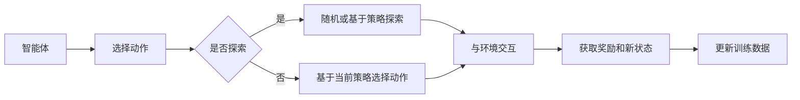

# PRM训练数据收集中的exploration策略

> 关键词：PRM、训练数据收集、exploration策略、强化学习、机器人导航、路径规划、数据多样性

> 摘要：本文聚焦于PRM（Probabilistic Roadmap，概率路线图）训练数据收集中的exploration策略。首先介绍了PRM及数据收集的背景知识，阐述了exploration策略的核心概念与联系。详细讲解了相关核心算法原理，通过Python代码进行具体操作步骤的演示。深入探讨了其数学模型和公式，并举例说明。结合项目实战，展示了代码实现及解读。分析了实际应用场景，推荐了相关工具和资源。最后总结了未来发展趋势与挑战，还包含常见问题解答与扩展阅读参考资料，旨在为读者全面深入地理解PRM训练数据收集中的exploration策略提供帮助。

## 1. 背景介绍 
### 1.1 目的和范围
PRM是一种在机器人导航、路径规划等领域广泛应用的算法，其性能很大程度上依赖于训练数据的质量和多样性。而在训练数据收集过程中，exploration策略起着关键作用，它能够帮助我们更有效地探索环境，获取更丰富、更有价值的数据。本文的目的在于深入探讨PRM训练数据收集中的exploration策略，包括其原理、算法、应用等方面，范围涵盖了从基础概念到实际项目应用的多个层面。

### 1.2 预期读者
本文预期读者包括对机器人导航、路径规划、强化学习等领域感兴趣的研究人员、工程师，以及相关专业的学生。无论是希望深入理解PRM算法的理论基础，还是想要在实际项目中应用exploration策略来优化数据收集过程的读者，都能从本文中获得有价值的信息。

### 1.3 文档结构概述
本文将按照以下结构展开：首先介绍相关的核心概念与联系，包括PRM、exploration策略等；接着详细讲解核心算法原理，并给出Python代码示例；然后阐述其数学模型和公式，并举例说明；通过项目实战展示代码的实际应用和详细解释；分析实际应用场景；推荐相关的工具和资源；最后总结未来发展趋势与挑战，还会提供常见问题解答和扩展阅读参考资料。

### 1.4 术语表
#### 1.4.1 核心术语定义
- **PRM（Probabilistic Roadmap）**：概率路线图，是一种用于解决机器人运动规划问题的算法，通过在环境中随机采样点并连接可行路径来构建路线图。
- **exploration策略**：在训练数据收集过程中，用于探索未知环境、发现新的状态和动作的策略，以增加训练数据的多样性。
- **训练数据收集**：为了训练PRM算法而收集环境中的状态、动作、奖励等数据的过程。

#### 1.4.2 相关概念解释
- **强化学习**：一种机器学习范式，智能体通过与环境进行交互，根据环境反馈的奖励信号来学习最优策略。在PRM训练数据收集中，强化学习的思想可以用于设计exploration策略。
- **状态空间**：环境中所有可能状态的集合，在PRM中，状态通常表示机器人在环境中的位置和姿态。
- **动作空间**：智能体在每个状态下可以执行的所有可能动作的集合，例如机器人的移动方向和速度。

#### 1.4.3 缩略词列表
- **PRM**：Probabilistic Roadmap（概率路线图）
- **RL**：Reinforcement Learning（强化学习）

## 2. 核心概念与联系 

### 2.1 PRM原理
PRM算法的基本思想是在环境中随机采样一组节点，然后检查这些节点之间的连接是否可行（即是否会碰撞障碍物），将可行的连接构建成一个路线图。在路径规划时，通过搜索这个路线图来找到从起点到终点的路径。

其原理示意图如下：


### 2.2 exploration策略原理
exploration策略的核心目标是在训练数据收集过程中，鼓励智能体探索未知的状态和动作，以增加训练数据的多样性。常见的exploration策略包括随机探索、基于好奇心的探索等。

其原理示意图如下：



### 2.3 两者联系
exploration策略在PRM训练数据收集中起着至关重要的作用。通过有效的exploration策略，可以让智能体更全面地探索环境，发现更多可行的路径和状态，从而为PRM算法提供更丰富、更有代表性的训练数据，提高PRM算法的性能和泛化能力。

## 3. 核心算法原理 & 具体操作步骤 

### 3.1 随机探索策略
随机探索策略是最简单的exploration策略之一，智能体在每个时间步随机选择一个动作进行探索。

Python代码示例：

```python
import numpy as np

class RandomExploration:
    def __init__(self, action_space):
        self.action_space = action_space

    def select_action(self):
        # 随机选择一个动作
        action = np.random.choice(self.action_space)
        return action

# 示例使用
action_space = [0, 1, 2, 3]  # 假设动作空间有4个动作
exploration = RandomExploration(action_space)
action = exploration.select_action()
print("随机选择的动作:", action)
```

### 3.2 基于好奇心的探索策略
基于好奇心的探索策略通过计算智能体对未知状态的好奇心来鼓励探索。一种常见的方法是使用预测误差作为好奇心的度量。

Python代码示例：

```python
import numpy as np
import torch
import torch.nn as nn

# 定义一个简单的预测模型
class PredictionModel(nn.Module):
    def __init__(self, state_dim, action_dim):
        super(PredictionModel, self).__init__()
        self.fc1 = nn.Linear(state_dim + action_dim, 128)
        self.fc2 = nn.Linear(128, state_dim)

    def forward(self, state, action):
        x = torch.cat([state, action], dim=-1)
        x = torch.relu(self.fc1(x))
        next_state_pred = self.fc2(x)
        return next_state_pred

class CuriosityExploration:
    def __init__(self, state_dim, action_dim, action_space):
        self.prediction_model = PredictionModel(state_dim, action_dim)
        self.optimizer = torch.optim.Adam(self.prediction_model.parameters(), lr=0.001)
        self.action_space = action_space

    def select_action(self, state):
        # 计算每个动作的好奇心
        curiosities = []
        for action in self.action_space:
            action_tensor = torch.tensor([action], dtype=torch.float32).unsqueeze(0)
            state_tensor = torch.tensor(state, dtype=torch.float32).unsqueeze(0)
            next_state_pred = self.prediction_model(state_tensor, action_tensor)
            # 这里简单假设下一个状态是固定的，实际中需要与环境交互获取
            next_state = np.random.rand(state_dim)
            next_state_tensor = torch.tensor(next_state, dtype=torch.float32).unsqueeze(0)
            curiosity = torch.mean((next_state_pred - next_state_tensor) ** 2).item()
            curiosities.append(curiosity)

        # 选择好奇心最大的动作
        action_index = np.argmax(curiosities)
        action = self.action_space[action_index]
        return action

    def update_prediction_model(self, state, action, next_state):
        state_tensor = torch.tensor(state, dtype=torch.float32).unsqueeze(0)
        action_tensor = torch.tensor([action], dtype=torch.float32).unsqueeze(0)
        next_state_tensor = torch.tensor(next_state, dtype=torch.float32).unsqueeze(0)

        next_state_pred = self.prediction_model(state_tensor, action_tensor)
        loss = torch.mean((next_state_pred - next_state_tensor) ** 2)

        self.optimizer.zero_grad()
        loss.backward()
        self.optimizer.step()

# 示例使用
state_dim = 5
action_dim = 1
action_space = [0, 1, 2, 3]
exploration = CuriosityExploration(state_dim, action_dim, action_space)
state = np.random.rand(state_dim)
action = exploration.select_action(state)
print("基于好奇心选择的动作:", action)

# 模拟环境交互得到下一个状态
next_state = np.random.rand(state_dim)
exploration.update_prediction_model(state, action, next_state)
```

### 3.3 具体操作步骤
1. **初始化**：初始化exploration策略，包括设置动作空间、预测模型等。
2. **选择动作**：根据当前状态，使用exploration策略选择一个动作。
3. **与环境交互**：执行选择的动作，与环境交互，获取奖励和下一个状态。
4. **更新训练数据**：将当前状态、动作、奖励和下一个状态记录到训练数据中。
5. **更新探索策略**：如果使用基于好奇心的探索策略，需要更新预测模型。
6. **重复步骤2 - 5**：直到满足训练终止条件。

## 4. 数学模型和公式 & 详细讲解 & 举例说明 

### 4.1 随机探索策略
随机探索策略的动作选择概率是均匀分布的。假设动作空间为 $\mathcal{A} = \{a_1, a_2, \cdots, a_n\}$，则选择每个动作的概率为：

$$P(a_i) = \frac{1}{n}, \quad i = 1, 2, \cdots, n$$

例如，当动作空间 $\mathcal{A} = \{0, 1, 2, 3\}$ 时，选择每个动作的概率都是 $\frac{1}{4}$。

### 4.2 基于好奇心的探索策略
基于好奇心的探索策略使用预测误差来计算好奇心。设预测模型为 $f(s, a)$，其中 $s$ 是当前状态，$a$ 是动作，$f(s, a)$ 输出预测的下一个状态 $\hat{s}'$。实际的下一个状态为 $s'$，则好奇心 $C(s, a)$ 可以定义为：

$$C(s, a) = \| f(s, a) - s' \|^2$$

在选择动作时，选择好奇心最大的动作：

$$a^* = \arg\max_{a \in \mathcal{A}} C(s, a)$$

预测模型的训练目标是最小化预测误差，损失函数可以定义为：

$$L = \frac{1}{N} \sum_{i=1}^{N} \| f(s_i, a_i) - s_i' \|^2$$

其中 $N$ 是训练样本的数量，$(s_i, a_i, s_i')$ 是第 $i$ 个训练样本。

例如，假设当前状态 $s = [0.1, 0.2, 0.3, 0.4, 0.5]$，动作 $a = 1$，预测模型输出的下一个状态 $\hat{s}' = [0.2, 0.3, 0.4, 0.5, 0.6]$，实际的下一个状态 $s' = [0.21, 0.31, 0.41, 0.51, 0.61]$，则好奇心为：

$$C(s, a) = (0.2 - 0.21)^2 + (0.3 - 0.31)^2 + (0.4 - 0.41)^2 + (0.5 - 0.51)^2 + (0.6 - 0.61)^2 = 0.0005$$

## 5. 项目实战：代码实际案例和详细解释说明 

### 5.1  开发环境搭建
本项目使用Python进行开发，需要安装以下库：
- `numpy`：用于数值计算。
- `torch`：用于深度学习模型的构建和训练。

可以使用以下命令进行安装：

```sh
pip install numpy torch
```

### 5.2  源代码详细实现和代码解读
以下是一个完整的PRM训练数据收集中使用随机探索策略的项目示例：

```python
import numpy as np

# 定义环境类
class Environment:
    def __init__(self, state_dim, action_space):
        self.state_dim = state_dim
        self.action_space = action_space
        self.current_state = np.random.rand(state_dim)

    def step(self, action):
        # 模拟环境的状态转移
        next_state = self.current_state + np.random.randn(self.state_dim) * 0.1
        # 简单的奖励函数，这里假设奖励与动作有关
        reward = action
        self.current_state = next_state
        return next_state, reward

# 定义随机探索策略类
class RandomExploration:
    def __init__(self, action_space):
        self.action_space = action_space

    def select_action(self):
        action = np.random.choice(self.action_space)
        return action

# 主函数
def main():
    state_dim = 5
    action_space = [0, 1, 2, 3]
    env = Environment(state_dim, action_space)
    exploration = RandomExploration(action_space)

    num_episodes = 100
    training_data = []

    for episode in range(num_episodes):
        state = env.current_state
        action = exploration.select_action()
        next_state, reward = env.step(action)

        # 记录训练数据
        training_data.append((state, action, reward, next_state))

        print(f"Episode {episode}: State = {state}, Action = {action}, Reward = {reward}, Next State = {next_state}")

    return training_data

if __name__ == "__main__":
    training_data = main()
    print("训练数据收集完成，数据数量:", len(training_data))
```

代码解读：
1. **Environment类**：模拟了一个简单的环境，包含状态维度和动作空间。`step` 方法根据输入的动作更新环境状态，并返回下一个状态和奖励。
2. **RandomExploration类**：实现了随机探索策略，`select_action` 方法随机选择一个动作。
3. **main函数**：初始化环境和探索策略，进行多个回合的训练数据收集。在每个回合中，选择一个动作，与环境交互，记录训练数据。

### 5.3  代码解读与分析
通过上述代码，我们可以看到随机探索策略在PRM训练数据收集中的应用。随机探索策略简单易实现，但可能会导致探索效率低下，因为它没有考虑环境的结构和历史信息。在实际应用中，可以根据具体情况选择更复杂的探索策略，如基于好奇心的探索策略。

## 6. 实际应用场景 
### 6.1 机器人导航
在机器人导航中，PRM算法需要大量的训练数据来学习环境的可行路径。exploration策略可以帮助机器人更全面地探索环境，发现新的路径和状态，提高导航的准确性和鲁棒性。例如，在一个未知的室内环境中，机器人可以使用基于好奇心的探索策略，主动探索未被访问过的区域，收集更多的训练数据，从而更好地规划路径。

### 6.2 游戏AI
在游戏AI中，PRM算法可以用于角色的路径规划。exploration策略可以让游戏角色在游戏世界中探索新的区域，发现隐藏的道具和任务，提高游戏的趣味性和挑战性。例如，在一个开放世界游戏中，角色可以使用随机探索策略，随机选择移动方向，探索游戏世界的各个角落。

### 6.3 自动驾驶
在自动驾驶中，PRM算法可以用于车辆的路径规划。exploration策略可以帮助车辆在不同的路况和环境中收集训练数据，提高自动驾驶的安全性和可靠性。例如，在测试自动驾驶车辆时，可以使用基于好奇心的探索策略，让车辆主动尝试不同的驾驶行为，收集更多的极端情况数据，以优化自动驾驶算法。

## 7. 工具和资源推荐
### 7.1 学习资源推荐
#### 7.1.1 书籍推荐
- 《Reinforcement Learning: An Introduction》：这是一本强化学习领域的经典教材，详细介绍了强化学习的基本概念、算法和应用，对于理解exploration策略有很大的帮助。
- 《Probabilistic Robotics》：这本书主要介绍了机器人领域中的概率方法，包括PRM算法等，对于深入理解PRM训练数据收集有重要的参考价值。

#### 7.1.2 在线课程
- Coursera上的“Reinforcement Learning Specialization”：由知名学者授课，系统地介绍了强化学习的理论和实践，包含了很多关于exploration策略的内容。
- edX上的“Artificial Intelligence for Robotics”：该课程结合机器人领域，介绍了各种人工智能算法，包括PRM算法和相关的探索策略。

#### 7.1.3 技术博客和网站
- OpenAI Blog：OpenAI发布的关于人工智能和强化学习的最新研究成果和技术文章，其中有很多关于exploration策略的深入探讨。
- Towards Data Science：一个专注于数据科学和机器学习的技术博客，有很多关于强化学习和路径规划的实用教程和案例分析。

### 7.2 开发工具框架推荐
#### 7.2.1 IDE和编辑器
- PyCharm：一款专业的Python集成开发环境，提供了丰富的代码编辑、调试和分析功能，适合开发基于Python的PRM和exploration策略项目。
- Jupyter Notebook：一个交互式的开发环境，方便进行代码的编写、调试和可视化，适合进行算法的实验和验证。

#### 7.2.2 调试和性能分析工具
- TensorBoard：一个用于可视化深度学习模型训练过程的工具，可以帮助我们分析exploration策略中预测模型的训练情况。
- cProfile：Python内置的性能分析工具，可以帮助我们找出代码中的性能瓶颈，优化exploration策略的实现。

#### 7.2.3 相关框架和库
- Gym：OpenAI开发的一个强化学习环境库，提供了各种标准的强化学习环境，方便我们进行exploration策略的实验和测试。
- PyTorch：一个深度学习框架，提供了丰富的神经网络模型和优化算法，适合实现基于深度学习的exploration策略。

### 7.3 相关论文著作推荐
#### 7.3.1 经典论文
- “Probabilistic roadmaps for path planning in high-dimensional configuration spaces”：该论文首次提出了PRM算法，是路径规划领域的经典之作，对于理解PRM的原理和应用有重要意义。
- “Exploration by Random Network Distillation”：提出了一种基于随机网络蒸馏的探索策略，为exploration策略的研究提供了新的思路。

#### 7.3.2 最新研究成果
- 关注NeurIPS、ICML、AAAI等顶级人工智能会议的论文，这些会议上有很多关于强化学习和exploration策略的最新研究成果。

#### 7.3.3 应用案例分析
- 一些机器人和自动驾驶领域的学术期刊和会议论文中，有很多关于PRM训练数据收集中exploration策略的应用案例分析，可以帮助我们更好地理解如何在实际项目中应用这些策略。

## 8. 总结：未来发展趋势与挑战
### 8.1 未来发展趋势
- **多策略融合**：未来的exploration策略可能会融合多种不同的策略，如随机探索、基于好奇心的探索、基于模型的探索等，以充分发挥各种策略的优势，提高探索效率和数据质量。
- **自适应探索**：探索策略将更加智能化，能够根据环境的变化和训练的进展自适应地调整探索行为，例如在训练初期进行更多的探索，在训练后期更加注重利用已有的知识。
- **结合深度学习**：随着深度学习的发展，exploration策略将更多地与深度学习模型相结合，如使用深度强化学习算法来优化探索策略，提高模型的学习能力和泛化能力。

### 8.2 挑战
- **计算资源需求**：一些复杂的exploration策略，如基于深度学习的策略，需要大量的计算资源和时间来训练和运行，这对于实际应用是一个挑战。
- **探索与利用的平衡**：在训练数据收集中，如何平衡探索未知状态和利用已有知识是一个关键问题。如果探索过多，可能会导致训练效率低下；如果利用过多，可能会陷入局部最优解。
- **环境适应性**：不同的环境具有不同的特点和结构，如何设计一种通用的、能够适应各种环境的exploration策略是一个难题。

## 9. 附录：常见问题与解答
### 9.1 如何选择合适的exploration策略？
选择合适的exploration策略需要考虑多个因素，如环境的复杂性、训练数据的需求、计算资源的限制等。对于简单的环境，可以使用随机探索策略；对于复杂的环境，可以考虑使用基于好奇心的探索策略或其他更复杂的策略。

### 9.2 exploration策略对训练数据质量有什么影响？
有效的exploration策略可以增加训练数据的多样性，使训练数据更全面地覆盖环境中的各种状态和动作，从而提高训练数据的质量。高质量的训练数据可以帮助PRM算法学习到更准确、更鲁棒的路径规划策略。

### 9.3 如何评估exploration策略的性能？
可以使用多种指标来评估exploration策略的性能，如探索效率（即单位时间内发现的新状态数量）、数据多样性（如状态和动作的分布情况）、训练效果（如PRM算法的路径规划成功率）等。

## 10. 扩展阅读 & 参考资料
### 10.1 扩展阅读
- 阅读更多关于强化学习和路径规划的学术论文和书籍，深入了解相关的理论和算法。
- 参与相关的技术论坛和社区，与其他研究人员和工程师交流经验和心得。

### 10.2 参考资料
- Sutton, R. S., & Barto, A. G. (2018). Reinforcement Learning: An Introduction. MIT press.
- Thrun, S., Burgard, W., & Fox, D. (2005). Probabilistic Robotics. MIT Press.
- Kuffner, J. J., & LaValle, S. M. (2000). Rapidly-exploring random trees: A new tool for path planning.
- Burda, Y., Edwards, H., Storkey, A., & Klimov, O. (2018). Exploration by Random Network Distillation. arXiv preprint arXiv:1810.12894.