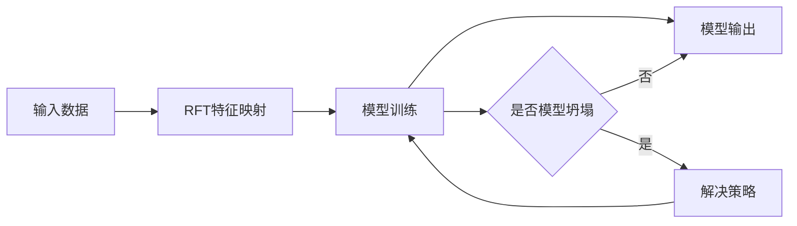

# RFT训练导致模型坍塌的问题

> 关键词：RFT训练、模型坍塌、核心原理、算法分析、实战案例、应用场景、解决策略

> 摘要：本文聚焦于RFT训练过程中导致模型坍塌的问题。首先介绍了相关背景，包括目的范围、预期读者、文档结构和术语表。接着阐述了核心概念及联系，深入分析了核心算法原理并给出具体操作步骤。通过数学模型和公式详细解释了问题的本质，并结合实际案例进行说明。在项目实战部分，提供了开发环境搭建、源代码实现及解读。同时探讨了实际应用场景，推荐了相关工具和资源。最后总结了未来发展趋势与挑战，解答了常见问题并给出扩展阅读和参考资料，旨在为解决RFT训练中模型坍塌问题提供全面的技术指导。

## 1. 背景介绍 
### 1.1 目的和范围
在深度学习和机器学习领域，RFT（Random Fourier Transform，随机傅里叶变换）作为一种强大的特征映射技术，被广泛应用于各种模型的训练中。然而，在实际的RFT训练过程中，模型坍塌问题时常出现，这严重影响了模型的性能和稳定性。本文的目的在于深入探讨RFT训练导致模型坍塌的问题，详细分析其产生的原因、表现形式以及相应的解决策略。范围涵盖了RFT的核心原理、相关算法分析、数学模型构建、实际案例验证以及未来发展趋势等多个方面。

### 1.2 预期读者
本文预期读者包括深度学习和机器学习领域的研究人员、工程师、数据科学家以及对RFT技术感兴趣的爱好者。对于正在进行RFT相关项目开发的专业人士，本文可以提供深入的技术分析和解决方案；对于初学者，能够帮助他们了解RFT训练中常见的问题及处理方法，为进一步学习和研究奠定基础。

### 1.3 文档结构概述
本文将按照以下结构进行组织：首先介绍核心概念与联系，让读者对RFT和模型坍塌有基本的认识；接着详细阐述核心算法原理和具体操作步骤，通过Python代码进行说明；然后引入数学模型和公式，深入分析问题的本质；在项目实战部分，给出具体的代码案例和详细解释；之后探讨实际应用场景，了解该问题在不同领域的影响；再推荐相关的工具和资源，方便读者进一步学习和研究；最后总结未来发展趋势与挑战，解答常见问题并提供扩展阅读和参考资料。

### 1.4 术语表
#### 1.4.1 核心术语定义
- **RFT（Random Fourier Transform）**：随机傅里叶变换，是一种将输入特征映射到高维空间的技术，通过随机生成的傅里叶基函数来实现，可有效降低计算复杂度。
- **模型坍塌**：在模型训练过程中，模型的输出变得单一、缺乏多样性，无法学习到数据的有效特征，导致模型性能严重下降的现象。

#### 1.4.2 相关概念解释
- **特征映射**：将原始数据转换为新的特征表示的过程，目的是使数据在新的空间中更容易被模型学习和处理。
- **训练稳定性**：指模型在训练过程中能够持续稳定地学习，避免出现性能波动过大或无法收敛的情况。

#### 1.4.3 缩略词列表
- **RFT**：Random Fourier Transform（随机傅里叶变换）
- **MLP**：Multi-Layer Perceptron（多层感知机）
- **SGD**：Stochastic Gradient Descent（随机梯度下降）

## 2. 核心概念与联系 

### 2.1 RFT的核心原理
RFT的核心思想是将输入特征 $\mathbf{x} \in \mathbb{R}^d$ 映射到一个高维的特征空间 $\mathbb{R}^D$ 中，通过随机生成的傅里叶基函数来实现。具体来说，对于输入向量 $\mathbf{x}$，RFT的映射可以表示为：

$$\phi(\mathbf{x}) = \sqrt{\frac{2}{D}} \begin{bmatrix}
\cos(\mathbf{w}_1^T \mathbf{x} + b_1) \\
\cos(\mathbf{w}_2^T \mathbf{x} + b_2) \\
\vdots \\
\cos(\mathbf{w}_D^T \mathbf{x} + b_D)
\end{bmatrix}$$

其中，$\mathbf{w}_i \in \mathbb{R}^d$ 是随机生成的向量，$b_i \in [0, 2\pi]$ 是随机生成的偏移量，$D$ 是映射后的特征维度。

### 2.2 模型坍塌的表现和原因
模型坍塌的主要表现为模型的输出趋于一致，无法对不同的输入数据进行有效的区分。在RFT训练中，模型坍塌的原因主要有以下几点：
- **随机种子问题**：如果随机生成的 $\mathbf{w}_i$ 和 $b_i$ 不合理，可能导致映射后的特征缺乏多样性，从而使模型在训练过程中陷入局部最优解，出现坍塌现象。
- **学习率问题**：过大的学习率可能导致模型在训练过程中跳过最优解，使模型参数无法收敛；而过小的学习率则会导致训练速度过慢，模型容易陷入局部最优。
- **数据分布问题**：如果训练数据的分布不均匀，模型可能会过度拟合某些局部数据，导致模型输出单一。

### 2.3 核心概念的联系
RFT作为一种特征映射技术，其目的是为了提高模型的表达能力。然而，如果在RFT训练过程中出现上述问题，就可能导致模型坍塌，使模型无法正常学习和工作。因此，了解RFT的核心原理和模型坍塌的原因，对于解决RFT训练中模型坍塌问题至关重要。

### 2.4 文本示意图
```plaintext
输入数据 -> RFT特征映射 -> 模型训练 -> 模型输出
|                          |
|                          v
|                    可能出现模型坍塌
|                          |
|                          v
解决策略 -> 调整参数、优化数据分布等
```

### 2.5 Mermaid流程图


## 3. 核心算法原理 & 具体操作步骤 

### 3.1 RFT特征映射的Python实现
```python
import numpy as np

def rft_feature_mapping(X, D):
    """
    RFT特征映射函数
    :param X: 输入数据，形状为 (n_samples, n_features)
    :param D: 映射后的特征维度
    :return: 映射后的特征，形状为 (n_samples, D)
    """
    n_samples, n_features = X.shape
    # 随机生成权重向量
    W = np.random.randn(n_features, D)
    # 随机生成偏移量
    b = np.random.uniform(0, 2 * np.pi, D)
    # 计算映射后的特征
    Z = np.dot(X, W) + b
    phi = np.sqrt(2 / D) * np.cos(Z)
    return phi
```

### 3.2 模型训练的Python实现
```python
from sklearn.linear_model import SGDClassifier

def train_model(X, y, D):
    """
    使用RFT特征映射训练模型
    :param X: 输入数据，形状为 (n_samples, n_features)
    :param y: 标签数据，形状为 (n_samples,)
    :param D: 映射后的特征维度
    :return: 训练好的模型
    """
    # 进行RFT特征映射
    phi_X = rft_feature_mapping(X, D)
    # 初始化模型
    model = SGDClassifier()
    # 训练模型
    model.fit(phi_X, y)
    return model
```

### 3.3 具体操作步骤
1. **数据准备**：准备好训练数据 $\mathbf{X}$ 和对应的标签 $\mathbf{y}$。
2. **设置参数**：确定映射后的特征维度 $D$。
3. **进行RFT特征映射**：调用 `rft_feature_mapping` 函数将输入数据 $\mathbf{X}$ 映射到高维空间。
4. **模型训练**：使用映射后的特征和标签数据，调用 `train_model` 函数训练模型。
5. **模型评估**：使用测试数据评估训练好的模型性能。

## 4. 数学模型和公式 & 详细讲解 & 举例说明 

### 4.1 RFT特征映射的数学性质
RFT特征映射具有以下重要的数学性质：
- **近似性**：RFT可以近似表示核函数，即对于一个核函数 $K(\mathbf{x}, \mathbf{x}')$，存在一个RFT映射 $\phi(\mathbf{x})$，使得 $K(\mathbf{x}, \mathbf{x}') \approx \phi(\mathbf{x})^T \phi(\mathbf{x}')$。
- **期望性质**：对于随机生成的 $\mathbf{w}_i$ 和 $b_i$，$\mathbb{E}[\phi(\mathbf{x}) \phi(\mathbf{x}')^T] = K(\mathbf{x}, \mathbf{x}')$，其中 $\mathbb{E}$ 表示期望。

### 4.2 模型坍塌的数学分析
在RFT训练中，模型坍塌可以从损失函数的角度进行分析。假设我们使用的是交叉熵损失函数 $L(\mathbf{y}, \hat{\mathbf{y}})$，其中 $\mathbf{y}$ 是真实标签，$\hat{\mathbf{y}}$ 是模型的预测输出。当模型坍塌时，$\hat{\mathbf{y}}$ 趋于一致，导致损失函数无法有效下降。

例如，对于一个二分类问题，假设真实标签 $\mathbf{y} = [0, 1, 0, 1]$，模型的预测输出 $\hat{\mathbf{y}} = [0.5, 0.5, 0.5, 0.5]$，则交叉熵损失函数为：

$$L(\mathbf{y}, \hat{\mathbf{y}}) = -\frac{1}{4} \sum_{i=1}^{4} [y_i \log(\hat{y}_i) + (1 - y_i) \log(1 - \hat{y}_i)]$$

由于 $\hat{y}_i = 0.5$ 对于所有的 $i$ 都成立，所以 $L(\mathbf{y}, \hat{\mathbf{y}}) = -\log(0.5) \approx 0.693$。此时，模型无法区分不同的样本，出现了坍塌现象。

### 4.3 举例说明
假设我们有一个简单的二维数据集 $\mathbf{X} = \begin{bmatrix}
1 & 2 \\
3 & 4 \\
5 & 6
\end{bmatrix}$，标签 $\mathbf{y} = [0, 1, 0]$，我们将其映射到 $D = 4$ 的高维空间。

```python
X = np.array([[1, 2], [3, 4], [5, 6]])
y = np.array([0, 1, 0])
D = 4
phi_X = rft_feature_mapping(X, D)
print("映射后的特征：", phi_X)
```

运行上述代码，我们可以得到映射后的特征，然后使用这些特征进行模型训练。

## 5. 项目实战：代码实际案例和详细解释说明 

### 5.1  开发环境搭建
- **Python环境**：建议使用Python 3.7及以上版本。
- **依赖库**：安装 `numpy`、`scikit-learn` 等必要的库。可以使用以下命令进行安装：
```sh
pip install numpy scikit-learn
```

### 5.2  源代码详细实现和代码解读
```python
import numpy as np
from sklearn.linear_model import SGDClassifier
from sklearn.datasets import make_classification
from sklearn.model_selection import train_test_split
from sklearn.metrics import accuracy_score

def rft_feature_mapping(X, D):
    """
    RFT特征映射函数
    :param X: 输入数据，形状为 (n_samples, n_features)
    :param D: 映射后的特征维度
    :return: 映射后的特征，形状为 (n_samples, D)
    """
    n_samples, n_features = X.shape
    # 随机生成权重向量
    W = np.random.randn(n_features, D)
    # 随机生成偏移量
    b = np.random.uniform(0, 2 * np.pi, D)
    # 计算映射后的特征
    Z = np.dot(X, W) + b
    phi = np.sqrt(2 / D) * np.cos(Z)
    return phi

def train_model(X, y, D):
    """
    使用RFT特征映射训练模型
    :param X: 输入数据，形状为 (n_samples, n_features)
    :param y: 标签数据，形状为 (n_samples,)
    :param D: 映射后的特征维度
    :return: 训练好的模型
    """
    # 进行RFT特征映射
    phi_X = rft_feature_mapping(X, D)
    # 初始化模型
    model = SGDClassifier()
    # 训练模型
    model.fit(phi_X, y)
    return model

# 生成数据集
X, y = make_classification(n_samples=1000, n_features=20, n_informative=10, n_redundant=5, random_state=42)
# 划分训练集和测试集
X_train, X_test, y_train, y_test = train_test_split(X, y, test_size=0.2, random_state=42)

# 设置映射后的特征维度
D = 100

# 训练模型
model = train_model(X_train, y_train, D)

# 进行RFT特征映射
phi_X_test = rft_feature_mapping(X_test, D)

# 预测
y_pred = model.predict(phi_X_test)

# 计算准确率
accuracy = accuracy_score(y_test, y_pred)
print("模型准确率：", accuracy)
```

### 5.3  代码解读与分析
- **数据生成**：使用 `make_classification` 函数生成一个包含1000个样本、20个特征的二分类数据集。
- **数据划分**：使用 `train_test_split` 函数将数据集划分为训练集和测试集，测试集占比为20%。
- **RFT特征映射**：调用 `rft_feature_mapping` 函数将输入数据映射到高维空间。
- **模型训练**：使用 `SGDClassifier` 模型进行训练。
- **模型评估**：使用 `accuracy_score` 函数计算模型在测试集上的准确率。

在实际运行过程中，如果出现模型坍塌的情况，准确率可能会非常低。此时，我们可以通过调整参数（如 $D$ 的值、学习率等）、优化数据分布等方法来解决。

## 6. 实际应用场景 
### 6.1 图像分类
在图像分类任务中，RFT可以用于提取图像的特征。然而，如果在训练过程中出现模型坍塌问题，模型可能无法准确区分不同类别的图像，导致分类准确率下降。例如，在识别猫和狗的图像分类任务中，坍塌的模型可能会将所有图像都分类为猫或狗，而无法做出正确的判断。

### 6.2 自然语言处理
在自然语言处理领域，RFT可以用于文本分类、情感分析等任务。模型坍塌可能会导致模型无法理解文本的语义，输出单一的结果。比如，在情感分析任务中，坍塌的模型可能会将所有文本都判断为积极或消极情感，无法准确反映文本的真实情感。

### 6.3 金融风险预测
在金融风险预测中，RFT可以用于分析金融数据，预测市场趋势和风险。如果模型坍塌，可能会导致预测结果不准确，给投资者带来巨大的损失。例如，在预测股票价格走势时，坍塌的模型可能会一直给出上涨或下跌的预测，而无法根据实际情况进行调整。

## 7. 工具和资源推荐
### 7.1 学习资源推荐
#### 7.1.1 书籍推荐
- 《深度学习》（Deep Learning）：由Ian Goodfellow、Yoshua Bengio和Aaron Courville合著，是深度学习领域的经典教材，涵盖了RFT等多种特征映射技术的原理和应用。
- 《机器学习》（Machine Learning: A Probabilistic Perspective）：作者是Kevin P. Murphy，这本书从概率的角度介绍了机器学习的基本原理和算法，对理解RFT的数学基础有很大帮助。

#### 7.1.2 在线课程
- Coursera上的“深度学习专项课程”（Deep Learning Specialization）：由Andrew Ng教授主讲，包含了深度学习的各个方面，包括特征工程和模型训练等内容。
- edX上的“人工智能基础”（Introduction to Artificial Intelligence）：该课程系统地介绍了人工智能的基本概念和方法，对RFT的学习有一定的指导作用。

#### 7.1.3 技术博客和网站
- Medium：上面有很多关于深度学习和机器学习的技术文章，包括RFT的应用案例和实践经验分享。
- arXiv：是一个预印本服务器，提供了大量的最新研究成果，包括RFT相关的研究论文。

### 7.2 开发工具框架推荐
#### 7.2.1 IDE和编辑器
- PyCharm：是一款专门为Python开发设计的集成开发环境，具有强大的代码编辑、调试和项目管理功能。
- Jupyter Notebook：是一个交互式的开发环境，适合进行数据探索和模型实验，方便展示代码和结果。

#### 7.2.2 调试和性能分析工具
- TensorBoard：是TensorFlow提供的可视化工具，可以用于监控模型的训练过程、分析模型的性能等。
- PyTorch Profiler：是PyTorch提供的性能分析工具，可以帮助开发者找出代码中的性能瓶颈。

#### 7.2.3 相关框架和库
- TensorFlow：是一个开源的深度学习框架，提供了丰富的工具和函数，支持RFT特征映射的实现。
- PyTorch：是另一个流行的深度学习框架，具有动态图的优势，方便进行模型的开发和调试。

### 7.3 相关论文著作推荐
#### 7.3.1 经典论文
- “Random Features for Large-Scale Kernel Machines”：该论文首次提出了随机傅里叶特征的概念，为RFT的发展奠定了基础。
- “Fastfood - Approximating Kernel Expansions in Loglinear Time”：提出了一种快速的随机特征映射方法，提高了RFT的计算效率。

#### 7.3.2 最新研究成果
- 可以在arXiv、ACM Digital Library等学术平台上搜索关于RFT和模型坍塌的最新研究论文，了解该领域的前沿动态。

#### 7.3.3 应用案例分析
- 一些学术会议（如NeurIPS、ICML等）的论文集中包含了RFT在不同领域的应用案例分析，可以从中学习到实际应用中的经验和技巧。

## 8. 总结：未来发展趋势与挑战
### 8.1 未来发展趋势
- **算法优化**：未来可能会出现更高效、更稳定的RFT算法，进一步提高模型的性能和训练效率。例如，研究人员可能会探索新的随机特征映射方法，减少模型坍塌的风险。
- **多模态应用**：随着多模态数据（如图像、文本、音频等）的广泛应用，RFT可能会在多模态学习中发挥重要作用。通过将不同模态的数据进行特征映射，实现更强大的多模态模型。
- **与其他技术的融合**：RFT可能会与其他机器学习技术（如深度学习、强化学习等）进行融合，创造出更具创新性的模型和算法。

### 8.2 挑战
- **模型稳定性**：如何有效解决RFT训练中模型坍塌的问题，提高模型的稳定性，仍然是一个挑战。需要进一步研究模型坍塌的本质原因，提出更有效的解决策略。
- **计算资源需求**：随着数据量和模型复杂度的增加，RFT的计算资源需求也会相应增加。如何在有限的计算资源下实现高效的RFT训练，是需要解决的问题之一。
- **可解释性**：RFT作为一种特征映射技术，其映射过程可能会导致模型的可解释性降低。如何提高RFT模型的可解释性，使模型的决策过程更加透明，也是未来需要关注的方向。

## 9. 附录：常见问题与解答
### 9.1 如何判断模型是否坍塌？
可以通过观察模型的输出和损失函数的变化来判断模型是否坍塌。如果模型的输出趋于一致，损失函数无法有效下降，或者模型在训练集和测试集上的性能都非常低，那么很可能出现了模型坍塌的问题。

### 9.2 如何解决RFT训练中模型坍塌的问题？
可以从以下几个方面入手解决模型坍塌的问题：
- **调整参数**：调整映射后的特征维度 $D$、学习率等参数，使模型能够更好地学习数据的特征。
- **优化数据分布**：对训练数据进行预处理，如数据归一化、数据增强等，使数据分布更加均匀。
- **改进随机种子**：尝试不同的随机种子，确保随机生成的 $\mathbf{w}_i$ 和 $b_i$ 具有多样性。

### 9.3 RFT适用于所有类型的数据集吗？
RFT并不适用于所有类型的数据集。对于一些具有复杂结构和非线性关系的数据集，RFT可能无法有效地提取数据的特征。在这种情况下，可以考虑使用其他更强大的特征映射技术或深度学习模型。

## 10. 扩展阅读 & 参考资料
- Goodfellow, I., Bengio, Y., & Courville, A. (2016). Deep Learning. MIT Press.
- Murphy, K. P. (2012). Machine Learning: A Probabilistic Perspective. MIT Press.
- Rahimi, A., & Recht, B. (2007). Random Features for Large-Scale Kernel Machines. Advances in Neural Information Processing Systems.
- Le, Q. V., Sarlos, T., & Smola, A. J. (2013). Fastfood - Approximating Kernel Expansions in Loglinear Time. Proceedings of the 30th International Conference on Machine Learning.
- arXiv.org: https://arxiv.org/
- ACM Digital Library: https://dl.acm.org/