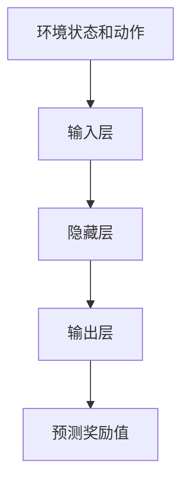

# Reward Model训练不稳定性的原因探究

> 关键词：Reward Model、训练不稳定性、强化学习、模型训练、原因探究

> 摘要：本文聚焦于Reward Model训练不稳定性的问题，旨在深入探究导致训练不稳定的各种原因。通过对核心概念的阐述、算法原理的剖析、数学模型的解读，结合项目实战案例和实际应用场景分析，全面且系统地揭示了可能引发训练不稳定的因素。同时，为读者提供了丰富的学习资源、开发工具和相关论文著作推荐，最后对Reward Model未来的发展趋势与挑战进行了总结，并给出常见问题的解答以及扩展阅读和参考资料，有助于读者深入理解Reward Model训练不稳定性的本质。

## 1. 背景介绍 
### 1.1 目的和范围
在强化学习领域，Reward Model扮演着至关重要的角色，它用于评估智能体在环境中采取的动作所获得的奖励。然而，Reward Model的训练过程常常面临不稳定性的问题，这可能导致模型收敛缓慢、性能波动甚至无法收敛。本文章的目的就是深入探究Reward Model训练不稳定性的原因，涵盖从理论原理到实际应用的多个层面，为解决这一问题提供全面的视角。

### 1.2 预期读者
本文预期读者包括对强化学习、Reward Model感兴趣的研究人员、开发者、学生以及相关领域的专业人士。无论是想要深入了解Reward Model训练机制的初学者，还是希望解决实际训练中不稳定性问题的资深从业者，都能从本文中获得有价值的信息。

### 1.3 文档结构概述
本文首先介绍Reward Model的核心概念以及与其他相关概念的联系，通过文本示意图和Mermaid流程图进行清晰展示。接着详细阐述核心算法原理，并给出Python源代码示例。然后引入数学模型和公式，结合具体例子进行讲解。之后通过项目实战，展示代码的实际案例并进行详细解释。再分析Reward Model的实际应用场景，为读者提供更直观的认识。同时推荐相关的学习资源、开发工具和论文著作。最后总结未来发展趋势与挑战，解答常见问题，并提供扩展阅读和参考资料。

### 1.4 术语表
#### 1.4.1 核心术语定义
- **Reward Model**：奖励模型，用于预测智能体在环境中采取某个动作后所获得的奖励值。
- **强化学习**：一种机器学习范式，智能体通过与环境进行交互，根据环境反馈的奖励来学习最优策略。
- **训练不稳定性**：指在模型训练过程中，模型的性能指标（如损失函数值、奖励值等）出现大幅波动，无法稳定收敛到最优解。

#### 1.4.2 相关概念解释
- **策略网络**：在强化学习中，策略网络用于生成智能体的动作，根据当前的环境状态输出动作概率分布。
- **价值网络**：用于估计智能体在某个状态下的价值，即从该状态开始遵循某个策略所能获得的累计奖励。
- **经验回放**：一种强化学习中的技术，将智能体与环境交互的经验存储在经验池中，训练时随机从经验池中采样进行学习，以提高数据的利用率和训练的稳定性。

#### 1.4.3 缩略词列表
- **RL**：Reinforcement Learning，强化学习
- **RM**：Reward Model，奖励模型

## 2. 核心概念与联系 
### 核心概念原理
Reward Model的核心原理是根据智能体在环境中的状态和动作，预测其所能获得的奖励。在强化学习中，环境通常可以表示为一个马尔可夫决策过程（MDP），包括状态集合 $S$、动作集合 $A$、状态转移概率 $P(s'|s,a)$ 和奖励函数 $R(s,a)$。Reward Model的目标就是学习一个函数 $\hat{R}(s,a)$，使得 $\hat{R}(s,a)$ 尽可能接近真实的奖励函数 $R(s,a)$。

### 架构的文本示意图
Reward Model的架构通常由输入层、隐藏层和输出层组成。输入层接收智能体的状态和动作信息，隐藏层通过一系列的神经网络运算对输入信息进行特征提取和变换，输出层则输出预测的奖励值。具体架构如下：

```plaintext
输入层（状态和动作信息） -> 隐藏层（神经网络运算） -> 输出层（预测奖励值）
```

### Mermaid流程图


## 3. 核心算法原理 & 具体操作步骤 
### 核心算法原理
Reward Model的训练通常采用监督学习的方法，通过最小化预测奖励值与真实奖励值之间的误差来更新模型参数。常用的损失函数是均方误差（MSE），定义如下：

```python
import torch
import torch.nn as nn

# 定义均方误差损失函数
criterion = nn.MSELoss()

# 假设 y_pred 是模型预测的奖励值，y_true 是真实的奖励值
y_pred = torch.tensor([1.0, 2.0, 3.0], requires_grad=True)
y_true = torch.tensor([1.2, 2.1, 3.2])

# 计算损失
loss = criterion(y_pred, y_true)
print(f"Loss: {loss.item()}")
```

### 具体操作步骤
1. **数据收集**：智能体与环境进行交互，记录每一步的状态、动作和获得的真实奖励。
2. **数据预处理**：对收集到的数据进行清洗、归一化等处理，以提高模型的训练效果。
3. **模型初始化**：初始化Reward Model的参数，可以使用随机初始化的方法。
4. **训练循环**：
    - 从数据集中随机采样一批数据。
    - 将采样的数据输入到Reward Model中，得到预测的奖励值。
    - 计算预测奖励值与真实奖励值之间的损失。
    - 使用优化算法（如随机梯度下降SGD、Adam等）更新模型参数。
5. **模型评估**：在验证集上评估模型的性能，监控训练过程中的损失和其他性能指标。

```python
import torch
import torch.nn as nn
import torch.optim as optim

# 定义一个简单的Reward Model
class RewardModel(nn.Module):
    def __init__(self, input_size):
        super(RewardModel, self).__init__()
        self.fc1 = nn.Linear(input_size, 64)
        self.fc2 = nn.Linear(64, 1)

    def forward(self, x):
        x = torch.relu(self.fc1(x))
        x = self.fc2(x)
        return x

# 初始化模型
input_size = 10
model = RewardModel(input_size)

# 定义损失函数和优化器
criterion = nn.MSELoss()
optimizer = optim.Adam(model.parameters(), lr=0.001)

# 模拟数据集
num_samples = 100
x = torch.randn(num_samples, input_size)
y = torch.randn(num_samples, 1)

# 训练循环
num_epochs = 10
for epoch in range(num_epochs):
    # 前向传播
    outputs = model(x)
    loss = criterion(outputs, y)

    # 反向传播和优化
    optimizer.zero_grad()
    loss.backward()
    optimizer.step()

    print(f'Epoch [{epoch+1}/{num_epochs}], Loss: {loss.item():.4f}')
```

## 4. 数学模型和公式 & 详细讲解 & 举例说明 
### 数学模型
假设我们有一个数据集 $\mathcal{D} = \{(s_i, a_i, r_i)\}_{i=1}^N$，其中 $(s_i, a_i)$ 是第 $i$ 个样本的状态和动作，$r_i$ 是对应的真实奖励值。Reward Model的目标是学习一个函数 $\hat{R}(s,a;\theta)$，其中 $\theta$ 是模型的参数。我们通过最小化损失函数 $L(\theta)$ 来更新模型参数：

$$
L(\theta) = \frac{1}{N} \sum_{i=1}^N (\hat{R}(s_i, a_i;\theta) - r_i)^2
$$

### 详细讲解
损失函数 $L(\theta)$ 衡量了模型预测的奖励值与真实奖励值之间的平均平方误差。通过不断调整模型参数 $\theta$，使得损失函数 $L(\theta)$ 最小化，从而使模型的预测结果尽可能接近真实奖励值。

### 举例说明
假设我们有一个简单的二维状态空间 $S = \{(x_1, x_2)\}$ 和一维动作空间 $A = \{a\}$，真实奖励函数为 $R(s,a) = x_1 + x_2 + a$。我们使用一个简单的线性模型 $\hat{R}(s,a;\theta) = \theta_0 + \theta_1 x_1 + \theta_2 x_2 + \theta_3 a$ 作为Reward Model。

我们有一个数据集 $\mathcal{D} = \{((1, 2), 3, 6), ((2, 3), 4, 9)\}$，即两个样本。对于第一个样本 $(s_1 = (1, 2), a_1 = 3, r_1 = 6)$，模型的预测值为 $\hat{R}(s_1, a_1;\theta) = \theta_0 + \theta_1 \times 1 + \theta_2 \times 2 + \theta_3 \times 3$。对于第二个样本 $(s_2 = (2, 3), a_2 = 4, r_2 = 9)$，模型的预测值为 $\hat{R}(s_2, a_2;\theta) = \theta_0 + \theta_1 \times 2 + \theta_2 \times 3 + \theta_3 \times 4$。

损失函数为：

$$
L(\theta) = \frac{1}{2} \left[(\theta_0 + \theta_1 + 2\theta_2 + 3\theta_3 - 6)^2 + (\theta_0 + 2\theta_1 + 3\theta_2 + 4\theta_3 - 9)^2\right]
$$

我们可以使用优化算法（如梯度下降）来最小化损失函数 $L(\theta)$，从而更新模型参数 $\theta$。

## 5. 项目实战：代码实际案例和详细解释说明 
### 5.1  开发环境搭建
- **操作系统**：推荐使用Linux或Windows操作系统。
- **Python版本**：Python 3.7及以上版本。
- **深度学习框架**：PyTorch，可通过以下命令安装：
```bash
pip install torch torchvision
```

### 5.2  源代码详细实现和代码解读
```python
import torch
import torch.nn as nn
import torch.optim as optim
import numpy as np

# 定义一个简单的Reward Model
class RewardModel(nn.Module):
    def __init__(self, input_size):
        super(RewardModel, self).__init__()
        self.fc1 = nn.Linear(input_size, 64)
        self.fc2 = nn.Linear(64, 1)

    def forward(self, x):
        x = torch.relu(self.fc1(x))
        x = self.fc2(x)
        return x

# 模拟数据集生成函数
def generate_dataset(num_samples, input_size):
    x = np.random.randn(num_samples, input_size)
    y = np.sum(x, axis=1) + np.random.normal(0, 0.1, num_samples)
    x = torch.tensor(x, dtype=torch.float32)
    y = torch.tensor(y, dtype=torch.float32).unsqueeze(1)
    return x, y

# 超参数设置
input_size = 10
num_samples = 1000
num_epochs = 50
learning_rate = 0.001

# 生成数据集
x, y = generate_dataset(num_samples, input_size)

# 初始化模型
model = RewardModel(input_size)

# 定义损失函数和优化器
criterion = nn.MSELoss()
optimizer = optim.Adam(model.parameters(), lr=learning_rate)

# 训练循环
for epoch in range(num_epochs):
    # 前向传播
    outputs = model(x)
    loss = criterion(outputs, y)

    # 反向传播和优化
    optimizer.zero_grad()
    loss.backward()
    optimizer.step()

    if (epoch + 1) % 10 == 0:
        print(f'Epoch [{epoch+1}/{num_epochs}], Loss: {loss.item():.4f}')
```

### 代码解读与分析
- **RewardModel类**：定义了一个简单的两层全连接神经网络作为Reward Model。输入层接收状态和动作信息，经过一个64个神经元的隐藏层进行特征提取，最后输出一个预测的奖励值。
- **generate_dataset函数**：用于生成模拟数据集，输入为样本数量和输入维度，输出为输入数据和对应的真实奖励值。
- **训练循环**：在每个epoch中，将输入数据输入到模型中得到预测的奖励值，计算损失函数，然后进行反向传播和参数更新。每10个epoch打印一次损失值，方便监控训练过程。

## 6. 实际应用场景 
### 自动驾驶
在自动驾驶领域，Reward Model可以用于评估车辆在不同驾驶场景下的动作（如加速、减速、转弯等）所带来的奖励。例如，奖励可以根据车辆的安全性、舒适性、燃油效率等因素来定义。然而，由于实际驾驶场景的复杂性和不确定性，Reward Model的训练可能会面临不稳定性问题。例如，不同的路况、天气条件和其他车辆的行为都会影响奖励的计算，使得模型难以稳定地学习到准确的奖励函数。

### 游戏AI
在游戏中，Reward Model可以帮助智能体学习如何采取最优的动作来获得更高的分数。例如，在策略游戏中，智能体需要根据当前的游戏状态和对手的行为来做出决策。Reward Model可以根据游戏的规则和目标来评估每个动作的价值。但是，游戏中的状态空间和动作空间通常非常大，而且游戏的动态性很强，这可能导致Reward Model的训练不稳定。例如，游戏中的随机事件（如突然出现的道具、敌人的随机攻击等）会使得奖励的分布发生变化，模型需要不断适应这些变化。

### 机器人控制
在机器人控制中，Reward Model可以用于评估机器人在不同任务中的动作所带来的奖励。例如，机器人在执行抓取任务时，奖励可以根据抓取的成功率、抓取的稳定性等因素来定义。然而，机器人所处的环境通常是复杂多变的，例如物体的形状、位置和材质等都会影响奖励的计算。此外，机器人的传感器数据可能存在噪声，这也会给Reward Model的训练带来不稳定性。

## 7. 工具和资源推荐
### 7.1 学习资源推荐
#### 7.1.1 书籍推荐
- 《Reinforcement Learning: An Introduction》：这是强化学习领域的经典书籍，全面介绍了强化学习的基本概念、算法和应用，对于理解Reward Model的原理和训练方法非常有帮助。
- 《Deep Reinforcement Learning Hands-On》：该书通过实际案例和代码示例，详细介绍了深度强化学习的实现方法，包括Reward Model的训练和应用。

#### 7.1.2 在线课程
- Coursera上的“Reinforcement Learning Specialization”：由知名教授授课，系统地介绍了强化学习的理论和实践，包括Reward Model的相关内容。
- Udemy上的“Deep Reinforcement Learning A-Z™: Hands-On Artificial Intelligence”：该课程通过实际项目，让学习者掌握深度强化学习的核心技术，包括Reward Model的训练和优化。

#### 7.1.3 技术博客和网站
- OpenAI博客：OpenAI是人工智能领域的领先研究机构，其博客上经常发布关于强化学习和Reward Model的最新研究成果和技术文章。
- Towards Data Science：这是一个专注于数据科学和机器学习的技术博客平台，上面有很多关于Reward Model的实践经验分享和技术解读。

### 7.2 开发工具框架推荐
#### 7.2.1 IDE和编辑器
- PyCharm：是一款专门为Python开发设计的集成开发环境，具有强大的代码编辑、调试和项目管理功能，非常适合进行Reward Model的开发和调试。
- Jupyter Notebook：是一个交互式的开发环境，支持代码、文本和可视化的混合展示，方便进行模型的实验和验证。

#### 7.2.2 调试和性能分析工具
- TensorBoard：是TensorFlow的可视化工具，也可以与PyTorch配合使用，用于监控模型的训练过程，包括损失函数的变化、模型参数的分布等。
- PyTorch Profiler：是PyTorch提供的性能分析工具，可以帮助开发者找出模型训练过程中的性能瓶颈，优化代码的执行效率。

#### 7.2.3 相关框架和库
- PyTorch：是一个开源的深度学习框架，具有灵活的张量计算和自动求导功能，广泛应用于强化学习和Reward Model的开发。
- Stable Baselines3：是一个基于PyTorch的强化学习库，提供了多种预实现的强化学习算法和工具，方便开发者快速进行Reward Model的训练和评估。

### 7.3 相关论文著作推荐
#### 7.3.1 经典论文
- “Deep Q-Networks”：提出了深度Q网络（DQN）算法，是深度强化学习领域的经典论文，为Reward Model的训练提供了重要的思想和方法。
- “Proximal Policy Optimization Algorithms”：介绍了近端策略优化（PPO）算法，该算法在强化学习中具有较好的性能和稳定性，对于解决Reward Model训练不稳定性问题有一定的参考价值。

#### 7.3.2 最新研究成果
- 可以关注NeurIPS、ICML、AAAI等顶级人工智能会议的论文，这些会议上经常发表关于Reward Model训练稳定性的最新研究成果。
- 还可以关注arXiv预印本平台，上面有很多关于强化学习和Reward Model的最新研究论文。

#### 7.3.3 应用案例分析
- 一些实际应用领域的研究论文，如自动驾驶、游戏AI等，会详细介绍Reward Model在这些领域的应用案例和训练方法，对于理解实际应用中的训练不稳定性问题非常有帮助。

## 8. 总结：未来发展趋势与挑战
### 未来发展趋势
- **多模态数据融合**：未来的Reward Model可能会融合更多类型的数据，如视觉、听觉、触觉等多模态数据，以更全面地评估智能体的行为所带来的奖励。例如，在自动驾驶中，除了考虑车辆的传感器数据，还可以结合摄像头的图像信息来评估驾驶场景的安全性。
- **与其他技术的结合**：Reward Model可能会与其他技术（如生成对抗网络、迁移学习等）相结合，以提高模型的性能和稳定性。例如，使用生成对抗网络来生成更真实的训练数据，或者使用迁移学习来将在一个任务中学习到的Reward Model知识迁移到另一个相关任务中。
- **自适应奖励设计**：研究更加自适应的奖励设计方法，使得Reward Model能够根据不同的环境和任务自动调整奖励函数，提高模型的泛化能力和适应性。

### 挑战
- **数据质量和数量**：高质量的数据对于Reward Model的训练至关重要。然而，在实际应用中，收集大量高质量的数据往往是困难的，而且数据中可能存在噪声和偏差，这会影响模型的训练稳定性。
- **模型复杂度和计算资源**：随着Reward Model的复杂度不断增加，训练所需的计算资源也会相应增加。如何在有限的计算资源下高效地训练模型，是一个需要解决的挑战。
- **环境的不确定性**：在实际应用中，环境往往是复杂多变和不确定的，这使得Reward Model难以准确地学习到真实的奖励函数。如何处理环境的不确定性，提高模型的鲁棒性，是未来研究的一个重要方向。

## 9. 附录：常见问题与解答
### 问题1：Reward Model训练不稳定性的主要表现有哪些？
答：主要表现包括损失函数值波动较大、模型的预测奖励值与真实奖励值之间的误差不稳定、模型在验证集上的性能波动明显、训练过程中模型的收敛速度缓慢甚至无法收敛等。

### 问题2：如何缓解Reward Model训练不稳定性问题？
答：可以采取以下措施：
- **优化数据质量**：对收集到的数据进行清洗、去噪和归一化处理，确保数据的准确性和一致性。
- **调整超参数**：如学习率、批量大小等，合适的超参数可以提高模型的训练稳定性。
- **使用正则化方法**：如L1、L2正则化，防止模型过拟合，提高模型的泛化能力。
- **采用更稳定的优化算法**：如Adam、RMSProp等，这些算法在处理梯度更新时更加稳定。

### 问题3：Reward Model的训练不稳定性会对智能体的决策产生什么影响？
答：训练不稳定性会导致Reward Model无法准确地评估智能体的动作所带来的奖励，从而使得智能体在决策时无法选择最优的动作。这可能会导致智能体的性能下降，无法有效地完成任务。

## 10. 扩展阅读 & 参考资料
### 扩展阅读
- 《AI Superpowers: China, Silicon Valley, and the New World Order》：从宏观角度介绍了人工智能的发展现状和未来趋势，对于理解Reward Model在人工智能领域的地位和作用有一定的帮助。
- 《Artificial Intelligence: A Modern Approach》：全面介绍了人工智能的各个领域，包括强化学习和Reward Model的相关知识，是一本很好的扩展阅读书籍。

### 参考资料
- Sutton, R. S., & Barto, A. G. (2018). Reinforcement Learning: An Introduction. MIT press.
- Lillicrap, T. P., et al. (2015). Continuous control with deep reinforcement learning. arXiv preprint arXiv:1509.02971.
- Schulman, J., et al. (2017). Proximal policy optimization algorithms. arXiv preprint arXiv:1707.06347.