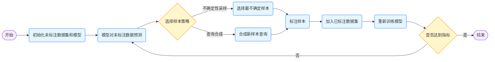

# 主动学习在高效数据采集中的策略创新

> 关键词：主动学习、高效数据采集、策略创新、不确定性采样、查询合成

> 摘要：本文聚焦于主动学习在高效数据采集中的策略创新。首先介绍了主动学习和高效数据采集的背景知识，明确文章的目的、范围、预期读者和文档结构。接着深入阐述了主动学习与高效数据采集的核心概念及联系，给出原理和架构的文本示意图与Mermaid流程图。详细讲解了核心算法原理和具体操作步骤，用Python源代码进行说明，并分析了相关的数学模型和公式。通过项目实战展示了代码的实际案例和详细解释。探讨了主动学习在不同场景中的实际应用，推荐了学习资源、开发工具框架和相关论文著作。最后总结了主动学习在高效数据采集中的未来发展趋势与挑战，解答了常见问题并提供了扩展阅读和参考资料。

## 1. 背景介绍 
### 1.1 目的和范围
在当今的大数据时代，数据是推动机器学习和人工智能发展的核心资源。然而，高质量数据的采集往往面临着成本高、效率低等问题。主动学习作为一种有效的数据采集策略，能够通过智能地选择最有价值的数据样本进行标注，从而提高数据采集的效率和质量。本文的目的在于探讨主动学习在高效数据采集中的策略创新，分析各种创新策略的原理、优势和应用场景，为数据采集工作提供理论支持和实践指导。

本文的范围涵盖了主动学习的基本概念、核心算法、数学模型，以及在不同领域的数据采集应用。同时，对近年来出现的主动学习策略创新进行了详细的分析和讨论。

### 1.2 预期读者
本文预期读者包括数据科学家、机器学习工程师、人工智能研究人员、从事数据采集和标注工作的专业人员，以及对主动学习和数据采集感兴趣的学生和爱好者。对于希望提高数据采集效率、降低成本的相关从业者，本文提供了实用的策略和方法；对于研究人员，本文有助于了解主动学习领域的最新研究动态和创新方向。

### 1.3 文档结构概述
本文共分为十个部分。第一部分为背景介绍，阐述了文章的目的、范围、预期读者和文档结构。第二部分介绍主动学习与高效数据采集的核心概念及联系，给出相关的原理和架构示意图。第三部分详细讲解核心算法原理和具体操作步骤，并提供Python源代码。第四部分分析数学模型和公式，并举例说明。第五部分通过项目实战展示代码的实际应用和详细解释。第六部分探讨主动学习在不同场景中的实际应用。第七部分推荐学习资源、开发工具框架和相关论文著作。第八部分总结主动学习在高效数据采集中的未来发展趋势与挑战。第九部分为附录，解答常见问题。第十部分提供扩展阅读和参考资料。

### 1.4 术语表
#### 1.4.1 核心术语定义
- **主动学习（Active Learning）**：是一种机器学习方法，通过主动选择最有价值的数据样本进行标注，以提高模型的性能和数据采集的效率。
- **高效数据采集（Efficient Data Collection）**：指在有限的时间和资源条件下，采集到高质量、有代表性的数据样本。
- **不确定性采样（Uncertainty Sampling）**：主动学习中常用的一种采样策略，选择模型对其预测结果最不确定的数据样本进行标注。
- **查询合成（Query Synthesis）**：通过合成新的数据样本并向专家进行查询，以获取更多有价值的信息。

#### 1.4.2 相关概念解释
- **标注（Annotation）**：为数据样本添加标签或注释的过程，是监督学习中训练模型的重要步骤。
- **未标注数据（Unlabeled Data）**：没有添加标签或注释的数据样本，通常数量较多，但需要通过标注才能用于训练模型。
- **标注成本（Annotation Cost）**：包括人力、时间和金钱等方面的成本，是数据采集过程中需要考虑的重要因素。

#### 1.4.3 缩略词列表
- **AL**：Active Learning（主动学习）
- **US**：Uncertainty Sampling（不确定性采样）
- **QS**：Query Synthesis（查询合成）

## 2. 核心概念与联系 
### 核心概念原理
主动学习的核心思想是在数据采集过程中，模型主动选择最有价值的数据样本进行标注，而不是随机选择样本。通过这种方式，可以在有限的标注成本下，更快地提高模型的性能。

高效数据采集则强调在采集数据时，要充分考虑数据的质量、代表性和采集成本。主动学习为高效数据采集提供了一种有效的策略，通过智能地选择样本，可以减少不必要的标注工作，提高数据采集的效率。

### 架构的文本示意图
主动学习在高效数据采集中的架构可以描述如下：

1. 初始阶段，有一个未标注的大规模数据集和一个初始的机器学习模型。
2. 模型对未标注数据进行预测，根据某种选择策略（如不确定性采样），选择最有价值的样本。
3. 将选择的样本发送给标注人员进行标注。
4. 将标注好的数据加入到已标注数据集中，重新训练模型。
5. 重复步骤2 - 4，直到达到预定的性能指标或标注成本限制。

### Mermaid流程图


## 3. 核心算法原理 & 具体操作步骤 
### 不确定性采样算法原理
不确定性采样是主动学习中最常用的一种采样策略。其基本思想是选择模型对其预测结果最不确定的数据样本进行标注。常见的不确定性度量方法有以下几种：

1. **预测概率熵（Entropy）**：对于一个分类问题，假设模型对一个样本的预测概率分布为 $P(y|x) = [p_1, p_2, \cdots, p_k]$，其中 $k$ 是类别数。则该样本的预测概率熵为：
$$H(P(y|x)) = -\sum_{i=1}^{k} p_i \log p_i$$
熵越大，说明模型对该样本的预测越不确定。

2. **最小预测概率（Least Confidence）**：选择模型预测概率最小的样本进行标注，即：
$$\arg\min_{x \in X_{unlabeled}} \max_{i=1}^{k} p_i$$

### Python源代码实现
```python
import numpy as np
from sklearn.linear_model import LogisticRegression
from sklearn.datasets import make_classification

# 生成示例数据
X, y = make_classification(n_samples=1000, n_features=20, n_informative=10, n_classes=2, random_state=42)

# 划分初始标注数据和未标注数据
n_initial = 100
X_labeled = X[:n_initial]
y_labeled = y[:n_initial]
X_unlabeled = X[n_initial:]

# 初始化模型
model = LogisticRegression()
model.fit(X_labeled, y_labeled)

# 不确定性采样函数
def uncertainty_sampling(model, X_unlabeled):
    probabilities = model.predict_proba(X_unlabeled)
    entropy = -np.sum(probabilities * np.log(probabilities + 1e-10), axis=1)
    index = np.argmax(entropy)
    return index

# 主动学习循环
n_iterations = 10
for i in range(n_iterations):
    # 选择最不确定的样本
    index = uncertainty_sampling(model, X_unlabeled)
    X_new = X_unlabeled[index].reshape(1, -1)
    y_new = y[n_initial + index].reshape(1,)
    
    # 添加到标注数据集中
    X_labeled = np.vstack((X_labeled, X_new))
    y_labeled = np.hstack((y_labeled, y_new))
    
    # 从未标注数据集中移除
    X_unlabeled = np.delete(X_unlabeled, index, axis=0)
    
    # 重新训练模型
    model.fit(X_labeled, y_labeled)
```

### 具体操作步骤
1. 初始化标注数据集和未标注数据集，以及初始的机器学习模型。
2. 使用模型对未标注数据进行预测，计算每个样本的不确定性度量（如熵）。
3. 选择不确定性最大的样本进行标注。
4. 将标注好的样本添加到标注数据集中，并从未标注数据集中移除。
5. 重新训练模型。
6. 重复步骤2 - 5，直到达到预定的迭代次数或性能指标。

## 4. 数学模型和公式 & 详细讲解 & 举例说明 
### 预测概率熵的详细讲解
预测概率熵是一种常用的不确定性度量方法。它基于信息论中的熵的概念，用于衡量一个随机变量的不确定性。在主动学习中，我们将模型对样本的预测概率分布看作一个随机变量，通过计算其熵来衡量模型对该样本的预测不确定性。

熵的计算公式为：
$$H(P(y|x)) = -\sum_{i=1}^{k} p_i \log p_i$$
其中，$p_i$ 是模型预测样本属于第 $i$ 类的概率，$k$ 是类别数。

当所有的 $p_i$ 都相等时，熵达到最大值 $\log k$，说明模型对该样本的预测完全不确定。当 $p_i$ 中有一个为 1，其余为 0 时，熵为 0，说明模型对该样本的预测非常确定。

### 举例说明
假设我们有一个三分类问题，模型对一个样本的预测概率分布为 $P(y|x) = [0.2, 0.3, 0.5]$。则该样本的预测概率熵为：
$$H(P(y|x)) = -(0.2 \log 0.2 + 0.3 \log 0.3 + 0.5 \log 0.5) \approx 1.0297$$

如果另一个样本的预测概率分布为 $P(y|x) = [0.9, 0.05, 0.05]$，则其预测概率熵为：
$$H(P(y|x)) = -(0.9 \log 0.9 + 0.05 \log 0.05 + 0.05 \log 0.05) \approx 0.3371$$

可以看出，第一个样本的熵较大，说明模型对其预测更不确定，因此在不确定性采样中更有可能被选中进行标注。

### 最小预测概率的数学模型
最小预测概率是另一种简单的不确定性度量方法。其数学模型为：
$$\arg\min_{x \in X_{unlabeled}} \max_{i=1}^{k} p_i$$
即选择模型预测概率最大的值最小的样本。这种方法的思想是，当模型对一个样本的所有类别预测概率都比较接近时，说明模型对该样本的预测比较不确定。

例如，对于一个二分类问题，样本 A 的预测概率为 $[0.4, 0.6]$，样本 B 的预测概率为 $[0.1, 0.9]$。则样本 A 的最大预测概率为 0.6，样本 B 的最大预测概率为 0.9。根据最小预测概率方法，样本 A 更有可能被选中进行标注。

## 5. 项目实战：代码实际案例和详细解释说明 
### 5.1  开发环境搭建
#### 安装Python
首先，确保你已经安装了Python。建议使用Python 3.7及以上版本。你可以从Python官方网站（https://www.python.org/downloads/）下载并安装适合你操作系统的Python版本。

#### 安装必要的库
本项目需要使用以下Python库：
- `numpy`：用于数值计算。
- `scikit-learn`：用于机器学习模型的实现和数据处理。

你可以使用以下命令安装这些库：
```sh
pip install numpy scikit-learn
```

### 5.2  源代码详细实现和代码解读
```python
import numpy as np
from sklearn.linear_model import LogisticRegression
from sklearn.datasets import make_classification
from sklearn.model_selection import train_test_split
from sklearn.metrics import accuracy_score

# 生成示例数据
X, y = make_classification(n_samples=1000, n_features=20, n_informative=10, n_classes=2, random_state=42)

# 划分训练集和测试集
X_train, X_test, y_train, y_test = train_test_split(X, y, test_size=0.2, random_state=42)

# 划分初始标注数据和未标注数据
n_initial = 100
X_labeled = X_train[:n_initial]
y_labeled = y_train[:n_initial]
X_unlabeled = X_train[n_initial:]

# 初始化模型
model = LogisticRegression()
model.fit(X_labeled, y_labeled)

# 不确定性采样函数
def uncertainty_sampling(model, X_unlabeled):
    probabilities = model.predict_proba(X_unlabeled)
    entropy = -np.sum(probabilities * np.log(probabilities + 1e-10), axis=1)
    index = np.argmax(entropy)
    return index

# 主动学习循环
n_iterations = 10
accuracies = []
for i in range(n_iterations):
    # 选择最不确定的样本
    index = uncertainty_sampling(model, X_unlabeled)
    X_new = X_unlabeled[index].reshape(1, -1)
    y_new = y_train[n_initial + index].reshape(1,)
    
    # 添加到标注数据集中
    X_labeled = np.vstack((X_labeled, X_new))
    y_labeled = np.hstack((y_labeled, y_new))
    
    # 从未标注数据集中移除
    X_unlabeled = np.delete(X_unlabeled, index, axis=0)
    
    # 重新训练模型
    model.fit(X_labeled, y_labeled)
    
    # 评估模型性能
    y_pred = model.predict(X_test)
    accuracy = accuracy_score(y_test, y_pred)
    accuracies.append(accuracy)
    print(f'Iteration {i+1}: Accuracy = {accuracy}')

# 绘制性能曲线
import matplotlib.pyplot as plt
plt.plot(range(1, n_iterations + 1), accuracies)
plt.xlabel('Iteration')
plt.ylabel('Accuracy')
plt.title('Active Learning Performance')
plt.show()
```

### 代码解读与分析
1. **数据生成和划分**：使用 `make_classification` 函数生成一个二分类的示例数据集。然后将数据集划分为训练集和测试集，再从训练集中划分出初始标注数据和未标注数据。
2. **模型初始化**：使用 `LogisticRegression` 作为初始模型，并使用初始标注数据进行训练。
3. **不确定性采样函数**：`uncertainty_sampling` 函数用于计算未标注数据的预测概率熵，并选择熵最大的样本。
4. **主动学习循环**：在每次迭代中，选择最不确定的样本进行标注，将其添加到标注数据集中，并从未标注数据集中移除。然后重新训练模型，并评估模型在测试集上的性能。
5. **性能可视化**：使用 `matplotlib` 库绘制模型性能随迭代次数的变化曲线。

通过观察性能曲线，我们可以看到随着主动学习的进行，模型的性能逐渐提高。这说明主动学习能够通过选择最有价值的样本进行标注，有效地提高模型的性能。

## 6. 实际应用场景 
### 自然语言处理
在自然语言处理任务中，如文本分类、情感分析等，标注数据的成本较高。主动学习可以通过选择最具代表性和不确定性的文本样本进行标注，减少标注工作量，提高模型的训练效率。例如，在垃圾邮件分类任务中，主动学习可以选择那些模型难以判断是否为垃圾邮件的样本进行标注，从而更快地提高分类器的性能。

### 图像识别
图像识别任务通常需要大量的标注数据。主动学习可以应用于图像标注过程中，选择那些模型识别不确定性较高的图像进行标注。例如，在医学图像识别中，主动学习可以帮助医生选择那些难以诊断的图像进行标注，提高诊断的准确性和效率。

### 推荐系统
在推荐系统中，用户的反馈数据是非常宝贵的。主动学习可以通过选择最有可能提供有价值反馈的用户进行询问，获取更多的用户偏好信息，从而提高推荐系统的性能。例如，在电商推荐系统中，主动学习可以选择那些对推荐结果不太满意的用户进行询问，了解他们的需求，改进推荐算法。

### 语音识别
语音识别任务需要大量的语音数据进行训练。主动学习可以选择那些模型识别准确率较低的语音样本进行标注，提高语音识别模型的性能。例如，在语音助手应用中，主动学习可以选择那些用户指令理解不准确的语音样本进行标注，优化语音识别算法。

## 7. 工具和资源推荐
### 7.1 学习资源推荐
#### 7.1.1 书籍推荐
- 《机器学习》（周志华）：这本书全面介绍了机器学习的基本概念、算法和应用，对主动学习也有一定的讲解。
- 《Pattern Recognition and Machine Learning》（Christopher M. Bishop）：经典的机器学习教材，涵盖了主动学习等多个领域的知识。
- 《Active Learning》（Burr Settles）：专门介绍主动学习的书籍，详细讲解了主动学习的理论和方法。

#### 7.1.2 在线课程
- Coursera上的“Machine Learning”（Andrew Ng）：该课程是机器学习领域的经典课程，对主动学习有一定的涉及。
- edX上的“Probability-The Science of Uncertainty and Data”：这门课程介绍了概率和统计的基础知识，对于理解主动学习中的不确定性度量有帮助。

#### 7.1.3 技术博客和网站
- Towards Data Science：一个专注于数据科学和机器学习的博客平台，有很多关于主动学习的文章。
- ArXiv.org：提供了大量的学术论文，你可以在上面找到主动学习领域的最新研究成果。

### 7.2 开发工具框架推荐
#### 7.2.1 IDE和编辑器
- PyCharm：功能强大的Python集成开发环境，提供了代码编辑、调试、版本控制等功能。
- Jupyter Notebook：交互式的开发环境，适合进行数据探索和模型实验。

#### 7.2.2 调试和性能分析工具
- `pdb`：Python自带的调试工具，可以帮助你调试代码中的错误。
- `cProfile`：Python的性能分析工具，可以分析代码的运行时间和资源消耗。

#### 7.2.3 相关框架和库
- scikit-learn：提供了丰富的机器学习算法和工具，包括主动学习的实现。
- modAL：专门用于主动学习的Python库，提供了多种主动学习策略的实现。

### 7.3 相关论文著作推荐
#### 7.3.1 经典论文
- “Active Learning Literature Survey”（Burr Settles）：这篇论文是主动学习领域的经典综述，对主动学习的发展历程、算法和应用进行了全面的介绍。
- “Query by Committee”（H. S. Seung, M. Opper, and H. Sompolinsky）：提出了基于委员会查询的主动学习策略。

#### 7.3.2 最新研究成果
- 关注NeurIPS、ICML、CVPR等顶级学术会议，这些会议上会有很多主动学习领域的最新研究成果。
- 在ArXiv.org上搜索“Active Learning”，可以找到最新的预印本论文。

#### 7.3.3 应用案例分析
- 一些企业和研究机构会发布主动学习在实际应用中的案例分析，你可以在相关的技术博客和会议论文中找到这些案例。

## 8. 总结：未来发展趋势与挑战
### 未来发展趋势
#### 与深度学习的结合
随着深度学习在各个领域的广泛应用，主动学习与深度学习的结合将成为未来的一个重要发展方向。深度学习模型通常需要大量的标注数据，主动学习可以帮助选择最有价值的数据样本进行标注，提高深度学习模型的训练效率和性能。

#### 多策略融合
单一的主动学习策略可能无法满足复杂的数据采集需求。未来的研究将倾向于将多种主动学习策略融合在一起，综合考虑样本的不确定性、代表性和多样性等因素，以提高数据采集的效率和质量。

#### 主动学习在强化学习中的应用
强化学习中，智能体需要通过与环境的交互来学习最优策略。主动学习可以帮助智能体选择最有价值的交互数据，提高学习效率。例如，在机器人控制、游戏等领域，主动学习可以帮助机器人更快地学习到最优的控制策略。

#### 主动学习在联邦学习中的应用
联邦学习是一种分布式机器学习方法，各个参与方在本地训练模型，然后通过交换模型参数来实现全局模型的更新。主动学习可以在联邦学习中帮助各个参与方选择最有价值的数据进行本地训练，减少通信成本，提高联邦学习的效率。

### 挑战
#### 标注成本的控制
尽管主动学习可以减少标注工作量，但标注成本仍然是一个重要的问题。如何在保证数据质量的前提下，进一步降低标注成本，是主动学习面临的一个挑战。

#### 模型的泛化能力
主动学习选择的样本通常是基于当前模型的不确定性，但这些样本可能不具有很好的代表性，导致模型的泛化能力受到影响。如何选择具有代表性的样本，提高模型的泛化能力，是需要解决的问题。

#### 主动学习策略的适应性
不同的数据集和任务可能需要不同的主动学习策略。如何设计一种自适应的主动学习策略，能够根据数据集和任务的特点自动选择合适的策略，是一个具有挑战性的问题。

#### 可解释性
主动学习的决策过程往往比较复杂，缺乏可解释性。在一些对可解释性要求较高的领域，如医疗、金融等，如何提高主动学习的可解释性，是需要关注的问题。

## 9. 附录：常见问题与解答
### 主动学习和传统机器学习有什么区别？
传统机器学习通常是随机选择数据样本进行标注和训练，而主动学习则是通过智能地选择最有价值的数据样本进行标注，以提高模型的性能和数据采集的效率。主动学习可以在有限的标注成本下，更快地提高模型的性能。

### 主动学习一定能提高数据采集效率吗？
主动学习在大多数情况下可以提高数据采集效率，但并不是绝对的。如果选择的主动学习策略不适合数据集和任务，或者模型的不确定性度量不准确，可能会导致选择的样本没有价值，从而降低数据采集效率。

### 如何选择合适的主动学习策略？
选择合适的主动学习策略需要考虑数据集的特点、任务的类型和标注成本等因素。一般来说，可以先尝试几种常见的主动学习策略，如不确定性采样、查询合成等，然后根据实验结果选择性能最好的策略。

### 主动学习对模型的要求高吗？
主动学习对模型有一定的要求。模型需要能够输出预测概率或不确定性度量，以便进行样本选择。同时，模型的训练速度和性能也会影响主动学习的效率。

### 主动学习可以应用于无监督学习吗？
主动学习主要应用于监督学习，但也可以在一定程度上应用于无监督学习。例如，在聚类任务中，可以通过主动选择一些样本进行标注，来引导聚类算法的学习过程。

## 10. 扩展阅读 & 参考资料
### 扩展阅读
- 《Advanced Machine Learning with Python: Perform feature engineering, model tuning, and deep learning using scikit - learn, Keras, and TensorFlow》
- 《Deep Learning》（Ian Goodfellow, Yoshua Bengio, and Aaron Courville）

### 参考资料
- 周志华. 机器学习. 清华大学出版社, 2016.
- Christopher M. Bishop. Pattern Recognition and Machine Learning. Springer, 2006.
- Burr Settles. Active Learning Literature Survey. Technical Report 1648, University of Wisconsin–Madison Department of Computer Sciences, 2009.
- H. S. Seung, M. Opper, and H. Sompolinsky. Query by Committee. In Proceedings of the Fifth Annual Workshop on Computational Learning Theory, pages 287–294, 1992.