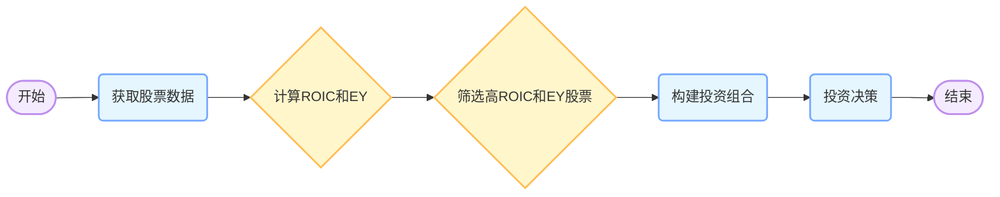

# 乔尔·格林布拉特的价值投资量化方法

> 关键词：乔尔·格林布拉特、价值投资、量化方法、投资策略、股票估值

> 摘要：本文深入探讨了乔尔·格林布拉特的价值投资量化方法。首先介绍该方法的背景，包括其目的、适用读者群体、文档结构和相关术语。接着阐述核心概念与联系，用示意图和流程图呈现其原理架构。详细讲解核心算法原理，以Python代码示例展示具体操作步骤。通过数学模型和公式对该方法进行理论剖析，并举例说明。结合项目实战，给出代码实际案例及详细解释。分析其实际应用场景，推荐学习资源、开发工具框架和相关论文著作。最后总结其未来发展趋势与挑战，提供常见问题解答和扩展阅读参考资料，帮助读者全面深入理解和运用这一价值投资量化方法。

## 1. 背景介绍 
### 1.1 目的和范围
乔尔·格林布拉特的价值投资量化方法旨在通过系统、量化的方式筛选出具有投资价值的股票，帮助投资者在复杂多变的股票市场中做出更理性、更科学的投资决策。该方法的范围主要聚焦于股票投资领域，通过对上市公司财务数据和市场数据的分析，挖掘被市场低估的优质股票。其目的不仅在于实现资产的增值，还在于为投资者提供一种可持续、可复制的投资策略，降低投资决策中的主观因素和不确定性。

### 1.2 预期读者
本文预期读者主要包括对价值投资和量化投资感兴趣的投资者，无论是专业的投资机构从业者，还是普通的个人投资者，都可以从本文中获取有价值的信息。对于金融专业的学生和研究人员来说，本文也可以作为了解价值投资量化方法的参考资料，帮助他们深入学习和研究相关理论和实践。此外，对股票市场和投资策略有一定了解，希望进一步提升自己投资能力的人士也适合阅读本文。

### 1.3 文档结构概述
本文将按照以下结构进行阐述：首先介绍乔尔·格林布拉特价值投资量化方法的背景信息，包括目的、预期读者和文档结构等。接着深入探讨该方法的核心概念与联系，通过文本示意图和Mermaid流程图展示其原理架构。然后详细讲解核心算法原理，并给出具体操作步骤的Python代码示例。之后介绍相关的数学模型和公式，结合实例进行详细讲解。再通过项目实战，展示代码实际案例并进行详细解释说明。分析该方法的实际应用场景，推荐相关的学习资源、开发工具框架和论文著作。最后总结该方法的未来发展趋势与挑战，提供常见问题解答和扩展阅读参考资料。

### 1.4 术语表
#### 1.4.1 核心术语定义
- **价值投资**：一种基于对股票内在价值的评估，寻找被市场低估的股票进行投资的策略。其核心思想是买入价格低于其内在价值的股票，等待市场对其价值进行重新评估，从而实现投资收益。
- **量化方法**：运用数学、统计学和计算机科学等方法，对金融数据进行分析和处理，以制定投资策略的方法。通过量化模型，可以对大量的数据进行快速、准确的分析，减少主观判断的影响。
- **资本回报率（ROIC）**：是指投出和/或使用资金与相关回报（回报通常表现为获取的利息和/或分得利润）之比例，用于衡量一个公司运用资本获得收益的能力。计算公式为：$ROIC = \frac{息税前利润(EBIT)×(1 - 税率)}{投资资本}$。
- **盈利收益率（EY）**：是指股票价格与每股收益的比值的倒数，即$EY=\frac{每股收益}{股票价格}$，反映了股票的盈利能力和投资价值。

#### 1.4.2 相关概念解释
- **股票估值**：是对股票的内在价值进行评估的过程。通过分析公司的财务状况、行业前景、宏观经济环境等因素，确定股票的合理价格。常见的估值方法包括市盈率法、市净率法、现金流折现法等。
- **投资组合**：是指投资者将资金分散投资于多种不同的资产或股票，以降低投资风险的一种投资策略。通过构建投资组合，可以在不同资产之间实现风险的分散和收益的平衡。
- **市场效率**：是指市场价格反映所有可用信息的程度。在有效市场中，股票价格能够及时、准确地反映公司的内在价值，投资者很难通过分析公开信息获得超额收益。

#### 1.4.3 缩略词列表
- **ROIC**：Return on Invested Capital，资本回报率
- **EBIT**：Earnings Before Interest and Taxes，息税前利润
- **EY**：Earnings Yield，盈利收益率

## 2. 核心概念与联系 
乔尔·格林布拉特的价值投资量化方法的核心概念主要包括资本回报率（ROIC）和盈利收益率（EY）。该方法认为，具有较高ROIC和EY的股票通常具有更高的投资价值。

### 核心概念原理
- **资本回报率（ROIC）**：ROIC衡量了公司运用资本获得收益的能力。一个公司的ROIC越高，说明其在利用资本创造利润方面的效率越高，公司的经营管理水平也相对较高。高ROIC的公司通常具有较强的竞争力和盈利能力，能够为股东创造更多的价值。
- **盈利收益率（EY）**：EY反映了股票的盈利能力和投资价值。较高的EY意味着投资者可以以较低的价格买入具有较高盈利的股票，从而获得更高的投资回报。

### 架构的文本示意图
```plaintext
乔尔·格林布拉特价值投资量化方法
|-- 核心概念
|   |-- 资本回报率（ROIC）
|   |   |-- 衡量公司资本利用效率
|   |   |-- 反映公司经营管理水平
|   |-- 盈利收益率（EY）
|   |   |-- 体现股票盈利能力
|   |   |-- 反映股票投资价值
|-- 量化筛选
|   |-- 筛选高ROIC和EY的股票
|-- 投资组合构建
|   |-- 分散投资于筛选出的股票
|-- 投资决策
|   |-- 根据筛选结果和组合情况做出投资决策
```

### Mermaid流程图


## 3. 核心算法原理 & 具体操作步骤 
### 核心算法原理
乔尔·格林布拉特的价值投资量化方法的核心算法是通过计算股票的ROIC和EY，对股票进行排序和筛选。具体步骤如下：
1. 收集股票的财务数据和市场数据，包括息税前利润（EBIT）、投资资本、每股收益、股票价格等。
2. 计算每只股票的ROIC和EY。
3. 根据ROIC和EY对股票进行排序，选择ROIC和EY较高的股票。
4. 构建投资组合，将资金分散投资于筛选出的股票。

### 具体操作步骤的Python代码示例
```python
import pandas as pd

# 示例数据，实际应用中需要从数据源获取真实数据
data = {
    '股票代码': ['A', 'B', 'C', 'D', 'E'],
    '息税前利润(EBIT)': [100, 200, 150, 300, 250],
    '投资资本': [500, 800, 600, 1200, 1000],
    '每股收益': [2, 3, 2.5, 4, 3.5],
    '股票价格': [20, 30, 25, 40, 35]
}

df = pd.DataFrame(data)

# 计算ROIC
df['ROIC'] = df['息税前利润(EBIT)'] / df['投资资本']

# 计算盈利收益率（EY）
df['EY'] = df['每股收益'] / df['股票价格']

# 对ROIC和EY进行排序
df = df.sort_values(by=['ROIC', 'EY'], ascending=False)

# 选择前3只股票作为投资组合
portfolio = df.head(3)

print("投资组合：")
print(portfolio[['股票代码', 'ROIC', 'EY']])
```
### 代码解释
1. **数据准备**：使用`pandas`库创建一个包含股票财务数据和市场数据的DataFrame。
2. **计算ROIC**：通过将息税前利润（EBIT）除以投资资本，计算每只股票的ROIC。
3. **计算EY**：将每股收益除以股票价格，得到每只股票的EY。
4. **排序**：根据ROIC和EY对股票进行降序排序。
5. **选择投资组合**：选择排序后前3只股票作为投资组合。

## 4. 数学模型和公式 & 详细讲解 & 举例说明 
### 数学模型和公式
- **资本回报率（ROIC）**：
  $$ROIC = \frac{息税前利润(EBIT)×(1 - 税率)}{投资资本}$$
  在实际应用中，如果不考虑税率的影响，可以简化为：
  $$ROIC = \frac{息税前利润(EBIT)}{投资资本}$$
- **盈利收益率（EY）**：
  $$EY=\frac{每股收益}{股票价格}$$

### 详细讲解
- **ROIC**：ROIC反映了公司运用资本创造利润的效率。一个高ROIC的公司意味着它能够更有效地利用投资者投入的资本，产生更高的利润。例如，一家公司的息税前利润为100万元，投资资本为500万元，则其ROIC为$\frac{100}{500}=0.2$，即20%。这表明该公司每投入1元的资本，可以创造0.2元的利润。
- **EY**：EY体现了股票的盈利能力和投资价值。较高的EY意味着投资者可以以较低的价格买入具有较高盈利的股票。例如，一只股票的每股收益为2元，股票价格为20元，则其EY为$\frac{2}{20}=0.1$，即10%。这表示投资者每投资1元，可以获得0.1元的盈利。

### 举例说明
假设有两家公司A和B，相关数据如下：

| 公司 | 息税前利润(EBIT)（万元） | 投资资本（万元） | 每股收益（元） | 股票价格（元） |
| ---- | ---- | ---- | ---- | ---- |
| A | 100 | 500 | 2 | 20 |
| B | 150 | 800 | 3 | 30 |

- **计算ROIC**：
  - 公司A的ROIC：$ROIC_A=\frac{100}{500}=0.2$，即20%。
  - 公司B的ROIC：$ROIC_B=\frac{150}{800}=0.1875$，即18.75%。
- **计算EY**：
  - 公司A的EY：$EY_A=\frac{2}{20}=0.1$，即10%。
  - 公司B的EY：$EY_B=\frac{3}{30}=0.1$，即10%。

从ROIC来看，公司A的资本利用效率更高；而从EY来看，两家公司的盈利能力和投资价值相同。综合考虑，公司A可能具有更高的投资价值。

## 5. 项目实战：代码实际案例和详细解释说明 
### 5.1  开发环境搭建
- **Python环境**：建议使用Python 3.7及以上版本。可以从Python官方网站（https://www.python.org/downloads/）下载并安装。
- **开发工具**：推荐使用PyCharm作为开发工具，它是一款功能强大的Python集成开发环境（IDE），可以从JetBrains官方网站（https://www.jetbrains.com/pycharm/download/）下载并安装。
- **所需库**：在项目中需要使用`pandas`库进行数据处理和分析。可以使用以下命令进行安装：
```sh
pip install pandas
```

### 5.2  源代码详细实现和代码解读
```python
import pandas as pd
import yfinance as yf  # 用于获取股票数据

# 定义股票列表
stock_list = ['AAPL', 'MSFT', 'GOOG', 'AMZN', 'FB']

# 获取股票数据
data = yf.download(stock_list, start='2020-01-01', end='2021-01-01')

# 提取每股收益数据（这里简化处理，实际需要从财务报表获取）
# 假设每股收益数据已经获取并存储在一个字典中
eps_data = {
    'AAPL': 3.28,
    'MSFT': 5.76,
    'GOOG': 47.08,
    'AMZN': 23.01,
    'FB': 10.94
}

# 提取最后一天的股票价格
last_prices = data['Close'].iloc[-1]

# 创建DataFrame
df = pd.DataFrame({
    '股票代码': stock_list,
    '每股收益': [eps_data[stock] for stock in stock_list],
    '股票价格': last_prices.values
})

# 计算盈利收益率（EY）
df['EY'] = df['每股收益'] / df['股票价格']

# 对EY进行排序
df = df.sort_values(by='EY', ascending=False)

# 选择前3只股票作为投资组合
portfolio = df.head(3)

print("投资组合：")
print(portfolio[['股票代码', 'EY']])
```
### 代码解读与分析
1. **导入库**：导入`pandas`库用于数据处理和分析，`yfinance`库用于获取股票数据。
2. **定义股票列表**：定义要分析的股票列表。
3. **获取股票数据**：使用`yfinance`库下载指定时间段内的股票数据。
4. **提取每股收益数据**：这里简化处理，假设每股收益数据已经获取并存储在一个字典中。在实际应用中，需要从公司的财务报表中获取准确的每股收益数据。
5. **提取最后一天的股票价格**：从下载的数据中提取最后一天的股票价格。
6. **创建DataFrame**：将股票代码、每股收益和股票价格数据组合成一个DataFrame。
7. **计算EY**：根据每股收益和股票价格计算每只股票的EY。
8. **排序**：根据EY对股票进行降序排序。
9. **选择投资组合**：选择排序后前3只股票作为投资组合。

## 6. 实际应用场景 
### 个人投资者
对于个人投资者来说，乔尔·格林布拉特的价值投资量化方法可以帮助他们在众多的股票中筛选出具有投资价值的股票，降低投资风险。个人投资者可以根据自己的资金状况和风险承受能力，构建适合自己的投资组合。例如，一个风险承受能力较低的个人投资者可以选择ROIC和EY较高、稳定性较好的大盘蓝筹股；而一个风险承受能力较高的个人投资者可以适当选择一些成长型股票。

### 投资机构
投资机构可以利用该方法进行大规模的股票筛选和投资组合构建。通过量化分析，可以提高投资决策的效率和准确性，减少主观因素的影响。投资机构可以根据不同的投资策略和目标，对筛选出的股票进行进一步的分析和评估，构建多元化的投资组合。例如，一家量化投资基金可以利用该方法筛选出具有潜力的股票，结合其他量化指标和模型，进行投资决策。

### 学术研究
在学术研究领域，乔尔·格林布拉特的价值投资量化方法可以作为研究股票市场效率和投资策略的重要案例。学者们可以通过对该方法的实证研究，验证其有效性和适用性，探讨其在不同市场环境下的表现。同时，也可以对该方法进行改进和优化，提出新的投资策略和模型。

## 7. 工具和资源推荐
### 7.1 学习资源推荐
#### 7.1.1 书籍推荐
- 《股市稳赚》（乔尔·格林布拉特著）：这本书是乔尔·格林布拉特价值投资量化方法的经典著作，详细介绍了其投资策略和方法，适合初学者和有一定投资经验的读者阅读。
- 《聪明的投资者》（本杰明·格雷厄姆著）：价值投资的经典之作，对价值投资的理论和实践进行了深入阐述，是学习价值投资的必读书籍。
- 《财务报表分析与证券定价》（斯蒂芬·佩因曼著）：这本书介绍了如何通过分析公司的财务报表来评估股票的价值，对于理解价值投资量化方法中的财务指标有很大帮助。

#### 7.1.2 在线课程
- Coursera上的“Financial Markets”课程：由耶鲁大学教授罗伯特·席勒讲授，介绍了金融市场的基本原理和投资策略，包括价值投资和量化投资等内容。
- Udemy上的“Quantitative Finance and Algorithmic Trading with Python”课程：该课程主要介绍了如何使用Python进行量化金融和算法交易，对于学习价值投资量化方法的编程实现有很大帮助。

#### 7.1.3 技术博客和网站
- Seeking Alpha（https://seekingalpha.com/）：一个提供股票分析和投资建议的网站，有很多专业的投资者和分析师分享自己的观点和研究成果。
- QuantNet（https://www.quantnet.com/）：一个专注于量化金融和算法交易的社区，有很多关于量化投资的技术文章和讨论。

### 7.2 开发工具框架推荐
#### 7.2.1 IDE和编辑器
- PyCharm：一款功能强大的Python集成开发环境（IDE），具有代码编辑、调试、版本控制等功能，适合Python开发。
- Jupyter Notebook：一个交互式的开发环境，可以在浏览器中编写和运行Python代码，方便进行数据分析和可视化。

#### 7.2.2 调试和性能分析工具
- Py-Spy：一个Python性能分析工具，可以帮助开发者找出Python代码中的性能瓶颈。
- PDB：Python自带的调试工具，可以帮助开发者调试Python代码。

#### 7.2.3 相关框架和库
- Pandas：一个强大的数据处理和分析库，提供了DataFrame等数据结构，方便进行数据清洗、转换和分析。
- NumPy：一个用于科学计算的Python库，提供了高效的数组操作和数学函数。
- yfinance：一个用于获取股票数据的Python库，可以方便地从雅虎财经获取股票的历史数据。

### 7.3 相关论文著作推荐
#### 7.3.1 经典论文
- Fama, E. F., & French, K. R. (1992). The cross-section of expected stock returns. The Journal of Finance, 47(2), 427-465. 这篇论文提出了著名的Fama-French三因子模型，对股票收益率的横截面进行了深入分析，是价值投资领域的经典论文。
- Graham, B., & Dodd, D. L. (1934). Security analysis. McGraw-Hill. 这本书是价值投资的开山之作，对价值投资的理论和方法进行了系统阐述。

#### 7.3.2 最新研究成果
- Novy-Marx, R. (2013). The other side of value: The gross profitability premium. The Journal of Financial Economics, 108(1), 1-28. 这篇论文提出了基于毛利率的盈利因子，拓展了价值投资的研究范畴。
- Asness, C. S., Frazzini, A., & Pedersen, L. H. (2019). Quality minus junk. The Journal of Financial Economics, 131(1), 1-27. 该论文研究了质量因子在投资中的应用，对价值投资的理论和实践有一定的启示。

#### 7.3.3 应用案例分析
- Ang, A. (2014). Asset management: A systematic approach to factor investing. Oxford University Press. 这本书通过实际案例介绍了因子投资的方法和应用，包括价值因子、规模因子等，对于理解价值投资量化方法的应用有很大帮助。

## 8. 总结：未来发展趋势与挑战
### 未来发展趋势
- **与人工智能和机器学习的结合**：随着人工智能和机器学习技术的不断发展，价值投资量化方法将与这些技术更加紧密地结合。通过机器学习算法，可以对大量的财务数据和市场数据进行更深入的分析和挖掘，发现更多潜在的投资机会。例如，使用深度学习算法对公司的财务报表进行文本分析，提取有用的信息，提高投资决策的准确性。
- **多元化的因子应用**：除了ROIC和EY等传统因子外，未来的价值投资量化方法将更加注重多元化的因子应用。例如，考虑公司的创新能力、社会责任、治理结构等非财务因子，综合评估公司的投资价值。这些非财务因子可以为投资决策提供更多的信息，降低投资风险。
- **全球化投资**：随着全球经济的一体化，投资者将越来越关注全球范围内的投资机会。价值投资量化方法将不再局限于本国市场，而是拓展到全球市场。通过对不同国家和地区的股票进行量化分析，投资者可以构建更加多元化的投资组合，实现全球资产配置。

### 挑战
- **数据质量和可靠性**：价值投资量化方法依赖于大量的财务数据和市场数据，数据的质量和可靠性直接影响到投资决策的准确性。然而，在实际应用中，数据可能存在错误、缺失或延迟等问题，需要投资者进行数据清洗和预处理，提高数据的质量。
- **市场环境的变化**：股票市场是复杂多变的，市场环境的变化可能导致价值投资量化方法的有效性降低。例如，在市场泡沫时期，股票价格可能偏离其内在价值，传统的估值指标可能失效。投资者需要不断调整和优化投资策略，以适应市场环境的变化。
- **模型的过拟合问题**：在使用机器学习和人工智能算法进行量化分析时，模型的过拟合问题是一个常见的挑战。过拟合的模型可能在训练数据上表现良好，但在实际应用中却无法取得理想的效果。投资者需要采用合适的模型选择和评估方法，避免模型过拟合。

## 9. 附录：常见问题与解答
### 问题1：乔尔·格林布拉特的价值投资量化方法适用于所有股票吗？
解答：不是的。该方法主要适用于具有一定规模和稳定性的上市公司。对于一些新兴的、高风险的公司，由于其财务数据和经营状况可能不稳定，该方法的适用性可能会受到限制。

### 问题2：如何获取准确的财务数据和市场数据？
解答：可以通过专业的金融数据提供商，如万得（Wind）、东方财富Choice等获取财务数据和市场数据。也可以从上市公司的官方网站、证券交易所网站等渠道获取公司的财务报表和公告信息。

### 问题3：在计算ROIC和EY时，需要考虑哪些因素？
解答：在计算ROIC时，需要准确确定息税前利润（EBIT）和投资资本的数值，同时要考虑税率的影响。在计算EY时，要确保每股收益和股票价格的数据准确无误，并且要考虑到股票的分红情况。

### 问题4：价值投资量化方法与传统的价值投资方法有什么区别？
解答：传统的价值投资方法主要依赖于投资者的主观判断和经验，通过对公司的基本面进行分析来评估股票的价值。而价值投资量化方法则运用数学、统计学和计算机科学等方法，对大量的数据进行分析和处理，以制定投资策略。量化方法可以减少主观因素的影响，提高投资决策的效率和准确性。

## 10. 扩展阅读 & 参考资料
### 扩展阅读
- 《漫步华尔街》（伯顿·马尔基尔著）：这本书介绍了各种投资理论和方法，包括随机漫步理论、有效市场假说等，对于理解股票市场的运行机制有很大帮助。
- 《金融炼金术》（乔治·索罗斯著）：索罗斯在书中阐述了自己的投资哲学和方法，包括反身性理论等，对于投资者的思维方式和投资策略有一定的启示。

### 参考资料
- 乔尔·格林布拉特. 《股市稳赚》. 中信出版社.
- 本杰明·格雷厄姆. 《聪明的投资者》. 人民邮电出版社.
- 斯蒂芬·佩因曼. 《财务报表分析与证券定价》. 中国人民大学出版社.
- Fama, E. F., & French, K. R. (1992). The cross-section of expected stock returns. The Journal of Finance, 47(2), 427-465.
- Graham, B., & Dodd, D. L. (1934). Security analysis. McGraw-Hill.
- Novy-Marx, R. (2013). The other side of value: The gross profitability premium. The Journal of Financial Economics, 108(1), 1-28.
- Asness, C. S., Frazzini, A., & Pedersen, L. H. (2019). Quality minus junk. The Journal of Financial Economics, 131(1), 1-27.
- Ang, A. (2014). Asset management: A systematic approach to factor investing. Oxford University Press.