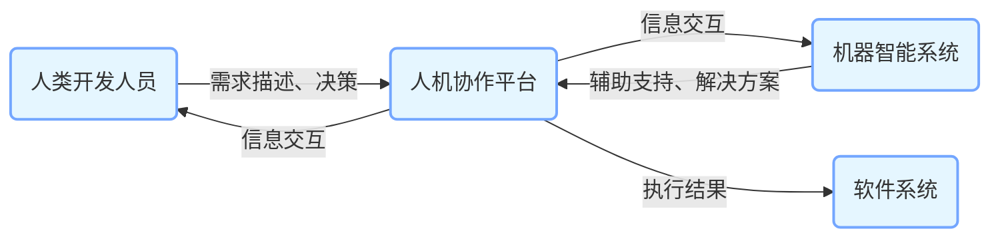

# 人机协同开发：效率提升的新模式

> 关键词：人机协同开发、效率提升、人工智能、软件开发、协作模式

> 摘要：本文围绕人机协同开发这一效率提升的新模式展开深入探讨。首先介绍了人机协同开发的背景，包括其目的、预期读者、文档结构和相关术语。接着阐述了核心概念与联系，分析了人机协同开发的原理和架构。通过Python代码详细讲解了核心算法原理及具体操作步骤，并给出数学模型和公式进行深入剖析。以项目实战展示了代码实际案例及详细解释，探讨了其实际应用场景。同时推荐了相关的工具和资源，最后总结了未来发展趋势与挑战，还提供了常见问题解答和扩展阅读参考资料，旨在全面深入地解读人机协同开发这一新兴模式。

## 1. 背景介绍 
### 1.1 目的和范围
在当今科技飞速发展的时代，软件开发的复杂度和规模不断增加，对开发效率和质量的要求也越来越高。人机协同开发作为一种新兴的开发模式，旨在充分发挥人类的创造力、判断力和机器的计算能力、自动化处理能力，实现两者的优势互补，从而显著提升软件开发的效率和质量。本文的范围将涵盖人机协同开发的基本概念、原理、算法、实际应用以及未来发展趋势等方面，旨在为读者全面深入地介绍这一模式。

### 1.2 预期读者
本文预期读者包括软件开发人员、软件架构师、人工智能研究人员、CTO等技术领域的专业人士，以及对人机协同开发模式感兴趣的相关学者和爱好者。通过阅读本文，读者可以了解人机协同开发的基本原理和实现方法，掌握相关的技术和工具，为在实际工作中应用这一模式提供参考和指导。

### 1.3 文档结构概述
本文将按照以下结构进行组织：首先介绍人机协同开发的背景信息，包括目的、预期读者和文档结构概述等；接着阐述核心概念与联系，包括人机协同开发的原理和架构；然后详细讲解核心算法原理及具体操作步骤，通过Python代码进行说明；之后给出数学模型和公式，并进行详细讲解和举例说明；再通过项目实战展示代码实际案例及详细解释；探讨实际应用场景；推荐相关的工具和资源；最后总结未来发展趋势与挑战，提供常见问题解答和扩展阅读参考资料。

### 1.4 术语表
#### 1.4.1 核心术语定义
- **人机协同开发**：指人类开发人员与人工智能系统相互协作，共同完成软件开发任务的一种开发模式。
- **人工智能辅助开发**：利用人工智能技术为软件开发过程提供辅助支持，如代码自动生成、缺陷检测等。
- **人类智能优势**：人类所具备的创造力、判断力、经验和直觉等在软件开发中的优势。
- **机器智能优势**：机器所具备的高速计算能力、大规模数据处理能力和自动化执行能力等在软件开发中的优势。

#### 1.4.2 相关概念解释
- **协作机制**：人机之间进行协作的方式和规则，包括信息交互、任务分配、决策制定等方面。
- **知识图谱**：一种语义网络，用于表示知识和信息之间的关系，在人机协同开发中可用于知识共享和推理。
- **自然语言处理**：研究如何让计算机理解和处理人类自然语言的技术，在人机交互中起到重要作用。

#### 1.4.3 缩略词列表
- **AI**：Artificial Intelligence，人工智能
- **ML**：Machine Learning，机器学习
- **NLP**：Natural Language Processing，自然语言处理

## 2. 核心概念与联系 
人机协同开发的核心思想是将人类的智能和机器的智能相结合，充分发挥两者的优势，实现软件开发效率和质量的提升。人类开发人员具有创造力、判断力和丰富的经验，能够理解复杂的业务需求，进行抽象设计和决策制定；而机器则具有高速计算能力、大规模数据处理能力和自动化执行能力，能够快速完成重复性任务、进行数据分析和模式识别。

### 核心概念原理
在人机协同开发中，人类和机器通过协作机制进行交互和合作。人类开发人员负责提出问题、制定目标和进行决策，机器则根据人类的指令和需求，利用其智能算法和工具，提供辅助支持和解决方案。例如，在代码编写过程中，人类开发人员可以使用自然语言描述需求，机器通过自然语言处理技术理解需求，并自动生成部分代码；人类开发人员再对生成的代码进行审查和修改，确保代码的正确性和可读性。

### 架构示意图

这个架构图展示了人机协同开发的基本结构。人类开发人员和机器智能系统通过人机协作平台进行信息交互和协作。人类开发人员将需求和决策传递给平台，机器智能系统根据这些信息提供辅助支持和解决方案，平台将执行结果反馈给人类开发人员，并作用于软件系统。

## 3. 核心算法原理 & 具体操作步骤 
### 核心算法原理
在人机协同开发中，自然语言处理和机器学习是两个重要的核心算法。自然语言处理用于实现人类和机器之间的自然语言交互，使机器能够理解人类的需求；机器学习则用于训练机器智能系统，使其能够根据历史数据和经验，自动生成代码、检测缺陷等。

以下是一个简单的自然语言处理示例，使用Python的`nltk`库进行文本处理：
```python
import nltk
from nltk.tokenize import word_tokenize
from nltk.corpus import stopwords
from nltk.stem import WordNetLemmatizer

# 下载必要的数据
nltk.download('punkt')
nltk.download('stopwords')
nltk.download('wordnet')

# 定义文本处理函数
def preprocess_text(text):
    # 分词
    tokens = word_tokenize(text)
    # 去除停用词
    stop_words = set(stopwords.words('english'))
    filtered_tokens = [token for token in tokens if token.lower() not in stop_words]
    # 词形还原
    lemmatizer = WordNetLemmatizer()
    lemmatized_tokens = [lemmatizer.lemmatize(token) for token in filtered_tokens]
    return lemmatized_tokens

# 示例文本
text = "This is a sample sentence for natural language processing."
processed_text = preprocess_text(text)
print(processed_text)
```
### 具体操作步骤
1. **需求分析**：人类开发人员使用自然语言描述软件需求，将其输入到人机协作平台。
2. **自然语言处理**：平台对输入的需求进行自然语言处理，提取关键信息和意图。
3. **机器学习模型预测**：根据处理后的需求信息，使用机器学习模型进行预测，生成可能的代码片段或解决方案。
4. **人类审查和修改**：人类开发人员对机器生成的代码或解决方案进行审查和修改，确保其符合需求和质量标准。
5. **迭代优化**：在开发过程中，不断进行人机交互和迭代优化，直到软件系统满足需求。

## 4. 数学模型和公式 & 详细讲解 & 举例说明 
### 数学模型
在人机协同开发中，可以使用概率模型来描述人类和机器的协作过程。假设人类的决策为 $H$，机器的建议为 $M$，最终的决策为 $D$。则可以使用贝叶斯公式来计算最终决策的概率：
$$P(D|H,M)=\frac{P(H,M|D)P(D)}{P(H,M)}$$
其中，$P(D|H,M)$ 表示在人类决策 $H$ 和机器建议 $M$ 的条件下，最终决策为 $D$ 的概率；$P(H,M|D)$ 表示在最终决策为 $D$ 的条件下，人类决策 $H$ 和机器建议 $M$ 同时发生的概率；$P(D)$ 表示最终决策为 $D$ 的先验概率；$P(H,M)$ 表示人类决策 $H$ 和机器建议 $M$ 同时发生的概率。

### 详细讲解
这个数学模型的意义在于，通过考虑人类和机器的信息，来计算最终决策的概率。在实际应用中，可以根据历史数据和经验，估计各个概率的值，从而做出更加合理的决策。例如，当机器的建议与人类的决策一致时，最终决策的概率可能会更高；当两者不一致时，需要综合考虑其他因素来确定最终决策。

### 举例说明
假设在软件开发中，人类开发人员认为某个功能应该采用算法 $A$（决策 $H$），机器建议采用算法 $B$（建议 $M$）。根据历史数据，我们可以估计出 $P(H,M|D_A)$、$P(H,M|D_B)$、$P(D_A)$、$P(D_B)$ 等概率值。然后，通过贝叶斯公式计算 $P(D_A|H,M)$ 和 $P(D_B|H,M)$，比较两者的大小，选择概率较大的决策作为最终决策。

## 5. 项目实战：代码实际案例和详细解释说明 
### 5.1  开发环境搭建
- **操作系统**：选择合适的操作系统，如Windows、Linux或macOS。
- **编程语言**：使用Python作为主要的开发语言，因为Python具有丰富的库和工具，适合进行自然语言处理和机器学习开发。
- **开发工具**：推荐使用PyCharm作为集成开发环境（IDE），它提供了代码编辑、调试、版本控制等功能。
- **相关库和框架**：安装`nltk`、`scikit-learn`、`tensorflow`等库，用于自然语言处理、机器学习和深度学习开发。

### 5.2  源代码详细实现和代码解读
以下是一个简单的人机协同开发项目示例，实现一个根据自然语言描述生成简单Python代码的功能：
```python
import nltk
from nltk.tokenize import word_tokenize
from nltk.corpus import stopwords
from nltk.stem import WordNetLemmatizer
import re

# 下载必要的数据
nltk.download('punkt')
nltk.download('stopwords')
nltk.download('wordnet')

# 定义文本处理函数
def preprocess_text(text):
    # 分词
    tokens = word_tokenize(text)
    # 去除停用词
    stop_words = set(stopwords.words('english'))
    filtered_tokens = [token for token in tokens if token.lower() not in stop_words]
    # 词形还原
    lemmatizer = WordNetLemmatizer()
    lemmatized_tokens = [lemmatizer.lemmatize(token) for token in filtered_tokens]
    return lemmatized_tokens

# 定义代码生成规则
def generate_code(tokens):
    if 'print' in tokens:
        match = re.search(r'print\s+(\w+)', ' '.join(tokens))
        if match:
            variable = match.group(1)
            return f"print({variable})"
    return "No code generated."

# 主函数
def main():
    text = input("Please enter your requirement: ")
    processed_tokens = preprocess_text(text)
    code = generate_code(processed_tokens)
    print("Generated code:")
    print(code)

if __name__ == "__main__":
    main()
```
### 代码解读与分析
- **文本处理部分**：`preprocess_text`函数用于对输入的自然语言文本进行预处理，包括分词、去除停用词和词形还原。这一步骤的目的是将文本转换为机器能够处理的形式。
- **代码生成部分**：`generate_code`函数根据预处理后的文本 tokens，查找是否包含特定的关键词（如`print`），并根据规则生成相应的Python代码。
- **主函数部分**：`main`函数负责接收用户输入的需求，调用文本处理和代码生成函数，并输出生成的代码。

这个示例只是一个简单的人机协同开发案例，实际应用中可以根据具体需求和场景，扩展和优化代码生成规则，使用更复杂的自然语言处理和机器学习技术。

## 6. 实际应用场景 
### 软件开发
在软件开发过程中，人机协同开发可以应用于需求分析、设计、编码、测试等各个阶段。例如，在需求分析阶段，人类开发人员可以使用自然语言描述需求，机器通过自然语言处理技术理解需求，并生成需求文档的初稿；在编码阶段，机器可以根据人类的需求自动生成部分代码，人类开发人员再进行审查和修改。

### 智能编程助手
人机协同开发可以实现智能编程助手，为开发人员提供实时的代码提示、错误检测和修复建议等功能。开发人员在编写代码时，智能编程助手可以根据上下文和历史数据，预测开发人员的意图，提供相关的代码片段和解决方案。

### 软件维护和优化
在软件维护和优化过程中，人机协同开发可以帮助开发人员快速定位和修复软件缺陷，分析软件性能瓶颈，并提供优化建议。机器可以通过对大量的代码和运行数据进行分析，发现潜在的问题和优化点，人类开发人员再进行具体的修复和优化操作。

## 7. 工具和资源推荐
### 7.1 学习资源推荐
#### 7.1.1 书籍推荐
- 《人工智能：一种现代的方法》：全面介绍了人工智能的基本概念、算法和应用，是学习人工智能的经典教材。
- 《Python自然语言处理》：详细讲解了Python在自然语言处理中的应用，包括文本处理、机器学习和深度学习等方面的内容。
- 《机器学习》：系统介绍了机器学习的基本理论和算法，是学习机器学习的重要参考书籍。

#### 7.1.2 在线课程
- Coursera上的“人工智能基础”课程：由知名高校的教授授课，系统介绍了人工智能的基本概念和算法。
- edX上的“Python for Data Science”课程：学习Python在数据科学中的应用，包括数据处理、数据分析和机器学习等方面的内容。
- Udemy上的“自然语言处理实战”课程：通过实际项目，学习自然语言处理的具体应用和实现方法。

#### 7.1.3 技术博客和网站
- Medium：上面有很多关于人工智能、软件开发和人机协同开发的技术文章和经验分享。
- Towards Data Science：专注于数据科学和人工智能领域的技术博客，提供了很多有价值的文章和教程。
- GitHub：可以在上面找到很多开源的人机协同开发项目和代码示例，学习他人的经验和技术。

### 7.2 开发工具框架推荐
#### 7.2.1 IDE和编辑器
- PyCharm：功能强大的Python集成开发环境，提供了代码编辑、调试、版本控制等功能。
- Visual Studio Code：轻量级的代码编辑器，支持多种编程语言，有丰富的插件和扩展。
- Jupyter Notebook：交互式的开发环境，适合进行数据探索、模型训练和代码演示。

#### 7.2.2 调试和性能分析工具
- PySnooper：简单易用的Python调试工具，可以自动记录函数的调用和变量的值。
- cProfile：Python内置的性能分析工具，可以分析代码的运行时间和内存使用情况。
- TensorBoard：用于可视化深度学习模型的训练过程和性能指标。

#### 7.2.3 相关框架和库
- NLTK：Python中常用的自然语言处理库，提供了丰富的文本处理工具和语料库。
- Scikit-learn：用于机器学习的Python库，提供了各种机器学习算法和工具。
- TensorFlow：开源的深度学习框架，广泛应用于图像识别、自然语言处理等领域。

### 7.3 相关论文著作推荐
#### 7.3.1 经典论文
- “A Unified Approach to Interpreting Model Predictions”：提出了一种统一的方法来解释机器学习模型的预测结果，有助于提高模型的可解释性。
- “Attention Is All You Need”：介绍了Transformer架构，在自然语言处理领域取得了巨大的成功。
- “Generative Adversarial Networks”：提出了生成对抗网络（GAN）的概念，为生成式模型的发展做出了重要贡献。

#### 7.3.2 最新研究成果
- 关注顶级学术会议（如NeurIPS、ICML、ACL等）上的最新研究成果，了解人机协同开发领域的前沿技术和发展趋势。
- 阅读相关的学术期刊（如Journal of Artificial Intelligence Research、Artificial Intelligence等）上的论文，深入学习最新的研究成果和理论。

#### 7.3.3 应用案例分析
- 分析实际的人机协同开发项目案例，了解其实现方法、技术选型和应用效果。可以通过查阅相关的技术报告、案例分析文章和开源项目来获取这些信息。

## 8. 总结：未来发展趋势与挑战
### 未来发展趋势
- **更加智能化**：随着人工智能技术的不断发展，人机协同开发系统将变得更加智能化，能够更好地理解人类的需求，提供更加准确和有用的辅助支持。
- **跨领域协作**：人机协同开发将不仅仅局限于软件开发领域，还将扩展到其他领域，如医疗、金融、教育等，实现跨领域的协作和创新。
- **个性化定制**：根据不同用户的需求和偏好，提供个性化的人机协同开发服务，提高用户的满意度和开发效率。

### 挑战
- **数据隐私和安全**：人机协同开发需要处理大量的用户数据和代码，如何保障数据的隐私和安全是一个重要的挑战。
- **人机信任问题**：人类开发人员对机器的建议和决策可能存在信任问题，如何建立人机之间的信任关系是需要解决的问题。
- **技术标准和规范**：目前人机协同开发领域还缺乏统一的技术标准和规范，这给系统的开发、集成和应用带来了一定的困难。

## 9. 附录：常见问题与解答
### 问题1：人机协同开发会取代人类开发人员吗？
答：不会。人机协同开发的目的是充分发挥人类和机器的优势，实现两者的优势互补。人类开发人员具有创造力、判断力和丰富的经验，这些是机器无法替代的。机器只是提供辅助支持和解决方案，最终的决策和判断还是由人类开发人员来完成。

### 问题2：人机协同开发需要具备哪些技术和知识？
答：需要具备人工智能、机器学习、自然语言处理、软件开发等方面的技术和知识。同时，还需要了解人机交互的原理和方法，掌握相关的开发工具和框架。

### 问题3：如何评估人机协同开发的效果？
答：可以从开发效率、代码质量、用户满意度等方面进行评估。例如，比较使用人机协同开发前后的项目开发周期、缺陷率等指标，收集用户的反馈意见来评估用户满意度。

## 10. 扩展阅读 & 参考资料
### 扩展阅读
- 《人类与机器的未来：智能时代的合作与竞争》：探讨了人类与机器在未来社会中的关系和发展趋势。
- 《智能时代：大数据与智能革命重新定义未来》：介绍了大数据和人工智能对未来社会的影响和变革。

### 参考资料
- [NLTK官方文档](https://www.nltk.org/)
- [Scikit-learn官方文档](https://scikit-learn.org/stable/)
- [TensorFlow官方文档](https://www.tensorflow.org/)