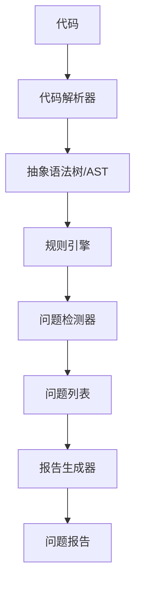

# 代码复查方法：问题发现系统

> 关键词：代码复查、问题发现系统、软件质量、代码审查、缺陷检测

> 摘要：本文深入探讨了代码复查方法中的问题发现系统。首先介绍了代码复查的背景知识，包括其目的、预期读者等。接着阐述了核心概念，包括问题发现系统的原理和架构。通过Python源代码详细讲解了核心算法原理和具体操作步骤，并给出了相关数学模型和公式。在项目实战部分，提供了开发环境搭建、源代码实现及解读。同时介绍了该系统的实际应用场景，推荐了相关的学习资源、开发工具框架和论文著作。最后总结了未来发展趋势与挑战，并给出常见问题解答和参考资料，旨在帮助开发者提升代码质量，更有效地发现和解决代码中的问题。

## 1. 背景介绍 
### 1.1 目的和范围
代码复查是软件开发过程中的关键环节，其目的在于提高代码的质量、安全性和可维护性。问题发现系统作为代码复查的重要工具，能够自动或辅助发现代码中的潜在问题，如语法错误、逻辑错误、安全漏洞等。本文章的范围涵盖了问题发现系统的核心概念、算法原理、实际应用等方面，旨在为开发者提供全面的代码复查方法和问题发现系统的相关知识。

### 1.2 预期读者
本文预期读者包括软件开发人员、软件测试人员、软件项目管理人员以及对代码质量和软件安全感兴趣的技术爱好者。软件开发人员可以通过本文学习如何利用问题发现系统改进自己的代码；软件测试人员可以借鉴相关方法提高测试效率；软件项目管理人员可以更好地规划和管理代码复查工作；技术爱好者则可以了解代码复查领域的前沿知识。

### 1.3 文档结构概述
本文将按照以下结构进行阐述：首先介绍背景知识，包括目的、预期读者和文档结构概述等；接着讲解核心概念与联系，包括问题发现系统的原理和架构；然后详细阐述核心算法原理和具体操作步骤，通过Python代码进行说明；之后给出数学模型和公式，并举例说明；再通过项目实战展示代码实际案例和详细解释；介绍实际应用场景；推荐相关的工具和资源；总结未来发展趋势与挑战；最后提供附录，包括常见问题与解答以及扩展阅读和参考资料。

### 1.4 术语表
#### 1.4.1 核心术语定义
- **代码复查**：对已编写的代码进行系统性的检查和评估，以发现其中的问题并进行改进。
- **问题发现系统**：一种利用各种技术和算法，自动或辅助发现代码中潜在问题的系统。
- **静态代码分析**：在不运行代码的情况下，对代码的结构、语法和逻辑进行分析的方法。
- **动态代码分析**：在代码运行过程中，对其行为和性能进行监测和分析的方法。

#### 1.4.2 相关概念解释
- **代码缺陷**：代码中存在的错误、漏洞或不符合规范的地方，可能导致软件出现故障或安全问题。
- **代码质量**：代码的正确性、可读性、可维护性、效率等方面的综合表现。
- **代码审查**：通过人工或自动化工具对代码进行审查，以发现和纠正代码中的问题。

#### 1.4.3 缩略词列表
- **AST**：Abstract Syntax Tree（抽象语法树）
- **SCA**：Static Code Analysis（静态代码分析）
- **DCA**：Dynamic Code Analysis（动态代码分析）

## 2. 核心概念与联系 
### 2.1 问题发现系统的原理
问题发现系统的基本原理是通过对代码进行分析，识别其中可能存在的问题。主要分为静态代码分析和动态代码分析两种方式。

静态代码分析是在不运行代码的情况下，对代码的文本进行分析。它通过解析代码的语法结构，构建抽象语法树（AST），然后根据预定义的规则对AST进行检查，以发现潜在的问题。例如，检查代码中是否存在未使用的变量、函数是否有正确的返回值等。

动态代码分析则是在代码运行过程中进行监测和分析。它通过插入监测代码或使用调试工具，收集代码运行时的信息，如变量的值、函数的调用栈等，以发现运行时的错误和性能问题。例如，检查代码是否存在内存泄漏、是否有死锁等问题。

### 2.2 问题发现系统的架构
问题发现系统通常由以下几个部分组成：

- **代码解析器**：负责将代码解析为抽象语法树（AST）或中间表示形式，以便后续的分析。
- **规则引擎**：包含一系列预定义的规则，用于对代码进行检查。这些规则可以是语法规则、逻辑规则、安全规则等。
- **问题检测器**：根据规则引擎中的规则，对代码的AST或中间表示形式进行检查，发现潜在的问题。
- **报告生成器**：将发现的问题整理成报告，以便开发者查看和处理。

以下是问题发现系统的架构示意图：



## 3. 核心算法原理 & 具体操作步骤 
### 3.1 静态代码分析算法原理
静态代码分析的核心算法是基于抽象语法树（AST）的遍历和检查。以下是一个简单的Python示例，用于检查代码中是否存在未使用的变量：

```python
import ast

class UnusedVariableVisitor(ast.NodeVisitor):
    def __init__(self):
        self.used_variables = set()
        self.defined_variables = set()

    def visit_Name(self, node):
        if isinstance(node.ctx, ast.Load):
            self.used_variables.add(node.id)
        self.generic_visit(node)

    def visit_FunctionDef(self, node):
        for arg in node.args.args:
            self.defined_variables.add(arg.arg)
        self.generic_visit(node)

    def visit_Assign(self, node):
        for target in node.targets:
            if isinstance(target, ast.Name):
                self.defined_variables.add(target.id)
        self.generic_visit(node)

    def get_unused_variables(self):
        return self.defined_variables - self.used_variables

def check_unused_variables(code):
    tree = ast.parse(code)
    visitor = UnusedVariableVisitor()
    visitor.visit(tree)
    return visitor.get_unused_variables()

# 示例代码
code = """
x = 10
y = 20
print(x)
"""

unused_variables = check_unused_variables(code)
print("未使用的变量:", unused_variables)
```

### 3.2 具体操作步骤
1. **代码解析**：使用Python的`ast`模块将代码解析为抽象语法树（AST）。
2. **定义访问器类**：继承`ast.NodeVisitor`类，重写相关方法，用于遍历AST并记录变量的定义和使用情况。
3. **遍历AST**：调用访问器类的`visit`方法，对AST进行遍历。
4. **计算未使用的变量**：通过比较定义的变量和使用的变量，找出未使用的变量。
5. **输出结果**：将未使用的变量输出。

## 4. 数学模型和公式 & 详细讲解 & 举例说明 
### 4.1 静态代码分析的数学模型
静态代码分析可以看作是一个基于规则的模式匹配问题。设代码的抽象语法树为 $T$，规则集合为 $R = \{r_1, r_2, \cdots, r_n\}$，其中每个规则 $r_i$ 可以表示为一个谓词函数 $r_i(T)$，用于判断AST $T$ 是否满足该规则。

如果 $r_i(T) = true$，则表示AST $T$ 满足规则 $r_i$；否则，不满足。问题发现系统的目标是找出所有不满足规则的情况，即 $\{r_i | r_i(T) = false, i = 1, 2, \cdots, n\}$。

### 4.2 举例说明
假设我们有一个规则 $r$，用于检查代码中是否存在未使用的变量。设变量的定义集合为 $D$，变量的使用集合为 $U$，则规则 $r$ 可以表示为：

$$r(T) = D - U = \varnothing$$

如果 $D - U \neq \varnothing$，则表示存在未使用的变量，即不满足规则 $r$。

例如，在前面的Python示例中，定义的变量集合 $D = \{x, y\}$，使用的变量集合 $U = \{x\}$，则 $D - U = \{y\}$，表示变量 $y$ 未被使用，不满足规则 $r$。

## 5. 项目实战：代码实际案例和详细解释说明 
### 5.1  开发环境搭建
1. **安装Python**：确保你的系统中已经安装了Python 3.x版本。
2. **安装必要的库**：在本项目中，我们只需要使用Python的内置`ast`模块，无需额外安装其他库。

### 5.2  源代码详细实现和代码解读
以下是一个更完整的Python代码示例，用于实现一个简单的问题发现系统，检查代码中是否存在未使用的变量、未定义的变量和语法错误：

```python
import ast

class CodeAnalyzer(ast.NodeVisitor):
    def __init__(self):
        self.used_variables = set()
        self.defined_variables = set()
        self.undefined_variables = set()
        self.syntax_errors = []

    def visit_Name(self, node):
        if isinstance(node.ctx, ast.Load):
            if node.id not in self.defined_variables:
                self.undefined_variables.add(node.id)
            self.used_variables.add(node.id)
        self.generic_visit(node)

    def visit_FunctionDef(self, node):
        for arg in node.args.args:
            self.defined_variables.add(arg.arg)
        self.generic_visit(node)

    def visit_Assign(self, node):
        for target in node.targets:
            if isinstance(target, ast.Name):
                self.defined_variables.add(target.id)
        self.generic_visit(node)

    def get_unused_variables(self):
        return self.defined_variables - self.used_variables

    def analyze(self, code):
        try:
            tree = ast.parse(code)
            self.visit(tree)
        except SyntaxError as e:
            self.syntax_errors.append(str(e))

        return {
            "unused_variables": self.get_unused_variables(),
            "undefined_variables": self.undefined_variables,
            "syntax_errors": self.syntax_errors
        }

# 示例代码
code = """
x = 10
y = 20
print(x)
z = w + 1  # 未定义的变量 w
"""

analyzer = CodeAnalyzer()
result = analyzer.analyze(code)

print("未使用的变量:", result["unused_variables"])
print("未定义的变量:", result["undefined_variables"])
print("语法错误:", result["syntax_errors"])
```

### 5.3  代码解读与分析
1. **类的定义**：`CodeAnalyzer`类继承自`ast.NodeVisitor`类，用于遍历抽象语法树（AST）。
2. **变量的初始化**：在`__init__`方法中，初始化了四个变量，分别用于记录使用的变量、定义的变量、未定义的变量和语法错误。
3. **访问器方法**：重写了`visit_Name`、`visit_FunctionDef`和`visit_Assign`方法，用于遍历AST并记录变量的定义和使用情况。
4. **分析方法**：`analyze`方法用于解析代码并调用`visit`方法进行遍历。如果解析过程中出现语法错误，则记录错误信息。
5. **结果输出**：最后将未使用的变量、未定义的变量和语法错误信息输出。

## 6. 实际应用场景 
### 6.1 软件开发过程中的代码复查
在软件开发过程中，问题发现系统可以作为代码复查的重要工具，帮助开发者及时发现代码中的潜在问题，提高代码的质量和可维护性。例如，在代码提交到版本控制系统之前，运行问题发现系统进行检查，确保代码符合规范。

### 6.2 安全漏洞检测
问题发现系统可以用于检测代码中的安全漏洞，如SQL注入、跨站脚本攻击（XSS）等。通过对代码进行静态分析，检查是否存在不安全的代码模式和函数调用，及时发现并修复安全漏洞。

### 6.3 代码质量评估
问题发现系统可以对代码进行全面的质量评估，生成详细的质量报告。通过分析报告，开发者可以了解代码的优点和不足，有针对性地进行改进，提高代码的整体质量。

## 7. 工具和资源推荐
### 7.1 学习资源推荐
#### 7.1.1 书籍推荐
- 《Python源码剖析》：深入讲解Python的内部实现原理，有助于理解代码解析和分析的过程。
- 《代码大全》：经典的软件开发书籍，涵盖了代码设计、编码规范、代码审查等方面的内容。
- 《软件测试的艺术》：介绍了软件测试的基本概念、方法和技术，对代码复查和问题发现有重要的指导作用。

#### 7.1.2 在线课程
- Coursera上的“Software Testing and Debugging”：提供了软件测试和调试的相关知识和技能。
- edX上的“Introduction to Software Engineering”：介绍了软件工程的基本概念和方法，包括代码复查和质量保证。
- Udemy上的“Python for Data Science and Machine Learning Bootcamp”：学习Python编程和数据分析，对理解代码分析和问题发现有帮助。

#### 7.1.3 技术博客和网站
- Stack Overflow：一个知名的技术问答社区，有大量关于代码复查和问题发现的讨论和解决方案。
- Medium：有许多技术专家分享的关于软件开发、代码质量和问题发现的文章。
- Python官方文档：提供了Python的详细文档和教程，对学习Python代码分析和问题发现有重要的参考价值。

### 7.2 开发工具框架推荐
#### 7.2.1 IDE和编辑器
- PyCharm：一款专业的Python集成开发环境，提供了强大的代码分析和调试功能。
- Visual Studio Code：一款轻量级的代码编辑器，支持多种编程语言，有丰富的插件可以用于代码复查和问题发现。
- Sublime Text：一款简洁高效的代码编辑器，适合快速编写和编辑代码。

#### 7.2.2 调试和性能分析工具
- pdb：Python的内置调试器，用于调试Python代码。
- cProfile：Python的性能分析工具，用于分析代码的性能瓶颈。
- Valgrind：一款内存调试和性能分析工具，可用于检测内存泄漏和性能问题。

#### 7.2.3 相关框架和库
- pylint：一个Python代码分析工具，用于检查代码的质量和风格。
- flake8：一个Python代码检查工具，集成了多个代码检查器的功能。
- bandit：一个Python安全代码分析工具，用于检测代码中的安全漏洞。

### 7.3 相关论文著作推荐
#### 7.3.1 经典论文
- “A Taxonomy and Survey of Static Program Analysis”：对静态程序分析的方法和技术进行了分类和综述。
- “Finding Security Vulnerabilities in Java Applications with Static Analysis”：介绍了使用静态分析方法检测Java应用程序中安全漏洞的技术。
- “An Empirical Study of Static Analysis Tools in Open Source Software Projects”：对开源软件项目中静态分析工具的使用情况进行了实证研究。

#### 7.3.2 最新研究成果
- 关注ACM SIGSOFT（Special Interest Group on Software Engineering）、IEEE Software等学术会议和期刊，了解代码复查和问题发现领域的最新研究成果。

#### 7.3.3 应用案例分析
- 一些知名的开源项目，如Linux内核、Python标准库等，都有详细的代码复查和问题发现的实践经验和案例分析，可以参考学习。

## 8. 总结：未来发展趋势与挑战
### 8.1 未来发展趋势
- **智能化**：问题发现系统将越来越智能化，能够自动学习和适应不同的代码风格和项目需求，提高问题发现的准确性和效率。
- **集成化**：与软件开发流程的集成将更加紧密，如与版本控制系统、持续集成/持续部署（CI/CD）工具等集成，实现代码复查的自动化和无缝化。
- **多语言支持**：支持更多的编程语言，包括新兴的编程语言和领域特定语言，满足不同开发者的需求。
- **跨平台和云端化**：支持跨平台使用，并逐渐向云端化发展，方便开发者随时随地进行代码复查和问题发现。

### 8.2 挑战
- **误报和漏报问题**：如何减少问题发现系统的误报和漏报，提高问题发现的准确性，是当前面临的主要挑战之一。
- **代码复杂性**：随着软件系统的不断复杂，代码的规模和复杂度也在不断增加，如何有效地分析和处理复杂的代码是一个挑战。
- **安全和隐私问题**：在代码复查和问题发现过程中，如何保护代码的安全和隐私，防止代码泄露和恶意攻击，是需要解决的重要问题。
- **人才短缺**：代码复查和问题发现需要具备专业知识和技能的人才，目前相关人才短缺，如何培养和吸引更多的人才是一个挑战。

## 9. 附录：常见问题与解答
### 9.1 问题发现系统的误报率高怎么办？
- **调整规则**：可以根据项目的实际情况，调整问题发现系统的规则，减少不必要的检查和误报。
- **人工审查**：对于发现的问题，进行人工审查，判断是否为真正的问题，过滤掉误报。
- **机器学习优化**：利用机器学习算法对问题发现系统进行优化，提高问题发现的准确性。

### 9.2 如何选择适合的问题发现工具？
- **功能需求**：根据项目的具体需求，选择具备相应功能的问题发现工具，如是否支持多语言、是否能检测安全漏洞等。
- **易用性**：选择界面友好、操作简单的工具，提高使用效率。
- **社区支持**：选择有活跃社区支持的工具，方便获取帮助和更新。

### 9.3 问题发现系统能否完全替代人工代码审查？
不能。问题发现系统可以帮助发现大部分常见的问题，但无法替代人工代码审查。人工代码审查可以从更全面的角度对代码进行评估，包括代码的设计、架构、可读性等方面，而这些是问题发现系统难以做到的。因此，问题发现系统和人工代码审查应该结合使用，以提高代码的质量。

## 10. 扩展阅读 & 参考资料
- [Python官方文档](https://docs.python.org/3/)
- [Stack Overflow](https://stackoverflow.com/)
- [Medium](https://medium.com/)
- 《Python源码剖析》，陈儒 著
- 《代码大全》，Steve McConnell 著
- 《软件测试的艺术》，Glenford J. Myers 著