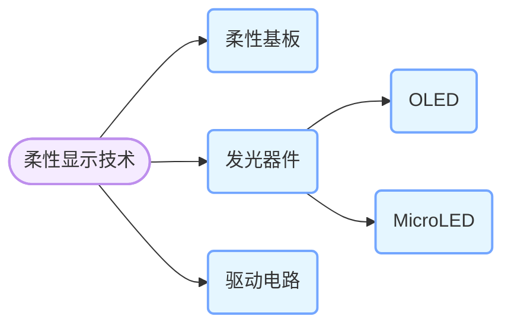

# 价值投资中的下一代柔性显示技术前景

> 关键词：价值投资、下一代柔性显示技术、OLED、MicroLED、市场前景

> 摘要：本文聚焦于价值投资视角下的下一代柔性显示技术前景。首先介绍了价值投资与柔性显示技术的背景信息，包括目的、预期读者、文档结构和相关术语。接着阐述了柔性显示技术的核心概念、原理和架构，通过Mermaid流程图进行直观展示。详细讲解了相关核心算法原理及操作步骤，结合Python代码说明。同时给出了数学模型和公式，并举例分析。通过项目实战案例，包括开发环境搭建、代码实现与解读，深入剖析技术应用。探讨了该技术在多个领域的实际应用场景，推荐了学习资源、开发工具框架和相关论文著作。最后总结了未来发展趋势与挑战，解答常见问题，并提供扩展阅读与参考资料，为价值投资者全面了解下一代柔性显示技术提供了深入且专业的分析。

## 1. 背景介绍 
### 1.1 目的和范围
本文章的目的在于从价值投资的角度深入探讨下一代柔性显示技术的前景。通过对柔性显示技术的核心概念、算法原理、数学模型等方面的详细分析，结合实际应用案例和市场情况，为价值投资者提供全面、专业的参考，帮助他们评估该技术在投资领域的潜力和风险。范围涵盖了主流的下一代柔性显示技术，如OLED（有机发光二极管）、MicroLED等，以及相关的技术发展趋势、市场应用场景和投资机会。

### 1.2 预期读者
预期读者主要包括对价值投资感兴趣的投资者，他们希望通过了解新兴技术的发展前景来寻找有潜力的投资项目。同时，也适合从事显示技术相关行业的从业者，如工程师、技术研发人员等，他们可以通过本文了解行业的最新动态和发展趋势。此外，高校相关专业的学生和研究人员也可以将本文作为学习和研究的参考资料。

### 1.3 文档结构概述
本文将按照以下结构进行阐述：首先介绍背景信息，包括目的、预期读者、文档结构和术语表。接着深入讲解下一代柔性显示技术的核心概念与联系，通过文本示意图和Mermaid流程图展示其原理和架构。然后详细说明核心算法原理和具体操作步骤，结合Python代码进行解释。随后给出数学模型和公式，并举例说明。通过项目实战案例，包括开发环境搭建、源代码实现和代码解读，进一步加深对技术的理解。探讨该技术在实际中的应用场景，推荐学习资源、开发工具框架和相关论文著作。最后总结未来发展趋势与挑战，解答常见问题，并提供扩展阅读与参考资料。

### 1.4 术语表
#### 1.4.1 核心术语定义
- **价值投资**：一种投资策略，通过对资产的内在价值进行评估，寻找被低估的资产进行投资，以获取长期的投资回报。
- **下一代柔性显示技术**：指具有可弯曲、可折叠等特性的显示技术，相较于传统显示技术，具有更高的灵活性和适应性，主要包括OLED、MicroLED等技术。
- **OLED（有机发光二极管）**：一种基于有机材料的发光二极管，具有自发光、视角广、对比度高、响应速度快等优点，可实现柔性显示。
- **MicroLED**：由微小的发光二极管组成的显示技术，具有高亮度、高对比度、低功耗等特点，是下一代显示技术的重要发展方向。

#### 1.4.2 相关概念解释
- **柔性基板**：用于支撑柔性显示器件的基底材料，通常具有良好的柔韧性和耐弯折性，如聚酰亚胺（PI）等。
- **驱动电路**：为显示器件提供电力和信号控制的电路系统，确保显示器件能够正常工作。
- **像素**：显示屏幕上的最小显示单元，多个像素组合形成图像。

#### 1.4.3 缩略词列表
- **OLED**：Organic Light-Emitting Diode（有机发光二极管）
- **MicroLED**：Micro Light-Emitting Diode（微型发光二极管）
- **PI**：Polyimide（聚酰亚胺）

## 2. 核心概念与联系 

### 2.1 下一代柔性显示技术的核心概念
下一代柔性显示技术的核心在于实现显示屏幕的可弯曲、可折叠特性，打破传统显示屏幕的刚性限制。这主要依赖于柔性基板材料和新型发光器件的应用。

柔性基板材料如聚酰亚胺（PI），具有良好的柔韧性和耐弯折性，能够承受多次弯曲和折叠而不损坏。新型发光器件主要包括OLED和MicroLED。

OLED是基于有机材料的发光二极管，其原理是在电场的作用下，有机材料中的电子和空穴复合发光。OLED具有自发光的特性，不需要背光源，因此可以实现更薄、更轻的显示屏幕，同时具有视角广、对比度高、响应速度快等优点。

MicroLED则是由微小的发光二极管组成，每个发光二极管可以独立发光。MicroLED具有高亮度、高对比度、低功耗等特点，并且可以实现更高的像素密度，提供更清晰、更鲜艳的图像显示。

### 2.2 核心概念的架构关系
下面是下一代柔性显示技术核心概念的架构文本示意图：

柔性显示技术
|-- 柔性基板（如PI）
|-- 发光器件
    |-- OLED
    |-- MicroLED
|-- 驱动电路

该架构表明，柔性基板为发光器件和驱动电路提供支撑，发光器件负责实现图像显示，驱动电路则为发光器件提供电力和信号控制，三者相互协作，共同实现柔性显示的功能。

### 2.3 Mermaid流程图


该流程图直观地展示了下一代柔性显示技术的核心组成部分及其关系。柔性显示技术由柔性基板、发光器件和驱动电路组成，发光器件又分为OLED和MicroLED。

## 3. 核心算法原理 & 具体操作步骤 

### 3.1 OLED驱动算法原理
OLED的驱动算法主要涉及到如何根据输入的图像信号，精确地控制每个像素的发光强度和颜色。一种常见的驱动算法是脉冲宽度调制（PWM）。

PWM的基本原理是通过控制脉冲信号的宽度来调节平均电压，从而实现对OLED像素发光强度的控制。具体来说，对于一个给定的图像像素值，将其转换为一个脉冲信号，脉冲信号的宽度与像素值成正比。在一个周期内，脉冲信号的高电平时间越长，OLED像素的平均电压就越高，发光强度也就越大。

以下是一个简单的Python代码示例，用于实现基于PWM的OLED像素驱动：

```python
# 定义PWM函数
def pwm(pixel_value, period):
    """
    pixel_value: 像素值，范围为0-255
    period: PWM周期
    """
    duty_cycle = (pixel_value / 255) * period  # 计算占空比
    return duty_cycle

# 示例：假设像素值为128，PWM周期为100
pixel_value = 128
period = 100
duty_cycle = pwm(pixel_value, period)
print(f"像素值为 {pixel_value} 时的PWM占空比为: {duty_cycle}")
```

### 3.2 具体操作步骤
1. **图像信号处理**：首先，将输入的图像信号进行处理，将其转换为适合OLED驱动的格式。这可能包括颜色空间转换、亮度调整等操作。
2. **像素值映射**：将处理后的图像信号中的每个像素值映射到PWM的占空比上。根据PWM函数，计算每个像素对应的占空比。
3. **驱动信号生成**：根据计算得到的占空比，生成相应的脉冲信号。这些脉冲信号将作为驱动信号发送到OLED的驱动电路中。
4. **像素发光控制**：驱动电路根据接收到的脉冲信号，控制每个OLED像素的发光强度和颜色，从而实现图像的显示。

### 3.3 MicroLED转移算法原理
MicroLED的制造过程中，一个关键步骤是将微小的发光二极管从生长基板转移到显示基板上。常见的转移算法有巨量转移技术。

巨量转移技术的原理是通过精确的定位和吸附机制，同时将大量的MicroLED从生长基板转移到显示基板上。一种实现方式是利用弹性印章，通过控制印章的压力和吸附力，将MicroLED从生长基板上拾取并转移到显示基板的指定位置。

以下是一个简化的Python代码示例，模拟MicroLED的转移过程：

```python
import random

# 定义MicroLED转移函数
def microled_transfer(num_leds, success_rate):
    """
    num_leds: 要转移的MicroLED数量
    success_rate: 转移成功率，范围为0-1
    """
    transferred_leds = 0
    for _ in range(num_leds):
        if random.random() < success_rate:
            transferred_leds += 1
    return transferred_leds

# 示例：假设要转移1000个MicroLED，转移成功率为0.9
num_leds = 1000
success_rate = 0.9
transferred_leds = microled_transfer(num_leds, success_rate)
print(f"成功转移的MicroLED数量为: {transferred_leds}")
```

### 3.4 转移操作步骤
1. **生长基板准备**：在生长基板上生长出大量的MicroLED。
2. **转移工具准备**：准备好转移工具，如弹性印章，并进行清洁和校准。
3. **拾取操作**：将转移工具与生长基板接触，通过控制吸附力，将MicroLED从生长基板上拾取。
4. **转移操作**：将拾取了MicroLED的转移工具移动到显示基板上，通过控制压力和吸附力的释放，将MicroLED转移到显示基板的指定位置。
5. **检测和修复**：对转移后的MicroLED进行检测，对于未成功转移或损坏的MicroLED进行修复或重新转移。

## 4. 数学模型和公式 & 详细讲解 & 举例说明 

### 4.1 OLED亮度与电流关系模型
OLED的亮度 $L$ 与通过它的电流 $I$ 之间存在一定的关系，通常可以用以下公式表示：

$$L = kI^{\gamma}$$

其中，$k$ 是一个与OLED材料和结构相关的常数，$\gamma$ 是电流指数，通常在1.5 - 2.5之间。

#### 详细讲解
这个公式描述了OLED亮度与电流之间的非线性关系。当电流较小时，亮度随着电流的增加而缓慢增加；当电流较大时，亮度随着电流的增加而快速增加。常数 $k$ 反映了OLED的发光效率，不同的OLED材料和结构可能具有不同的 $k$ 值。电流指数 $\gamma$ 则影响了亮度随电流变化的速率。

#### 举例说明
假设一个OLED的 $k = 10$，$\gamma = 2$，当通过它的电流 $I = 10$ mA时，根据公式可以计算出其亮度：

$$L = 10\times(10)^{2} = 1000 \text{ cd/m}^2$$

### 4.2 MicroLED转移成功率模型
在MicroLED的巨量转移过程中，转移成功率 $P$ 可以用以下公式表示：

$$P = e^{-\lambda N}$$

其中，$\lambda$ 是一个与转移工艺和MicroLED特性相关的常数，$N$ 是每次转移的MicroLED数量。

#### 详细讲解
这个公式表明，随着每次转移的MicroLED数量 $N$ 的增加，转移成功率 $P$ 会呈指数下降。常数 $\lambda$ 反映了转移工艺的难度和MicroLED的特性，$\lambda$ 值越大，转移成功率下降得越快。

#### 举例说明
假设 $\lambda = 0.001$，当每次转移的MicroLED数量 $N = 1000$ 时，根据公式可以计算出转移成功率：

$$P = e^{-0.001\times1000} = e^{-1} \approx 0.368$$

即转移成功率约为36.8%。

### 4.3 显示分辨率与像素密度关系模型
显示屏幕的分辨率 $R$ 与像素密度 $D$ 之间的关系可以用以下公式表示：

$$R = D\times S$$

其中，$S$ 是显示屏幕的尺寸（以英寸为单位）。

#### 详细讲解
这个公式表明，显示屏幕的分辨率等于像素密度乘以屏幕尺寸。像素密度越高，在相同屏幕尺寸下，显示的分辨率就越高，图像就越清晰。

#### 举例说明
假设一个显示屏幕的像素密度 $D = 300$ PPI（每英寸像素数），屏幕尺寸 $S = 6$ 英寸，根据公式可以计算出其分辨率：

$$R = 300\times6 = 1800 \text{ 像素}$$

## 5. 项目实战：代码实际案例和详细解释说明 

### 5.1  开发环境搭建
#### 硬件环境
- **开发板**：选择一款适合OLED或MicroLED开发的开发板，如Arduino、Raspberry Pi等。这里以Arduino为例，Arduino具有简单易用、开源的特点，适合初学者进行开发。
- **OLED或MicroLED显示屏**：根据项目需求选择合适的显示屏，如128x64的OLED显示屏。
- **面包板和杜邦线**：用于连接开发板和显示屏。

#### 软件环境
- **Arduino IDE**：用于编写、上传和调试Arduino代码。可以从Arduino官方网站下载安装。
- **相关库文件**：根据使用的显示屏型号，安装相应的库文件。例如，如果使用的是128x64的OLED显示屏，可以安装U8g2库。

### 5.2  源代码详细实现和代码解读
以下是一个使用Arduino和U8g2库驱动128x64 OLED显示屏显示文本的示例代码：

```cpp
#include <U8g2lib.h>

// 定义OLED显示屏的连接方式和型号
U8g2_SSD1306_128X64_NONAME_F_SW_I2C u8g2(U8G2_R0, /* clock=*/ SCL, /* data=*/ SDA, /* reset=*/ U8X8_PIN_NONE);

void setup() {
  // 初始化OLED显示屏
  u8g2.begin();
}

void loop() {
  // 清空屏幕缓冲区
  u8g2.firstPage();
  do {
    // 设置字体
    u8g2.setFont(u8g2_font_ncenB08_tr);
    // 在屏幕上显示文本
    u8g2.drawStr(0, 20, "Hello, World!");
  } while ( u8g2.nextPage() );

  // 延时一段时间
  delay(1000);
}
```

#### 代码解读
1. **头文件包含**：`#include <U8g2lib.h>` 包含了U8g2库的头文件，用于驱动OLED显示屏。
2. **显示屏对象定义**：`U8g2_SSD1306_128X64_NONAME_F_SW_I2C u8g2(U8G2_R0, /* clock=*/ SCL, /* data=*/ SDA, /* reset=*/ U8X8_PIN_NONE);` 定义了一个U8g2对象 `u8g2`，并指定了显示屏的型号和连接方式。
3. **`setup()` 函数**：`u8g2.begin();` 初始化OLED显示屏，确保显示屏可以正常工作。
4. **`loop()` 函数**：
    - `u8g2.firstPage();` 和 `u8g2.nextPage()` 用于清空屏幕缓冲区并循环显示页面。
    - `u8g2.setFont(u8g2_font_ncenB08_tr);` 设置显示文本的字体。
    - `u8g2.drawStr(0, 20, "Hello, World!");` 在屏幕上坐标为(0, 20)的位置显示文本 "Hello, World!"。
    - `delay(1000);` 延时1秒，控制文本显示的时间间隔。

### 5.3  代码解读与分析
通过上述代码，我们可以看到使用Arduino和U8g2库驱动OLED显示屏的基本步骤。首先，需要包含相应的库文件并定义显示屏对象。然后，在 `setup()` 函数中初始化显示屏。在 `loop()` 函数中，通过循环显示页面的方式，设置字体并在屏幕上显示文本。

这种方式的优点是简单易用，适合初学者快速上手。但也存在一些局限性，例如显示内容相对简单，对于复杂的图形和动画显示可能需要更高级的库和算法。

## 6. 实际应用场景 
### 6.1 消费电子领域
- **智能手机**：下一代柔性显示技术可以使智能手机实现可折叠、可弯曲的屏幕设计。例如，三星和华为已经推出了折叠屏手机，用户可以将手机屏幕展开成平板电脑大小，提供更大的显示面积，满足不同的使用需求。
- **智能手表**：柔性显示屏可以更好地贴合手腕的形状，提供更舒适的佩戴体验。同时，柔性显示技术还可以实现可卷曲的屏幕设计，增加智能手表的显示功能。
- **平板电脑**：可折叠的平板电脑可以在便携性和大屏显示之间取得更好的平衡。用户可以根据需要将平板电脑折叠起来，方便携带；展开后则可以获得更大的显示面积，进行多任务处理或观看视频。

### 6.2 汽车领域
- **车载仪表盘**：柔性显示技术可以使车载仪表盘的设计更加灵活多样。制造商可以根据不同车型的需求，定制仪表盘的形状和显示内容，提供更加个性化的驾驶体验。
- **中控显示屏**：可弯曲的中控显示屏可以更好地适应汽车内部的空间布局，减少视觉盲区。同时，柔性显示屏的高对比度和广视角特性可以提供更清晰、更舒适的显示效果。
- **抬头显示（HUD）**：柔性显示技术可以用于开发更加先进的抬头显示系统。通过将图像投影到挡风玻璃上，驾驶员可以在不转移视线的情况下获取重要的驾驶信息，提高驾驶安全性。

### 6.3 医疗领域
- **可穿戴医疗设备**：柔性显示屏可以应用于可穿戴医疗设备，如智能手环、智能背心等。这些设备可以实时监测患者的生命体征，并将数据显示在柔性屏幕上，方便医护人员和患者随时查看。
- **医疗影像显示**：在医疗影像领域，柔性显示技术可以提供更灵活的显示解决方案。例如，可弯曲的显示屏可以更好地适应不同的检查场景，提高图像的显示效果。
- **手术导航系统**：柔性显示屏可以用于手术导航系统，医生可以通过可弯曲的屏幕更直观地查看患者的解剖结构和手术路径，提高手术的准确性和安全性。

### 6.4 智能家居领域
- **智能镜子**：柔性显示技术可以使智能镜子具备更多的功能。例如，在镜子表面集成显示屏，用户可以在照镜子的同时查看天气、新闻、日历等信息。
- **智能窗帘**：可弯曲的显示屏可以应用于智能窗帘，用户可以通过控制窗帘上的显示屏，显示不同的图案和颜色，实现个性化的装饰效果。
- **智能家电**：在智能冰箱、智能洗衣机等家电产品上应用柔性显示屏，可以方便用户查看设备的运行状态、设置参数等信息，提高用户的使用体验。

## 7. 工具和资源推荐
### 7.1 学习资源推荐
#### 7.1.1 书籍推荐
- 《柔性显示技术》：这本书系统地介绍了柔性显示技术的原理、制造工艺和应用领域，是学习柔性显示技术的经典教材。
- 《有机发光二极管显示技术》：详细讲解了OLED的原理、材料、器件结构和驱动技术，对于深入了解OLED技术具有重要的参考价值。
- 《MicroLED显示技术》：专注于MicroLED技术的发展现状、关键技术和应用前景，适合对MicroLED技术感兴趣的读者阅读。

#### 7.1.2 在线课程
- Coursera上的“显示技术基础”课程：由知名高校的教授授课，涵盖了显示技术的基本原理、发展历程和最新进展。
- edX上的“柔性电子技术”课程：介绍了柔性电子技术的基本概念、材料和制造工艺，以及在显示、传感器等领域的应用。
- 中国大学MOOC上的“平板显示技术”课程：结合实际案例，讲解了平板显示技术的原理、设计和制造方法，适合初学者学习。

#### 7.1.3 技术博客和网站
- Display Daily：提供显示技术领域的最新新闻、技术分析和市场研究报告，是了解显示技术行业动态的重要渠道。
- OLED-Info：专注于OLED技术的信息平台，包含了OLED技术的发展趋势、产品应用和市场前景等方面的内容。
- MicroLED-Info：专门介绍MicroLED技术的网站，提供MicroLED技术的最新研究成果、产业动态和应用案例。

### 7.2 开发工具框架推荐
#### 7.2.1 IDE和编辑器
- Arduino IDE：简单易用，适合初学者进行Arduino开发，支持多种编程语言和硬件平台。
- Visual Studio Code：功能强大的代码编辑器，支持多种编程语言和插件扩展，可以用于开发各种显示应用程序。
- PyCharm：专业的Python集成开发环境，适合进行Python代码的编写、调试和优化。

#### 7.2.2 调试和性能分析工具
- Logic Analyzer：用于分析数字电路中的信号波形，帮助调试显示驱动电路和信号传输问题。
- Oscilloscope：可以实时监测电信号的变化，用于检测显示屏幕的电压、电流等参数，分析显示故障的原因。
- Profiler：用于分析程序的性能，找出程序中的瓶颈和优化点，提高显示应用程序的运行效率。

#### 7.2.3 相关框架和库
- U8g2库：用于驱动各种OLED和LCD显示屏的开源库，支持多种显示屏型号和接口方式，具有简单易用、功能丰富的特点。
- Adafruit GFX库：提供了一系列图形绘制函数，可用于在显示屏上绘制图形、文字和动画，方便开发显示应用程序。
- MicroPython：一种精简的Python解释器，可在微控制器上运行，提供了丰富的库和工具，适合快速开发显示应用。

### 7.3 相关论文著作推荐
#### 7.3.1 经典论文
- “Highly Efficient Organic Light-Emitting Diodes from Delayed Fluorescence”：该论文介绍了一种基于延迟荧光的高效OLED技术，为OLED的发展提供了新的思路和方法。
- “Micro-LED Display: An Emerging Display Technology”：系统地阐述了MicroLED显示技术的原理、关键技术和应用前景，是MicroLED领域的经典论文之一。
- “Flexible and Stretchable Electronics for Bio-integrated Devices”：探讨了柔性和可拉伸电子技术在生物集成设备中的应用，为柔性显示技术在医疗领域的应用提供了理论基础。

#### 7.3.2 最新研究成果
- 在IEEE Transactions on Electron Devices、Nature Photonics等顶级学术期刊上，经常发表关于下一代柔性显示技术的最新研究成果。这些研究涵盖了材料科学、器件物理、制造工艺等多个方面，反映了该领域的前沿动态。
- 国际显示周（SID Display Week）等行业会议上的论文和报告，也展示了下一代柔性显示技术的最新研究进展和应用案例。

#### 7.3.3 应用案例分析
- 各大科技公司的技术报告和白皮书，如三星、苹果、华为等公司发布的关于柔性显示产品的技术文档，包含了实际应用案例和技术细节分析。
- 行业研究机构的市场报告，如IHS Markit、DSCC等发布的显示技术市场研究报告，对下一代柔性显示技术的市场应用情况进行了深入分析和预测。

## 8. 总结：未来发展趋势与挑战
### 8.1 未来发展趋势
- **更高的性能指标**：下一代柔性显示技术将朝着更高的分辨率、更高的亮度、更高的对比度和更广的色域等方向发展。例如，MicroLED技术有望实现更高的像素密度和更低的功耗，提供更加清晰、鲜艳的图像显示效果。
- **更多的功能集成**：柔性显示屏将不仅仅局限于显示功能，还将集成更多的传感器和交互技术。例如，在柔性屏幕上集成指纹识别、压力感应等功能，实现更加智能化的交互体验。
- **更广泛的应用场景**：随着技术的不断进步，下一代柔性显示技术将在更多的领域得到应用。除了消费电子、汽车、医疗和智能家居等领域，还将拓展到航空航天、军事等领域。
- **可穿戴化和便携化**：柔性显示技术的可弯曲、可折叠特性将使得显示设备更加便于携带和穿戴。未来，可能会出现更多的可穿戴显示设备，如智能眼镜、智能服装等。

### 8.2 挑战
- **技术难题**：虽然下一代柔性显示技术已经取得了很大的进展，但仍然面临一些技术难题。例如，MicroLED的巨量转移技术还不够成熟，导致生产效率低下和成本较高；OLED的寿命和稳定性问题仍然需要进一步解决。
- **成本问题**：目前，下一代柔性显示技术的生产成本较高，限制了其大规模应用。降低生产成本是推动该技术发展的关键。这需要通过改进制造工艺、提高生产效率和降低原材料成本等方式来实现。
- **标准和规范**：随着下一代柔性显示技术的发展，相关的标准和规范还不够完善。缺乏统一的标准和规范会导致市场混乱，影响技术的推广和应用。因此，需要加快制定相关的标准和规范，促进产业的健康发展。
- **竞争压力**：下一代柔性显示技术市场竞争激烈，各大科技公司都在加大研发投入，争夺市场份额。这对企业的技术创新能力和市场竞争力提出了更高的要求。

## 9. 附录：常见问题与解答
### 9.1 下一代柔性显示技术与传统显示技术相比有哪些优势？
下一代柔性显示技术具有可弯曲、可折叠的特性，打破了传统显示技术的刚性限制。与传统显示技术相比，它具有更薄、更轻、更灵活的优点，可以实现更多样化的设计和应用场景。同时，柔性显示技术还具有更高的对比度、更广的视角和更快的响应速度，提供更好的显示效果。

### 9.2 OLED和MicroLED技术各有什么优缺点？
#### OLED优点
- 自发光，不需要背光源，可实现更薄、更轻的显示屏幕。
- 视角广，对比度高，响应速度快，显示效果好。
- 可实现柔性显示，适用于可弯曲、可折叠的屏幕设计。

#### OLED缺点
- 寿命相对较短，尤其是蓝色OLED的寿命问题较为突出。
- 容易出现烧屏现象，即在长时间显示固定图像后，屏幕会留下残影。
- 亮度相对较低，在强光环境下显示效果可能受到影响。

#### MicroLED优点
- 高亮度、高对比度、低功耗，显示效果优秀。
- 寿命长，稳定性好，不易出现烧屏现象。
- 可以实现更高的像素密度，提供更清晰的图像显示。

#### MicroLED缺点
- 制造工艺复杂，尤其是巨量转移技术还不够成熟，导致生产效率低下和成本较高。
- 技术门槛高，目前只有少数企业掌握核心技术。

### 9.3 下一代柔性显示技术的市场前景如何？
下一代柔性显示技术具有广阔的市场前景。随着消费者对显示设备的要求越来越高，对可弯曲、可折叠显示设备的需求也在不断增加。在消费电子、汽车、医疗、智能家居等领域，柔性显示技术都有着巨大的应用潜力。预计未来几年，下一代柔性显示技术的市场规模将持续增长。

### 9.4 投资下一代柔性显示技术需要注意哪些风险？
投资下一代柔性显示技术需要注意以下风险：
- **技术风险**：该技术仍处于发展阶段，存在技术难题和不确定性。如果技术研发失败或进展缓慢，可能会影响投资回报。
- **市场风险**：市场需求和竞争情况难以准确预测。如果市场需求不足或竞争过于激烈，可能会导致产品销售不畅，影响企业的盈利能力。
- **成本风险**：目前该技术的生产成本较高，如果无法有效降低成本，可能会影响产品的市场竞争力和企业的利润空间。
- **政策风险**：相关政策的变化可能会对该技术的发展产生影响。例如，政府对环保、知识产权等方面的政策调整，可能会增加企业的运营成本和法律风险。

## 10. 扩展阅读 & 参考资料
### 扩展阅读
- 《柔性电子学：材料、器件与应用》：深入介绍了柔性电子学的各个方面，包括材料、器件制造和应用领域，对于理解下一代柔性显示技术的基础具有重要的参考价值。
- 《显示技术前沿》：关注显示技术的最新前沿动态，涵盖了量子点显示、MiniLED等多种显示技术，有助于拓宽对显示技术领域的视野。
- 《电子材料与器件》：介绍了电子材料的性能、制备方法和应用，对于了解下一代柔性显示技术中涉及的材料原理和特性有很大帮助。

### 参考资料
- 各大科技公司的官方网站，如三星、苹果、华为等公司的网站，可获取关于柔性显示产品的最新信息和技术资料。
- 行业研究机构的报告，如IHS Markit、DSCC、Omdia等发布的显示技术市场研究报告，提供了市场数据、趋势分析和竞争格局等方面的信息。
- 学术数据库，如IEEE Xplore、ACM Digital Library、ScienceDirect等，可查阅关于下一代柔性显示技术的学术论文和研究成果。
- 专利数据库，如中国国家知识产权局专利数据库、美国专利商标局数据库等，可获取关于柔性显示技术的专利信息，了解技术创新的方向和趋势。