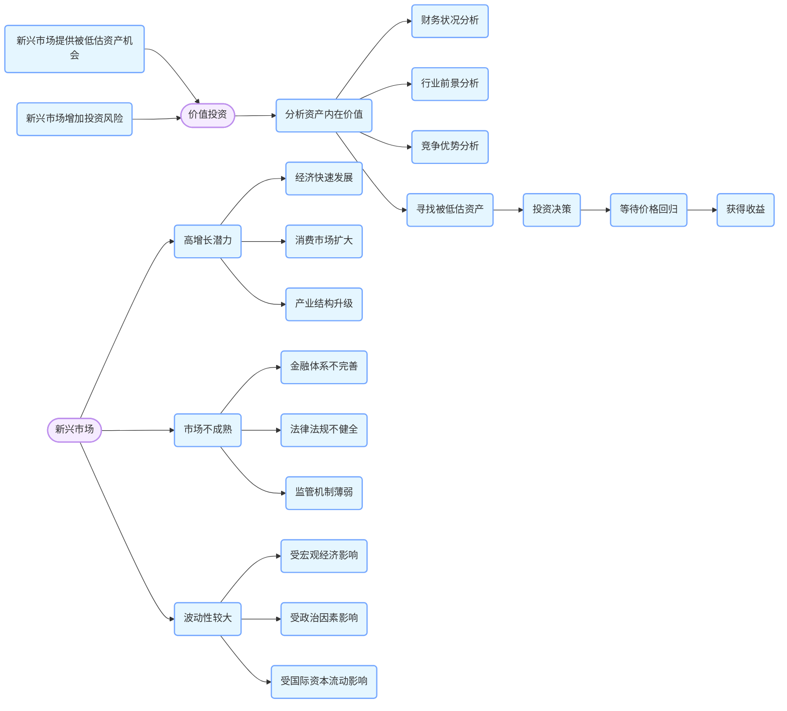

# 价值投资中的新兴市场机遇与风险

> 关键词：价值投资、新兴市场、机遇、风险、投资策略

> 摘要：本文聚焦于价值投资领域，深入探讨新兴市场所蕴含的机遇与面临的风险。通过对新兴市场的背景介绍，阐述核心概念及相互联系，剖析相关算法原理和数学模型，结合实际项目案例进行分析。同时，介绍新兴市场在价值投资中的实际应用场景，推荐学习资源、开发工具框架和相关论文著作。最后总结新兴市场在价值投资中的未来发展趋势与挑战，并对常见问题进行解答，为投资者在新兴市场进行价值投资提供全面的参考和指导。

## 1. 背景介绍 
### 1.1 目的和范围
本文章的主要目的是全面深入地分析价值投资在新兴市场中的机遇与风险。旨在帮助投资者更好地理解新兴市场的特点和潜力，掌握在新兴市场进行价值投资的方法和策略，同时清晰认识到可能面临的风险，从而做出更为明智的投资决策。范围涵盖新兴市场的各个方面，包括经济、政治、社会等因素对价值投资的影响，以及不同行业和领域在新兴市场的投资机会和风险特征。

### 1.2 预期读者
预期读者主要包括对价值投资感兴趣的个人投资者，他们希望通过了解新兴市场的情况来拓宽投资视野，寻找新的投资机会；专业的投资机构人员，如基金经理、分析师等，他们需要深入研究新兴市场，为机构的投资组合提供有价值的建议；以及相关领域的学者和研究人员，他们关注新兴市场的发展动态和价值投资理论的实践应用。

### 1.3 文档结构概述
本文将按照以下结构进行阐述：首先介绍新兴市场的核心概念以及与价值投资的联系，包括原理和架构的文本示意图和 Mermaid 流程图；接着讲解核心算法原理和具体操作步骤，并使用 Python 源代码进行详细说明；然后介绍相关的数学模型和公式，并通过具体例子进行讲解；之后通过项目实战案例，展示在新兴市场进行价值投资的代码实现和详细解读；再探讨新兴市场在价值投资中的实际应用场景；推荐学习资源、开发工具框架和相关论文著作；最后总结新兴市场在价值投资中的未来发展趋势与挑战，解答常见问题，并提供扩展阅读和参考资料。

### 1.4 术语表
#### 1.4.1 核心术语定义
- **价值投资**：一种投资策略，投资者通过分析股票、债券等资产的内在价值，寻找被市场低估的资产进行投资，期望在资产价格回归其内在价值时获得收益。
- **新兴市场**：指那些经济发展较快、市场潜力较大，但市场机制和金融体系相对不够成熟的国家和地区的金融市场。

#### 1.4.2 相关概念解释
- **市场有效性**：指市场价格能够充分反映所有可用信息的程度。在有效市场中，资产价格能够迅速调整以反映新的信息，因此难以通过分析信息来获得超额收益。新兴市场通常被认为市场有效性较低，存在更多的投资机会。
- **宏观经济因素**：包括国内生产总值（GDP）增长率、通货膨胀率、利率、汇率等，这些因素会对新兴市场的经济发展和金融市场产生重要影响。

#### 1.4.3 缩略词列表
- **GDP**：国内生产总值（Gross Domestic Product）
- **PE**：市盈率（Price - Earnings Ratio）
- **PB**：市净率（Price - Book Ratio）

## 2. 核心概念与联系 

### 2.1 价值投资的核心原理
价值投资的核心原理基于资产的内在价值。资产的内在价值是指其未来预期现金流的现值。投资者通过对公司的财务状况、行业前景、竞争优势等因素进行分析，估算出资产的内在价值。如果市场价格低于内在价值，投资者认为该资产被低估，从而进行投资，等待市场价格回归内在价值以获取收益。

### 2.2 新兴市场的特点
新兴市场具有以下特点：
- **高增长潜力**：新兴市场国家通常处于经济快速发展阶段，GDP 增长率较高，消费市场不断扩大，产业结构不断升级，为企业提供了良好的发展环境。
- **市场不成熟**：新兴市场的金融体系、法律法规、监管机制等相对不够完善，市场透明度较低，信息不对称问题较为严重。
- **波动性较大**：由于新兴市场受宏观经济因素、政治因素、国际资本流动等影响较大，市场价格波动较为剧烈。

### 2.3 价值投资与新兴市场的联系
新兴市场的特点为价值投资提供了机遇。由于市场不成熟和信息不对称，新兴市场中更容易出现被低估的资产。价值投资者可以通过深入研究和分析，发现这些被低估的资产，从而获得超额收益。然而，新兴市场的高波动性和不确定性也增加了价值投资的风险。

### 2.4 文本示意图
```plaintext
价值投资
|
|-- 分析资产内在价值
|   |-- 财务状况分析
|   |-- 行业前景分析
|   |-- 竞争优势分析
|
|-- 寻找被低估资产
|
|-- 投资决策
|
|-- 等待价格回归
|
|-- 获得收益

新兴市场
|
|-- 高增长潜力
|   |-- 经济快速发展
|   |-- 消费市场扩大
|   |-- 产业结构升级
|
|-- 市场不成熟
|   |-- 金融体系不完善
|   |-- 法律法规不健全
|   |-- 监管机制薄弱
|
|-- 波动性较大
|   |-- 受宏观经济影响
|   |-- 受政治因素影响
|   |-- 受国际资本流动影响

价值投资与新兴市场的联系
|
|-- 新兴市场提供被低估资产机会
|
|-- 新兴市场增加投资风险
```

### 2.5 Mermaid 流程图


## 3. 核心算法原理 & 具体操作步骤 

### 3.1 核心算法原理
在价值投资中，常用的算法原理是通过计算资产的内在价值来判断其是否被低估。一种常见的方法是使用现金流折现模型（DCF）。该模型的基本思想是将资产未来的预期现金流按照一定的折现率折现到当前时刻，得到资产的内在价值。

### 3.2 Python 代码实现现金流折现模型
```python
def dcf_valuation(cash_flows, discount_rate):
    """
    计算现金流折现模型的内在价值
    :param cash_flows: 未来各期的现金流列表
    :param discount_rate: 折现率
    :return: 资产的内在价值
    """
    present_value = 0
    for i, cash_flow in enumerate(cash_flows):
        present_value += cash_flow / ((1 + discount_rate) ** (i + 1))
    return present_value

# 示例
cash_flows = [100, 120, 150, 180, 200]
discount_rate = 0.1

intrinsic_value = dcf_valuation(cash_flows, discount_rate)
print(f"资产的内在价值为: {intrinsic_value}")
```

### 3.3 具体操作步骤
1. **确定未来现金流**：通过对公司的财务报表、行业前景等进行分析，预测公司未来各期的现金流。这需要考虑公司的营业收入、成本、利润率等因素。
2. **确定折现率**：折现率反映了投资者对投资风险的预期。一般可以使用资本资产定价模型（CAPM）来确定折现率。
3. **计算内在价值**：使用现金流折现模型，将未来各期的现金流按照折现率折现到当前时刻，得到资产的内在价值。
4. **比较内在价值和市场价格**：如果内在价值大于市场价格，说明资产被低估，可以考虑投资；反之，则不建议投资。

## 4. 数学模型和公式 & 详细讲解 & 举例说明 

### 4.1 现金流折现模型（DCF）
现金流折现模型的数学公式为：
$$V = \sum_{t = 1}^{n} \frac{CF_t}{(1 + r)^t}$$
其中，$V$ 表示资产的内在价值，$CF_t$ 表示第 $t$ 期的现金流，$r$ 表示折现率，$n$ 表示现金流的期数。

### 4.2 详细讲解
该公式的含义是将未来各期的现金流按照折现率 $r$ 折现到当前时刻，然后将所有折现后的现金流相加，得到资产的内在价值。折现率 $r$ 反映了资金的时间价值和投资风险。时间越远的现金流，其折现后的价值越低。

### 4.3 举例说明
假设一家公司未来 5 年的预期现金流分别为 100 万元、120 万元、150 万元、180 万元和 200 万元，折现率为 10%。根据现金流折现模型，计算该公司的内在价值：
$$V = \frac{100}{(1 + 0.1)^1} + \frac{120}{(1 + 0.1)^2} + \frac{150}{(1 + 0.1)^3} + \frac{180}{(1 + 0.1)^4} + \frac{200}{(1 + 0.1)^5}$$
```python
cash_flows = [100, 120, 150, 180, 200]
discount_rate = 0.1
intrinsic_value = sum([cash_flow / ((1 + discount_rate) ** (i + 1)) for i, cash_flow in enumerate(cash_flows)])
print(f"公司的内在价值为: {intrinsic_value} 万元")
```
计算结果为该公司的内在价值约为 558.79 万元。如果该公司的市场价格低于 558.79 万元，说明该公司被低估，可以考虑投资。

## 5. 项目实战：代码实际案例和详细解释说明 

### 5.1  开发环境搭建
在进行价值投资的项目实战时，我们可以使用 Python 语言进行开发。以下是搭建开发环境的步骤：
1. **安装 Python**：从 Python 官方网站（https://www.python.org/downloads/）下载并安装适合你操作系统的 Python 版本。建议安装 Python 3.7 及以上版本。
2. **安装开发工具**：可以选择使用 PyCharm、Jupyter Notebook 等开发工具。这里以 Jupyter Notebook 为例，通过以下命令安装：
```bash
pip install jupyter
```
3. **安装必要的库**：在价值投资分析中，我们需要使用一些库，如 Pandas、Numpy 等。可以使用以下命令安装：
```bash
pip install pandas numpy
```

### 5.2  源代码详细实现和代码解读
以下是一个使用 Python 进行价值投资分析的实际案例，我们将分析一家公司的财务数据，计算其市盈率（PE）和市净率（PB），并根据这些指标判断该公司是否被低估。

```python
import pandas as pd

# 读取公司的财务数据
data = {
    '营业收入': [1000, 1200, 1500, 1800, 2000],
    '净利润': [100, 120, 150, 180, 200],
    '净资产': [500, 600, 700, 800, 900],
    '股价': [10, 12, 15, 18, 20]
}
df = pd.DataFrame(data)

# 计算市盈率（PE）
df['PE'] = df['股价'] / (df['净利润'] / 100)  # 假设总股本为 100

# 计算市净率（PB）
df['PB'] = df['股价'] / (df['净资产'] / 100)  # 假设总股本为 100

# 打印结果
print(df)

# 判断公司是否被低估
pe_threshold = 15
pb_threshold = 2

undervalued = (df['PE'] < pe_threshold) & (df['PB'] < pb_threshold)
print(f"公司是否被低估: {undervalued}")
```

### 5.3  代码解读与分析
1. **数据读取**：使用 Pandas 库创建一个包含公司财务数据的 DataFrame。
2. **计算市盈率（PE）**：市盈率是指股票价格与每股收益的比率。通过将股价除以每股收益（净利润除以总股本），得到市盈率。
3. **计算市净率（PB）**：市净率是指股票价格与每股净资产的比率。通过将股价除以每股净资产（净资产除以总股本），得到市净率。
4. **判断公司是否被低估**：设定市盈率和市净率的阈值，当公司的市盈率和市净率都低于阈值时，认为该公司被低估。

## 6. 实际应用场景 
### 6.1 股票投资
在新兴市场的股票投资中，价值投资者可以通过分析公司的基本面，寻找被低估的股票进行投资。例如，在一些新兴市场国家的消费行业，由于经济的快速发展和消费升级，一些具有品牌优势和市场份额的公司可能被低估。价值投资者可以通过研究这些公司的财务报表、行业前景等因素，判断其内在价值，并与市场价格进行比较，从而做出投资决策。

### 6.2 债券投资
新兴市场的债券市场也为价值投资提供了机会。一些新兴市场国家的政府债券或企业债券可能由于市场对其风险的过度担忧而被低估。价值投资者可以通过分析债券的信用风险、利率风险等因素，评估债券的内在价值，寻找被低估的债券进行投资。

### 6.3 房地产投资
在新兴市场的房地产市场，一些城市或地区可能由于基础设施建设的改善、人口流入等因素，房地产价值具有较大的增长潜力。价值投资者可以通过分析房地产的地理位置、市场供需情况、租金回报率等因素，评估房地产的内在价值，寻找被低估的房地产项目进行投资。

## 7. 工具和资源推荐
### 7.1 学习资源推荐
#### 7.1.1 书籍推荐
- 《聪明的投资者》（The Intelligent Investor）：作者是本杰明·格雷厄姆（Benjamin Graham），这本书是价值投资领域的经典之作，详细介绍了价值投资的理念、方法和策略。
- 《证券分析》（Security Analysis）：同样是本杰明·格雷厄姆的著作，对证券分析的基本原理和方法进行了系统阐述，是价值投资者的必读之书。
- 《巴菲特致股东的信》（Letters to Shareholders of Berkshire Hathaway）：由沃伦·巴菲特（Warren Buffett）撰写，书中包含了巴菲特多年来给股东的信，分享了他的投资理念和经验。

#### 7.1.2 在线课程
- Coursera 上的“投资学原理”（Principles of Investing）课程：由知名教授授课，系统介绍了投资学的基本原理和方法，包括价值投资的相关内容。
- Udemy 上的“价值投资实战课程”：结合实际案例，讲解价值投资的分析方法和投资策略。

#### 7.1.3 技术博客和网站
- Seeking Alpha：一个提供股票分析、投资策略和市场评论的网站，有很多关于新兴市场和价值投资的文章。
- ValueWalk：专注于价值投资领域，提供全球范围内的价值投资机会和分析报告。

### 7.2 开发工具框架推荐
#### 7.2.1 IDE和编辑器
- PyCharm：一款专业的 Python 集成开发环境，具有强大的代码编辑、调试和项目管理功能。
- Jupyter Notebook：一种交互式的开发环境，适合进行数据分析和可视化，方便价值投资者进行数据探索和模型验证。

#### 7.2.2 调试和性能分析工具
- PDB：Python 自带的调试器，可以帮助开发者定位代码中的错误。
- cProfile：Python 的性能分析工具，可以分析代码的运行时间和函数调用情况，帮助优化代码性能。

#### 7.2.3 相关框架和库
- Pandas：一个强大的数据处理和分析库，提供了高效的数据结构和数据操作方法，方便价值投资者处理和分析财务数据。
- Numpy：Python 的数值计算库，提供了高性能的数组和矩阵运算功能，常用于金融模型的计算。

### 7.3 相关论文著作推荐
#### 7.3.1 经典论文
- “The Superinvestors of Graham - and - Doddsville”：作者是沃伦·巴菲特，这篇论文通过分析格雷厄姆和多德的投资方法，证明了价值投资的有效性。
- “Efficient Capital Markets: A Review of Theory and Empirical Work”：作者是尤金·法玛（Eugene F. Fama），该论文对有效市场假说进行了系统阐述，对价值投资理论产生了重要影响。

#### 7.3.2 最新研究成果
- 近年来，有很多关于新兴市场价值投资的研究成果发表在《Journal of Finance》《Review of Financial Studies》等顶级金融学术期刊上。这些研究主要关注新兴市场的市场效率、价值投资策略的有效性等问题。

#### 7.3.3 应用案例分析
- 一些金融机构和研究机构会发布关于新兴市场价值投资的应用案例分析报告，如麦肯锡、波士顿咨询集团等。这些报告通过实际案例，分析了在新兴市场进行价值投资的策略和方法，具有较高的参考价值。

## 8. 总结：未来发展趋势与挑战
### 8.1 未来发展趋势
- **新兴市场的崛起**：随着全球经济格局的调整，新兴市场国家的经济实力不断增强，其金融市场也将逐渐成熟。未来，新兴市场将在全球金融市场中扮演越来越重要的角色，为价值投资者提供更多的投资机会。
- **科技驱动的投资机会**：新兴市场国家在科技领域的发展迅速，如人工智能、大数据、区块链等技术在新兴市场的应用不断拓展。价值投资者可以关注这些科技领域的企业，寻找具有潜力的投资标的。
- **绿色投资的兴起**：随着全球对环境保护和可持续发展的关注不断增加，新兴市场国家也在加大对绿色产业的投入。价值投资者可以关注新兴市场的绿色能源、环保等领域的投资机会。

### 8.2 挑战
- **政治和政策风险**：新兴市场国家的政治局势和政策变化较为频繁，可能会对投资产生不利影响。例如，政府的税收政策、监管政策的变化可能会影响企业的盈利能力和市场估值。
- **市场波动风险**：新兴市场的市场波动性较大，投资者可能会面临较大的价格波动风险。此外，新兴市场的流动性相对较差，投资者在买卖资产时可能会面临较高的交易成本。
- **信息不对称风险**：由于新兴市场的市场机制和金融体系相对不够成熟，信息披露不够充分，投资者可能会面临信息不对称的问题。这增加了投资者分析和评估资产价值的难度。

## 9. 附录：常见问题与解答
### 9.1 新兴市场的价值投资与成熟市场的价值投资有什么区别？
新兴市场的价值投资与成熟市场的价值投资存在以下区别：
- **市场有效性**：新兴市场的市场有效性较低，存在更多的信息不对称和价格偏差，因此更容易找到被低估的资产；而成熟市场的市场有效性较高，资产价格更能反映其内在价值。
- **风险特征**：新兴市场的政治、经济和市场环境相对不稳定，投资风险较高；而成熟市场的风险相对较低。
- **行业结构**：新兴市场的行业结构可能不够完善，一些新兴行业可能具有较大的发展潜力；而成熟市场的行业结构相对稳定，传统行业占据主导地位。

### 9.2 如何评估新兴市场的投资风险？
评估新兴市场的投资风险可以从以下几个方面入手：
- **宏观经济因素**：分析新兴市场国家的 GDP 增长率、通货膨胀率、利率、汇率等宏观经济指标，评估其经济稳定性。
- **政治因素**：关注新兴市场国家的政治局势、政策变化等因素，评估政治风险对投资的影响。
- **市场因素**：分析新兴市场的市场流动性、波动性等因素，评估市场风险。
- **企业基本面**：对投资标的的企业进行基本面分析，评估其财务状况、经营业绩、竞争优势等因素，判断企业的风险水平。

### 9.3 在新兴市场进行价值投资需要注意什么？
在新兴市场进行价值投资需要注意以下几点：
- **充分研究**：在投资前，要对新兴市场的政治、经济、文化等环境进行充分研究，了解市场的特点和规律。
- **分散投资**：由于新兴市场的风险较高，建议投资者进行分散投资，降低单一资产的风险。
- **长期投资**：价值投资是一种长期投资策略，在新兴市场进行价值投资需要有耐心，长期持有被低估的资产。
- **关注政策变化**：新兴市场的政策变化较为频繁，投资者要密切关注政策变化，及时调整投资策略。

## 10. 扩展阅读 & 参考资料
### 扩展阅读
- 《新兴市场投资指南》：详细介绍了新兴市场的投资机会和风险，以及在新兴市场进行投资的策略和方法。
- 《金融炼金术》（The Alchemy of Finance）：作者是乔治·索罗斯（George Soros），书中探讨了金融市场的运行规律和投资者的心理因素，对价值投资有一定的启示作用。

### 参考资料
- 各新兴市场国家的金融监管机构发布的统计数据和报告。
- 国际货币基金组织（IMF）、世界银行等国际组织发布的关于新兴市场的研究报告。
- 金融学术期刊上发表的关于新兴市场和价值投资的相关论文。