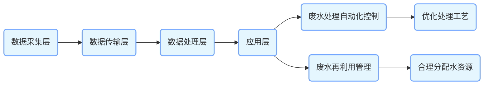

# 价值投资中的智能城市废水处理与再利用系统分析

> 关键词：价值投资、智能城市、废水处理、再利用系统、数据分析、可持续发展

> 摘要：本文聚焦于价值投资视角下的智能城市废水处理与再利用系统。首先阐述该系统在智能城市建设及价值投资领域的背景和重要性，深入剖析其核心概念、算法原理与数学模型。通过项目实战展示系统的具体实现与代码解读，探讨其实际应用场景。同时推荐相关学习资源、开发工具和论文著作。最后总结该系统的未来发展趋势与挑战，并提供常见问题解答和扩展阅读参考资料，旨在为相关领域的研究和实践提供全面且深入的技术分析与指导。

## 1. 背景介绍 
### 1.1 目的和范围
随着全球城市化进程的加速，城市人口不断增长，城市废水排放量也日益增加。传统的废水处理方式已难以满足智能城市发展的需求，而智能城市废水处理与再利用系统应运而生。本文章的目的在于从价值投资的角度，全面分析智能城市废水处理与再利用系统，包括其技术原理、实际应用和发展前景等方面。范围涵盖系统的核心概念、算法原理、数学模型、项目实战以及相关工具资源等多个领域。

### 1.2 预期读者
本文预期读者包括对智能城市建设、废水处理与再利用技术感兴趣的科研人员、工程师、投资者，以及相关专业的学生和从业人员。对于希望了解该领域技术原理和价值投资机会的人士具有重要的参考价值。

### 1.3 文档结构概述
本文首先介绍背景信息，包括目的、预期读者和文档结构。接着阐述核心概念与联系，展示系统的原理和架构。然后详细讲解核心算法原理与具体操作步骤，给出数学模型和公式。通过项目实战呈现代码实际案例和详细解释。探讨实际应用场景，并推荐相关工具和资源。最后总结未来发展趋势与挑战，提供常见问题解答和扩展阅读参考资料。

### 1.4 术语表
#### 1.4.1 核心术语定义
- **智能城市**：指利用信息技术和通信技术手段感测、分析、整合城市运行核心系统的各项关键信息，从而对包括民生、环保、公共安全、城市服务、工商业活动在内的各种需求做出智能响应的城市形态。
- **废水处理**：通过物理、化学和生物等方法，将废水中的污染物分离或转化为无害物质，使废水得到净化的过程。
- **再利用系统**：将经过处理后的废水再次利用的系统，包括用于农业灌溉、工业生产、景观用水等方面。
- **价值投资**：一种基于对资产内在价值的分析，以低于其内在价值的价格买入资产，并长期持有的投资策略。

#### 1.4.2 相关概念解释
- **物联网（IoT）**：通过各种信息传感器、射频识别技术、全球定位系统、红外感应器、激光扫描器等各种装置与技术，实时采集任何需要监控、连接、互动的物体或过程，采集其声、光、热、电、力学、化学、生物、位置等各种需要的信息，通过各类可能的网络接入，实现物与物、物与人的泛在连接，实现对物品和过程的智能化感知、识别和管理。
- **大数据分析**：指对海量数据进行采集、存储、管理、分析和可视化的过程，以发现数据中的模式、趋势和关联，为决策提供支持。

#### 1.4.3 缩略词列表
- **IoT**：Internet of Things（物联网）
- **AI**：Artificial Intelligence（人工智能）
- **ML**：Machine Learning（机器学习）

## 2. 核心概念与联系 
智能城市废水处理与再利用系统是一个复杂的综合系统，涉及多个领域的技术和概念。其核心概念包括物联网、大数据分析、人工智能等，这些技术相互关联，共同实现废水处理与再利用的智能化。

### 核心概念原理和架构的文本示意图
智能城市废水处理与再利用系统主要由数据采集层、数据传输层、数据处理层和应用层组成。
- **数据采集层**：通过各种传感器（如水质传感器、流量传感器等）实时采集废水的各项参数，包括水质指标（如化学需氧量、生化需氧量、悬浮物等）、流量、温度等信息。
- **数据传输层**：将采集到的数据通过有线或无线通信网络（如以太网、Wi-Fi、4G/5G等）传输到数据处理中心。
- **数据处理层**：对传输过来的数据进行存储、清洗、分析和挖掘。利用大数据分析和人工智能技术，建立废水处理模型，预测废水处理效果，优化处理工艺。
- **应用层**：根据数据处理结果，实现废水处理过程的自动化控制，以及废水再利用的合理分配和管理。

### Mermaid 流程图


## 3. 核心算法原理 & 具体操作步骤 
### 核心算法原理
在智能城市废水处理与再利用系统中，常用的算法包括机器学习算法和优化算法。这里以支持向量机（SVM）算法为例，介绍其在废水水质预测中的应用。

支持向量机是一种有监督的机器学习算法，其基本思想是在特征空间中找到一个最优的超平面，使得不同类别的样本能够被最大程度地分开。在废水水质预测中，我们可以将废水的各项参数作为输入特征，将水质类别（如达标、不达标）作为输出标签，通过训练SVM模型来实现水质预测。

### Python源代码详细阐述
```python
import numpy as np
from sklearn import svm
from sklearn.model_selection import train_test_split
from sklearn.metrics import accuracy_score

# 生成示例数据
# 假设我们有100个样本，每个样本有5个特征
X = np.random.rand(100, 5)
# 生成对应的标签，0表示达标，1表示不达标
y = np.random.randint(0, 2, 100)

# 划分训练集和测试集
X_train, X_test, y_train, y_test = train_test_split(X, y, test_size=0.2, random_state=42)

# 创建SVM模型
clf = svm.SVC(kernel='linear')

# 训练模型
clf.fit(X_train, y_train)

# 预测测试集
y_pred = clf.predict(X_test)

# 计算准确率
accuracy = accuracy_score(y_test, y_pred)
print(f"模型准确率: {accuracy}")
```

### 具体操作步骤
1. **数据收集**：收集废水的各项参数数据，包括水质指标、流量、温度等。
2. **数据预处理**：对收集到的数据进行清洗、归一化等处理，以提高模型的训练效果。
3. **特征选择**：选择与水质预测相关的特征，去除冗余特征。
4. **模型训练**：使用训练集数据对SVM模型进行训练。
5. **模型评估**：使用测试集数据对训练好的模型进行评估，计算准确率、召回率等指标。
6. **模型优化**：根据评估结果，调整模型的参数，如核函数、惩罚系数等，以提高模型的性能。
7. **应用部署**：将优化后的模型部署到实际系统中，实现废水水质的实时预测。

## 4. 数学模型和公式 & 详细讲解 & 举例说明 
### 支持向量机的数学模型
支持向量机的目标是找到一个最优的超平面 $w^T x + b = 0$，使得不同类别的样本能够被最大程度地分开。对于线性可分的情况，支持向量机的优化问题可以表示为：

$$
\begin{aligned}
\min_{w, b} &\quad \frac{1}{2} \|w\|^2 \\
\text{s.t.} &\quad y_i (w^T x_i + b) \geq 1, \quad i = 1, 2, \cdots, n
\end{aligned}
$$

其中，$w$ 是超平面的法向量，$b$ 是偏置项，$x_i$ 是第 $i$ 个样本的特征向量，$y_i$ 是第 $i$ 个样本的标签（$y_i \in \{-1, 1\}$），$n$ 是样本的数量。

### 详细讲解
上述优化问题的目标是最小化超平面的法向量的模长 $\|w\|$，同时满足所有样本都在超平面的正确一侧，即 $y_i (w^T x_i + b) \geq 1$。这个约束条件保证了不同类别的样本能够被超平面分开，并且间隔最大。

为了求解这个优化问题，我们可以使用拉格朗日乘子法，将其转化为对偶问题：

$$
\begin{aligned}
\max_{\alpha} &\quad \sum_{i=1}^{n} \alpha_i - \frac{1}{2} \sum_{i=1}^{n} \sum_{j=1}^{n} \alpha_i \alpha_j y_i y_j x_i^T x_j \\
\text{s.t.} &\quad \sum_{i=1}^{n} \alpha_i y_i = 0 \\
&\quad \alpha_i \geq 0, \quad i = 1, 2, \cdots, n
\end{aligned}
$$

其中，$\alpha_i$ 是拉格朗日乘子。

### 举例说明
假设我们有两个二维样本点 $(1, 1)$ 和 $(2, 2)$，标签分别为 $-1$ 和 $1$。我们可以使用支持向量机来找到一个最优的超平面将这两个样本点分开。

首先，我们将样本点和标签代入对偶问题的目标函数中：

$$
\begin{aligned}
\max_{\alpha_1, \alpha_2} &\quad \alpha_1 + \alpha_2 - \frac{1}{2} (\alpha_1^2 + \alpha_2^2 + 2 \alpha_1 \alpha_2 y_1 y_2 x_1^T x_2) \\
\text{s.t.} &\quad \alpha_1 y_1 + \alpha_2 y_2 = 0 \\
&\quad \alpha_1 \geq 0, \quad \alpha_2 \geq 0
\end{aligned}
$$

将 $x_1 = (1, 1)$，$x_2 = (2, 2)$，$y_1 = -1$，$y_2 = 1$ 代入上式，得到：

$$
\begin{aligned}
\max_{\alpha_1, \alpha_2} &\quad \alpha_1 + \alpha_2 - \frac{1}{2} (\alpha_1^2 + \alpha_2^2 - 4 \alpha_1 \alpha_2) \\
\text{s.t.} &\quad -\alpha_1 + \alpha_2 = 0 \\
&\quad \alpha_1 \geq 0, \quad \alpha_2 \geq 0
\end{aligned}
$$

通过求解这个优化问题，我们可以得到最优的拉格朗日乘子 $\alpha_1$ 和 $\alpha_2$，进而求出超平面的法向量 $w$ 和偏置项 $b$。

## 5. 项目实战：代码实际案例和详细解释说明 
### 5.1  开发环境搭建
1. **安装Python**：从Python官方网站（https://www.python.org/downloads/）下载并安装Python 3.x版本。
2. **安装必要的库**：使用pip命令安装所需的库，如numpy、pandas、scikit-learn等。
```bash
pip install numpy pandas scikit-learn
```
3. **选择开发工具**：可以选择使用PyCharm、Jupyter Notebook等开发工具。

### 5.2  源代码详细实现和代码解读
以下是一个完整的智能城市废水处理与再利用系统的Python代码示例，包括数据处理、模型训练和预测：

```python
import numpy as np
import pandas as pd
from sklearn.model_selection import train_test_split
from sklearn.svm import SVC
from sklearn.metrics import accuracy_score

# 读取数据
data = pd.read_csv('wastewater_data.csv')

# 提取特征和标签
X = data.drop('label', axis=1).values
y = data['label'].values

# 划分训练集和测试集
X_train, X_test, y_train, y_test = train_test_split(X, y, test_size=0.2, random_state=42)

# 创建SVM模型
model = SVC(kernel='linear')

# 训练模型
model.fit(X_train, y_train)

# 预测测试集
y_pred = model.predict(X_test)

# 计算准确率
accuracy = accuracy_score(y_test, y_pred)
print(f"模型准确率: {accuracy}")
```

### 代码解读与分析
1. **数据读取**：使用pandas库的`read_csv`函数读取废水数据文件`wastewater_data.csv`。
2. **特征提取**：使用`drop`方法去除标签列，提取特征矩阵`X`，并使用`values`属性将其转换为numpy数组。同时，提取标签列`y`。
3. **数据集划分**：使用`train_test_split`函数将数据集划分为训练集和测试集，测试集占比为20%。
4. **模型创建**：使用`SVC`类创建一个线性核的支持向量机模型。
5. **模型训练**：使用`fit`方法对模型进行训练，传入训练集的特征矩阵和标签。
6. **模型预测**：使用`predict`方法对测试集进行预测，得到预测结果`y_pred`。
7. **模型评估**：使用`accuracy_score`函数计算模型的准确率，并打印输出。

## 6. 实际应用场景 
### 城市污水处理厂
智能城市废水处理与再利用系统可以应用于城市污水处理厂，实现废水处理过程的自动化控制和优化。通过实时监测废水的水质参数，系统可以自动调整处理工艺，提高处理效率和水质达标率。同时，将处理后的废水进行再利用，如用于景观用水、道路冲洗等，节约水资源。

### 工业企业
工业企业在生产过程中会产生大量的废水，智能城市废水处理与再利用系统可以帮助企业实现废水的达标排放和再利用。通过对废水进行分类处理和回用，企业可以降低生产成本，减少对环境的污染。

### 农业灌溉
经过处理后的废水可以用于农业灌溉，智能城市废水处理与再利用系统可以根据土壤湿度、作物需水量等因素，合理分配水资源，提高灌溉效率，促进农业可持续发展。

## 7. 工具和资源推荐
### 7.1 学习资源推荐
#### 7.1.1 书籍推荐
- 《机器学习》（周志华著）：全面介绍了机器学习的基本概念、算法和应用，是机器学习领域的经典教材。
- 《Python数据分析实战》（[美] Jake VanderPlas著）：详细介绍了使用Python进行数据分析的方法和技巧，包括数据处理、可视化和机器学习等方面。
- 《智能城市：物联网、大数据与智慧城市建设》（[美] 安东尼·汤森著）：探讨了智能城市的发展趋势和技术应用，对智能城市废水处理与再利用系统的研究具有重要的参考价值。

#### 7.1.2 在线课程
- Coursera平台上的“机器学习”课程（由吴恩达教授授课）：系统介绍了机器学习的基本算法和应用，是学习机器学习的优质课程。
- edX平台上的“数据科学与机器学习”课程：涵盖了数据科学和机器学习的多个方面，包括数据处理、模型训练和评估等。
- 中国大学MOOC平台上的“智能城市概论”课程：介绍了智能城市的基本概念、技术体系和应用案例，有助于了解智能城市的发展现状和趋势。

#### 7.1.3 技术博客和网站
- 博客园（https://www.cnblogs.com/）：提供了大量的技术文章和博客，涵盖了机器学习、数据分析、智能城市等多个领域。
- 开源中国（https://www.oschina.net/）：关注开源技术和软件开发，有很多关于智能城市和废水处理技术的文章和项目分享。
- Kaggle（https://www.kaggle.com/）：是一个数据科学竞赛平台，提供了丰富的数据集和机器学习竞赛，有助于提高数据分析和建模能力。

### 7.2 开发工具框架推荐
#### 7.2.1 IDE和编辑器
- PyCharm：是一款专门为Python开发设计的集成开发环境，具有代码编辑、调试、版本控制等功能，适合专业的Python开发者。
- Jupyter Notebook：是一个交互式的开发环境，支持Python、R等多种编程语言，适合进行数据分析和模型训练的实验和演示。
- Visual Studio Code：是一款轻量级的代码编辑器，支持多种编程语言和插件，具有丰富的扩展功能，适合快速开发和调试。

#### 7.2.2 调试和性能分析工具
- Py-Spy：是一个用于Python代码性能分析的工具，可以实时监测Python程序的CPU使用率和函数调用情况，帮助开发者找出性能瓶颈。
- cProfile：是Python标准库中的一个性能分析模块，可以统计Python程序中各个函数的执行时间和调用次数，为优化代码提供依据。
- TensorBoard：是TensorFlow提供的一个可视化工具，可以用于可视化模型训练过程中的各种指标，如损失函数、准确率等，帮助开发者了解模型的训练情况。

#### 7.2.3 相关框架和库
- scikit-learn：是一个简单易用的机器学习库，提供了各种机器学习算法和工具，如分类、回归、聚类等，适合初学者和快速开发。
- TensorFlow：是一个开源的深度学习框架，由Google开发，提供了高效的计算图和分布式训练功能，适合大规模的深度学习任务。
- PyTorch：是另一个开源的深度学习框架，由Facebook开发，具有动态计算图和易于使用的API，适合研究和开发深度学习模型。

### 7.3 相关论文著作推荐
#### 7.3.1 经典论文
- Cortes, C., & Vapnik, V. (1995). Support-vector networks. Machine learning, 20(3), 273-297.：这篇论文首次提出了支持向量机的概念和算法，是支持向量机领域的经典之作。
- Han, J., Kamber, M., & Pei, J. (2011). Data mining: concepts and techniques. Morgan Kaufmann.：这本书全面介绍了数据挖掘的基本概念、算法和应用，是数据挖掘领域的经典教材。

#### 7.3.2 最新研究成果
- 可以通过IEEE Xplore、ACM Digital Library、ScienceDirect等学术数据库搜索关于智能城市废水处理与再利用系统的最新研究成果。

#### 7.3.3 应用案例分析
- 可以参考一些实际的智能城市建设项目案例，了解智能城市废水处理与再利用系统的应用效果和经验教训。例如，新加坡的新生水项目，通过先进的废水处理和再利用技术，实现了水资源的可持续利用。

## 8. 总结：未来发展趋势与挑战
### 未来发展趋势
- **智能化程度不断提高**：随着人工智能、物联网等技术的不断发展，智能城市废水处理与再利用系统将实现更高程度的智能化。系统将能够自动感知废水的水质变化，实时调整处理工艺，提高处理效率和水质稳定性。
- **大数据与云计算的应用**：大数据和云计算技术将为智能城市废水处理与再利用系统提供强大的支持。通过对大量废水数据的分析和挖掘，可以发现潜在的问题和规律，为系统的优化和决策提供依据。同时，云计算技术可以实现数据的高效存储和处理，降低系统的建设和运营成本。
- **跨领域融合**：智能城市废水处理与再利用系统将与能源、交通、建筑等领域进行更深入的融合。例如，将废水处理过程中产生的能量进行回收利用，实现能源的自给自足；将废水再利用与城市景观设计相结合，打造更加生态友好的城市环境。

### 挑战
- **技术难题**：智能城市废水处理与再利用系统涉及多个领域的技术，如传感器技术、数据分析技术、人工智能技术等。目前，这些技术还存在一些不足之处，如传感器的精度和可靠性有待提高，数据分析算法的效率和准确性需要进一步优化等。
- **数据安全与隐私**：智能城市废水处理与再利用系统需要收集和处理大量的废水数据，这些数据包含了城市的敏感信息。因此，数据安全和隐私保护是一个重要的挑战。需要采取有效的措施，如数据加密、访问控制等，确保数据的安全和隐私。
- **投资与运营成本**：智能城市废水处理与再利用系统的建设和运营需要大量的资金投入。如何降低投资和运营成本，提高系统的经济效益，是一个亟待解决的问题。可以通过政府引导、社会资本参与等方式，拓宽融资渠道，降低成本。

## 9. 附录：常见问题与解答
### 1. 智能城市废水处理与再利用系统的建设成本高吗？
智能城市废水处理与再利用系统的建设成本因系统规模、技术水平和应用场景等因素而异。一般来说，建设成本相对较高，但从长期来看，系统可以节约水资源、降低环境污染，具有显著的经济效益和社会效益。

### 2. 如何保证智能城市废水处理与再利用系统的稳定性和可靠性？
可以通过以下措施保证系统的稳定性和可靠性：
- 选择高质量的传感器和设备，提高系统的硬件性能。
- 采用冗余设计和备份机制，确保系统在出现故障时能够及时切换到备用设备。
- 建立完善的监测和维护体系，实时监测系统的运行状态，及时发现和解决问题。

### 3. 智能城市废水处理与再利用系统对环境有哪些影响？
智能城市废水处理与再利用系统可以有效减少废水对环境的污染，保护水资源。同时，将处理后的废水进行再利用，可以节约水资源，缓解水资源短缺的问题。此外，系统的建设和运营过程中也需要注意环境保护，减少对周边环境的影响。

## 10. 扩展阅读 & 参考资料
### 扩展阅读
- 《智能城市技术与应用》：深入介绍了智能城市的各种技术和应用案例，包括智能交通、智能能源、智能环保等方面。
- 《水资源管理与可持续发展》：探讨了水资源管理的理论和实践，以及如何实现水资源的可持续利用。

### 参考资料
- 相关的国家标准和行业规范，如《城镇污水处理厂污染物排放标准》、《污水再生利用工程设计规范》等。
- 智能城市废水处理与再利用系统相关的研究报告和技术文档。
- 各大高校和科研机构的学术论文和研究成果。