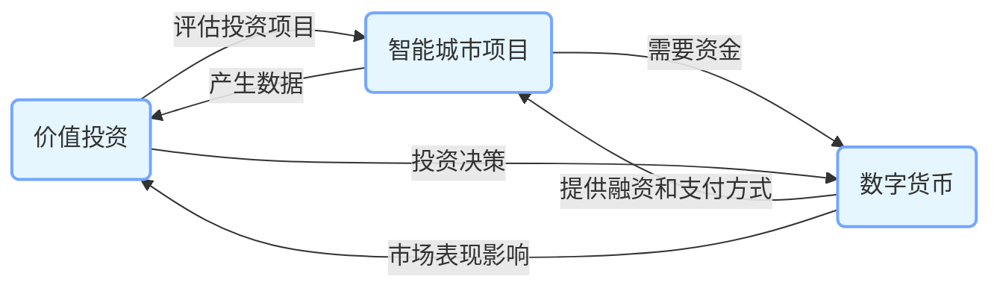

# 价值投资中的智能城市数字货币应用

> 关键词：价值投资、智能城市、数字货币、应用场景、金融科技

> 摘要：本文围绕价值投资中的智能城市数字货币应用展开深入探讨。首先介绍了相关背景，包括目的、预期读者等内容。接着阐述了核心概念及它们之间的联系，分析了核心算法原理与操作步骤，用数学模型和公式进行了理论支撑。通过项目实战展示了代码实现与解读，探讨了实际应用场景。同时推荐了相关的学习资源、开发工具框架和论文著作。最后总结了未来发展趋势与挑战，并对常见问题进行了解答。旨在为读者全面呈现智能城市数字货币在价值投资领域的应用全貌，助力读者理解和把握这一新兴领域的发展机遇与挑战。

## 1. 背景介绍 
### 1.1 目的和范围
本文章的主要目的是深入研究价值投资领域中智能城市数字货币的应用，旨在揭示数字货币在智能城市建设与发展过程中如何创造价值以及为投资者带来潜在收益。范围涵盖智能城市数字货币的基本概念、技术原理、应用场景、投资策略等多个方面，同时探讨其在金融市场和城市发展中的影响和未来趋势。

### 1.2 预期读者
预期读者包括对金融投资有兴趣的个人投资者、金融机构从业者、智能城市建设相关的政府部门工作人员、科技企业的研发人员以及对新兴技术和金融创新领域有研究需求的学者等。通过阅读本文，读者可以从不同角度了解智能城市数字货币在价值投资中的应用，为其决策和研究提供参考。

### 1.3 文档结构概述
本文将按照以下结构进行阐述：首先介绍背景信息，包括目的、读者群体和文档结构等；接着阐述核心概念与联系，帮助读者建立对相关概念的基本理解；然后深入分析核心算法原理和具体操作步骤，并通过数学模型和公式进行理论支撑；之后通过项目实战展示代码实现和详细解释；再探讨实际应用场景，展示智能城市数字货币的实际应用价值；随后推荐相关的工具和资源，为读者提供学习和研究的方向；最后总结未来发展趋势与挑战，解答常见问题，并提供扩展阅读和参考资料。

### 1.4 术语表
#### 1.4.1 核心术语定义
- **价值投资**：一种投资策略，投资者通过分析资产的内在价值，寻找被低估的投资机会，以长期持有为目标，期望获得资产价值增长带来的收益。
- **智能城市**：利用信息技术和通信技术，对城市的各项资源进行智能化管理和优化配置，提高城市的运行效率、居民生活质量和可持续发展能力的城市发展模式。
- **数字货币**：以数字形式存在的货币，基于密码学和分布式账本技术，具有去中心化、匿名性、可追溯性等特点。

#### 1.4.2 相关概念解释
- **区块链技术**：一种分布式账本技术，通过去中心化、不可篡改、共识机制等特点，保证数据的安全性和可靠性，是数字货币的底层技术支撑。
- **分布式账本**：一种共享的、分布式的数据库，记录了所有参与者的交易信息，每个参与者都可以访问和验证账本中的数据，确保数据的一致性和透明度。
- **加密算法**：用于对数字货币的交易信息进行加密处理，保证交易的安全性和隐私性的算法，常见的加密算法有哈希算法、椭圆曲线加密算法等。

#### 1.4.3 缩略词列表
- **BTC**：比特币（Bitcoin）
- **ETH**：以太坊（Ethereum）
- **DLT**：分布式账本技术（Distributed Ledger Technology）
- **AI**：人工智能（Artificial Intelligence）

## 2. 核心概念与联系 

### 2.1 价值投资的核心原理
价值投资的核心原理是基于对资产内在价值的评估。投资者通过分析公司的财务状况、行业前景、管理团队等因素，确定资产的内在价值。当市场价格低于内在价值时，投资者认为该资产被低估，从而进行投资，期望在未来市场价格回归内在价值时获得收益。

### 2.2 智能城市的概念与架构
智能城市是一个复杂的系统，它整合了信息技术、通信技术、物联网、大数据等多种技术，实现城市的智能化管理和服务。智能城市的架构通常包括感知层、网络层、平台层和应用层。感知层通过各种传感器收集城市的各种数据，如交通流量、能源消耗、环境质量等；网络层负责将感知层收集的数据传输到平台层；平台层对数据进行存储、处理和分析；应用层则根据分析结果提供各种智能服务，如智能交通、智能能源管理、智能安防等。

### 2.3 数字货币的技术原理
数字货币基于区块链技术，采用分布式账本记录交易信息。区块链是由一个个区块组成的链条，每个区块包含一定数量的交易记录。当新的交易发生时，矿工通过竞争计算解决一个复杂的数学难题，将新的交易记录打包成一个新的区块，并添加到区块链中。为了保证交易的安全性和隐私性，数字货币采用加密算法对交易信息进行加密处理。

### 2.4 三者之间的联系
智能城市的建设需要大量的资金投入和技术支持，数字货币的出现为智能城市的融资和支付提供了新的途径。同时，智能城市产生的大量数据可以为价值投资提供更多的参考信息，帮助投资者更好地评估投资项目的价值。数字货币的市场表现也受到智能城市发展和价值投资理念的影响。例如，随着智能城市的发展，对数字货币的需求可能会增加，从而推动数字货币价格的上涨；而价值投资者可能会根据数字货币的内在价值和市场前景进行投资决策。

### 2.5 文本示意图
```plaintext
价值投资 <---> 智能城市 <---> 数字货币

价值投资：评估资产内在价值，寻找低估机会
智能城市：整合多种技术，实现城市智能化管理
数字货币：基于区块链技术，提供新的支付和融资方式

联系：
- 智能城市建设需要资金，数字货币提供融资途径
- 智能城市数据为价值投资提供参考
- 价值投资决策影响数字货币市场，智能城市发展推动数字货币需求
```

### 2.6 Mermaid 流程图


## 3. 核心算法原理 & 具体操作步骤 

### 3.1 数字货币交易算法原理
数字货币的交易基于区块链的共识机制，常见的共识机制有工作量证明（PoW）和权益证明（PoS）。下面以工作量证明为例，介绍其算法原理。

工作量证明的核心思想是通过矿工的计算能力来竞争记账权。矿工需要不断地尝试不同的随机数，使得计算得到的哈希值满足一定的条件。当矿工找到满足条件的随机数时，就可以将新的交易记录打包成一个新的区块，并添加到区块链中。

以下是一个简单的 Python 代码示例，模拟工作量证明的过程：
```python
import hashlib
import time

class Block:
    def __init__(self, index, previous_hash, transactions):
        self.index = index
        self.previous_hash = previous_hash
        self.transactions = transactions
        self.timestamp = time.time()
        self.nonce = 0
        self.hash = self.calculate_hash()

    def calculate_hash(self):
        block_string = f"{self.index}{self.previous_hash}{self.transactions}{self.timestamp}{self.nonce}"
        return hashlib.sha256(block_string.encode()).hexdigest()

    def mine_block(self, difficulty):
        target = "0" * difficulty
        while self.hash[:difficulty] != target:
            self.nonce += 1
            self.hash = self.calculate_hash()
        print(f"Block mined: {self.hash}")

# 创建一个简单的区块链
class Blockchain:
    def __init__(self):
        self.chain = [self.create_genesis_block()]
        self.difficulty = 2

    def create_genesis_block(self):
        return Block(0, "0", [])

    def get_latest_block(self):
        return self.chain[-1]

    def add_block(self, new_block):
        new_block.previous_hash = self.get_latest_block().hash
        new_block.mine_block(self.difficulty)
        self.chain.append(new_block)

# 示例使用
blockchain = Blockchain()
transaction1 = "Alice sends 10 coins to Bob"
block1 = Block(1, blockchain.get_latest_block().hash, [transaction1])
blockchain.add_block(block1)
```

### 3.2 具体操作步骤
1. **节点连接**：参与数字货币交易的节点需要通过网络连接到其他节点，形成一个分布式网络。
2. **交易广播**：当用户发起一笔交易时，该交易信息会被广播到整个网络中。
3. **交易验证**：节点接收到交易信息后，会对交易的合法性进行验证，包括验证交易的签名、余额等信息。
4. **区块打包**：矿工将验证通过的交易记录打包成一个新的区块。
5. **挖矿竞争**：矿工通过计算哈希值竞争记账权，找到满足条件的随机数。
6. **区块添加**：当矿工找到满足条件的随机数后，将新的区块添加到区块链中，并广播到整个网络。
7. **同步更新**：其他节点接收到新的区块后，会验证区块的合法性，并更新自己的区块链副本。

## 4. 数学模型和公式 & 详细讲解 & 举例说明 

### 4.1 哈希函数的数学原理
哈希函数是数字货币中用于保证数据完整性和安全性的重要工具。哈希函数将任意长度的输入数据转换为固定长度的哈希值。常见的哈希函数有 SHA-256 等。

哈希函数的数学性质包括：
- **确定性**：对于相同的输入，哈希函数总是产生相同的输出。
- **快速计算**：哈希函数的计算速度非常快。
- **抗碰撞性**：很难找到两个不同的输入，使得它们的哈希值相同。

数学公式表示为：
$$H(x) = y$$
其中 $x$ 是输入数据，$y$ 是哈希值，$H$ 是哈希函数。

例如，对于输入数据 $x = "Hello, World!"$，使用 SHA-256 哈希函数计算得到的哈希值为：
```python
import hashlib

data = "Hello, World!"
hash_value = hashlib.sha256(data.encode()).hexdigest()
print(hash_value)
```

### 4.2 工作量证明的难度调整公式
工作量证明的难度调整是为了保证区块链的出块时间相对稳定。难度调整公式通常基于过去一段时间内的出块时间来计算新的难度值。

设 $T$ 为目标出块时间，$t$ 为过去一段时间内的平均出块时间，$D$ 为当前难度值，$D'$ 为调整后的难度值。则难度调整公式为：
$$D' = D \times \frac{t}{T}$$

例如，假设目标出块时间 $T = 10$ 分钟，过去一段时间内的平均出块时间 $t = 20$ 分钟，当前难度值 $D = 100$，则调整后的难度值为：
$$D' = 100 \times \frac{20}{10} = 200$$

### 4.3 数字货币的价值评估模型
数字货币的价值评估是一个复杂的问题，受到多种因素的影响，如市场需求、技术发展、政策法规等。一种简单的价值评估模型可以基于数字货币的供应量和市场需求来计算。

设 $V$ 为数字货币的价值，$S$ 为数字货币的供应量，$D$ 为市场需求。则价值评估公式为：
$$V = \frac{D}{S}$$

例如，假设某种数字货币的供应量 $S = 10000$ 个，市场需求 $D = 20000$ 个，则该数字货币的价值为：
$$V = \frac{20000}{10000} = 2$$

## 5. 项目实战：代码实际案例和详细解释说明 

### 5.1  开发环境搭建
#### 5.1.1 安装 Python
首先需要安装 Python 开发环境，建议使用 Python 3.7 及以上版本。可以从 Python 官方网站（https://www.python.org/downloads/） 下载安装包，按照安装向导进行安装。

#### 5.1.2 安装必要的库
在本项目中，需要使用 `hashlib` 库进行哈希计算，该库是 Python 标准库的一部分，无需额外安装。如果需要进行网络通信和数据处理，可能还需要安装 `requests`、`pandas` 等库，可以使用以下命令进行安装：
```sh
pip install requests pandas
```

### 5.2  源代码详细实现和代码解读
#### 5.2.1 简单的数字货币交易系统实现
以下是一个简单的数字货币交易系统的 Python 代码实现：
```python
import hashlib
import time

class Transaction:
    def __init__(self, sender, receiver, amount):
        self.sender = sender
        self.receiver = receiver
        self.amount = amount
        self.timestamp = time.time()
        self.hash = self.calculate_hash()

    def calculate_hash(self):
        transaction_string = f"{self.sender}{self.receiver}{self.amount}{self.timestamp}"
        return hashlib.sha256(transaction_string.encode()).hexdigest()

class Block:
    def __init__(self, index, previous_hash, transactions):
        self.index = index
        self.previous_hash = previous_hash
        self.transactions = transactions
        self.timestamp = time.time()
        self.nonce = 0
        self.hash = self.calculate_hash()

    def calculate_hash(self):
        block_string = f"{self.index}{self.previous_hash}{self.transactions}{self.timestamp}{self.nonce}"
        return hashlib.sha256(block_string.encode()).hexdigest()

    def mine_block(self, difficulty):
        target = "0" * difficulty
        while self.hash[:difficulty] != target:
            self.nonce += 1
            self.hash = self.calculate_hash()
        print(f"Block mined: {self.hash}")

class Blockchain:
    def __init__(self):
        self.chain = [self.create_genesis_block()]
        self.difficulty = 2
        self.pending_transactions = []

    def create_genesis_block(self):
        return Block(0, "0", [])

    def get_latest_block(self):
        return self.chain[-1]

    def add_transaction(self, transaction):
        self.pending_transactions.append(transaction)

    def mine_pending_transactions(self, miner_address):
        new_block = Block(len(self.chain), self.get_latest_block().hash, self.pending_transactions)
        new_block.mine_block(self.difficulty)
        self.chain.append(new_block)
        self.pending_transactions = []

# 示例使用
blockchain = Blockchain()

# 创建交易
transaction1 = Transaction("Alice", "Bob", 10)
transaction2 = Transaction("Bob", "Charlie", 5)

# 添加交易到待处理列表
blockchain.add_transaction(transaction1)
blockchain.add_transaction(transaction2)

# 挖矿处理待处理交易
blockchain.mine_pending_transactions("Miner")
```

#### 5.2.2 代码解读
- **Transaction 类**：表示一笔数字货币交易，包含发送者、接收者、交易金额、时间戳和交易哈希值。
- **Block 类**：表示一个区块链中的区块，包含区块索引、前一个区块的哈希值、交易列表、时间戳、随机数和区块哈希值。`mine_block` 方法用于挖矿，通过不断尝试不同的随机数，使得区块哈希值满足一定的难度条件。
- **Blockchain 类**：表示整个区块链，包含区块链列表、难度值和待处理交易列表。`add_transaction` 方法用于添加新的交易到待处理列表，`mine_pending_transactions` 方法用于挖矿处理待处理交易。

### 5.3  代码解读与分析
#### 5.3.1 安全性分析
该代码通过哈希函数保证了交易和区块的完整性和不可篡改性。每个交易和区块都有一个唯一的哈希值，当交易或区块的内容发生变化时，哈希值也会随之改变。同时，工作量证明机制保证了只有通过计算能力竞争获得记账权的矿工才能添加新的区块，提高了区块链的安全性。

#### 5.3.2 性能分析
该代码的性能主要受限于挖矿过程的计算复杂度。随着难度值的增加，挖矿所需的计算时间会显著增加。为了提高性能，可以采用并行计算、优化哈希算法等方法。

#### 5.3.3 扩展性分析
该代码的结构具有一定的扩展性，可以通过添加新的功能模块来实现更多的功能，如钱包管理、交易验证、网络通信等。同时，可以将代码部署到分布式网络中，实现多个节点之间的协作和数据同步。

## 6. 实际应用场景 

### 6.1 智能城市建设融资
智能城市的建设需要大量的资金投入，数字货币可以为智能城市建设提供新的融资途径。例如，政府或企业可以发行基于区块链的数字货币，吸引投资者参与智能城市项目的建设。投资者可以通过购买数字货币获得项目的收益权，同时数字货币的流通性也为投资者提供了退出机制。

### 6.2 智能城市支付结算
数字货币可以作为智能城市中的一种支付结算方式，实现快速、便捷、安全的交易。例如，在智能交通领域，用户可以使用数字货币支付停车费、公交地铁费用等；在智能能源领域，用户可以使用数字货币支付水电费等。数字货币的去中心化特点可以减少中间环节，降低交易成本，提高支付效率。

### 6.3 城市数据资产交易
智能城市产生的大量数据是一种重要的资产，数字货币可以用于城市数据资产的交易。例如，企业或研究机构可以使用数字货币购买城市的交通流量数据、环境监测数据等，用于商业分析和研究。数字货币的可追溯性和安全性可以保证数据交易的合法性和公正性。

### 6.4 价值投资决策支持
智能城市数字货币的市场表现可以为价值投资者提供决策支持。例如，投资者可以通过分析数字货币的价格走势、交易量等数据，评估智能城市项目的发展前景和投资价值。同时，数字货币的技术创新和应用场景也可以为投资者提供新的投资机会。

## 7. 工具和资源推荐
### 7.1 学习资源推荐
#### 7.1.1 书籍推荐
- 《区块链：技术驱动金融》：本书全面介绍了区块链技术的原理、应用和发展趋势，是学习区块链和数字货币的经典著作。
- 《数字黄金：比特币鲜为人知的故事》：通过讲述比特币的发展历程，深入探讨了数字货币的兴起和影响。
- 《智能城市：创新2.0时代的城市形态》：介绍了智能城市的概念、技术和应用，帮助读者了解智能城市的发展趋势。

#### 7.1.2 在线课程
- Coursera 上的 “区块链基础” 课程：由专业的教师团队授课，系统地介绍了区块链技术的基本概念、原理和应用。
- edX 上的 “数字货币与区块链” 课程：深入探讨了数字货币的技术原理、市场机制和投资策略。
- 中国大学 MOOC 上的 “智能城市概论” 课程：介绍了智能城市的理论、技术和实践，帮助学习者了解智能城市的建设和发展。

#### 7.1.3 技术博客和网站
- CoinDesk：全球知名的数字货币新闻和资讯网站，提供最新的数字货币市场动态、技术分析和行业趋势。
- Medium 上的区块链和数字货币相关博客：有许多行业专家和开发者分享的技术文章和观点，是学习和交流的重要平台。
- 智慧城市网：专注于智能城市领域的新闻、技术和应用案例，为读者提供全面的智能城市信息。

### 7.2 开发工具框架推荐
#### 7.2.1 IDE和编辑器
- PyCharm：一款专业的 Python 集成开发环境，提供丰富的代码编辑、调试和部署功能，适合开发数字货币和区块链相关的 Python 项目。
- Visual Studio Code：一款轻量级的代码编辑器，支持多种编程语言和插件扩展，可用于快速开发和调试数字货币项目。
- Remix：一款基于 Web 的以太坊智能合约开发环境，提供可视化的代码编辑和调试功能，适合初学者学习和开发以太坊智能合约。

#### 7.2.2 调试和性能分析工具
- Geth：以太坊的官方客户端，提供了命令行工具和调试接口，可用于调试和分析以太坊区块链的运行状态。
- Truffle：一个以太坊开发框架，提供了项目管理、编译、部署和测试等功能，可帮助开发者快速开发和调试以太坊智能合约。
- Py-Spy：一款 Python 性能分析工具，可用于分析 Python 代码的性能瓶颈，优化数字货币和区块链项目的性能。

#### 7.2.3 相关框架和库
- web3.py：一个 Python 库，用于与以太坊区块链进行交互，提供了丰富的 API 接口，可用于开发以太坊智能合约和去中心化应用。
- Bitcoinlib：一个 Python 库，用于处理比特币和其他数字货币的交易和钱包管理，提供了简单易用的 API 接口。
- Fabric SDK：Hyperledger Fabric 的软件开发工具包，提供了多种编程语言的接口，可用于开发企业级的区块链应用。

### 7.3 相关论文著作推荐
#### 7.3.1 经典论文
- Nakamoto, S. (2008). Bitcoin: A Peer-to-Peer Electronic Cash System. 这是比特币的创世论文，详细介绍了比特币的技术原理和设计理念。
- Wood, G. (2014). Ethereum: A Secure Decentralised Generalised Transaction Ledger. 介绍了以太坊的技术架构和智能合约的实现原理。

#### 7.3.2 最新研究成果
- 关注顶级学术会议如 ACM SIGCOMM、IEEE INFOCOM 等，以及顶级学术期刊如 Journal of Cryptology、IEEE Transactions on Dependable and Secure Computing 等，获取关于数字货币、区块链和智能城市的最新研究成果。

#### 7.3.3 应用案例分析
- 可以参考政府部门和企业发布的智能城市建设和数字货币应用的案例报告，了解实际应用中的经验和教训。例如，新加坡的智能城市建设案例、中国央行数字货币的试点应用案例等。

## 8. 总结：未来发展趋势与挑战

### 8.1 未来发展趋势
#### 8.1.1 技术创新
随着区块链技术、人工智能、物联网等技术的不断发展，智能城市数字货币的技术将不断创新。例如，更高效的共识机制、更安全的加密算法、更智能的合约技术等将不断涌现，提高数字货币的性能和安全性。

#### 8.1.2 应用拓展
智能城市数字货币的应用场景将不断拓展，除了现有的融资、支付、数据交易等领域，还将在智能医疗、智能教育、智能环保等领域得到广泛应用。数字货币将成为智能城市建设和发展的重要支撑。

#### 8.1.3 监管完善
随着数字货币市场的不断发展，监管政策将不断完善。政府将加强对数字货币的监管，规范市场秩序，保护投资者的合法权益。同时，国际间的监管合作也将加强，共同应对数字货币带来的挑战。

#### 8.1.4 价值投资多元化
投资者对智能城市数字货币的认识将不断加深，价值投资策略将更加多元化。除了传统的价格分析和基本面分析，投资者还将关注数字货币的技术创新、应用场景、社区生态等因素，寻找更具潜力的投资机会。

### 8.2 挑战
#### 8.2.1 技术安全风险
数字货币基于区块链技术，面临着技术安全风险，如黑客攻击、51% 攻击、智能合约漏洞等。这些安全风险可能导致数字货币的被盗、交易的失败、系统的瘫痪等问题，影响数字货币的正常运行和投资者的信心。

#### 8.2.2 市场波动风险
数字货币市场具有高度的波动性，价格受到多种因素的影响，如市场需求、政策法规、技术创新等。市场波动可能导致投资者的资产损失，增加投资风险。

#### 8.2.3 监管政策不确定性
数字货币的监管政策尚不完善，不同国家和地区的监管政策存在差异。监管政策的不确定性可能导致数字货币市场的不稳定，影响投资者的决策和市场的发展。

#### 8.2.4 社会接受度问题
数字货币作为一种新兴的金融工具，社会接受度相对较低。一些人对数字货币的安全性、合法性、隐私性等问题存在疑虑，这可能影响数字货币的推广和应用。

## 9. 附录：常见问题与解答

### 9.1 数字货币与传统货币有什么区别？
数字货币与传统货币的主要区别在于：
- **发行主体**：传统货币由中央银行发行和管理，而数字货币可以是去中心化的，没有单一的发行主体。
- **存在形式**：传统货币以纸质或电子形式存在，而数字货币以数字形式存在于区块链网络中。
- **交易方式**：传统货币的交易需要通过银行等金融机构进行中介，而数字货币的交易可以直接在区块链网络中进行，无需中介。
- **匿名性**：数字货币具有一定的匿名性，而传统货币的交易记录可以被金融机构和监管部门追踪。

### 9.2 智能城市数字货币的投资风险有哪些？
智能城市数字货币的投资风险包括：
- **技术风险**：如区块链技术的安全性、智能合约的漏洞等。
- **市场风险**：数字货币市场的高度波动性，价格可能大幅下跌。
- **监管风险**：监管政策的不确定性可能导致数字货币市场的不稳定。
- **应用风险**：数字货币的应用场景可能无法达到预期，导致其价值下降。

### 9.3 如何保证智能城市数字货币的安全性？
保证智能城市数字货币的安全性可以从以下几个方面入手：
- **技术层面**：采用先进的加密算法、安全的共识机制和智能合约技术，确保数字货币的交易和存储安全。
- **监管层面**：政府加强对数字货币市场的监管，规范市场秩序，打击违法犯罪行为。
- **用户层面**：用户加强安全意识，妥善保管自己的私钥和密码，避免泄露个人信息。

### 9.4 智能城市数字货币的发展前景如何？
智能城市数字货币的发展前景广阔。随着智能城市建设的不断推进，对数字货币的需求将不断增加。数字货币可以为智能城市的融资、支付、数据交易等提供新的解决方案，提高城市的运行效率和管理水平。同时，数字货币的技术创新和应用拓展也将为其发展带来更多的机遇。然而，数字货币的发展也面临着技术安全、市场波动、监管政策等挑战，需要政府、企业和社会各方共同努力，推动其健康、稳定发展。

## 10. 扩展阅读 & 参考资料

### 10.1 扩展阅读
- 《区块链革命：比特币底层技术如何改变货币、商业和世界》：深入探讨了区块链技术对各个领域的影响和变革。
- 《数字货币：领导干部读本》：适合政府部门工作人员和领导干部阅读，帮助他们了解数字货币的基本知识和政策导向。
- 《智能革命：迎接人工智能时代的社会、经济与文化变革》：介绍了人工智能与智能城市的结合，以及对社会、经济和文化的影响。

### 10.2 参考资料
- 相关的学术论文和研究报告，如 IEEE 、ACM 等学术组织发表的关于区块链、数字货币和智能城市的论文。
- 政府部门发布的政策文件和统计数据，如中国人民银行关于数字货币的研究报告、国家发改委关于智能城市建设的规划文件等。
- 行业协会和研究机构发布的行业报告和分析文章，如国际区块链协会、中国信息通信研究院等发布的相关报告。