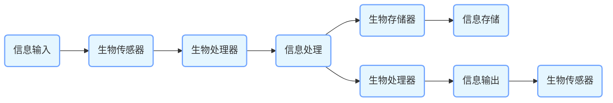

# 价值投资中的生物计算机发展趋势

> 关键词：价值投资、生物计算机、发展趋势、技术原理、应用场景

> 摘要：本文聚焦于价值投资视角下生物计算机的发展趋势。首先介绍了生物计算机的背景知识，包括目的、预期读者等。接着阐述了生物计算机的核心概念与联系，详细讲解了其核心算法原理及操作步骤，并用数学模型和公式进行深入分析。通过项目实战案例展示了生物计算机在实际中的应用。还探讨了生物计算机的实际应用场景，推荐了相关的学习资源、开发工具和论文著作。最后总结了生物计算机的未来发展趋势与挑战，并提供了常见问题解答和扩展阅读参考资料，旨在为价值投资者和相关技术人员提供全面的生物计算机发展信息。

## 1. 背景介绍 
### 1.1 目的和范围
生物计算机作为计算机科学与生物学交叉融合的前沿领域，具有巨大的发展潜力和应用前景。本文章的目的在于从价值投资的角度深入剖析生物计算机的发展趋势，为投资者提供决策依据，同时也为相关技术人员和研究者提供技术参考。文章将涵盖生物计算机的核心概念、算法原理、数学模型、实际应用等多个方面，全面展示生物计算机的技术全貌和市场前景。

### 1.2 预期读者
本文预期读者主要包括价值投资者、计算机科学专业人士、生物学研究人员、科技行业分析师以及对新兴技术发展趋势感兴趣的人群。对于价值投资者而言，希望通过本文了解生物计算机的投资价值和潜在风险；对于专业技术人员，文章提供了详细的技术原理和实际应用案例，有助于他们深入研究和开发相关技术；而对于科技行业分析师和普通读者，文章则可以帮助他们了解生物计算机这一新兴技术的发展动态和市场趋势。

### 1.3 文档结构概述
本文将按照以下结构展开：首先介绍生物计算机的背景知识，包括目的、预期读者、文档结构概述和术语表；接着阐述生物计算机的核心概念与联系，并用示意图和流程图进行直观展示；然后详细讲解生物计算机的核心算法原理和具体操作步骤，同时给出 Python 源代码示例；再通过数学模型和公式对生物计算机的原理进行深入分析，并举例说明；之后通过项目实战案例展示生物计算机在实际中的应用，包括开发环境搭建、源代码实现和代码解读；接着探讨生物计算机的实际应用场景；随后推荐相关的学习资源、开发工具和论文著作；最后总结生物计算机的未来发展趋势与挑战，提供常见问题解答和扩展阅读参考资料。

### 1.4 术语表
#### 1.4.1 核心术语定义
- **生物计算机**：生物计算机是以生物分子作为信息载体，利用生物化学反应进行信息处理的计算机。它与传统计算机不同，采用生物芯片代替硅基芯片，具有更高的存储密度、更低的能耗和更强的并行处理能力。
- **DNA 计算**：DNA 计算是生物计算机的一种重要实现方式，它利用 DNA 分子的碱基对序列来存储信息，通过 DNA 分子之间的杂交反应来进行信息处理。
- **生物芯片**：生物芯片是生物计算机的核心部件，它是将生物分子（如 DNA、蛋白质等）固定在固体基质上制成的微型芯片，用于实现信息的存储和处理。

#### 1.4.2 相关概念解释
- **分子自组装**：分子自组装是指分子在没有外界干预的情况下，通过分子间的相互作用自发地形成有序结构的过程。在生物计算机中，分子自组装可以用于构建生物芯片和生物电路。
- **生物传感器**：生物传感器是一种能够将生物信息转化为电信号或其他可检测信号的装置。在生物计算机中，生物传感器可以用于检测生物分子的浓度和活性，从而实现信息的输入和输出。

#### 1.4.3 缩略词列表
- **DNA**：脱氧核糖核酸（Deoxyribonucleic Acid）
- **RNA**：核糖核酸（Ribonucleic Acid）
- **CMOS**：互补金属氧化物半导体（Complementary Metal-Oxide-Semiconductor）

## 2. 核心概念与联系 

生物计算机的核心概念涉及生物学和计算机科学的多个领域，其基本原理是利用生物分子的特性来实现信息的存储、处理和传输。下面通过文本示意图和 Mermaid 流程图来展示生物计算机的核心概念和架构。

### 文本示意图
生物计算机主要由生物芯片、生物传感器、生物处理器和生物存储器等部分组成。生物芯片是生物计算机的核心部件，它利用生物分子（如 DNA、蛋白质等）的特性来存储和处理信息。生物传感器用于检测生物分子的浓度和活性，将生物信息转化为电信号或其他可检测信号。生物处理器负责对生物信息进行处理和计算，而生物存储器则用于存储生物信息。

生物计算机的工作过程可以分为信息输入、信息处理和信息输出三个阶段。在信息输入阶段，生物传感器检测生物分子的浓度和活性，并将生物信息转化为电信号或其他可检测信号。在信息处理阶段，生物处理器对输入的生物信息进行处理和计算，利用生物分子之间的化学反应来实现逻辑运算和数据处理。在信息输出阶段，生物处理器将处理后的信息转化为生物信号或其他可检测信号，通过生物传感器输出。

### Mermaid 流程图


这个流程图展示了生物计算机的基本工作流程，从信息输入开始，经过生物传感器将生物信息转化为可处理的信号，然后传递给生物处理器进行信息处理。处理后的信息一部分存储在生物存储器中，另一部分通过生物处理器进行进一步处理后，再由生物传感器输出。整个过程形成一个闭环，实现了生物信息的高效处理和存储。

## 3. 核心算法原理 & 具体操作步骤 

### 核心算法原理
生物计算机的核心算法原理主要基于生物分子的化学反应和分子间的相互作用。其中，DNA 计算是生物计算机中最具代表性的算法之一。DNA 计算利用 DNA 分子的碱基对序列来存储信息，通过 DNA 分子之间的杂交反应来进行信息处理。

DNA 分子由四种碱基（腺嘌呤 A、胸腺嘧啶 T、鸟嘌呤 G 和胞嘧啶 C）组成，它们之间遵循碱基互补配对原则（A 与 T 配对，G 与 C 配对）。通过设计特定的 DNA 序列，可以将信息编码到 DNA 分子中。例如，可以用 A 和 T 表示二进制的 0，用 G 和 C 表示二进制的 1。

在信息处理过程中，DNA 分子之间的杂交反应可以实现逻辑运算。例如，当两个 DNA 分子的碱基序列互补时，它们会相互结合形成双链 DNA 分子，这可以看作是一个逻辑与运算。通过设计不同的 DNA 序列和杂交反应条件，可以实现各种复杂的逻辑运算和数据处理。

### 具体操作步骤
下面以一个简单的 DNA 计算示例来说明生物计算机的具体操作步骤。假设我们要计算两个二进制数的加法，具体步骤如下：

1. **信息编码**：将两个二进制数分别编码到 DNA 分子中。例如，二进制数 101 可以编码为 DNA 序列 GCA，二进制数 011 可以编码为 DNA 序列 TCG。
2. **DNA 分子混合**：将编码后的 DNA 分子混合在一起，让它们在适当的条件下进行杂交反应。在杂交反应过程中，互补的 DNA 序列会相互结合形成双链 DNA 分子。
3. **分离和检测**：通过凝胶电泳等技术将杂交后的 DNA 分子分离出来，并检测它们的长度和序列。根据 DNA 分子的长度和序列，可以推断出计算结果。

### Python 源代码示例
```python
# 定义 DNA 编码规则
encoding_dict = {
    '0': 'AT',
    '1': 'GC'
}

# 定义 DNA 解码规则
decoding_dict = {
    'AT': '0',
    'GC': '1'
}

def encode_binary_to_dna(binary_str):
    """
    将二进制字符串编码为 DNA 序列
    """
    dna_str = ''
    for bit in binary_str:
        dna_str += encoding_dict[bit]
    return dna_str

def decode_dna_to_binary(dna_str):
    """
    将 DNA 序列解码为二进制字符串
    """
    binary_str = ''
    for i in range(0, len(dna_str), 2):
        dna_pair = dna_str[i:i+2]
        binary_str += decoding_dict[dna_pair]
    return binary_str

# 示例：计算两个二进制数的加法
binary_num1 = '101'
binary_num2 = '011'

# 编码为 DNA 序列
dna_num1 = encode_binary_to_dna(binary_num1)
dna_num2 = encode_binary_to_dna(binary_num2)

print(f"二进制数 {binary_num1} 编码后的 DNA 序列: {dna_num1}")
print(f"二进制数 {binary_num2} 编码后的 DNA 序列: {dna_num2}")

# 模拟杂交反应（这里只是简单示意，实际情况更复杂）
# 假设杂交后得到新的 DNA 序列
hybrid_dna = dna_num1 + dna_num2

# 解码为二进制字符串
result_binary = decode_dna_to_binary(hybrid_dna)

print(f"杂交后的 DNA 序列解码后的二进制结果: {result_binary}")
```

在这个示例中，我们定义了 DNA 编码和解码规则，实现了二进制数到 DNA 序列的编码和解码过程。通过模拟 DNA 分子的杂交反应，展示了如何利用 DNA 计算进行信息处理。

## 4. 数学模型和公式 & 详细讲解 & 举例说明 

### 数学模型
生物计算机的数学模型主要基于生物分子的化学反应动力学和信息论。在 DNA 计算中，DNA 分子之间的杂交反应可以用化学反应动力学方程来描述。

假设 DNA 分子 A 和 B 之间的杂交反应可以表示为：

$$A + B \rightleftharpoons AB$$

其中，$A$ 和 $B$ 分别表示单链 DNA 分子，$AB$ 表示双链 DNA 分子。根据化学反应动力学原理，该反应的速率可以用以下方程表示：

$$\frac{d[AB]}{dt} = k_{on}[A][B] - k_{off}[AB]$$

其中，$[A]$、$[B]$ 和 $[AB]$ 分别表示 DNA 分子 $A$、$B$ 和 $AB$ 的浓度，$k_{on}$ 是反应的正向速率常数，$k_{off}$ 是反应的反向速率常数。

### 详细讲解
这个方程描述了双链 DNA 分子 $AB$ 的浓度随时间的变化情况。正向反应速率 $k_{on}[A][B]$ 表示单链 DNA 分子 $A$ 和 $B$ 结合形成双链 DNA 分子 $AB$ 的速率，反向反应速率 $k_{off}[AB]$ 表示双链 DNA 分子 $AB$ 解离成单链 DNA 分子 $A$ 和 $B$ 的速率。

在平衡状态下，双链 DNA 分子 $AB$ 的浓度不再随时间变化，即 $\frac{d[AB]}{dt} = 0$。此时，可以得到以下方程：

$$k_{on}[A][B] = k_{off}[AB]$$

整理后得到：

$$\frac{[AB]}{[A][B]} = \frac{k_{on}}{k_{off}} = K_d$$

其中，$K_d$ 是反应的平衡常数，它反映了 DNA 分子之间杂交反应的亲和力。$K_d$ 值越小，说明 DNA 分子之间的亲和力越强，杂交反应越容易发生。

### 举例说明
假设我们有两个 DNA 分子 $A$ 和 $B$，它们的初始浓度分别为 $[A]_0 = 1 \mu M$ 和 $[B]_0 = 1 \mu M$，反应的正向速率常数 $k_{on} = 10^6 M^{-1} s^{-1}$，反向速率常数 $k_{off} = 10^{-3} s^{-1}$。

首先，计算反应的平衡常数 $K_d$：

$$K_d = \frac{k_{off}}{k_{on}} = \frac{10^{-3} s^{-1}}{10^6 M^{-1} s^{-1}} = 10^{-9} M$$

然后，设平衡时双链 DNA 分子 $AB$ 的浓度为 $x$，则单链 DNA 分子 $A$ 和 $B$ 的浓度分别为 $[A] = [A]_0 - x$ 和 $[B] = [B]_0 - x$。代入平衡常数方程可得：

$$\frac{x}{([A]_0 - x)([B]_0 - x)} = K_d$$

将 $[A]_0 = [B]_0 = 1 \mu M = 10^{-6} M$ 和 $K_d = 10^{-9} M$ 代入上式，得到：

$$\frac{x}{(10^{-6} - x)(10^{-6} - x)} = 10^{-9}$$

解这个方程可以得到平衡时双链 DNA 分子 $AB$ 的浓度 $x$。通过这个例子，我们可以看到如何利用数学模型和公式来描述和计算 DNA 分子之间的杂交反应。

## 5. 项目实战：代码实际案例和详细解释说明 

### 5.1  开发环境搭建
在进行生物计算机相关项目开发时，需要搭建相应的开发环境。以下是一些常见的开发环境搭建步骤：

1. **安装 Python**：Python 是一种广泛使用的编程语言，在生物信息学和计算机科学领域有很多应用。可以从 Python 官方网站（https://www.python.org/downloads/）下载并安装适合自己操作系统的 Python 版本。
2. **安装必要的库**：在生物计算机开发中，常用的库包括 `numpy`、`pandas`、`biopython` 等。可以使用 `pip` 命令来安装这些库：
```sh
pip install numpy pandas biopython
```
3. **选择开发工具**：可以选择使用集成开发环境（IDE）如 PyCharm 或 Jupyter Notebook 进行代码开发和调试。

### 5.2  源代码详细实现和代码解读
下面以一个简单的 DNA 序列分析项目为例，展示源代码的详细实现和代码解读。

```python
from Bio.Seq import Seq
from Bio.Alphabet import generic_dna

# 定义一个 DNA 序列
dna_seq = Seq("ATGCATGC", generic_dna)

# 计算 DNA 序列的长度
seq_length = len(dna_seq)
print(f"DNA 序列的长度: {seq_length}")

# 计算 DNA 序列中各种碱基的含量
base_counts = {
    'A': dna_seq.count('A'),
    'T': dna_seq.count('T'),
    'G': dna_seq.count('G'),
    'C': dna_seq.count('C')
}
print("DNA 序列中各种碱基的含量:")
for base, count in base_counts.items():
    print(f"{base}: {count}")

# 计算 DNA 序列的反向互补序列
reverse_complement = dna_seq.reverse_complement()
print(f"DNA 序列的反向互补序列: {reverse_complement}")

# 翻译 DNA 序列为蛋白质序列
protein_seq = dna_seq.translate()
print(f"DNA 序列翻译后的蛋白质序列: {protein_seq}")
```

### 代码解读与分析
1. **导入必要的库**：
```python
from Bio.Seq import Seq
from Bio.Alphabet import generic_dna
```
这里导入了 `BioPython` 库中的 `Seq` 类和 `generic_dna` 字母表，用于处理 DNA 序列。

2. **定义 DNA 序列**：
```python
dna_seq = Seq("ATGCATGC", generic_dna)
```
创建了一个 DNA 序列对象 `dna_seq`，并指定其字母表为 `generic_dna`。

3. **计算 DNA 序列的长度**：
```python
seq_length = len(dna_seq)
print(f"DNA 序列的长度: {seq_length}")
```
使用 `len()` 函数计算 DNA 序列的长度，并将结果打印输出。

4. **计算 DNA 序列中各种碱基的含量**：
```python
base_counts = {
    'A': dna_seq.count('A'),
    'T': dna_seq.count('T'),
    'G': dna_seq.count('G'),
    'C': dna_seq.count('C')
}
print("DNA 序列中各种碱基的含量:")
for base, count in base_counts.items():
    print(f"{base}: {count}")
```
使用 `count()` 方法计算 DNA 序列中各种碱基的含量，并将结果存储在字典 `base_counts` 中，最后打印输出。

5. **计算 DNA 序列的反向互补序列**：
```python
reverse_complement = dna_seq.reverse_complement()
print(f"DNA 序列的反向互补序列: {reverse_complement}")
```
使用 `reverse_complement()` 方法计算 DNA 序列的反向互补序列，并将结果打印输出。

6. **翻译 DNA 序列为蛋白质序列**：
```python
protein_seq = dna_seq.translate()
print(f"DNA 序列翻译后的蛋白质序列: {protein_seq}")
```
使用 `translate()` 方法将 DNA 序列翻译为蛋白质序列，并将结果打印输出。

通过这个项目实战案例，我们可以看到如何使用 Python 和 `BioPython` 库来进行 DNA 序列的分析和处理。

## 6. 实际应用场景 
生物计算机具有许多独特的优势，如高存储密度、低能耗、并行处理能力强等，因此在多个领域具有广泛的应用前景。

### 生物信息学
在生物信息学领域，生物计算机可以用于处理和分析大量的生物数据，如基因序列、蛋白质结构等。生物计算机的并行处理能力可以大大提高数据处理的速度和效率，帮助科学家更快地发现生物信息中的规律和模式。

### 医学诊断
生物计算机可以用于开发新型的医学诊断技术。例如，通过检测生物分子的浓度和活性，生物计算机可以实现早期疾病的诊断和监测。生物计算机还可以用于药物研发，帮助筛选和设计更有效的药物。

### 环境监测
在环境监测领域，生物计算机可以用于检测环境中的污染物和生物标志物。生物传感器可以将环境中的生物信息转化为电信号，生物计算机对这些信号进行处理和分析，从而实现对环境质量的实时监测。

### 人工智能
生物计算机的并行处理能力和自组织特性使其在人工智能领域具有潜在的应用价值。例如，生物计算机可以用于构建神经网络和机器学习模型，提高人工智能系统的性能和效率。

## 7. 工具和资源推荐
### 7.1 学习资源推荐
#### 7.1.1 书籍推荐
- 《生物信息学：算法导论》：本书全面介绍了生物信息学中的各种算法和方法，包括序列比对、基因预测、蛋白质结构预测等，是学习生物信息学的经典教材。
- 《DNA 计算与分子编程》：这本书详细介绍了 DNA 计算的原理、方法和应用，对于深入了解生物计算机的核心技术具有重要的参考价值。
- 《生物计算机：从理论到实践》：本书从理论和实践两个方面介绍了生物计算机的发展现状和未来趋势，适合对生物计算机感兴趣的读者阅读。

#### 7.1.2 在线课程
- Coursera 上的“生物信息学基础”课程：该课程由知名高校的教授授课，系统地介绍了生物信息学的基本概念、方法和工具。
- edX 上的“DNA 计算与分子编程”课程：该课程深入讲解了 DNA 计算的原理和应用，通过实际案例和编程练习帮助学生掌握相关技术。

#### 7.1.3 技术博客和网站
- Bioinformatics.org：这是一个专业的生物信息学网站，提供了丰富的生物信息学资源和技术文章，包括算法介绍、软件工具评测等。
- DNA Computing Journal：该网站专注于 DNA 计算和生物计算机领域的研究成果和最新动态，是了解该领域前沿技术的重要渠道。

### 7.2 开发工具框架推荐
#### 7.2.1 IDE和编辑器
- PyCharm：是一款功能强大的 Python 集成开发环境，提供了代码编辑、调试、版本控制等多种功能，适合生物计算机相关项目的开发。
- Jupyter Notebook：是一个交互式的编程环境，支持 Python、R 等多种编程语言，方便进行数据处理、分析和可视化。

#### 7.2.2 调试和性能分析工具
- pdb：是 Python 自带的调试工具，可以帮助开发者定位和解决代码中的问题。
- cProfile：是 Python 的性能分析工具，可以分析代码的运行时间和资源消耗情况，帮助开发者优化代码性能。

#### 7.2.3 相关框架和库
- BioPython：是一个用于生物信息学的 Python 库，提供了丰富的生物序列处理、分析和可视化工具。
- numpy 和 pandas：是 Python 中常用的科学计算和数据处理库，在生物计算机开发中可以用于数据存储、处理和分析。

### 7.3 相关论文著作推荐
#### 7.3.1 经典论文
- Leonard M. Adleman, "Molecular Computation of Solutions to Combinatorial Problems", Science, 1994. 这篇论文首次提出了 DNA 计算的概念，开创了生物计算机研究的先河。
- Erik Winfree, "Algorithmic Self-Assembly of DNA", Nature, 1998. 该论文介绍了 DNA 分子的自组装算法，为生物计算机的硬件实现提供了重要的理论基础。

#### 7.3.2 最新研究成果
- 关注《Nature》、《Science》、《PNAS》等顶级学术期刊，这些期刊经常发表生物计算机领域的最新研究成果。
- 参加国际生物计算机会议（DNA Computing and Molecular Programming Conference），该会议汇聚了全球生物计算机领域的顶尖研究人员，展示了该领域的最新技术和发展趋势。

#### 7.3.3 应用案例分析
- 一些科技公司和研究机构会发布生物计算机在实际应用中的案例分析报告，可以通过它们的官方网站或相关技术论坛获取这些报告，了解生物计算机在不同领域的应用情况和效果。

## 8. 总结：未来发展趋势与挑战
### 未来发展趋势
1. **性能提升**：随着技术的不断进步，生物计算机的性能将不断提升。未来的生物计算机可能具有更高的计算速度、更大的存储容量和更强的并行处理能力，能够处理更加复杂的计算任务。
2. **集成化和小型化**：生物计算机将朝着集成化和小型化的方向发展。通过将生物芯片、生物传感器和生物处理器等部件集成在一起，可以实现生物计算机的小型化和便携化，使其在更多的领域得到应用。
3. **与其他技术的融合**：生物计算机将与人工智能、量子计算等其他前沿技术进行深度融合。例如，生物计算机可以为人工智能系统提供更强大的计算能力和数据处理能力，而人工智能技术可以帮助优化生物计算机的设计和应用。
4. **应用领域拓展**：生物计算机的应用领域将不断拓展。除了生物信息学、医学诊断、环境监测等领域外，生物计算机还可能在金融、交通、能源等领域得到应用，为这些领域的发展带来新的机遇。

### 挑战
1. **技术难题**：目前生物计算机的发展还面临着许多技术难题，如生物分子的稳定性、生物芯片的制备工艺、生物信息的准确读取和处理等。解决这些技术难题需要跨学科的研究和创新。
2. **成本问题**：生物计算机的研发和生产成本较高，限制了其大规模应用。降低生物计算机的成本是推动其发展的关键因素之一。
3. **伦理和法律问题**：生物计算机的发展可能会带来一些伦理和法律问题，如生物信息的隐私保护、生物计算机的安全性等。需要建立相应的伦理和法律规范来保障生物计算机的健康发展。

## 9. 附录：常见问题与解答
### 1. 生物计算机与传统计算机有什么区别？
生物计算机与传统计算机的主要区别在于信息载体和信息处理方式。传统计算机使用硅基芯片作为信息载体，通过电子信号进行信息处理；而生物计算机使用生物分子（如 DNA、蛋白质等）作为信息载体，通过生物化学反应进行信息处理。生物计算机具有更高的存储密度、更低的能耗和更强的并行处理能力。

### 2. 生物计算机的发展现状如何？
目前生物计算机仍处于研究和开发阶段，虽然已经取得了一些重要的研究成果，但距离实际应用还有一定的距离。一些实验室已经成功实现了简单的 DNA 计算和生物芯片的制备，但生物计算机的性能和稳定性还需要进一步提高。

### 3. 生物计算机有哪些应用前景？
生物计算机在生物信息学、医学诊断、环境监测、人工智能等领域具有广泛的应用前景。例如，在生物信息学领域，生物计算机可以用于处理和分析大量的生物数据；在医学诊断领域，生物计算机可以用于开发新型的诊断技术和药物研发。

### 4. 学习生物计算机需要具备哪些知识？
学习生物计算机需要具备生物学、计算机科学、数学等多学科的知识。具体来说，需要了解生物分子的结构和功能、生物化学反应的原理、计算机编程和算法设计、数学建模和数据分析等方面的知识。

## 10. 扩展阅读 & 参考资料
### 扩展阅读
- 《人工智能：一种现代的方法》：这本书全面介绍了人工智能的基本概念、方法和技术，对于了解生物计算机在人工智能领域的应用具有重要的参考价值。
- 《量子计算与量子信息》：量子计算是另一种前沿的计算技术，与生物计算机有一定的相似性。阅读这本书可以帮助读者拓宽视野，了解不同计算技术的发展趋势。

### 参考资料
- Adleman, L. M. (1994). Molecular computation of solutions to combinatorial problems. Science, 266(5187), 1021-1024.
- Winfree, E. (1998). Algorithmic Self-Assembly of DNA. Nature, 394(6693), 539-544.
- Setubal, J. C., & Meidanis, J. (1997). Introduction to Computational Biology: Maps, sequences and genomes. PWS Publishing Company.