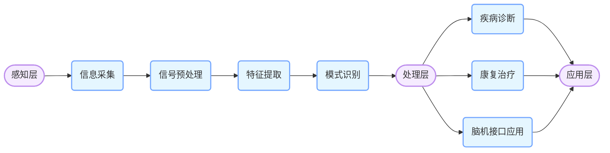

# 价值投资中的神经科技前景分析

> 关键词：价值投资、神经科技、前景分析、市场潜力、技术挑战

> 摘要：本文聚焦于价值投资视角下的神经科技领域，旨在深入剖析神经科技的发展现状、核心技术原理、市场应用场景以及面临的挑战与机遇。通过对神经科技核心概念、算法原理、数学模型的详细阐述，结合实际项目案例和丰富的工具资源推荐，为价值投资者提供全面且深入的参考，以帮助其更好地理解神经科技的投资价值和未来发展趋势。

## 1. 背景介绍 
### 1.1 目的和范围
本报告的主要目的是从价值投资的角度全面分析神经科技领域的前景。随着科技的飞速发展，神经科技作为一个新兴且极具潜力的领域，吸引了越来越多投资者的关注。本报告将深入探讨神经科技的核心技术、市场应用、发展趋势以及面临的挑战，为投资者提供科学的决策依据。报告的范围涵盖神经科技的各个方面，包括但不限于神经监测、神经调控、神经接口技术等，并对全球范围内的相关市场和企业进行研究。

### 1.2 预期读者
本报告的预期读者主要包括价值投资者、金融分析师、科技行业研究者以及对神经科技领域感兴趣的专业人士。对于价值投资者而言，本报告将帮助他们评估神经科技领域的投资价值和风险；金融分析师可以从中获取有关神经科技市场的详细信息，为客户提供专业的投资建议；科技行业研究者能够了解神经科技的最新发展动态和技术趋势；而对神经科技感兴趣的专业人士则可以通过本报告深入了解该领域的全貌。

### 1.3 文档结构概述
本报告共分为十个部分。第一部分为背景介绍，阐述报告的目的、范围、预期读者和文档结构；第二部分介绍神经科技的核心概念与联系，包括相关原理和架构，并通过文本示意图和 Mermaid 流程图进行说明；第三部分详细讲解核心算法原理和具体操作步骤，同时给出 Python 源代码示例；第四部分介绍神经科技的数学模型和公式，并进行详细讲解和举例说明；第五部分通过实际项目案例，展示神经科技在实际应用中的代码实现和详细解释；第六部分分析神经科技的实际应用场景；第七部分推荐相关的学习资源、开发工具框架和论文著作；第八部分总结神经科技的未来发展趋势与挑战；第九部分为附录，解答常见问题；第十部分提供扩展阅读和参考资料。

### 1.4 术语表
#### 1.4.1 核心术语定义
- **神经科技（Neuroscience Technology）**：融合了神经科学、工程学、计算机科学等多学科知识，旨在研究和开发能够监测、调控和修复神经系统功能的技术和方法。
- **神经监测（Neural Monitoring）**：通过各种技术手段，实时记录和分析神经系统的电活动、化学信号等信息，以了解神经系统的功能状态和变化。
- **神经调控（Neural Modulation）**：利用物理、化学等方法，对神经系统的活动进行调节和干预，以治疗神经系统疾病或改善神经系统功能。
- **神经接口技术（Neural Interface Technology）**：建立神经系统与外部设备之间的信息交互通道，实现神经系统与外界的信息传输和控制。

#### 1.4.2 相关概念解释
- **脑机接口（Brain-Computer Interface，BCI）**：是一种特殊的神经接口技术，它允许大脑直接与计算机或其他外部设备进行通信，无需通过传统的肌肉运动。
- **神经芯片（Neural Chip）**：是一种集成了多个神经元模型和信号处理电路的芯片，能够模拟神经系统的功能，用于神经计算和神经信号处理。
- **神经反馈（Neural Feedback）**：通过实时监测神经系统的活动，并将监测结果反馈给个体，使其能够有意识地调节自己的神经系统活动，以达到改善身心健康的目的。

#### 1.4.3 缩略词列表
- **BCI**：Brain-Computer Interface（脑机接口）
- **EEG**：Electroencephalogram（脑电图）
- **fMRI**：Functional Magnetic Resonance Imaging（功能磁共振成像）
- **TMS**：Transcranial Magnetic Stimulation（经颅磁刺激）

## 2. 核心概念与联系 

### 核心概念原理
神经科技的核心在于对神经系统的深入理解和有效干预。神经系统是人体最为复杂和重要的系统之一，它由神经元、神经胶质细胞等组成，通过电信号和化学信号进行信息传递和处理。神经科技的目标就是利用各种技术手段，监测、调控和修复神经系统的功能。

例如，神经监测技术可以通过脑电图（EEG）、功能磁共振成像（fMRI）等方法，记录大脑的电活动和血流变化，从而了解大脑的功能状态。神经调控技术则可以通过经颅磁刺激（TMS）、深部脑刺激（DBS）等方法，调节大脑的神经活动，治疗神经系统疾病。神经接口技术则可以建立大脑与外部设备之间的信息交互通道，实现大脑对外部设备的控制，或者将外部信息反馈给大脑。

### 架构的文本示意图
神经科技的架构可以分为三个层次：感知层、处理层和应用层。

感知层主要负责采集神经系统的信息，包括脑电图、肌电图、眼动图等。这些信息可以通过各种传感器和监测设备进行采集，如电极帽、穿戴式传感器等。

处理层主要负责对采集到的神经系统信息进行处理和分析，包括信号滤波、特征提取、模式识别等。这些处理和分析可以通过计算机算法和模型来实现，如机器学习算法、深度学习模型等。

应用层主要负责将处理和分析后的神经系统信息应用于实际场景，包括神经疾病诊断、神经康复治疗、脑机接口应用等。这些应用可以通过各种医疗设备和系统来实现，如神经监测仪、神经调控器、脑机接口设备等。

### Mermaid 流程图


## 3. 核心算法原理 & 具体操作步骤 

### 核心算法原理
在神经科技中，机器学习和深度学习算法是常用的核心算法。以脑电图信号处理为例，我们可以使用卷积神经网络（CNN）来进行脑电信号的分类和识别。

卷积神经网络是一种深度学习模型，它通过卷积层、池化层和全连接层来自动提取输入数据的特征。在脑电信号处理中，卷积层可以自动提取脑电信号的时域和频域特征，池化层可以对提取的特征进行降维和压缩，全连接层可以对提取的特征进行分类和识别。

### 具体操作步骤
1. **数据采集**：使用脑电图设备采集脑电信号数据。
2. **数据预处理**：对采集到的脑电信号数据进行滤波、去噪等预处理操作，以提高信号的质量。
3. **特征提取**：使用卷积神经网络对预处理后的脑电信号数据进行特征提取。
4. **模型训练**：使用提取的特征对卷积神经网络进行训练，以学习脑电信号的分类和识别规则。
5. **模型评估**：使用测试数据集对训练好的卷积神经网络进行评估，以验证模型的性能。
6. **模型应用**：将训练好的卷积神经网络应用于实际场景，如神经疾病诊断、脑机接口应用等。

### Python 源代码示例
```python
import numpy as np
import tensorflow as tf
from tensorflow.keras import layers, models

# 生成模拟脑电信号数据
def generate_eeg_data(num_samples, num_channels, num_time_steps):
    return np.random.randn(num_samples, num_channels, num_time_steps)

# 生成模拟标签数据
def generate_labels(num_samples):
    return np.random.randint(0, 2, num_samples)

# 构建卷积神经网络模型
def build_cnn_model(num_channels, num_time_steps):
    model = models.Sequential()
    model.add(layers.Conv1D(32, 3, activation='relu', input_shape=(num_channels, num_time_steps)))
    model.add(layers.MaxPooling1D(2))
    model.add(layers.Conv1D(64, 3, activation='relu'))
    model.add(layers.MaxPooling1D(2))
    model.add(layers.Flatten())
    model.add(layers.Dense(64, activation='relu'))
    model.add(layers.Dense(1, activation='sigmoid'))
    model.compile(optimizer='adam', loss='binary_crossentropy', metrics=['accuracy'])
    return model

# 数据生成
num_samples = 1000
num_channels = 16
num_time_steps = 128
eeg_data = generate_eeg_data(num_samples, num_channels, num_time_steps)
labels = generate_labels(num_samples)

# 划分训练集和测试集
train_size = int(0.8 * num_samples)
train_data = eeg_data[:train_size]
train_labels = labels[:train_size]
test_data = eeg_data[train_size:]
test_labels = labels[train_size:]

# 构建模型
model = build_cnn_model(num_channels, num_time_steps)

# 模型训练
model.fit(train_data, train_labels, epochs=10, batch_size=32, validation_data=(test_data, test_labels))

# 模型评估
test_loss, test_acc = model.evaluate(test_data, test_labels)
print(f"Test accuracy: {test_acc}")
```

## 4. 数学模型和公式 & 详细讲解 & 举例说明 

### 数学模型
在神经科技中，常用的数学模型包括线性回归模型、逻辑回归模型、支持向量机模型、卷积神经网络模型等。以逻辑回归模型为例，它是一种用于二分类问题的概率模型，其数学表达式为：

$$P(y=1|x)=\frac{1}{1 + e^{-(w^T x + b)}}$$

其中，$x$ 是输入特征向量，$w$ 是权重向量，$b$ 是偏置项，$P(y=1|x)$ 是输入特征向量 $x$ 属于正类的概率。

### 公式详细讲解
逻辑回归模型的核心思想是通过对输入特征向量进行线性组合，然后通过 sigmoid 函数将线性组合的结果映射到 $[0, 1]$ 区间，得到输入特征向量属于正类的概率。sigmoid 函数的数学表达式为：

$$\sigma(z)=\frac{1}{1 + e^{-z}}$$

其中，$z = w^T x + b$ 是线性组合的结果。sigmoid 函数具有以下性质：
- 当 $z \to +\infty$ 时，$\sigma(z) \to 1$；
- 当 $z \to -\infty$ 时，$\sigma(z) \to 0$；
- 当 $z = 0$ 时，$\sigma(z) = 0.5$。

### 举例说明
假设我们有一个二分类问题，输入特征向量 $x = [x_1, x_2]$，权重向量 $w = [w_1, w_2]$，偏置项 $b$。则线性组合的结果为：

$$z = w_1 x_1 + w_2 x_2 + b$$

输入特征向量 $x$ 属于正类的概率为：

$$P(y=1|x)=\frac{1}{1 + e^{-(w_1 x_1 + w_2 x_2 + b)}}$$

我们可以通过最大似然估计的方法来估计权重向量 $w$ 和偏置项 $b$ 的值，使得模型在训练数据集上的似然函数最大。

## 5. 项目实战：代码实际案例和详细解释说明 

### 5.1  开发环境搭建
在进行神经科技项目实战之前，我们需要搭建相应的开发环境。以下是具体的搭建步骤：
1. **安装 Python**：建议安装 Python 3.7 及以上版本。可以从 Python 官方网站（https://www.python.org/downloads/）下载并安装。
2. **安装 Anaconda**：Anaconda 是一个用于科学计算的 Python 发行版，它包含了许多常用的科学计算库和工具。可以从 Anaconda 官方网站（https://www.anaconda.com/products/individual）下载并安装。
3. **创建虚拟环境**：使用 Anaconda 命令行工具创建一个新的虚拟环境，例如：
```bash
conda create -n neurotech python=3.8
conda activate neurotech
```
4. **安装必要的库**：在虚拟环境中安装必要的库，例如：
```bash
pip install numpy tensorflow scikit-learn matplotlib
```

### 5.2  源代码详细实现和代码解读
以下是一个基于 Python 和 TensorFlow 的简单神经科技项目实战代码示例，用于脑电信号的分类：

```python
import numpy as np
import tensorflow as tf
from tensorflow.keras import layers, models
from sklearn.model_selection import train_test_split
import matplotlib.pyplot as plt

# 生成模拟脑电信号数据
def generate_eeg_data(num_samples, num_channels, num_time_steps):
    return np.random.randn(num_samples, num_channels, num_time_steps)

# 生成模拟标签数据
def generate_labels(num_samples):
    return np.random.randint(0, 2, num_samples)

# 构建卷积神经网络模型
def build_cnn_model(num_channels, num_time_steps):
    model = models.Sequential()
    model.add(layers.Conv1D(32, 3, activation='relu', input_shape=(num_channels, num_time_steps)))
    model.add(layers.MaxPooling1D(2))
    model.add(layers.Conv1D(64, 3, activation='relu'))
    model.add(layers.MaxPooling1D(2))
    model.add(layers.Flatten())
    model.add(layers.Dense(64, activation='relu'))
    model.add(layers.Dense(1, activation='sigmoid'))
    model.compile(optimizer='adam', loss='binary_crossentropy', metrics=['accuracy'])
    return model

# 数据生成
num_samples = 1000
num_channels = 16
num_time_steps = 128
eeg_data = generate_eeg_data(num_samples, num_channels, num_time_steps)
labels = generate_labels(num_samples)

# 划分训练集和测试集
train_data, test_data, train_labels, test_labels = train_test_split(eeg_data, labels, test_size=0.2, random_state=42)

# 构建模型
model = build_cnn_model(num_channels, num_time_steps)

# 模型训练
history = model.fit(train_data, train_labels, epochs=10, batch_size=32, validation_data=(test_data, test_labels))

# 模型评估
test_loss, test_acc = model.evaluate(test_data, test_labels)
print(f"Test accuracy: {test_acc}")

# 绘制训练过程中的损失和准确率曲线
plt.plot(history.history['accuracy'], label='Training accuracy')
plt.plot(history.history['val_accuracy'], label='Validation accuracy')
plt.plot(history.history['loss'], label='Training loss')
plt.plot(history.history['val_loss'], label='Validation loss')
plt.xlabel('Epoch')
plt.ylabel('Accuracy/Loss')
plt.legend()
plt.show()
```

### 代码解读与分析
1. **数据生成**：使用 `generate_eeg_data` 函数生成模拟脑电信号数据，使用 `generate_labels` 函数生成模拟标签数据。
2. **数据划分**：使用 `train_test_split` 函数将生成的数据划分为训练集和测试集。
3. **模型构建**：使用 `build_cnn_model` 函数构建卷积神经网络模型，该模型包含两个卷积层、两个池化层、一个全连接层和一个输出层。
4. **模型训练**：使用 `model.fit` 函数对模型进行训练，指定训练数据集、验证数据集、训练轮数和批量大小。
5. **模型评估**：使用 `model.evaluate` 函数对训练好的模型进行评估，得到测试集的损失和准确率。
6. **结果可视化**：使用 `matplotlib` 库绘制训练过程中的损失和准确率曲线，以便直观地观察模型的训练效果。

## 6. 实际应用场景 
神经科技在医疗、教育、娱乐、军事等领域都有着广泛的应用前景。以下是一些具体的应用场景：

### 医疗领域
- **神经疾病诊断**：通过神经监测技术，如脑电图、功能磁共振成像等，可以实时记录大脑的电活动和血流变化，从而帮助医生诊断神经系统疾病，如癫痫、帕金森病、阿尔茨海默病等。
- **神经康复治疗**：通过神经调控技术，如经颅磁刺激、深部脑刺激等，可以调节大脑的神经活动，促进神经功能的恢复，从而帮助患者进行神经康复治疗。
- **脑机接口辅助治疗**：通过脑机接口技术，患者可以使用大脑信号控制外部设备，如轮椅、假肢等，从而提高患者的生活自理能力和生活质量。

### 教育领域
- **认知能力评估**：通过神经监测技术，可以实时记录学生的大脑活动，从而了解学生的认知状态和学习效果，为个性化教育提供依据。
- **学习辅助**：通过神经反馈技术，学生可以了解自己的大脑活动状态，并通过训练调节自己的大脑活动，从而提高学习效率和学习成绩。

### 娱乐领域
- **沉浸式游戏体验**：通过脑机接口技术，玩家可以使用大脑信号控制游戏角色的动作和行为，从而实现更加沉浸式的游戏体验。
- **虚拟现实交互**：通过神经监测技术，可以实时记录玩家的大脑活动，从而根据玩家的情绪和认知状态调整虚拟现实场景，提供更加个性化的虚拟现实交互体验。

### 军事领域
- **士兵状态监测**：通过神经监测技术，可以实时记录士兵的大脑活动和生理状态，从而了解士兵的疲劳程度、压力状态等，为军事指挥提供决策依据。
- **脑控武器系统**：通过脑机接口技术，士兵可以使用大脑信号控制武器系统的发射和操作，从而提高武器系统的作战效能。

## 7. 工具和资源推荐
### 7.1 学习资源推荐
#### 7.1.1 书籍推荐
- 《神经科学原理》（*Principles of Neural Science*）：由 Eric R. Kandel、James H. Schwartz 和 Thomas M. Jessell 主编，是神经科学领域的经典教材，全面介绍了神经科学的基本原理和最新研究成果。
- 《脑机接口：原理与实践》（*Brain-Computer Interfaces: Principles and Practice*）：由 Gert Pfurtscheller、Fabrizio L. Bleichner 和 Stefan Haufe 主编，详细介绍了脑机接口技术的原理、方法和应用。
- 《深度学习》（*Deep Learning*）：由 Ian Goodfellow、Yoshua Bengio 和 Aaron Courville 主编，是深度学习领域的经典教材，全面介绍了深度学习的基本原理、算法和应用。

#### 7.1.2 在线课程
- Coursera 上的 “Neuroscience for Everyone” 课程：由 Duke University 开设，介绍了神经科学的基本概念和方法，适合初学者学习。
- edX 上的 “Brain-Computer Interfaces” 课程：由 ETH Zurich 开设，详细介绍了脑机接口技术的原理、方法和应用。
- Udemy 上的 “Deep Learning A-Z™: Hands-On Artificial Neural Networks” 课程：介绍了深度学习的基本原理和算法，并通过实际案例进行讲解。

#### 7.1.3 技术博客和网站
- Neuroscience News（https://neurosciencenews.com/）：提供神经科学领域的最新研究成果和新闻报道。
- BrainTech（https://braintech.com/）：专注于脑机接口技术的发展和应用，提供相关的技术文章和产品信息。
- Towards Data Science（https://towardsdatascience.com/）：提供人工智能、机器学习、深度学习等领域的技术文章和教程。

### 7.2 开发工具框架推荐
#### 7.2.1 IDE和编辑器
- PyCharm：是一款专门为 Python 开发设计的集成开发环境，提供了丰富的代码编辑、调试、版本控制等功能。
- Jupyter Notebook：是一种交互式的开发环境，支持 Python、R 等多种编程语言，适合进行数据分析和模型训练。
- Visual Studio Code：是一款轻量级的代码编辑器，支持多种编程语言和插件扩展，适合进行快速开发和调试。

#### 7.2.2 调试和性能分析工具
- TensorBoard：是 TensorFlow 提供的一款可视化工具，可以帮助用户可视化模型的训练过程、损失函数、准确率等指标。
- Py-Spy：是一款轻量级的 Python 性能分析工具，可以帮助用户分析 Python 代码的性能瓶颈。
- cProfile：是 Python 标准库中提供的一款性能分析工具，可以帮助用户分析 Python 代码的执行时间和调用次数。

#### 7.2.3 相关框架和库
- TensorFlow：是 Google 开发的一款开源深度学习框架，提供了丰富的深度学习模型和工具，支持 CPU、GPU 和 TPU 等多种计算设备。
- PyTorch：是 Facebook 开发的一款开源深度学习框架，提供了动态计算图和丰富的深度学习模型，适合进行研究和开发。
- Scikit-learn：是一款开源的机器学习库，提供了丰富的机器学习算法和工具，适合进行数据挖掘和数据分析。

### 7.3 相关论文著作推荐
#### 7.3.1 经典论文
- “Neurons and Networks: An Introduction to Behavioral Neuroscience”（《神经元与网络：行为神经科学导论》）：由 John H. Byrne 和 James H. Schwartz 主编，是神经科学领域的经典论文集，介绍了神经元和神经网络的基本原理和研究方法。
- “Brain-Computer Interfaces: A Review”（《脑机接口：综述》）：由 Gert Pfurtscheller 和 Florian H. Lotte 撰写，全面介绍了脑机接口技术的发展历程、原理、方法和应用。
- “Deep Learning in Neural Networks: An Overview”（《神经网络中的深度学习：综述》）：由 Jürgen Schmidhuber 撰写，是深度学习领域的经典综述论文，介绍了深度学习的发展历程、基本原理和应用。

#### 7.3.2 最新研究成果
- “Neural Engineering: Strategies for Interfacing with the Nervous System”（《神经工程：与神经系统接口的策略》）：由 Robert A. Normann 和 Warren M. Grill 主编，介绍了神经工程领域的最新研究成果和发展趋势。
- “Brain-Computer Interfaces for Rehabilitation: A Systematic Review”（《用于康复的脑机接口：系统评价》）：由 Ana C. Pereira 和 João F. P. Ventura 撰写，对脑机接口技术在康复领域的应用进行了系统评价。
- “Deep Learning for Brain Signal Analysis: A Review”（《用于脑信号分析的深度学习：综述》）：由 Yann LeCun、Yoshua Bengio 和 Geoffrey Hinton 撰写，介绍了深度学习在脑信号分析领域的最新研究成果和应用。

#### 7.3.3 应用案例分析
- “Case Studies in Brain-Computer Interfaces”（《脑机接口案例研究》）：由 Gert Pfurtscheller 和 Florian H. Lotte 主编，通过实际案例介绍了脑机接口技术在医疗、教育、娱乐等领域的应用。
- “Neural Technology in Healthcare: Case Studies and Best Practices”（《医疗保健中的神经科技：案例研究和最佳实践》）：由 Robert A. Normann 和 Warren M. Grill 主编，介绍了神经科技在医疗保健领域的应用案例和最佳实践。
- “Deep Learning Applications in Neuroscience: Case Studies and Future Directions”（《深度学习在神经科学中的应用：案例研究和未来方向》）：由 Yann LeCun、Yoshua Bengio 和 Geoffrey Hinton 主编，介绍了深度学习在神经科学领域的应用案例和未来发展方向。

## 8. 总结：未来发展趋势与挑战
### 未来发展趋势
- **多学科融合**：神经科技将与生物学、医学、工程学、计算机科学等多学科进行深度融合，推动神经科技的快速发展。
- **智能化和自动化**：随着人工智能和机器学习技术的不断发展，神经科技将实现智能化和自动化，提高神经监测、调控和诊断的准确性和效率。
- **个性化医疗**：神经科技将为个性化医疗提供有力支持，根据患者的个体差异制定个性化的治疗方案，提高治疗效果。
- **消费级应用**：神经科技将逐渐从医疗领域向消费级应用领域拓展，如智能穿戴设备、智能家居等，为人们的生活带来更多便利。

### 挑战
- **技术瓶颈**：神经科技目前还面临着一些技术瓶颈，如神经信号的高精度采集、处理和分析，神经调控的精准性和安全性等，需要进一步的研究和创新。
- **伦理和法律问题**：神经科技的发展涉及到一些伦理和法律问题，如脑机接口技术的隐私保护、人类自主性的影响等，需要建立相应的伦理和法律规范。
- **成本和普及性**：神经科技的设备和技术成本较高，限制了其在临床上的广泛应用和普及，需要降低成本，提高普及性。

## 9. 附录：常见问题与解答
### 问题 1：神经科技与人工智能有什么关系？
神经科技和人工智能有着密切的关系。神经科技为人工智能提供了灵感和模型，例如神经网络模型就是受到生物神经系统的启发而提出的。同时，人工智能技术也为神经科技的发展提供了有力支持，例如机器学习和深度学习算法可以用于神经信号的处理和分析，提高神经监测和诊断的准确性和效率。

### 问题 2：神经科技在医疗领域的应用前景如何？
神经科技在医疗领域有着广阔的应用前景。它可以用于神经疾病的诊断、治疗和康复，如癫痫、帕金森病、阿尔茨海默病等。同时，神经科技还可以用于脑机接口辅助治疗，帮助患者恢复运动功能和生活自理能力。随着技术的不断发展和进步，神经科技在医疗领域的应用将会越来越广泛。

### 问题 3：学习神经科技需要具备哪些知识和技能？
学习神经科技需要具备生物学、医学、工程学、计算机科学等多学科的知识和技能。具体来说，需要掌握神经科学的基本原理和方法，了解生物医学信号处理和分析的技术，掌握机器学习和深度学习的算法和模型，具备编程和软件开发的能力。

## 10. 扩展阅读 & 参考资料
### 扩展阅读
- 《神经科学前沿》（*Frontiers in Neuroscience*）：是一本国际知名的神经科学学术期刊，发表神经科学领域的最新研究成果和前沿进展。
- 《脑机接口杂志》（*Journal of Neural Engineering*）：是一本专注于脑机接口技术研究的学术期刊，发表脑机接口技术的原理、方法和应用方面的研究论文。
- 《自然神经科学》（*Nature Neuroscience*）：是一本国际顶尖的神经科学学术期刊，发表神经科学领域的重大研究成果和突破性进展。

### 参考资料
- Kandel, E. R., Schwartz, J. H., & Jessell, T. M. (2012). *Principles of Neural Science*. McGraw-Hill Education.
- Pfurtscheller, G., Bleichner, F. L., & Haufe, S. (2019). *Brain-Computer Interfaces: Principles and Practice*. MIT Press.
- Goodfellow, I., Bengio, Y., & Courville, A. (2016). *Deep Learning*. MIT Press.