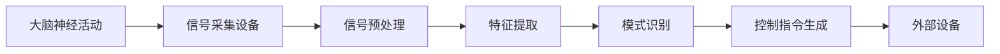

# 价值投资中的脑机接口技术前景

> 关键词：价值投资、脑机接口技术、神经科学、人工智能、市场前景、技术挑战、投资策略

> 摘要：本文聚焦于价值投资视角下的脑机接口技术前景。首先介绍了脑机接口技术的背景，包括其目的、预期读者等内容。接着阐述了脑机接口的核心概念、算法原理、数学模型等基础理论。通过项目实战案例展示了该技术的实际应用和代码实现。分析了脑机接口技术在医疗、娱乐、教育等多个领域的实际应用场景。推荐了学习该技术的相关工具和资源，包括书籍、在线课程、开发工具等。最后总结了脑机接口技术未来的发展趋势与挑战，并对常见问题进行了解答，为价值投资者深入了解脑机接口技术提供全面而专业的参考。

## 1. 背景介绍 
### 1.1 目的和范围
脑机接口技术作为近年来快速发展的前沿科技领域，其潜力和影响力逐渐受到各界的广泛关注。本文的目的在于从价值投资的角度深入剖析脑机接口技术的前景，旨在为投资者提供全面、深入的信息，帮助他们理解该技术的发展趋势、市场潜力以及投资价值。范围涵盖脑机接口技术的基本原理、发展现状、应用场景、技术挑战以及未来发展趋势等多个方面，同时结合实际案例和市场数据进行分析，以便投资者能够做出更为明智的投资决策。

### 1.2 预期读者
本文的预期读者主要包括对价值投资感兴趣的个人投资者、专业投资机构的研究人员、金融分析师以及关注科技发展趋势的行业人士。对于那些希望在新兴科技领域寻找投资机会，或者对脑机接口技术有深入了解需求的读者来说，本文将提供有价值的参考信息。

### 1.3 文档结构概述
本文将按照以下结构进行阐述：首先介绍脑机接口技术的背景信息，包括目的、预期读者等内容；接着详细讲解脑机接口的核心概念、算法原理和数学模型；通过项目实战案例展示该技术的实际应用和代码实现；分析脑机接口技术在多个领域的实际应用场景；推荐学习该技术的相关工具和资源；总结脑机接口技术未来的发展趋势与挑战；解答常见问题；最后提供扩展阅读和参考资料。

### 1.4 术语表
#### 1.4.1 核心术语定义
- **脑机接口（Brain - Computer Interface, BCI）**：也被称为脑机交互或脑机融合，是在人或动物脑（或者脑细胞的培养物）与外部设备间建立的直接连接通路。通过对神经系统电活动和特征信号的收集、识别及转化，脑机接口可将脑电信号转换为相应的动作或指令，从而实现大脑与外部设备的信息交互。
- **价值投资**：一种常见的投资策略，其核心思想是通过对资产的内在价值进行评估，寻找被市场低估的投资标的，以长期持有为主要投资方式，期望在资产价格回归其内在价值的过程中获得收益。

#### 1.4.2 相关概念解释
- **神经科学**：是研究神经系统的结构、功能、发育、遗传学、生物物理学、生理学、药理学及病理学的一门科学。脑机接口技术的发展离不开神经科学的支持，神经科学为脑机接口技术提供了关于大脑神经信号产生、传输和处理的理论基础。
- **人工智能**：是研究、开发用于模拟、延伸和扩展人的智能的理论、方法、技术及应用系统的一门新的技术科学。在脑机接口技术中，人工智能技术被广泛应用于脑电信号的处理、特征提取和模式识别等方面，以提高脑机接口系统的性能和准确性。

#### 1.4.3 缩略词列表
- **BCI**：Brain - Computer Interface，脑机接口
- **EEG**：Electroencephalogram，脑电图
- **EMG**：Electromyogram，肌电图
- **fMRI**：Functional Magnetic Resonance Imaging，功能磁共振成像

## 2. 核心概念与联系 

### 2.1 脑机接口技术的基本原理
脑机接口技术的基本原理是通过采集大脑产生的神经信号，对这些信号进行处理和分析，提取出其中包含的信息，然后将这些信息转换为相应的控制指令，以实现大脑与外部设备的信息交互。

大脑在进行各种认知、感知和运动活动时，会产生不同的神经电活动和代谢变化。这些神经信号可以通过多种方式进行检测和记录，常见的检测方法包括脑电图（EEG）、肌电图（EMG）、功能磁共振成像（fMRI）等。其中，脑电图是一种常用的非侵入式脑电信号检测方法，它通过在头皮上放置电极来记录大脑皮层的电活动。

采集到的脑电信号通常是非常微弱且复杂的，包含了大量的噪声和干扰。因此，需要对这些信号进行预处理，包括滤波、去噪、放大等操作，以提高信号的质量。然后，通过特征提取和模式识别技术，从预处理后的信号中提取出与特定认知或运动意图相关的特征，并将其分类为不同的模式。最后，根据这些模式生成相应的控制指令，驱动外部设备完成相应的动作。

### 2.2 脑机接口技术的架构
脑机接口系统通常由以下几个主要部分组成：

|部分|功能|
|---|---|
|信号采集模块|负责采集大脑产生的神经信号，常用的设备包括脑电图仪、肌电图仪、功能磁共振成像仪等。|
|信号处理模块|对采集到的信号进行预处理，包括滤波、去噪、放大等操作，以提高信号的质量。|
|特征提取模块|从预处理后的信号中提取出与特定认知或运动意图相关的特征。|
|模式识别模块|将提取的特征分类为不同的模式，以识别大脑的意图。|
|控制指令生成模块|根据模式识别的结果生成相应的控制指令。|
|外部设备驱动模块|将控制指令转换为外部设备能够识别的信号，驱动外部设备完成相应的动作。|

### 2.3 脑机接口技术与其他领域的联系
脑机接口技术与神经科学、人工智能、生物医学工程等多个领域密切相关。

与神经科学的联系：神经科学为脑机接口技术提供了关于大脑神经信号产生、传输和处理的理论基础。通过对神经科学的研究，我们可以更好地理解大脑的工作机制，从而设计出更加有效的脑机接口系统。

与人工智能的联系：人工智能技术在脑机接口技术中发挥着重要作用。人工智能算法可以用于脑电信号的处理、特征提取和模式识别，提高脑机接口系统的性能和准确性。例如，机器学习算法可以自动学习脑电信号的特征和模式，从而实现更加准确的大脑意图识别。

与生物医学工程的联系：生物医学工程为脑机接口技术提供了硬件设备和技术支持。例如，生物医学工程领域的研究人员可以设计和开发更加先进的脑电信号采集设备，提高信号采集的质量和精度。

### 2.4 脑机接口技术核心架构的文本示意图
脑机接口技术的核心架构可以用以下文本示意图表示：

大脑神经活动 -> 信号采集设备（如 EEG 电极、fMRI 设备等） -> 信号预处理（滤波、去噪、放大） -> 特征提取（提取与意图相关的特征） -> 模式识别（分类大脑意图） -> 控制指令生成 -> 外部设备（如假肢、轮椅、计算机等）

### 2.5 Mermaid 流程图


## 3. 核心算法原理 & 具体操作步骤 

### 3.1 脑电信号预处理算法原理
脑电信号预处理的主要目的是去除噪声和干扰，提高信号的质量。常用的预处理算法包括滤波算法和去噪算法。

#### 3.1.1 滤波算法
滤波算法是一种常用的信号处理方法，用于去除信号中的特定频率成分。在脑电信号处理中，常用的滤波算法包括低通滤波、高通滤波和带通滤波。

低通滤波用于去除高频噪声，保留低频信号成分。高通滤波用于去除低频噪声，保留高频信号成分。带通滤波则用于保留特定频率范围内的信号成分。

以下是一个使用 Python 实现的简单低通滤波示例：

```python
import numpy as np
from scipy.signal import butter, filtfilt

def butter_lowpass(cutoff, fs, order=5):
    nyquist = 0.5 * fs
    normal_cutoff = cutoff / nyquist
    b, a = butter(order, normal_cutoff, btype='low', analog=False)
    return b, a

def butter_lowpass_filter(data, cutoff, fs, order=5):
    b, a = butter_lowpass(cutoff, fs, order=order)
    y = filtfilt(b, a, data)
    return y

# 示例数据
fs = 1000  # 采样频率
t = np.linspace(0, 1, fs, endpoint=False)
data = np.sin(2 * np.pi * 50 * t) + 0.5 * np.sin(2 * np.pi * 150 * t)  # 包含 50Hz 和 150Hz 信号

# 低通滤波参数
cutoff = 100  # 截止频率
order = 5

# 进行低通滤波
filtered_data = butter_lowpass_filter(data, cutoff, fs, order)
```

#### 3.1.2 去噪算法
去噪算法用于去除信号中的随机噪声。常用的去噪算法包括小波去噪、经验模态分解（EMD）等。

以下是一个使用 Python 实现的小波去噪示例：

```python
import pywt
import numpy as np

def wavelet_denoise(data, wavelet='db4', level=1):
    coeffs = pywt.wavedec(data, wavelet, level=level)
    threshold = np.std(coeffs[-level]) * np.sqrt(2 * np.log(len(data)))
    coeffs[1:] = (pywt.threshold(i, value=threshold, mode='soft') for i in coeffs[1:])
    return pywt.waverec(coeffs, wavelet)

# 示例数据
data = np.sin(2 * np.pi * 50 * np.linspace(0, 1, 1000)) + 0.1 * np.random.randn(1000)

# 进行小波去噪
denoised_data = wavelet_denoise(data)
```

### 3.2 特征提取算法原理
特征提取的目的是从预处理后的脑电信号中提取出与特定认知或运动意图相关的特征。常用的特征提取方法包括时域特征提取、频域特征提取和时频域特征提取。

#### 3.2.1 时域特征提取
时域特征是指信号在时间域上的特征，常用的时域特征包括均值、方差、标准差、峰峰值等。

以下是一个使用 Python 实现的时域特征提取示例：

```python
import numpy as np

def extract_time_domain_features(data):
    mean_value = np.mean(data)
    variance = np.var(data)
    std_deviation = np.std(data)
    peak_to_peak = np.max(data) - np.min(data)
    return mean_value, variance, std_deviation, peak_to_peak

# 示例数据
data = np.sin(2 * np.pi * 50 * np.linspace(0, 1, 1000))

# 提取时域特征
mean_val, var, std, p2p = extract_time_domain_features(data)
```

#### 3.2.2 频域特征提取
频域特征是指信号在频率域上的特征，常用的频域特征包括功率谱密度、中心频率、带宽等。

以下是一个使用 Python 实现的频域特征提取示例：

```python
import numpy as np
from scipy.signal import welch

def extract_frequency_domain_features(data, fs):
    f, Pxx = welch(data, fs)
    power_spectrum_density = Pxx
    center_frequency = np.sum(f * Pxx) / np.sum(Pxx)
    bandwidth = np.max(f) - np.min(f)
    return power_spectrum_density, center_frequency, bandwidth

# 示例数据
fs = 1000
data = np.sin(2 * np.pi * 50 * np.linspace(0, 1, fs))

# 提取频域特征
psd, cf, bw = extract_frequency_domain_features(data, fs)
```

### 3.3 模式识别算法原理
模式识别的目的是将提取的特征分类为不同的模式，以识别大脑的意图。常用的模式识别算法包括支持向量机（SVM）、神经网络、决策树等。

以下是一个使用 Python 实现的支持向量机模式识别示例：

```python
from sklearn import svm
from sklearn.model_selection import train_test_split
import numpy as np

# 示例数据
X = np.random.rand(100, 10)  # 特征矩阵
y = np.random.randint(0, 2, 100)  # 标签

# 划分训练集和测试集
X_train, X_test, y_train, y_test = train_test_split(X, y, test_size=0.2, random_state=42)

# 创建 SVM 分类器
clf = svm.SVC(kernel='linear')

# 训练模型
clf.fit(X_train, y_train)

# 预测
y_pred = clf.predict(X_test)
```

### 3.4 具体操作步骤
1. **信号采集**：使用合适的信号采集设备（如脑电图仪）采集大脑产生的神经信号。
2. **信号预处理**：对采集到的信号进行滤波、去噪等预处理操作，提高信号的质量。
3. **特征提取**：从预处理后的信号中提取出与特定认知或运动意图相关的特征。
4. **模式识别**：使用模式识别算法将提取的特征分类为不同的模式，以识别大脑的意图。
5. **控制指令生成**：根据模式识别的结果生成相应的控制指令。
6. **外部设备驱动**：将控制指令转换为外部设备能够识别的信号，驱动外部设备完成相应的动作。

## 4. 数学模型和公式 & 详细讲解 & 举例说明 

### 4.1 脑电信号的数学模型
脑电信号可以用以下数学模型表示：

$$x(t) = s(t) + n(t)$$

其中，$x(t)$ 表示采集到的脑电信号，$s(t)$ 表示真实的脑电信号，$n(t)$ 表示噪声信号。

### 4.2 滤波算法的数学原理
#### 4.2.1 低通滤波
低通滤波器的传递函数可以表示为：

$$H(s)=\frac{1}{1 + (\frac{s}{\omega_c})^n}$$

其中，$s$ 是复变量，$\omega_c$ 是截止频率，$n$ 是滤波器的阶数。

在离散时间域中，低通滤波器的差分方程可以表示为：

$$y[n]=\sum_{i = 0}^{M}b[i]x[n - i]-\sum_{j = 1}^{N}a[j]y[n - j]$$

其中，$x[n]$ 是输入信号，$y[n]$ 是输出信号，$b[i]$ 和 $a[j]$ 是滤波器的系数。

#### 4.2.2 小波去噪
小波去噪的基本思想是将信号分解为不同尺度的小波系数，然后对小波系数进行阈值处理，去除噪声成分，最后通过小波重构得到去噪后的信号。

小波分解可以表示为：

$$x[n]=\sum_{j = 0}^{J}\sum_{k}c_{j,k}\psi_{j,k}[n]+\sum_{k}a_{J,k}\varphi_{J,k}[n]$$

其中，$c_{j,k}$ 是小波系数，$a_{J,k}$ 是近似系数，$\psi_{j,k}[n]$ 和 $\varphi_{J,k}[n]$ 分别是小波基函数和尺度函数。

### 4.3 特征提取的数学公式
#### 4.3.1 时域特征
- **均值**：
$$\bar{x}=\frac{1}{N}\sum_{i = 1}^{N}x[i]$$

其中，$x[i]$ 是信号的第 $i$ 个样本，$N$ 是样本总数。

- **方差**：
$$\sigma^2=\frac{1}{N}\sum_{i = 1}^{N}(x[i]-\bar{x})^2$$

#### 4.3.2 频域特征
- **功率谱密度**：
$$P_{xx}(f)=\lim_{T\rightarrow\infty}\frac{1}{T}E[|X_T(f)|^2]$$

其中，$X_T(f)$ 是信号 $x(t)$ 在时间区间 $[-T/2, T/2]$ 上的傅里叶变换。

### 4.4 模式识别的数学原理
#### 4.4.1 支持向量机
支持向量机的目标是找到一个最优的超平面，将不同类别的样本分开。对于线性可分的情况，支持向量机的优化问题可以表示为：

$$\min_{\mathbf{w},b}\frac{1}{2}\|\mathbf{w}\|^2$$

$$\text{s.t. }y_i(\mathbf{w}^T\mathbf{x}_i + b)\geq1, i = 1,\cdots,n$$

其中，$\mathbf{w}$ 是超平面的法向量，$b$ 是偏置，$\mathbf{x}_i$ 是样本，$y_i$ 是样本的标签。

### 4.5 举例说明
假设我们采集到一段脑电信号 $x(t)$，其采样频率为 $fs = 1000Hz$，信号时长为 $T = 1s$。我们可以使用上述的滤波、特征提取和模式识别算法对该信号进行处理。

首先，对信号进行低通滤波，截止频率为 $cutoff = 100Hz$，滤波器阶数为 $n = 5$。然后，提取滤波后信号的时域特征和频域特征。最后，使用支持向量机对提取的特征进行分类，以识别大脑的意图。

```python
import numpy as np
from scipy.signal import butter, filtfilt, welch
from sklearn import svm
from sklearn.model_selection import train_test_split

# 示例数据生成
fs = 1000
t = np.linspace(0, 1, fs, endpoint=False)
x = np.sin(2 * np.pi * 50 * t) + 0.5 * np.sin(2 * np.pi * 150 * t) + 0.1 * np.random.randn(fs)

# 低通滤波
def butter_lowpass(cutoff, fs, order=5):
    nyquist = 0.5 * fs
    normal_cutoff = cutoff / nyquist
    b, a = butter(order, normal_cutoff, btype='low', analog=False)
    return b, a

def butter_lowpass_filter(data, cutoff, fs, order=5):
    b, a = butter_lowpass(cutoff, fs, order=order)
    y = filtfilt(b, a, data)
    return y

cutoff = 100
order = 5
filtered_x = butter_lowpass_filter(x, cutoff, fs, order)

# 特征提取
# 时域特征
mean_value = np.mean(filtered_x)
variance = np.var(filtered_x)
std_deviation = np.std(filtered_x)
peak_to_peak = np.max(filtered_x) - np.min(filtered_x)

# 频域特征
f, Pxx = welch(filtered_x, fs)
power_spectrum_density = Pxx
center_frequency = np.sum(f * Pxx) / np.sum(Pxx)
bandwidth = np.max(f) - np.min(f)

# 模式识别示例数据
X = np.array([[mean_value, variance, std_deviation, peak_to_peak, center_frequency, bandwidth]])
y = np.array([0])

# 划分训练集和测试集
X_train, X_test, y_train, y_test = train_test_split(X, y, test_size=0.2, random_state=42)

# 创建 SVM 分类器
clf = svm.SVC(kernel='linear')

# 训练模型
clf.fit(X_train, y_train)

# 预测
y_pred = clf.predict(X_test)
```

## 5. 项目实战：代码实际案例和详细解释说明 

### 5.1  开发环境搭建
#### 5.1.1 安装 Python
首先，需要安装 Python 环境。可以从 Python 官方网站（https://www.python.org/downloads/） 下载适合自己操作系统的 Python 安装包，并按照安装向导进行安装。

#### 5.1.2 安装必要的库
在命令行中使用以下命令安装必要的库：

```sh
pip install numpy scipy scikit-learn pywt
```

### 5.2  源代码详细实现和代码解读
以下是一个完整的脑机接口信号处理和模式识别的代码示例：

```python
import numpy as np
from scipy.signal import butter, filtfilt, welch
from sklearn import svm
from sklearn.model_selection import train_test_split
import pywt

# 低通滤波函数
def butter_lowpass(cutoff, fs, order=5):
    nyquist = 0.5 * fs
    normal_cutoff = cutoff / nyquist
    b, a = butter(order, normal_cutoff, btype='low', analog=False)
    return b, a

def butter_lowpass_filter(data, cutoff, fs, order=5):
    b, a = butter_lowpass(cutoff, fs, order=order)
    y = filtfilt(b, a, data)
    return y

# 小波去噪函数
def wavelet_denoise(data, wavelet='db4', level=1):
    coeffs = pywt.wavedec(data, wavelet, level=level)
    threshold = np.std(coeffs[-level]) * np.sqrt(2 * np.log(len(data)))
    coeffs[1:] = (pywt.threshold(i, value=threshold, mode='soft') for i in coeffs[1:])
    return pywt.waverec(coeffs, wavelet)

# 时域特征提取函数
def extract_time_domain_features(data):
    mean_value = np.mean(data)
    variance = np.var(data)
    std_deviation = np.std(data)
    peak_to_peak = np.max(data) - np.min(data)
    return mean_value, variance, std_deviation, peak_to_peak

# 频域特征提取函数
def extract_frequency_domain_features(data, fs):
    f, Pxx = welch(data, fs)
    power_spectrum_density = Pxx
    center_frequency = np.sum(f * Pxx) / np.sum(Pxx)
    bandwidth = np.max(f) - np.min(f)
    return power_spectrum_density, center_frequency, bandwidth

# 示例数据生成
fs = 1000
t = np.linspace(0, 1, fs, endpoint=False)
data1 = np.sin(2 * np.pi * 50 * t) + 0.1 * np.random.randn(fs)  # 类别 0
data2 = np.sin(2 * np.pi * 100 * t) + 0.1 * np.random.randn(fs)  # 类别 1

# 数据预处理
filtered_data1 = butter_lowpass_filter(data1, 80, fs)
denoised_data1 = wavelet_denoise(filtered_data1)

filtered_data2 = butter_lowpass_filter(data2, 80, fs)
denoised_data2 = wavelet_denoise(filtered_data2)

# 特征提取
time_features1 = extract_time_domain_features(denoised_data1)
freq_features1 = extract_frequency_domain_features(denoised_data1, fs)
features1 = np.concatenate((time_features1, freq_features1[1:]))

time_features2 = extract_time_domain_features(denoised_data2)
freq_features2 = extract_frequency_domain_features(denoised_data2, fs)
features2 = np.concatenate((time_features2, freq_features2[1:]))

# 构建数据集
X = np.vstack((features1, features2))
y = np.array([0, 1])

# 划分训练集和测试集
X_train, X_test, y_train, y_test = train_test_split(X, y, test_size=0.2, random_state=42)

# 创建 SVM 分类器
clf = svm.SVC(kernel='linear')

# 训练模型
clf.fit(X_train, y_train)

# 预测
y_pred = clf.predict(X_test)

print("预测结果:", y_pred)
```

### 5.3  代码解读与分析
1. **信号预处理**：
    - `butter_lowpass` 和 `butter_lowpass_filter` 函数实现了低通滤波，用于去除高频噪声。
    - `wavelet_denoise` 函数实现了小波去噪，进一步去除信号中的随机噪声。

2. **特征提取**：
    - `extract_time_domain_features` 函数提取时域特征，如均值、方差等。
    - `extract_frequency_domain_features` 函数提取频域特征，如中心频率、带宽等。

3. **模式识别**：
    - 使用 `sklearn` 库中的 `svm.SVC` 类创建支持向量机分类器。
    - 将提取的特征划分为训练集和测试集，训练模型并进行预测。

通过这个项目实战，我们可以看到如何将脑机接口信号处理的各个步骤结合起来，实现大脑意图的识别。

## 6. 实际应用场景 
### 6.1 医疗领域
- **康复治疗**：脑机接口技术可以帮助瘫痪患者恢复运动功能。通过采集患者大脑的神经信号，识别其运动意图，然后将这些意图转换为控制指令，驱动外部设备（如假肢、轮椅等）完成相应的动作。例如，一些研究机构已经开发出了基于脑机接口技术的假肢，能够根据患者大脑的信号实现较为自然的手部动作。
- **神经系统疾病诊断**：脑机接口技术可以用于检测和诊断神经系统疾病，如癫痫、帕金森病等。通过分析患者大脑的神经信号特征，可以早期发现疾病的迹象，为疾病的诊断和治疗提供依据。

### 6.2 娱乐领域
- **虚拟现实（VR）和增强现实（AR）**：脑机接口技术可以增强 VR 和 AR 体验的沉浸感。通过采集用户大脑的神经信号，了解用户的情感和注意力状态，从而实时调整虚拟环境的内容和交互方式。例如，当用户感到兴奋时，虚拟环境可以增加一些刺激的元素；当用户注意力不集中时，虚拟环境可以发出提醒。
- **游戏**：脑机接口技术可以为游戏带来全新的交互方式。玩家可以通过大脑的信号控制游戏角色的动作，实现更加自然和直观的游戏体验。例如，一些游戏已经实现了通过玩家的脑电信号控制游戏角色的跳跃、移动等动作。

### 6.3 教育领域
- **个性化学习**：脑机接口技术可以实时监测学生的学习状态和认知水平，为学生提供个性化的学习方案。通过分析学生大脑的神经信号，了解学生在学习过程中的注意力、理解能力等情况，教师可以根据这些信息调整教学内容和方法，提高学习效果。
- **认知训练**：脑机接口技术可以用于认知训练，帮助学生提高注意力、记忆力等认知能力。例如，一些认知训练系统可以通过采集学生大脑的神经信号，反馈学生的认知状态，引导学生进行有针对性的训练。

### 6.4 工业领域
- **人机协作**：在工业生产中，脑机接口技术可以实现人机之间更加高效的协作。工人可以通过大脑的信号控制机器人完成一些复杂的任务，提高生产效率和质量。例如，在汽车制造行业，工人可以通过脑机接口技术控制机器人进行零件的装配。
- **安全监测**：脑机接口技术可以用于监测工人的疲劳和压力状态，保障工人的安全。当检测到工人处于疲劳或高压力状态时，系统可以及时发出提醒，避免事故的发生。

## 7. 工具和资源推荐
### 7.1 学习资源推荐
#### 7.1.1 书籍推荐
- 《神经科学：探索脑》：这本书全面介绍了神经科学的基本概念、理论和研究方法，为理解脑机接口技术的神经科学基础提供了重要的参考。
- 《Python 机器学习实战》：该书详细介绍了 Python 在机器学习领域的应用，包括各种机器学习算法的原理和实现，对于学习脑机接口技术中的模式识别算法非常有帮助。
- 《信号与系统》：这本书系统地阐述了信号与系统的基本理论和分析方法，是学习脑机接口技术中信号处理部分的经典教材。

#### 7.1.2 在线课程
- Coursera 上的 “Neural Networks and Deep Learning”：该课程由深度学习领域的知名专家 Andrew Ng 教授授课，深入介绍了神经网络和深度学习的基本原理和应用，对于理解脑机接口技术中的人工智能算法有很大的帮助。
- edX 上的 “Introduction to Biomedical Engineering”：这门课程介绍了生物医学工程的基本概念和技术，包括生物信号处理、医学成像等内容，与脑机接口技术密切相关。

#### 7.1.3 技术博客和网站
- IEEE Xplore：这是电气和电子工程师协会（IEEE）的数字图书馆，提供了大量关于脑机接口技术、神经科学、人工智能等领域的学术论文和技术报告。
- arXiv：一个预印本平台，包含了许多最新的学术研究成果，其中有很多关于脑机接口技术的前沿研究。
- Medium 上的一些技术博客：如 Towards Data Science、Neural Networks、Brain - Computer Interfaces 等，这些博客上有很多关于脑机接口技术的科普文章和技术分享。

### 7.2 开发工具框架推荐
#### 7.2.1 IDE和编辑器
- PyCharm：一款功能强大的 Python 集成开发环境（IDE），提供了代码编辑、调试、版本控制等功能，非常适合开发脑机接口相关的 Python 代码。
- Jupyter Notebook：一种交互式的开发环境，支持 Python、R 等多种编程语言。可以方便地进行代码编写、数据可视化和结果展示，对于脑机接口技术的实验和研究非常有用。

#### 7.2.2 调试和性能分析工具
- Visual Studio Code 的调试功能：可以对 Python 代码进行单步调试，查看变量的值和程序的执行流程，帮助定位代码中的问题。
- Profiler 工具：如 cProfile 和 line_profiler，可以对 Python 代码进行性能分析，找出代码中的性能瓶颈，提高代码的运行效率。

#### 7.2.3 相关框架和库
- NumPy：一个用于科学计算的 Python 库，提供了高效的数组操作和数学函数，是脑机接口技术中信号处理和特征提取的基础库。
- SciPy：一个基于 NumPy 的科学计算库，提供了更多的科学计算功能，如信号处理、优化算法等。
- scikit - learn：一个用于机器学习的 Python 库，提供了各种机器学习算法的实现，如支持向量机、神经网络等，可用于脑机接口技术中的模式识别。

### 7.3 相关论文著作推荐
#### 7.3.1 经典论文
- “Brain - Computer Interfaces: Past, Present and Future”：这篇论文回顾了脑机接口技术的发展历程，分析了该技术的现状和未来发展趋势，是脑机接口领域的经典文献。
- “Decoding motor imagery from human scalp electroencephalogram”：该论文介绍了从头皮脑电图中解码运动想象的方法和技术，对于脑机接口技术中运动意图识别的研究具有重要的参考价值。

#### 7.3.2 最新研究成果
- 关注顶级学术会议和期刊，如 IEEE Transactions on Neural Systems and Rehabilitation Engineering、Journal of Neural Engineering 等，这些会议和期刊上发表了很多脑机接口技术的最新研究成果。

#### 7.3.3 应用案例分析
- 一些科技公司和研究机构发布的关于脑机接口技术应用的案例分析报告，如 Neuralink 公司的相关研究报告，这些报告可以帮助我们了解脑机接口技术在实际应用中的效果和挑战。

## 8. 总结：未来发展趋势与挑战
### 8.1 未来发展趋势
- **技术融合**：脑机接口技术将与人工智能、物联网、5G 等技术深度融合，实现更加智能化、高效化的应用。例如，通过与物联网技术的结合，脑机接口设备可以与各种智能设备进行互联互通，实现更加便捷的控制和交互。
- **应用拓展**：脑机接口技术的应用领域将不断拓展，除了医疗、娱乐、教育等领域外，还将在智能家居、交通运输、军事等领域得到广泛应用。例如，在智能家居领域，用户可以通过大脑的信号控制家电设备的开关和运行状态。
- **设备小型化和便携化**：随着技术的不断进步，脑机接口设备将越来越小型化和便携化，方便用户随时随地使用。例如，一些研究机构已经开发出了可穿戴的脑机接口设备，如头戴式脑电图仪，用户可以在日常生活中轻松佩戴。

### 8.2 挑战
- **技术瓶颈**：目前脑机接口技术还存在一些技术瓶颈，如脑电信号的采集精度和稳定性有待提高，信号处理和模式识别算法的准确性和实时性还需要进一步优化。
- **伦理和法律问题**：脑机接口技术的发展带来了一系列伦理和法律问题，如个人隐私保护、大脑数据的所有权和使用权、人类自主性和尊严等问题。这些问题需要在技术发展的同时进行深入研究和探讨，制定相应的伦理和法律规范。
- **社会接受度**：脑机接口技术作为一种新兴技术，社会对其接受度还存在一定的差异。一些人对脑机接口技术可能存在担忧和恐惧，认为该技术会侵犯人类的隐私和自主性。因此，需要加强对脑机接口技术的科普宣传，提高社会对该技术的认知和接受度。

## 9. 附录：常见问题与解答
### 9.1 脑机接口技术安全吗？
脑机接口技术在设计和开发过程中会充分考虑安全性问题。非侵入式脑机接口设备通过在头皮上放置电极来采集脑电信号，不会对大脑造成直接的损伤。而侵入式脑机接口设备虽然需要植入大脑，但在手术过程中会采取严格的安全措施，降低手术风险。同时，脑机接口系统也会采取加密和安全防护措施，保护用户的大脑数据和隐私安全。

### 9.2 脑机接口技术会取代人类的大脑吗？
脑机接口技术的目的是辅助和增强人类的大脑功能，而不是取代人类的大脑。脑机接口技术可以帮助瘫痪患者恢复运动功能，提高人类的认知能力和工作效率，但它并不能完全替代人类的大脑。人类的大脑具有独特的思维、情感和创造力，这些是脑机接口技术无法模拟和替代的。

### 9.3 脑机接口技术的成本高吗？
目前，脑机接口技术的成本相对较高，主要原因是技术还处于发展阶段，相关设备和研发成本较高。随着技术的不断进步和规模化生产，脑机接口设备的成本有望逐渐降低。例如，一些非侵入式脑机接口设备的价格已经逐渐下降，越来越多的消费者可以承受。

### 9.4 脑机接口技术的发展会带来哪些社会影响？
脑机接口技术的发展将带来一系列的社会影响。一方面，它将为人类带来更多的便利和福祉，如帮助残疾人恢复功能、提高工作效率、改善教育质量等。另一方面，它也会带来一些社会问题，如就业结构的变化、伦理和法律问题等。因此，需要在技术发展的同时，加强对社会影响的研究和应对，促进脑机接口技术的健康发展。

## 10. 扩展阅读 & 参考资料
- 《脑机接口：改变人类未来的颠覆性技术》
- “A Review of Brain - Computer Interface Technology: From Basic Research to Clinical Applications”
- 相关的 IEEE 会议论文和期刊文章
- 各科技公司和研究机构关于脑机接口技术的官方报告和研究成果

以上就是关于价值投资中的脑机接口技术前景的详细阐述，希望能为读者提供有价值的参考信息。 