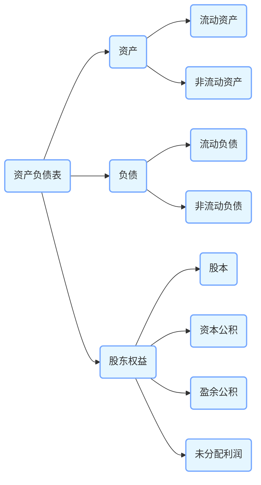

# 价值投资中的资产负债表分析

> 关键词：价值投资、资产负债表、财务分析、投资决策、资产质量、负债结构、股东权益

> 摘要：本文聚焦于价值投资中资产负债表分析的重要性与方法。通过深入探讨资产负债表的各个组成部分，包括资产、负债和股东权益，阐述了如何利用资产负债表评估企业的财务状况、经营能力和投资价值。文中详细介绍了核心概念、算法原理、数学模型，并结合项目实战案例进行深入解读，同时分析了实际应用场景，推荐了相关工具和资源。最后总结了未来发展趋势与挑战，为投资者在价值投资中更好地运用资产负债表分析提供全面且深入的指导。

## 1. 背景介绍 
### 1.1 目的和范围
价值投资的核心在于寻找被市场低估的优质企业，并长期持有以获取回报。资产负债表作为企业财务报表的重要组成部分，反映了企业在特定日期的财务状况，对于价值投资者而言，是评估企业内在价值的关键工具。本文的目的在于全面介绍如何通过分析资产负债表来辅助价值投资决策，范围涵盖资产负债表的各个要素、分析方法、实际应用以及相关资源推荐等方面。

### 1.2 预期读者
本文预期读者包括对价值投资感兴趣的个人投资者、专业投资机构从业者、财务分析人员以及相关领域的研究人员。无论您是初学者希望了解资产负债表分析的基础知识，还是有一定经验的投资者希望进一步完善投资分析体系，本文都将为您提供有价值的参考。

### 1.3 文档结构概述
本文首先介绍资产负债表分析在价值投资中的背景和重要性，接着阐述资产负债表的核心概念及其相互联系，然后详细讲解分析资产负债表的核心算法原理和具体操作步骤，通过数学模型和公式进一步深入剖析，结合项目实战案例进行代码实现和解读，分析资产负债表分析在实际投资中的应用场景，推荐相关的学习资源、开发工具和论文著作，最后总结未来发展趋势与挑战，并提供常见问题解答和扩展阅读参考资料。

### 1.4 术语表
#### 1.4.1 核心术语定义
- **价值投资**：一种投资策略，基于对企业内在价值的评估，寻找被市场低估的股票，通过长期持有以获取企业成长带来的收益。
- **资产负债表**：反映企业在某一特定日期财务状况的会计报表，展示了企业的资产、负债和股东权益的状况。
- **资产**：企业过去的交易或者事项形成的、由企业拥有或者控制的、预期会给企业带来经济利益的资源。
- **负债**：企业过去的交易或者事项形成的、预期会导致经济利益流出企业的现时义务。
- **股东权益**：企业资产扣除负债后由所有者享有的剩余权益，又称为净资产。

#### 1.4.2 相关概念解释
- **流动资产**：预计在一个正常营业周期中变现、出售或耗用，或者主要为交易目的而持有，或者预计在资产负债表日起一年内（含一年）变现的资产，以及自资产负债表日起一年内交换其他资产或清偿负债的能力不受限制的现金或现金等价物。
- **非流动资产**：流动资产以外的资产，通常具有较长的使用寿命和较高的价值，如固定资产、无形资产等。
- **流动负债**：预计在一个正常营业周期中清偿，或者主要为交易目的而持有，或者自资产负债表日起一年内（含一年）到期应予以清偿，或者企业无权自主地将清偿推迟至资产负债表日后一年以上的负债。
- **非流动负债**：流动负债以外的负债，如长期借款、应付债券等。

#### 1.4.3 缩略词列表
- **ROE**：Return on Equity，净资产收益率
- **ROA**：Return on Assets，总资产收益率
- **EPS**：Earnings Per Share，每股收益

## 2. 核心概念与联系 

### 资产负债表的基本结构
资产负债表遵循会计恒等式：$资产 = 负债 + 股东权益$。这个等式反映了企业的资金来源和资金运用之间的平衡关系。资产表示企业拥有的资源，负债表示企业对外的债务，股东权益则表示股东对企业净资产的所有权。

### 资产的分类与特点
资产可以分为流动资产和非流动资产。流动资产具有较强的流动性，能够在短期内变现，为企业提供资金支持。常见的流动资产包括货币资金、应收账款、存货等。非流动资产则具有较长的使用寿命和较高的价值，如固定资产、无形资产等，它们是企业长期发展的基础。

### 负债的分类与影响
负债同样可以分为流动负债和非流动负债。流动负债需要在短期内偿还，对企业的资金流动性要求较高。非流动负债则具有较长的还款期限，企业可以有更充裕的时间来安排资金。负债的规模和结构会影响企业的财务风险和偿债能力。

### 股东权益的构成与意义
股东权益包括股本、资本公积、盈余公积和未分配利润等。股本是股东投入企业的初始资金，资本公积反映了股东投入超过股本的部分，盈余公积和未分配利润则是企业经营积累的成果。股东权益的增长反映了企业的盈利能力和发展潜力。

### 核心概念的联系示意图


## 3. 核心算法原理 & 具体操作步骤 

### 资产质量分析算法
资产质量分析主要关注资产的流动性、变现能力和盈利能力。以下是一个简单的资产质量分析函数，用于计算流动资产占总资产的比例：

```python
def current_asset_ratio(current_assets, total_assets):
    """
    计算流动资产占总资产的比例
    :param current_assets: 流动资产金额
    :param total_assets: 总资产金额
    :return: 流动资产占总资产的比例
    """
    if total_assets == 0:
        return 0
    return current_assets / total_assets
```

### 负债结构分析算法
负债结构分析主要关注流动负债和非流动负债的比例关系。以下是一个计算流动负债占总负债比例的函数：

```python
def current_liability_ratio(current_liabilities, total_liabilities):
    """
    计算流动负债占总负债的比例
    :param current_liabilities: 流动负债金额
    :param total_liabilities: 总负债金额
    :return: 流动负债占总负债的比例
    """
    if total_liabilities == 0:
        return 0
    return current_liabilities / total_liabilities
```

### 股东权益分析算法
股东权益分析可以通过计算净资产收益率（ROE）来评估股东权益的盈利能力。以下是一个计算ROE的函数：

```python
def roe(net_income, shareholders_equity):
    """
    计算净资产收益率（ROE）
    :param net_income: 净利润
    :param shareholders_equity: 股东权益
    :return: 净资产收益率
    """
    if shareholders_equity == 0:
        return 0
    return net_income / shareholders_equity
```

### 具体操作步骤
1. **数据收集**：收集企业的资产负债表数据，包括各项资产、负债和股东权益的金额。
2. **数据预处理**：对收集到的数据进行清洗和整理，确保数据的准确性和完整性。
3. **计算指标**：使用上述算法计算资产质量、负债结构和股东权益等相关指标。
4. **分析评估**：根据计算结果，对企业的财务状况进行分析评估，判断企业的投资价值。

## 4. 数学模型和公式 & 详细讲解 & 举例说明 

### 资产负债率公式
资产负债率是衡量企业负债水平和偿债能力的重要指标，计算公式为：
$$资产负债率 = \frac{总负债}{总资产} \times 100\%$$

**详细讲解**：资产负债率反映了企业总资产中有多少是通过负债筹集的。资产负债率越高，说明企业的负债水平越高，财务风险也相对较大；反之，资产负债率越低，说明企业的负债水平越低，财务风险相对较小。

**举例说明**：假设某企业的总资产为1000万元，总负债为500万元，则该企业的资产负债率为：
$$资产负债率 = \frac{500}{1000} \times 100\% = 50\%$$

### 流动比率公式
流动比率是衡量企业短期偿债能力的指标，计算公式为：
$$流动比率 = \frac{流动资产}{流动负债}$$

**详细讲解**：流动比率反映了企业流动资产在短期债务到期以前，可以变为现金用于偿还负债的能力。一般来说，流动比率越高，说明企业的短期偿债能力越强；但流动比率过高也可能意味着企业的资金利用效率不高。

**举例说明**：假设某企业的流动资产为800万元，流动负债为400万元，则该企业的流动比率为：
$$流动比率 = \frac{800}{400} = 2$$

### 速动比率公式
速动比率是对流动比率的补充，它剔除了存货等变现能力较弱的资产，更能准确地反映企业的短期偿债能力，计算公式为：
$$速动比率 = \frac{流动资产 - 存货}{流动负债}$$

**详细讲解**：速动比率比流动比率更严格地衡量了企业的短期偿债能力。因为存货的变现速度相对较慢，可能存在积压、贬值等风险。速动比率越高，说明企业的短期偿债能力越强。

**举例说明**：假设某企业的流动资产为800万元，存货为200万元，流动负债为400万元，则该企业的速动比率为：
$$速动比率 = \frac{800 - 200}{400} = 1.5$$

## 5. 项目实战：代码实际案例和详细解释说明 

### 5.1  开发环境搭建
- **编程语言**：Python
- **开发工具**：PyCharm 或 Jupyter Notebook
- **所需库**：pandas、numpy

可以使用以下命令安装所需库：
```sh
pip install pandas numpy
```

### 5.2  源代码详细实现和代码解读
以下是一个完整的资产负债表分析项目示例，假设我们已经获取了某企业的资产负债表数据，并存储在一个 CSV 文件中。

```python
import pandas as pd
import numpy as np

# 读取资产负债表数据
def read_balance_sheet(file_path):
    """
    读取资产负债表数据
    :param file_path: 数据文件路径
    :return: 资产负债表数据 DataFrame
    """
    try:
        df = pd.read_csv(file_path)
        return df
    except Exception as e:
        print(f"读取文件失败: {e}")
        return None

# 计算资产负债率
def calculate_debt_ratio(df):
    """
    计算资产负债率
    :param df: 资产负债表数据 DataFrame
    :return: 资产负债率
    """
    total_liabilities = df['总负债'].values[0]
    total_assets = df['总资产'].values[0]
    if total_assets == 0:
        return 0
    return total_liabilities / total_assets

# 计算流动比率
def calculate_current_ratio(df):
    """
    计算流动比率
    :param df: 资产负债表数据 DataFrame
    :return: 流动比率
    """
    current_assets = df['流动资产'].values[0]
    current_liabilities = df['流动负债'].values[0]
    if current_liabilities == 0:
        return 0
    return current_assets / current_liabilities

# 计算速动比率
def calculate_quick_ratio(df):
    """
    计算速动比率
    :param df: 资产负债表数据 DataFrame
    :return: 速动比率
    """
    current_assets = df['流动资产'].values[0]
    inventory = df['存货'].values[0]
    current_liabilities = df['流动负债'].values[0]
    if current_liabilities == 0:
        return 0
    return (current_assets - inventory) / current_liabilities

# 主函数
def main():
    file_path = 'balance_sheet.csv'
    df = read_balance_sheet(file_path)
    if df is not None:
        debt_ratio = calculate_debt_ratio(df)
        current_ratio = calculate_current_ratio(df)
        quick_ratio = calculate_quick_ratio(df)
        print(f"资产负债率: {debt_ratio * 100:.2f}%")
        print(f"流动比率: {current_ratio:.2f}")
        print(f"速动比率: {quick_ratio:.2f}")

if __name__ == "__main__":
    main()
```

### 5.3  代码解读与分析
- **read_balance_sheet 函数**：该函数用于读取存储资产负债表数据的 CSV 文件，并返回一个 DataFrame 对象。如果读取文件失败，会捕获异常并打印错误信息。
- **calculate_debt_ratio 函数**：该函数从 DataFrame 中提取总负债和总资产数据，计算资产负债率。如果总资产为 0，则返回 0。
- **calculate_current_ratio 函数**：该函数从 DataFrame 中提取流动资产和流动负债数据，计算流动比率。如果流动负债为 0，则返回 0。
- **calculate_quick_ratio 函数**：该函数从 DataFrame 中提取流动资产、存货和流动负债数据，计算速动比率。如果流动负债为 0，则返回 0。
- **main 函数**：该函数是程序的入口，调用上述函数读取数据并计算各项指标，最后打印计算结果。

## 6. 实际应用场景 
### 股票投资决策
在股票投资中，价值投资者可以通过分析企业的资产负债表来评估企业的财务状况和投资价值。例如，资产负债率较低、流动比率和速动比率较高的企业，通常具有较强的偿债能力和财务稳定性，可能是较好的投资标的。

### 债券投资分析
债券投资者在评估债券的信用风险时，也会关注企业的资产负债表。企业的负债水平和偿债能力直接影响债券的违约风险，资产负债表分析可以帮助投资者做出更明智的债券投资决策。

### 企业并购与重组
在企业并购和重组过程中，资产负债表分析是评估目标企业价值和财务状况的重要手段。通过分析目标企业的资产质量、负债结构和股东权益，可以发现潜在的风险和价值，为并购和重组决策提供依据。

### 信贷审批
银行等金融机构在进行信贷审批时，会对企业的资产负债表进行详细分析。资产负债表反映了企业的财务实力和偿债能力，是银行评估企业信用风险的重要参考。

## 7. 工具和资源推荐
### 7.1 学习资源推荐
#### 7.1.1 书籍推荐
- 《财务报表分析与证券定价》：这本书详细介绍了财务报表分析的方法和技巧，以及如何将其应用于证券定价和投资决策。
- 《聪明的投资者》：价值投资领域的经典著作，阐述了价值投资的理念和方法，其中包含了对财务报表分析的重要论述。
- 《手把手教你读财报》：以通俗易懂的语言讲解了财务报表的基本知识和分析方法，适合初学者阅读。

#### 7.1.2 在线课程
- Coursera 上的“财务报表分析”课程：由知名高校的教授授课，系统地介绍了财务报表分析的理论和实践。
- 网易云课堂上的“价值投资实战”课程：结合实际案例，讲解了价值投资的策略和方法，包括资产负债表分析的应用。

#### 7.1.3 技术博客和网站
- 雪球网：一个专注于股票投资的社区，有很多投资者分享的财务报表分析和价值投资的经验和见解。
- 东方财富网：提供丰富的财经资讯和财务数据，是进行财务分析和投资研究的重要资源。

### 7.2 开发工具框架推荐
#### 7.2.1 IDE和编辑器
- PyCharm：一款专业的 Python 集成开发环境，提供了丰富的代码编辑、调试和分析功能，适合开发和调试财务分析相关的 Python 代码。
- Jupyter Notebook：一个交互式的开发环境，支持代码、文本、图表等多种元素的展示，非常适合进行数据探索和分析。

#### 7.2.2 调试和性能分析工具
- PDB：Python 内置的调试工具，可以帮助开发者逐步执行代码，查找和解决问题。
- cProfile：Python 标准库中的性能分析工具，可以分析代码的运行时间和函数调用次数，帮助优化代码性能。

#### 7.2.3 相关框架和库
- Pandas：一个强大的数据处理和分析库，提供了高效的数据结构和数据操作方法，适合处理和分析财务报表数据。
- Numpy：一个用于科学计算的 Python 库，提供了高效的数组操作和数学函数，在财务分析中经常用于数值计算。

### 7.3 相关论文著作推荐
#### 7.3.1 经典论文
- “The Quality of Accruals and Earnings: The Role of Accrual Estimation Errors”：该论文探讨了应计项目质量和盈余质量之间的关系，对财务报表分析具有重要的理论指导意义。
- “Financial Statement Analysis and the Prediction of Stock Returns”：研究了财务报表分析与股票回报预测之间的关系，为价值投资提供了实证依据。

#### 7.3.2 最新研究成果
- 关注顶级财经期刊，如《Journal of Financial Economics》《The Accounting Review》等，这些期刊上发表了很多关于财务报表分析和价值投资的最新研究成果。

#### 7.3.3 应用案例分析
- 可以参考一些专业的投资研究报告和案例集，了解实际应用中资产负债表分析的方法和技巧，以及如何将其应用于投资决策。

## 8. 总结：未来发展趋势与挑战
### 未来发展趋势
- **数据驱动的分析**：随着大数据和人工智能技术的发展，资产负债表分析将越来越依赖于数据驱动的方法。通过对大量财务数据的挖掘和分析，可以发现更多潜在的投资机会和风险。
- **跨领域融合**：资产负债表分析将与其他领域的知识和技术进行更深入的融合，如机器学习、风险管理、行业分析等，以提供更全面、准确的投资决策支持。
- **实时分析**：投资者对信息的及时性要求越来越高，未来资产负债表分析将朝着实时分析的方向发展，能够及时反映企业的财务状况变化。

### 挑战
- **数据质量问题**：财务数据的质量直接影响资产负债表分析的准确性和可靠性。数据不准确、不完整或存在操纵等问题，都会给分析带来困难。
- **复杂性增加**：随着企业业务的多元化和国际化，资产负债表的结构和内容越来越复杂，增加了分析的难度。
- **技术更新换代快**：大数据、人工智能等技术发展迅速，需要不断学习和掌握新的技术和方法，以适应资产负债表分析的需求。

## 9. 附录：常见问题与解答
### 问题 1：资产负债表分析的重点指标有哪些？
答：资产负债表分析的重点指标包括资产负债率、流动比率、速动比率、净资产收益率等。这些指标可以帮助投资者评估企业的偿债能力、财务稳定性和盈利能力。

### 问题 2：如何判断资产负债表数据的真实性？
答：可以通过多种方式判断资产负债表数据的真实性，如查阅审计报告、对比同行业数据、分析数据的合理性和一致性等。此外，还可以关注企业的内部控制制度和信息披露质量。

### 问题 3：资产负债表分析是否可以完全预测企业的未来发展？
答：资产负债表分析可以提供有关企业过去和当前财务状况的信息，但不能完全预测企业的未来发展。企业的未来发展受到多种因素的影响，如市场环境、行业竞争、管理团队等。因此，资产负债表分析应结合其他因素进行综合考虑。

## 10. 扩展阅读 & 参考资料
### 扩展阅读
- 《财务造假与防范》：深入探讨了财务造假的手段和防范方法，有助于投资者更好地识别资产负债表中的虚假信息。
- 《企业估值与投资分析》：介绍了企业估值的方法和模型，以及如何将资产负债表分析应用于企业估值和投资决策。

### 参考资料
- 企业会计准则：是编制和分析资产负债表的重要依据。
- 证券交易所的相关规定和公告：提供了上市公司财务信息披露的要求和规范。
- 专业财经媒体和研究机构的报告：可以获取最新的财务分析和投资研究成果。