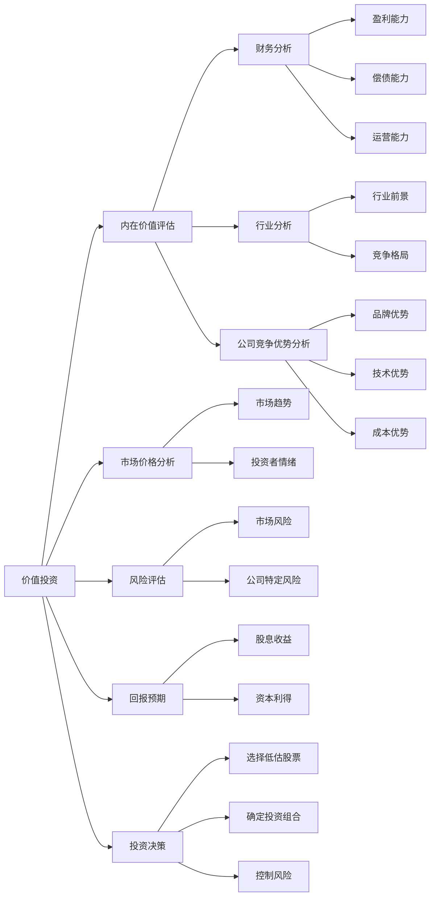

# 价值投资中的风险与回报权衡

> 关键词：价值投资、风险、回报、权衡、投资策略、财务分析、市场波动

> 摘要：本文围绕价值投资中风险与回报的权衡展开深入探讨。首先介绍价值投资的背景知识，包括其目的、适用读者等内容。接着阐述价值投资的核心概念，分析风险与回报之间的内在联系，并给出相应的原理和架构示意图。通过Python代码详细讲解核心算法原理和具体操作步骤，同时引入数学模型和公式进行理论支撑并举例说明。结合项目实战，展示代码实际案例并进行详细解读。探讨价值投资在不同场景下的实际应用，推荐相关的学习资源、开发工具框架以及论文著作。最后总结价值投资未来的发展趋势与面临的挑战，附录部分解答常见问题，为投资者在价值投资中合理权衡风险与回报提供全面而深入的参考。

## 1. 背景介绍 
### 1.1 目的和范围
价值投资作为一种重要的投资理念，旨在通过对公司内在价值的评估，寻找被市场低估的资产，以实现长期的资本增值。本文的目的在于深入剖析价值投资过程中风险与回报的关系，帮助投资者更好地理解和把握这一权衡过程，从而制定更为合理的投资策略。范围涵盖价值投资的基本概念、核心算法、数学模型、实际案例以及应用场景等多个方面，全面探讨风险与回报在价值投资中的具体表现和影响。

### 1.2 预期读者
本文预期读者包括对价值投资有兴趣的初学者，希望通过系统学习深入了解价值投资中风险与回报权衡的原理和方法；也适用于有一定投资经验的投资者，帮助他们进一步优化投资策略，提升投资决策的准确性；同时，对于金融专业的学生和研究人员，本文可以作为研究价值投资理论和实践的参考资料。

### 1.3 文档结构概述
本文将按照以下结构展开：首先介绍价值投资的背景知识，包括目的、读者和文档结构概述等内容；接着阐述价值投资的核心概念，分析风险与回报的联系并给出相应的原理和架构；通过Python代码详细讲解核心算法原理和具体操作步骤；引入数学模型和公式进行理论支撑并举例说明；结合项目实战，展示代码实际案例并进行详细解读；探讨价值投资在不同场景下的实际应用；推荐相关的学习资源、开发工具框架以及论文著作；最后总结价值投资未来的发展趋势与面临的挑战，附录部分解答常见问题，并提供扩展阅读和参考资料。

### 1.4 术语表
#### 1.4.1 核心术语定义
- **价值投资**：一种基于对公司内在价值评估的投资策略，投资者通过分析公司的财务状况、行业前景等因素，寻找被市场低估的股票，长期持有以获取资本增值。
- **风险**：指投资过程中可能遭受损失的不确定性，包括市场风险、公司特定风险等。
- **回报**：投资者在投资过程中获得的收益，包括股息、资本利得等。
- **内在价值**：公司在未来持续经营过程中所能产生的现金流的现值。

#### 1.4.2 相关概念解释
- **市场效率**：指市场价格反映资产内在价值的程度。在有效市场中，资产价格能够迅速、准确地反映所有可用信息；而在无效市场中，资产价格可能偏离其内在价值，为价值投资者提供机会。
- **安全边际**：指股票的市场价格低于其内在价值的部分，是价值投资中重要的风险控制手段。投资者通过寻找具有足够安全边际的股票，降低投资风险。

#### 1.4.3 缩略词列表
- **PE**：市盈率（Price-to-Earnings Ratio），是股票价格与每股收益的比率，用于衡量股票的估值水平。
- **PB**：市净率（Price-to-Book Ratio），是股票价格与每股净资产的比率，反映了股票的账面价值与市场价格的关系。
- **DCF**：现金流折现法（Discounted Cash Flow），是一种通过预测公司未来现金流并折现到当前的方法，用于评估公司的内在价值。

## 2. 核心概念与联系 
价值投资的核心在于寻找被市场低估的资产，通过长期持有实现资产的增值。在这个过程中，风险与回报是两个相互关联的重要因素。

### 核心概念原理
价值投资的原理基于以下几个方面：
- **内在价值评估**：价值投资者通过对公司的财务报表、行业前景、竞争优势等因素进行分析，评估公司的内在价值。内在价值是公司在未来持续经营过程中所能产生的现金流的现值，是价值投资的基础。
- **市场价格波动**：市场价格受到多种因素的影响，包括宏观经济环境、投资者情绪等，往往会偏离公司的内在价值。价值投资者利用市场价格的波动，寻找被低估的股票。
- **长期投资理念**：价值投资强调长期持有，通过分享公司的成长和发展，实现资产的增值。长期投资可以降低市场短期波动对投资收益的影响。

### 风险与回报的联系
风险与回报是价值投资中不可分割的两个方面。一般来说，风险越高，潜在回报也越高；但同时，高风险也意味着更大的损失可能性。价值投资者的目标是在风险和回报之间找到一个平衡点，通过合理的投资策略，实现风险可控下的最大回报。

### 架构的文本示意图
```plaintext
价值投资
|-- 内在价值评估
|   |-- 财务分析
|   |   |-- 盈利能力
|   |   |-- 偿债能力
|   |   |-- 运营能力
|   |-- 行业分析
|   |   |-- 行业前景
|   |   |-- 竞争格局
|   |-- 公司竞争优势分析
|       |-- 品牌优势
|       |-- 技术优势
|       |-- 成本优势
|-- 市场价格分析
|   |-- 市场趋势
|   |-- 投资者情绪
|-- 风险评估
|   |-- 市场风险
|   |-- 公司特定风险
|-- 回报预期
|   |-- 股息收益
|   |-- 资本利得
|-- 投资决策
|   |-- 选择低估股票
|   |-- 确定投资组合
|   |-- 控制风险
```

### Mermaid 流程图


## 3. 核心算法原理 & 具体操作步骤 
### 核心算法原理
在价值投资中，常用的核心算法包括市盈率法、市净率法和现金流折现法等。下面以现金流折现法（DCF）为例进行详细讲解。

现金流折现法的基本原理是将公司未来的现金流按照一定的折现率折现到当前，得到公司的内在价值。其计算公式为：

$$V = \sum_{t=1}^{n} \frac{CF_t}{(1 + r)^t} + \frac{TV}{(1 + r)^n}$$

其中，$V$ 表示公司的内在价值，$CF_t$ 表示第 $t$ 期的现金流，$r$ 表示折现率，$n$ 表示预测期数，$TV$ 表示终值。

### 具体操作步骤
1. **预测未来现金流**：通过对公司的历史财务数据、行业前景等因素进行分析，预测公司未来的现金流。一般来说，可以预测未来5 - 10年的现金流。
2. **确定折现率**：折现率反映了投资者对投资回报的要求，通常可以采用资本资产定价模型（CAPM）来确定。其计算公式为：

$$r = R_f + \beta (R_m - R_f)$$

其中，$r$ 表示折现率，$R_f$ 表示无风险利率，$\beta$ 表示股票的贝塔系数，$R_m$ 表示市场收益率。

3. **计算终值**：终值是指预测期结束后公司的价值，可以采用永续增长模型来计算。其计算公式为：

$$TV = \frac{CF_{n+1}}{r - g}$$

其中，$TV$ 表示终值，$CF_{n+1}$ 表示预测期结束后下一期的现金流，$r$ 表示折现率，$g$ 表示永续增长率。

4. **计算内在价值**：将预测的未来现金流和终值按照折现率折现到当前，得到公司的内在价值。

### Python源代码实现
```python
import numpy as np

def dcf_valuation(cash_flows, discount_rate, growth_rate, terminal_year):
    """
    现金流折现法计算公司内在价值
    :param cash_flows: 未来各期现金流列表
    :param discount_rate: 折现率
    :param growth_rate: 永续增长率
    :param terminal_year: 预测期数
    :return: 公司内在价值
    """
    # 计算预测期现金流的现值
    present_value_cash_flows = np.sum([cash_flows[t] / (1 + discount_rate) ** (t + 1) for t in range(terminal_year)])

    # 计算终值
    terminal_cash_flow = cash_flows[-1] * (1 + growth_rate)
    terminal_value = terminal_cash_flow / (discount_rate - growth_rate) / (1 + discount_rate) ** terminal_year

    # 计算内在价值
    intrinsic_value = present_value_cash_flows + terminal_value

    return intrinsic_value

# 示例数据
cash_flows = [100, 120, 140, 160, 180]  # 未来5年的现金流
discount_rate = 0.1  # 折现率为10%
growth_rate = 0.05  # 永续增长率为5%
terminal_year = 5  # 预测期数为5年

# 计算内在价值
intrinsic_value = dcf_valuation(cash_flows, discount_rate, growth_rate, terminal_year)
print(f"公司的内在价值为: {intrinsic_value}")
```

### 代码解释
1. **定义函数 `dcf_valuation`**：该函数接受未来各期现金流列表、折现率、永续增长率和预测期数作为输入，返回公司的内在价值。
2. **计算预测期现金流的现值**：使用列表推导式将未来各期现金流按照折现率折现到当前，并求和得到预测期现金流的现值。
3. **计算终值**：根据永续增长模型计算预测期结束后公司的价值，并将其折现到当前。
4. **计算内在价值**：将预测期现金流的现值和终值相加，得到公司的内在价值。
5. **示例数据和计算**：定义示例数据，调用 `dcf_valuation` 函数计算公司的内在价值，并打印结果。

## 4. 数学模型和公式 & 详细讲解 & 举例说明 
### 现金流折现法（DCF）
#### 公式
$$V = \sum_{t=1}^{n} \frac{CF_t}{(1 + r)^t} + \frac{TV}{(1 + r)^n}$$

#### 详细讲解
- **$\sum_{t=1}^{n} \frac{CF_t}{(1 + r)^t}$**：表示预测期内各期现金流的现值之和。其中，$CF_t$ 表示第 $t$ 期的现金流，$r$ 表示折现率，$n$ 表示预测期数。
- **$\frac{TV}{(1 + r)^n}$**：表示终值的现值。终值 $TV$ 是指预测期结束后公司的价值，通常采用永续增长模型计算。

#### 举例说明
假设某公司未来5年的现金流分别为100万元、120万元、140万元、160万元和180万元，折现率为10%，永续增长率为5%。

1. **计算预测期现金流的现值**：
    - 第1年现金流的现值：$\frac{100}{(1 + 0.1)^1} \approx 90.91$（万元）
    - 第2年现金流的现值：$\frac{120}{(1 + 0.1)^2} \approx 99.17$（万元）
    - 第3年现金流的现值：$\frac{140}{(1 + 0.1)^3} \approx 105.18$（万元）
    - 第4年现金流的现值：$\frac{160}{(1 + 0.1)^4} \approx 109.29$（万元）
    - 第5年现金流的现值：$\frac{180}{(1 + 0.1)^5} \approx 111.77$（万元）
    - 预测期现金流的现值之和：$90.91 + 99.17 + 105.18 + 109.29 + 111.77 = 516.32$（万元）

2. **计算终值**：
    - 第6年的现金流：$180 \times (1 + 0.05) = 189$（万元）
    - 终值：$\frac{189}{0.1 - 0.05} = 3780$（万元）
    - 终值的现值：$\frac{3780}{(1 + 0.1)^5} \approx 2332.07$（万元）

3. **计算内在价值**：
    - 内在价值：$516.32 + 2332.07 = 2848.39$（万元）

### 资本资产定价模型（CAPM）
#### 公式
$$r = R_f + \beta (R_m - R_f)$$

#### 详细讲解
- **$R_f$**：表示无风险利率，通常可以采用国债收益率来近似代替。
- **$\beta$**：表示股票的贝塔系数，反映了股票相对于市场的波动程度。$\beta > 1$ 表示股票的波动大于市场，$\beta < 1$ 表示股票的波动小于市场。
- **$R_m$**：表示市场收益率，通常可以采用股票市场指数的收益率来近似代替。

#### 举例说明
假设无风险利率为3%，市场收益率为10%，某股票的贝塔系数为1.2。

则该股票的折现率为：

$r = 0.03 + 1.2 \times (0.1 - 0.03) = 0.114$ 或 11.4%

## 5. 项目实战：代码实际案例和详细解释说明 
### 5.1  开发环境搭建
在进行价值投资项目实战时，需要搭建相应的开发环境。以下是具体步骤：

1. **安装Python**：从Python官方网站（https://www.python.org/downloads/）下载并安装Python 3.x版本。
2. **安装必要的库**：使用 `pip` 命令安装所需的库，如 `numpy`、`pandas` 等。

```bash
pip install numpy pandas
```

### 5.2  源代码详细实现和代码解读
以下是一个完整的价值投资项目实战代码示例，通过现金流折现法计算公司的内在价值，并根据内在价值和市场价格进行投资决策。

```python
import numpy as np
import pandas as pd

def dcf_valuation(cash_flows, discount_rate, growth_rate, terminal_year):
    """
    现金流折现法计算公司内在价值
    :param cash_flows: 未来各期现金流列表
    :param discount_rate: 折现率
    :param growth_rate: 永续增长率
    :param terminal_year: 预测期数
    :return: 公司内在价值
    """
    # 计算预测期现金流的现值
    present_value_cash_flows = np.sum([cash_flows[t] / (1 + discount_rate) ** (t + 1) for t in range(terminal_year)])

    # 计算终值
    terminal_cash_flow = cash_flows[-1] * (1 + growth_rate)
    terminal_value = terminal_cash_flow / (discount_rate - growth_rate) / (1 + discount_rate) ** terminal_year

    # 计算内在价值
    intrinsic_value = present_value_cash_flows + terminal_value

    return intrinsic_value

def investment_decision(intrinsic_value, market_price):
    """
    根据内在价值和市场价格进行投资决策
    :param intrinsic_value: 公司内在价值
    :param market_price: 市场价格
    :return: 投资决策结果
    """
    if intrinsic_value > market_price:
        return "买入"
    elif intrinsic_value < market_price:
        return "卖出"
    else:
        return "持有"

# 示例数据
cash_flows = [100, 120, 140, 160, 180]  # 未来5年的现金流
discount_rate = 0.1  # 折现率为10%
growth_rate = 0.05  # 永续增长率为5%
terminal_year = 5  # 预测期数为5年
market_price = 2500  # 市场价格

# 计算内在价值
intrinsic_value = dcf_valuation(cash_flows, discount_rate, growth_rate, terminal_year)
print(f"公司的内在价值为: {intrinsic_value}")

# 进行投资决策
decision = investment_decision(intrinsic_value, market_price)
print(f"投资决策结果: {decision}")
```

### 5.3  代码解读与分析
1. **`dcf_valuation` 函数**：该函数实现了现金流折现法计算公司内在价值的功能。首先计算预测期内各期现金流的现值之和，然后计算终值的现值，最后将两者相加得到公司的内在价值。
2. **`investment_decision` 函数**：该函数根据公司的内在价值和市场价格进行投资决策。如果内在价值大于市场价格，建议买入；如果内在价值小于市场价格，建议卖出；如果两者相等，建议持有。
3. **示例数据和计算**：定义示例数据，包括未来5年的现金流、折现率、永续增长率、预测期数和市场价格。调用 `dcf_valuation` 函数计算公司的内在价值，并调用 `investment_decision` 函数进行投资决策，最后打印结果。

通过这个项目实战，我们可以看到如何使用现金流折现法计算公司的内在价值，并根据内在价值和市场价格进行投资决策。在实际应用中，需要根据具体情况对数据进行调整和优化，以提高投资决策的准确性。

## 6. 实际应用场景 
价值投资中风险与回报的权衡在多个实际应用场景中具有重要意义，以下是一些常见的场景：

### 股票投资
在股票投资中，价值投资者通过对公司的基本面分析，评估公司的内在价值，并与股票的市场价格进行比较。如果股票的市场价格低于其内在价值，且具有足够的安全边际，投资者会考虑买入该股票；如果市场价格高于内在价值，则可能选择卖出或持有。例如，巴菲特的投资策略就是典型的价值投资，他通过深入研究公司的财务状况、行业前景和竞争优势等因素，寻找被市场低估的优质股票，长期持有并获得了丰厚的回报。

### 债券投资
在债券投资中，价值投资者需要考虑债券的票面利率、到期收益率、信用风险等因素。债券的内在价值可以通过现金流折现法计算，将债券未来的利息和本金按照一定的折现率折现到当前。投资者会根据债券的内在价值和市场价格进行比较，选择具有投资价值的债券。同时，投资者还需要评估债券的信用风险，以确保投资的安全性。

### 房地产投资
在房地产投资中，价值投资者会考虑房地产的地理位置、市场需求、租金收益等因素。通过对房地产的租金收益和未来增值潜力进行分析，评估其内在价值。如果房地产的市场价格低于其内在价值，且具有良好的市场前景，投资者会考虑买入；如果市场价格过高，则可能选择观望或出售。例如，在一些新兴的城市区域，由于基础设施不断完善和人口流入增加，房地产的潜在价值可能被低估，价值投资者会抓住机会进行投资。

### 基金投资
在基金投资中，价值投资者会选择具有价值投资理念的基金产品。基金经理会通过对股票、债券等资产的基本面分析，寻找被低估的投资标的，构建投资组合。投资者可以根据基金的历史业绩、投资策略和风险水平等因素，选择适合自己的基金进行投资。同时，投资者还需要关注基金的管理费用和风险控制措施，以确保投资的效益。

## 7. 工具和资源推荐
### 7.1 学习资源推荐
#### 7.1.1 书籍推荐
- **《聪明的投资者》（The Intelligent Investor）**：作者是本杰明·格雷厄姆（Benjamin Graham），被誉为价值投资的圣经。本书介绍了价值投资的基本理念、方法和策略，对投资者具有重要的指导意义。
- **《证券分析》（Security Analysis）**：同样是本杰明·格雷厄姆的著作，是价值投资领域的经典之作。本书详细阐述了证券分析的基本原理和方法，包括财务报表分析、估值方法等。
- **《巴菲特致股东的信》（Letters to Shareholders of Berkshire Hathaway）**：作者是沃伦·巴菲特（Warren Buffett），本书收录了巴菲特多年来致股东的信，通过这些信件可以了解巴菲特的投资理念、决策过程和对市场的看法。

#### 7.1.2 在线课程
- **Coursera上的“投资学原理”（Principles of Investing）**：由哥伦比亚大学教授授课，介绍了投资的基本原理、资产定价模型和投资组合管理等内容。
- **edX上的“金融市场”（Financial Markets）**：由耶鲁大学教授授课，涵盖了金融市场的基本概念、投资策略和风险管理等方面的知识。
- **中国大学MOOC上的“公司金融”**：国内多所高校联合开设的课程，介绍了公司金融的基本理论和方法，包括资本预算、融资决策和股利政策等。

#### 7.1.3 技术博客和网站
- **雪球网（https://xueqiu.com/）**：国内知名的投资社区，提供股票、基金、债券等投资品种的信息和分析，投资者可以在上面交流投资经验和观点。
- **ValueWalk（https://www.valuewalk.com/）**：专注于价值投资的网站，提供价值投资的最新资讯、研究报告和案例分析等内容。
- **Seeking Alpha（https://seekingalpha.com/）**：提供全球金融市场的分析和评论，包括股票、债券、大宗商品等投资品种，有很多专业的分析师和投资者在上面发表观点。

### 7.2 开发工具框架推荐
#### 7.2.1 IDE和编辑器
- **PyCharm**：一款专业的Python集成开发环境，具有代码编辑、调试、版本控制等功能，适合Python开发。
- **Jupyter Notebook**：一种交互式的开发环境，支持Python、R等多种编程语言，适合数据探索和分析。
- **VS Code**：一款轻量级的代码编辑器，支持多种编程语言，具有丰富的插件和扩展功能。

#### 7.2.2 调试和性能分析工具
- **pdb**：Python自带的调试工具，可以帮助开发者调试代码，查找问题。
- **cProfile**：Python的性能分析工具，可以分析代码的运行时间和函数调用情况，帮助开发者优化代码性能。
- **Py-Spy**：一个跨平台的Python性能分析工具，可以实时监控Python程序的运行情况，找出性能瓶颈。

#### 7.2.3 相关框架和库
- **numpy**：Python的数值计算库，提供了高效的数组操作和数学函数，适合进行数据处理和计算。
- **pandas**：Python的数据处理和分析库，提供了数据结构和数据分析工具，方便进行数据清洗、整理和分析。
- **scikit-learn**：Python的机器学习库，提供了各种机器学习算法和工具，适合进行数据挖掘和预测分析。

### 7.3 相关论文著作推荐
#### 7.3.1 经典论文
- **“The Arbitrage Pricing Theory of Capital Asset Pricing”**：由Stephen A. Ross发表，提出了套利定价理论（APT），为资产定价提供了一种新的思路。
- **“Efficient Capital Markets: A Review of Theory and Empirical Work”**：由Eugene F. Fama发表，对有效市场假说进行了系统的阐述和总结。
- **“The Capital Asset Pricing Model: Theory and Evidence”**：由Richard Roll发表，对资本资产定价模型（CAPM）进行了深入的研究和分析。

#### 7.3.2 最新研究成果
- **“Factor Investing: A Practitioner's Guide”**：探讨了因子投资的理论和实践，介绍了各种因子的定义、测量方法和投资策略。
- **“Behavioral Finance: An Overview”**：研究了投资者的行为和心理对金融市场的影响，为价值投资提供了新的视角。
- **“Machine Learning in Finance: Applications and Challenges”**：介绍了机器学习在金融领域的应用，包括风险评估、投资决策和市场预测等方面。

#### 7.3.3 应用案例分析
- **“Value Investing in Emerging Markets: Evidence from China”**：分析了价值投资在中国新兴市场的应用效果和挑战，为投资者提供了参考。
- **“Case Studies in Value Investing: Lessons from Successful Investors”**：通过对成功投资者的案例分析，总结了价值投资的经验和教训。
- **“The Impact of Value Investing on Portfolio Performance: A Comparative Analysis”**：比较了价值投资和其他投资策略对投资组合绩效的影响，为投资者选择投资策略提供了依据。

## 8. 总结：未来发展趋势与挑战
### 未来发展趋势
- **智能化与自动化**：随着人工智能和机器学习技术的不断发展，价值投资将越来越多地借助这些技术进行数据分析和决策。例如，通过机器学习算法对大量的财务数据和市场信息进行分析，挖掘潜在的投资机会；利用自动化交易系统实现投资策略的自动执行，提高投资效率。
- **全球一体化**：在经济全球化的背景下，价值投资的范围将不再局限于本国市场，投资者将更加关注全球范围内的投资机会。同时，不同国家和地区的金融市场之间的联系也将更加紧密，投资者需要考虑全球经济形势和政策变化对投资的影响。
- **可持续投资**：随着社会对环境保护、社会责任和公司治理（ESG）的关注度不断提高，可持续投资将成为价值投资的重要发展方向。投资者将更加注重公司的ESG表现，选择具有良好社会形象和可持续发展能力的公司进行投资。

### 挑战
- **市场不确定性增加**：全球经济形势的复杂性和不确定性不断增加，如贸易摩擦、地缘政治冲突、疫情等因素，都给金融市场带来了较大的波动和不确定性。这使得价值投资者在评估公司内在价值和预测未来现金流时面临更大的困难。
- **数据质量和安全问题**：在智能化和自动化投资的过程中，数据的质量和安全至关重要。不准确或不完整的数据可能导致投资决策失误，而数据泄露和网络攻击则可能给投资者带来巨大的损失。因此，如何保证数据的质量和安全是价值投资面临的重要挑战之一。
- **投资者情绪的影响**：投资者情绪往往会对市场价格产生较大的影响，导致市场价格偏离公司的内在价值。在市场情绪高涨或恐慌时，价值投资者需要保持冷静和理性，避免受到情绪的干扰，坚持自己的投资策略。

## 9. 附录：常见问题与解答
### 1. 价值投资一定能获得高回报吗？
价值投资并不一定能保证获得高回报。虽然价值投资通过寻找被低估的资产，长期持有有望实现资产的增值，但市场是复杂多变的，存在很多不确定性因素。例如，公司的基本面可能发生变化，导致其内在价值下降；市场环境也可能发生不利变化，影响股票的市场价格。因此，价值投资也存在一定的风险，投资者需要做好风险控制。

### 2. 如何准确评估公司的内在价值？
准确评估公司的内在价值是价值投资的关键，但也是一项具有挑战性的任务。投资者可以从多个方面进行分析，包括财务分析、行业分析、公司竞争优势分析等。财务分析可以通过研究公司的财务报表，了解其盈利能力、偿债能力、运营能力等；行业分析可以了解行业的发展趋势、竞争格局等；公司竞争优势分析可以评估公司的品牌优势、技术优势、成本优势等。同时，投资者还可以采用多种估值方法，如市盈率法、市净率法、现金流折现法等，综合评估公司的内在价值。

### 3. 价值投资适合短期投资吗？
价值投资更适合长期投资。价值投资的核心在于寻找被市场低估的资产，通过长期持有分享公司的成长和发展，实现资产的增值。短期市场价格波动较大，可能受到投资者情绪、宏观经济环境等多种因素的影响，难以准确反映公司的内在价值。而长期投资可以降低市场短期波动对投资收益的影响，更有可能实现价值投资的目标。

### 4. 如何控制价值投资中的风险？
控制价值投资中的风险可以从多个方面入手。首先，要进行充分的基本面分析，选择具有良好财务状况、行业前景和竞争优势的公司进行投资，降低公司特定风险。其次，要设定合理的安全边际，即股票的市场价格要低于其内在价值一定比例，以应对市场波动和不确定性。此外，还可以通过分散投资，构建投资组合，降低单一股票的风险。最后，要保持冷静和理性，避免盲目跟风和情绪化决策。

## 10. 扩展阅读 & 参考资料
### 扩展阅读
- **《金融炼金术》（The Alchemy of Finance）**：作者是乔治·索罗斯（George Soros），本书介绍了索罗斯的投资哲学和方法，对投资者理解金融市场的运行机制和投资策略有一定的启发。
- **《漫步华尔街》（A Random Walk Down Wall Street）**：作者是伯顿·马尔基尔（Burton G. Malkiel），本书探讨了股票市场的有效性和投资策略，对价值投资和其他投资理念进行了比较和分析。
- **《投资最重要的事》（The Most Important Thing Illuminated）**：作者是霍华德·马克斯（Howard Marks），本书总结了马克斯的投资经验和智慧，强调了投资中的风险管理和逆向思维。

### 参考资料
- 格雷厄姆, 多德. 证券分析[M]. 海南出版社, 2006.
- 巴菲特. 巴菲特致股东的信[M]. 机械工业出版社, 2014.
- Fama, E. F. Efficient Capital Markets: A Review of Theory and Empirical Work[J]. The Journal of Finance, 1970, 25(2): 383-417.
- Ross, S. A. The Arbitrage Pricing Theory of Capital Asset Pricing[J]. Journal of Economic Theory, 1976, 13(3): 341-360.