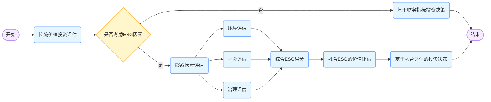

# 价值投资在ESG（环境、社会和治理）框架下的演变

> 关键词：价值投资、ESG框架、投资演变、可持续发展、企业评估

> 摘要：本文深入探讨了价值投资在ESG（环境、社会和治理）框架下的演变。首先介绍了研究的背景、目的、预期读者、文档结构和相关术语。接着阐述了价值投资和ESG的核心概念及两者之间的联系，并通过示意图和流程图展示。详细讲解了核心算法原理和具体操作步骤，给出了相应的Python代码。同时，运用数学模型和公式对相关概念进行分析，并举例说明。通过项目实战案例，展示了在开发环境搭建、源代码实现及代码解读等方面的具体情况。分析了价值投资在ESG框架下的实际应用场景，推荐了相关的学习资源、开发工具框架和论文著作。最后总结了未来发展趋势与挑战，解答了常见问题，并提供了扩展阅读和参考资料，旨在为投资者和相关研究人员提供全面且深入的了解。

## 1. 背景介绍 
### 1.1 目的和范围
在当今全球经济环境中，投资者越来越关注企业的可持续发展能力。传统的价值投资主要聚焦于企业的财务指标，如盈利、资产负债等。然而，随着社会对环境、社会和治理问题的关注度不断提高，ESG因素逐渐成为影响企业长期价值的重要方面。本文的目的在于探讨价值投资在ESG框架下的演变过程，分析这种演变对投资决策的影响，以及如何将ESG因素纳入价值投资的评估体系中。范围涵盖了价值投资和ESG的基本概念、相关算法和数学模型、实际应用案例以及未来发展趋势等方面。

### 1.2 预期读者
本文的预期读者包括专业投资者、金融分析师、投资顾问、企业管理人员、学术研究人员以及对价值投资和ESG感兴趣的普通读者。专业投资者可以从中获取新的投资思路和方法，金融分析师和投资顾问可以为客户提供更全面的投资建议，企业管理人员可以了解如何通过改善ESG表现来提升企业价值，学术研究人员可以找到新的研究方向，普通读者可以增加对金融投资和可持续发展的认识。

### 1.3 文档结构概述
本文将按照以下结构进行阐述：首先介绍价值投资和ESG的核心概念及两者之间的联系，通过文本示意图和流程图展示其架构；接着详细讲解核心算法原理和具体操作步骤，并给出Python代码示例；然后运用数学模型和公式对相关概念进行分析，并举例说明；通过项目实战案例，展示开发环境搭建、源代码实现及代码解读；分析价值投资在ESG框架下的实际应用场景；推荐相关的学习资源、开发工具框架和论文著作；最后总结未来发展趋势与挑战，解答常见问题，并提供扩展阅读和参考资料。

### 1.4 术语表
#### 1.4.1 核心术语定义
- **价值投资**：一种投资策略，基于对企业内在价值的评估，寻找被市场低估的股票进行投资，以获取长期的资本增值。
- **ESG**：即环境（Environment）、社会（Society）和治理（Governance），是一种关注企业在环境保护、社会责任履行和公司治理方面表现的评价体系。
- **可持续发展**：满足当代人的需求，又不损害后代人满足其需求的能力的发展模式。在投资领域，可持续发展投资强调考虑企业的长期可持续性，包括ESG因素。
- **企业内在价值**：企业未来预期现金流的现值，是价值投资评估企业投资价值的重要依据。

#### 1.4.2 相关概念解释
- **环境因素**：包括企业对环境的影响，如碳排放、能源消耗、水资源管理、废弃物处理等。良好的环境表现可以降低企业的环境风险，提高资源利用效率，增强企业的长期竞争力。
- **社会因素**：涉及企业与员工、客户、社区和社会的关系，如员工权益保护、产品质量与安全、社区参与、公益活动等。积极的社会表现可以提升企业的品牌形象，增强客户忠诚度，促进企业的可持续发展。
- **治理因素**：主要关注企业的公司治理结构和运作，如董事会独立性、高管薪酬政策、信息披露质量、风险管理等。有效的治理可以保障股东权益，提高企业决策的科学性和透明度，降低企业的经营风险。

#### 1.4.3 缩略词列表
- **ESG**：Environmental, Social and Governance
- **NPV**：Net Present Value（净现值）
- **DCF**：Discounted Cash Flow（现金流折现法）

## 2. 核心概念与联系 
### 核心概念原理
#### 价值投资原理
价值投资的核心思想是通过对企业基本面的分析，评估企业的内在价值，并与当前市场价格进行比较。如果市场价格低于企业的内在价值，投资者认为该股票被低估，具有投资价值；反之，如果市场价格高于内在价值，则认为该股票被高估，应避免投资。价值投资通常采用基本面分析方法，包括对企业的财务报表、行业地位、竞争优势、管理团队等方面进行深入研究。

#### ESG原理
ESG评估体系从环境、社会和治理三个维度对企业进行全面评价。环境维度关注企业的环境保护措施和环境绩效，社会维度考察企业在社会责任方面的表现，治理维度评估企业的公司治理结构和运作效率。ESG评估旨在识别企业面临的潜在风险和机遇，帮助投资者了解企业的可持续发展能力。

### 架构的文本示意图
```plaintext
价值投资
|
|-- 传统价值评估（财务指标）
|   |-- 盈利分析
|   |-- 资产负债分析
|   |-- 现金流分析
|
|-- ESG融合价值评估
|   |-- 环境评估
|   |   |-- 碳排放
|   |   |-- 能源消耗
|   |   |-- 废弃物处理
|   |
|   |-- 社会评估
|   |   |-- 员工权益
|   |   |-- 产品安全
|   |   |-- 社区参与
|   |
|   |-- 治理评估
|       |-- 董事会独立性
|       |-- 高管薪酬
|       |-- 信息披露
```

### Mermaid流程图


从流程图可以看出，传统价值投资先进行基于财务指标的评估，然后根据是否考虑ESG因素进行分支。如果考虑ESG因素，则分别对环境、社会和治理进行评估，得到综合ESG得分，再与传统价值评估融合，最终做出投资决策。

## 3. 核心算法原理 & 具体操作步骤 
### 核心算法原理
在价值投资中，常用的评估企业内在价值的方法是现金流折现法（DCF）。DCF的基本思想是将企业未来预期的现金流按照一定的折现率折现到当前时刻，得到企业的内在价值。其公式为：

$$ V = \sum_{t=1}^{n} \frac{CF_t}{(1 + r)^t} $$

其中，$V$ 表示企业的内在价值，$CF_t$ 表示第 $t$ 期的现金流，$r$ 表示折现率，$n$ 表示预测期数。

在ESG框架下，我们需要对传统的DCF模型进行改进，将ESG因素纳入考虑。一种方法是通过调整现金流或折现率来反映ESG因素对企业价值的影响。例如，如果企业的ESG表现良好，我们可以适当提高其未来现金流的预期，或者降低折现率；反之，如果ESG表现不佳，则降低现金流预期或提高折现率。

### 具体操作步骤
#### 步骤1：数据收集
收集企业的财务数据，包括历史现金流、盈利情况、资产负债表等。同时，收集企业的ESG数据，如环境报告、社会责任报告、公司治理文件等。

#### 步骤2：ESG评估
对企业的ESG表现进行评估，可以采用第三方ESG评级机构的评级结果，也可以自行构建评估指标体系进行评估。评估指标可以包括环境指标（如碳排放强度、能源效率等）、社会指标（如员工满意度、客户投诉率等）和治理指标（如董事会独立性、高管薪酬合理性等）。

#### 步骤3：调整现金流或折现率
根据ESG评估结果，调整企业未来现金流的预期或折现率。例如，如果企业的ESG表现优于行业平均水平，可以将未来现金流预期提高10%；如果ESG表现较差，则降低10%。或者，将折现率根据ESG风险等级进行调整，风险越高，折现率越高。

#### 步骤4：计算内在价值
使用调整后的现金流或折现率，代入DCF公式计算企业的内在价值。

#### 步骤5：投资决策
将计算得到的内在价值与企业当前的市场价格进行比较，如果内在价值高于市场价格，则认为该股票被低估，具有投资价值；反之，则认为被高估，应避免投资。

### Python源代码实现
```python
import numpy as np

def dcf_valuation(cash_flows, discount_rate):
    """
    计算现金流折现法下的企业内在价值
    :param cash_flows: 未来各期现金流列表
    :param discount_rate: 折现率
    :return: 企业内在价值
    """
    periods = len(cash_flows)
    present_values = []
    for t in range(periods):
        present_value = cash_flows[t] / ((1 + discount_rate) ** (t + 1))
        present_values.append(present_value)
    return np.sum(present_values)

# 示例数据
cash_flows = [100, 120, 150, 180, 200]  # 未来5期的现金流
discount_rate = 0.1  # 折现率为10%

# 计算传统DCF下的内在价值
traditional_value = dcf_valuation(cash_flows, discount_rate)
print(f"传统DCF下的企业内在价值: {traditional_value}")

# 假设根据ESG评估，将未来现金流提高10%
adjusted_cash_flows = [cf * 1.1 for cf in cash_flows]

# 计算融合ESG后的内在价值
esg_value = dcf_valuation(adjusted_cash_flows, discount_rate)
print(f"融合ESG后的企业内在价值: {esg_value}")
```

在上述代码中，我们定义了一个 `dcf_valuation` 函数来计算现金流折现法下的企业内在价值。首先，使用传统的现金流数据计算企业的内在价值；然后，根据ESG评估结果，将未来现金流提高10%，再次计算融合ESG后的内在价值。

## 4. 数学模型和公式 & 详细讲解 & 举例说明 
### 数学模型和公式
#### 传统DCF模型
如前面所述，传统DCF模型的公式为：

$$ V = \sum_{t=1}^{n} \frac{CF_t}{(1 + r)^t} $$

其中，$V$ 表示企业的内在价值，$CF_t$ 表示第 $t$ 期的现金流，$r$ 表示折现率，$n$ 表示预测期数。

#### 融合ESG的DCF模型
在融合ESG的DCF模型中，我们可以通过调整现金流或折现率来反映ESG因素的影响。

##### 调整现金流
假设 $CF_t^{ESG}$ 表示考虑ESG因素后的第 $t$ 期现金流，$CF_t$ 表示传统的第 $t$ 期现金流，$\alpha_t$ 表示第 $t$ 期现金流的调整系数，则有：

$$ CF_t^{ESG} = CF_t \times (1 + \alpha_t) $$

此时，融合ESG的企业内在价值公式为：

$$ V^{ESG} = \sum_{t=1}^{n} \frac{CF_t^{ESG}}{(1 + r)^t} = \sum_{t=1}^{n} \frac{CF_t \times (1 + \alpha_t)}{(1 + r)^t} $$

##### 调整折现率
假设 $r^{ESG}$ 表示考虑ESG因素后的折现率，$r$ 表示传统的折现率，$\beta$ 表示折现率的调整系数，则有：

$$ r^{ESG} = r + \beta $$

此时，融合ESG的企业内在价值公式为：

$$ V^{ESG} = \sum_{t=1}^{n} \frac{CF_t}{(1 + r^{ESG})^t} = \sum_{t=1}^{n} \frac{CF_t}{(1 + r + \beta)^t} $$

### 详细讲解
#### 调整现金流
当企业的ESG表现良好时，我们可以预期其未来的经营风险降低，市场竞争力增强，从而带来更高的现金流。因此，通过调整系数 $\alpha_t$ 来提高未来现金流的预期。例如，如果企业在环境保护方面表现出色，可能会获得政府的补贴或优惠政策，从而增加现金流；或者在社会责任方面表现良好，提高了客户忠诚度，促进了产品销售，也会增加现金流。

#### 调整折现率
折现率反映了投资的风险程度。当企业的ESG表现不佳时，其面临的环境、社会和治理风险增加，投资者要求的回报率也会相应提高。因此，通过调整系数 $\beta$ 来提高折现率。例如，如果企业存在严重的环境污染问题，可能会面临法律诉讼和罚款，增加了经营风险，投资者会要求更高的回报率来补偿这种风险。

### 举例说明
假设一家企业未来5年的现金流分别为 $CF_1 = 100$，$CF_2 = 120$，$CF_3 = 150$，$CF_4 = 180$，$CF_5 = 200$，传统的折现率 $r = 0.1$。

#### 调整现金流的情况
根据ESG评估，该企业的ESG表现良好，预计未来每年的现金流可以提高10%，即 $\alpha_1 = \alpha_2 = \alpha_3 = \alpha_4 = \alpha_5 = 0.1$。

传统DCF下的内在价值：

$$ V = \frac{100}{(1 + 0.1)^1} + \frac{120}{(1 + 0.1)^2} + \frac{150}{(1 + 0.1)^3} + \frac{180}{(1 + 0.1)^4} + \frac{200}{(1 + 0.1)^5} \approx 569.57 $$

融合ESG后的内在价值：

$$ V^{ESG} = \frac{100 \times (1 + 0.1)}{(1 + 0.1)^1} + \frac{120 \times (1 + 0.1)}{(1 + 0.1)^2} + \frac{150 \times (1 + 0.1)}{(1 + 0.1)^3} + \frac{180 \times (1 + 0.1)}{(1 + 0.1)^4} + \frac{200 \times (1 + 0.1)}{(1 + 0.1)^5} \approx 626.53 $$

#### 调整折现率的情况
根据ESG评估，该企业的ESG表现不佳，需要将折现率提高2%，即 $\beta = 0.02$，$r^{ESG} = 0.1 + 0.02 = 0.12$。

融合ESG后的内在价值：

$$ V^{ESG} = \frac{100}{(1 + 0.12)^1} + \frac{120}{(1 + 0.12)^2} + \frac{150}{(1 + 0.12)^3} + \frac{180}{(1 + 0.12)^4} + \frac{200}{(1 + 0.12)^5} \approx 524.78 $$

从上述例子可以看出，考虑ESG因素后，企业的内在价值会发生变化。当ESG表现良好时，内在价值增加；当ESG表现不佳时，内在价值降低。

## 5. 项目实战：代码实际案例和详细解释说明 
### 5.1  开发环境搭建
#### 操作系统
可以选择Windows、Linux或Mac OS等主流操作系统。本案例以Windows 10为例进行说明。

#### Python环境
安装Python 3.7及以上版本。可以从Python官方网站（https://www.python.org/downloads/）下载安装包，按照安装向导进行安装。安装完成后，打开命令提示符（CMD）或PowerShell，输入 `python --version` 验证Python是否安装成功。

#### 安装必要的库
在命令提示符或PowerShell中，使用以下命令安装必要的库：
```sh
pip install numpy pandas matplotlib
```
- `numpy`：用于数值计算。
- `pandas`：用于数据处理和分析。
- `matplotlib`：用于数据可视化。

### 5.2  源代码详细实现和代码解读
```python
import numpy as np
import pandas as pd
import matplotlib.pyplot as plt

def dcf_valuation(cash_flows, discount_rate):
    """
    计算现金流折现法下的企业内在价值
    :param cash_flows: 未来各期现金流列表
    :param discount_rate: 折现率
    :return: 企业内在价值
    """
    periods = len(cash_flows)
    present_values = []
    for t in range(periods):
        present_value = cash_flows[t] / ((1 + discount_rate) ** (t + 1))
        present_values.append(present_value)
    return np.sum(present_values)

def adjust_cash_flows(cash_flows, esg_factor):
    """
    根据ESG因素调整现金流
    :param cash_flows: 未来各期现金流列表
    :param esg_factor: ESG调整系数
    :return: 调整后的现金流列表
    """
    return [cf * (1 + esg_factor) for cf in cash_flows]

def adjust_discount_rate(discount_rate, esg_risk_factor):
    """
    根据ESG风险因素调整折现率
    :param discount_rate: 传统折现率
    :param esg_risk_factor: ESG风险调整系数
    :return: 调整后的折现率
    """
    return discount_rate + esg_risk_factor

# 示例数据
cash_flows = [100, 120, 150, 180, 200]  # 未来5期的现金流
discount_rate = 0.1  # 折现率为10%
esg_factor = 0.1  # ESG调整系数，假设提高10%现金流
esg_risk_factor = 0.02  # ESG风险调整系数，假设提高2%折现率

# 计算传统DCF下的内在价值
traditional_value = dcf_valuation(cash_flows, discount_rate)
print(f"传统DCF下的企业内在价值: {traditional_value}")

# 调整现金流
adjusted_cash_flows = adjust_cash_flows(cash_flows, esg_factor)
esg_value_cashflow = dcf_valuation(adjusted_cash_flows, discount_rate)
print(f"调整现金流后融合ESG的企业内在价值: {esg_value_cashflow}")

# 调整折现率
adjusted_discount_rate = adjust_discount_rate(discount_rate, esg_risk_factor)
esg_value_discountrate = dcf_valuation(cash_flows, adjusted_discount_rate)
print(f"调整折现率后融合ESG的企业内在价值: {esg_value_discountrate}")

# 数据可视化
values = [traditional_value, esg_value_cashflow, esg_value_discountrate]
labels = ['传统DCF', '调整现金流', '调整折现率']

plt.bar(labels, values)
plt.xlabel('评估方法')
plt.ylabel('企业内在价值')
plt.title('不同评估方法下的企业内在价值')
plt.show()
```

### 5.3  代码解读与分析
#### 函数定义
- `dcf_valuation` 函数：用于计算现金流折现法下的企业内在价值。通过遍历未来各期现金流，将其按照折现率折现到当前时刻，并求和得到企业的内在价值。
- `adjust_cash_flows` 函数：根据ESG调整系数对未来现金流进行调整。将每个现金流乘以 `(1 + esg_factor)` 得到调整后的现金流。
- `adjust_discount_rate` 函数：根据ESG风险调整系数对传统折现率进行调整。将传统折现率加上 `esg_risk_factor` 得到调整后的折现率。

#### 数据处理与计算
- 定义了示例数据，包括未来5期的现金流、传统折现率、ESG调整系数和ESG风险调整系数。
- 计算传统DCF下的内在价值。
- 调用 `adjust_cash_flows` 函数调整现金流，再计算调整现金流后融合ESG的企业内在价值。
- 调用 `adjust_discount_rate` 函数调整折现率，再计算调整折现率后融合ESG的企业内在价值。

#### 数据可视化
使用 `matplotlib` 库绘制柱状图，将传统DCF、调整现金流和调整折现率三种评估方法下的企业内在价值进行可视化展示，直观地比较不同评估方法的结果。

通过这个项目实战案例，我们可以看到如何将ESG因素纳入价值投资的评估体系中，并通过代码实现相关的计算和可视化分析。

## 6. 实际应用场景 
### 机构投资者的资产配置
机构投资者，如养老基金、保险公司、共同基金等，通常管理着大量的资金，需要进行多元化的资产配置。在ESG框架下，机构投资者可以将ESG因素纳入投资决策过程，选择那些ESG表现良好的企业进行投资。这样不仅可以降低投资组合的风险，还可以促进企业的可持续发展。例如，一些养老基金开始关注投资组合的ESG表现，要求所投资的企业在环境、社会和治理方面达到一定的标准，以保障养老金的长期安全和增值。

### 企业的战略决策
企业在制定战略决策时，也越来越重视ESG因素。良好的ESG表现可以提升企业的品牌形象，增强客户忠诚度，吸引优秀人才，降低运营成本，提高企业的长期竞争力。例如，一家制造业企业可以通过实施节能减排措施，降低能源消耗和环境污染，不仅符合环保要求，还可以降低生产成本；同时，积极参与社会责任活动，如公益捐赠、员工培训等，可以提升企业的社会形象，促进企业的可持续发展。

### 金融机构的信贷评估
金融机构在进行信贷评估时，也开始考虑企业的ESG因素。ESG表现良好的企业通常具有较低的经营风险和较高的信用评级，金融机构更愿意为这些企业提供贷款，并给予更优惠的利率。相反，ESG表现不佳的企业可能面临更高的融资成本和更严格的信贷条件。例如，银行在评估一家企业的贷款申请时，会查看其环境报告、社会责任报告等，评估其ESG风险，从而决定是否给予贷款以及贷款的额度和利率。

### 政府政策引导
政府可以通过制定相关政策，引导企业和投资者关注ESG因素。例如，政府可以出台税收优惠政策，鼓励企业进行节能减排和环保投资；或者设立绿色金融发展基金，支持绿色产业的发展。同时，政府还可以加强对企业ESG信息披露的监管，提高企业的透明度，促进市场的健康发展。

## 7. 工具和资源推荐
### 7.1 学习资源推荐
#### 7.1.1 书籍推荐
- 《价值投资：从格雷厄姆到巴菲特》：本书系统介绍了价值投资的理论和方法，从本杰明·格雷厄姆的基本面分析到沃伦·巴菲特的投资哲学，是价值投资领域的经典著作。
- 《ESG投资：理念、方法与实践》：全面阐述了ESG投资的概念、评估方法和实际应用案例，对于了解ESG投资具有重要的参考价值。
- 《可持续发展金融》：探讨了金融与可持续发展的关系，介绍了可持续发展金融的理论、政策和实践，有助于读者深入理解ESG投资在金融领域的应用。

#### 7.1.2 在线课程
- Coursera平台上的“ESG Investing: A Primer”：由专业教授授课，介绍了ESG投资的基本概念、评估方法和投资策略，适合初学者学习。
- edX平台上的“Value Investing: From Theory to Practice”：课程涵盖了价值投资的理论和实践，通过案例分析和实际操作，帮助学员掌握价值投资的方法。
- 中国大学MOOC上的“金融科技与可持续金融”：结合金融科技的发展，介绍了可持续金融的相关知识，包括ESG投资、绿色金融等内容。

#### 7.1.3 技术博客和网站
- MSCI ESG Research：提供全球企业的ESG评级和研究报告，是ESG投资领域的权威信息来源。
- Bloomberg ESG Data：彭博社提供的ESG数据平台，包含丰富的企业ESG数据和分析工具。
- 中国责任投资论坛（China SIF）：专注于可持续投资领域的研究和推广，发布了大量关于ESG投资的研究报告和行业动态。

### 7.2 开发工具框架推荐
#### 7.2.1 IDE和编辑器
- PyCharm：是一款专业的Python集成开发环境，具有强大的代码编辑、调试和分析功能，适合Python开发人员使用。
- Jupyter Notebook：是一个交互式的开发环境，支持多种编程语言，尤其适合数据科学和机器学习的开发。可以方便地进行代码编写、数据可视化和结果展示。
- Visual Studio Code：是一款轻量级的代码编辑器，支持多种编程语言和插件扩展，具有丰富的代码提示和调试功能，是很多开发者的首选。

#### 7.2.2 调试和性能分析工具
- Py-Spy：是一个Python性能分析工具，可以实时监测Python程序的CPU使用率和函数调用情况，帮助开发者找出性能瓶颈。
- cProfile：是Python标准库中的性能分析模块，可以对Python程序进行详细的性能分析，输出函数调用次数、执行时间等信息。
- PDB：是Python标准库中的调试模块，可以在代码中设置断点，逐行调试程序，方便开发者查找和解决问题。

#### 7.2.3 相关框架和库
- Pandas：是Python中用于数据处理和分析的强大库，提供了丰富的数据结构和数据操作方法，适合处理和分析企业的财务数据和ESG数据。
- Numpy：是Python中用于数值计算的基础库，提供了高效的数组操作和数学函数，在计算企业内在价值等数值计算中非常有用。
- Matplotlib：是Python中用于数据可视化的库，可以绘制各种类型的图表，如柱状图、折线图、散点图等，方便开发者对数据进行可视化展示和分析。

### 7.3 相关论文著作推荐
#### 7.3.1 经典论文
- “The Capital Asset Pricing Model: Theory and Evidence”：由威廉·夏普（William Sharpe）等人撰写，是资本资产定价模型（CAPM）的经典论文，为价值投资提供了理论基础。
- “Corporate Social Responsibility and Financial Performance: A Meta - analysis”：对企业社会责任与财务绩效之间的关系进行了元分析，为ESG投资提供了实证支持。
- “ESG and Financial Performance: Aggregated Evidence from More than 2000 Empirical Studies”：综合分析了2000多项实证研究，探讨了ESG因素与企业财务绩效之间的关系。

#### 7.3.2 最新研究成果
- 关注学术数据库，如Web of Science、EBSCOhost等，搜索关于价值投资和ESG的最新研究论文。这些论文通常涵盖了最新的理论模型、实证研究和应用案例。
- 参加学术会议，如国际金融学会（IIF）年会、可持续投资论坛等，了解最新的研究动态和前沿成果。

#### 7.3.3 应用案例分析
- 各大金融机构和咨询公司发布的ESG投资报告和案例分析，如贝莱德（BlackRock）、摩根士丹利（Morgan Stanley）等。这些报告通常包含了实际的投资案例和分析，具有很高的参考价值。
- 行业协会和研究机构发布的ESG应用案例，如中国证券投资基金业协会、可持续投资研究机构等。这些案例可以帮助读者了解ESG投资在不同行业和领域的应用情况。

## 8. 总结：未来发展趋势与挑战
### 未来发展趋势
#### ESG因素将成为价值投资的核心考量
随着社会对可持续发展的关注度不断提高，投资者将越来越重视企业的ESG表现。ESG因素将不再是价值投资的附加考虑因素，而是成为核心考量因素之一。未来，投资者将更加注重企业在环境、社会和治理方面的长期可持续性，将ESG评估纳入投资决策的全过程。

#### 数据和技术的应用将更加广泛
随着大数据、人工智能和机器学习等技术的发展，ESG数据的收集、分析和评估将变得更加准确和高效。投资者可以利用这些技术对企业的ESG表现进行实时监测和分析，提高投资决策的科学性和准确性。同时，区块链技术的应用可以提高ESG数据的透明度和可信度，促进ESG投资市场的健康发展。

#### 监管政策将不断完善
政府和监管机构将加强对ESG投资的监管，制定更加严格的ESG信息披露标准和投资规范。这将促使企业更加重视ESG表现，提高ESG信息披露的质量和透明度。同时，监管政策的引导也将推动ESG投资市场的规范化和专业化发展。

#### 跨领域合作将日益加强
价值投资和ESG涉及多个领域，包括金融、环境、社会和治理等。未来，不同领域的机构和专业人士将加强合作，共同推动ESG投资的发展。例如，金融机构可以与环保组织、社会责任机构合作，获取更全面的ESG信息；企业可以与科研机构合作，开展可持续发展研究和创新。

### 挑战
#### ESG数据质量和可比性问题
目前，ESG数据的质量和可比性存在较大问题。不同的ESG评级机构采用不同的评估方法和指标体系，导致评级结果存在差异。同时，企业的ESG信息披露标准也不统一，信息质量参差不齐。这给投资者的决策带来了困难，需要进一步加强ESG数据的标准化和规范化建设。

#### 缺乏统一的ESG评估方法和标准
由于ESG涉及多个维度和指标，目前还没有统一的评估方法和标准。不同的投资者和机构对ESG的理解和重视程度也有所不同，导致在投资决策中对ESG因素的考量存在差异。需要建立一套科学、统一的ESG评估方法和标准，提高ESG投资的可比性和有效性。

#### ESG投资的短期收益与长期价值的平衡
ESG投资通常强调企业的长期可持续发展，但在短期内，ESG表现良好的企业可能并不一定能够带来更高的投资收益。投资者需要在短期收益和长期价值之间进行平衡，避免过度追求短期利益而忽视了企业的长期发展潜力。

#### 人才短缺问题
ESG投资需要具备金融、环境、社会和治理等多方面知识的专业人才。目前，市场上这类复合型人才相对短缺，制约了ESG投资的发展。需要加强相关领域的人才培养和教育，提高从业人员的专业素质和能力。

## 9. 附录：常见问题与解答
### 问题1：ESG因素如何影响企业的内在价值？
答：ESG因素可以通过多种方式影响企业的内在价值。从环境方面来看，良好的环境表现可以降低企业的环境风险，如减少环境污染罚款、降低能源消耗成本等，从而提高企业的现金流。从社会方面来看，积极的社会责任表现可以提升企业的品牌形象，增强客户忠诚度，促进产品销售，进而增加现金流。从治理方面来看，有效的公司治理可以保障股东权益，提高企业决策的科学性和透明度，降低企业的经营风险，从而降低折现率。通过调整现金流或折现率，ESG因素最终会影响企业的内在价值。

### 问题2：如何获取企业的ESG数据？
答：获取企业ESG数据的途径有多种。一是企业自身发布的报告，如年度报告、环境报告、社会责任报告等，这些报告通常会包含企业在环境、社会和治理方面的相关信息。二是第三方ESG评级机构，如MSCI、S&P Global等，它们会对企业的ESG表现进行评估和评级，并提供相应的报告和数据。三是金融数据提供商，如Bloomberg、Wind等，它们也会收集和整理企业的ESG数据。此外，一些政府部门和行业协会也会发布相关的ESG数据和信息。

### 问题3：ESG投资是否一定能获得更高的收益？
答：ESG投资并不一定能保证获得更高的收益。虽然从长期来看，ESG表现良好的企业可能具有更强的可持续发展能力和更低的风险，但在短期内，其投资收益可能受到市场波动、行业竞争等多种因素的影响。此外，ESG投资的收益还与投资者的投资策略、资产配置等因素有关。因此，投资者在进行ESG投资时，需要综合考虑各种因素，合理评估投资风险和收益。

### 问题4：如何衡量ESG投资的绩效？
答：衡量ESG投资绩效可以从多个方面进行。一是财务绩效，如投资回报率、夏普比率等，通过比较ESG投资组合与传统投资组合的财务指标，评估ESG投资的收益和风险。二是ESG绩效，如企业的ESG评级变化、ESG指标的改善情况等，反映投资组合中企业的ESG表现提升程度。三是社会和环境影响，如投资对环境保护、社会责任履行等方面的贡献，评估ESG投资的社会效益。可以综合运用这些指标来全面衡量ESG投资的绩效。

## 10. 扩展阅读 & 参考资料
### 扩展阅读
- 《绿色金融与可持续发展》：深入探讨了绿色金融的理论和实践，以及如何通过金融手段促进可持续发展，与ESG投资密切相关。
- 《影响力投资：创造持久社会价值》：介绍了影响力投资的概念和方法，强调投资不仅要追求财务回报，还要创造社会和环境价值，对ESG投资有一定的启示作用。
- 《金融科技时代的投资策略》：结合金融科技的发展，探讨了投资策略的创新和变革，对于了解ESG投资在金融科技背景下的发展趋势有帮助。

### 参考资料
- MSCI ESG Research. (2023). Global ESG Trends to Watch.
- Bloomberg. (2023). ESG Data Solutions.
- United Nations Principles for Responsible Investment (PRI). (2023). ESG Investing Guidelines.
- 中国证券投资基金业协会. (2023). 中国ESG投资发展报告.