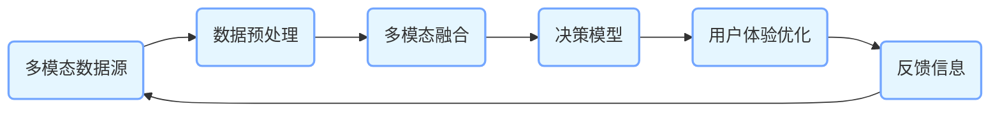

# 企业AI Agent的多模态学习在用户体验优化中的创新应用

> 关键词：企业AI Agent、多模态学习、用户体验优化、创新应用、人工智能

> 摘要：本文聚焦于企业AI Agent的多模态学习在用户体验优化方面的创新应用。首先介绍了相关背景知识，包括目的、预期读者等内容。接着阐述了企业AI Agent和多模态学习的核心概念及其联系，详细讲解了多模态学习的核心算法原理和具体操作步骤，并给出数学模型和公式。通过项目实战案例展示了代码实现和详细解读。分析了该技术在实际场景中的应用，推荐了学习、开发等相关的工具和资源。最后总结了未来发展趋势与挑战，解答常见问题并提供扩展阅读与参考资料，旨在全面深入地探讨企业AI Agent的多模态学习对用户体验优化的重要作用和创新途径。

## 1. 背景介绍 
### 1.1 目的和范围
随着人工智能技术的飞速发展，企业AI Agent在各个领域的应用越来越广泛。多模态学习作为人工智能的一个重要分支，能够融合多种不同类型的数据，如文本、图像、音频等，为企业AI Agent带来更强大的能力。本文章的目的在于深入探讨企业AI Agent的多模态学习如何应用于用户体验优化，通过详细的技术分析和实际案例展示，揭示其创新应用的原理和方法。范围涵盖了多模态学习的基本概念、算法原理、数学模型，以及在不同实际场景中的应用和未来发展趋势等方面。

### 1.2 预期读者
本文预期读者包括人工智能领域的专业人士，如研究人员、工程师、数据科学家等，他们可以从文章中获取企业AI Agent多模态学习的最新技术和创新应用思路。同时，也适合企业的管理人员、产品经理等，帮助他们了解如何利用多模态学习优化用户体验，提升企业的竞争力。此外，对人工智能和用户体验感兴趣的学生和爱好者也能从本文中获得有价值的信息。

### 1.3 文档结构概述
本文将按照以下结构展开：首先介绍相关背景知识，包括目的、预期读者等内容。接着阐述企业AI Agent和多模态学习的核心概念及其联系，通过文本示意图和Mermaid流程图进行直观展示。然后详细讲解多模态学习的核心算法原理和具体操作步骤，并给出数学模型和公式。通过项目实战案例展示代码实现和详细解读。分析该技术在实际场景中的应用，推荐学习、开发等相关的工具和资源。最后总结未来发展趋势与挑战，解答常见问题并提供扩展阅读与参考资料。

### 1.4 术语表
#### 1.4.1 核心术语定义
- **企业AI Agent**：指在企业环境中运行的人工智能代理，能够自动执行各种任务，与用户进行交互，辅助企业决策等。
- **多模态学习**：是一种融合多种不同模态数据（如文本、图像、音频等）进行学习的技术，旨在通过综合不同模态的信息，提高模型的性能和泛化能力。
- **用户体验优化**：通过改进产品或服务的各个方面，提高用户在使用过程中的满意度、便捷性和愉悦感。

#### 1.4.2 相关概念解释
- **模态**：指数据的不同表现形式，如文本模态、图像模态、音频模态等。不同模态的数据具有不同的特征和信息。
- **融合策略**：在多模态学习中，将不同模态的数据进行融合的方法和策略，常见的有早期融合、晚期融合等。

#### 1.4.3 缩略词列表
- **AI**：Artificial Intelligence，人工智能
- **ML**：Machine Learning，机器学习

## 2. 核心概念与联系 

### 企业AI Agent
企业AI Agent是一种智能程序，它能够感知企业环境中的信息，根据预设的规则和学习到的知识进行决策和行动。企业AI Agent可以应用于客户服务、市场营销、生产管理等多个领域，帮助企业提高效率和竞争力。

### 多模态学习
多模态学习是指同时处理和分析多种不同模态数据的过程。在现实世界中，信息往往以多种形式存在，如文本描述、图像展示、语音讲解等。多模态学习的目标是通过融合不同模态的数据，挖掘它们之间的关联和互补信息，从而提高模型的性能和泛化能力。

### 文本示意图
企业AI Agent的多模态学习可以看作是一个信息处理和交互的过程。首先，企业AI Agent从不同的数据源获取多模态数据，包括文本、图像、音频等。然后，对这些数据进行预处理，如特征提取、归一化等。接着，使用多模态融合策略将不同模态的数据进行融合，得到一个综合的特征表示。最后，将融合后的特征输入到决策模型中，进行决策和行动，以优化用户体验。

### Mermaid流程图

这个流程图展示了企业AI Agent的多模态学习的基本流程。从多模态数据源获取数据，经过预处理和融合后，输入到决策模型中进行决策，最终实现用户体验优化。同时，用户的反馈信息又会作为新的数据输入到整个流程中，形成一个闭环的学习和优化过程。

## 3. 核心算法原理 & 具体操作步骤 

### 核心算法原理
多模态学习的核心算法之一是基于注意力机制的融合算法。注意力机制可以帮助模型自动地关注不同模态数据中重要的部分，从而提高融合的效果。下面是一个基于Python和PyTorch实现的简单的基于注意力机制的多模态融合算法示例：

```python
import torch
import torch.nn as nn

class AttentionFusion(nn.Module):
    def __init__(self, input_dim1, input_dim2):
        super(AttentionFusion, self).__init__()
        self.linear1 = nn.Linear(input_dim1, 128)
        self.linear2 = nn.Linear(input_dim2, 128)
        self.attention = nn.Linear(256, 1)
        self.softmax = nn.Softmax(dim=1)

    def forward(self, x1, x2):
        # 特征提取
        feat1 = torch.relu(self.linear1(x1))
        feat2 = torch.relu(self.linear2(x2))
        # 拼接特征
        combined_feat = torch.cat((feat1, feat2), dim=1)
        # 计算注意力权重
        attention_weights = self.attention(combined_feat)
        attention_weights = self.softmax(attention_weights)
        # 加权融合
        weighted_feat1 = attention_weights * feat1
        weighted_feat2 = (1 - attention_weights) * feat2
        fused_feat = weighted_feat1 + weighted_feat2
        return fused_feat
```

### 具体操作步骤
1. **数据获取**：从不同的数据源收集多模态数据，如从文本数据库中获取文本数据，从图像采集设备中获取图像数据等。
2. **数据预处理**：对获取的多模态数据进行预处理，包括数据清洗、特征提取、归一化等操作。例如，对于文本数据，可以使用词嵌入技术将文本转换为向量表示；对于图像数据，可以使用卷积神经网络提取图像特征。
3. **多模态融合**：使用上述的基于注意力机制的融合算法，将不同模态的特征进行融合。将预处理后的文本特征和图像特征输入到`AttentionFusion`模型中，得到融合后的特征。
4. **决策模型训练**：将融合后的特征输入到决策模型中，如分类器、回归器等，进行训练。使用标注好的数据集进行训练，优化决策模型的参数。
5. **用户体验优化**：将训练好的决策模型应用到实际的企业AI Agent中，根据用户的输入和多模态数据，进行决策和行动，从而优化用户体验。

## 4. 数学模型和公式 & 详细讲解 & 举例说明 

### 数学模型
在基于注意力机制的多模态融合算法中，主要涉及以下数学模型和公式。

#### 特征提取
对于第 $i$ 个模态的输入数据 $x_i$，通过线性变换和激活函数进行特征提取，得到特征向量 $f_i$：
$$f_i = \text{ReLU}(W_i x_i + b_i)$$
其中，$W_i$ 是权重矩阵，$b_i$ 是偏置向量，$\text{ReLU}$ 是激活函数。

#### 注意力权重计算
将不同模态的特征向量拼接在一起，得到组合特征向量 $c$：
$$c = [f_1; f_2]$$
然后，通过线性变换计算注意力权重 $\alpha$：
$$\alpha = \text{Softmax}(W_a c + b_a)$$
其中，$W_a$ 是注意力权重矩阵，$b_a$ 是注意力偏置向量，$\text{Softmax}$ 是归一化函数。

#### 加权融合
根据注意力权重，对不同模态的特征向量进行加权融合，得到融合后的特征向量 $f$：
$$f = \alpha f_1 + (1 - \alpha) f_2$$

### 详细讲解
特征提取步骤将输入的多模态数据转换为统一的特征表示，以便后续的融合操作。注意力权重计算步骤通过学习不同模态特征的重要性，为每个模态分配相应的权重。加权融合步骤根据注意力权重，将不同模态的特征进行融合，得到一个综合的特征表示。

### 举例说明
假设我们有一个文本模态的输入 $x_1$ 和一个图像模态的输入 $x_2$。$x_1$ 的维度是 100，$x_2$ 的维度是 200。在特征提取步骤中，通过线性变换和 $\text{ReLU}$ 激活函数，将 $x_1$ 转换为维度为 128 的特征向量 $f_1$，将 $x_2$ 转换为维度为 128 的特征向量 $f_2$。然后，将 $f_1$ 和 $f_2$ 拼接在一起，得到维度为 256 的组合特征向量 $c$。通过线性变换和 $\text{Softmax}$ 函数，计算出注意力权重 $\alpha$。最后，根据 $\alpha$ 对 $f_1$ 和 $f_2$ 进行加权融合，得到融合后的特征向量 $f$。

## 5. 项目实战：代码实际案例和详细解释说明 

### 5.1  开发环境搭建
在进行项目实战之前，需要搭建相应的开发环境。以下是具体的步骤：

1. **安装Python**：推荐使用Python 3.7及以上版本。可以从Python官方网站（https://www.python.org/downloads/）下载并安装。
2. **安装PyTorch**：PyTorch是一个深度学习框架，用于实现多模态学习算法。可以根据自己的需求选择合适的版本进行安装。例如，使用以下命令安装CPU版本的PyTorch：
```bash
pip install torch torchvision
```
3. **安装其他依赖库**：根据项目的需求，安装其他必要的依赖库，如`numpy`、`pandas`、`matplotlib`等。可以使用以下命令进行安装：
```bash
pip install numpy pandas matplotlib
```

### 5.2  源代码详细实现和代码解读
以下是一个完整的项目实战代码示例，用于实现企业AI Agent的多模态学习在用户体验优化中的应用。

```python
import torch
import torch.nn as nn
import torch.optim as optim
from torch.utils.data import Dataset, DataLoader
import numpy as np

# 自定义数据集类
class MultimodalDataset(Dataset):
    def __init__(self, text_data, image_data, labels):
        self.text_data = text_data
        self.image_data = image_data
        self.labels = labels

    def __len__(self):
        return len(self.labels)

    def __getitem__(self, idx):
        text = self.text_data[idx]
        image = self.image_data[idx]
        label = self.labels[idx]
        return text, image, label

# 定义注意力融合模型
class AttentionFusion(nn.Module):
    def __init__(self, input_dim1, input_dim2):
        super(AttentionFusion, self).__init__()
        self.linear1 = nn.Linear(input_dim1, 128)
        self.linear2 = nn.Linear(input_dim2, 128)
        self.attention = nn.Linear(256, 1)
        self.softmax = nn.Softmax(dim=1)
        self.fc = nn.Linear(128, 1)

    def forward(self, x1, x2):
        feat1 = torch.relu(self.linear1(x1))
        feat2 = torch.relu(self.linear2(x2))
        combined_feat = torch.cat((feat1, feat2), dim=1)
        attention_weights = self.attention(combined_feat)
        attention_weights = self.softmax(attention_weights)
        weighted_feat1 = attention_weights * feat1
        weighted_feat2 = (1 - attention_weights) * feat2
        fused_feat = weighted_feat1 + weighted_feat2
        output = self.fc(fused_feat)
        return output

# 训练模型
def train_model(model, dataloader, criterion, optimizer, epochs):
    model.train()
    for epoch in range(epochs):
        running_loss = 0.0
        for text, image, labels in dataloader:
            optimizer.zero_grad()
            outputs = model(text, image)
            loss = criterion(outputs.squeeze(), labels.float())
            loss.backward()
            optimizer.step()
            running_loss += loss.item()
        print(f'Epoch {epoch + 1}/{epochs}, Loss: {running_loss / len(dataloader)}')

# 生成示例数据
text_data = np.random.rand(100, 100)
image_data = np.random.rand(100, 200)
labels = np.random.randint(0, 2, 100)

# 创建数据集和数据加载器
dataset = MultimodalDataset(text_data, image_data, labels)
dataloader = DataLoader(dataset, batch_size=10, shuffle=True)

# 初始化模型、损失函数和优化器
model = AttentionFusion(100, 200)
criterion = nn.BCEWithLogitsLoss()
optimizer = optim.Adam(model.parameters(), lr=0.001)

# 训练模型
train_model(model, dataloader, criterion, optimizer, epochs=10)
```

### 5.3  代码解读与分析
1. **自定义数据集类**：`MultimodalDataset`类用于封装多模态数据和对应的标签。通过`__len__`和`__getitem__`方法，实现了数据集的基本功能。
2. **注意力融合模型**：`AttentionFusion`类定义了基于注意力机制的多模态融合模型。在`forward`方法中，实现了特征提取、注意力权重计算和加权融合的过程。最后，通过一个全连接层输出预测结果。
3. **训练模型**：`train_model`函数用于训练模型。在每个训练周期中，遍历数据加载器中的所有数据，计算损失并进行反向传播和参数更新。
4. **生成示例数据**：使用`numpy`生成示例的文本数据、图像数据和标签。
5. **创建数据集和数据加载器**：使用自定义的数据集类创建数据集，并使用`DataLoader`类创建数据加载器，方便批量加载数据。
6. **初始化模型、损失函数和优化器**：初始化注意力融合模型、二元交叉熵损失函数和Adam优化器。
7. **训练模型**：调用`train_model`函数进行模型训练，训练10个周期。

## 6. 实际应用场景 
### 客户服务
在客户服务场景中，企业AI Agent可以通过多模态学习来更好地理解客户的需求。例如，客户可能会通过文本、语音或图像等多种方式表达自己的问题。企业AI Agent可以同时处理这些多模态数据，通过融合不同模态的信息，更准确地理解客户的意图，提供更个性化的服务。例如，客户在描述产品问题时，可能会发送文字描述和产品的图片，企业AI Agent可以通过多模态学习，结合文字和图片信息，快速定位问题并提供解决方案。

### 市场营销
在市场营销场景中，企业AI Agent可以利用多模态学习来分析用户的行为和偏好。通过收集用户的文本评论、浏览的图像和观看的视频等多模态数据，企业AI Agent可以深入了解用户的兴趣和需求，从而制定更精准的营销策略。例如，根据用户浏览的服装图片和搜索的相关文本，企业AI Agent可以为用户推荐符合其风格和需求的服装产品。

### 智能安防
在智能安防场景中，企业AI Agent可以通过多模态学习来提高安全监控的效率和准确性。例如，结合视频监控的图像数据和音频数据，企业AI Agent可以实时监测异常行为和声音，及时发现安全隐患。当监控画面中出现异常人员或声音时，企业AI Agent可以通过多模态学习，快速判断是否存在安全风险，并及时采取相应的措施。

### 教育领域
在教育领域，企业AI Agent可以利用多模态学习来优化教学体验。例如，结合学生的文本作业、课堂上的语音表现和学习过程中的图像记录等多模态数据，企业AI Agent可以了解学生的学习状态和进度，为学生提供个性化的学习建议和辅导。对于学习困难的学生，企业AI Agent可以根据多模态数据分析其薄弱环节，提供针对性的学习资源和指导。

## 7. 工具和资源推荐
### 7.1 学习资源推荐
#### 7.1.1 书籍推荐
- 《深度学习》（Deep Learning）：由Ian Goodfellow、Yoshua Bengio和Aaron Courville撰写，是深度学习领域的经典教材，涵盖了多模态学习的相关基础知识。
- 《Python深度学习》（Deep Learning with Python）：由Francois Chollet撰写，介绍了使用Python和Keras进行深度学习的方法，对于理解多模态学习的实现有很大帮助。

#### 7.1.2 在线课程
- Coursera上的“深度学习专项课程”（Deep Learning Specialization）：由Andrew Ng教授讲授，包含了深度学习的多个方面，包括多模态学习的相关内容。
- edX上的“人工智能基础”（Foundations of Artificial Intelligence）：该课程介绍了人工智能的基本概念和方法，对于理解企业AI Agent和多模态学习的背景知识有帮助。

#### 7.1.3 技术博客和网站
- arXiv（https://arxiv.org/）：是一个预印本服务器，提供了大量关于人工智能和多模态学习的最新研究论文。
- Medium（https://medium.com/）：有很多人工智能领域的技术博客，其中包含了关于多模态学习的实践经验和最新进展。

### 7.2 开发工具框架推荐
#### 7.2.1 IDE和编辑器
- PyCharm：是一个专业的Python集成开发环境，提供了丰富的代码编辑、调试和版本控制功能，适合开发多模态学习相关的项目。
- Jupyter Notebook：是一个交互式的开发环境，适合进行数据探索和模型实验，方便展示和分享代码和结果。

#### 7.2.2 调试和性能分析工具
- TensorBoard：是TensorFlow的可视化工具，可以用于可视化训练过程中的损失曲线、准确率等指标，帮助调试和优化模型。
- PyTorch Profiler：是PyTorch的性能分析工具，可以分析模型的运行时间、内存使用等情况，帮助优化模型性能。

#### 7.2.3 相关框架和库
- PyTorch：是一个开源的深度学习框架，提供了丰富的深度学习模型和工具，支持多模态学习的实现。
- TensorFlow：是另一个广泛使用的深度学习框架，具有强大的分布式训练和部署能力，也可以用于多模态学习的开发。
- scikit-learn：是一个机器学习库，提供了多种机器学习算法和工具，可用于多模态数据的预处理和特征提取。

### 7.3 相关论文著作推荐
#### 7.3.1 经典论文
- “Multimodal Machine Learning: A Survey and Taxonomy”：该论文对多模态机器学习进行了全面的综述和分类，介绍了多模态学习的基本概念、方法和应用。
- “Attention Is All You Need”：提出了Transformer架构和注意力机制，为多模态学习中的注意力融合方法提供了理论基础。

#### 7.3.2 最新研究成果
- 关注顶级人工智能会议，如NeurIPS、ICML、CVPR等，这些会议上发表的最新研究成果反映了多模态学习领域的前沿动态。

#### 7.3.3 应用案例分析
- 一些企业和研究机构会发布关于多模态学习在实际应用中的案例分析，通过阅读这些案例可以了解多模态学习在不同场景中的具体应用和实现方法。

## 8. 总结：未来发展趋势与挑战
### 未来发展趋势
1. **更深度的融合**：未来的企业AI Agent的多模态学习将实现更深度的融合，不仅仅是简单的特征拼接和加权融合，而是能够挖掘不同模态数据之间的内在关联和语义信息，实现更高效的信息交互和共享。
2. **跨领域应用**：多模态学习将在更多的领域得到应用，如医疗、交通、金融等。通过融合不同领域的多模态数据，企业AI Agent可以为这些领域提供更智能的决策支持和服务。
3. **个性化服务**：随着多模态学习技术的发展，企业AI Agent将能够更好地理解用户的个性化需求和偏好，提供更加个性化的服务和体验。例如，根据用户的多模态行为数据，为用户推荐符合其兴趣和需求的产品和服务。
4. **与其他技术的结合**：多模态学习将与其他人工智能技术，如强化学习、迁移学习等相结合，进一步提高企业AI Agent的智能水平和适应性。

### 挑战
1. **数据处理和管理**：多模态数据的规模和复杂性不断增加，如何高效地处理和管理这些数据是一个挑战。需要开发更高效的数据存储、处理和传输技术，以满足多模态学习的需求。
2. **模型复杂度和计算资源**：多模态学习模型通常比较复杂，需要大量的计算资源来训练和推理。如何优化模型结构和算法，降低计算成本，是一个需要解决的问题。
3. **数据隐私和安全**：多模态数据包含了用户的大量个人信息，如何保护数据的隐私和安全是一个重要的挑战。需要制定相应的法律法规和技术措施，确保数据的安全和合规使用。
4. **跨模态语义理解**：不同模态数据之间的语义差异较大，如何实现跨模态的语义理解是多模态学习的一个关键问题。需要开发更有效的语义表示和融合方法，提高跨模态信息的理解和利用能力。

## 9. 附录：常见问题与解答
### 1. 多模态学习和单模态学习有什么区别？
单模态学习只处理单一类型的数据，如只处理文本数据或只处理图像数据。而多模态学习同时处理多种不同类型的数据，通过融合不同模态的数据，挖掘它们之间的关联和互补信息，从而提高模型的性能和泛化能力。

### 2. 如何选择合适的多模态融合策略？
选择合适的多模态融合策略需要考虑数据的特点、任务的需求和模型的复杂度等因素。常见的融合策略有早期融合、晚期融合和中间融合等。早期融合在数据预处理阶段就将不同模态的数据进行融合，晚期融合在模型的最后阶段将不同模态的特征进行融合，中间融合则在模型的中间层进行融合。需要根据具体情况选择合适的融合策略。

### 3. 多模态学习需要大量的数据吗？
一般来说，多模态学习需要更多的数据来训练模型，因为多模态数据的维度和复杂度较高。但是，通过使用数据增强、迁移学习等技术，可以在一定程度上减少对数据量的需求。

### 4. 如何评估多模态学习模型的性能？
可以使用多种指标来评估多模态学习模型的性能，如准确率、召回率、F1值等。同时，还可以根据具体的任务需求，选择合适的评估指标。例如，在图像分类任务中，可以使用准确率来评估模型的性能；在情感分析任务中，可以使用F1值来评估模型的性能。

## 10. 扩展阅读 & 参考资料
### 扩展阅读
- 《人工智能：现代方法》（Artificial Intelligence: A Modern Approach）：全面介绍了人工智能的基本概念、方法和应用，对于深入理解企业AI Agent和多模态学习有帮助。
- 《多模态机器学习：理论与应用》：专门介绍了多模态机器学习的理论和方法，包含了很多实际应用案例。

### 参考资料
- 相关的学术论文和研究报告，如在IEEE、ACM等学术期刊和会议上发表的关于多模态学习和企业AI Agent的论文。
- 开源项目和代码库，如GitHub上的多模态学习相关的开源项目，这些项目提供了很多实现多模态学习的代码和示例。