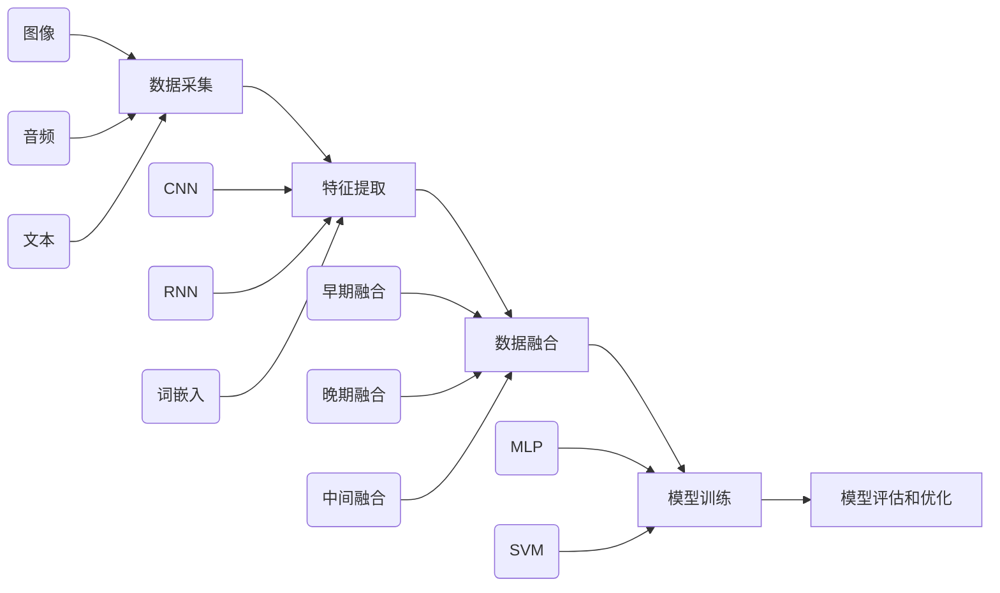

# 企业AI Agent的多模态学习在质量控制中的应用

> 关键词：企业AI Agent、多模态学习、质量控制、人工智能、数据融合、深度学习、工业应用

> 摘要：本文聚焦于企业AI Agent的多模态学习在质量控制中的应用。随着工业生产的发展，质量控制的复杂性和要求不断提高，单一模态的数据处理已难以满足需求。企业AI Agent的多模态学习能够整合图像、音频、文本等多种数据，实现更精准、全面的质量检测与控制。文章深入探讨了多模态学习的核心概念、算法原理、数学模型，通过项目实战展示其具体应用，分析了实际应用场景，并推荐了相关的工具和资源。最后对未来发展趋势与挑战进行总结，旨在为企业在质量控制中有效应用多模态学习提供全面的技术参考。

## 1. 背景介绍 
### 1.1 目的和范围
在当今竞争激烈的市场环境下，企业对产品质量的要求越来越高。质量控制作为确保产品符合标准和客户需求的关键环节，需要不断提升其准确性和效率。传统的质量控制方法主要依赖于单一模态的数据，如视觉检测或传感器数据，存在一定的局限性。本文章的目的在于探讨企业AI Agent的多模态学习如何应用于质量控制领域，通过整合多种数据模态，提高质量检测的准确性和全面性，降低次品率，提升企业的生产效益和市场竞争力。文章的范围涵盖了多模态学习的基本概念、算法原理、数学模型、实际应用案例以及相关工具和资源推荐等方面。

### 1.2 预期读者
本文预期读者包括企业的质量控制管理人员、人工智能技术研发人员、工业自动化工程师、数据科学家以及对人工智能在工业领域应用感兴趣的研究人员和学生。对于质量控制管理人员，文章可以提供新的技术思路和方法，帮助他们优化质量控制流程；对于技术研发人员，文章深入的技术原理和算法讲解可以为他们的研究和开发工作提供参考；对于学生和研究人员，文章可以作为了解多模态学习在工业应用的入门资料。

### 1.3 文档结构概述
本文共分为十个部分。第一部分为背景介绍，阐述文章的目的、预期读者和文档结构。第二部分介绍多模态学习的核心概念与联系，包括原理和架构，并通过Mermaid流程图进行展示。第三部分讲解核心算法原理和具体操作步骤，使用Python源代码详细阐述。第四部分介绍数学模型和公式，并进行详细讲解和举例说明。第五部分通过项目实战，展示代码实际案例并进行详细解释说明。第六部分分析多模态学习在质量控制中的实际应用场景。第七部分推荐相关的工具和资源，包括学习资源、开发工具框架和论文著作。第八部分总结未来发展趋势与挑战。第九部分为附录，解答常见问题。第十部分提供扩展阅读和参考资料。

### 1.4 术语表
#### 1.4.1 核心术语定义
- **企业AI Agent**：指在企业环境中运行的人工智能代理，它能够感知环境、做出决策并采取行动，以实现企业的特定目标。
- **多模态学习**：指同时处理和分析多种不同类型数据（如图像、音频、文本等）的学习方法，旨在通过整合多种模态的信息，提高学习效果和性能。
- **质量控制**：为达到质量要求所采取的作业技术和活动，旨在确保产品或服务符合规定的标准和客户需求。
- **数据融合**：将来自多个数据源的数据进行整合和处理，以获得更全面、准确的信息。
- **深度学习**：一种基于人工神经网络的机器学习方法，通过构建多层神经网络来学习数据的特征和模式。

#### 1.4.2 相关概念解释
- **模态**：指数据的表现形式，如视觉模态（图像、视频）、听觉模态（音频）、文本模态等。不同模态的数据具有不同的特征和信息。
- **特征提取**：从原始数据中提取出能够代表数据本质特征的信息，以便后续的分析和处理。
- **跨模态交互**：指不同模态数据之间的相互作用和影响，通过跨模态交互可以挖掘出更丰富的信息。
- **质量检测**：对产品或服务的质量进行检查和评估，以确定其是否符合规定的标准。

#### 1.4.3 缩略词列表
- **AI**：Artificial Intelligence，人工智能
- **CNN**：Convolutional Neural Network，卷积神经网络
- **RNN**：Recurrent Neural Network，循环神经网络
- **LSTM**：Long Short - Term Memory，长短期记忆网络
- **MLP**：Multi - Layer Perceptron，多层感知机

## 2. 核心概念与联系 

### 2.1 多模态学习原理
多模态学习的核心思想是利用不同模态数据之间的互补性和相关性，通过整合多种模态的信息来提高学习效果和性能。不同模态的数据包含了不同方面的信息，例如图像数据可以提供物体的外观特征，音频数据可以提供声音信息，文本数据可以提供语义信息。通过将这些不同模态的数据进行融合，可以获得更全面、准确的信息，从而更好地完成各种任务，如质量检测、故障诊断等。

多模态学习的过程主要包括以下几个步骤：
1. **数据采集**：从不同的数据源采集多种模态的数据，如使用摄像头采集图像数据，使用麦克风采集音频数据，使用传感器采集物理量数据等。
2. **特征提取**：对采集到的不同模态的数据进行特征提取，将原始数据转换为具有代表性的特征向量。不同模态的数据需要使用不同的特征提取方法，例如对于图像数据可以使用卷积神经网络（CNN）进行特征提取，对于音频数据可以使用循环神经网络（RNN）或长短期记忆网络（LSTM）进行特征提取，对于文本数据可以使用词嵌入等方法进行特征提取。
3. **数据融合**：将提取的不同模态的特征向量进行融合，得到一个综合的特征向量。数据融合的方法有很多种，例如早期融合、晚期融合、中间融合等。
4. **模型训练**：使用融合后的特征向量训练机器学习或深度学习模型，如多层感知机（MLP）、支持向量机（SVM）等，以完成特定的任务，如分类、回归等。
5. **模型评估和优化**：使用测试数据对训练好的模型进行评估，根据评估结果对模型进行优化，以提高模型的性能和准确性。

### 2.2 多模态学习架构
多模态学习的架构可以分为以下几种类型：
1. **早期融合架构**：在数据采集阶段就将不同模态的数据进行融合，然后再进行特征提取和模型训练。这种架构的优点是简单直接，能够充分利用不同模态数据之间的相关性；缺点是不同模态的数据可能具有不同的特征和分布，直接融合可能会导致信息丢失或干扰。
2. **晚期融合架构**：先对不同模态的数据分别进行特征提取和模型训练，然后将各个模型的输出进行融合，得到最终的结果。这种架构的优点是可以充分利用不同模态数据的特点，分别训练出最优的模型；缺点是各个模型之间的独立性较强，可能会忽略不同模态数据之间的相关性。
3. **中间融合架构**：在特征提取过程中或模型训练过程中进行数据融合，结合了早期融合和晚期融合的优点，既能够充分利用不同模态数据之间的相关性，又能够保留不同模态数据的特点。

### 2.3 文本示意图
多模态学习的核心架构可以用以下文本示意图表示：

```plaintext
+-------------------+         +-------------------+         +-------------------+
|    数据采集       | ------> |    特征提取       | ------> |    数据融合       |
| (图像、音频、文本) |         | (CNN、RNN、词嵌入) |         | (早期、晚期、中间) |
+-------------------+         +-------------------+         +-------------------+
                                                         |
                                                         v
                                               +-------------------+
                                               |    模型训练       |
                                               | (MLP、SVM等)      |
                                               +-------------------+
                                                         |
                                                         v
                                               +-------------------+
                                               |    模型评估和优化 |
                                               +-------------------+
```

### 2.4 Mermaid流程图


## 3. 核心算法原理 & 具体操作步骤 

### 3.1 特征提取算法
#### 3.1.1 图像特征提取（CNN）
卷积神经网络（CNN）是一种专门用于处理具有网格结构数据（如图像）的深度学习模型。CNN通过卷积层、池化层和全连接层等组件，自动提取图像的特征。

以下是一个使用Python和PyTorch实现的简单CNN图像特征提取的示例代码：

```python
import torch
import torch.nn as nn

# 定义一个简单的CNN模型
class SimpleCNN(nn.Module):
    def __init__(self):
        super(SimpleCNN, self).__init__()
        self.conv1 = nn.Conv2d(3, 16, kernel_size=3, padding=1)
        self.relu1 = nn.ReLU()
        self.pool1 = nn.MaxPool2d(kernel_size=2, stride=2)
        self.conv2 = nn.Conv2d(16, 32, kernel_size=3, padding=1)
        self.relu2 = nn.ReLU()
        self.pool2 = nn.MaxPool2d(kernel_size=2, stride=2)
        self.fc1 = nn.Linear(32 * 8 * 8, 128)
        self.relu3 = nn.ReLU()

    def forward(self, x):
        x = self.pool1(self.relu1(self.conv1(x)))
        x = self.pool2(self.relu2(self.conv2(x)))
        x = x.view(-1, 32 * 8 * 8)
        x = self.relu3(self.fc1(x))
        return x

# 初始化模型
model = SimpleCNN()

# 生成一个随机的图像张量
image = torch.randn(1, 3, 32, 32)

# 提取图像特征
features = model(image)
print("图像特征形状:", features.shape)
```

#### 3.1.2 音频特征提取（RNN/LSTM）
循环神经网络（RNN）和长短期记忆网络（LSTM）是处理序列数据（如音频）的常用模型。LSTM是RNN的一种改进，能够有效解决RNN中的梯度消失问题。

以下是一个使用Python和PyTorch实现的简单LSTM音频特征提取的示例代码：

```python
import torch
import torch.nn as nn

# 定义一个简单的LSTM模型
class SimpleLSTM(nn.Module):
    def __init__(self, input_size, hidden_size, num_layers):
        super(SimpleLSTM, self).__init__()
        self.lstm = nn.LSTM(input_size, hidden_size, num_layers, batch_first=True)
        self.fc = nn.Linear(hidden_size, 128)

    def forward(self, x):
        out, _ = self.lstm(x)
        out = out[:, -1, :]
        out = self.fc(out)
        return out

# 初始化模型
input_size = 10
hidden_size = 64
num_layers = 2
model = SimpleLSTM(input_size, hidden_size, num_layers)

# 生成一个随机的音频序列张量
audio_sequence = torch.randn(1, 100, input_size)

# 提取音频特征
features = model(audio_sequence)
print("音频特征形状:", features.shape)
```

#### 3.1.3 文本特征提取（词嵌入）
词嵌入是将文本中的单词转换为低维向量的方法，常用的词嵌入模型有Word2Vec、GloVe等。

以下是一个使用Python和`torchtext`库实现的简单词嵌入文本特征提取的示例代码：

```python
import torch
import torchtext
from torchtext.data.utils import get_tokenizer
from torchtext.vocab import build_vocab_from_iterator

# 定义分词器
tokenizer = get_tokenizer('basic_english')

# 示例文本数据
text_data = ["This is a sample sentence.", "Another sample sentence for testing."]

# 构建词汇表
def yield_tokens(data_iter):
    for text in data_iter:
        yield tokenizer(text)

vocab = build_vocab_from_iterator(yield_tokens(text_data), specials=["<unk>"])
vocab.set_default_index(vocab["<unk>"])

# 定义词嵌入层
embedding_dim = 100
embedding = torch.nn.Embedding(len(vocab), embedding_dim)

# 对文本进行分词和编码
text = text_data[0]
tokens = tokenizer(text)
indices = torch.tensor([vocab[token] for token in tokens])

# 提取文本特征
features = embedding(indices)
print("文本特征形状:", features.shape)
```

### 3.2 数据融合算法
#### 3.2.1 早期融合
早期融合是在数据采集阶段就将不同模态的数据进行拼接，然后再进行特征提取和模型训练。

以下是一个简单的早期融合示例代码：

```python
import torch

# 假设图像特征和音频特征已经提取
image_features = torch.randn(1, 128)
audio_features = torch.randn(1, 128)

# 早期融合：拼接特征
early_fused_features = torch.cat((image_features, audio_features), dim=1)
print("早期融合特征形状:", early_fused_features.shape)
```

#### 3.2.2 晚期融合
晚期融合是先对不同模态的数据分别进行模型训练，然后将各个模型的输出进行融合。

以下是一个简单的晚期融合示例代码：

```python
import torch
import torch.nn as nn

# 定义图像模型和音频模型
class ImageModel(nn.Module):
    def __init__(self):
        super(ImageModel, self).__init__()
        self.fc = nn.Linear(128, 64)

    def forward(self, x):
        return self.fc(x)

class AudioModel(nn.Module):
    def __init__(self):
        super(AudioModel, self).__init__()
        self.fc = nn.Linear(128, 64)

    def forward(self, x):
        return self.fc(x)

# 初始化模型
image_model = ImageModel()
audio_model = AudioModel()

# 假设图像特征和音频特征已经提取
image_features = torch.randn(1, 128)
audio_features = torch.randn(1, 128)

# 分别进行模型推理
image_output = image_model(image_features)
audio_output = audio_model(audio_features)

# 晚期融合：拼接输出
late_fused_output = torch.cat((image_output, audio_output), dim=1)
print("晚期融合输出形状:", late_fused_output.shape)
```

#### 3.2.3 中间融合
中间融合是在特征提取过程中或模型训练过程中进行数据融合。

以下是一个简单的中间融合示例代码：

```python
import torch
import torch.nn as nn

# 定义图像特征提取器和音频特征提取器
class ImageFeatureExtractor(nn.Module):
    def __init__(self):
        super(ImageFeatureExtractor, self).__init__()
        self.fc1 = nn.Linear(128, 64)

    def forward(self, x):
        return self.fc1(x)

class AudioFeatureExtractor(nn.Module):
    def __init__(self):
        super(AudioFeatureExtractor, self).__init__()
        self.fc1 = nn.Linear(128, 64)

    def forward(self, x):
        return self.fc1(x)

# 初始化特征提取器
image_extractor = ImageFeatureExtractor()
audio_extractor = AudioFeatureExtractor()

# 假设图像特征和音频特征已经提取
image_features = torch.randn(1, 128)
audio_features = torch.randn(1, 128)

# 分别提取中间特征
image_mid_features = image_extractor(image_features)
audio_mid_features = audio_extractor(audio_features)

# 中间融合：拼接中间特征
mid_fused_features = torch.cat((image_mid_features, audio_mid_features), dim=1)
print("中间融合特征形状:", mid_fused_features.shape)
```

### 3.3 模型训练和优化
在完成特征提取和数据融合后，需要使用融合后的特征训练机器学习或深度学习模型。以下是一个使用融合后的特征训练多层感知机（MLP）进行分类任务的示例代码：

```python
import torch
import torch.nn as nn
import torch.optim as optim
from torch.utils.data import DataLoader, TensorDataset

# 生成一些示例数据
num_samples = 100
input_dim = 256
output_dim = 2
X = torch.randn(num_samples, input_dim)
y = torch.randint(0, output_dim, (num_samples,))

# 创建数据集和数据加载器
dataset = TensorDataset(X, y)
dataloader = DataLoader(dataset, batch_size=10, shuffle=True)

# 定义MLP模型
class MLP(nn.Module):
    def __init__(self, input_dim, hidden_dim, output_dim):
        super(MLP, self).__init__()
        self.fc1 = nn.Linear(input_dim, hidden_dim)
        self.relu = nn.ReLU()
        self.fc2 = nn.Linear(hidden_dim, output_dim)

    def forward(self, x):
        x = self.relu(self.fc1(x))
        x = self.fc2(x)
        return x

# 初始化模型
model = MLP(input_dim, 128, output_dim)

# 定义损失函数和优化器
criterion = nn.CrossEntropyLoss()
optimizer = optim.Adam(model.parameters(), lr=0.001)

# 训练模型
num_epochs = 10
for epoch in range(num_epochs):
    running_loss = 0.0
    for inputs, labels in dataloader:
        optimizer.zero_grad()
        outputs = model(inputs)
        loss = criterion(outputs, labels)
        loss.backward()
        optimizer.step()
        running_loss += loss.item()
    print(f'Epoch {epoch + 1}, Loss: {running_loss / len(dataloader)}')
```

## 4. 数学模型和公式 & 详细讲解 & 举例说明 

### 4.1 特征提取数学模型
#### 4.1.1 卷积神经网络（CNN）
卷积神经网络中的卷积层是其核心组件，卷积操作可以用以下数学公式表示：

设输入特征图为 $X \in \mathbb{R}^{H \times W \times C}$，其中 $H$ 是高度，$W$ 是宽度，$C$ 是通道数。卷积核为 $K \in \mathbb{R}^{k_h \times k_w \times C \times F}$，其中 $k_h$ 和 $k_w$ 是卷积核的高度和宽度，$F$ 是输出通道数。卷积操作的输出特征图为 $Y \in \mathbb{R}^{H' \times W' \times F}$，则卷积操作可以表示为：

$$Y_{i,j,f} = \sum_{c=0}^{C - 1} \sum_{m=0}^{k_h - 1} \sum_{n=0}^{k_w - 1} K_{m,n,c,f} \cdot X_{i + m, j + n, c} + b_f$$

其中 $Y_{i,j,f}$ 表示输出特征图 $Y$ 中第 $(i,j)$ 位置的第 $f$ 个通道的值，$b_f$ 是偏置项。

例如，假设输入特征图 $X$ 是一个 $32 \times 32 \times 3$ 的图像，卷积核 $K$ 的大小为 $3 \times 3 \times 3 \times 16$，则卷积操作的输出特征图 $Y$ 的大小为 $(32 - 3 + 1) \times (32 - 3 + 1) \times 16 = 30 \times 30 \times 16$。

#### 4.1.2 循环神经网络（RNN）
循环神经网络的基本单元可以用以下数学公式表示：

设输入序列为 $\mathbf{x}_t \in \mathbb{R}^{d_x}$，隐藏状态为 $\mathbf{h}_t \in \mathbb{R}^{d_h}$，则 RNN 的更新公式为：

$$\mathbf{h}_t = \tanh(\mathbf{W}_{hh} \mathbf{h}_{t - 1} + \mathbf{W}_{xh} \mathbf{x}_t + \mathbf{b}_h)$$

其中 $\mathbf{W}_{hh} \in \mathbb{R}^{d_h \times d_h}$ 是隐藏状态到隐藏状态的权重矩阵，$\mathbf{W}_{xh} \in \mathbb{R}^{d_h \times d_x}$ 是输入到隐藏状态的权重矩阵，$\mathbf{b}_h \in \mathbb{R}^{d_h}$ 是偏置项。

例如，假设输入序列 $\mathbf{x}_t$ 的维度为 10，隐藏状态 $\mathbf{h}_t$ 的维度为 64，则 $\mathbf{W}_{hh}$ 的大小为 $64 \times 64$，$\mathbf{W}_{xh}$ 的大小为 $64 \times 10$。

#### 4.1.3 词嵌入
词嵌入是将单词映射到低维向量空间的过程。设词汇表的大小为 $V$，词嵌入的维度为 $d$，则词嵌入矩阵 $\mathbf{E} \in \mathbb{R}^{V \times d}$。对于一个单词的索引 $i$，其对应的词嵌入向量为 $\mathbf{e}_i \in \mathbb{R}^{d}$，可以表示为：

$$\mathbf{e}_i = \mathbf{E}[i, :]$$

例如，假设词汇表的大小为 1000，词嵌入的维度为 100，则词嵌入矩阵 $\mathbf{E}$ 的大小为 $1000 \times 100$。

### 4.2 数据融合数学模型
#### 4.2.1 早期融合
早期融合是将不同模态的特征向量直接拼接在一起。设图像特征向量为 $\mathbf{x}_1 \in \mathbb{R}^{d_1}$，音频特征向量为 $\mathbf{x}_2 \in \mathbb{R}^{d_2}$，则早期融合后的特征向量为 $\mathbf{x} \in \mathbb{R}^{d_1 + d_2}$，可以表示为：

$$\mathbf{x} = [\mathbf{x}_1; \mathbf{x}_2]$$

例如，假设图像特征向量 $\mathbf{x}_1$ 的维度为 128，音频特征向量 $\mathbf{x}_2$ 的维度为 128，则早期融合后的特征向量 $\mathbf{x}$ 的维度为 $128 + 128 = 256$。

#### 4.2.2 晚期融合
晚期融合是将不同模态的模型输出进行融合。设图像模型的输出为 $\mathbf{y}_1 \in \mathbb{R}^{d_1}$，音频模型的输出为 $\mathbf{y}_2 \in \mathbb{R}^{d_2}$，则晚期融合后的输出为 $\mathbf{y} \in \mathbb{R}^{d_1 + d_2}$，可以表示为：

$$\mathbf{y} = [\mathbf{y}_1; \mathbf{y}_2]$$

例如，假设图像模型的输出 $\mathbf{y}_1$ 的维度为 64，音频模型的输出 $\mathbf{y}_2$ 的维度为 64，则晚期融合后的输出 $\mathbf{y}$ 的维度为 $64 + 64 = 128$。

#### 4.2.3 中间融合
中间融合是在特征提取过程中或模型训练过程中进行数据融合。设图像的中间特征向量为 $\mathbf{z}_1 \in \mathbb{R}^{d_1}$，音频的中间特征向量为 $\mathbf{z}_2 \in \mathbb{R}^{d_2}$，则中间融合后的特征向量为 $\mathbf{z} \in \mathbb{R}^{d_1 + d_2}$，可以表示为：

$$\mathbf{z} = [\mathbf{z}_1; \mathbf{z}_2]$$

例如，假设图像的中间特征向量 $\mathbf{z}_1$ 的维度为 64，音频的中间特征向量 $\mathbf{z}_2$ 的维度为 64，则中间融合后的特征向量 $\mathbf{z}$ 的维度为 $64 + 64 = 128$。

### 4.3 模型训练数学模型
在模型训练过程中，通常使用损失函数来衡量模型的预测结果与真实标签之间的差异。对于分类任务，常用的损失函数是交叉熵损失函数。设模型的输出为 $\mathbf{y} \in \mathbb{R}^{C}$，其中 $C$ 是类别数，真实标签为 $\mathbf{t} \in \mathbb{R}^{C}$（one - hot 编码），则交叉熵损失函数可以表示为：

$$L(\mathbf{y}, \mathbf{t}) = - \sum_{c = 1}^{C} t_c \log(y_c)$$

其中 $y_c$ 是模型输出 $\mathbf{y}$ 中第 $c$ 个元素的值，$t_c$ 是真实标签 $\mathbf{t}$ 中第 $c$ 个元素的值。

例如，假设模型的输出为 $\mathbf{y} = [0.2, 0.8]$，真实标签为 $\mathbf{t} = [0, 1]$，则交叉熵损失为：

$$L(\mathbf{y}, \mathbf{t}) = - (0 \times \log(0.2) + 1 \times \log(0.8)) \approx 0.223$$

在训练过程中，使用优化算法（如随机梯度下降、Adam 等）来最小化损失函数。以 Adam 优化算法为例，其更新公式为：

$$\mathbf{\theta}_{t + 1} = \mathbf{\theta}_t - \frac{\alpha}{\sqrt{\hat{v}_t} + \epsilon} \hat{m}_t$$

其中 $\mathbf{\theta}_t$ 是第 $t$ 步的模型参数，$\alpha$ 是学习率，$\hat{m}_t$ 和 $\hat{v}_t$ 是经过偏差修正的一阶矩估计和二阶矩估计，$\epsilon$ 是一个很小的常数，用于防止分母为零。

## 5. 项目实战：代码实际案例和详细解释说明 

### 5.1 开发环境搭建
#### 5.1.1 安装Python
首先需要安装 Python 环境，建议使用 Python 3.7 及以上版本。可以从 Python 官方网站（https://www.python.org/downloads/） 下载并安装适合自己操作系统的 Python 版本。

#### 5.1.2 安装深度学习框架
本项目使用 PyTorch 作为深度学习框架，可以使用以下命令安装 PyTorch：

```sh
pip install torch torchvision
```

#### 5.1.3 安装其他依赖库
还需要安装一些其他的依赖库，如`numpy`、`matplotlib`等，可以使用以下命令安装：

```sh
pip install numpy matplotlib
```

### 5.2 源代码详细实现和代码解读
#### 5.2.1 数据准备
假设我们有一个质量控制数据集，包含图像和音频数据，以及对应的质量标签（合格或不合格）。以下是一个简单的数据加载和预处理的示例代码：

```python
import torch
from torch.utils.data import Dataset, DataLoader
import numpy as np
import os
from PIL import Image
import librosa

# 定义数据集类
class QualityControlDataset(Dataset):
    def __init__(self, image_dir, audio_dir, label_file):
        self.image_dir = image_dir
        self.audio_dir = audio_dir
        self.labels = np.loadtxt(label_file)
        self.image_files = sorted(os.listdir(image_dir))
        self.audio_files = sorted(os.listdir(audio_dir))

    def __len__(self):
        return len(self.labels)

    def __getitem__(self, idx):
        # 加载图像数据
        image_path = os.path.join(self.image_dir, self.image_files[idx])
        image = Image.open(image_path).convert('RGB')
        image = np.array(image)
        image = torch.from_numpy(image).permute(2, 0, 1).float()

        # 加载音频数据
        audio_path = os.path.join(self.audio_dir, self.audio_files[idx])
        audio, _ = librosa.load(audio_path, sr=16000)
        audio = torch.from_numpy(audio).float()

        # 加载标签
        label = torch.tensor(self.labels[idx]).long()

        return image, audio, label

# 定义数据加载器
image_dir = 'path/to/image/dir'
audio_dir = 'path/to/audio/dir'
label_file = 'path/to/label/file'
dataset = QualityControlDataset(image_dir, audio_dir, label_file)
dataloader = DataLoader(dataset, batch_size=10, shuffle=True)
```

#### 5.2.2 特征提取模型定义
定义图像特征提取模型和音频特征提取模型：

```python
import torch.nn as nn

# 定义图像特征提取模型
class ImageFeatureExtractor(nn.Module):
    def __init__(self):
        super(ImageFeatureExtractor, self).__init__()
        self.conv1 = nn.Conv2d(3, 16, kernel_size=3, padding=1)
        self.relu1 = nn.ReLU()
        self.pool1 = nn.MaxPool2d(kernel_size=2, stride=2)
        self.conv2 = nn.Conv2d(16, 32, kernel_size=3, padding=1)
        self.relu2 = nn.ReLU()
        self.pool2 = nn.MaxPool2d(kernel_size=2, stride=2)
        self.fc1 = nn.Linear(32 * 8 * 8, 128)
        self.relu3 = nn.ReLU()

    def forward(self, x):
        x = self.pool1(self.relu1(self.conv1(x)))
        x = self.pool2(self.relu2(self.conv2(x)))
        x = x.view(-1, 32 * 8 * 8)
        x = self.relu3(self.fc1(x))
        return x

# 定义音频特征提取模型
class AudioFeatureExtractor(nn.Module):
    def __init__(self):
        super(AudioFeatureExtractor, self).__init__()
        self.lstm = nn.LSTM(1, 64, 2, batch_first=True)
        self.fc = nn.Linear(64, 128)

    def forward(self, x):
        x = x.unsqueeze(2)
        out, _ = self.lstm(x)
        out = out[:, -1, :]
        out = self.fc(out)
        return out
```

#### 5.2.3 数据融合和分类模型定义
定义数据融合和分类模型：

```python
# 定义数据融合和分类模型
class QualityControlModel(nn.Module):
    def __init__(self):
        super(QualityControlModel, self).__init__()
        self.image_extractor = ImageFeatureExtractor()
        self.audio_extractor = AudioFeatureExtractor()
        self.fc1 = nn.Linear(256, 128)
        self.relu = nn.ReLU()
        self.fc2 = nn.Linear(128, 2)

    def forward(self, image, audio):
        image_features = self.image_extractor(image)
        audio_features = self.audio_extractor(audio)
        fused_features = torch.cat((image_features, audio_features), dim=1)
        out = self.relu(self.fc1(fused_features))
        out = self.fc2(out)
        return out
```

#### 5.2.4 模型训练
训练模型：

```python
import torch.optim as optim

# 初始化模型
model = QualityControlModel()

# 定义损失函数和优化器
criterion = nn.CrossEntropyLoss()
optimizer = optim.Adam(model.parameters(), lr=0.001)

# 训练模型
num_epochs = 10
for epoch in range(num_epochs):
    running_loss = 0.0
    for image, audio, labels in dataloader:
        optimizer.zero_grad()
        outputs = model(image, audio)
        loss = criterion(outputs, labels)
        loss.backward()
        optimizer.step()
        running_loss += loss.item()
    print(f'Epoch {epoch + 1}, Loss: {running_loss / len(dataloader)}')
```

### 5.3 代码解读与分析
#### 5.3.1 数据准备部分
`QualityControlDataset` 类继承自 `torch.utils.data.Dataset`，用于加载和预处理图像、音频数据以及对应的标签。`__getitem__` 方法负责加载单个样本的数据，包括图像、音频和标签，并将其转换为 PyTorch 张量。`DataLoader` 类用于批量加载数据，方便模型训练。

#### 5.3.2 特征提取模型部分
`ImageFeatureExtractor` 类是一个简单的卷积神经网络，用于提取图像的特征。`AudioFeatureExtractor` 类是一个 LSTM 模型，用于提取音频的特征。

#### 5.3.3 数据融合和分类模型部分
`QualityControlModel` 类将图像特征提取器和音频特征提取器组合在一起，通过拼接图像特征和音频特征进行数据融合，然后使用全连接层进行分类。

#### 5.3.4 模型训练部分
使用交叉熵损失函数和 Adam 优化器进行模型训练。在每个 epoch 中，遍历数据集，计算损失并进行反向传播和参数更新。

## 6. 实际应用场景 
### 6.1 制造业质量控制
在制造业中，企业AI Agent的多模态学习可以应用于产品的质量检测。例如，在汽车制造过程中，可以同时使用图像传感器和音频传感器对汽车零部件进行检测。图像传感器可以检测零部件的外观缺陷，如划痕、裂纹等；音频传感器可以检测零部件的装配质量，如是否有松动、异响等。通过多模态学习，可以综合图像和音频信息，更准确地判断零部件的质量是否合格，提高产品的质量和生产效率。

### 6.2 食品行业质量控制
在食品行业中，多模态学习可以用于食品的质量检测和安全监测。例如，使用图像传感器可以检测食品的外观、色泽、形状等特征，判断食品是否有变质、污染等问题；使用气味传感器可以检测食品的气味，判断食品是否新鲜。通过多模态学习，可以更全面地评估食品的质量和安全性，保障消费者的健康。

### 6.3 电子设备质量控制
在电子设备制造过程中，多模态学习可以用于电子元件的质量检测。例如，使用图像传感器可以检测电子元件的焊接质量、引脚排列等；使用电学传感器可以检测电子元件的电学性能，如电阻、电容、电压等。通过多模态学习，可以更准确地判断电子元件的质量是否合格，提高电子设备的可靠性和稳定性。

### 6.4 纺织品质量控制
在纺织品行业中，多模态学习可以用于纺织品的质量检测。例如，使用图像传感器可以检测纺织品的纹理、颜色、图案等；使用触觉传感器可以检测纺织品的手感、柔软度等。通过多模态学习，可以更全面地评估纺织品的质量，提高纺织品的品质和市场竞争力。

## 7. 工具和资源推荐
### 7.1 学习资源推荐
#### 7.1.1 书籍推荐
- 《深度学习》（Deep Learning）：由 Ian Goodfellow、Yoshua Bengio 和 Aaron Courville 合著，是深度学习领域的经典教材，全面介绍了深度学习的基本概念、算法和应用。
- 《Python深度学习》（Deep Learning with Python）：由 Francois Chollet 著，以 Keras 框架为例，详细介绍了深度学习的实践方法，适合初学者。
- 《多模态机器学习：基础与应用》（Multimodal Machine Learning: A Survey and Taxonomy）：对多模态机器学习的基本概念、算法和应用进行了全面的综述和分类，是多模态学习领域的重要参考书籍。

#### 7.1.2 在线课程
- Coursera 上的“深度学习专项课程”（Deep Learning Specialization）：由 Andrew Ng 教授授课，全面介绍了深度学习的基本概念、算法和应用，包括神经网络、卷积神经网络、循环神经网络等。
- edX 上的“人工智能基础”（Fundamentals of Artificial Intelligence）：介绍了人工智能的基本概念、算法和应用，包括机器学习、深度学习、自然语言处理等。
- Udemy 上的“多模态深度学习实战”（Multimodal Deep Learning in Practice）：通过实际案例介绍了多模态深度学习的应用，包括图像、音频、文本等多模态数据的处理和分析。

#### 7.1.3 技术博客和网站
- Medium 上的“Towards Data Science”：是一个数据科学和机器学习领域的技术博客，发布了很多关于多模态学习、深度学习等方面的文章。
- arXiv 上的“cs.CV”（计算机视觉）和“cs.LG”（机器学习）：是一个预印本平台，发布了很多关于多模态学习、计算机视觉、机器学习等方面的最新研究成果。
- Kaggle 上的“多模态数据竞赛”：是一个数据科学竞赛平台，发布了很多关于多模态数据处理和分析的竞赛项目，可以通过参与竞赛学习多模态学习的实践经验。

### 7.2 开发工具框架推荐
#### 7.2.1 IDE和编辑器
- PyCharm：是一个专业的 Python 集成开发环境，提供了丰富的代码编辑、调试、版本控制等功能，适合开发深度学习项目。
- Jupyter Notebook：是一个交互式的开发环境，支持 Python、R 等多种编程语言，可以方便地进行数据探索、模型训练和可视化。
- Visual Studio Code：是一个轻量级的代码编辑器，支持多种编程语言和插件，可以通过安装相关插件进行深度学习开发。

#### 7.2.2 调试和性能分析工具
- PyTorch Profiler：是 PyTorch 提供的性能分析工具，可以帮助开发者分析模型的性能瓶颈，优化模型的训练和推理速度。
- TensorBoard：是 TensorFlow 提供的可视化工具，也可以与 PyTorch 结合使用，用于可视化模型的训练过程、损失曲线、准确率等指标。
- NVIDIA Nsight Systems：是 NVIDIA 提供的性能分析工具，可以帮助开发者分析 GPU 加速的深度学习模型的性能瓶颈，优化 GPU 的使用效率。

#### 7.2.3 相关框架和库
- PyTorch：是一个开源的深度学习框架，提供了丰富的神经网络模块和优化算法，支持 GPU 加速，适合开发多模态学习模型。
- TensorFlow：是另一个开源的深度学习框架，提供了丰富的工具和库，支持分布式训练和模型部署，适合大规模深度学习项目的开发。
- scikit - learn：是一个开源的机器学习库，提供了丰富的机器学习算法和工具，适合进行数据预处理、特征提取、模型选择和评估等任务。

### 7.3 相关论文著作推荐
#### 7.3.1 经典论文
- “Multimodal Machine Learning: A Survey and Taxonomy”：对多模态机器学习的基本概念、算法和应用进行了全面的综述和分类，是多模态学习领域的经典论文。
- “Deep Convolutional Neural Networks for Image Classification: A Comprehensive Review”：对卷积神经网络在图像分类中的应用进行了全面的综述，是计算机视觉领域的经典论文。
- “Long Short - Term Memory”：介绍了长短期记忆网络（LSTM）的基本原理和应用，是循环神经网络领域的经典论文。

#### 7.3.2 最新研究成果
- 关注 arXiv 上的“cs.CV”（计算机视觉）和“cs.LG”（机器学习）领域的最新研究成果，了解多模态学习的最新发展趋势和技术。
- 参加国际计算机视觉会议（CVPR）、神经信息处理系统大会（NeurIPS）、国际机器学习会议（ICML）等顶级学术会议，了解多模态学习的最新研究成果和应用案例。

#### 7.3.3 应用案例分析
- 参考工业界的实际应用案例，了解企业AI Agent的多模态学习在质量控制、故障诊断、智能监控等领域的应用实践和经验。
- 关注相关企业的技术博客和白皮书，了解他们在多模态学习应用方面的最新进展和成果。

## 8. 总结：未来发展趋势与挑战
### 8.1 未来发展趋势
#### 8.1.1 多模态融合技术的不断创新
未来，多模态融合技术将不断创新，新的融合方法和算法将不断涌现。例如，基于注意力机制的多模态融合方法可以更好地捕捉不同模态数据之间的相关性，提高多模态学习的性能。

#### 8.1.2 跨领域应用的拓展
企业AI Agent的多模态学习将在更多的领域得到应用，如医疗、交通、教育等。在医疗领域，多模态学习可以结合医学图像、病历文本、生理信号等多种数据，实现疾病的早期诊断和个性化治疗；在交通领域，多模态学习可以结合图像、雷达、激光雷达等多种传感器数据，实现自动驾驶的安全和高效。

#### 8.1.3 与其他技术的融合
多模态学习将与其他技术如物联网、云计算、区块链等深度融合。例如，与物联网技术结合，可以实现对大量设备和传感器数据的实时采集和处理；与云计算技术结合，可以提供强大的计算资源支持多模态学习模型的训练和推理；与区块链技术结合，可以保障多模态数据的安全和隐私。

### 8.2 挑战
#### 8.2.1 数据获取和标注的困难
多模态数据的获取和标注是一个挑战。不同模态的数据需要使用不同的传感器和设备进行采集，而且数据的标注需要专业的知识和技能，成本较高。

#### 8.2.2 数据融合的复杂性
不同模态的数据具有不同的特征和分布，数据融合的过程比较复杂。如何有效地融合不同模态的数据，充分发挥多模态数据的优势，是一个需要解决的问题。

#### 8.2.3 模型的可解释性
深度学习模型通常是黑盒模型，缺乏可解释性。在质量控制等领域，模型的可解释性非常重要，因为需要了解模型做出决策的依据。如何提高多模态学习模型的可解释性，是一个亟待解决的问题。

#### 8.2.4 计算资源的需求
多模态学习模型通常比较复杂，需要大量的计算资源进行训练和推理。如何在有限的计算资源下提高模型的性能和效率，是一个挑战。

## 9. 附录：常见问题与解答
### 9.1 多模态学习和单模态学习有什么区别？
单模态学习只处理单一类型的数据，如只处理图像数据或只处理文本数据。多模态学习则同时处理和分析多种不同类型的数据，如图像、音频、文本等。多模态学习可以利用不同模态数据之间的互补性和相关性，提高学习效果和性能，而单模态学习则可能会忽略其他模态数据中包含的有用信息。

### 9.2 如何选择合适的数据融合方法？
选择合适的数据融合方法需要考虑多个因素，如数据的特点、任务的要求、模型的复杂度等。早期融合方法简单直接，适合数据相关性较强的情况；晚期融合方法可以充分利用不同模态数据的特点，适合数据独立性较强的情况；中间融合方法结合了早期融合和晚期融合的优点，适用于大多数情况。在实际应用中，可以通过实验比较不同融合方法的性能，选择最优的方法。

### 9.3 多模态学习模型的训练时间通常比较长，如何提高训练