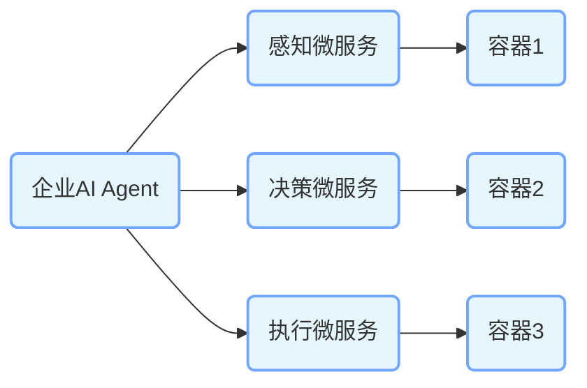

# 企业AI Agent的容器化微服务部署策略

> 关键词：企业AI Agent、容器化、微服务、部署策略、云计算

> 摘要：本文聚焦于企业AI Agent的容器化微服务部署策略。随着人工智能在企业中的广泛应用，AI Agent的高效部署与管理成为关键问题。容器化和微服务技术为解决这一问题提供了有效途径。文章将深入探讨企业AI Agent的核心概念，详细阐述相关算法原理和具体操作步骤，通过数学模型和公式进行理论支撑，结合项目实战给出代码案例及详细解释，分析实际应用场景，推荐相关工具和资源，最后总结未来发展趋势与挑战，旨在为企业提供全面、实用的AI Agent容器化微服务部署方案。

## 1. 背景介绍 
### 1.1 目的和范围
在当今数字化转型的浪潮中，企业越来越依赖人工智能技术来提升竞争力。AI Agent作为人工智能的重要应用形式，能够模拟人类智能进行决策和执行任务。然而，传统的部署方式在灵活性、可扩展性和资源利用率等方面存在不足。本文章的目的在于探讨如何利用容器化和微服务技术，实现企业AI Agent的高效、稳定部署，以满足企业多样化的业务需求。文章的范围涵盖了企业AI Agent的核心概念、算法原理、部署策略、实际应用场景等多个方面。

### 1.2 预期读者
本文预期读者包括企业的技术管理人员、AI开发人员、运维人员以及对企业AI Agent部署感兴趣的技术爱好者。对于技术管理人员，本文提供了全面的部署策略和发展趋势分析，有助于制定合理的技术战略；对于AI开发人员，详细的算法原理和代码案例可作为实践参考；对于运维人员，容器化和微服务的部署细节能指导实际操作；对于技术爱好者，可深入了解企业AI Agent部署的相关知识。

### 1.3 文档结构概述
本文首先介绍企业AI Agent的背景和相关概念，包括目的、预期读者和文档结构概述等。接着阐述核心概念与联系，给出原理和架构的文本示意图及Mermaid流程图。然后详细讲解核心算法原理和具体操作步骤，结合Python源代码进行说明。再通过数学模型和公式对相关理论进行深入分析，并举例说明。之后通过项目实战给出代码实际案例和详细解释。随后分析实际应用场景，推荐相关工具和资源。最后总结未来发展趋势与挑战，提供常见问题与解答及扩展阅读和参考资料。

### 1.4 术语表
#### 1.4.1 核心术语定义
- **企业AI Agent**：指在企业环境中运行的人工智能代理，能够根据预设的规则和学习到的知识，自主地进行决策和执行任务，以实现企业的业务目标。
- **容器化**：一种轻量级的虚拟化技术，将应用程序及其依赖项打包成一个独立的容器，确保应用在不同环境中具有一致的运行效果。
- **微服务**：一种软件架构风格，将一个大型的应用程序拆分成多个小型、自治的服务，每个服务都可以独立开发、部署和维护。

#### 1.4.2 相关概念解释
- **云计算**：基于互联网的计算方式，通过将计算资源、存储资源等提供给用户，实现资源的按需使用和弹性扩展。
- **DevOps**：一种软件开发和运维的协作模式，强调开发团队和运维团队之间的紧密合作和沟通，以实现软件的快速、高质量交付。

#### 1.4.3 缩略词列表
- **AI**：Artificial Intelligence，人工智能
- **CI/CD**：Continuous Integration/Continuous Deployment，持续集成/持续部署
- **Kubernetes**：K8s，一种用于自动化部署、扩展和管理容器化应用程序的开源系统

## 2. 核心概念与联系 

### 企业AI Agent的原理
企业AI Agent通常由感知模块、决策模块和执行模块组成。感知模块负责收集环境信息，决策模块根据收集到的信息进行分析和决策，执行模块则根据决策结果执行相应的任务。例如，在一个电商企业中，AI Agent可以通过感知模块收集用户的浏览记录、购买历史等信息，决策模块根据这些信息为用户推荐个性化的商品，执行模块则将推荐信息展示给用户。

### 容器化的原理
容器化基于Linux内核的命名空间和控制组技术，实现了进程的隔离和资源的限制。每个容器都有自己独立的文件系统、网络空间和进程空间，相互之间不会产生干扰。容器的镜像包含了应用程序及其依赖项，通过容器引擎（如Docker）可以快速创建和启动容器。

### 微服务的原理
微服务架构将一个大型的应用程序拆分成多个小型的服务，每个服务都有自己独立的数据库和业务逻辑。服务之间通过API进行通信，实现了松耦合和高内聚。例如，一个电商应用可以拆分成用户服务、商品服务、订单服务等多个微服务，每个微服务可以独立开发、测试和部署。

### 三者的联系
企业AI Agent可以被拆分成多个微服务，每个微服务负责不同的功能，如感知微服务、决策微服务和执行微服务等。这些微服务可以被容器化，通过容器化技术实现快速部署和资源隔离。同时，容器化和微服务技术也为企业AI Agent的扩展和维护提供了便利，使得企业可以根据业务需求灵活调整AI Agent的规模和功能。

### 文本示意图
```plaintext
企业AI Agent
|-- 感知模块（微服务1，容器化）
|-- 决策模块（微服务2，容器化）
|-- 执行模块（微服务3，容器化）
```

### Mermaid流程图


## 3. 核心算法原理 & 具体操作步骤 

### 核心算法原理

企业AI Agent的决策模块通常使用机器学习或深度学习算法进行决策。以简单的基于规则的决策算法为例，假设我们有一个电商AI Agent，根据用户的购买历史和浏览记录来推荐商品。以下是一个简单的Python实现：

```python
# 用户购买历史和浏览记录
user_purchase_history = ["商品A", "商品B"]
user_browsing_history = ["商品C", "商品D"]

# 商品推荐规则
recommendation_rules = {
    "商品A": ["商品E", "商品F"],
    "商品B": ["商品G", "商品H"],
    "商品C": ["商品I", "商品J"],
    "商品D": ["商品K", "商品L"]
}

# 推荐商品函数
def recommend_products(user_purchase_history, user_browsing_history, recommendation_rules):
    recommended_products = []
    # 根据购买历史推荐
    for product in user_purchase_history:
        if product in recommendation_rules:
            recommended_products.extend(recommendation_rules[product])
    # 根据浏览记录推荐
    for product in user_browsing_history:
        if product in recommendation_rules:
            recommended_products.extend(recommendation_rules[product])
    # 去重
    recommended_products = list(set(recommended_products))
    return recommended_products

# 调用推荐函数
recommended_products = recommend_products(user_purchase_history, user_browsing_history, recommendation_rules)
print("推荐商品:", recommended_products)
```

### 具体操作步骤

#### 3.2.1 容器化AI Agent微服务
1. **编写Dockerfile**：Dockerfile是用于构建Docker镜像的脚本，以下是一个简单的Dockerfile示例：
```Dockerfile
# 使用基础镜像
FROM python:3.9

# 设置工作目录
WORKDIR /app

# 复制代码到容器中
COPY . /app

# 安装依赖
RUN pip install -r requirements.txt

# 暴露端口
EXPOSE 8000

# 启动应用
CMD ["python", "app.py"]
```
2. **构建Docker镜像**：在包含Dockerfile的目录下执行以下命令：
```bash
docker build -t ai-agent-service .
```
3. **运行Docker容器**：执行以下命令启动容器：
```bash
docker run -p 8000:8000 ai-agent-service
```

#### 3.2.2 使用Kubernetes部署容器化微服务
1. **创建Kubernetes部署文件**：以下是一个简单的Deployment文件示例：
```yaml
apiVersion: apps/v1
kind: Deployment
metadata:
  name: ai-agent-deployment
spec:
  replicas: 3
  selector:
    matchLabels:
      app: ai-agent
  template:
    metadata:
      labels:
        app: ai-agent
    spec:
      containers:
      - name: ai-agent-container
        image: ai-agent-service
        ports:
        - containerPort: 8000
```
2. **应用Deployment文件**：执行以下命令创建Deployment：
```bash
kubectl apply -f ai-agent-deployment.yaml
```
3. **创建Kubernetes服务**：以下是一个简单的Service文件示例：
```yaml
apiVersion: v1
kind: Service
metadata:
  name: ai-agent-service
spec:
  selector:
    app: ai-agent
  ports:
    - protocol: TCP
      port: 80
      targetPort: 8000
  type: LoadBalancer
```
4. **应用Service文件**：执行以下命令创建Service：
```bash
kubectl apply -f ai-agent-service.yaml
```

## 4. 数学模型和公式 & 详细讲解 & 举例说明 

### 数学模型

在企业AI Agent的决策过程中，可以使用马尔可夫决策过程（MDP）来描述。马尔可夫决策过程由一个四元组 $(S, A, P, R)$ 表示，其中：
- $S$ 是状态集合，表示AI Agent所处的环境状态。
- $A$ 是动作集合，表示AI Agent可以采取的动作。
- $P$ 是状态转移概率矩阵，表示在状态 $s$ 采取动作 $a$ 后转移到状态 $s'$ 的概率，即 $P(s'|s, a)$。
- $R$ 是奖励函数，表示在状态 $s$ 采取动作 $a$ 后获得的奖励，即 $R(s, a)$。

### 公式

AI Agent的目标是找到一个最优策略 $\pi$，使得长期累积奖励最大化。最优策略可以通过求解贝尔曼方程得到：

$$V^*(s) = \max_{a \in A} \left[ R(s, a) + \gamma \sum_{s' \in S} P(s'|s, a) V^*(s') \right]$$

其中，$V^*(s)$ 是状态 $s$ 的最优价值函数，$\gamma$ 是折扣因子，用于平衡当前奖励和未来奖励。

### 详细讲解

贝尔曼方程的含义是，在状态 $s$ 下的最优价值等于采取某个动作 $a$ 后获得的即时奖励 $R(s, a)$ 加上未来状态的最优价值的折扣和。通过迭代求解贝尔曼方程，可以得到最优策略。

### 举例说明

假设一个简单的AI Agent在一个二维网格环境中移动，状态 $s$ 表示AI Agent在网格中的位置，动作 $a$ 表示AI Agent的移动方向（上、下、左、右）。奖励函数 $R(s, a)$ 可以根据AI Agent是否到达目标位置来设置。例如，到达目标位置获得奖励10，否则获得奖励 -1。状态转移概率矩阵 $P(s'|s, a)$ 表示AI Agent在采取动作 $a$ 后成功转移到状态 $s'$ 的概率。通过迭代求解贝尔曼方程，可以得到AI Agent在每个状态下的最优动作，即最优策略。

## 5. 项目实战：代码实际案例和详细解释说明 

### 5.1  开发环境搭建

#### 5.1.1 安装Docker
- **Ubuntu系统**：执行以下命令安装Docker：
```bash
sudo apt-get update
sudo apt-get install docker.io
```
- **Windows系统**：从Docker官方网站下载Docker Desktop并安装。

#### 5.1.2 安装Kubernetes
- **使用Minikube**：Minikube是一个在本地运行单节点Kubernetes集群的工具。执行以下命令安装Minikube：
```bash
curl -LO https://storage.googleapis.com/minikube/releases/latest/minikube-linux-amd64
sudo install minikube-linux-amd64 /usr/local/bin/minikube
```
启动Minikube：
```bash
minikube start
```

### 5.2  源代码详细实现和代码解读

#### 5.2.1 AI Agent微服务代码
以下是一个简单的AI Agent微服务的Python代码示例：
```python
from flask import Flask, jsonify

app = Flask(__name__)

# 用户购买历史和浏览记录
user_purchase_history = ["商品A", "商品B"]
user_browsing_history = ["商品C", "商品D"]

# 商品推荐规则
recommendation_rules = {
    "商品A": ["商品E", "商品F"],
    "商品B": ["商品G", "商品H"],
    "商品C": ["商品I", "商品J"],
    "商品D": ["商品K", "商品L"]
}

# 推荐商品函数
def recommend_products(user_purchase_history, user_browsing_history, recommendation_rules):
    recommended_products = []
    # 根据购买历史推荐
    for product in user_purchase_history:
        if product in recommendation_rules:
            recommended_products.extend(recommendation_rules[product])
    # 根据浏览记录推荐
    for product in user_browsing_history:
        if product in recommendation_rules:
            recommended_products.extend(recommendation_rules[product])
    # 去重
    recommended_products = list(set(recommended_products))
    return recommended_products

# 定义API接口
@app.route('/recommend', methods=['GET'])
def get_recommendations():
    recommended_products = recommend_products(user_purchase_history, user_browsing_history, recommendation_rules)
    return jsonify({"recommended_products": recommended_products})

if __name__ == '__main__':
    app.run(host='0.0.0.0', port=8000)
```

#### 5.2.2 代码解读
- **Flask框架**：使用Flask框架创建一个简单的Web服务。
- **推荐商品函数**：`recommend_products` 函数根据用户的购买历史和浏览记录，结合推荐规则，生成推荐商品列表。
- **API接口**：定义了一个 `/recommend` 的GET请求接口，用于返回推荐商品列表。

### 5.3  代码解读与分析

#### 5.3.1 容器化分析
通过Dockerfile将AI Agent微服务打包成Docker镜像，实现了应用程序及其依赖项的隔离和封装。在容器中运行AI Agent微服务，确保了应用在不同环境中的一致性。

#### 5.3.2 Kubernetes部署分析
使用Kubernetes的Deployment和Service资源，实现了AI Agent微服务的自动化部署、扩展和负载均衡。通过设置 `replicas` 参数，可以轻松地调整微服务的副本数量，以满足不同的业务需求。

## 6. 实际应用场景 

### 电商领域
在电商领域，企业AI Agent可以根据用户的购买历史、浏览记录、搜索关键词等信息，为用户提供个性化的商品推荐。通过容器化和微服务部署，可以快速响应业务需求的变化，如促销活动、新品上架等。同时，微服务的架构使得不同的功能模块可以独立开发和维护，提高了开发效率。

### 金融领域
在金融领域，企业AI Agent可以用于风险评估、投资决策等。例如，通过分析用户的信用记录、财务状况等信息，评估用户的信用风险。容器化和微服务部署可以确保AI Agent的高可用性和稳定性，同时便于对不同的业务功能进行隔离和管理。

### 医疗领域
在医疗领域，企业AI Agent可以辅助医生进行疾病诊断、治疗方案推荐等。通过分析患者的病历、检查报告等信息，提供准确的诊断和治疗建议。容器化和微服务部署可以保证AI Agent的安全性和隐私性，同时方便与医院的现有信息系统进行集成。

## 7. 工具和资源推荐
### 7.1 学习资源推荐
#### 7.1.1 书籍推荐
- 《Docker实战》：全面介绍了Docker的原理、使用方法和实际应用案例。
- 《Kubernetes实战》：详细讲解了Kubernetes的架构、组件和部署方法。
- 《Python机器学习》：深入探讨了Python在机器学习领域的应用，包括各种机器学习算法的实现和优化。

#### 7.1.2 在线课程
- Coursera上的“容器化微服务开发与部署”课程：系统地介绍了容器化和微服务的相关知识和实践技能。
- edX上的“人工智能基础”课程：涵盖了人工智能的基本概念、算法和应用场景。

#### 7.1.3 技术博客和网站
- Docker官方博客：提供了Docker的最新技术动态和使用技巧。
- Kubernetes官方文档：详细介绍了Kubernetes的各种功能和使用方法。
- Medium上的AI和DevOps相关博客：分享了企业AI Agent部署的实践经验和最佳实践。

### 7.2 开发工具框架推荐
#### 7.2.1 IDE和编辑器
- Visual Studio Code：功能强大的开源代码编辑器，支持多种编程语言和插件扩展。
- PyCharm：专业的Python集成开发环境，提供了丰富的调试和代码分析功能。

#### 7.2.2 调试和性能分析工具
- Docker Desktop：提供了图形化的界面，方便管理和调试Docker容器。
- Kubernetes Dashboard：可视化的Kubernetes管理界面，用于监控和管理Kubernetes集群。

#### 7.2.3 相关框架和库
- Flask：轻量级的Python Web框架，适合快速开发微服务。
- TensorFlow：开源的机器学习框架，广泛应用于AI Agent的开发。

### 7.3 相关论文著作推荐
#### 7.3.1 经典论文
- “Container-based Operating System Virtualization: A Scalable, High-performance Alternative to Hypervisors”：介绍了容器化技术的原理和优势。
- “Microservices: A Definition of This New Architectural Term”：对微服务架构进行了详细的定义和阐述。

#### 7.3.2 最新研究成果
- 关注ACM、IEEE等学术会议和期刊上关于企业AI Agent、容器化和微服务的最新研究论文。

#### 7.3.3 应用案例分析
- 分析各大企业在AI Agent容器化微服务部署方面的成功案例，学习其经验和做法。

## 8. 总结：未来发展趋势与挑战

### 未来发展趋势

#### 8.1.1 智能化升级
企业AI Agent将不断智能化，能够处理更加复杂的任务和场景。例如，结合自然语言处理技术，实现更加智能的对话交互；结合计算机视觉技术，实现图像和视频的分析和处理。

#### 8.1.2 云原生融合
容器化和微服务技术将与云原生技术深度融合，如与Serverless、Service Mesh等技术结合，实现更加高效、灵活的部署和管理。

#### 8.1.3 安全与隐私保护
随着企业AI Agent的广泛应用，安全和隐私保护将成为重要的发展方向。将采用更加先进的加密技术和安全机制，确保数据的安全和隐私。

### 挑战

#### 8.2.1 技术复杂度
容器化和微服务技术本身具有较高的技术复杂度，需要开发人员和运维人员具备较强的技术能力。同时，AI Agent的开发和优化也需要专业的人工智能知识。

#### 8.2.2 性能优化
在大规模部署企业AI Agent时，性能优化是一个关键问题。需要合理配置资源，优化算法和代码，以提高系统的性能和响应速度。

#### 8.2.3 安全风险
容器化和微服务环境下，安全风险更加复杂。需要建立完善的安全防护体系，防止黑客攻击和数据泄露。

## 9. 附录：常见问题与解答

### 9.1 容器化和虚拟化有什么区别？
容器化是一种轻量级的虚拟化技术，与传统的虚拟化技术（如虚拟机）相比，容器化不需要模拟整个操作系统，而是共享宿主机的内核，因此具有更高的资源利用率和更快的启动速度。

### 9.2 如何选择合适的容器编排工具？
常见的容器编排工具包括Kubernetes、Docker Swarm等。Kubernetes功能强大，社区活跃，适用于大规模的容器集群管理；Docker Swarm简单易用，适合小型项目。选择时需要根据项目的规模、复杂度和团队的技术能力等因素进行综合考虑。

### 9.3 如何确保AI Agent的安全性？
可以采取以下措施确保AI Agent的安全性：
- 对数据进行加密处理，防止数据泄露。
- 对AI Agent的访问进行身份验证和授权，防止非法访问。
- 定期对AI Agent进行安全审计和漏洞扫描，及时发现和修复安全问题。

## 10. 扩展阅读 & 参考资料

### 扩展阅读
- 《AI时代的企业数字化转型》：深入探讨了人工智能在企业数字化转型中的应用和挑战。
- 《云原生技术实践》：介绍了云原生技术的发展趋势和实践经验。

### 参考资料
- Docker官方文档：https://docs.docker.com/
- Kubernetes官方文档：https://kubernetes.io/docs/
- Python官方文档：https://docs.python.org/3/