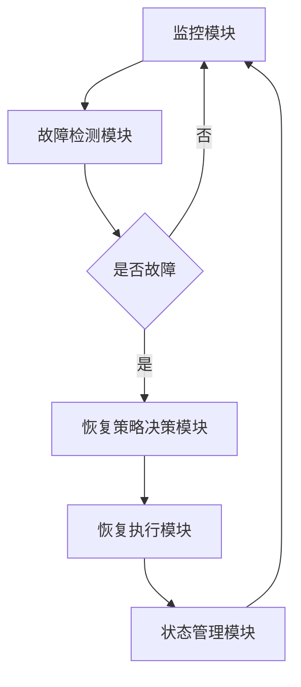

# 企业AI Agent的故障恢复机制

> 关键词：企业AI Agent、故障恢复机制、容错性、可靠性、分布式系统、异常处理、智能决策

> 摘要：本文围绕企业AI Agent的故障恢复机制展开深入探讨。首先介绍了企业AI Agent的背景和故障恢复机制的重要性，明确了文章的目的、范围、预期读者等内容。接着阐述了企业AI Agent及故障恢复机制的核心概念与联系，通过文本示意图和Mermaid流程图直观展示。详细讲解了核心算法原理和具体操作步骤，并结合Python源代码进行说明。同时给出了相关的数学模型和公式，辅以举例加深理解。通过项目实战，展示了代码实际案例并进行详细解释。分析了企业AI Agent故障恢复机制的实际应用场景，推荐了学习、开发等相关的工具和资源。最后总结了未来发展趋势与挑战，提供常见问题解答和扩展阅读参考资料，旨在为企业更好地构建和应用AI Agent的故障恢复机制提供全面的技术指导。

## 1. 背景介绍 
### 1.1 目的和范围
在当今数字化时代，企业越来越依赖AI Agent来执行各种复杂的任务，如自动化业务流程、智能客服、数据分析等。然而，AI Agent在运行过程中可能会遇到各种故障，如硬件故障、软件错误、网络中断等，这些故障可能会导致任务失败、数据丢失，甚至影响企业的正常运营。因此，建立有效的故障恢复机制对于企业AI Agent的稳定运行至关重要。

本文的范围主要涵盖企业AI Agent故障恢复机制的核心概念、算法原理、数学模型、实际应用案例以及相关工具和资源等方面。旨在为企业技术人员、研究人员提供全面的技术参考，帮助他们设计和实现可靠的企业AI Agent故障恢复机制。

### 1.2 预期读者
本文的预期读者包括企业的技术管理人员、AI工程师、软件开发者、系统架构师等对企业AI Agent故障恢复机制感兴趣的专业人士。同时，也适合相关领域的研究人员和学生作为学习和参考资料。

### 1.3 文档结构概述
本文将按照以下结构进行组织：首先介绍企业AI Agent故障恢复机制的背景信息，包括目的、范围、预期读者等；接着阐述核心概念与联系，通过文本示意图和Mermaid流程图展示其原理和架构；详细讲解核心算法原理和具体操作步骤，并结合Python源代码进行说明；给出相关的数学模型和公式，辅以举例加深理解；通过项目实战展示代码实际案例并进行详细解释；分析实际应用场景；推荐学习、开发等相关的工具和资源；最后总结未来发展趋势与挑战，提供常见问题解答和扩展阅读参考资料。

### 1.4 术语表
#### 1.4.1 核心术语定义
- **企业AI Agent**：指在企业环境中运行的，具备一定智能决策和执行能力的软件或硬件实体，能够自主或在人类的指导下完成各种任务。
- **故障恢复机制**：指当AI Agent遇到故障时，系统采取的一系列措施，旨在使AI Agent恢复正常运行，确保任务的连续性和数据的完整性。
- **容错性**：指系统在出现故障时，仍能继续正常运行或在一定程度上维持其功能的能力。
- **可靠性**：指系统在规定的条件下和规定的时间内，完成规定功能的能力。

#### 1.4.2 相关概念解释
- **分布式系统**：由多个独立的计算机节点组成的系统，这些节点通过网络进行通信和协作，共同完成任务。企业AI Agent可能运行在分布式系统中，故障恢复机制需要考虑分布式环境的特点。
- **异常处理**：指在程序运行过程中，对可能出现的异常情况进行捕获、处理和恢复的过程。在企业AI Agent中，异常处理是故障恢复机制的重要组成部分。
- **智能决策**：指AI Agent根据环境信息和自身状态，通过智能算法做出决策的过程。在故障恢复机制中，智能决策可以帮助AI Agent选择最优的恢复策略。

#### 1.4.3 缩略词列表
- **AI**：Artificial Intelligence，人工智能
- **RPC**：Remote Procedure Call，远程过程调用
- **API**：Application Programming Interface，应用程序编程接口
- **SLA**：Service Level Agreement，服务级别协议

## 2. 核心概念与联系 
### 核心概念原理
企业AI Agent的故障恢复机制主要基于以下几个核心概念：

- **监控与检测**：通过对AI Agent的运行状态、性能指标等进行实时监控和检测，及时发现潜在的故障。监控指标可以包括CPU使用率、内存使用率、网络带宽、任务执行时间等。当监控指标超出预设的阈值时，系统会触发故障检测机制，判断是否发生故障。

- **故障分类**：根据故障的性质、影响范围和严重程度等因素，将故障分为不同的类别，如硬件故障、软件故障、网络故障等。不同类型的故障需要采用不同的恢复策略。

- **恢复策略**：针对不同类型的故障，制定相应的恢复策略。恢复策略可以包括重试机制、备份恢复、故障转移、重启等。在选择恢复策略时，需要考虑故障的严重程度、任务的优先级、系统的资源限制等因素。

- **状态管理**：在AI Agent运行过程中，需要对其状态进行管理，包括任务状态、数据状态、环境状态等。当发生故障时，系统可以根据状态信息进行恢复，确保任务的连续性和数据的完整性。

### 架构的文本示意图
企业AI Agent的故障恢复机制架构主要包括以下几个部分：

- **监控模块**：负责对AI Agent的运行状态进行实时监控和检测，收集监控指标并进行分析。

- **故障检测模块**：根据监控模块提供的信息，判断是否发生故障，并对故障进行分类。

- **恢复策略决策模块**：根据故障的类型和严重程度，选择合适的恢复策略。

- **恢复执行模块**：负责执行恢复策略，对AI Agent进行恢复操作。

- **状态管理模块**：对AI Agent的状态进行管理，确保在故障恢复过程中状态的一致性和完整性。

以下是一个简单的文本示意图：

```plaintext
+-------------------+
|    监控模块       |
+-------------------+
       |
       v
+-------------------+
|  故障检测模块    |
+-------------------+
       |
       v
+-------------------+
| 恢复策略决策模块 |
+-------------------+
       |
       v
+-------------------+
|  恢复执行模块    |
+-------------------+
       |
       v
+-------------------+
|  状态管理模块    |
+-------------------+
```

### Mermaid流程图


## 3. 核心算法原理 & 具体操作步骤 
### 核心算法原理
企业AI Agent的故障恢复机制可以采用基于规则的算法和基于机器学习的算法。

#### 基于规则的算法
基于规则的算法是根据预先定义的规则来判断故障类型和选择恢复策略。规则可以根据故障的特征、历史经验等进行定义。例如，如果监控到CPU使用率超过90%，则判断为硬件资源不足故障，选择重启AI Agent的恢复策略。

以下是一个简单的基于规则的故障检测和恢复的Python示例代码：

```python
# 模拟监控数据
monitor_data = {
    "cpu_usage": 95,
    "memory_usage": 80,
    "network_bandwidth": 100
}

# 定义规则
rules = [
    {
        "condition": lambda data: data["cpu_usage"] > 90,
        "fault_type": "硬件资源不足故障",
        "recovery_strategy": "重启AI Agent"
    },
    {
        "condition": lambda data: data["memory_usage"] > 90,
        "fault_type": "内存不足故障",
        "recovery_strategy": "释放内存"
    }
]

# 故障检测和恢复
def fault_detection_and_recovery(data):
    for rule in rules:
        if rule["condition"](data):
            print(f"检测到故障：{rule['fault_type']}")
            print(f"执行恢复策略：{rule['recovery_strategy']}")
            break
    else:
        print("未检测到故障")

# 执行故障检测和恢复
fault_detection_and_recovery(monitor_data)
```

#### 基于机器学习的算法
基于机器学习的算法是通过对历史故障数据进行学习，建立故障预测模型和恢复策略推荐模型。在运行过程中，根据实时监控数据，利用模型进行故障预测和恢复策略推荐。

以下是一个简单的基于机器学习的故障预测的Python示例代码，使用逻辑回归模型：

```python
import numpy as np
from sklearn.linear_model import LogisticRegression

# 模拟历史故障数据
X_train = np.array([[80, 70, 90], [95, 85, 100], [70, 60, 80]])
y_train = np.array([0, 1, 0])  # 0表示无故障，1表示有故障

# 训练逻辑回归模型
model = LogisticRegression()
model.fit(X_train, y_train)

# 模拟实时监控数据
monitor_data = np.array([[92, 82, 95]])

# 故障预测
prediction = model.predict(monitor_data)
if prediction[0] == 1:
    print("预测到故障")
else:
    print("未预测到故障")
```

### 具体操作步骤
1. **监控数据收集**：通过监控模块收集AI Agent的运行状态数据，如CPU使用率、内存使用率、网络带宽等。
2. **故障检测**：使用故障检测模块对监控数据进行分析，判断是否发生故障。可以使用基于规则的算法或基于机器学习的算法进行故障检测。
3. **故障分类**：如果检测到故障，对故障进行分类，确定故障的类型和严重程度。
4. **恢复策略决策**：根据故障的类型和严重程度，使用恢复策略决策模块选择合适的恢复策略。
5. **恢复执行**：使用恢复执行模块执行恢复策略，对AI Agent进行恢复操作。
6. **状态管理**：在故障恢复过程中，使用状态管理模块对AI Agent的状态进行管理，确保状态的一致性和完整性。

## 4. 数学模型和公式 & 详细讲解 & 举例说明 
### 故障检测的数学模型
故障检测可以使用统计模型进行建模。假设监控指标 $x$ 服从正态分布 $N(\mu, \sigma^2)$，其中 $\mu$ 是均值，$\sigma$ 是标准差。可以通过计算监控指标的 $z$ -分数来判断是否发生故障。

$z$ -分数的计算公式为：

$$z = \frac{x - \mu}{\sigma}$$

当 $|z|$ 超过预设的阈值 $z_{threshold}$ 时，认为发生故障。

### 详细讲解
$z$ -分数表示监控指标 $x$ 与均值 $\mu$ 的偏离程度，以标准差 $\sigma$ 为单位。如果 $|z|$ 很大，说明监控指标 $x$ 偏离均值很远，可能发生了故障。

### 举例说明
假设监控指标为CPU使用率，历史数据显示CPU使用率的均值 $\mu = 50$，标准差 $\sigma = 10$，预设的阈值 $z_{threshold} = 2$。如果当前监控到的CPU使用率 $x = 75$，则 $z$ -分数为：

$$z = \frac{75 - 50}{10} = 2.5$$

由于 $|z| = 2.5 > 2$，所以判断发生故障。

### 故障恢复的成本模型
在选择恢复策略时，需要考虑恢复成本。假设恢复策略 $i$ 的恢复成本为 $C_i$，包括时间成本、资源成本等。可以通过最小化恢复成本来选择最优的恢复策略。

设故障发生的概率为 $P_f$，恢复策略 $i$ 成功恢复的概率为 $P_{r_i}$，则选择恢复策略 $i$ 的期望成本为：

$$E(C_i) = P_f \times (C_i + (1 - P_{r_i}) \times C_{fail})$$

其中 $C_{fail}$ 是故障未成功恢复的成本。

### 详细讲解
期望成本 $E(C_i)$ 考虑了故障发生的概率、恢复策略的成本和恢复失败的成本。在选择恢复策略时，应选择期望成本最小的策略。

### 举例说明
假设故障发生的概率 $P_f = 0.1$，有两种恢复策略：
- 恢复策略1：恢复成本 $C_1 = 100$，成功恢复的概率 $P_{r_1} = 0.8$，故障未成功恢复的成本 $C_{fail} = 500$。
- 恢复策略2：恢复成本 $C_2 = 150$，成功恢复的概率 $P_{r_2} = 0.9$，故障未成功恢复的成本 $C_{fail} = 500$。

则恢复策略1的期望成本为：

$$E(C_1) = 0.1 \times (100 + (1 - 0.8) \times 500) = 20$$

恢复策略2的期望成本为：

$$E(C_2) = 0.1 \times (150 + (1 - 0.9) \times 500) = 20$$

在这个例子中，两种恢复策略的期望成本相同，可以根据其他因素（如恢复时间等）来选择。

## 5. 项目实战：代码实际案例和详细解释说明 
### 5.1  开发环境搭建
#### 硬件环境
- 服务器：可以选择云服务器或本地服务器，推荐配置为至少2核CPU、4GB内存、100GB硬盘。
- 网络：稳定的网络连接，带宽建议不低于100Mbps。

#### 软件环境
- 操作系统：可以选择Linux（如Ubuntu、CentOS）或Windows Server。
- 编程语言：Python 3.x
- 相关库：`numpy`、`pandas`、`scikit-learn`、`flask` 等，可以使用 `pip` 进行安装。

```bash
pip install numpy pandas scikit-learn flask
```

### 5.2  源代码详细实现和代码解读
以下是一个简单的企业AI Agent故障恢复机制的项目实战代码示例，包括监控、故障检测、恢复策略决策和恢复执行等功能。

```python
import numpy as np
from sklearn.linear_model import LogisticRegression
import time

# 模拟监控数据生成
def generate_monitor_data():
    cpu_usage = np.random.randint(0, 100)
    memory_usage = np.random.randint(0, 100)
    network_bandwidth = np.random.randint(0, 200)
    return {
        "cpu_usage": cpu_usage,
        "memory_usage": memory_usage,
        "network_bandwidth": network_bandwidth
    }

# 故障检测模型训练
def train_fault_detection_model():
    X_train = np.array([[80, 70, 90], [95, 85, 100], [70, 60, 80]])
    y_train = np.array([0, 1, 0])  # 0表示无故障，1表示有故障
    model = LogisticRegression()
    model.fit(X_train, y_train)
    return model

# 故障检测
def fault_detection(model, data):
    X_test = np.array([[data["cpu_usage"], data["memory_usage"], data["network_bandwidth"]]])
    prediction = model.predict(X_test)
    return prediction[0]

# 恢复策略决策
def recovery_strategy_decision(fault):
    if fault:
        return "重启AI Agent"
    else:
        return "无故障，无需恢复"

# 恢复执行
def recovery_execution(strategy):
    if strategy == "重启AI Agent":
        print("正在重启AI Agent...")
        time.sleep(5)  # 模拟重启过程
        print("AI Agent重启完成")
    else:
        print(strategy)

# 主程序
if __name__ == "__main__":
    model = train_fault_detection_model()
    while True:
        monitor_data = generate_monitor_data()
        print(f"监控数据：{monitor_data}")
        fault = fault_detection(model, monitor_data)
        strategy = recovery_strategy_decision(fault)
        recovery_execution(strategy)
        time.sleep(10)  # 每隔10秒进行一次监控和检测
```

### 5.3  代码解读与分析
- **generate_monitor_data函数**：模拟生成监控数据，包括CPU使用率、内存使用率和网络带宽。
- **train_fault_detection_model函数**：训练故障检测模型，使用逻辑回归模型。
- **fault_detection函数**：使用训练好的模型对监控数据进行故障检测，返回故障预测结果。
- **recovery_strategy_decision函数**：根据故障检测结果选择恢复策略。
- **recovery_execution函数**：执行恢复策略，如果检测到故障则重启AI Agent，否则提示无故障。
- **主程序**：循环进行监控数据生成、故障检测、恢复策略决策和恢复执行，每隔10秒进行一次。

## 6. 实际应用场景 
### 智能客服系统
在智能客服系统中，AI Agent负责与客户进行交互，回答客户的问题。如果AI Agent出现故障，可能会导致客户服务中断，影响客户体验。通过故障恢复机制，可以及时检测到故障并进行恢复，确保智能客服系统的正常运行。例如，当AI Agent的自然语言处理模块出现故障时，可以通过重启该模块或切换到备用模块来恢复服务。

### 自动化业务流程
企业的自动化业务流程通常由多个AI Agent协同完成。如果某个AI Agent出现故障，可能会导致整个业务流程中断。故障恢复机制可以确保在AI Agent出现故障时，能够快速恢复其功能，保证业务流程的连续性。例如，在订单处理流程中，如果负责订单审核的AI Agent出现故障，可以将任务转移到其他备用的AI Agent上进行处理。

### 数据分析与决策支持
AI Agent在数据分析与决策支持系统中扮演着重要的角色。如果AI Agent在数据分析过程中出现故障，可能会导致数据处理错误或决策失误。通过故障恢复机制，可以保证数据分析的准确性和决策的可靠性。例如，当AI Agent在进行大数据分析时出现内存不足故障，可以通过释放内存或增加内存资源来恢复分析任务。

## 7. 工具和资源推荐
### 7.1 学习资源推荐
#### 7.1.1 书籍推荐
- 《人工智能：一种现代的方法》：全面介绍了人工智能的基本概念、算法和应用，是学习人工智能的经典教材。
- 《Python机器学习》：详细介绍了Python在机器学习领域的应用，包括机器学习算法的实现和优化。
- 《分布式系统原理与范型》：深入讲解了分布式系统的原理和设计方法，对于理解企业AI Agent在分布式环境中的故障恢复机制有很大帮助。

#### 7.1.2 在线课程
- Coursera上的“人工智能基础”课程：由知名大学的教授授课，系统地介绍了人工智能的基础知识和应用。
- edX上的“Python数据科学”课程：讲解了Python在数据科学领域的应用，包括数据处理、数据分析和机器学习等内容。
- Udemy上的“分布式系统实战”课程：通过实际案例，介绍了分布式系统的设计和实现方法。

#### 7.1.3 技术博客和网站
- 博客园：有很多AI和分布式系统相关的技术博客，提供了丰富的技术文章和经验分享。
- 开源中国：关注开源技术，有很多关于AI Agent和故障恢复机制的开源项目和技术讨论。
- arXiv：提供了大量的学术论文，对于了解最新的AI和分布式系统研究成果有很大帮助。

### 7.2 开发工具框架推荐
#### 7.2.1 IDE和编辑器
- PyCharm：功能强大的Python集成开发环境，提供了代码编辑、调试、版本控制等功能。
- Visual Studio Code：轻量级的代码编辑器，支持多种编程语言，有丰富的插件扩展功能。

#### 7.2.2 调试和性能分析工具
- pdb：Python自带的调试工具，可以帮助开发者进行代码调试。
- cProfile：Python的性能分析工具，可以分析代码的执行时间和资源消耗情况。

#### 7.2.3 相关框架和库
- TensorFlow：开源的机器学习框架，提供了丰富的机器学习算法和工具，可用于构建AI Agent的故障预测模型。
- PyTorch：另一个流行的机器学习框架，具有动态图和易于使用的特点。
- Celery：分布式任务队列框架，可用于实现AI Agent的任务调度和故障恢复。

### 7.3 相关论文著作推荐
#### 7.3.1 经典论文
- “The Part-Time Parliament”：介绍了Paxos算法，是分布式系统中一致性算法的经典论文。
- “MapReduce: Simplified Data Processing on Large Clusters”：提出了MapReduce编程模型，为大数据处理提供了一种高效的方法。

#### 7.3.2 最新研究成果
- 在IEEE Transactions on Dependable and Secure Computing、ACM Transactions on Computer Systems等期刊上发表的关于AI Agent故障恢复机制的研究论文。

#### 7.3.3 应用案例分析
- 一些企业在实际应用中采用的AI Agent故障恢复机制的案例分析报告，如谷歌、亚马逊等公司的相关技术文档。

## 8. 总结：未来发展趋势与挑战
### 未来发展趋势
- **智能化恢复策略**：随着人工智能技术的不断发展，未来的故障恢复机制将更加智能化。AI Agent可以通过学习和分析历史故障数据，自动选择最优的恢复策略，提高故障恢复的效率和准确性。
- **自适应容错**：企业AI Agent将具备自适应容错能力，能够根据不同的运行环境和任务需求，动态调整故障恢复策略。例如，在资源紧张的情况下，优先选择轻量级的恢复策略。
- **分布式协同恢复**：在分布式系统中，多个AI Agent将实现协同恢复。当某个AI Agent出现故障时，其他AI Agent可以提供支持和协助，共同完成故障恢复任务。

### 挑战
- **复杂性管理**：企业AI Agent的故障恢复机制涉及到多个模块和组件，系统的复杂性不断增加。如何有效地管理系统的复杂性，确保故障恢复机制的可靠性和可维护性是一个挑战。
- **数据安全与隐私**：在故障恢复过程中，需要处理大量的敏感数据，如用户信息、业务数据等。如何保证数据的安全和隐私，防止数据泄露和滥用是一个重要的问题。
- **实时性要求**：对于一些对实时性要求较高的应用场景，如智能交通、金融交易等，故障恢复机制需要在短时间内完成恢复任务。如何满足实时性要求，提高故障恢复的速度是一个挑战。

## 9. 附录：常见问题与解答
### 问题1：企业AI Agent故障恢复机制的实现成本高吗？
答：实现成本取决于多种因素，如系统的规模、复杂度、采用的技术和工具等。一般来说，采用成熟的开源技术和框架可以降低实现成本。同时，合理设计故障恢复机制，避免过度设计，也可以减少成本。

### 问题2：如何确保故障恢复机制的可靠性？
答：可以通过以下方法确保故障恢复机制的可靠性：进行充分的测试，包括单元测试、集成测试、系统测试等；采用冗余设计，如备份系统、备用AI Agent等；定期进行故障演练，提高系统的应急处理能力。

### 问题3：故障恢复机制对企业AI Agent的性能有影响吗？
答：故障恢复机制可能会对企业AI Agent的性能产生一定的影响。例如，监控模块会消耗一定的系统资源，恢复操作可能会导致任务执行的延迟。但是，通过合理设计和优化故障恢复机制，可以将这种影响降到最低。

## 10. 扩展阅读 & 参考资料
### 扩展阅读
- 《云计算与分布式系统：从并行处理到物联网》：深入介绍了云计算和分布式系统的相关知识，对于理解企业AI Agent在分布式环境中的故障恢复机制有进一步的帮助。
- 《数据挖掘：概念与技术》：讲解了数据挖掘的基本概念、算法和应用，可用于分析故障数据和优化故障恢复策略。

### 参考资料
- 相关的技术标准和规范，如IEEE 1541-2002《IEEE Standard for Prefixes for Binary Multiples》。
- 企业AI Agent相关的开源项目文档，如TensorFlow、PyTorch等项目的官方文档。