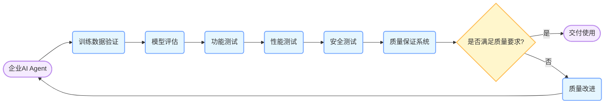

# 企业AI Agent的自动化测试与质量保证系统

> 关键词：企业AI Agent、自动化测试、质量保证系统、AI测试框架、测试策略

> 摘要：本文围绕企业AI Agent的自动化测试与质量保证系统展开深入探讨。随着AI技术在企业中的广泛应用，企业AI Agent的质量和稳定性愈发重要。文章首先介绍了相关背景，包括目的范围、预期读者等内容。接着阐述了核心概念与联系，分析了核心算法原理并给出具体操作步骤，通过数学模型和公式进行详细讲解与举例说明。然后结合项目实战，展示代码实际案例并进行详细解释。探讨了实际应用场景，推荐了相关工具和资源，最后总结未来发展趋势与挑战，提供常见问题解答及扩展阅读与参考资料，旨在为企业构建高效的AI Agent自动化测试与质量保证系统提供全面的技术指导和理论支持。

## 1. 背景介绍 
### 1.1 目的和范围
在当今数字化快速发展的时代，企业AI Agent被广泛应用于客户服务、业务流程自动化、数据分析等多个领域。企业AI Agent的自动化测试与质量保证系统的主要目的在于确保AI Agent的功能正确性、性能稳定性、安全性以及与企业业务的适配性。本系统的范围涵盖了从AI Agent的训练数据验证、模型评估到实际运行时的功能测试、性能测试等多个方面，旨在全面保障企业AI Agent在复杂多变的业务环境中能够稳定、高效地运行。

### 1.2 预期读者
本文的预期读者包括企业的AI研发团队、测试团队、质量保证人员、软件架构师以及对企业AI Agent技术感兴趣的技术爱好者。对于AI研发团队，本文提供的自动化测试和质量保证方法有助于提高AI Agent的开发效率和质量；测试团队可以从中获取具体的测试策略和技术手段；质量保证人员能够依据本文构建完善的质量保证体系；软件架构师可以借鉴相关的系统架构设计思路；技术爱好者则可以通过本文了解企业AI Agent自动化测试与质量保证的全貌。

### 1.3 文档结构概述
本文首先介绍了企业AI Agent自动化测试与质量保证系统的背景信息，包括目的、范围、预期读者和文档结构概述等内容。接着深入阐述了核心概念与联系，包括AI Agent的基本原理、自动化测试和质量保证的相关概念以及它们之间的关系。然后详细讲解了核心算法原理和具体操作步骤，通过Python代码进行示例。随后通过数学模型和公式进一步说明测试和质量保证的理论基础，并举例说明。项目实战部分展示了代码实际案例并进行详细解释，包括开发环境搭建、源代码实现和代码解读。之后探讨了实际应用场景，推荐了相关的工具和资源，最后总结未来发展趋势与挑战，提供常见问题解答及扩展阅读与参考资料。

### 1.4 术语表
#### 1.4.1 核心术语定义
- **企业AI Agent**：指在企业环境中运行的、基于人工智能技术的智能代理，能够自主地执行特定任务，如客户服务、业务流程自动化等。
- **自动化测试**：使用自动化工具和脚本代替人工手动执行测试用例的过程，旨在提高测试效率和准确性。
- **质量保证系统**：一套用于确保产品或服务满足规定质量要求的体系，包括质量规划、质量控制和质量改进等活动。
- **AI测试框架**：专门为AI系统设计的测试工具和方法的集合，用于对AI模型和相关组件进行测试。
- **测试用例**：为了验证特定功能或特性是否正确实现而设计的一组输入和预期输出。

#### 1.4.2 相关概念解释
- **训练数据验证**：对用于训练AI模型的数据进行检查，确保数据的准确性、完整性和一致性，以避免因数据问题导致模型性能下降。
- **模型评估**：使用各种评估指标对训练好的AI模型进行评估，以确定模型的性能和效果，如准确率、召回率、F1值等。
- **功能测试**：验证AI Agent是否能够正确实现预期的功能，包括输入输出的正确性、业务逻辑的准确性等。
- **性能测试**：评估AI Agent在不同负载条件下的性能表现，如响应时间、吞吐量、资源利用率等。

#### 1.4.3 缩略词列表
- **AI**：Artificial Intelligence（人工智能）
- **ML**：Machine Learning（机器学习）
- **DL**：Deep Learning（深度学习）
- **API**：Application Programming Interface（应用程序编程接口）
- **CI/CD**：Continuous Integration/Continuous Deployment（持续集成/持续部署）

## 2. 核心概念与联系 

### 2.1 企业AI Agent原理
企业AI Agent通常基于机器学习或深度学习技术构建。其基本原理是通过对大量数据的学习，构建模型来理解和处理输入信息，并根据模型的输出做出决策或执行相应的任务。例如，在客户服务场景中，AI Agent可以通过学习历史对话数据，构建自然语言处理模型，理解客户的问题并给出相应的回答。

### 2.2 自动化测试概念
自动化测试是一种使用软件工具和脚本来执行测试用例的方法。与手动测试相比，自动化测试具有更高的效率和准确性，能够快速、重复地执行大量测试用例。自动化测试可以分为功能自动化测试、性能自动化测试、安全自动化测试等不同类型。

### 2.3 质量保证系统概念
质量保证系统是一个全面的体系，旨在确保产品或服务满足规定的质量要求。它包括质量规划、质量控制和质量改进等多个环节。质量规划确定质量目标和质量计划；质量控制通过各种手段监控和评估产品或服务的质量；质量改进则根据质量评估的结果采取措施改进产品或服务的质量。

### 2.4 核心概念联系
企业AI Agent的质量直接影响其在企业中的应用效果，而自动化测试和质量保证系统是确保AI Agent质量的重要手段。自动化测试通过执行各种测试用例，发现AI Agent中存在的缺陷和问题，为质量保证系统提供数据支持。质量保证系统则根据自动化测试的结果，制定质量改进措施，确保AI Agent的质量不断提高。同时，AI Agent的原理和特点也会影响自动化测试和质量保证系统的设计和实现。例如，由于AI Agent的决策过程具有一定的不确定性，需要采用特殊的测试方法和评估指标来确保其质量。

### 2.5 文本示意图
企业AI Agent的自动化测试与质量保证系统可以用以下文本示意图表示：

企业AI Agent -> 训练数据验证 -> 模型评估 -> 功能测试 -> 性能测试 -> 安全测试 -> 质量保证系统 -> 质量改进 -> 企业AI Agent（优化后）

### 2.6 Mermaid流程图


## 3. 核心算法原理 & 具体操作步骤 

### 3.1 训练数据验证算法原理
训练数据验证的主要目的是确保用于训练AI模型的数据的质量。常见的训练数据验证算法包括数据清洗、数据标准化、数据去重等。以下是一个简单的数据清洗算法的Python实现：

```python
import pandas as pd

def data_cleaning(data):
    # 去除缺失值
    data = data.dropna()
    # 去除重复值
    data = data.drop_duplicates()
    return data

# 示例数据
data = pd.DataFrame({
    'col1': [1, 2, None, 4],
    'col2': ['a', 'b', 'c', 'b']
})

cleaned_data = data_cleaning(data)
print(cleaned_data)
```

### 3.2 模型评估算法原理
模型评估的关键是选择合适的评估指标。对于分类问题，常用的评估指标包括准确率、召回率、F1值等；对于回归问题，常用的评估指标包括均方误差（MSE）、均方根误差（RMSE）等。以下是一个简单的分类模型评估的Python实现：

```python
from sklearn.datasets import load_iris
from sklearn.model_selection import train_test_split
from sklearn.tree import DecisionTreeClassifier
from sklearn.metrics import accuracy_score, recall_score, f1_score

# 加载数据集
iris = load_iris()
X = iris.data
y = iris.target

# 划分训练集和测试集
X_train, X_test, y_train, y_test = train_test_split(X, y, test_size=0.2, random_state=42)

# 训练模型
model = DecisionTreeClassifier()
model.fit(X_train, y_train)

# 预测
y_pred = model.predict(X_test)

# 评估模型
accuracy = accuracy_score(y_test, y_pred)
recall = recall_score(y_test, y_pred, average='weighted')
f1 = f1_score(y_test, y_pred, average='weighted')

print(f"Accuracy: {accuracy}")
print(f"Recall: {recall}")
print(f"F1 Score: {f1}")
```

### 3.3 功能测试算法原理
功能测试的主要目的是验证AI Agent的功能是否正确实现。可以通过编写测试用例，模拟不同的输入场景，检查AI Agent的输出是否符合预期。以下是一个简单的功能测试的Python实现：

```python
def ai_agent(input_data):
    # 模拟AI Agent的功能
    if input_data == 'hello':
        return 'hello too'
    else:
        return 'unknown input'

# 测试用例
test_cases = [
    {'input': 'hello', 'expected_output': 'hello too'},
    {'input': 'world', 'expected_output': 'unknown input'}
]

# 执行测试
for test_case in test_cases:
    input_data = test_case['input']
    expected_output = test_case['expected_output']
    actual_output = ai_agent(input_data)
    if actual_output == expected_output:
        print(f"Test case passed: Input = {input_data}, Expected Output = {expected_output}, Actual Output = {actual_output}")
    else:
        print(f"Test case failed: Input = {input_data}, Expected Output = {expected_output}, Actual Output = {actual_output}")
```

### 3.4 性能测试算法原理
性能测试的核心是模拟不同的负载条件，评估AI Agent在高并发、大数据量等情况下的性能表现。可以使用工具如Apache JMeter、Gatling等进行性能测试。以下是一个简单的性能测试脚本示例：

```python
import time
import requests

# 模拟请求
def send_request():
    start_time = time.time()
    response = requests.get('http://example.com')
    end_time = time.time()
    response_time = end_time - start_time
    return response_time

# 执行多次请求
num_requests = 100
total_response_time = 0
for _ in range(num_requests):
    response_time = send_request()
    total_response_time += response_time

# 计算平均响应时间
average_response_time = total_response_time / num_requests
print(f"Average Response Time: {average_response_time} seconds")
```

### 3.5 具体操作步骤
1. **训练数据验证**：
    - 收集训练数据。
    - 使用数据清洗、标准化等算法对数据进行预处理。
    - 检查数据的完整性、准确性和一致性。
2. **模型评估**：
    - 选择合适的评估指标。
    - 划分训练集和测试集。
    - 训练模型并在测试集上进行预测。
    - 计算评估指标，评估模型性能。
3. **功能测试**：
    - 编写测试用例，定义输入和预期输出。
    - 执行测试用例，检查实际输出是否符合预期。
    - 记录测试结果，对失败的测试用例进行分析和修复。
4. **性能测试**：
    - 确定性能测试的指标和场景。
    - 使用性能测试工具模拟不同的负载条件。
    - 执行性能测试，记录性能数据。
    - 分析性能数据，找出性能瓶颈并进行优化。

## 4. 数学模型和公式 & 详细讲解 & 举例说明 

### 4.1 训练数据验证相关数学模型和公式
在训练数据验证中，数据标准化是一个重要的步骤。常用的数据标准化方法是Z-score标准化，其公式如下：

$$z = \frac{x - \mu}{\sigma}$$

其中，$x$ 是原始数据，$\mu$ 是数据的均值，$\sigma$ 是数据的标准差。Z-score标准化将数据转换为均值为0，标准差为1的标准正态分布，有助于提高模型的训练效果。

例如，假设有一组数据 $[1, 2, 3, 4, 5]$，其均值 $\mu = \frac{1 + 2 + 3 + 4 + 5}{5} = 3$，标准差 $\sigma = \sqrt{\frac{(1 - 3)^2 + (2 - 3)^2 + (3 - 3)^2 + (4 - 3)^2 + (5 - 3)^2}{5}} \approx 1.414$。对数据进行Z-score标准化：

- 对于 $x = 1$，$z = \frac{1 - 3}{1.414} \approx -1.414$
- 对于 $x = 2$，$z = \frac{2 - 3}{1.414} \approx -0.707$
- 对于 $x = 3$，$z = \frac{3 - 3}{1.414} = 0$
- 对于 $x = 4$，$z = \frac{4 - 3}{1.414} \approx 0.707$
- 对于 $x = 5$，$z = \frac{5 - 3}{1.414} \approx 1.414$

### 4.2 模型评估相关数学模型和公式
#### 4.2.1 准确率（Accuracy）
准确率是分类问题中最常用的评估指标之一，其公式如下：

$$Accuracy = \frac{TP + TN}{TP + TN + FP + FN}$$

其中，$TP$ 表示真正例（True Positive），即模型预测为正例且实际为正例的样本数；$TN$ 表示真反例（True Negative），即模型预测为反例且实际为反例的样本数；$FP$ 表示假正例（False Positive），即模型预测为正例但实际为反例的样本数；$FN$ 表示假反例（False Negative），即模型预测为反例但实际为正例的样本数。

例如，假设有一个二分类问题，模型的预测结果如下：

| 实际类别 | 预测为正例 | 预测为反例 |
| --- | --- | --- |
| 正例 | 80 | 20 |
| 反例 | 10 | 90 |

则 $TP = 80$，$TN = 90$，$FP = 10$，$FN = 20$，准确率为：

$$Accuracy = \frac{80 + 90}{80 + 90 + 10 + 20} = \frac{170}{200} = 0.85$$

#### 4.2.2 召回率（Recall）
召回率也称为查全率，其公式如下：

$$Recall = \frac{TP}{TP + FN}$$

召回率表示模型能够正确预测出的正例占实际正例的比例。对于上述例子，召回率为：

$$Recall = \frac{80}{80 + 20} = 0.8$$

#### 4.2.3 F1值（F1 Score）
F1值是准确率和召回率的调和平均数，其公式如下：

$$F1 = \frac{2 \times Precision \times Recall}{Precision + Recall}$$

其中，$Precision = \frac{TP}{TP + FP}$ 表示精确率。对于上述例子，$Precision = \frac{80}{80 + 10} \approx 0.889$，则F1值为：

$$F1 = \frac{2 \times 0.889 \times 0.8}{0.889 + 0.8} \approx 0.844$$

### 4.3 性能测试相关数学模型和公式
在性能测试中，平均响应时间是一个重要的指标。平均响应时间的计算公式如下：

$$Average\ Response\ Time = \frac{\sum_{i = 1}^{n} Response\ Time_i}{n}$$

其中，$Response\ Time_i$ 表示第 $i$ 次请求的响应时间，$n$ 表示请求的总次数。

例如，假设有5次请求的响应时间分别为 $[0.1, 0.2, 0.3, 0.4, 0.5]$ 秒，则平均响应时间为：

$$Average\ Response\ Time = \frac{0.1 + 0.2 + 0.3 + 0.4 + 0.5}{5} = 0.3$$ 秒

## 5. 项目实战：代码实际案例和详细解释说明 

### 5.1  开发环境搭建
#### 5.1.1 安装Python
首先需要安装Python环境，建议使用Python 3.7及以上版本。可以从Python官方网站（https://www.python.org/downloads/） 下载安装包，按照安装向导进行安装。

#### 5.1.2 安装必要的库
使用以下命令安装必要的Python库：

```bash
pip install pandas scikit-learn requests
```

### 5.2  源代码详细实现和代码解读
#### 5.2.1 训练数据验证代码实现
```python
import pandas as pd

def data_cleaning(data):
    # 去除缺失值
    data = data.dropna()
    # 去除重复值
    data = data.drop_duplicates()
    return data

# 示例数据
data = pd.DataFrame({
    'col1': [1, 2, None, 4],
    'col2': ['a', 'b', 'c', 'b']
})

cleaned_data = data_cleaning(data)
print(cleaned_data)
```

**代码解读**：
- `data.dropna()`：用于去除数据中的缺失值。
- `data.drop_duplicates()`：用于去除数据中的重复值。

#### 5.2.2 模型评估代码实现
```python
from sklearn.datasets import load_iris
from sklearn.model_selection import train_test_split
from sklearn.tree import DecisionTreeClassifier
from sklearn.metrics import accuracy_score, recall_score, f1_score

# 加载数据集
iris = load_iris()
X = iris.data
y = iris.target

# 划分训练集和测试集
X_train, X_test, y_train, y_test = train_test_split(X, y, test_size=0.2, random_state=42)

# 训练模型
model = DecisionTreeClassifier()
model.fit(X_train, y_train)

# 预测
y_pred = model.predict(X_test)

# 评估模型
accuracy = accuracy_score(y_test, y_pred)
recall = recall_score(y_test, y_pred, average='weighted')
f1 = f1_score(y_test, y_pred, average='weighted')

print(f"Accuracy: {accuracy}")
print(f"Recall: {recall}")
print(f"F1 Score: {f1}")
```

**代码解读**：
- `load_iris()`：用于加载鸢尾花数据集。
- `train_test_split()`：用于将数据集划分为训练集和测试集。
- `DecisionTreeClassifier()`：创建一个决策树分类器模型。
- `model.fit()`：训练模型。
- `model.predict()`：使用训练好的模型进行预测。
- `accuracy_score()`、`recall_score()`、`f1_score()`：分别用于计算准确率、召回率和F1值。

#### 5.2.3 功能测试代码实现
```python
def ai_agent(input_data):
    # 模拟AI Agent的功能
    if input_data == 'hello':
        return 'hello too'
    else:
        return 'unknown input'

# 测试用例
test_cases = [
    {'input': 'hello', 'expected_output': 'hello too'},
    {'input': 'world', 'expected_output': 'unknown input'}
]

# 执行测试
for test_case in test_cases:
    input_data = test_case['input']
    expected_output = test_case['expected_output']
    actual_output = ai_agent(input_data)
    if actual_output == expected_output:
        print(f"Test case passed: Input = {input_data}, Expected Output = {expected_output}, Actual Output = {actual_output}")
    else:
        print(f"Test case failed: Input = {input_data}, Expected Output = {expected_output}, Actual Output = {actual_output}")
```

**代码解读**：
- `ai_agent()`：模拟AI Agent的功能。
- `test_cases`：定义测试用例，包含输入和预期输出。
- 循环遍历测试用例，执行测试并检查实际输出是否符合预期。

#### 5.2.4 性能测试代码实现
```python
import time
import requests

# 模拟请求
def send_request():
    start_time = time.time()
    response = requests.get('http://example.com')
    end_time = time.time()
    response_time = end_time - start_time
    return response_time

# 执行多次请求
num_requests = 100
total_response_time = 0
for _ in range(num_requests):
    response_time = send_request()
    total_response_time += response_time

# 计算平均响应时间
average_response_time = total_response_time / num_requests
print(f"Average Response Time: {average_response_time} seconds")
```

**代码解读**：
- `send_request()`：模拟发送请求并记录响应时间。
- 循环执行多次请求，累加响应时间。
- 计算平均响应时间并输出。

### 5.3  代码解读与分析
通过上述代码实现，可以完成企业AI Agent的训练数据验证、模型评估、功能测试和性能测试。训练数据验证确保了训练数据的质量，为模型训练提供了可靠的数据基础；模型评估使用各种评估指标对训练好的模型进行评估，帮助我们了解模型的性能；功能测试验证了AI Agent的功能是否正确实现；性能测试评估了AI Agent在不同负载条件下的性能表现。这些测试步骤相互配合，有助于全面保障企业AI Agent的质量。

## 6. 实际应用场景 
### 6.1 客户服务场景
在客户服务场景中，企业AI Agent可以自动回答客户的问题，提供技术支持等。通过自动化测试和质量保证系统，可以确保AI Agent能够准确理解客户的问题，并给出正确的回答。例如，对AI Agent的自然语言处理模型进行功能测试，验证其对各种问题的理解和回答能力；进行性能测试，确保在高并发情况下能够快速响应客户的请求。

### 6.2 业务流程自动化场景
在业务流程自动化场景中，企业AI Agent可以自动执行一些重复性的业务任务，如数据录入、订单处理等。自动化测试和质量保证系统可以确保AI Agent能够正确执行这些任务，避免因错误操作导致业务流程出现问题。例如，对AI Agent的业务逻辑进行功能测试，验证其在不同业务场景下的处理能力；对其性能进行测试，确保在大数据量情况下能够高效运行。

### 6.3 数据分析场景
在数据分析场景中，企业AI Agent可以对大量数据进行分析和挖掘，提供决策支持。通过自动化测试和质量保证系统，可以确保AI Agent的数据分析模型的准确性和可靠性。例如，对AI Agent的数据分析模型进行模型评估，验证其在不同数据集上的性能；对其数据处理流程进行功能测试，确保数据的准确性和完整性。

## 7. 工具和资源推荐
### 7.1 学习资源推荐
#### 7.1.1 书籍推荐
- 《Python机器学习》：介绍了Python在机器学习中的应用，包括数据处理、模型训练、评估等内容。
- 《深度学习》：深度学习领域的经典著作，深入讲解了深度学习的原理和算法。
- 《软件测试基础教程》：系统介绍了软件测试的基本概念、方法和技术。

#### 7.1.2 在线课程
- Coursera上的“机器学习”课程：由斯坦福大学教授Andrew Ng讲授，是机器学习领域的经典课程。
- edX上的“深度学习基础”课程：深入讲解了深度学习的基本原理和算法。
- Udemy上的“软件测试实战”课程：通过实际案例介绍软件测试的方法和技术。

#### 7.1.3 技术博客和网站
- Medium：有许多关于AI、机器学习、软件测试等领域的技术文章。
- Towards Data Science：专注于数据科学和机器学习领域的技术博客。
- Software Testing Help：提供软件测试的最新技术和方法。

### 7.2 开发工具框架推荐
#### 7.2.1 IDE和编辑器
- PyCharm：功能强大的Python集成开发环境，提供代码编辑、调试、版本控制等功能。
- Visual Studio Code：轻量级的代码编辑器，支持多种编程语言，有丰富的插件生态系统。

#### 7.2.2 调试和性能分析工具
- PDB：Python自带的调试工具，用于调试Python代码。
- Apache JMeter：用于性能测试的工具，可以模拟高并发场景，对系统的性能进行评估。

#### 7.2.3 相关框架和库
- Scikit-learn：Python中常用的机器学习库，提供了丰富的机器学习算法和工具。
- TensorFlow：开源的深度学习框架，广泛应用于深度学习领域。
- Pytest：Python中常用的测试框架，用于编写和执行测试用例。

### 7.3 相关论文著作推荐
#### 7.3.1 经典论文
- “Deep Learning” by Yann LeCun, Yoshua Bengio, and Geoffrey Hinton：深度学习领域的经典论文，介绍了深度学习的发展历程和基本原理。
- “The Elements of Statistical Learning” by Trevor Hastie, Robert Tibshirani, and Jerome Friedman：统计学习领域的经典著作，深入讲解了统计学习的理论和方法。

#### 7.3.2 最新研究成果
- 关注顶级学术会议如NeurIPS、ICML、CVPR等的最新研究成果，了解AI和机器学习领域的最新进展。
- 查阅相关学术期刊如Journal of Artificial Intelligence Research、Artificial Intelligence等的最新论文。

#### 7.3.3 应用案例分析
- 一些知名企业如Google、Microsoft、Amazon等的技术博客会分享他们在AI Agent应用方面的实践经验和案例分析，可以从中学习到实际应用中的技术和方法。

## 8. 总结：未来发展趋势与挑战
### 8.1 未来发展趋势
- **智能化测试**：未来的自动化测试将更加智能化，能够自动生成测试用例、自动分析测试结果，提高测试效率和准确性。
- **融合测试**：将功能测试、性能测试、安全测试等多种测试方法融合在一起，全面保障企业AI Agent的质量。
- **持续测试**：在企业AI Agent的整个生命周期中进行持续测试，及时发现和解决问题，确保其质量的稳定性。

### 8.2 挑战
- **数据隐私和安全**：企业AI Agent通常处理大量的敏感数据，如何确保数据的隐私和安全是一个重要的挑战。
- **模型可解释性**：AI模型的决策过程往往具有一定的黑盒性，如何提高模型的可解释性，让用户理解模型的决策依据是一个亟待解决的问题。
- **测试成本**：随着AI Agent的复杂性不断增加，测试成本也会相应提高，如何在保证测试质量的前提下降低测试成本是一个挑战。

## 9. 附录：常见问题与解答
### 9.1 如何选择合适的评估指标？
选择合适的评估指标需要根据具体的问题和业务需求来决定。对于分类问题，如果关注模型的整体准确性，可以选择准确率；如果关注模型对正例的识别能力，可以选择召回率；如果需要综合考虑准确率和召回率，可以选择F1值。对于回归问题，常用的评估指标包括均方误差、均方根误差等。

### 9.2 如何处理AI Agent的不确定性？
可以采用一些方法来处理AI Agent的不确定性，如使用集成学习方法，通过多个模型的组合来降低不确定性；对模型的输出进行概率估计，提供更多的信息给用户；使用可解释性技术，让用户了解模型的决策过程。

### 9.3 如何提高自动化测试的效率？
可以采用以下方法提高自动化测试的效率：使用高效的测试框架和工具；优化测试用例的设计，减少冗余测试；采用并行测试技术，同时执行多个测试用例；使用自动化脚本生成工具，自动生成测试用例。

## 10. 扩展阅读 & 参考资料
### 10.1 扩展阅读
- 《人工智能：现代方法》：全面介绍了人工智能的基本概念、方法和技术。
- 《Python数据科学手册》：介绍了Python在数据科学中的应用，包括数据处理、数据分析、机器学习等内容。

### 10.2 参考资料
- Python官方文档（https://docs.python.org/）
- Scikit-learn官方文档（https://scikit-learn.org/）
- TensorFlow官方文档（https://www.tensorflow.org/）
- Pytest官方文档（https://docs.pytest.org/）