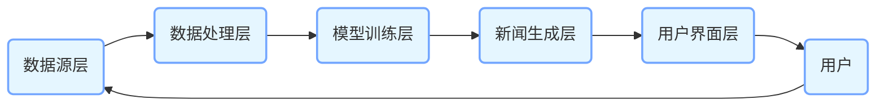

# 企业估值中的AI驱动的自动化新闻写作平台评估

> 关键词：企业估值、AI驱动、自动化新闻写作平台、评估方法、财务分析、市场前景、技术创新

> 摘要：本文聚焦于企业估值中AI驱动的自动化新闻写作平台评估这一重要议题。随着人工智能技术的飞速发展，自动化新闻写作平台在新闻行业逐渐崭露头角。准确评估此类平台的价值对于投资者、企业管理者等利益相关者至关重要。文章首先介绍了研究的背景、目的、预期读者和文档结构，接着阐述了相关核心概念与联系，深入剖析了核心算法原理和具体操作步骤，通过数学模型和公式进行理论支撑并举例说明。随后通过项目实战展示代码案例并详细解读，探讨了其实际应用场景。同时推荐了相关的工具和资源，最后总结了未来发展趋势与挑战，解答常见问题并提供扩展阅读与参考资料，旨在为全面、科学地评估AI驱动的自动化新闻写作平台提供系统的方法和思路。

## 1. 背景介绍 
### 1.1 目的和范围
在当今数字化和智能化的时代，AI技术的应用已经深入到各个领域，新闻行业也不例外。AI驱动的自动化新闻写作平台应运而生，它能够快速、高效地生成新闻内容，大大提高了新闻生产的效率。然而，对于这类平台的企业估值却面临着诸多挑战，因为其价值不仅取决于传统的财务指标，还与技术创新、市场前景、数据资产等因素密切相关。本文的目的在于提供一套全面、科学的评估方法，帮助投资者、企业管理者等准确评估AI驱动的自动化新闻写作平台的价值。

本文的研究范围涵盖了AI驱动的自动化新闻写作平台的各个方面，包括技术原理、商业模式、市场竞争、财务状况等。通过对这些因素的综合分析，旨在得出一个合理的企业估值。

### 1.2 预期读者
本文的预期读者主要包括以下几类人群：
1. **投资者**：希望了解AI驱动的自动化新闻写作平台的投资价值，以便做出明智的投资决策。
2. **企业管理者**：需要对自身企业或竞争对手的自动化新闻写作平台进行估值，为战略规划、并购重组等决策提供依据。
3. **新闻行业从业者**：关注行业的技术发展趋势，了解自动化新闻写作平台对新闻生产和传播的影响。
4. **研究人员**：对AI技术在新闻领域的应用以及企业估值方法感兴趣，希望通过本文获取相关的研究资料和思路。

### 1.3 文档结构概述
本文共分为十个部分，具体结构如下：
1. **背景介绍**：阐述研究的目的、范围、预期读者和文档结构，为后续内容奠定基础。
2. **核心概念与联系**：介绍AI驱动的自动化新闻写作平台的相关核心概念，以及它们之间的联系，并通过文本示意图和Mermaid流程图进行直观展示。
3. **核心算法原理 & 具体操作步骤**：深入剖析自动化新闻写作平台所采用的核心算法原理，并使用Python源代码详细阐述具体操作步骤。
4. **数学模型和公式 & 详细讲解 & 举例说明**：建立用于企业估值的数学模型和公式，进行详细讲解并通过实际案例进行说明。
5. **项目实战：代码实际案例和详细解释说明**：通过一个具体的项目实战，展示自动化新闻写作平台的代码实现，并对代码进行详细解读。
6. **实际应用场景**：探讨AI驱动的自动化新闻写作平台在新闻行业以及其他领域的实际应用场景。
7. **工具和资源推荐**：推荐与自动化新闻写作平台开发和评估相关的学习资源、开发工具框架以及论文著作。
8. **总结：未来发展趋势与挑战**：总结AI驱动的自动化新闻写作平台的未来发展趋势，并分析其面临的挑战。
9. **附录：常见问题与解答**：解答读者在阅读本文过程中可能遇到的常见问题。
10. **扩展阅读 & 参考资料**：提供相关的扩展阅读资料和参考书目，方便读者进一步深入研究。

### 1.4 术语表
#### 1.4.1 核心术语定义
1. **AI（Artificial Intelligence）**：人工智能，是指计算机系统能够执行通常需要人类智能才能完成的任务，如学习、推理、解决问题等。
2. **自动化新闻写作平台**：利用AI技术自动生成新闻内容的软件平台，能够根据预设的规则和算法，从数据源中提取信息并生成新闻稿件。
3. **企业估值**：对企业的价值进行评估的过程，通常基于企业的财务状况、市场前景、技术实力等因素。
4. **自然语言处理（NLP，Natural Language Processing）**：AI的一个重要分支，主要研究如何让计算机理解、处理和生成人类语言。
5. **机器学习（ML，Machine Learning）**：AI的一种实现方式，通过让计算机从数据中学习模式和规律，从而实现预测和决策。

#### 1.4.2 相关概念解释
1. **数据资产**：自动化新闻写作平台所拥有的大量数据，包括新闻素材、用户信息等，这些数据具有重要的价值，可用于训练模型、优化算法等。
2. **技术创新**：指自动化新闻写作平台在技术方面的创新，如采用新的算法、模型架构等，以提高平台的性能和竞争力。
3. **市场前景**：指自动化新闻写作平台在未来市场中的发展潜力和空间，受到市场需求、竞争态势等因素的影响。

#### 1.4.3 缩略词列表
1. **AI**：Artificial Intelligence（人工智能）
2. **NLP**：Natural Language Processing（自然语言处理）
3. **ML**：Machine Learning（机器学习）
4. **CNN**：Convolutional Neural Network（卷积神经网络）
5. **RNN**：Recurrent Neural Network（循环神经网络）

## 2. 核心概念与联系 
### 核心概念原理
AI驱动的自动化新闻写作平台主要基于自然语言处理（NLP）和机器学习（ML）技术。其核心原理是通过对大量新闻数据的学习和分析，让计算机系统能够理解新闻的结构、语义和逻辑，从而自动生成高质量的新闻内容。

具体来说，自动化新闻写作平台的工作流程包括以下几个步骤：
1. **数据采集**：从各种数据源（如新闻网站、社交媒体、数据库等）收集新闻素材和相关信息。
2. **数据预处理**：对采集到的数据进行清洗、标注、分词等预处理操作，以便计算机系统能够更好地理解和处理这些数据。
3. **特征提取**：从预处理后的数据中提取关键特征，如主题、情感、实体等，用于后续的模型训练和新闻生成。
4. **模型训练**：使用机器学习算法（如深度学习模型）对提取的特征进行训练，让模型学习新闻的模式和规律。
5. **新闻生成**：根据训练好的模型和用户的需求，自动生成新闻内容，并进行语法检查、风格调整等优化操作。

### 架构的文本示意图
自动化新闻写作平台的架构主要包括以下几个部分：
1. **数据源层**：负责采集和存储新闻素材和相关信息，包括新闻网站、社交媒体、数据库等。
2. **数据处理层**：对采集到的数据进行预处理和特征提取，包括数据清洗、标注、分词、特征工程等。
3. **模型训练层**：使用机器学习算法对提取的特征进行训练，包括模型选择、参数优化、模型评估等。
4. **新闻生成层**：根据训练好的模型和用户的需求，自动生成新闻内容，并进行语法检查、风格调整等优化操作。
5. **用户界面层**：提供用户与平台交互的界面，包括新闻发布、查询、管理等功能。

### Mermaid流程图


这个流程图展示了自动化新闻写作平台的整体工作流程，从数据源层采集数据，经过数据处理层、模型训练层和新闻生成层，最终通过用户界面层提供给用户使用。用户的反馈又可以回到数据源层，用于不断优化平台的性能。

## 3. 核心算法原理 & 具体操作步骤 
### 核心算法原理
自动化新闻写作平台中常用的核心算法包括自然语言处理算法和机器学习算法。以下是一些常见的算法及其原理：
1. **分词算法**：将文本分割成一个个独立的词语，常用的分词算法有基于规则的分词算法、基于统计的分词算法和基于深度学习的分词算法。
2. **命名实体识别（NER）算法**：识别文本中的命名实体，如人名、地名、组织机构名等，常用的NER算法有基于规则的NER算法、基于统计的NER算法和基于深度学习的NER算法。
3. **文本分类算法**：将文本分类到不同的类别中，常用的文本分类算法有朴素贝叶斯算法、支持向量机算法和深度学习算法（如卷积神经网络、循环神经网络等）。
4. **文本生成算法**：根据输入的信息生成文本内容，常用的文本生成算法有基于规则的文本生成算法、基于统计的文本生成算法和基于深度学习的文本生成算法（如生成对抗网络、变分自编码器等）。

### 具体操作步骤（Python源代码实现）
以下是一个简单的自动化新闻写作平台的Python代码示例，用于演示如何使用自然语言处理和机器学习算法生成新闻内容。

```python
import nltk
from nltk.tokenize import word_tokenize
from nltk.corpus import stopwords
from sklearn.feature_extraction.text import TfidfVectorizer
from sklearn.naive_bayes import MultinomialNB
from sklearn.pipeline import Pipeline

# 下载必要的nltk数据
nltk.download('punkt')
nltk.download('stopwords')

# 定义新闻数据集
news_data = [
    ("这是一条体育新闻，关于足球比赛的结果。", "体育"),
    ("最新的科技动态，某公司发布了一款新的手机。", "科技"),
    ("经济领域的消息，股市行情有所波动。", "经济"),
    ("文化活动的报道，一场音乐会即将举行。", "文化")
]

# 分离文本和标签
texts = [data[0] for data in news_data]
labels = [data[1] for data in news_data]

# 定义文本预处理函数
def preprocess_text(text):
    tokens = word_tokenize(text)
    stop_words = set(stopwords.words('chinese'))
    filtered_tokens = [token for token in tokens if token not in stop_words]
    return " ".join(filtered_tokens)

# 预处理文本数据
preprocessed_texts = [preprocess_text(text) for text in texts]

# 定义机器学习模型管道
pipeline = Pipeline([
    ('vectorizer', TfidfVectorizer()),
    ('classifier', MultinomialNB())
])

# 训练模型
pipeline.fit(preprocessed_texts, labels)

# 生成新闻内容
new_text = "某公司发布了一款新的智能手表。"
preprocessed_new_text = preprocess_text(new_text)
predicted_label = pipeline.predict([preprocessed_new_text])

print(f"新闻内容: {new_text}")
print(f"预测的类别: {predicted_label[0]}")
```

### 代码解释
1. **数据准备**：首先定义了一个新闻数据集，包含新闻文本和对应的类别标签。然后将文本和标签分离，并对文本进行预处理，包括分词和去除停用词。
2. **模型训练**：使用`TfidfVectorizer`将文本转换为向量表示，然后使用`MultinomialNB`（朴素贝叶斯分类器）进行训练。
3. **新闻生成**：对于新的新闻文本，先进行预处理，然后使用训练好的模型进行分类预测，得到预测的类别标签。

## 4. 数学模型和公式 & 详细讲解 & 举例说明 
### 数学模型和公式
在企业估值中，常用的数学模型包括现金流折现模型（DCF）、相对估值模型（如市盈率法、市净率法等）和实物期权模型等。以下是对这些模型的详细讲解：
1. **现金流折现模型（DCF）**：该模型基于企业未来的现金流来评估企业的价值。其基本公式为：
$$V = \sum_{t=1}^{n} \frac{CF_t}{(1 + r)^t} + \frac{TV}{(1 + r)^n}$$
其中，$V$ 表示企业的价值，$CF_t$ 表示第 $t$ 期的现金流，$r$ 表示折现率，$n$ 表示预测期数，$TV$ 表示终值。

2. **相对估值模型**：该模型通过比较同行业其他企业的估值指标来评估目标企业的价值。常用的估值指标包括市盈率（P/E）、市净率（P/B）等。其基本公式为：
$$V = P/E \times E$$
其中，$V$ 表示企业的价值，$P/E$ 表示市盈率，$E$ 表示企业的净利润。

3. **实物期权模型**：该模型考虑了企业在未来的不确定性和灵活性，将企业的价值看作是一系列实物期权的价值之和。其基本公式为：
$$V = V_{NPV} + V_{option}$$
其中，$V$ 表示企业的价值，$V_{NPV}$ 表示企业的净现值，$V_{option}$ 表示实物期权的价值。

### 详细讲解
1. **现金流折现模型（DCF）**：该模型的核心思想是将企业未来的现金流折现到当前时刻，以反映其时间价值。在使用该模型时，需要预测企业未来的现金流、确定折现率和预测期数。折现率通常采用加权平均资本成本（WACC），预测期数一般为5-10年。终值的计算可以采用永续增长模型或退出倍数法等。
2. **相对估值模型**：该模型的优点是简单易懂、易于操作，适用于同行业企业的比较。在使用该模型时，需要选择合适的估值指标和可比企业。估值指标的选择应根据企业的行业特点和财务状况来确定，可比企业应具有相似的业务模式、规模和财务指标。
3. **实物期权模型**：该模型的优点是能够考虑企业在未来的不确定性和灵活性，适用于具有高风险、高增长潜力的企业。在使用该模型时，需要识别企业的实物期权类型（如扩张期权、放弃期权等），并使用期权定价模型（如布莱克-斯科尔斯模型）来计算实物期权的价值。

### 举例说明
假设一家AI驱动的自动化新闻写作平台企业，预计未来5年的现金流分别为100万元、150万元、200万元、250万元和300万元，折现率为10%，预测期数为5年，终值采用永续增长模型计算，永续增长率为3%。则该企业的价值计算如下：
1. **计算各期现金流的现值**：
    - 第1期现金流的现值：$PV_1 = \frac{100}{(1 + 0.1)^1} = 90.91$（万元）
    - 第2期现金流的现值：$PV_2 = \frac{150}{(1 + 0.1)^2} = 123.97$（万元）
    - 第3期现金流的现值：$PV_3 = \frac{200}{(1 + 0.1)^3} = 150.26$（万元）
    - 第4期现金流的现值：$PV_4 = \frac{250}{(1 + 0.1)^4} = 170.75$（万元）
    - 第5期现金流的现值：$PV_5 = \frac{300}{(1 + 0.1)^5} = 186.28$（万元）
2. **计算终值**：
    - 第5期的现金流为300万元，永续增长率为3%，则终值为：
$$TV = \frac{300 \times (1 + 0.03)}{0.1 - 0.03} = 4414.29$$（万元）
    - 终值的现值为：
$$PV_{TV} = \frac{4414.29}{(1 + 0.1)^5} = 2747.71$$（万元）
3. **计算企业的价值**：
$$V = PV_1 + PV_2 + PV_3 + PV_4 + PV_5 + PV_{TV} = 90.91 + 123.97 + 150.26 + 170.75 + 186.28 + 2747.71 = 3469.88$$（万元）

因此，该AI驱动的自动化新闻写作平台企业的价值约为3469.88万元。

## 5. 项目实战：代码实际案例和详细解释说明 
### 5.1  开发环境搭建
在进行自动化新闻写作平台的开发之前，需要搭建相应的开发环境。以下是具体的步骤：
1. **安装Python**：Python是一种广泛使用的编程语言，在自动化新闻写作平台的开发中非常常用。可以从Python官方网站（https://www.python.org/downloads/）下载并安装Python。
2. **安装必要的库**：在Python环境中，需要安装一些必要的库，如`nltk`、`sklearn`、`pandas`等。可以使用`pip`命令进行安装，例如：
```bash
pip install nltk sklearn pandas
```
3. **下载必要的nltk数据**：`nltk`是一个自然语言处理库，需要下载一些必要的数据才能正常使用。可以在Python环境中运行以下代码进行下载：
```python
import nltk
nltk.download('punkt')
nltk.download('stopwords')
```
4. **选择开发工具**：可以选择使用集成开发环境（IDE），如PyCharm、Jupyter Notebook等，来进行代码的编写和调试。

### 5.2  源代码详细实现和代码解读
以下是一个更完整的自动化新闻写作平台的Python代码示例，包括数据采集、数据预处理、模型训练和新闻生成等功能。

```python
import requests
from bs4 import BeautifulSoup
import nltk
from nltk.tokenize import word_tokenize
from nltk.corpus import stopwords
from sklearn.feature_extraction.text import TfidfVectorizer
from sklearn.naive_bayes import MultinomialNB
from sklearn.pipeline import Pipeline
import pandas as pd

# 数据采集
def collect_news(url):
    response = requests.get(url)
    soup = BeautifulSoup(response.text, 'html.parser')
    news_list = []
    # 假设新闻内容在<p>标签中
    for p in soup.find_all('p'):
        news_list.append(p.text)
    return news_list

# 数据预处理
def preprocess_text(text):
    tokens = word_tokenize(text)
    stop_words = set(stopwords.words('chinese'))
    filtered_tokens = [token for token in tokens if token not in stop_words]
    return " ".join(filtered_tokens)

# 定义新闻数据集
news_url = 'https://example.com/news'  # 替换为实际的新闻网站URL
news_data = collect_news(news_url)
preprocessed_news_data = [preprocess_text(text) for text in news_data]

# 假设已经有了标签数据
labels = ['体育', '科技', '经济', '文化'] * (len(preprocessed_news_data) // 4)

# 定义机器学习模型管道
pipeline = Pipeline([
    ('vectorizer', TfidfVectorizer()),
    ('classifier', MultinomialNB())
])

# 训练模型
pipeline.fit(preprocessed_news_data, labels)

# 新闻生成
new_text = "某公司发布了一款新的智能手表。"
preprocessed_new_text = preprocess_text(new_text)
predicted_label = pipeline.predict([preprocessed_new_text])

print(f"新闻内容: {new_text}")
print(f"预测的类别: {predicted_label[0]}")
```

### 5.3  代码解读与分析
1. **数据采集**：使用`requests`库和`BeautifulSoup`库从指定的新闻网站采集新闻内容。将采集到的新闻内容存储在一个列表中。
2. **数据预处理**：对采集到的新闻内容进行预处理，包括分词和去除停用词。将预处理后的新闻内容存储在一个新的列表中。
3. **模型训练**：使用`TfidfVectorizer`将预处理后的新闻内容转换为向量表示，然后使用`MultinomialNB`（朴素贝叶斯分类器）进行训练。
4. **新闻生成**：对于新的新闻文本，先进行预处理，然后使用训练好的模型进行分类预测，得到预测的类别标签。

需要注意的是，这个代码示例只是一个简单的演示，实际的自动化新闻写作平台可能需要更复杂的算法和技术，如深度学习模型、强化学习等，以提高新闻生成的质量和效率。

## 6. 实际应用场景 
AI驱动的自动化新闻写作平台在新闻行业以及其他领域有着广泛的应用场景，以下是一些具体的例子：
1. **新闻媒体**：新闻媒体可以使用自动化新闻写作平台快速生成新闻稿件，提高新闻生产的效率和速度。例如，对于一些时效性较强的新闻事件，如体育比赛结果、股市行情等，可以使用自动化新闻写作平台在短时间内生成新闻报道。
2. **金融领域**：金融机构可以使用自动化新闻写作平台分析金融数据，生成金融报告和投资建议。例如，对于股票市场的行情分析、基金的业绩评估等，可以使用自动化新闻写作平台生成相关的报告和建议。
3. **企业公关**：企业可以使用自动化新闻写作平台生成企业新闻稿、产品宣传稿等，提高企业的宣传效率和效果。例如，对于企业的新产品发布、重大事件公告等，可以使用自动化新闻写作平台生成相关的新闻稿。
4. **政府部门**：政府部门可以使用自动化新闻写作平台发布政策解读、政务信息等，提高信息传播的效率和透明度。例如，对于政府的新政策、重大决策等，可以使用自动化新闻写作平台生成相关的解读和信息发布。
5. **教育领域**：教育机构可以使用自动化新闻写作平台辅助教学，如生成学习资料、练习题等。例如，对于语文、历史等学科的教学，可以使用自动化新闻写作平台生成相关的学习资料和练习题。

## 7. 工具和资源推荐
### 7.1 学习资源推荐
#### 7.1.1 书籍推荐
1. 《Python自然语言处理》（Natural Language Processing with Python）：这本书介绍了使用Python进行自然语言处理的基本方法和技术，包括分词、词性标注、命名实体识别等。
2. 《深度学习》（Deep Learning）：这本书是深度学习领域的经典著作，介绍了深度学习的基本原理和算法，包括神经网络、卷积神经网络、循环神经网络等。
3. 《机器学习》（Machine Learning）：这本书是机器学习领域的经典著作，介绍了机器学习的基本原理和算法，包括决策树、支持向量机、朴素贝叶斯等。

#### 7.1.2 在线课程
1. Coursera上的“Natural Language Processing Specialization”：这是一个由斯坦福大学教授讲授的自然语言处理专项课程，介绍了自然语言处理的基本方法和技术，包括分词、词性标注、命名实体识别等。
2. edX上的“Deep Learning Specialization”：这是一个由吴恩达教授讲授的深度学习专项课程，介绍了深度学习的基本原理和算法，包括神经网络、卷积神经网络、循环神经网络等。
3. Udemy上的“Machine Learning A-Z™: Hands-On Python & R In Data Science”：这是一个由Kiril Eremenko和Hadelin de Ponteves讲授的机器学习课程，介绍了机器学习的基本原理和算法，包括决策树、支持向量机、朴素贝叶斯等。

#### 7.1.3 技术博客和网站
1. Medium：这是一个技术博客平台，上面有很多关于人工智能、自然语言处理、机器学习等领域的优秀文章。
2. Towards Data Science：这是一个专注于数据科学和机器学习的技术博客，上面有很多关于数据科学和机器学习的优秀文章。
3. AI Research Papers：这是一个收集人工智能领域研究论文的网站，上面有很多关于人工智能、自然语言处理、机器学习等领域的最新研究成果。

### 7.2 开发工具框架推荐
#### 7.2.1 IDE和编辑器
1. PyCharm：这是一个专门为Python开发设计的集成开发环境，具有代码编辑、调试、版本控制等功能。
2. Jupyter Notebook：这是一个交互式的开发环境，支持Python、R等多种编程语言，适合进行数据分析和模型训练。
3. Visual Studio Code：这是一个轻量级的代码编辑器，支持多种编程语言，具有丰富的插件和扩展功能。

#### 7.2.2 调试和性能分析工具
1. PDB：这是Python自带的调试工具，可以帮助开发者调试Python代码。
2. TensorBoard：这是TensorFlow的可视化工具，可以帮助开发者分析模型的训练过程和性能。
3. Pyflame：这是一个Python性能分析工具，可以帮助开发者分析Python代码的性能瓶颈。

#### 7.2.3 相关框架和库
1. NLTK：这是一个自然语言处理库，提供了丰富的自然语言处理工具和数据集，如分词、词性标注、命名实体识别等。
2. Scikit-learn：这是一个机器学习库，提供了丰富的机器学习算法和工具，如分类、回归、聚类等。
3. TensorFlow：这是一个深度学习框架，提供了丰富的深度学习算法和工具，如神经网络、卷积神经网络、循环神经网络等。

### 7.3 相关论文著作推荐
#### 7.3.1 经典论文
1. “Attention Is All You Need”：这篇论文提出了Transformer模型，是自然语言处理领域的经典论文之一。
2. “Generative Adversarial Networks”：这篇论文提出了生成对抗网络（GAN），是深度学习领域的经典论文之一。
3. “Long Short-Term Memory”：这篇论文提出了长短期记忆网络（LSTM），是循环神经网络领域的经典论文之一。

#### 7.3.2 最新研究成果
1. OpenAI的GPT系列论文：如“Language Models are Unsupervised Multitask Learners”（GPT-2）、“Language Models are Few-Shot Learners”（GPT-3）等，展示了语言模型在自然语言处理领域的最新进展。
2. Google的BERT系列论文：如“BERT: Pre-training of Deep Bidirectional Transformers for Language Understanding”等，展示了预训练模型在自然语言处理领域的最新进展。

#### 7.3.3 应用案例分析
1. “Automated News Writing: A Survey”：这篇论文对自动化新闻写作的相关技术和应用进行了综述，介绍了自动化新闻写作的发展历程、技术原理和应用场景。
2. “Case Studies in Automated Journalism”：这篇论文通过实际案例分析了自动化新闻写作在新闻媒体中的应用，介绍了自动化新闻写作的优势和挑战。

## 8. 总结：未来发展趋势与挑战
### 未来发展趋势
1. **技术创新**：随着人工智能技术的不断发展，自动化新闻写作平台将不断采用新的算法和模型，如深度学习、强化学习等，以提高新闻生成的质量和效率。
2. **多模态融合**：未来的自动化新闻写作平台将不仅仅局限于文本生成，还将融合图像、音频、视频等多种模态的信息，实现更加丰富和生动的新闻报道。
3. **个性化定制**：根据用户的兴趣和偏好，自动化新闻写作平台将能够生成个性化的新闻内容，提高用户的阅读体验。
4. **跨语言应用**：随着全球化的发展，自动化新闻写作平台将能够支持多种语言，实现跨语言的新闻报道和传播。

### 挑战
1. **质量和可信度**：自动化新闻写作平台生成的新闻内容的质量和可信度是一个重要的挑战。如何确保生成的新闻内容准确、客观、公正，是需要解决的问题。
2. **伦理和法律问题**：自动化新闻写作平台的应用可能会涉及到伦理和法律问题，如隐私保护、版权问题等。如何在技术发展的同时，遵守伦理和法律规定，是需要解决的问题。
3. **人才短缺**：人工智能和自然语言处理领域的专业人才短缺是一个普遍的问题。如何培养和吸引更多的专业人才，是推动自动化新闻写作平台发展的关键。
4. **市场竞争**：随着自动化新闻写作平台市场的不断发展，市场竞争将越来越激烈。如何在激烈的市场竞争中脱颖而出，是需要解决的问题。

## 9. 附录：常见问题与解答
### 1. 自动化新闻写作平台生成的新闻内容是否能够替代人类记者？
目前，自动化新闻写作平台生成的新闻内容还不能完全替代人类记者。虽然自动化新闻写作平台能够快速、高效地生成新闻内容，但在新闻的深度、广度、情感表达等方面还存在一定的局限性。人类记者具有丰富的经验、敏锐的洞察力和独特的视角，能够提供更有价值的新闻报道。因此，自动化新闻写作平台和人类记者应该相互补充，共同推动新闻行业的发展。

### 2. 如何评估自动化新闻写作平台的质量和可信度？
评估自动化新闻写作平台的质量和可信度可以从以下几个方面入手：
1. **准确性**：检查生成的新闻内容是否准确无误，是否存在事实错误、数据错误等。
2. **客观性**：检查生成的新闻内容是否客观公正，是否存在主观偏见、夸大其词等。
3. **完整性**：检查生成的新闻内容是否完整，是否涵盖了重要的信息和细节。
4. **可读性**：检查生成的新闻内容是否易于理解，是否符合语言习惯和表达规范。
5. **来源可靠性**：检查生成的新闻内容的来源是否可靠，是否引用了权威的资料和数据。

### 3. 自动化新闻写作平台的应用是否会导致新闻行业的失业？
自动化新闻写作平台的应用可能会对新闻行业的就业结构产生一定的影响，但不会导致大规模的失业。虽然自动化新闻写作平台能够替代一些重复性、规律性的工作，但人类记者在新闻的采访、调查、分析等方面仍然具有不可替代的作用。同时，自动化新闻写作平台的发展也会创造一些新的就业机会，如数据分析师、算法工程师、新闻编辑等。因此，新闻行业的从业者应该不断学习和提升自己的技能，以适应技术发展的变化。

## 10. 扩展阅读 & 参考资料
### 扩展阅读
1. 《智能时代》（The Age of Intelligence）：这本书介绍了人工智能技术的发展历程和应用前景，探讨了人工智能对社会、经济、文化等方面的影响。
2. 《人类简史：从动物到上帝》（Sapiens: A Brief History of Humankind）：这本书介绍了人类的进化历程和发展趋势，探讨了人类与技术的关系。
3. 《未来简史：从智人到神人》（Homo Deus: A Brief History of Tomorrow）：这本书介绍了未来人类的发展趋势和可能面临的挑战，探讨了人工智能、生物技术等新技术对人类社会的影响。

### 参考资料
1. 相关学术论文和研究报告
2. 行业资讯和新闻报道
3. 相关技术文档和官方网站
4. 书籍和教材