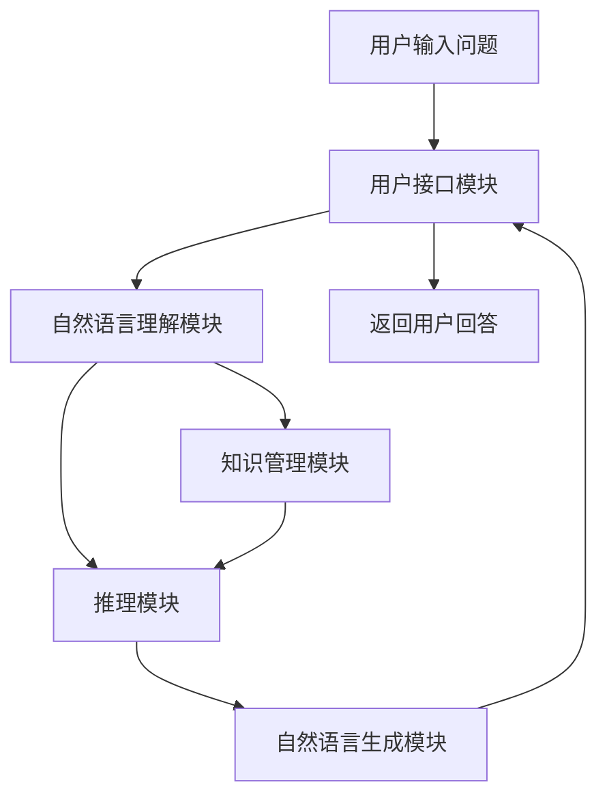

# 企业估值中的AI驱动的自然语言问答平台评估

> 关键词：企业估值、AI、自然语言问答平台、评估方法、技术原理

> 摘要：本文聚焦于企业估值中AI驱动的自然语言问答平台评估。随着人工智能技术的飞速发展，自然语言问答平台在企业的应用日益广泛，其价值评估对于企业的战略决策、投资分析等具有重要意义。文章深入探讨了该平台的核心概念、算法原理、数学模型，通过项目实战展示代码实现与解读，分析实际应用场景，推荐相关工具和资源，最后总结未来发展趋势与挑战，旨在为准确评估AI驱动的自然语言问答平台的企业价值提供全面、深入的技术和理论支持。

## 1. 背景介绍 
### 1.1 目的和范围
在当今数字化时代，AI驱动的自然语言问答平台已经成为企业提升客户服务效率、增强智能决策能力的重要工具。本文章的目的在于系统地阐述如何对这类平台进行准确的企业估值评估。范围涵盖从技术原理、算法实现到实际应用场景的各个方面，包括对平台的功能、性能、市场竞争力等多维度的评估，以帮助企业和投资者全面了解自然语言问答平台的价值。

### 1.2 预期读者
本文预期读者包括企业管理者、投资分析师、人工智能技术开发者、科研人员以及对企业估值和自然语言处理技术感兴趣的专业人士。企业管理者可以通过本文了解如何评估自然语言问答平台对企业的价值贡献，从而做出合理的战略决策；投资分析师能够依据文中的评估方法对相关企业进行准确的价值判断；技术开发者可以深入了解平台的技术细节，为进一步优化和创新提供参考；科研人员可将本文作为研究自然语言处理技术在企业估值中应用的重要资料。

### 1.3 文档结构概述
本文将按照以下结构展开：首先介绍背景信息，包括目的、预期读者和文档结构概述；接着阐述核心概念与联系，通过文本示意图和Mermaid流程图展示平台的原理和架构；然后详细讲解核心算法原理和具体操作步骤，结合Python源代码进行说明；随后介绍数学模型和公式，并举例说明；再通过项目实战展示代码实际案例和详细解释；分析实际应用场景；推荐相关工具和资源；最后总结未来发展趋势与挑战，提供常见问题与解答以及扩展阅读和参考资料。

### 1.4 术语表
#### 1.4.1 核心术语定义
- **AI（Artificial Intelligence）**：人工智能，是指计算机系统能够执行通常需要人类智能才能完成的任务，如学习、推理、解决问题等。
- **自然语言问答平台**：一种基于自然语言处理技术，能够理解用户以自然语言提出的问题，并给出相应回答的系统。
- **企业估值**：对企业的整体价值进行评估的过程，通常考虑企业的资产、收益、市场竞争力等多个因素。
- **自然语言处理（NLP，Natural Language Processing）**：是人工智能的一个子领域，专注于使计算机能够处理和理解人类语言。
- **深度学习**：一种基于人工神经网络的机器学习方法，通过多层神经网络自动学习数据中的模式和特征。

#### 1.4.2 相关概念解释
- **语义理解**：自然语言处理中的一个重要概念，指计算机能够理解文本的语义含义，而不仅仅是表面的词汇和语法结构。
- **知识图谱**：一种用于表示实体之间关系的语义网络，能够为自然语言问答平台提供丰富的知识支持。
- **预训练模型**：在大规模语料库上进行无监督学习得到的模型，如BERT、GPT等，可用于自然语言处理任务的初始化，提高模型的性能。

#### 1.4.3 缩略词列表
- **NLP**：Natural Language Processing（自然语言处理）
- **RNN**：Recurrent Neural Network（循环神经网络）
- **LSTM**：Long Short - Term Memory（长短期记忆网络）
- **GRU**：Gated Recurrent Unit（门控循环单元）
- **BERT**：Bidirectional Encoder Representations from Transformers（基于Transformer的双向编码器表示）

## 2. 核心概念与联系 
### 核心概念原理
AI驱动的自然语言问答平台主要基于自然语言处理技术，其核心原理包括以下几个方面：

#### 自然语言理解（NLU）
自然语言理解是问答平台的基础，旨在将用户输入的自然语言文本转换为计算机能够理解的语义表示。这通常涉及到词法分析、句法分析和语义分析等步骤。词法分析主要对文本进行分词、词性标注等处理；句法分析则分析句子的语法结构；语义分析则深入理解文本的语义含义，例如识别实体、关系和事件等。

#### 知识表示与推理
为了能够准确回答用户的问题，问答平台需要有丰富的知识储备。知识表示是将知识以计算机能够处理的形式进行存储，常见的知识表示方法包括知识图谱、语义网络等。推理则是根据已有的知识和用户的问题进行逻辑推理，从而得出答案。

#### 自然语言生成（NLG）
自然语言生成是将计算机内部的语义表示转换为自然语言文本的过程。在问答平台中，当系统得出答案的语义表示后，需要通过自然语言生成模块将其转换为流畅、易懂的自然语言回答。

### 架构的文本示意图
AI驱动的自然语言问答平台的架构通常包括以下几个主要模块：

- **用户接口模块**：负责接收用户的问题，并将系统的回答返回给用户。可以是网页界面、移动应用界面等。
- **自然语言理解模块**：对用户输入的问题进行处理，提取语义信息。
- **知识管理模块**：存储和管理问答平台所需的知识，如知识图谱、文本知识库等。
- **推理模块**：根据用户问题和知识进行推理，得出答案的语义表示。
- **自然语言生成模块**：将答案的语义表示转换为自然语言文本。

### Mermaid流程图


## 3. 核心算法原理 & 具体操作步骤 
### 核心算法原理
自然语言问答平台中常用的核心算法包括深度学习算法，如循环神经网络（RNN）及其变体长短期记忆网络（LSTM）、门控循环单元（GRU），以及基于Transformer架构的预训练模型，如BERT等。

#### RNN及其变体
RNN是一种能够处理序列数据的神经网络，其特点是具有循环结构，可以捕捉序列中的时间依赖关系。LSTM和GRU是RNN的改进版本，它们通过引入门控机制解决了RNN中的梯度消失和梯度爆炸问题，能够更好地处理长序列数据。

以下是一个简单的LSTM实现的Python代码示例：
```python
import torch
import torch.nn as nn

class LSTMModel(nn.Module):
    def __init__(self, input_size, hidden_size, num_layers, output_size):
        super(LSTMModel, self).__init__()
        self.hidden_size = hidden_size
        self.num_layers = num_layers
        self.lstm = nn.LSTM(input_size, hidden_size, num_layers, batch_first=True)
        self.fc = nn.Linear(hidden_size, output_size)

    def forward(self, x):
        h0 = torch.zeros(self.num_layers, x.size(0), self.hidden_size).to(x.device)
        c0 = torch.zeros(self.num_layers, x.size(0), self.hidden_size).to(x.device)

        out, _ = self.lstm(x, (h0, c0))
        out = self.fc(out[:, -1, :])
        return out
```

#### BERT预训练模型
BERT是一种基于Transformer架构的预训练语言模型，它通过双向编码器学习文本的上下文信息，能够捕捉到更丰富的语义特征。在自然语言问答任务中，可以使用预训练的BERT模型进行微调，以适应具体的问答场景。

以下是一个使用Hugging Face的Transformers库进行BERT微调的Python代码示例：
```python
from transformers import BertTokenizer, BertForQuestionAnswering
import torch

# 加载预训练的BERT模型和分词器
tokenizer = BertTokenizer.from_pretrained('bert-base-uncased')
model = BertForQuestionAnswering.from_pretrained('bert-base-uncased')

# 示例问题和文本
question = "What is the capital of France?"
text = "France is a country in Western Europe. Its capital is Paris."

# 对问题和文本进行分词
inputs = tokenizer(question, text, return_tensors='pt')

# 进行预测
outputs = model(**inputs)
answer_start_scores = outputs.start_logits
answer_end_scores = outputs.end_logits

# 获取答案的起始和结束位置
answer_start = torch.argmax(answer_start_scores)
answer_end = torch.argmax(answer_end_scores) + 1

# 提取答案
answer = tokenizer.convert_tokens_to_string(tokenizer.convert_ids_to_tokens(inputs['input_ids'][0][answer_start:answer_end]))
print(answer)
```

### 具体操作步骤
#### 数据准备
收集和整理用于训练和评估的问答数据集，包括问题、文本和对应的答案。对数据进行预处理，如分词、标注等。

#### 模型选择和训练
根据具体的任务需求选择合适的模型，如LSTM、BERT等。使用准备好的数据集对模型进行训练，调整模型的参数以提高性能。

#### 模型评估
使用测试数据集对训练好的模型进行评估，计算评估指标，如准确率、召回率、F1值等，以评估模型的性能。

#### 部署和优化
将训练好的模型部署到实际的问答平台中，并根据用户的反馈不断优化模型的性能。

## 4. 数学模型和公式 & 详细讲解 & 举例说明 
### 损失函数
在自然语言问答任务中，常用的损失函数包括交叉熵损失函数。交叉熵损失函数用于衡量模型预测结果与真实标签之间的差异。

对于分类问题，交叉熵损失函数的公式为：
$$L = -\sum_{i=1}^{C} y_i \log(p_i)$$
其中，$C$ 是类别数，$y_i$ 是真实标签的第 $i$ 个分量（通常是一个one - hot向量），$p_i$ 是模型预测的第 $i$ 个类别的概率。

在问答任务中，通常需要预测答案的起始位置和结束位置，因此可以分别对起始位置和结束位置使用交叉熵损失函数。

### 梯度下降优化算法
梯度下降是一种常用的优化算法，用于更新模型的参数以最小化损失函数。梯度下降的基本公式为：
$$\theta_{t+1} = \theta_t - \alpha \nabla L(\theta_t)$$
其中，$\theta$ 是模型的参数，$\alpha$ 是学习率，$\nabla L(\theta_t)$ 是损失函数 $L$ 关于参数 $\theta$ 在 $t$ 时刻的梯度。

### 举例说明
假设我们有一个简单的二分类问题，真实标签 $y = [1, 0]$，模型预测的概率 $p = [0.8, 0.2]$。则交叉熵损失为：
$$L = -(1\times\log(0.8) + 0\times\log(0.2)) \approx 0.223$$

## 5. 项目实战：代码实际案例和详细解释说明 
### 5.1  开发环境搭建
#### 安装Python
首先需要安装Python环境，建议使用Python 3.7及以上版本。可以从Python官方网站（https://www.python.org/downloads/） 下载并安装。

#### 安装深度学习框架
使用PyTorch作为深度学习框架，可以通过以下命令安装：
```sh
pip install torch torchvision
```

#### 安装自然语言处理库
安装Hugging Face的Transformers库，用于处理预训练模型：
```sh
pip install transformers
```

### 5.2  源代码详细实现和代码解读
以下是一个基于BERT的简单自然语言问答系统的完整代码示例：
```python
from transformers import BertTokenizer, BertForQuestionAnswering
import torch

# 加载预训练的BERT模型和分词器
tokenizer = BertTokenizer.from_pretrained('bert-base-uncased')
model = BertForQuestionAnswering.from_pretrained('bert-base-uncased')

def answer_question(question, text):
    # 对问题和文本进行分词
    inputs = tokenizer(question, text, return_tensors='pt')

    # 进行预测
    outputs = model(**inputs)
    answer_start_scores = outputs.start_logits
    answer_end_scores = outputs.end_logits

    # 获取答案的起始和结束位置
    answer_start = torch.argmax(answer_start_scores)
    answer_end = torch.argmax(answer_end_scores) + 1

    # 提取答案
    answer = tokenizer.convert_tokens_to_string(tokenizer.convert_ids_to_tokens(inputs['input_ids'][0][answer_start:answer_end]))
    return answer

# 示例问题和文本
question = "What is the capital of France?"
text = "France is a country in Western Europe. Its capital is Paris."

# 调用函数获取答案
answer = answer_question(question, text)
print("Answer:", answer)
```

### 5.3  代码解读与分析
- **加载预训练模型和分词器**：使用 `BertTokenizer.from_pretrained('bert-base-uncased')` 加载预训练的BERT分词器，使用 `BertForQuestionAnswering.from_pretrained('bert-base-uncased')` 加载预训练的BERT问答模型。
- **分词处理**：使用 `tokenizer(question, text, return_tensors='pt')` 对问题和文本进行分词，并将结果转换为PyTorch张量。
- **模型预测**：将分词后的输入传递给模型 `model(**inputs)`，得到答案的起始位置和结束位置的得分。
- **提取答案**：通过 `torch.argmax` 函数获取得分最高的起始和结束位置，然后使用 `tokenizer.convert_tokens_to_string` 函数将对应的词元转换为自然语言文本。

## 6. 实际应用场景 
### 客户服务
自然语言问答平台可以应用于企业的客户服务中，自动回答客户的常见问题，提高客户服务效率，降低人力成本。例如，电商平台可以使用问答平台回答客户关于商品信息、订单状态等问题；银行可以使用问答平台回答客户关于账户管理、贷款政策等问题。

### 智能助手
在智能助手领域，自然语言问答平台可以作为智能助手的核心组件，理解用户的语音或文本指令，并给出相应的回答和建议。例如，智能音箱可以使用问答平台回答用户的天气查询、音乐播放等问题；手机智能助手可以回答用户的日程安排、联系人查询等问题。

### 知识检索
在企业内部或学术领域，自然语言问答平台可以用于知识检索，帮助用户快速找到所需的知识和信息。例如，企业内部的知识库可以使用问答平台，员工可以通过自然语言提问获取相关的业务知识；学术数据库可以使用问答平台，研究人员可以通过自然语言查询获取相关的学术文献。

## 7. 工具和资源推荐
### 7.1 学习资源推荐
#### 7.1.1 书籍推荐
- 《自然语言处理入门》：作者何晗，这本书适合自然语言处理的初学者，内容涵盖了自然语言处理的基本概念、算法和应用。
- 《深度学习》：作者Ian Goodfellow、Yoshua Bengio和Aaron Courville，这本书是深度学习领域的经典著作，对深度学习的原理和算法进行了深入的讲解。
- 《Python自然语言处理》：作者Steven Bird、Ewan Klein和Edward Loper，这本书介绍了如何使用Python进行自然语言处理，包含了丰富的代码示例。

#### 7.1.2 在线课程
- Coursera上的“Natural Language Processing Specialization”：由斯坦福大学的教授授课，系统地介绍了自然语言处理的各个方面。
- edX上的“Deep Learning Specialization”：由吴恩达教授授课，对深度学习的理论和实践进行了全面的讲解。
- 哔哩哔哩（B 站）上有许多关于自然语言处理和深度学习的教程，适合初学者学习。

#### 7.1.3 技术博客和网站
- Hugging Face Blog：提供了关于自然语言处理和预训练模型的最新研究成果和技术文章。
- Medium上的“Towards Data Science”：有许多关于数据科学、机器学习和自然语言处理的优质文章。
- 开源中国（OSChina）：提供了丰富的技术文章和开源项目资源。

### 7.2 开发工具框架推荐
#### 7.2.1 IDE和编辑器
- PyCharm：一款功能强大的Python集成开发环境，提供了代码编辑、调试、版本控制等功能。
- Visual Studio Code：一款轻量级的代码编辑器，支持多种编程语言，有丰富的插件可以扩展功能。

#### 7.2.2 调试和性能分析工具
- PyTorch Profiler：用于分析PyTorch模型的性能，帮助开发者找出性能瓶颈。
- TensorBoard：用于可视化深度学习模型的训练过程和性能指标。

#### 7.2.3 相关框架和库
- Hugging Face Transformers：提供了丰富的预训练模型和工具，方便开发者进行自然语言处理任务。
- NLTK（Natural Language Toolkit）：一个经典的自然语言处理库，包含了许多常用的自然语言处理工具和数据集。
- SpaCy：一个高效的自然语言处理库，提供了快速的分词、词性标注、命名实体识别等功能。

### 7.3 相关论文著作推荐
#### 7.3.1 经典论文
- “BERT: Pre-training of Deep Bidirectional Transformers for Language Understanding”：介绍了BERT预训练模型的原理和方法，是自然语言处理领域的重要论文。
- “Attention Is All You Need”：提出了Transformer架构，为自然语言处理和深度学习带来了革命性的变化。

#### 7.3.2 最新研究成果
- ACL（Association for Computational Linguistics）会议的论文：每年都会发表自然语言处理领域的最新研究成果。
- EMNLP（Conference on Empirical Methods in Natural Language Processing）会议的论文：聚焦于自然语言处理的实证研究。

#### 7.3.3 应用案例分析
- 《自然语言处理实践：基于深度学习的方法》：包含了许多自然语言处理的应用案例，对实际项目的开发有很大的参考价值。

## 8. 总结：未来发展趋势与挑战
### 未来发展趋势
#### 多模态融合
未来的自然语言问答平台将不仅仅局限于文本处理，还会融合图像、语音等多模态信息，提供更加丰富和全面的回答。例如，在回答关于商品的问题时，不仅可以提供文字描述，还可以展示商品的图片和视频。

#### 个性化服务
随着用户数据的不断积累，自然语言问答平台将能够实现个性化服务，根据用户的历史提问、兴趣爱好等信息，提供更加符合用户需求的回答和建议。

#### 知识增强
通过与知识图谱、语义网络等知识表示技术的深度融合，自然语言问答平台将能够获取更加丰富和准确的知识，提高回答的质量和准确性。

### 挑战
#### 语义理解的准确性
尽管自然语言处理技术取得了很大的进展，但在语义理解方面仍然存在挑战，特别是对于一些复杂的语言表达和上下文信息的理解。

#### 数据隐私和安全
自然语言问答平台需要处理大量的用户数据，包括用户的问题和回答，如何保障用户数据的隐私和安全是一个重要的挑战。

#### 计算资源的需求
深度学习模型的训练和推理需要大量的计算资源，如何在有限的计算资源下提高模型的性能和效率是一个亟待解决的问题。

## 9. 附录：常见问题与解答
### 问题1：如何选择合适的预训练模型？
解答：选择预训练模型需要考虑任务的类型、数据的特点和计算资源等因素。如果任务是英文的自然语言处理任务，可以选择BERT、GPT等英文预训练模型；如果是中文任务，可以选择中文的预训练模型，如ERNIE、RoBERTa - Chinese等。同时，需要根据计算资源选择合适大小的模型，避免计算资源不足。

### 问题2：如何提高自然语言问答平台的性能？
解答：可以从以下几个方面提高性能：1. 收集和整理高质量的数据集，增加数据的多样性和规模；2. 选择合适的模型和算法，并进行调优；3. 采用集成学习等方法，将多个模型的结果进行融合；4. 不断优化模型的参数，提高模型的泛化能力。

### 问题3：自然语言问答平台在实际应用中可能会遇到哪些问题？
解答：可能会遇到以下问题：1. 语义理解不准确，导致回答错误；2. 对复杂问题的处理能力不足；3. 系统的响应速度慢，影响用户体验；4. 缺乏上下文理解，导致回答不连贯。

## 10. 扩展阅读 & 参考资料
### 扩展阅读
- 《人工智能时代的自然语言处理》：深入探讨了自然语言处理在人工智能时代的发展和应用。
- 《智能问答系统原理与实践》：详细介绍了智能问答系统的原理、技术和实现方法。

### 参考资料
- Hugging Face官方文档：https://huggingface.co/docs
- PyTorch官方文档：https://pytorch.org/docs/stable/index.html
- NLTK官方文档：https://www.nltk.org/