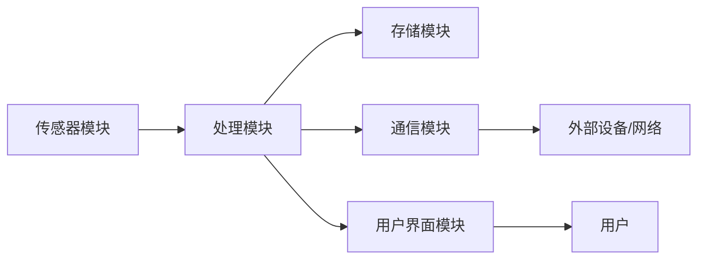

# 企业估值中的可穿戴设备市场评估

> 关键词：企业估值、可穿戴设备、市场评估、技术趋势、商业模式

> 摘要：本文聚焦于企业估值中可穿戴设备市场的评估。在当今科技飞速发展的时代，可穿戴设备市场呈现出蓬勃发展的态势，其对于企业的价值创造和市场竞争具有重要意义。文章将深入探讨可穿戴设备市场的背景、核心概念、算法原理、数学模型等内容，并通过项目实战案例进行详细分析，阐述其实际应用场景，推荐相关工具和资源，最后总结可穿戴设备市场的未来发展趋势与挑战，为企业在估值过程中准确评估可穿戴设备市场提供全面而深入的参考。

## 1. 背景介绍 
### 1.1 目的和范围
可穿戴设备市场在近年来取得了显著的发展，各类智能手表、智能手环、头戴式设备等层出不穷。企业在进行估值时，需要对可穿戴设备市场进行准确评估，以确定相关业务的价值和潜力。本文的目的在于为企业提供一套全面、系统的可穿戴设备市场评估方法和思路，范围涵盖可穿戴设备市场的技术发展、市场规模、竞争格局、商业模式等多个方面。

### 1.2 预期读者
本文预期读者包括企业估值师、投资分析师、可穿戴设备行业从业者、科技领域投资者以及对可穿戴设备市场感兴趣的研究人员。通过阅读本文，读者能够深入了解可穿戴设备市场的评估方法和要点，为相关决策提供参考。

### 1.3 文档结构概述
本文首先介绍可穿戴设备市场评估的背景信息，包括目的、预期读者和文档结构。接着阐述可穿戴设备的核心概念与联系，包括其原理和架构。然后详细讲解核心算法原理和具体操作步骤，通过Python源代码进行说明。随后介绍相关的数学模型和公式，并举例说明。通过项目实战案例展示代码的实际应用和详细解释。分析可穿戴设备的实际应用场景，推荐相关的工具和资源。最后总结可穿戴设备市场的未来发展趋势与挑战，并提供常见问题解答和扩展阅读参考资料。

### 1.4 术语表
#### 1.4.1 核心术语定义
- **可穿戴设备**：是指可以直接穿戴在身上，或是整合到用户的衣服或配件的一种便携式设备。通常具备智能化、可移动计算等特点。
- **企业估值**：是指着眼于上市或非上市企业本身，对企业的内在价值进行评估。
- **市场评估**：对特定市场的规模、增长趋势、竞争状况等进行分析和判断的过程。

#### 1.4.2 相关概念解释
- **物联网（IoT）**：通过各种信息传感器、射频识别技术、全球定位系统、红外感应器、激光扫描器等各种装置与技术，实时采集任何需要监控、 连接、互动的物体或过程，采集其声、光、热、电、力学、化学、生物、位置等各种需要的信息，通过各类可能的网络接入，实现物与物、物与人的泛在连接，实现对物品和过程的智能化感知、识别和管理。可穿戴设备是物联网的重要终端设备之一。
- **人工智能（AI）**：它是研究、开发用于模拟、延伸和扩展人的智能的理论、方法、技术及应用系统的一门新的技术科学。在可穿戴设备中，人工智能技术可用于实现智能语音交互、健康监测数据分析等功能。

#### 1.4.3 缩略词列表
- **IoT**：物联网（Internet of Things）
- **AI**：人工智能（Artificial Intelligence）
- **MEMS**：微机电系统（Micro-Electro-Mechanical Systems）

## 2. 核心概念与联系 
可穿戴设备是融合了多种技术的智能终端产品，其核心概念和联系涉及硬件、软件、通信等多个方面。

### 可穿戴设备原理和架构的文本示意图
可穿戴设备主要由传感器模块、处理模块、存储模块、通信模块和用户界面模块组成。传感器模块负责采集各种数据，如运动数据、生理数据等；处理模块对采集到的数据进行处理和分析；存储模块用于存储数据和程序；通信模块实现设备与外部设备或网络的连接；用户界面模块则提供用户与设备交互的接口。

### Mermaid 流程图


可穿戴设备的各个模块相互协作，共同实现设备的功能。传感器采集的数据经过处理模块的分析后，可以存储在存储模块中，也可以通过通信模块发送到外部设备或网络进行进一步处理和分析。用户可以通过用户界面模块与设备进行交互，获取设备的信息和控制设备的功能。

## 3. 核心算法原理 & 具体操作步骤 
### 市场规模预测算法原理
在企业估值中，准确预测可穿戴设备市场规模是评估的重要环节。我们可以使用时间序列分析算法中的 ARIMA（Autoregressive Integrated Moving Average）模型来进行市场规模预测。

ARIMA 模型是一种广泛应用于时间序列预测的统计模型，它结合了自回归（AR）、差分（I）和移动平均（MA）三个部分。其基本原理是通过对历史数据的分析，找出数据的变化规律，从而预测未来的数据值。

### Python 源代码实现
```python
import pandas as pd
from statsmodels.tsa.arima.model import ARIMA
import matplotlib.pyplot as plt

# 加载历史市场规模数据
data = pd.read_csv('wearable_market_data.csv', index_col='Year', parse_dates=True)

# 拟合 ARIMA 模型
model = ARIMA(data, order=(1, 1, 1))
model_fit = model.fit()

# 进行预测
forecast_steps = 5
forecast = model_fit.get_forecast(steps=forecast_steps)
forecast_mean = forecast.predicted_mean

# 绘制历史数据和预测数据
plt.plot(data, label='Historical Data')
plt.plot(forecast_mean, label='Forecast Data', linestyle='--')
plt.xlabel('Year')
plt.ylabel('Market Size')
plt.title('Wearable Device Market Size Forecast')
plt.legend()
plt.show()
```

### 具体操作步骤
1. **数据准备**：收集可穿戴设备市场的历史规模数据，将其整理成时间序列数据，并保存为 CSV 文件。
2. **模型选择**：根据数据的特点，选择合适的 ARIMA 模型参数（p, d, q）。在上述代码中，我们选择了（1, 1, 1）作为参数。
3. **模型拟合**：使用选择的模型对历史数据进行拟合，得到模型的参数估计值。
4. **预测**：使用拟合好的模型进行未来市场规模的预测，并获取预测结果。
5. **可视化**：将历史数据和预测数据绘制在同一张图上，直观地展示市场规模的变化趋势。

## 4. 数学模型和公式 & 详细讲解 & 举例说明 
### ARIMA 模型的数学公式
ARIMA 模型的一般形式可以表示为：
$$
(1 - \sum_{i=1}^{p} \phi_i B^i)(1 - B)^d Y_t = (1 + \sum_{j=1}^{q} \theta_j B^j) \epsilon_t
$$
其中：
- $Y_t$ 是时间序列数据在时间 $t$ 的值。
- $B$ 是后移算子，即 $B Y_t = Y_{t - 1}$。
- $p$ 是自回归（AR）部分的阶数。
- $d$ 是差分的阶数。
- $q$ 是移动平均（MA）部分的阶数。
- $\phi_i$ 是自回归系数。
- $\theta_j$ 是移动平均系数。
- $\epsilon_t$ 是白噪声序列。

### 详细讲解
- **自回归（AR）部分**：表示当前时刻的值与过去若干时刻的值之间的线性关系。
- **差分（I）部分**：通过对数据进行差分处理，使数据变得平稳，便于模型的拟合和预测。
- **移动平均（MA）部分**：表示当前时刻的误差与过去若干时刻的误差之间的线性关系。

### 举例说明
假设我们有一组可穿戴设备市场规模的时间序列数据 $Y = \{y_1, y_2, \cdots, y_n\}$，我们选择 ARIMA(1, 1, 1) 模型进行预测。
- 首先进行差分处理，得到差分后的数据 $Z_t = Y_t - Y_{t - 1}$。
- 然后建立自回归和移动平均模型：
$$
Z_t - \phi_1 Z_{t - 1} = \epsilon_t + \theta_1 \epsilon_{t - 1}
$$
- 通过最小二乘法等方法估计模型的参数 $\phi_1$ 和 $\theta_1$。
- 最后，根据估计的参数进行未来市场规模的预测。

## 5. 项目实战：代码实际案例和详细解释说明 
### 5.1  开发环境搭建
1. **安装 Python**：从 Python 官方网站（https://www.python.org/downloads/） 下载并安装 Python 3.x 版本。
2. **安装依赖库**：使用以下命令安装所需的依赖库：
```sh
pip install pandas statsmodels matplotlib
```

### 5.2  源代码详细实现和代码解读
```python
import pandas as pd
from statsmodels.tsa.arima.model import ARIMA
import matplotlib.pyplot as plt

# 加载历史市场规模数据
data = pd.read_csv('wearable_market_data.csv', index_col='Year', parse_dates=True)

# 代码解读：使用 pandas 库的 read_csv 函数读取 CSV 文件，并将 'Year' 列作为索引，同时解析日期数据。

# 拟合 ARIMA 模型
model = ARIMA(data, order=(1, 1, 1))
model_fit = model.fit()

# 代码解读：使用 ARIMA 类创建一个 ARIMA 模型对象，指定模型的参数为 (1, 1, 1)，然后使用 fit 方法对模型进行拟合。

# 进行预测
forecast_steps = 5
forecast = model_fit.get_forecast(steps=forecast_steps)
forecast_mean = forecast.predicted_mean

# 代码解读：设置预测的步数为 5，使用 get_forecast 方法进行预测，并获取预测结果的均值。

# 绘制历史数据和预测数据
plt.plot(data, label='Historical Data')
plt.plot(forecast_mean, label='Forecast Data', linestyle='--')
plt.xlabel('Year')
plt.ylabel('Market Size')
plt.title('Wearable Device Market Size Forecast')
plt.legend()
plt.show()

# 代码解读：使用 matplotlib 库的 plot 函数绘制历史数据和预测数据的折线图，设置坐标轴标签、标题和图例，最后使用 show 方法显示图形。
```

### 5.3  代码解读与分析
- **数据处理**：通过 pandas 库读取和处理历史市场规模数据，将其转换为适合模型输入的格式。
- **模型拟合**：使用 ARIMA 模型对历史数据进行拟合，得到模型的参数估计值。
- **预测**：根据拟合好的模型进行未来市场规模的预测，并获取预测结果。
- **可视化**：使用 matplotlib 库将历史数据和预测数据绘制在同一张图上，直观地展示市场规模的变化趋势。

通过对代码的解读和分析，我们可以更好地理解 ARIMA 模型在可穿戴设备市场规模预测中的应用。

## 6. 实际应用场景 
### 企业战略规划
企业在制定战略规划时，需要对可穿戴设备市场进行准确评估。通过市场规模预测、竞争格局分析等方法，企业可以了解市场的发展趋势和潜力，从而制定合理的产品研发、市场推广和投资战略。例如，一家智能手表制造商可以根据市场评估结果，决定是否加大研发投入，推出新的产品型号，或者拓展海外市场。

### 投资决策
投资者在进行投资决策时，也需要考虑可穿戴设备市场的情况。通过对市场前景、企业竞争力等因素的分析，投资者可以选择有潜力的可穿戴设备企业进行投资。例如，风险投资机构可以根据市场评估报告，决定是否对一家新兴的可穿戴设备创业公司进行投资。

### 产品设计与创新
可穿戴设备企业在进行产品设计和创新时，需要结合市场需求和技术趋势。通过市场评估，企业可以了解消费者的需求和痛点，从而设计出更符合市场需求的产品。例如，根据市场调研发现消费者对健康监测功能的需求较高，企业可以在产品中增加更多的健康监测传感器和功能。

## 7. 工具和资源推荐
### 7.1 学习资源推荐
#### 7.1.1 书籍推荐
- 《时间序列分析：预测与控制》（Time Series Analysis: Forecasting and Control）：这本书是时间序列分析领域的经典著作，详细介绍了各种时间序列分析方法和模型，包括 ARIMA 模型。
- 《可穿戴设备：从概念到实践》（Wearable Devices: From Concept to Practice）：全面介绍了可穿戴设备的技术原理、设计方法和应用案例，适合对可穿戴设备感兴趣的读者阅读。

#### 7.1.2 在线课程
- Coursera 上的 “时间序列分析与预测” 课程：由知名大学的教授授课，系统地介绍了时间序列分析的理论和方法，并通过实际案例进行讲解。
- edX 上的 “可穿戴技术与物联网” 课程：深入探讨了可穿戴技术的发展趋势和应用前景，以及与物联网的融合。

#### 7.1.3 技术博客和网站
- 开源中国（https://www.oschina.net/）：提供了丰富的技术文章和开源项目，涵盖了可穿戴设备、时间序列分析等多个领域。
- 机器之心（https://www.alienlab.cn/）：专注于人工智能和机器学习领域的技术报道和分析，对可穿戴设备中的人工智能应用有深入的介绍。

### 7.2 开发工具框架推荐
#### 7.2.1 IDE和编辑器
- PyCharm：一款专业的 Python 集成开发环境，提供了丰富的代码编辑、调试和项目管理功能。
- Jupyter Notebook：一个交互式的开发环境，适合进行数据分析和模型开发，方便代码的展示和分享。

#### 7.2.2 调试和性能分析工具
- pdb：Python 自带的调试工具，可以帮助开发者逐步调试代码，查找问题。
- cProfile：Python 标准库中的性能分析工具，可以分析代码的运行时间和性能瓶颈。

#### 7.2.3 相关框架和库
- Pandas：用于数据处理和分析的 Python 库，提供了高效的数据结构和数据操作方法。
- Statsmodels：用于统计建模和数据分析的 Python 库，包含了各种时间序列分析模型和方法。
- Matplotlib：用于数据可视化的 Python 库，可以绘制各种类型的图表。

### 7.3 相关论文著作推荐
#### 7.3.1 经典论文
- Box, G. E. P., & Jenkins, G. M. (1970). Time Series Analysis: Forecasting and Control. 这篇论文是时间序列分析领域的经典之作，提出了 ARIMA 模型的基本理论和方法。
- Lu, X., & Zhang, Y. (2016). Wearable Sensors and Systems. 该论文全面介绍了可穿戴传感器和系统的技术原理、应用场景和发展趋势。

#### 7.3.2 最新研究成果
- 每年的 ACM SIGCHI 会议上都会有关于可穿戴设备的最新研究成果发表，涵盖了用户体验、交互设计、健康监测等多个方面。
- IEEE Transactions on Biomedical Circuits and Systems 杂志上也经常发表可穿戴设备在生物医学领域的研究成果。

#### 7.3.3 应用案例分析
- 一些知名企业的年度报告和案例分析，如苹果公司的 Apple Watch 市场推广案例、Fitbit 公司的健康监测设备应用案例等，可以为企业估值中的可穿戴设备市场评估提供参考。

## 8. 总结：未来发展趋势与挑战
### 未来发展趋势
- **技术创新持续推动**：随着物联网、人工智能、传感器技术等的不断发展，可穿戴设备将不断实现技术创新。例如，更精准的传感器将提高健康监测的准确性，人工智能技术将实现更智能的交互和数据分析。
- **健康医疗领域应用拓展**：可穿戴设备在健康医疗领域的应用将不断拓展，如远程医疗、疾病诊断、健康管理等。未来，可穿戴设备有望成为个人健康管理的重要工具。
- **个性化定制需求增加**：消费者对可穿戴设备的个性化需求将不断增加，企业将更加注重产品的个性化设计和定制服务，以满足不同消费者的需求。

### 挑战
- **数据安全和隐私问题**：可穿戴设备收集了大量的用户个人数据，如健康数据、位置数据等，数据安全和隐私问题成为了一个重要的挑战。企业需要加强数据安全保护措施，确保用户数据的安全和隐私。
- **市场竞争加剧**：随着可穿戴设备市场的不断发展，市场竞争将日益激烈。企业需要不断提升产品的竞争力，包括技术创新、产品质量、用户体验等方面，以在市场竞争中脱颖而出。
- **标准和规范不完善**：目前可穿戴设备市场的标准和规范还不完善，这给市场的发展带来了一定的阻碍。需要政府和行业组织加强标准和规范的制定，促进市场的健康发展。

## 9. 附录：常见问题与解答
### 问题 1：如何选择合适的 ARIMA 模型参数？
答：选择合适的 ARIMA 模型参数（p, d, q）通常需要结合数据的特点和经验进行尝试。可以使用自动调参方法，如网格搜索，通过比较不同参数组合下模型的拟合效果和预测误差，选择最优的参数组合。

### 问题 2：可穿戴设备市场评估中还需要考虑哪些因素？
答：除了市场规模预测外，还需要考虑技术发展趋势、竞争格局、消费者需求、政策法规等因素。这些因素都会对可穿戴设备市场的发展产生影响，在评估时需要综合考虑。

### 问题 3：如何确保可穿戴设备数据的安全和隐私？
答：企业可以采取多种措施确保可穿戴设备数据的安全和隐私，如数据加密、访问控制、匿名化处理等。同时，加强用户教育，提高用户的安全意识，也是保障数据安全和隐私的重要措施。

## 10. 扩展阅读 & 参考资料
### 扩展阅读
- 《智能硬件：从设计到实现》：深入介绍了智能硬件的设计、开发和实现过程，对可穿戴设备的硬件设计有一定的参考价值。
- 《大数据时代的商业变革》：探讨了大数据在商业领域的应用和变革，对可穿戴设备市场的数据挖掘和分析有一定的启示。

### 参考资料
- 市场研究机构的报告，如 IDC、Gartner 等发布的可穿戴设备市场研究报告。
- 相关企业的官方网站和年度报告，获取企业的产品信息和市场数据。
- 学术数据库，如 IEEE Xplore、ACM Digital Library 等，获取可穿戴设备和时间序列分析领域的学术论文。