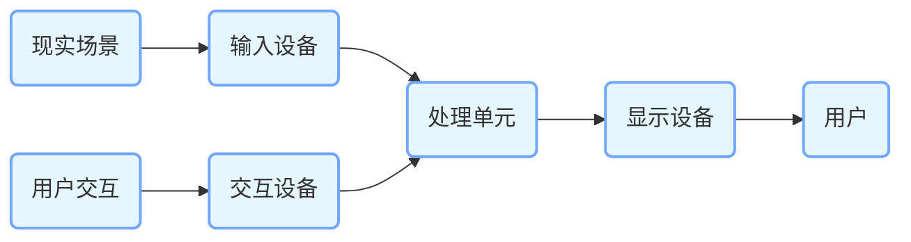

# 企业估值中的增强现实应用评估

> 关键词：企业估值、增强现实、应用评估、价值模型、评估方法

> 摘要：本文聚焦于企业估值中增强现实（AR）应用的评估。随着增强现实技术的快速发展，其在企业中的应用日益广泛，对企业的价值影响也愈发显著。文章首先介绍了研究的背景、目的、预期读者等内容，接着阐述增强现实的核心概念与联系，详细讲解相关的核心算法原理及操作步骤，引入数学模型和公式进行深入分析。通过项目实战展示代码实现和解读，探讨增强现实应用的实际场景。推荐了学习资源、开发工具框架及相关论文著作。最后总结增强现实应用评估的未来发展趋势与挑战，解答常见问题并提供参考资料，旨在为企业准确评估增强现实应用的价值提供全面的指导和参考。

## 1. 背景介绍 
### 1.1 目的和范围
在当今数字化快速发展的时代，增强现实（AR）技术作为一项具有巨大潜力的新兴技术，正逐渐渗透到各个行业领域。企业纷纷将AR技术应用于产品展示、营销推广、员工培训、客户体验等多个方面，以提升自身的竞争力和创新能力。然而，对于企业而言，如何准确评估AR应用对企业价值的影响，是一个亟待解决的问题。本研究的目的在于深入探讨企业估值中增强现实应用评估的方法和策略，为企业提供科学、合理的评估框架和工具。

本研究的范围涵盖了增强现实技术在不同行业的应用场景，包括但不限于制造业、零售业、教育业、医疗业等。通过对这些行业中企业AR应用案例的分析，总结出具有普遍性和适用性的评估方法和模型。

### 1.2 预期读者
本文的预期读者主要包括企业管理者、投资者、金融分析师、技术专家以及对增强现实技术和企业估值感兴趣的研究人员。企业管理者可以通过本文了解如何评估AR应用对企业价值的贡献，从而做出更明智的战略决策；投资者可以借助本文的评估方法，更好地判断企业的投资价值；金融分析师可以将本文的研究成果应用于企业估值报告中；技术专家可以从本文中获取AR技术在企业应用的价值评估视角；研究人员则可以将本文作为进一步研究的参考资料。

### 1.3 文档结构概述
本文共分为十个部分。第一部分为背景介绍，阐述研究的目的、范围、预期读者和文档结构概述，并给出相关术语表。第二部分介绍增强现实的核心概念与联系，包括原理、架构以及相关的流程图。第三部分讲解核心算法原理和具体操作步骤，并使用Python源代码进行详细阐述。第四部分引入数学模型和公式，进行详细讲解并举例说明。第五部分通过项目实战，展示代码实际案例并进行详细解释说明。第六部分探讨增强现实应用的实际场景。第七部分推荐学习资源、开发工具框架及相关论文著作。第八部分总结增强现实应用评估的未来发展趋势与挑战。第九部分为附录，解答常见问题。第十部分提供扩展阅读和参考资料。

### 1.4 术语表
#### 1.4.1 核心术语定义
- **增强现实（Augmented Reality，AR）**：一种将虚拟信息与真实世界巧妙融合的技术，通过计算机图形技术和可视化技术产生现实环境中不存在的虚拟对象，并将虚拟对象准确“放置”在真实环境中，借助显示设备将虚拟和真实环境叠加在同一个画面或空间中同时存在，从而实现对现实的增强。
- **企业估值（Business Valuation）**：对企业的经济价值进行评估的过程，通过对企业的资产、负债、盈利能力、市场地位等多方面因素进行综合分析，确定企业在特定时间点的价值。
- **应用评估（Application Evaluation）**：对企业所应用的技术、系统或业务流程等进行全面、系统的评价和分析，以确定其有效性、效率、效益以及对企业目标的贡献程度。

#### 1.4.2 相关概念解释
- **虚拟现实（Virtual Reality，VR）**：是一种完全沉浸式的虚拟环境技术，用户通过佩戴特定的设备，如头戴式显示器等，完全沉浸在一个由计算机生成的虚拟世界中，与现实世界完全隔离。与AR不同，VR不涉及与现实世界的融合。
- **混合现实（Mixed Reality，MR）**：是AR和VR的进一步发展，它不仅能够将虚拟对象与真实世界融合，还允许虚拟对象与真实世界进行交互和相互影响，实现更加自然和真实的用户体验。

#### 1.4.3 缩略词列表
- **AR**：Augmented Reality（增强现实）
- **VR**：Virtual Reality（虚拟现实）
- **MR**：Mixed Reality（混合现实）
- **ROI**：Return on Investment（投资回报率）

## 2. 核心概念与联系 
### 增强现实原理
增强现实技术主要基于计算机视觉、图形处理、传感器技术和显示技术等多个领域的知识和技术。其基本原理是通过摄像头等设备捕捉现实场景的图像或视频，然后利用计算机视觉算法对这些图像或视频进行分析和处理，识别出现实场景中的物体和特征。接着，根据识别结果，计算机生成相应的虚拟对象，并将这些虚拟对象与现实场景进行融合，最终通过显示设备呈现给用户。

### 增强现实架构
增强现实系统一般由以下几个主要部分组成：
- **输入设备**：如摄像头、传感器等，用于获取现实场景的信息。
- **处理单元**：包括计算机硬件和软件，负责对输入的信息进行处理和分析，生成虚拟对象，并进行融合处理。
- **显示设备**：如智能手机屏幕、头戴式显示器等，用于将融合后的虚拟和现实场景呈现给用户。
- **交互设备**：如手柄、手势识别设备等，使用户能够与虚拟对象进行交互。

### 增强现实与企业估值的联系
增强现实应用可以通过多种方式影响企业的价值。例如，通过提升产品的展示效果和用户体验，吸引更多的客户，从而增加销售收入；通过优化生产流程和员工培训，提高生产效率和产品质量，降低成本；通过创新的营销手段和品牌形象塑造，提升企业的市场竞争力和品牌价值。因此，在企业估值中，准确评估增强现实应用的价值具有重要意义。

### 文本示意图
```plaintext
增强现实系统
|-- 输入设备
|   |-- 摄像头
|   |-- 传感器
|-- 处理单元
|   |-- 计算机硬件
|   |-- 计算机软件
|-- 显示设备
|   |-- 智能手机屏幕
|   |-- 头戴式显示器
|-- 交互设备
|   |-- 手柄
|   |-- 手势识别设备
```

### Mermaid流程图


## 3. 核心算法原理 & 具体操作步骤 
### 图像识别算法原理
图像识别是增强现实技术中的关键环节，常用的图像识别算法包括特征提取算法和匹配算法。以ORB（Oriented FAST and Rotated BRIEF）算法为例，其原理如下：

ORB算法结合了FAST（Features from Accelerated Segment Test）特征点检测算法和BRIEF（Binary Robust Independent Elementary Features）描述子。FAST算法用于快速检测图像中的特征点，它通过比较像素点与其邻域像素的亮度值来判断是否为特征点。BRIEF描述子则用于对检测到的特征点进行描述，它将特征点周围的图像块转换为二进制字符串，以便进行特征匹配。

### Python代码实现
```python
import cv2
import numpy as np

def orb_image_recognition(image1, image2):
    # 初始化ORB检测器
    orb = cv2.ORB_create()

    # 检测关键点和计算描述符
    kp1, des1 = orb.detectAndCompute(image1, None)
    kp2, des2 = orb.detectAndCompute(image2, None)

    # 创建BFMatcher对象
    bf = cv2.BFMatcher(cv2.NORM_HAMMING, crossCheck=True)

    # 匹配描述符
    matches = bf.match(des1, des2)

    # 按距离排序
    matches = sorted(matches, key=lambda x: x.distance)

    # 绘制匹配结果
    result = cv2.drawMatches(image1, kp1, image2, kp2, matches[:10], None, flags=cv2.DrawMatchesFlags_NOT_DRAW_SINGLE_POINTS)

    return result
```

### 具体操作步骤
1. **读取图像**：使用`cv2.imread()`函数读取需要进行匹配的两幅图像。
2. **初始化ORB检测器**：使用`cv2.ORB_create()`函数创建ORB检测器对象。
3. **检测关键点和计算描述符**：使用`orb.detectAndCompute()`函数检测图像中的关键点并计算描述符。
4. **创建BFMatcher对象**：使用`cv2.BFMatcher()`函数创建BFMatcher对象，用于进行特征匹配。
5. **匹配描述符**：使用`bf.match()`函数对两幅图像的描述符进行匹配。
6. **排序匹配结果**：按匹配距离对匹配结果进行排序，距离越小表示匹配度越高。
7. **绘制匹配结果**：使用`cv2.drawMatches()`函数绘制匹配结果，并返回绘制后的图像。

## 4. 数学模型和公式 & 详细讲解 & 举例说明 
### 投资回报率（ROI）模型
投资回报率是评估企业投资项目效益的常用指标，在评估增强现实应用的价值时也可以使用。其计算公式为：

$$ROI = \frac{收益 - 成本}{成本} \times 100\%$$

其中，收益包括因AR应用带来的销售收入增加、成本降低等；成本包括AR应用的开发成本、维护成本、培训成本等。

### 详细讲解
投资回报率模型通过比较投资所带来的收益和成本，来评估投资项目的盈利能力。在增强现实应用评估中，如果ROI大于0，表示AR应用的投资是盈利的；ROI越高，说明AR应用的投资效益越好。

### 举例说明
假设某企业投资100万元开发和部署AR应用，通过AR应用的营销推广，使得产品销售额增加了200万元，同时由于生产流程的优化，成本降低了50万元。则该AR应用的收益为200 + 50 = 250万元，成本为100万元。根据ROI公式计算可得：

$$ROI = \frac{250 - 100}{100} \times 100\% = 150\%$$

这表明该企业的AR应用投资获得了150%的回报率，投资效益较好。

### 净现值（NPV）模型
净现值是指投资项目在未来各期现金流量的现值之和与初始投资之间的差额。其计算公式为：

$$NPV = \sum_{t=0}^{n} \frac{CF_t}{(1 + r)^t} - I_0$$

其中，$CF_t$ 表示第 $t$ 期的现金流量，$r$ 表示折现率，$I_0$ 表示初始投资，$n$ 表示项目的寿命期。

### 详细讲解
净现值模型考虑了资金的时间价值，通过将未来各期的现金流量折现到当前时刻，来评估投资项目的价值。如果NPV大于0，表示投资项目的收益超过了成本，项目具有投资价值；NPV越大，项目的价值越高。

### 举例说明
假设某企业投资50万元开发AR应用，预计在未来3年内每年的现金流量分别为20万元、30万元和40万元，折现率为10%。则该AR应用的净现值计算如下：

$$NPV = \frac{20}{(1 + 0.1)^1} + \frac{30}{(1 + 0.1)^2} + \frac{40}{(1 + 0.1)^3} - 50$$

$$NPV \approx 18.18 + 24.79 + 30.05 - 50 = 22.92$$

这表明该AR应用的净现值为22.92万元，大于0，说明该投资项目具有投资价值。

## 5. 项目实战：代码实际案例和详细解释说明 
### 5.1  开发环境搭建
#### 硬件环境
- 计算机：具备足够的计算能力和内存，建议使用Intel Core i5及以上处理器，8GB及以上内存。
- 摄像头：用于捕捉现实场景的图像或视频，建议使用高清摄像头。
- 显示设备：如智能手机、头戴式显示器等，用于显示增强现实效果。

#### 软件环境
- 操作系统：Windows 10、macOS或Linux。
- 开发工具：Python 3.x，建议使用Anaconda环境进行管理。
- 相关库：OpenCV、NumPy等，可以使用`pip`或`conda`进行安装。

```bash
# 使用pip安装OpenCV和NumPy
pip install opencv-python
pip install numpy
```

### 5.2  源代码详细实现和代码解读
以下是一个简单的增强现实应用示例，通过在现实场景中叠加虚拟的3D模型来实现增强现实效果。

```python
import cv2
import numpy as np
import pyrender
import trimesh

# 加载3D模型
mesh = trimesh.load('example.obj')
scene = pyrender.Scene()
mesh = pyrender.Mesh.from_trimesh(mesh)
scene.add(mesh)

# 初始化摄像头
cap = cv2.VideoCapture(0)

while True:
    # 读取摄像头帧
    ret, frame = cap.read()

    if not ret:
        break

    # 在这里可以进行图像识别和姿态估计，以确定3D模型的位置和姿态
    # 为了简化，这里假设3D模型固定在图像中心
    h, w, _ = frame.shape
    camera_pose = np.array([[1, 0, 0, w / 2],
                            [0, 1, 0, h / 2],
                            [0, 0, 1, 0],
                            [0, 0, 0, 1]])

    # 创建渲染器
    r = pyrender.OffscreenRenderer(viewport_width=w, viewport_height=h)
    color, depth = r.render(scene, camera_pose)

    # 将渲染结果叠加到摄像头帧上
    alpha = 0.5
    blended = cv2.addWeighted(frame, 1 - alpha, color.astype(np.uint8), alpha, 0)

    # 显示结果
    cv2.imshow('Augmented Reality', blended)

    # 按 'q' 键退出循环
    if cv2.waitKey(1) & 0xFF == ord('q'):
        break

# 释放摄像头并关闭所有窗口
cap.release()
cv2.destroyAllWindows()
```

### 5.3  代码解读与分析
1. **加载3D模型**：使用`trimesh.load()`函数加载3D模型文件，然后将其转换为`pyrender.Mesh`对象并添加到`pyrender.Scene`中。
2. **初始化摄像头**：使用`cv2.VideoCapture(0)`初始化摄像头，其中`0`表示默认摄像头。
3. **读取摄像头帧**：在循环中使用`cap.read()`函数读取摄像头的每一帧图像。
4. **确定3D模型的位置和姿态**：为了简化，这里假设3D模型固定在图像中心，通过设置`camera_pose`矩阵来确定3D模型的位置和姿态。
5. **创建渲染器**：使用`pyrender.OffscreenRenderer`创建渲染器，用于渲染3D模型。
6. **渲染3D模型**：使用`r.render()`函数渲染3D模型，得到渲染结果的颜色和深度信息。
7. **叠加渲染结果**：使用`cv2.addWeighted()`函数将渲染结果叠加到摄像头帧上，通过设置`alpha`值来调整叠加的透明度。
8. **显示结果**：使用`cv2.imshow()`函数显示叠加后的图像。
9. **退出循环**：按`q`键退出循环，释放摄像头并关闭所有窗口。

## 6. 实际应用场景 
### 制造业
在制造业中，增强现实技术可以用于产品设计、生产流程优化和员工培训等方面。例如，设计师可以使用AR技术在现实环境中可视化产品的3D模型，进行实时的设计修改和评估；工人可以通过AR眼镜查看生产流程的指导信息和操作说明，提高生产效率和质量；培训人员可以利用AR技术创建虚拟的培训场景，让新员工在虚拟环境中进行实际操作训练，降低培训成本和风险。

### 零售业
在零售业中，增强现实技术可以用于商品展示、试穿试用和营销推广等方面。例如，消费者可以使用手机应用扫描商品二维码，查看商品的3D模型和详细信息，进行虚拟试穿试用；零售商可以利用AR技术创建互动式的营销活动，吸引消费者的关注和参与，提高品牌知名度和销售额。

### 教育业
在教育业中，增强现实技术可以用于教学内容呈现、实验模拟和学习互动等方面。例如，教师可以使用AR技术将抽象的知识以生动形象的3D模型和动画形式呈现给学生，帮助学生更好地理解和掌握知识；学生可以通过AR应用进行虚拟实验，亲身体验科学实验的过程和结果，提高学习兴趣和效果。

### 医疗业
在医疗业中，增强现实技术可以用于手术导航、医学教育和康复治疗等方面。例如，医生可以使用AR技术在手术过程中实时获取患者的解剖结构信息和手术指导，提高手术的准确性和安全性；医学教育工作者可以利用AR技术创建虚拟的人体模型和病例，让学生进行虚拟的手术操作和诊断训练；康复治疗师可以使用AR技术为患者制定个性化的康复训练方案，通过虚拟的康复场景和互动游戏，提高患者的康复积极性和效果。

## 7. 工具和资源推荐
### 7.1 学习资源推荐
#### 7.1.1 书籍推荐
- 《增强现实：原理、技术与应用》：本书系统地介绍了增强现实技术的原理、技术和应用，涵盖了计算机视觉、图形处理、传感器技术等多个方面的知识，是学习增强现实技术的经典教材。
- 《虚拟现实与增强现实技术》：本书详细介绍了虚拟现实和增强现实技术的发展历程、技术原理和应用案例，对两者的区别和联系进行了深入分析，适合对虚拟现实和增强现实技术感兴趣的读者阅读。

#### 7.1.2 在线课程
- Coursera上的“Augmented Reality and Virtual Reality”课程：该课程由知名大学的教授授课，内容涵盖了增强现实和虚拟现实技术的基础知识、技术原理和应用案例，通过视频讲解、作业和讨论等方式，帮助学习者深入理解和掌握增强现实技术。
- edX上的“Introduction to Augmented Reality”课程：该课程是一门入门级的增强现实技术课程，适合初学者学习。课程内容包括增强现实技术的基本概念、开发工具和应用场景等，通过实际案例和项目实践，让学习者快速上手增强现实技术。

#### 7.1.3 技术博客和网站
- ARPost：该网站是一个专注于增强现实技术的资讯平台，提供了最新的增强现实技术新闻、产品评测、行业报告和技术教程等内容，是了解增强现实技术发展动态的重要渠道。
- UploadVR：该网站是一个虚拟现实和增强现实技术的综合资讯平台，除了提供最新的技术新闻和产品评测外，还设有技术论坛和开发者社区，方便开发者交流和分享经验。

### 7.2 开发工具框架推荐
#### 7.2.1 IDE和编辑器
- PyCharm：是一款专业的Python集成开发环境，具有代码编辑、调试、版本控制等功能，适合Python开发者使用。
- Visual Studio Code：是一款轻量级的代码编辑器，支持多种编程语言和开发框架，具有丰富的插件生态系统，方便开发者进行开发和调试。

#### 7.2.2 调试和性能分析工具
- OpenCV Debugger：是OpenCV库自带的调试工具，可以帮助开发者调试图像和视频处理代码，查看中间结果和变量值。
- Profiler：是Python的性能分析工具，可以帮助开发者分析代码的性能瓶颈，优化代码性能。

#### 7.2.3 相关框架和库
- OpenCV：是一个开源的计算机视觉库，提供了丰富的图像和视频处理算法和工具，是开发增强现实应用的常用库。
- ARCore：是Google开发的增强现实开发平台，提供了一系列的API和工具，方便开发者在Android设备上开发增强现实应用。
- ARKit：是Apple开发的增强现实开发平台，提供了一系列的API和工具，方便开发者在iOS设备上开发增强现实应用。

### 7.3 相关论文著作推荐
#### 7.3.1 经典论文
- Azuma, Ronald T. "A survey of augmented reality." Presence: Teleoperators and Virtual Environments 6.4 (1997): 355-385. 该论文是增强现实技术领域的经典论文，对增强现实技术的定义、分类、应用和研究现状进行了全面的综述，为后续的研究和发展奠定了基础。
- Milgram, Paul, and Fumio Kishino. "A taxonomy of mixed reality visual displays." IEICE transactions on information and systems 77.12 (1994): 1321-1329. 该论文提出了混合现实的分类框架，对虚拟现实、增强现实和混合现实等概念进行了明确的定义和区分，对后续的研究和应用具有重要的指导意义。

#### 7.3.2 最新研究成果
- 关注ACM SIGGRAPH、IEEE VR等计算机图形学和虚拟现实领域的顶级学术会议，这些会议上发表的论文代表了增强现实技术的最新研究成果和发展趋势。
- 查阅《IEEE Transactions on Visualization and Computer Graphics》、《ACM Transactions on Graphics》等学术期刊，这些期刊上发表的论文具有较高的学术水平和研究价值。

#### 7.3.3 应用案例分析
- 研究一些知名企业的增强现实应用案例，如宜家的AR家具试摆应用、谷歌的AR导航应用等，分析这些应用的技术实现、商业模式和用户体验，从中获取灵感和经验。

## 8. 总结：未来发展趋势与挑战
### 未来发展趋势
- **技术融合**：增强现实技术将与人工智能、物联网、5G等技术深度融合，实现更加智能化、自动化和高效化的应用。例如，通过人工智能技术实现更加精准的图像识别和物体跟踪，通过物联网技术实现虚拟对象与现实世界的实时交互，通过5G技术实现高速的数据传输和低延迟的响应。
- **行业应用拓展**：增强现实技术将在更多的行业领域得到应用，如建筑、旅游、娱乐等。例如，在建筑行业中，设计师可以使用AR技术进行建筑设计和施工管理；在旅游行业中，游客可以使用AR应用获取景点的历史文化信息和导览服务；在娱乐行业中，AR游戏和影视将成为新的发展方向。
- **硬件设备升级**：随着技术的不断进步，增强现实硬件设备将不断升级，如更加轻便、舒适、高清的头戴式显示器，更加精准、灵敏的传感器等。这将提高用户的使用体验，推动增强现实技术的普及和应用。

### 挑战
- **技术瓶颈**：目前增强现实技术还存在一些技术瓶颈，如图像识别的准确性和稳定性、虚拟对象与现实场景的融合效果、设备的续航能力等。这些技术瓶颈需要进一步的研究和创新来解决。
- **用户接受度**：由于增强现实技术的应用还处于发展阶段，部分用户对其认知和接受度还不高。此外，一些用户对增强现实设备的舒适性和使用习惯也存在疑虑。因此，如何提高用户的接受度和使用意愿是一个需要解决的问题。
- **隐私和安全问题**：增强现实技术涉及到用户的个人信息和隐私，如用户的位置信息、行为数据等。此外，增强现实应用也可能存在安全漏洞，如虚拟对象被恶意攻击和篡改等。因此，如何保障用户的隐私和安全是一个重要的挑战。

## 9. 附录：常见问题与解答
### 问题1：增强现实技术与虚拟现实技术有什么区别？
答：增强现实技术是将虚拟信息与真实世界融合，用户在看到真实世界的同时，还能看到叠加在上面的虚拟对象；而虚拟现实技术是创建一个完全虚拟的环境，用户完全沉浸在虚拟世界中，与现实世界隔离。

### 问题2：如何评估增强现实应用的投资回报率？
答：投资回报率（ROI）的计算公式为：$ROI = \frac{收益 - 成本}{成本} \times 100\%$。收益包括因AR应用带来的销售收入增加、成本降低等；成本包括AR应用的开发成本、维护成本、培训成本等。通过计算ROI，可以评估AR应用的投资效益。

### 问题3：开发增强现实应用需要具备哪些技术知识？
答：开发增强现实应用需要具备计算机视觉、图形处理、传感器技术、显示技术等方面的知识。此外，还需要掌握相关的编程语言和开发框架，如Python、OpenCV、ARCore、ARKit等。

### 问题4：增强现实技术在企业估值中起到什么作用？
答：增强现实技术可以通过多种方式影响企业的价值，如提升产品的展示效果和用户体验，增加销售收入；优化生产流程和员工培训，提高生产效率和产品质量，降低成本；创新营销手段和品牌形象塑造，提升企业的市场竞争力和品牌价值。因此，在企业估值中，准确评估增强现实应用的价值可以更全面地反映企业的真实价值。

## 10. 扩展阅读 & 参考资料
### 扩展阅读
- 《增强现实：重塑人类的未来》：本书探讨了增强现实技术对人类社会、经济、文化等方面的影响，以及未来的发展趋势和挑战，适合对增强现实技术的社会影响感兴趣的读者阅读。
- 《虚拟现实与增强现实：技术、应用与创新》：本书介绍了虚拟现实和增强现实技术的最新发展动态和应用案例，对两者的技术创新和商业模式进行了深入分析，适合对虚拟现实和增强现实技术的商业应用感兴趣的读者阅读。

### 参考资料
- Azuma, Ronald T. "A survey of augmented reality." Presence: Teleoperators and Virtual Environments 6.4 (1997): 355-385.
- Milgram, Paul, and Fumio Kishino. "A taxonomy of mixed reality visual displays." IEICE transactions on information and systems 77.12 (1994): 1321-1329.
- OpenCV官方文档：https://docs.opencv.org/
- ARCore官方文档：https://developers.google.com/ar
- ARKit官方文档：https://developer.apple.com/arkit/