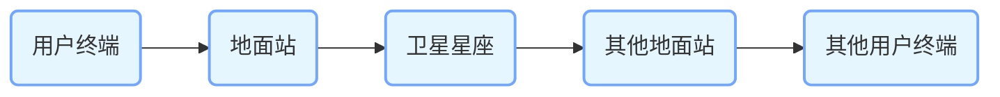

# 企业估值中的量子加密通信卫星网络评估

> 关键词：企业估值、量子加密通信、卫星网络、评估方法、技术原理

> 摘要：本文聚焦于企业估值中量子加密通信卫星网络的评估。首先介绍了相关背景，包括目的范围、预期读者等内容。接着深入探讨量子加密通信卫星网络的核心概念与联系，阐述其原理和架构。详细讲解了核心算法原理及具体操作步骤，结合数学模型和公式进行举例说明。通过项目实战展示代码实现和解读。分析了该网络在实际中的应用场景，并推荐了相关的工具和资源。最后总结了其未来发展趋势与挑战，解答常见问题并提供扩展阅读与参考资料，旨在为企业准确评估量子加密通信卫星网络价值提供全面的理论和实践指导。

## 1. 背景介绍 
### 1.1 目的和范围
在当今数字化和信息化快速发展的时代，量子加密通信卫星网络作为一种具有高度安全性和创新性的通信技术，正逐渐成为企业竞争的关键领域。企业估值中对量子加密通信卫星网络进行准确评估，有助于企业合理确定资产价值，为投资决策、资产重组、上市融资等提供科学依据。本文章的范围涵盖量子加密通信卫星网络的技术原理、评估方法、实际应用等多个方面，旨在全面、系统地探讨企业在进行相关估值时应考虑的因素和采用的方法。

### 1.2 预期读者
本文预期读者包括企业的高层管理人员、财务人员、投资分析师、技术专家以及对量子加密通信卫星网络和企业估值感兴趣的研究人员。这些读者可能需要了解量子加密通信卫星网络的技术特点和商业价值，以便在企业决策中做出准确判断。

### 1.3 文档结构概述
本文首先介绍背景信息，让读者了解文章的目的和适用对象。接着阐述量子加密通信卫星网络的核心概念与联系，包括原理和架构。然后详细讲解核心算法原理和具体操作步骤，通过数学模型和公式进一步说明。项目实战部分展示代码实现和解读，使读者了解实际应用。之后分析实际应用场景，推荐相关工具和资源。最后总结未来发展趋势与挑战，解答常见问题并提供扩展阅读与参考资料。

### 1.4 术语表
#### 1.4.1 核心术语定义
- **量子加密通信**：基于量子力学原理，利用量子态的特性（如量子纠缠、量子不可克隆定理等）来实现信息的安全传输和加密的通信方式。
- **卫星网络**：由多颗卫星组成的通信网络，通过卫星之间以及卫星与地面站之间的通信链路，实现全球范围内的通信覆盖。
- **企业估值**：对企业整体或部分资产的价值进行评估和估算的过程，通常采用多种方法和模型。

#### 1.4.2 相关概念解释
- **量子态**：量子系统的状态，是量子力学中描述微观粒子状态的基本概念。量子态具有叠加性和纠缠性等特性。
- **密钥分发**：在通信双方之间安全地共享加密密钥的过程，是保证通信安全的关键环节。

#### 1.4.3 缩略词列表
- **QKD**：Quantum Key Distribution，量子密钥分发
- **GPS**：Global Positioning System，全球定位系统

## 2. 核心概念与联系 
### 2.1 量子加密通信原理
量子加密通信的核心原理基于量子力学的基本特性。量子态的叠加性使得一个量子比特可以同时处于多个状态的叠加中，而量子不可克隆定理保证了任何试图复制量子态的操作都会改变其原始状态，从而被通信双方察觉。

以量子密钥分发（QKD）为例，常用的BB84协议是通过发送单光子的不同偏振态来传输密钥信息。发送方（Alice）随机选择四种偏振态之一来编码一个比特信息，接收方（Bob）随机选择两种测量基之一来测量接收到的光子。只有当Alice和Bob选择的测量基相同时，测量结果才是有效的。通过比较测量基的选择和测量结果，双方可以筛选出一致的比特序列，形成初始密钥。然后通过纠错和隐私放大等步骤，最终得到安全的密钥。

### 2.2 卫星网络架构
卫星网络通常由卫星星座、地面站和用户终端组成。卫星星座根据轨道高度和分布方式可以分为低地球轨道（LEO）、中地球轨道（MEO）和地球同步轨道（GEO）等不同类型。

低地球轨道卫星距离地球较近，通信延迟小，但覆盖范围有限，需要大量卫星组成星座才能实现全球覆盖。中地球轨道卫星的轨道高度和性能介于低地球轨道和地球同步轨道之间。地球同步轨道卫星位于地球赤道上空约36000公里处，相对地球静止，可以实现对特定区域的持续覆盖。

地面站负责与卫星进行通信，进行信号的接收、处理和转发。用户终端则是最终使用通信服务的设备，如手机、计算机等。

### 2.3 量子加密通信与卫星网络的联系
量子加密通信与卫星网络的结合可以实现全球范围内的安全通信。卫星可以作为量子信号的中继站，将量子密钥分发的范围扩展到全球。通过卫星网络，可以在不同地区的地面站之间建立安全的量子通信链路，为金融、军事、政务等领域提供高度安全的通信服务。

以下是量子加密通信卫星网络架构的文本示意图：

量子加密通信卫星网络由卫星星座、地面站和用户终端组成。卫星星座中的卫星搭载量子通信载荷，负责接收和转发量子信号。地面站通过光学天线与卫星进行量子通信，实现量子密钥的分发。用户终端通过地面站接入量子加密通信网络，使用安全的通信服务。

以下是Mermaid流程图：


## 3. 核心算法原理 & 具体操作步骤 
### 3.1 量子密钥分发算法（BB84协议）
BB84协议是量子密钥分发的经典算法，其核心思想是利用单光子的偏振态来传输密钥信息。以下是Python代码实现：

```python
import random

# 定义四种偏振态
POLARIZATIONS = ['0', '90', '45', '135']

# 生成随机的比特序列和测量基序列
def generate_random_sequence(length):
    bit_sequence = [random.randint(0, 1) for _ in range(length)]
    basis_sequence = [random.choice(['rectilinear', 'diagonal']) for _ in range(length)]
    return bit_sequence, basis_sequence

# 根据比特和测量基选择偏振态
def encode(bit, basis):
    if basis == 'rectilinear':
        if bit == 0:
            return POLARIZATIONS[0]
        else:
            return POLARIZATIONS[1]
    else:
        if bit == 0:
            return POLARIZATIONS[2]
        else:
            return POLARIZATIONS[3]

# 根据测量基测量偏振态
def measure(polarization, basis):
    if basis == 'rectilinear':
        if polarization in [POLARIZATIONS[0], POLARIZATIONS[1]]:
            if polarization == POLARIZATIONS[0]:
                return 0
            else:
                return 1
        else:
            return random.randint(0, 1)
    else:
        if polarization in [POLARIZATIONS[2], POLARIZATIONS[3]]:
            if polarization == POLARIZATIONS[2]:
                return 0
            else:
                return 1
        else:
            return random.randint(0, 1)

# 筛选一致的比特序列
def sift_bits(alice_bits, alice_bases, bob_bases, bob_bits):
    sifted_bits = []
    for i in range(len(alice_bits)):
        if alice_bases[i] == bob_bases[i]:
            sifted_bits.append(alice_bits[i])
    return sifted_bits

# 主函数
def bb84_protocol(length):
    alice_bits, alice_bases = generate_random_sequence(length)
    encoded_polarizations = [encode(alice_bits[i], alice_bases[i]) for i in range(length)]
    bob_bases = [random.choice(['rectilinear', 'diagonal']) for _ in range(length)]
    bob_bits = [measure(encoded_polarizations[i], bob_bases[i]) for i in range(length)]
    sifted_bits = sift_bits(alice_bits, alice_bases, bob_bases, bob_bits)
    return sifted_bits

# 示例运行
key_length = 100
sifted_key = bb84_protocol(key_length)
print("Sifted Key:", sifted_key)
```

### 3.2 具体操作步骤
1. **密钥生成**：发送方（Alice）和接收方（Bob）分别生成随机的比特序列和测量基序列。
2. **编码**：Alice根据自己的比特序列和测量基序列选择相应的偏振态进行编码，并将编码后的量子信号发送给Bob。
3. **测量**：Bob根据自己的测量基序列对接收到的量子信号进行测量，得到测量结果。
4. **基比对**：Alice和Bob通过经典通信渠道公开比较测量基序列，筛选出一致的比特序列，形成初始密钥。
5. **纠错和隐私放大**：对初始密钥进行纠错和隐私放大处理，去除可能存在的错误和信息泄露，得到最终的安全密钥。

## 4. 数学模型和公式 & 详细讲解 & 举例说明 
### 4.1 量子密钥分发的安全性分析
量子密钥分发的安全性基于量子力学的基本原理，如量子不可克隆定理。假设存在一个窃听者（Eve）试图截取量子信号并获取密钥信息。由于量子不可克隆定理，Eve无法复制量子态而不被察觉。

设量子信道的误码率为 $e$，初始密钥长度为 $n$，筛选后的密钥长度为 $m$。根据量子密钥分发的理论，筛选后的密钥长度 $m$ 与初始密钥长度 $n$ 和误码率 $e$ 之间存在以下关系：

$$m = n(1 - 2h(e))$$

其中 $h(e)$ 是二进制熵函数，定义为：

$$h(e) = -e\log_2(e) - (1 - e)\log_2(1 - e)$$

### 4.2 举例说明
假设初始密钥长度 $n = 1000$，量子信道的误码率 $e = 0.05$。首先计算二进制熵函数 $h(e)$：

$$h(0.05) = -0.05\log_2(0.05) - (1 - 0.05)\log_2(1 - 0.05) \approx 0.286$$

然后计算筛选后的密钥长度 $m$：

$$m = 1000(1 - 2\times0.286) = 1000\times0.428 = 428$$

这意味着在误码率为 $0.05$ 的情况下，经过筛选后，初始的1000比特密钥将减少到约428比特。

## 5. 项目实战：代码实际案例和详细解释说明 
### 5.1  开发环境搭建
- **编程语言**：Python 3.x
- **开发工具**：可以选择 PyCharm、Jupyter Notebook 等集成开发环境。
- **依赖库**：在这个项目中，主要使用 Python 的内置库，无需额外安装其他库。

### 5.2  源代码详细实现和代码解读
以下是一个完整的量子加密通信卫星网络模拟项目的代码示例：

```python
import random

# 定义四种偏振态
POLARIZATIONS = ['0', '90', '45', '135']

# 生成随机的比特序列和测量基序列
def generate_random_sequence(length):
    bit_sequence = [random.randint(0, 1) for _ in range(length)]
    basis_sequence = [random.choice(['rectilinear', 'diagonal']) for _ in range(length)]
    return bit_sequence, basis_sequence

# 根据比特和测量基选择偏振态
def encode(bit, basis):
    if basis == 'rectilinear':
        if bit == 0:
            return POLARIZATIONS[0]
        else:
            return POLARIZATIONS[1]
    else:
        if bit == 0:
            return POLARIZATIONS[2]
        else:
            return POLARIZATIONS[3]

# 根据测量基测量偏振态
def measure(polarization, basis):
    if basis == 'rectilinear':
        if polarization in [POLARIZATIONS[0], POLARIZATIONS[1]]:
            if polarization == POLARIZATIONS[0]:
                return 0
            else:
                return 1
        else:
            return random.randint(0, 1)
    else:
        if polarization in [POLARIZATIONS[2], POLARIZATIONS[3]]:
            if polarization == POLARIZATIONS[2]:
                return 0
            else:
                return 1
        else:
            return random.randint(0, 1)

# 筛选一致的比特序列
def sift_bits(alice_bits, alice_bases, bob_bases, bob_bits):
    sifted_bits = []
    for i in range(len(alice_bits)):
        if alice_bases[i] == bob_bases[i]:
            sifted_bits.append(alice_bits[i])
    return sifted_bits

# 模拟量子信道噪声
def add_noise(bits, error_rate):
    noisy_bits = []
    for bit in bits:
        if random.random() < error_rate:
            noisy_bits.append(1 - bit)
        else:
            noisy_bits.append(bit)
    return noisy_bits

# 主函数
def quantum_communication_simulation(key_length, error_rate):
    alice_bits, alice_bases = generate_random_sequence(key_length)
    encoded_polarizations = [encode(alice_bits[i], alice_bases[i]) for i in range(key_length)]
    bob_bases = [random.choice(['rectilinear', 'diagonal']) for _ in range(key_length)]
    bob_bits = [measure(encoded_polarizations[i], bob_bases[i]) for i in range(key_length)]
    noisy_bob_bits = add_noise(bob_bits, error_rate)
    sifted_bits = sift_bits(alice_bits, alice_bases, bob_bases, noisy_bob_bits)
    return sifted_bits

# 示例运行
key_length = 1000
error_rate = 0.05
sifted_key = quantum_communication_simulation(key_length, error_rate)
print("Sifted Key Length:", len(sifted_key))
```

### 5.3  代码解读与分析
- **`generate_random_sequence` 函数**：生成随机的比特序列和测量基序列，模拟发送方和接收方的初始随机选择。
- **`encode` 函数**：根据比特和测量基选择相应的偏振态进行编码，实现量子信号的生成。
- **`measure` 函数**：根据测量基对偏振态进行测量，得到测量结果。
- **`sift_bits` 函数**：筛选出发送方和接收方测量基一致的比特序列，形成初始密钥。
- **`add_noise` 函数**：模拟量子信道中的噪声，引入一定的误码率。
- **`quantum_communication_simulation` 函数**：主函数，模拟整个量子加密通信过程，包括密钥生成、编码、测量、噪声添加和筛选等步骤。

通过这个模拟项目，我们可以观察到量子加密通信在不同误码率下的性能表现，为实际应用提供参考。

## 6. 实际应用场景 
### 6.1 金融领域
在金融交易中，信息的安全性至关重要。量子加密通信卫星网络可以为银行、证券等金融机构提供高度安全的通信服务，保护客户的账户信息、交易数据等敏感信息不被窃取和篡改。例如，在跨境支付、高频交易等场景中，使用量子加密通信可以有效降低信息泄露的风险，提高交易的安全性和可靠性。

### 6.2 军事领域
军事通信对安全性和保密性有极高的要求。量子加密通信卫星网络可以为军队提供安全的通信链路，确保作战指令、情报信息等的安全传输。在现代战争中，信息优势是取得胜利的关键因素之一，量子加密通信可以有效防止敌方的窃听和干扰，保障军事行动的顺利进行。

### 6.3 政务领域
政府部门在处理涉及国家安全、民生等重要信息时，需要确保信息的安全性。量子加密通信卫星网络可以为政务通信提供安全保障，如政府公文传输、电子政务系统等。通过使用量子加密技术，可以提高政务信息的保密性和完整性，增强政府的公信力。

### 6.4 科学研究领域
在科学研究中，如天文学、物理学等领域，需要传输大量的科研数据。量子加密通信卫星网络可以为这些数据提供安全的传输通道，保护科研成果的知识产权。同时，量子加密通信的高安全性也可以促进国际间的科学合作，确保科研数据的安全共享。

## 7. 工具和资源推荐
### 7.1 学习资源推荐
#### 7.1.1 书籍推荐
- 《量子通信》：全面介绍量子通信的基本原理、技术和应用，是学习量子通信的经典教材。
- 《卫星通信系统工程》：详细讲解卫星通信的系统架构、设计和优化，对理解卫星网络有很大帮助。
- 《企业估值》：介绍企业估值的方法和模型，为企业估值中的量子加密通信卫星网络评估提供理论支持。

#### 7.1.2 在线课程
- Coursera 上的“量子信息科学”课程：由知名高校教授授课，系统介绍量子信息科学的基本概念和技术。
- edX 上的“卫星通信技术”课程：深入讲解卫星通信的原理和应用，适合对卫星网络感兴趣的学习者。

#### 7.1.3 技术博客和网站
- 量子通信技术博客：提供量子通信领域的最新研究成果和技术动态。
- 卫星通信网：专注于卫星通信技术的发展和应用，有丰富的技术文章和案例分析。

### 7.2 开发工具框架推荐
#### 7.2.1 IDE和编辑器
- PyCharm：功能强大的 Python 集成开发环境，提供代码编辑、调试、版本控制等功能。
- Jupyter Notebook：交互式的开发环境，适合进行数据分析和代码演示。

#### 7.2.2 调试和性能分析工具
- Python 的 `pdb` 模块：Python 内置的调试工具，用于调试 Python 代码。
- `cProfile` 模块：Python 的性能分析工具，用于分析代码的执行时间和性能瓶颈。

#### 7.2.3 相关框架和库
- QuTiP：用于量子计算和量子信息处理的 Python 库，提供量子态、量子门等基本概念的实现。
- SatPy：用于处理卫星遥感数据的 Python 库，可用于卫星网络数据的分析和处理。

### 7.3 相关论文著作推荐
#### 7.3.1 经典论文
- “Quantum cryptography based on Bell's theorem”：提出了基于贝尔定理的量子密码学理论，是量子加密通信领域的经典论文。
- “A scheme for efficient quantum computation with linear optics”：介绍了线性光学量子计算的方案，对量子通信技术的发展有重要影响。

#### 7.3.2 最新研究成果
- 关注 Nature、Science 等顶级学术期刊上关于量子加密通信和卫星网络的最新研究论文，了解该领域的前沿动态。

#### 7.3.3 应用案例分析
- 参考相关企业和研究机构发布的量子加密通信卫星网络应用案例分析报告，了解实际应用中的经验和挑战。

## 8. 总结：未来发展趋势与挑战
### 8.1 未来发展趋势
- **技术创新**：量子加密通信技术将不断创新，如更高效率的量子密钥分发协议、更稳定的量子纠缠源等。卫星网络技术也将不断发展，如卫星的小型化、智能化和组网技术的优化。
- **应用拓展**：量子加密通信卫星网络的应用将不断拓展到更多领域，如物联网、智能交通、能源等。随着5G、6G等通信技术的发展，量子加密通信将为这些技术提供更安全的通信保障。
- **国际合作**：量子加密通信卫星网络是一个全球性的项目，需要国际间的合作与协调。未来，各国将加强在量子加密通信和卫星网络领域的合作，共同推动该技术的发展和应用。

### 8.2 挑战
- **技术难题**：量子加密通信技术还面临一些技术难题，如量子信号的传输损耗、量子态的退相干等。卫星网络的建设和维护也需要解决一系列技术问题，如卫星的轨道控制、通信链路的稳定性等。
- **成本问题**：量子加密通信卫星网络的建设和运营成本较高，包括卫星的研制、发射和维护费用，以及量子通信设备的研发和生产成本。降低成本是推广量子加密通信卫星网络应用的关键。
- **标准和规范**：目前量子加密通信卫星网络的标准和规范还不完善，需要建立统一的标准和规范，以确保不同系统之间的兼容性和互操作性。

## 9. 附录：常见问题与解答
### 9.1 量子加密通信卫星网络的安全性如何保证？
量子加密通信卫星网络的安全性基于量子力学的基本原理，如量子不可克隆定理。任何试图截取量子信号的行为都会改变量子态，从而被通信双方察觉。同时，通过量子密钥分发协议，可以安全地共享加密密钥，保证通信内容的保密性。

### 9.2 量子加密通信卫星网络的成本高吗？
目前，量子加密通信卫星网络的建设和运营成本较高。这主要包括卫星的研制、发射和维护费用，以及量子通信设备的研发和生产成本。随着技术的发展和规模的扩大，成本有望逐渐降低。

### 9.3 量子加密通信卫星网络的应用前景如何？
量子加密通信卫星网络具有广阔的应用前景。在金融、军事、政务、科学研究等领域，对信息安全有极高的要求，量子加密通信卫星网络可以提供高度安全的通信服务。随着技术的不断发展和应用的拓展，其市场需求将不断增加。

## 10. 扩展阅读 & 参考资料
- 《量子力学导论》
- 《卫星通信技术原理与应用》
- 国际电信联盟（ITU）相关标准和报告
- 量子加密通信领域的学术会议论文集

通过以上扩展阅读和参考资料，可以进一步深入了解量子加密通信卫星网络的技术原理、应用和发展趋势。