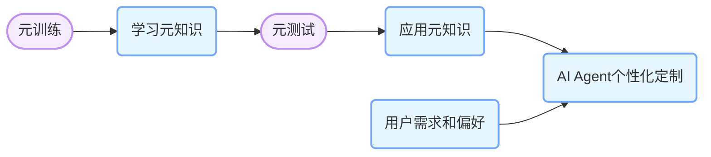

# 元学习在AI Agent个性化定制中的应用

> 关键词：元学习、AI Agent、个性化定制、机器学习、模型自适应

> 摘要：本文深入探讨了元学习在AI Agent个性化定制中的应用。首先介绍了研究的背景、目的、预期读者和文档结构，对相关术语进行了详细解释。接着阐述了元学习和AI Agent的核心概念及其联系，并给出了相应的文本示意图和Mermaid流程图。在核心算法原理部分，使用Python代码详细讲解了元学习的具体算法。同时，给出了元学习的数学模型和公式，并通过举例进行说明。通过项目实战，展示了如何在实际开发中应用元学习实现AI Agent的个性化定制，包括开发环境搭建、源代码实现和代码解读。还探讨了元学习在不同场景下的实际应用，推荐了相关的学习资源、开发工具框架和论文著作。最后总结了元学习在AI Agent个性化定制中的未来发展趋势与挑战，并提供了常见问题解答和扩展阅读参考资料。

## 1. 背景介绍 
### 1.1 目的和范围
随着人工智能技术的不断发展，AI Agent在各个领域的应用越来越广泛。然而，不同用户对AI Agent的功能和表现有不同的需求，传统的机器学习方法难以快速适应这些个性化需求。元学习作为一种新兴的机器学习范式，能够让模型在少量数据上快速学习和适应新任务，为AI Agent的个性化定制提供了有效的解决方案。本文的目的是深入研究元学习在AI Agent个性化定制中的应用，探讨其核心原理、算法实现、实际应用场景等方面的内容，为相关领域的研究和开发提供参考。

### 1.2 预期读者
本文主要面向人工智能领域的研究人员、开发者、学生以及对元学习和AI Agent感兴趣的技术爱好者。对于有一定机器学习基础的读者，本文可以帮助他们深入了解元学习在AI Agent个性化定制中的具体应用；对于初学者，本文可以作为一个入门指南，引导他们了解相关概念和技术。

### 1.3 文档结构概述
本文将按照以下结构进行组织：
- 核心概念与联系：介绍元学习和AI Agent的核心概念，分析它们之间的联系，并给出相应的文本示意图和Mermaid流程图。
- 核心算法原理 & 具体操作步骤：详细讲解元学习的核心算法原理，使用Python代码实现具体的操作步骤。
- 数学模型和公式 & 详细讲解 & 举例说明：给出元学习的数学模型和公式，进行详细讲解，并通过实际例子进行说明。
- 项目实战：代码实际案例和详细解释说明：通过一个实际项目，展示如何使用元学习实现AI Agent的个性化定制，包括开发环境搭建、源代码实现和代码解读。
- 实际应用场景：探讨元学习在AI Agent个性化定制中的实际应用场景。
- 工具和资源推荐：推荐相关的学习资源、开发工具框架和论文著作。
- 总结：未来发展趋势与挑战：总结元学习在AI Agent个性化定制中的未来发展趋势和面临的挑战。
- 附录：常见问题与解答：提供常见问题的解答，帮助读者更好地理解本文内容。
- 扩展阅读 & 参考资料：提供扩展阅读的建议和参考资料，方便读者进一步深入学习。

### 1.4 术语表
#### 1.4.1 核心术语定义
- **元学习（Meta-learning）**：也称为“学习如何学习”，是一种让模型能够在少量数据上快速学习和适应新任务的机器学习范式。元学习通过学习多个任务之间的共性，使得模型能够在新任务上更快地收敛和取得更好的性能。
- **AI Agent（人工智能智能体）**：是一种能够感知环境、做出决策并采取行动的智能实体。AI Agent可以是软件程序、机器人等，它们能够在不同的环境中自主地完成各种任务。
- **个性化定制（Personalization）**：根据用户的特定需求、偏好和行为模式，为用户提供定制化的服务和体验。在AI Agent中，个性化定制意味着AI Agent能够根据不同用户的需求和偏好，调整自己的行为和决策方式。

#### 1.4.2 相关概念解释
- **元知识（Meta-knowledge）**：元学习中学习到的关于多个任务的共性知识，这些知识可以帮助模型在新任务上更快地学习和适应。
- **元训练（Meta-training）**：在元学习中，使用多个任务进行训练，让模型学习到元知识的过程。
- **元测试（Meta-testing）**：在元学习中，使用新的任务对训练好的模型进行测试，评估模型在新任务上的性能的过程。

#### 1.4.3 缩略词列表
- **MAML（Model-Agnostic Meta-Learning）**：一种模型无关的元学习算法，能够在多种机器学习模型上应用。
- **Reptile**：一种基于梯度下降的元学习算法，具有简单高效的特点。

## 2. 核心概念与联系 
### 元学习的核心概念
元学习的核心思想是学习如何学习，即通过在多个任务上进行训练，让模型学习到通用的学习策略和知识，从而能够在新的任务上快速学习和适应。元学习通常分为两个阶段：元训练阶段和元测试阶段。在元训练阶段，模型在多个任务上进行训练，学习到元知识；在元测试阶段，模型使用新的任务进行测试，应用元知识快速适应新任务。

### AI Agent的核心概念
AI Agent是一种能够感知环境、做出决策并采取行动的智能实体。AI Agent通常由感知模块、决策模块和执行模块组成。感知模块负责感知环境信息，决策模块根据感知到的信息做出决策，执行模块根据决策采取相应的行动。AI Agent可以在不同的环境中自主地完成各种任务，如游戏、机器人控制、自然语言处理等。

### 元学习与AI Agent的联系
元学习为AI Agent的个性化定制提供了有效的手段。通过元学习，AI Agent可以在少量数据上快速学习和适应不同用户的需求和偏好，实现个性化定制。例如，在智能客服系统中，AI Agent可以通过元学习快速学习不同用户的语言习惯和问题类型，提供更加个性化的服务；在智能推荐系统中，AI Agent可以通过元学习快速适应不同用户的兴趣偏好，提供更加精准的推荐。

### 文本示意图
```plaintext
元学习 <-- 元知识 --> AI Agent
|                      |
|                      |
元训练               个性化定制
|                      |
|                      |
多个任务             用户需求和偏好
```

### Mermaid流程图


## 3. 核心算法原理 & 具体操作步骤 
### 模型无关的元学习（MAML）算法原理
MAML是一种模型无关的元学习算法，其核心思想是通过在多个任务上进行训练，找到一个初始参数，使得模型在新任务上只需要进行少量的梯度更新就能取得较好的性能。具体来说，MAML的训练过程可以分为以下几个步骤：
1. 随机初始化模型的参数 $\theta$。
2. 从任务分布 $P(\mathcal{T})$ 中采样一个任务 $\mathcal{T}_i$。
3. 在任务 $\mathcal{T}_i$ 上进行一次或多次梯度更新，得到更新后的参数 $\theta_i'$：
   - 计算损失函数 $L(\theta)$ 在任务 $\mathcal{T}_i$ 上的梯度 $\nabla_{\theta} L(\theta, \mathcal{T}_i)$。
   - 根据梯度更新参数：$\theta_i' = \theta - \alpha \nabla_{\theta} L(\theta, \mathcal{T}_i)$，其中 $\alpha$ 是学习率。
4. 计算在更新后的参数 $\theta_i'$ 下，模型在任务 $\mathcal{T}_i$ 上的损失函数 $L(\theta_i', \mathcal{T}_i)$。
5. 对所有采样的任务 $\{\mathcal{T}_1, \mathcal{T}_2, \cdots, \mathcal{T}_n\}$，计算总的损失函数：
   - $L_{meta}(\theta) = \sum_{i=1}^{n} L(\theta_i', \mathcal{T}_i)$。
6. 根据总的损失函数 $L_{meta}(\theta)$ 对初始参数 $\theta$ 进行更新：
   - 计算梯度 $\nabla_{\theta} L_{meta}(\theta)$。
   - 根据梯度更新参数：$\theta = \theta - \beta \nabla_{\theta} L_{meta}(\theta)$，其中 $\beta$ 是元学习率。

### Python代码实现
```python
import torch
import torch.nn as nn
import torch.optim as optim

# 定义一个简单的神经网络模型
class SimpleModel(nn.Module):
    def __init__(self):
        super(SimpleModel, self).__init__()
        self.fc1 = nn.Linear(10, 20)
        self.fc2 = nn.Linear(20, 1)

    def forward(self, x):
        x = torch.relu(self.fc1(x))
        x = self.fc2(x)
        return x

# 定义MAML算法
def maml(model, tasks, num_inner_steps, inner_lr, meta_lr):
    meta_optimizer = optim.Adam(model.parameters(), lr=meta_lr)
    for epoch in range(100):
        meta_loss = 0
        for task in tasks:
            # 复制模型参数
            fast_weights = list(model.parameters())
            for _ in range(num_inner_steps):
                # 前向传播
                inputs, labels = task
                outputs = model(inputs)
                loss = nn.MSELoss()(outputs, labels)
                # 计算梯度
                grads = torch.autograd.grad(loss, fast_weights)
                # 更新参数
                fast_weights = [w - inner_lr * g for w, g in zip(fast_weights, grads)]
            # 计算元损失
            outputs = model(inputs)
            meta_loss += nn.MSELoss()(outputs, labels)
        # 更新元参数
        meta_optimizer.zero_grad()
        meta_loss.backward()
        meta_optimizer.step()
        print(f'Epoch {epoch}: Meta Loss = {meta_loss.item()}')
    return model

# 示例任务
tasks = [
    (torch.randn(10, 10), torch.randn(10, 1)),
    (torch.randn(10, 10), torch.randn(10, 1))
]

# 初始化模型
model = SimpleModel()

# 运行MAML算法
trained_model = maml(model, tasks, num_inner_steps=5, inner_lr=0.01, meta_lr=0.001)
```

### 代码解释
1. **定义模型**：定义了一个简单的神经网络模型 `SimpleModel`，包含两个全连接层。
2. **定义MAML算法**：`maml` 函数实现了MAML算法的核心逻辑。在每个epoch中，从任务分布中采样一个任务，在该任务上进行多次梯度更新，得到更新后的参数，然后计算元损失，最后根据元损失更新初始参数。
3. **示例任务**：创建了两个示例任务，每个任务包含输入数据和标签。
4. **初始化模型**：初始化一个 `SimpleModel` 模型。
5. **运行MAML算法**：调用 `maml` 函数，传入模型、任务、内层步数、内层学习率和元学习率，训练模型。

## 4. 数学模型和公式 & 详细讲解 & 举例说明 
### 数学模型和公式
#### 损失函数
在元学习中，通常使用损失函数来衡量模型在任务上的性能。假设模型的参数为 $\theta$，任务为 $\mathcal{T}$，则模型在任务 $\mathcal{T}$ 上的损失函数可以表示为 $L(\theta, \mathcal{T})$。

#### 元损失函数
元损失函数用于衡量模型在多个任务上的总体性能。假设从任务分布 $P(\mathcal{T})$ 中采样了 $n$ 个任务 $\{\mathcal{T}_1, \mathcal{T}_2, \cdots, \mathcal{T}_n\}$，则元损失函数可以表示为：
$$L_{meta}(\theta) = \sum_{i=1}^{n} L(\theta_i', \mathcal{T}_i)$$
其中 $\theta_i'$ 是在任务 $\mathcal{T}_i$ 上进行一次或多次梯度更新后得到的参数。

#### 梯度更新公式
在元学习中，使用梯度下降法来更新模型的参数。在任务 $\mathcal{T}_i$ 上进行一次梯度更新的公式为：
$$\theta_i' = \theta - \alpha \nabla_{\theta} L(\theta, \mathcal{T}_i)$$
其中 $\alpha$ 是学习率。在元训练阶段，根据元损失函数更新初始参数的公式为：
$$\theta = \theta - \beta \nabla_{\theta} L_{meta}(\theta)$$
其中 $\beta$ 是元学习率。

### 详细讲解
元学习的核心思想是通过在多个任务上进行训练，找到一个初始参数 $\theta$，使得模型在新任务上只需要进行少量的梯度更新就能取得较好的性能。元损失函数 $L_{meta}(\theta)$ 衡量了模型在多个任务上的总体性能，通过最小化元损失函数，可以找到最优的初始参数 $\theta$。

在每个任务 $\mathcal{T}_i$ 上，首先使用当前的参数 $\theta$ 计算损失函数 $L(\theta, \mathcal{T}_i)$，然后根据梯度更新公式得到更新后的参数 $\theta_i'$。最后，计算在更新后的参数 $\theta_i'$ 下，模型在任务 $\mathcal{T}_i$ 上的损失函数 $L(\theta_i', \mathcal{T}_i)$，并将所有任务的损失函数相加得到元损失函数 $L_{meta}(\theta)$。

### 举例说明
假设我们有两个任务 $\mathcal{T}_1$ 和 $\mathcal{T}_2$，模型的参数为 $\theta$。在任务 $\mathcal{T}_1$ 上，计算损失函数 $L(\theta, \mathcal{T}_1)$，然后根据梯度更新公式得到更新后的参数 $\theta_1'$：
$$\theta_1' = \theta - \alpha \nabla_{\theta} L(\theta, \mathcal{T}_1)$$
在任务 $\mathcal{T}_2$ 上，同样计算损失函数 $L(\theta, \mathcal{T}_2)$，并得到更新后的参数 $\theta_2'$：
$$\theta_2' = \theta - \alpha \nabla_{\theta} L(\theta, \mathcal{T}_2)$$
然后计算元损失函数：
$$L_{meta}(\theta) = L(\theta_1', \mathcal{T}_1) + L(\theta_2', \mathcal{T}_2)$$
最后根据元损失函数更新初始参数 $\theta$：
$$\theta = \theta - \beta \nabla_{\theta} L_{meta}(\theta)$$

## 5. 项目实战：代码实际案例和详细解释说明 
### 5.1  开发环境搭建
#### 安装Python
首先需要安装Python，建议使用Python 3.7及以上版本。可以从Python官方网站（https://www.python.org/downloads/）下载并安装。

#### 安装深度学习框架
本项目使用PyTorch作为深度学习框架，可以使用以下命令安装：
```sh
pip install torch torchvision
```

#### 安装其他依赖库
还需要安装一些其他的依赖库，如NumPy、Matplotlib等，可以使用以下命令安装：
```sh
pip install numpy matplotlib
```

### 5.2  源代码详细实现和代码解读
#### 项目概述
本项目实现了一个基于MAML算法的AI Agent个性化定制系统，用于解决简单的回归问题。通过在多个回归任务上进行元训练，使得AI Agent能够在新的回归任务上快速学习和适应。

#### 源代码实现
```python
import torch
import torch.nn as nn
import torch.optim as optim
import numpy as np
import matplotlib.pyplot as plt

# 定义一个简单的神经网络模型
class SimpleModel(nn.Module):
    def __init__(self):
        super(SimpleModel, self).__init__()
        self.fc1 = nn.Linear(1, 20)
        self.fc2 = nn.Linear(20, 1)

    def forward(self, x):
        x = torch.relu(self.fc1(x))
        x = self.fc2(x)
        return x

# 生成任务数据
def generate_task(num_samples):
    slope = np.random.uniform(-1, 1)
    intercept = np.random.uniform(-1, 1)
    x = np.random.uniform(-1, 1, num_samples)
    y = slope * x + intercept
    x = torch.tensor(x, dtype=torch.float32).unsqueeze(1)
    y = torch.tensor(y, dtype=torch.float32).unsqueeze(1)
    return x, y

# 定义MAML算法
def maml(model, num_tasks, num_inner_steps, inner_lr, meta_lr):
    meta_optimizer = optim.Adam(model.parameters(), lr=meta_lr)
    for epoch in range(1000):
        meta_loss = 0
        for _ in range(num_tasks):
            x, y = generate_task(10)
            # 复制模型参数
            fast_weights = list(model.parameters())
            for _ in range(num_inner_steps):
                # 前向传播
                outputs = model(x)
                loss = nn.MSELoss()(outputs, y)
                # 计算梯度
                grads = torch.autograd.grad(loss, fast_weights)
                # 更新参数
                fast_weights = [w - inner_lr * g for w, g in zip(fast_weights, grads)]
            # 计算元损失
            outputs = model(x)
            meta_loss += nn.MSELoss()(outputs, y)
        # 更新元参数
        meta_optimizer.zero_grad()
        meta_loss.backward()
        meta_optimizer.step()
        if epoch % 100 == 0:
            print(f'Epoch {epoch}: Meta Loss = {meta_loss.item()}')
    return model

# 测试模型
def test_model(model, num_tasks):
    total_loss = 0
    for _ in range(num_tasks):
        x, y = generate_task(10)
        # 复制模型参数
        fast_weights = list(model.parameters())
        for _ in range(5):
            # 前向传播
            outputs = model(x)
            loss = nn.MSELoss()(outputs, y)
            # 计算梯度
            grads = torch.autograd.grad(loss, fast_weights)
            # 更新参数
            fast_weights = [w - 0.01 * g for w, g in zip(fast_weights, grads)]
        # 计算测试损失
        outputs = model(x)
        total_loss += nn.MSELoss()(outputs, y).item()
    average_loss = total_loss / num_tasks
    print(f'Average Test Loss: {average_loss}')

# 初始化模型
model = SimpleModel()

# 运行MAML算法
trained_model = maml(model, num_tasks=20, num_inner_steps=5, inner_lr=0.01, meta_lr=0.001)

# 测试模型
test_model(trained_model, num_tasks=10)

# 可视化结果
x_test, y_test = generate_task(10)
outputs = trained_model(x_test)
plt.scatter(x_test.detach().numpy(), y_test.detach().numpy(), label='True')
plt.scatter(x_test.detach().numpy(), outputs.detach().numpy(), label='Predicted')
plt.legend()
plt.show()
```

#### 代码解读
1. **定义模型**：定义了一个简单的神经网络模型 `SimpleModel`，包含两个全连接层，用于解决一维回归问题。
2. **生成任务数据**：`generate_task` 函数用于生成随机的回归任务数据，每个任务的斜率和截距都是随机生成的。
3. **定义MAML算法**：`maml` 函数实现了MAML算法的核心逻辑，包括元训练和元参数更新。
4. **测试模型**：`test_model` 函数用于测试训练好的模型在新任务上的性能，通过在新任务上进行少量的梯度更新，计算测试损失。
5. **运行MAML算法**：初始化模型，调用 `maml` 函数进行元训练，得到训练好的模型。
6. **测试模型**：调用 `test_model` 函数测试训练好的模型在新任务上的性能。
7. **可视化结果**：使用Matplotlib库可视化模型的预测结果。

### 5.3  代码解读与分析
#### 模型结构分析
本项目使用的 `SimpleModel` 是一个简单的两层全连接神经网络，输入维度为1，输出维度为1，中间层有20个神经元。这种简单的模型结构适合用于解决一维回归问题。

#### MAML算法分析
MAML算法的核心是在多个任务上进行元训练，通过多次梯度更新找到一个初始参数，使得模型在新任务上只需要进行少量的梯度更新就能取得较好的性能。在本项目中，通过在多个随机生成的回归任务上进行元训练，使得模型能够快速适应新的回归任务。

#### 测试结果分析
通过测试模型在新任务上的性能，可以评估模型的泛化能力。在本项目中，通过计算平均测试损失来评估模型的性能，平均测试损失越小，说明模型在新任务上的性能越好。

## 6. 实际应用场景 
### 智能客服系统
在智能客服系统中，不同用户的问题类型和语言习惯可能不同。通过元学习，AI Agent可以在少量数据上快速学习不同用户的需求和偏好，提供更加个性化的服务。例如，对于经常询问产品价格的用户，AI Agent可以快速学习该用户的需求，优先提供产品价格信息；对于询问产品功能的用户，AI Agent可以快速学习该用户的语言习惯，提供更加准确的产品功能介绍。

### 智能推荐系统
在智能推荐系统中，不同用户的兴趣偏好可能不同。通过元学习，AI Agent可以在少量数据上快速适应不同用户的兴趣偏好，提供更加精准的推荐。例如，对于喜欢电影的用户，AI Agent可以快速学习该用户的电影偏好，推荐符合其口味的电影；对于喜欢音乐的用户，AI Agent可以快速学习该用户的音乐偏好，推荐符合其口味的音乐。

### 机器人控制
在机器人控制中，不同的任务和环境可能需要不同的控制策略。通过元学习，AI Agent可以在少量数据上快速学习不同任务和环境的特点，调整自己的控制策略。例如，在机器人导航任务中，AI Agent可以通过元学习快速适应不同的地图和障碍物分布，选择最优的导航路径；在机器人抓取任务中，AI Agent可以通过元学习快速适应不同的物体形状和材质，调整抓取力度和姿态。

### 医疗诊断
在医疗诊断中，不同患者的病情和症状可能不同。通过元学习，AI Agent可以在少量数据上快速学习不同患者的病情特点，提供更加个性化的诊断建议。例如，对于患有心脏病的患者，AI Agent可以通过元学习快速学习该患者的症状和病史，提供更加准确的心脏病诊断和治疗建议；对于患有癌症的患者，AI Agent可以通过元学习快速学习该患者的肿瘤类型和分期，提供更加个性化的癌症治疗方案。

## 7. 工具和资源推荐
### 7.1 学习资源推荐
#### 7.1.1 书籍推荐
- 《深度学习》（Deep Learning）：由Ian Goodfellow、Yoshua Bengio和Aaron Courville所著，是深度学习领域的经典教材，涵盖了深度学习的基本概念、算法和应用。
- 《机器学习》（Machine Learning: A Probabilistic Perspective）：由Kevin P. Murphy所著，是机器学习领域的经典教材，从概率的角度介绍了机器学习的基本概念、算法和应用。
- 《元学习：基础与前沿》（Meta-Learning: Foundations and Frontiers）：由Richard S. Sutton和Andrew G. Barto所著，是元学习领域的专业书籍，系统介绍了元学习的基本概念、算法和应用。

#### 7.1.2 在线课程
- Coursera上的“深度学习专项课程”（Deep Learning Specialization）：由Andrew Ng教授讲授，涵盖了深度学习的基本概念、算法和应用，是学习深度学习的经典在线课程。
- edX上的“强化学习基础”（Foundations of Reinforcement Learning）：由Pieter Abbeel教授讲授，介绍了强化学习的基本概念、算法和应用，是学习强化学习的优秀在线课程。
- 网易云课堂上的“元学习实战教程”：由国内知名专家讲授，介绍了元学习的基本概念、算法和应用，并通过实际案例进行讲解，是学习元学习的实用在线课程。

#### 7.1.3 技术博客和网站
- Medium上的“Towards Data Science”：是一个专注于数据科学和机器学习的技术博客，上面有很多关于元学习和AI Agent的优秀文章。
- arXiv.org：是一个预印本数据库，上面有很多关于元学习和AI Agent的最新研究成果。
- OpenAI官方网站：OpenAI是人工智能领域的领先研究机构，其官方网站上有很多关于元学习和AI Agent的研究论文和技术报告。

### 7.2 开发工具框架推荐
#### 7.2.1 IDE和编辑器
- PyCharm：是一款专门为Python开发设计的集成开发环境（IDE），具有强大的代码编辑、调试和项目管理功能，是Python开发的首选IDE。
- Visual Studio Code：是一款轻量级的代码编辑器，支持多种编程语言，具有丰富的插件生态系统，可以方便地进行Python开发。
- Jupyter Notebook：是一个交互式的笔记本环境，支持Python等多种编程语言，可以方便地进行数据探索、模型训练和结果可视化，是数据科学和机器学习领域常用的开发工具。

#### 7.2.2 调试和性能分析工具
- PyTorch Profiler：是PyTorch官方提供的性能分析工具，可以帮助开发者分析模型的训练和推理性能，找出性能瓶颈。
- TensorBoard：是TensorFlow官方提供的可视化工具，也可以用于PyTorch模型的可视化和性能分析，支持多种可视化方式，如损失曲线、准确率曲线、模型结构等。
- cProfile：是Python标准库中的性能分析工具，可以帮助开发者分析Python代码的性能，找出性能瓶颈。

#### 7.2.3 相关框架和库
- PyTorch：是一个开源的深度学习框架，具有动态图计算、自动求导等优点，广泛应用于深度学习领域，也是元学习和AI Agent开发的常用框架。
- TensorFlow：是一个开源的深度学习框架，具有强大的分布式训练和部署能力，广泛应用于工业界和学术界，也支持元学习和AI Agent开发。
- Scikit-learn：是一个开源的机器学习库，提供了丰富的机器学习算法和工具，如分类、回归、聚类等，是机器学习开发的常用库。

### 7.3 相关论文著作推荐
#### 7.3.1 经典论文
- "Model-Agnostic Meta-Learning for Fast Adaptation of Deep Networks"：由Chelsea Finn等人发表于ICML 2017，提出了MAML算法，是元学习领域的经典论文。
- "Optimization as a Model for Few-Shot Learning"：由Sachin Ravi和Hugo Larochelle发表于ICLR 2017，提出了基于优化的元学习方法，为元学习的发展奠定了基础。
- "Meta-Learning with Memory-Augmented Neural Networks"：由Adam Santoro等人发表于ICML 2016，提出了基于记忆增强神经网络的元学习方法，为元学习的研究提供了新的思路。

#### 7.3.2 最新研究成果
- "Meta-Learning for Continual Learning with Dynamic Few-Shot Adaptation"：由Xin Liu等人发表于NeurIPS 2021，提出了一种基于元学习的持续学习方法，能够在动态少样本环境下快速适应新任务。
- "Meta-Learning for Personalized Federated Learning"：由Jianyu Wang等人发表于ICML 2021，提出了一种基于元学习的个性化联邦学习方法，能够在联邦学习环境下为不同用户提供个性化的模型。
- "Meta-Learning for Reinforcement Learning: A Survey"：由Yuhuai Wu等人发表于arXiv 2021，对元学习在强化学习中的应用进行了全面的综述，介绍了相关的算法和研究进展。

#### 7.3.3 应用案例分析
- "Meta-Learning in Healthcare: A Review"：由M. M. Ghassemi等人发表于ACM Computing Surveys 2021，对元学习在医疗领域的应用进行了综述，介绍了相关的应用案例和研究进展。
- "Meta-Learning for Robotics: A Survey"：由A. Banerjee等人发表于arXiv 2020，对元学习在机器人领域的应用进行了综述，介绍了相关的应用案例和研究进展。
- "Meta-Learning for Natural Language Processing: A Survey"：由T. Chen等人发表于arXiv 2020，对元学习在自然语言处理领域的应用进行了综述，介绍了相关的应用案例和研究进展。

## 8. 总结：未来发展趋势与挑战
### 未来发展趋势
#### 与其他技术的融合
元学习将与强化学习、迁移学习、联邦学习等技术进一步融合，实现更加复杂和高效的学习和适应能力。例如，将元学习与强化学习相结合，可以让AI Agent在动态环境中快速学习和优化策略；将元学习与迁移学习相结合，可以让模型在不同领域和任务之间快速迁移知识。

#### 应用领域的拓展
元学习在智能客服、智能推荐、机器人控制、医疗诊断等领域的应用将不断拓展，同时还将在更多领域得到应用，如自动驾驶、金融风控、教育等。随着应用领域的不断拓展，元学习将为各个领域带来更加智能化和个性化的解决方案。

#### 模型结构和算法的创新
未来，元学习的模型结构和算法将不断创新，提高模型的学习效率和适应能力。例如，研究人员可能会提出更加高效的元学习算法，减少模型的训练时间和计算资源消耗；也可能会设计更加复杂的模型结构，提高模型的表达能力和泛化能力。

### 挑战
#### 数据和计算资源的需求
元学习通常需要大量的数据和计算资源来进行训练，这对于一些资源有限的场景来说是一个挑战。未来，需要研究如何在有限的数据和计算资源下实现高效的元学习。

#### 模型的可解释性
元学习模型通常比较复杂，其决策过程和学习机制难以解释。这对于一些对模型可解释性要求较高的场景来说是一个挑战。未来，需要研究如何提高元学习模型的可解释性，让用户更好地理解模型的决策过程和学习机制。

#### 泛化能力的提升
虽然元学习可以在少量数据上快速学习和适应新任务，但在一些复杂的场景下，模型的泛化能力仍然有待提高。未来，需要研究如何提高元学习模型的泛化能力，让模型在不同的任务和环境下都能取得较好的性能。

## 9. 附录：常见问题与解答
### 什么是元学习？
元学习是一种让模型能够在少量数据上快速学习和适应新任务的机器学习范式。它通过学习多个任务之间的共性，使得模型能够在新任务上更快地收敛和取得更好的性能。

### 元学习与传统机器学习有什么区别？
传统机器学习通常需要大量的数据来训练模型，并且在新任务上需要重新训练模型。而元学习通过学习多个任务之间的共性，使得模型能够在新任务上只需要进行少量的训练就能取得较好的性能，大大提高了模型的学习效率和适应能力。

### 元学习在AI Agent个性化定制中有什么优势？
元学习可以让AI Agent在少量数据上快速学习和适应不同用户的需求和偏好，实现个性化定制。通过元学习，AI Agent可以在新的任务和环境下快速调整自己的行为和决策方式，提供更加个性化的服务和体验。

### 如何选择合适的元学习算法？
选择合适的元学习算法需要考虑多个因素，如任务类型、数据量、计算资源等。不同的元学习算法适用于不同的场景，例如MAML算法适用于模型无关的元学习任务，Reptile算法适用于基于梯度下降的元学习任务。在选择元学习算法时，需要根据具体的场景和需求进行选择。

### 元学习在实际应用中面临哪些挑战？
元学习在实际应用中面临一些挑战，如数据和计算资源的需求、模型的可解释性、泛化能力的提升等。需要研究如何在有限的数据和计算资源下实现高效的元学习，提高模型的可解释性和泛化能力，以满足实际应用的需求。

## 10. 扩展阅读 & 参考资料
### 扩展阅读
- 《强化学习：原理与Python实现》：深入介绍了强化学习的基本原理和算法，并通过Python代码实现了多个强化学习案例，有助于进一步理解元学习在强化学习中的应用。
- 《深度学习实战：基于TensorFlow和Keras》：详细介绍了深度学习的实战技巧和方法，包括模型设计、训练和优化等方面，对于使用深度学习框架实现元学习有很大的帮助。
- 《自然语言处理入门》：介绍了自然语言处理的基本概念、算法和应用，对于了解元学习在自然语言处理领域的应用有一定的参考价值。

### 参考资料
- Finn, C., Abbeel, P., & Levine, S. (2017). Model-agnostic meta-learning for fast adaptation of deep networks. In Proceedings of the 34th International Conference on Machine Learning-Volume 70 (pp. 1126-1135).
- Ravi, S., & Larochelle, H. (2017). Optimization as a model for few-shot learning. arXiv preprint arXiv:1606.04474.
- Santoro, A., Bartunov, S., Botvinick, M., Wierstra, D., & Lillicrap, T. (2016). Meta-learning with memory-augmented neural networks. In Proceedings of the 33rd International Conference on Machine Learning-Volume 48 (pp. 1842-1850).