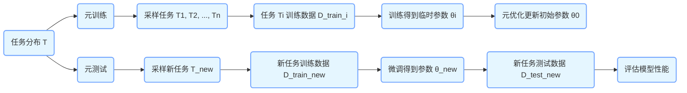

# 元学习框架在快速推理任务适应中的应用

> 关键词：元学习框架、快速推理、任务适应、机器学习、人工智能、模型泛化、算法优化

> 摘要：本文聚焦于元学习框架在快速推理任务适应中的应用。随着人工智能和机器学习领域的不断发展，对模型快速适应新任务的能力需求日益增长。元学习框架为解决这一问题提供了有效的途径。文章首先介绍了元学习框架的背景知识，包括其目的、预期读者等；接着阐述了核心概念与联系，给出了原理和架构的示意图与流程图；详细讲解了核心算法原理和具体操作步骤，并使用Python代码进行说明；探讨了相关的数学模型和公式；通过项目实战展示了代码实际案例及详细解释；分析了实际应用场景；推荐了相关的工具和资源；最后总结了未来发展趋势与挑战，提供了常见问题与解答以及扩展阅读和参考资料，旨在全面深入地探讨元学习框架在快速推理任务适应中的关键作用和应用价值。

## 1. 背景介绍 
### 1.1 目的和范围
在传统的机器学习中，模型通常是针对特定的任务进行训练，当面临新的任务时，往往需要重新收集大量数据并进行长时间的训练。然而，在许多实际应用场景中，如实时决策、智能机器人等，需要模型能够快速适应新的任务，进行快速推理。元学习框架的出现为解决这一问题提供了新的思路。本文的目的在于深入探讨元学习框架在快速推理任务适应中的应用，包括其原理、算法、实际案例等方面。范围涵盖了元学习的基本概念、核心算法、数学模型，以及在不同领域的实际应用等内容。

### 1.2 预期读者
本文预期读者包括对人工智能、机器学习领域有一定了解的科研人员、工程师、学生等。对于希望深入研究元学习技术，尤其是关注模型快速适应新任务能力的人员具有较高的参考价值。也适合对快速推理和任务适应相关应用感兴趣，希望了解元学习框架在其中作用的从业者。

### 1.3 文档结构概述
本文将按照以下结构进行阐述：首先介绍元学习框架的背景知识，包括目的、预期读者等；接着详细讲解元学习的核心概念与联系，通过文本示意图和Mermaid流程图进行展示；阐述核心算法原理和具体操作步骤，使用Python代码进行说明；探讨相关的数学模型和公式；通过项目实战展示代码实际案例及详细解释；分析元学习框架在快速推理任务适应中的实际应用场景；推荐相关的工具和资源；最后总结未来发展趋势与挑战，提供常见问题与解答以及扩展阅读和参考资料。

### 1.4 术语表
#### 1.4.1 核心术语定义
- **元学习（Meta - Learning）**：也称为“学习如何学习”，旨在让模型能够从多个任务中学习到通用的知识和技能，从而在面对新任务时能够快速适应。
- **快速推理（Fast Inference）**：指模型在短时间内对输入数据进行处理并输出结果的能力，强调推理的速度。
- **任务适应（Task Adaptation）**：模型在面对新任务时，能够调整自身的参数或结构，以达到较好的性能表现。
- **元训练（Meta - Training）**：在元学习中，使用多个任务对模型进行训练，以学习到通用的知识和技能。
- **元测试（Meta - Testing）**：在元训练之后，使用新的任务对模型进行测试，评估其快速适应新任务的能力。

#### 1.4.2 相关概念解释
- **模型泛化（Model Generalization）**：模型在训练数据之外的新数据上能够保持较好的性能表现。元学习通过学习通用的知识，有助于提高模型的泛化能力，从而更好地适应新任务。
- **少样本学习（Few - Shot Learning）**：是元学习的一个重要应用场景，指在只有少量样本的情况下，模型能够快速学习并完成任务。这与快速推理任务适应密切相关，因为在实际应用中，新任务可能只有少量的数据可用。

#### 1.4.3 缩略词列表
- **MAML（Model - Agnostic Meta - Learning）**：与模型无关的元学习算法。
- **FOMAML（First - Order Model - Agnostic Meta - Learning）**：MAML的一阶近似算法。

## 2. 核心概念与联系 

### 元学习框架的核心概念
元学习的核心思想是让模型学习到如何学习，即从多个任务中提取通用的知识和技能，以便在面对新任务时能够快速调整和适应。元学习框架通常包括元训练和元测试两个阶段。

在元训练阶段，模型会在多个不同的任务上进行训练，这些任务可以是来自不同领域、不同类型的任务。通过在这些任务上的学习，模型能够学习到一些通用的特征和模式，例如如何快速调整模型的参数以适应新的任务。

在元测试阶段，模型会面对一个新的任务。由于在元训练阶段已经学习到了通用的知识，模型可以利用这些知识快速地适应新任务，进行快速推理。

### 核心概念原理和架构的文本示意图
元学习框架的原理和架构可以用以下文本示意图来描述：

- **任务分布**：存在一个任务分布 $\mathcal{T}$，其中包含多个不同的任务 $T_i$。每个任务 $T_i$ 都有自己的训练数据 $D_{train}^i$ 和测试数据 $D_{test}^i$。
- **元训练**：从任务分布 $\mathcal{T}$ 中采样多个任务 $T_1, T_2, \cdots, T_n$。对于每个任务 $T_i$，使用其训练数据 $D_{train}^i$ 对模型进行训练，得到一个临时的模型参数 $\theta_i$。然后，根据这些临时的模型参数，通过元优化算法更新模型的初始参数 $\theta_0$。
- **元测试**：从任务分布 $\mathcal{T}$ 中采样一个新的任务 $T_{new}$。使用新任务的少量训练数据 $D_{train}^{new}$ 对模型进行微调，得到适应新任务的模型参数 $\theta_{new}$。最后，使用新任务的测试数据 $D_{test}^{new}$ 对模型进行测试，评估其性能。

### Mermaid 流程图


## 3. 核心算法原理 & 具体操作步骤 

### MAML 算法原理
MAML（Model - Agnostic Meta - Learning）是一种经典的元学习算法，其核心思想是找到一个初始的模型参数，使得模型在经过少量的梯度更新后，能够在新任务上取得较好的性能。

MAML 算法的具体步骤如下：

1. **初始化模型参数 $\theta$**：随机初始化模型的参数 $\theta$。
2. **元训练循环**：
    - **采样任务**：从任务分布 $\mathcal{T}$ 中采样 $N$ 个任务 $T_1, T_2, \cdots, T_N$。
    - **内部循环（任务特定训练）**：对于每个任务 $T_i$，使用其训练数据 $D_{train}^i$ 对模型进行一次或多次梯度更新，得到临时的模型参数 $\theta_i'$。
    - **外部循环（元更新）**：根据所有任务的临时模型参数 $\theta_1', \theta_2', \cdots, \theta_N'$，计算元损失 $\mathcal{L}_{meta}$，并使用元损失对初始模型参数 $\theta$ 进行更新。
3. **元测试**：
    - **采样新任务**：从任务分布 $\mathcal{T}$ 中采样一个新的任务 $T_{new}$。
    - **微调模型**：使用新任务的少量训练数据 $D_{train}^{new}$ 对模型进行少量的梯度更新，得到适应新任务的模型参数 $\theta_{new}$。
    - **测试模型**：使用新任务的测试数据 $D_{test}^{new}$ 对模型进行测试，评估其性能。

### Python 代码实现
```python
import torch
import torch.nn as nn
import torch.optim as optim

# 定义一个简单的神经网络模型
class SimpleNet(nn.Module):
    def __init__(self, input_size, hidden_size, output_size):
        super(SimpleNet, self).__init__()
        self.fc1 = nn.Linear(input_size, hidden_size)
        self.relu = nn.ReLU()
        self.fc2 = nn.Linear(hidden_size, output_size)

    def forward(self, x):
        out = self.fc1(x)
        out = self.relu(out)
        out = self.fc2(out)
        return out

# MAML 算法实现
def maml(meta_lr, inner_lr, num_meta_steps, num_inner_steps, task_distribution):
    # 初始化模型参数
    input_size = 10
    hidden_size = 20
    output_size = 2
    model = SimpleNet(input_size, hidden_size, output_size)
    meta_optimizer = optim.Adam(model.parameters(), lr=meta_lr)

    for meta_step in range(num_meta_steps):
        meta_loss = 0
        # 采样任务
        tasks = task_distribution.sample_tasks(num_tasks=5)

        for task in tasks:
            # 内部循环（任务特定训练）
            fast_weights = model.state_dict()
            for inner_step in range(num_inner_steps):
                train_data, train_labels = task.get_train_data()
                logits = model.forward(train_data)
                loss = nn.CrossEntropyLoss()(logits, train_labels)
                grads = torch.autograd.grad(loss, model.parameters())
                fast_weights = {name: param - inner_lr * grad for name, param, grad in zip(fast_weights.keys(), fast_weights.values(), grads)}

            # 计算元损失
            test_data, test_labels = task.get_test_data()
            logits = model.forward(test_data)
            meta_loss += nn.CrossEntropyLoss()(logits, test_labels)

        # 外部循环（元更新）
        meta_optimizer.zero_grad()
        meta_loss.backward()
        meta_optimizer.step()

    return model
```

### 具体操作步骤解释
1. **初始化模型和优化器**：使用 `SimpleNet` 定义一个简单的神经网络模型，并使用 Adam 优化器进行元优化。
2. **元训练循环**：在每个元训练步骤中，首先从任务分布中采样多个任务。对于每个任务，进行内部循环的任务特定训练，使用梯度更新得到临时的模型参数。然后，计算元损失，即所有任务在测试数据上的损失之和。最后，使用元损失对初始模型参数进行更新。
3. **返回训练好的模型**：经过多个元训练步骤后，返回训练好的模型。

## 4. 数学模型和公式 & 详细讲解 & 举例说明 

### MAML 算法的数学模型
MAML 算法的目标是找到一个初始的模型参数 $\theta$，使得模型在经过少量的梯度更新后，能够在新任务上取得较好的性能。

#### 内部循环（任务特定训练）
对于一个任务 $T_i$，其训练数据为 $D_{train}^i = \{(x_j^i, y_j^i)\}_{j = 1}^{m_i}$，其中 $x_j^i$ 是输入数据，$y_j^i$ 是对应的标签。模型的损失函数为 $\mathcal{L}(\theta, D_{train}^i)$。

在内部循环中，使用梯度下降法对模型参数进行一次或多次更新：
$$\theta_i' = \theta - \alpha \nabla_{\theta} \mathcal{L}(\theta, D_{train}^i)$$
其中，$\alpha$ 是内部学习率。

#### 外部循环（元更新）
元损失是所有任务在测试数据上的损失之和：
$$\mathcal{L}_{meta}(\theta) = \sum_{i = 1}^{N} \mathcal{L}(\theta_i', D_{test}^i)$$
其中，$N$ 是采样的任务数量，$D_{test}^i$ 是任务 $T_i$ 的测试数据。

使用元损失对初始模型参数 $\theta$ 进行更新：
$$\theta \leftarrow \theta - \beta \nabla_{\theta} \mathcal{L}_{meta}(\theta)$$
其中，$\beta$ 是元学习率。

### 详细讲解
- **内部循环**：内部循环的目的是让模型在每个任务上进行快速适应。通过一次或多次的梯度更新，得到一个临时的模型参数 $\theta_i'$，这个参数能够更好地适应任务 $T_i$。
- **外部循环**：外部循环的目的是更新初始模型参数 $\theta$，使得模型在经过内部循环的更新后，能够在多个任务的测试数据上取得较好的性能。元损失 $\mathcal{L}_{meta}(\theta)$ 衡量了模型在多个任务上的泛化能力。

### 举例说明
假设我们有一个简单的分类任务，输入数据是二维向量，输出是两个类别。任务分布包含 10 个不同的分类任务。

- **初始化**：随机初始化模型参数 $\theta$。
- **元训练**：
    - 采样 5 个任务 $T_1, T_2, T_3, T_4, T_5$。
    - 对于每个任务 $T_i$，使用其训练数据进行内部循环的梯度更新，得到临时的模型参数 $\theta_i'$。
    - 计算元损失 $\mathcal{L}_{meta}(\theta) = \sum_{i = 1}^{5} \mathcal{L}(\theta_i', D_{test}^i)$。
    - 使用元损失对初始模型参数 $\theta$ 进行更新。
- **元测试**：
    - 采样一个新的任务 $T_{new}$。
    - 使用新任务的少量训练数据对模型进行微调，得到适应新任务的模型参数 $\theta_{new}$。
    - 使用新任务的测试数据对模型进行测试，评估其性能。

## 5. 项目实战：代码实际案例和详细解释说明 

### 5.1  开发环境搭建
#### 操作系统
可以选择 Linux（如 Ubuntu）、Windows 或 macOS 作为开发环境的操作系统。

#### 编程语言和库
- **Python**：建议使用 Python 3.7 及以上版本。
- **PyTorch**：深度学习框架，用于构建和训练神经网络模型。可以使用以下命令安装：
```bash
pip install torch torchvision
```
- **NumPy**：用于数值计算。可以使用以下命令安装：
```bash
pip install numpy
```
- **Matplotlib**：用于数据可视化。可以使用以下命令安装：
```bash
pip install matplotlib
```

### 5.2  源代码详细实现和代码解读
```python
import torch
import torch.nn as nn
import torch.optim as optim
import numpy as np
import matplotlib.pyplot as plt

# 定义一个简单的神经网络模型
class SimpleNet(nn.Module):
    def __init__(self, input_size, hidden_size, output_size):
        super(SimpleNet, self).__init__()
        self.fc1 = nn.Linear(input_size, hidden_size)
        self.relu = nn.ReLU()
        self.fc2 = nn.Linear(hidden_size, output_size)

    def forward(self, x):
        out = self.fc1(x)
        out = self.relu(out)
        out = self.fc2(out)
        return out

# 定义任务分布类
class TaskDistribution:
    def __init__(self, num_tasks, input_size, output_size):
        self.num_tasks = num_tasks
        self.input_size = input_size
        self.output_size = output_size
        self.tasks = []
        for _ in range(num_tasks):
            # 生成随机的权重和偏置
            weights = torch.randn(input_size, output_size)
            bias = torch.randn(output_size)
            self.tasks.append((weights, bias))

    def sample_tasks(self, num_tasks):
        indices = np.random.choice(self.num_tasks, num_tasks)
        sampled_tasks = []
        for index in indices:
            weights, bias = self.tasks[index]
            def generate_data(num_samples):
                x = torch.randn(num_samples, self.input_size)
                y = torch.matmul(x, weights) + bias
                y = torch.argmax(y, dim=1)
                return x, y
            sampled_tasks.append(generate_data)
        return sampled_tasks

# MAML 算法实现
def maml(meta_lr, inner_lr, num_meta_steps, num_inner_steps, task_distribution):
    # 初始化模型参数
    input_size = 10
    hidden_size = 20
    output_size = 2
    model = SimpleNet(input_size, hidden_size, output_size)
    meta_optimizer = optim.Adam(model.parameters(), lr=meta_lr)

    meta_losses = []
    for meta_step in range(num_meta_steps):
        meta_loss = 0
        # 采样任务
        tasks = task_distribution.sample_tasks(num_tasks=5)

        for task in tasks:
            # 内部循环（任务特定训练）
            fast_weights = model.state_dict()
            for inner_step in range(num_inner_steps):
                train_data, train_labels = task(10)
                logits = model.forward(train_data)
                loss = nn.CrossEntropyLoss()(logits, train_labels)
                grads = torch.autograd.grad(loss, model.parameters())
                fast_weights = {name: param - inner_lr * grad for name, param, grad in zip(fast_weights.keys(), fast_weights.values(), grads)}

            # 计算元损失
            test_data, test_labels = task(10)
            temp_model = SimpleNet(input_size, hidden_size, output_size)
            temp_model.load_state_dict(fast_weights)
            logits = temp_model.forward(test_data)
            meta_loss += nn.CrossEntropyLoss()(logits, test_labels)

        # 外部循环（元更新）
        meta_optimizer.zero_grad()
        meta_loss.backward()
        meta_optimizer.step()

        meta_losses.append(meta_loss.item())

    # 绘制元损失曲线
    plt.plot(meta_losses)
    plt.xlabel('Meta Step')
    plt.ylabel('Meta Loss')
    plt.title('Meta Loss over Meta Steps')
    plt.show()

    return model

# 主函数
if __name__ == '__main__':
    meta_lr = 0.001
    inner_lr = 0.01
    num_meta_steps = 100
    num_inner_steps = 3
    input_size = 10
    output_size = 2
    num_tasks = 20

    task_distribution = TaskDistribution(num_tasks, input_size, output_size)
    model = maml(meta_lr, inner_lr, num_meta_steps, num_inner_steps, task_distribution)
```

### 5.3  代码解读与分析
#### 模型定义
`SimpleNet` 类定义了一个简单的两层神经网络模型，包含一个全连接层、一个 ReLU 激活函数和另一个全连接层。

#### 任务分布类
`TaskDistribution` 类用于生成任务分布。每个任务由一个随机的权重矩阵和偏置向量定义，通过 `generate_data` 函数生成训练数据和测试数据。

#### MAML 算法实现
`maml` 函数实现了 MAML 算法的核心逻辑。在每个元训练步骤中，首先从任务分布中采样多个任务。对于每个任务，进行内部循环的任务特定训练，使用梯度更新得到临时的模型参数。然后，计算元损失，即所有任务在测试数据上的损失之和。最后，使用元损失对初始模型参数进行更新。

#### 元损失曲线绘制
在训练过程中，记录每个元训练步骤的元损失，并使用 Matplotlib 绘制元损失曲线。通过观察元损失曲线，可以了解模型的训练过程和收敛情况。

#### 主函数
在主函数中，设置了元学习率、内部学习率、元训练步骤数、内部训练步骤数等参数，创建了任务分布对象，并调用 `maml` 函数进行训练。

## 6. 实际应用场景 
### 少样本学习
在许多实际应用中，新任务可能只有少量的样本数据。元学习框架可以在少样本的情况下，快速学习并适应新任务。例如，在图像识别领域，当出现新的类别时，可能只有少量的图像样本。使用元学习框架，可以快速训练一个模型来识别这些新的类别。

### 智能机器人
智能机器人需要在不同的环境中执行各种任务。元学习框架可以帮助机器人快速适应新的任务和环境。例如，当机器人从一个室内环境转移到室外环境时，或者需要执行一个新的任务时，元学习框架可以让机器人快速调整自己的行为和策略。

### 医疗诊断
在医疗诊断中，新的疾病或症状可能会不断出现。元学习框架可以帮助医生快速学习和诊断这些新的疾病。例如，当出现一种新的病毒感染时，医生可以使用元学习框架，结合已有的医学知识和少量的病例数据，快速建立一个诊断模型。

### 金融风险预测
金融市场变化快速，新的风险因素可能会不断出现。元学习框架可以帮助金融机构快速适应这些变化，进行风险预测。例如，当出现新的经济政策或市场事件时，元学习框架可以让金融机构快速调整风险预测模型，以应对新的风险。

## 7. 工具和资源推荐
### 7.1 学习资源推荐
#### 7.1.1 书籍推荐
- 《Deep Learning》（Ian Goodfellow、Yoshua Bengio 和 Aaron Courville 著）：深度学习领域的经典书籍，介绍了深度学习的基本原理和算法，对理解元学习有很大的帮助。
- 《Reinforcement Learning: An Introduction》（Richard S. Sutton 和 Andrew G. Barto 著）：强化学习领域的经典书籍，强化学习与元学习有一定的关联，阅读这本书可以拓宽对学习算法的理解。

#### 7.1.2 在线课程
- Coursera 上的 “Deep Learning Specialization”：由 Andrew Ng 教授授课，全面介绍了深度学习的各个方面，包括元学习的相关内容。
- edX 上的 “Artificial Intelligence: Principles and Techniques”：该课程涵盖了人工智能的基本原理和技术，对元学习的原理和应用有深入的讲解。

#### 7.1.3 技术博客和网站
- Medium 上的 Towards Data Science：有许多关于人工智能和机器学习的技术文章，包括元学习的最新研究成果和应用案例。
- arXiv.org：是一个预印本服务器，提供了大量的学术论文，包括元学习领域的最新研究。

### 7.2 开发工具框架推荐
#### 7.2.1 IDE和编辑器
- PyCharm：是一款专门为 Python 开发设计的集成开发环境，提供了丰富的代码编辑、调试和分析功能。
- Jupyter Notebook：是一个交互式的开发环境，适合进行数据探索和模型实验。

#### 7.2.2 调试和性能分析工具
- TensorBoard：是 TensorFlow 提供的一个可视化工具，可以用于可视化模型的训练过程、损失曲线等。
- PyTorch Profiler：是 PyTorch 提供的性能分析工具，可以帮助开发者分析模型的性能瓶颈。

#### 7.2.3 相关框架和库
- PyTorch：是一个开源的深度学习框架，提供了丰富的神经网络层和优化算法，方便开发者实现元学习算法。
- scikit - learn：是一个机器学习库，提供了许多常用的机器学习算法和工具，可用于数据预处理和模型评估。

### 7.3 相关论文著作推荐
#### 7.3.1 经典论文
- “Model - Agnostic Meta - Learning for Fast Adaptation of Deep Networks”（Chelsea Finn、Pieter Abbeel 和 Sergey Levine 著）：介绍了 MAML 算法，是元学习领域的经典论文。
- “Learning to Learn by Gradient Descent by Gradient Descent”（Marcin Andrychowicz、Misha Denil、Bharath Neyshabur 等著）：提出了通过梯度下降来学习如何学习的方法。

#### 7.3.2 最新研究成果
- 在 arXiv.org 上搜索 “Meta Learning” 可以找到元学习领域的最新研究成果。
- 参加机器学习领域的顶级会议，如 NeurIPS、ICML 等，可以了解元学习的最新研究动态。

#### 7.3.3 应用案例分析
- 在相关的学术期刊和会议论文集中，可以找到元学习在不同领域的应用案例分析，如医疗、金融、机器人等领域。

## 8. 总结：未来发展趋势与挑战
### 未来发展趋势
- **与其他技术的融合**：元学习将与强化学习、迁移学习等技术进一步融合，以提高模型的学习能力和适应能力。例如，将元学习与强化学习相结合，可以让智能体在不同的环境中快速学习最优策略。
- **应用领域的拓展**：元学习将在更多的领域得到应用，如自动驾驶、智能家居、生物信息学等。随着这些领域的发展，对模型快速适应新任务的能力需求将不断增加，元学习将发挥重要作用。
- **理论研究的深入**：未来将对元学习的理论基础进行更深入的研究，如元学习的泛化理论、收敛性分析等。这将有助于更好地理解元学习的原理和性能，为元学习算法的设计和优化提供理论支持。

### 挑战
- **计算资源的需求**：元学习算法通常需要大量的计算资源，尤其是在处理大规模任务分布和复杂模型时。如何在有限的计算资源下提高元学习算法的效率是一个挑战。
- **数据的质量和数量**：元学习的性能依赖于任务分布的质量和数量。如何获取高质量、多样化的任务数据，以及如何在数据有限的情况下提高元学习的性能是需要解决的问题。
- **模型的可解释性**：元学习模型通常比较复杂，其决策过程难以解释。如何提高元学习模型的可解释性，让用户更好地理解模型的决策依据，是元学习领域面临的一个重要挑战。

## 9. 附录：常见问题与解答
### 1. 元学习与传统机器学习有什么区别？
传统机器学习通常是针对特定的任务进行训练，当面临新的任务时，需要重新收集大量数据并进行长时间的训练。而元学习的目标是让模型学习到如何学习，从多个任务中提取通用的知识和技能，从而在面对新任务时能够快速适应，不需要大量的数据和长时间的训练。

### 2. MAML 算法的复杂度如何？
MAML 算法的复杂度主要取决于内部循环和外部循环的次数、任务的数量和模型的复杂度。在内部循环中，需要对每个任务进行多次梯度更新，计算量较大。在外部循环中，需要计算元损失并更新初始模型参数。因此，MAML 算法的复杂度较高，尤其是在处理大规模任务分布和复杂模型时。

### 3. 元学习在少样本学习中的效果如何？
元学习在少样本学习中具有较好的效果。通过从多个任务中学习到通用的知识和技能，元学习模型可以在只有少量样本的情况下，快速学习并适应新任务。许多实验结果表明，元学习算法在少样本学习任务上的性能优于传统的机器学习算法。

### 4. 如何选择元学习的超参数？
元学习的超参数包括元学习率、内部学习率、元训练步骤数、内部训练步骤数等。通常可以使用网格搜索、随机搜索等方法来选择合适的超参数。也可以根据经验和实验结果进行调整。

## 10. 扩展阅读 & 参考资料
### 扩展阅读
- “Meta - Learning in Neural Networks: A Survey”：对元学习在神经网络中的应用进行了全面的综述，介绍了元学习的各种算法和应用场景。
- “Few - Shot Learning: A Review”：专门讨论了少样本学习的相关问题，包括少样本学习的算法、数据集和应用等。

### 参考资料
- Finn, C., Abbeel, P., & Levine, S. (2017). Model - Agnostic Meta - Learning for Fast Adaptation of Deep Networks. Proceedings of the 34th International Conference on Machine Learning - Volume 70.
- Andrychowicz, M., Denil, M., Gomez, S., Hoffman, M. W., Pfau, D., Schaul, T., & de Freitas, N. (2016). Learning to Learn by Gradient Descent by Gradient Descent. Advances in Neural Information Processing Systems.