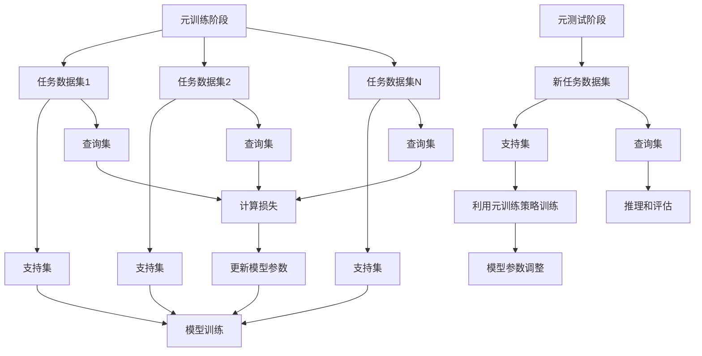

# 元学习驱动的快速推理模型适应技术研究

> 关键词：元学习、快速推理、模型适应、人工智能、机器学习、深度神经网络、自适应算法

> 摘要：本文围绕元学习驱动的快速推理模型适应技术展开深入研究。首先介绍了该技术的背景和相关概念，包括其目的、预期读者、文档结构和重要术语。接着阐述了核心概念与联系，通过文本示意图和 Mermaid 流程图进行清晰展示。详细讲解了核心算法原理，并给出 Python 源代码示例。深入探讨了相关数学模型和公式，并结合实例进行说明。通过项目实战，从开发环境搭建、源代码实现到代码解读进行全面分析。列举了该技术的实际应用场景，推荐了学习资源、开发工具框架以及相关论文著作。最后总结了未来发展趋势与挑战，还提供了常见问题解答和扩展阅读参考资料，旨在为读者全面呈现元学习驱动的快速推理模型适应技术的全貌，推动该领域的研究与应用发展。

## 1. 背景介绍 
### 1.1 目的和范围
在当今的人工智能和机器学习领域，模型的泛化能力和快速适应新环境的能力是至关重要的。传统的机器学习模型往往需要大量的数据和长时间的训练才能在特定任务上取得较好的效果。然而，在许多实际应用场景中，如自动驾驶、医疗诊断、智能机器人等，数据是动态变化的，并且需要模型能够快速适应新的数据分布和任务需求。元学习驱动的快速推理模型适应技术旨在解决这些问题，通过学习如何快速学习，使模型能够在少量数据和短时间内快速调整以适应新的任务。

本研究的范围涵盖了元学习的基本概念、核心算法、数学模型，以及该技术在不同领域的实际应用。通过理论分析和实验验证，探索元学习驱动的快速推理模型适应技术的有效性和可行性。

### 1.2 预期读者
本文的预期读者包括人工智能、机器学习领域的研究人员、工程师、研究生等。对于对元学习和快速推理模型适应技术感兴趣的初学者，也可以通过本文了解该领域的基本概念和核心技术。同时，对于从事实际应用开发的工程师，本文提供的项目实战和应用场景分析可以为他们的工作提供参考和借鉴。

### 1.3 文档结构概述
本文的文档结构如下：
- 核心概念与联系：介绍元学习、快速推理和模型适应的核心概念，以及它们之间的联系，并通过文本示意图和 Mermaid 流程图进行可视化展示。
- 核心算法原理 & 具体操作步骤：详细讲解元学习的核心算法原理，如模型无关元学习（MAML），并给出 Python 源代码示例。
- 数学模型和公式 & 详细讲解 & 举例说明：介绍元学习的数学模型和相关公式，并结合实例进行详细讲解。
- 项目实战：代码实际案例和详细解释说明：通过一个具体的项目实战，从开发环境搭建、源代码实现到代码解读进行全面分析。
- 实际应用场景：列举元学习驱动的快速推理模型适应技术在不同领域的实际应用场景。
- 工具和资源推荐：推荐学习资源、开发工具框架以及相关论文著作。
- 总结：未来发展趋势与挑战：总结元学习驱动的快速推理模型适应技术的未来发展趋势和面临的挑战。
- 附录：常见问题与解答：提供常见问题的解答。
- 扩展阅读 & 参考资料：提供扩展阅读的建议和参考资料。

### 1.4 术语表
#### 1.4.1 核心术语定义
- **元学习（Meta - Learning）**：也称为“学习如何学习”，是一种让模型从多个任务中学习通用知识和学习策略，以便能够快速适应新任务的机器学习方法。
- **快速推理（Fast Inference）**：指模型在新任务上能够快速进行预测和决策，减少推理时间和计算资源的消耗。
- **模型适应（Model Adaptation）**：模型根据新的数据分布和任务需求，调整自身参数或结构，以提高在新任务上的性能。
- **元训练（Meta - Training）**：在元学习中，使用多个任务的数据集对模型进行训练，学习通用的学习策略。
- **元测试（Meta - Testing）**：在元学习中，使用新的任务数据集对经过元训练的模型进行测试，评估模型的快速适应能力。

#### 1.4.2 相关概念解释
- **任务（Task）**：在机器学习中，任务是指一个具体的学习问题，如分类、回归等。每个任务都有自己的数据集和目标。
- **支持集（Support Set）**：在元学习中，支持集是指用于模型快速适应的少量标注数据。
- **查询集（Query Set）**：在元学习中，查询集是指用于评估模型在新任务上性能的数据集。

#### 1.4.3 缩略词列表
- **MAML**：Model - Agnostic Meta - Learning（模型无关元学习）
- **ML**：Machine Learning（机器学习）
- **AI**：Artificial Intelligence（人工智能）

## 2. 核心概念与联系 
### 核心概念原理
#### 元学习
元学习的核心思想是学习如何学习。传统的机器学习方法通常是在一个固定的数据集上进行训练，而元学习则是在多个不同的任务数据集上进行训练，学习到的是一种通用的学习策略。这种学习策略可以帮助模型在面对新的任务时，能够快速地利用少量的数据进行调整和适应。

例如，在图像分类任务中，元学习模型可以从多个不同的图像分类任务中学习到图像特征的通用表示和分类策略。当遇到一个新的图像分类任务时，模型可以利用这些通用知识，快速地在新任务的少量数据上进行微调，从而提高分类性能。

#### 快速推理
快速推理的目标是在保证模型预测准确性的前提下，尽可能地减少推理时间和计算资源的消耗。在实际应用中，特别是一些对实时性要求较高的场景，如自动驾驶、智能监控等，快速推理能力至关重要。

为了实现快速推理，可以采用多种技术，如模型压缩、硬件加速等。在元学习驱动的快速推理模型适应技术中，通过学习到的通用学习策略，模型可以在新任务上快速调整参数，减少训练时间，从而间接提高推理速度。

#### 模型适应
模型适应是指模型根据新的数据分布和任务需求，调整自身参数或结构，以提高在新任务上的性能。在元学习中，模型适应主要通过在支持集上进行少量的训练步骤来实现。通过在支持集上的训练，模型可以快速地适应新任务的特征和分布，从而在查询集上取得较好的性能。

### 架构的文本示意图
元学习驱动的快速推理模型适应技术的架构主要包括元训练阶段和元测试阶段。

在元训练阶段，模型在多个不同的任务数据集上进行训练，学习通用的学习策略。具体来说，每个任务数据集被划分为支持集和查询集。模型首先在支持集上进行少量的训练步骤，然后在查询集上计算损失，通过优化损失函数来更新模型的参数。这个过程不断重复，直到模型学习到通用的学习策略。

在元测试阶段，模型遇到一个新的任务。新任务的数据集同样被划分为支持集和查询集。模型利用在元训练阶段学习到的通用学习策略，在支持集上进行少量的训练步骤，快速调整自身参数，然后在查询集上进行推理和评估。

### Mermaid 流程图


## 3. 核心算法原理 & 具体操作步骤 
### 核心算法原理：模型无关元学习（MAML）
模型无关元学习（MAML）是一种经典的元学习算法，其核心思想是找到一组初始参数，使得模型在经过少量的梯度更新步骤后，能够在新任务上取得较好的性能。

具体来说，MAML 的目标是找到一个初始参数 $\theta$，使得对于任意的任务 $T$，在支持集 $S_T$ 上进行 $K$ 步梯度更新后，模型在查询集 $Q_T$ 上的损失最小。

### Python 源代码示例
```python
import torch
import torch.nn as nn
import torch.optim as optim

# 定义一个简单的神经网络模型
class SimpleNet(nn.Module):
    def __init__(self, input_size, hidden_size, output_size):
        super(SimpleNet, self).__init__()
        self.fc1 = nn.Linear(input_size, hidden_size)
        self.relu = nn.ReLU()
        self.fc2 = nn.Linear(hidden_size, output_size)

    def forward(self, x):
        out = self.fc1(x)
        out = self.relu(out)
        out = self.fc2(out)
        return out

# 定义 MAML 算法的实现
def maml(model, tasks, num_inner_steps, inner_lr, outer_lr, num_epochs):
    meta_optimizer = optim.Adam(model.parameters(), lr=outer_lr)

    for epoch in range(num_epochs):
        meta_loss = 0
        for task in tasks:
            support_x, support_y, query_x, query_y = task

            # 保存原始参数
            original_params = [p.clone() for p in model.parameters()]

            # 内循环：在支持集上进行梯度更新
            inner_optimizer = optim.SGD(model.parameters(), lr=inner_lr)
            for _ in range(num_inner_steps):
                inner_loss = nn.CrossEntropyLoss()(model(support_x), support_y)
                inner_optimizer.zero_grad()
                inner_loss.backward()
                inner_optimizer.step()

            # 计算查询集上的损失
            query_loss = nn.CrossEntropyLoss()(model(query_x), query_y)
            meta_loss += query_loss

            # 恢复原始参数
            for p, original_p in zip(model.parameters(), original_params):
                p.data = original_p.data

        # 外循环：更新元参数
        meta_optimizer.zero_grad()
        meta_loss.backward()
        meta_optimizer.step()

        if (epoch + 1) % 10 == 0:
            print(f'Epoch {epoch + 1}, Meta Loss: {meta_loss.item()}')

    return model
```
### 具体操作步骤
1. **数据准备**：将数据集划分为多个任务，每个任务包含支持集和查询集。
2. **模型初始化**：初始化一个神经网络模型，如上述示例中的 `SimpleNet`。
3. **元训练**：使用 MAML 算法进行元训练，通过多个任务的训练，学习通用的学习策略。
4. **元测试**：在新的任务上进行测试，利用元训练阶段学习到的策略，在支持集上进行少量的训练步骤，然后在查询集上进行推理和评估。

## 4. 数学模型和公式 & 详细讲解 & 举例说明 
### 数学模型
MAML 的数学模型可以表示为以下优化问题：

$$\min_{\theta} \sum_{T \in \mathcal{T}} \mathcal{L}_{Q_T} \left( \theta - \alpha \nabla_{\theta} \mathcal{L}_{S_T}(\theta) \right)$$

其中：
- $\theta$ 是模型的初始参数。
- $\mathcal{T}$ 是任务的集合。
- $\mathcal{L}_{S_T}(\theta)$ 是模型在任务 $T$ 的支持集 $S_T$ 上的损失函数。
- $\mathcal{L}_{Q_T}(\cdot)$ 是模型在任务 $T$ 的查询集 $Q_T$ 上的损失函数。
- $\alpha$ 是内循环的学习率。

### 详细讲解
上述公式的含义是，我们的目标是找到一组初始参数 $\theta$，使得对于每个任务 $T$，在支持集 $S_T$ 上进行一次梯度更新（学习率为 $\alpha$）后，模型在查询集 $Q_T$ 上的损失最小。

具体来说，算法分为内循环和外循环两个步骤：
- **内循环**：对于每个任务 $T$，在支持集 $S_T$ 上计算损失 $\mathcal{L}_{S_T}(\theta)$，并进行一次梯度更新，得到新的参数 $\theta' = \theta - \alpha \nabla_{\theta} \mathcal{L}_{S_T}(\theta)$。
- **外循环**：对于所有任务，计算在查询集 $Q_T$ 上的损失 $\mathcal{L}_{Q_T}(\theta')$，并将这些损失求和，得到元损失。通过优化元损失，更新初始参数 $\theta$。

### 举例说明
假设我们有两个任务 $T_1$ 和 $T_2$，每个任务的支持集和查询集分别为 $S_{T_1}, Q_{T_1}$ 和 $S_{T_2}, Q_{T_2}$。

首先，我们有一个初始参数 $\theta$。对于任务 $T_1$，在支持集 $S_{T_1}$ 上计算损失 $\mathcal{L}_{S_{T_1}}(\theta)$，并进行一次梯度更新，得到 $\theta_1' = \theta - \alpha \nabla_{\theta} \mathcal{L}_{S_{T_1}}(\theta)$。然后，在查询集 $Q_{T_1}$ 上计算损失 $\mathcal{L}_{Q_{T_1}}(\theta_1')$。

同样地，对于任务 $T_2$，在支持集 $S_{T_2}$ 上计算损失 $\mathcal{L}_{S_{T_2}}(\theta)$，并进行一次梯度更新，得到 $\theta_2' = \theta - \alpha \nabla_{\theta} \mathcal{L}_{S_{T_2}}(\theta)$。然后，在查询集 $Q_{T_2}$ 上计算损失 $\mathcal{L}_{Q_{T_2}}(\theta_2')$。

最后，将两个任务在查询集上的损失求和，得到元损失 $\mathcal{L} = \mathcal{L}_{Q_{T_1}}(\theta_1') + \mathcal{L}_{Q_{T_2}}(\theta_2')$。通过优化这个元损失，更新初始参数 $\theta$。

## 5. 项目实战：代码实际案例和详细解释说明 
### 5.1  开发环境搭建
#### 安装 Python
首先，确保你已经安装了 Python 3.x 版本。可以从 Python 官方网站（https://www.python.org/downloads/） 下载并安装。

#### 安装 PyTorch
PyTorch 是一个流行的深度学习框架，我们将使用它来实现元学习算法。可以根据自己的需求选择合适的安装方式，例如：
```sh
pip install torch torchvision
```

#### 安装其他依赖库
还需要安装一些其他的依赖库，如 `numpy`、`matplotlib` 等：
```sh
pip install numpy matplotlib
```

### 5.2  源代码详细实现和代码解读
```python
import torch
import torch.nn as nn
import torch.optim as optim
import numpy as np
import matplotlib.pyplot as plt

# 定义一个简单的神经网络模型
class SimpleNet(nn.Module):
    def __init__(self, input_size, hidden_size, output_size):
        super(SimpleNet, self).__init__()
        self.fc1 = nn.Linear(input_size, hidden_size)
        self.relu = nn.ReLU()
        self.fc2 = nn.Linear(hidden_size, output_size)

    def forward(self, x):
        out = self.fc1(x)
        out = self.relu(out)
        out = self.fc2(out)
        return out

# 生成任务数据
def generate_tasks(num_tasks, num_samples_per_task, input_size, num_classes):
    tasks = []
    for _ in range(num_tasks):
        x = torch.randn(num_samples_per_task, input_size)
        y = torch.randint(0, num_classes, (num_samples_per_task,))
        support_x = x[:num_samples_per_task // 2]
        support_y = y[:num_samples_per_task // 2]
        query_x = x[num_samples_per_task // 2:]
        query_y = y[num_samples_per_task // 2:]
        tasks.append((support_x, support_y, query_x, query_y))
    return tasks

# 定义 MAML 算法的实现
def maml(model, tasks, num_inner_steps, inner_lr, outer_lr, num_epochs):
    meta_optimizer = optim.Adam(model.parameters(), lr=outer_lr)

    meta_losses = []
    for epoch in range(num_epochs):
        meta_loss = 0
        for task in tasks:
            support_x, support_y, query_x, query_y = task

            # 保存原始参数
            original_params = [p.clone() for p in model.parameters()]

            # 内循环：在支持集上进行梯度更新
            inner_optimizer = optim.SGD(model.parameters(), lr=inner_lr)
            for _ in range(num_inner_steps):
                inner_loss = nn.CrossEntropyLoss()(model(support_x), support_y)
                inner_optimizer.zero_grad()
                inner_loss.backward()
                inner_optimizer.step()

            # 计算查询集上的损失
            query_loss = nn.CrossEntropyLoss()(model(query_x), query_y)
            meta_loss += query_loss

            # 恢复原始参数
            for p, original_p in zip(model.parameters(), original_params):
                p.data = original_p.data

        # 外循环：更新元参数
        meta_optimizer.zero_grad()
        meta_loss.backward()
        meta_optimizer.step()

        meta_losses.append(meta_loss.item())

        if (epoch + 1) % 10 == 0:
            print(f'Epoch {epoch + 1}, Meta Loss: {meta_loss.item()}')

    # 绘制元损失曲线
    plt.plot(meta_losses)
    plt.xlabel('Epoch')
    plt.ylabel('Meta Loss')
    plt.title('Meta Loss over Epochs')
    plt.show()

    return model

# 主函数
if __name__ == '__main__':
    input_size = 10
    hidden_size = 20
    output_size = 5
    num_tasks = 10
    num_samples_per_task = 20
    num_inner_steps = 3
    inner_lr = 0.01
    outer_lr = 0.001
    num_epochs = 100

    model = SimpleNet(input_size, hidden_size, output_size)
    tasks = generate_tasks(num_tasks, num_samples_per_task, input_size, output_size)
    trained_model = maml(model, tasks, num_inner_steps, inner_lr, outer_lr, num_epochs)
```

### 5.3  代码解读与分析
#### 数据生成部分
`generate_tasks` 函数用于生成任务数据。每个任务包含支持集和查询集，数据是随机生成的。

#### 模型定义部分
`SimpleNet` 类定义了一个简单的两层神经网络模型，包含一个全连接层、一个 ReLU 激活函数和另一个全连接层。

#### MAML 算法实现部分
`maml` 函数实现了 MAML 算法的核心逻辑。在每个 epoch 中，对于每个任务，先在支持集上进行内循环的梯度更新，然后在查询集上计算损失，最后更新元参数。同时，记录每个 epoch 的元损失，并绘制元损失曲线。

#### 主函数部分
在主函数中，设置了各种参数，包括输入大小、隐藏层大小、输出大小、任务数量等。然后生成任务数据，初始化模型，并调用 `maml` 函数进行元训练。

## 6. 实际应用场景 
### 医疗领域
在医疗诊断中，数据往往是动态变化的，不同的患者群体、不同的疾病类型都可能导致数据分布的差异。元学习驱动的快速推理模型适应技术可以帮助医疗模型快速适应新的患者数据和疾病特征。例如，在影像诊断中，当遇到新的疾病类型或不同的影像设备时，模型可以利用少量的标注数据快速调整，提高诊断的准确性。

### 自动驾驶领域
自动驾驶车辆需要在不同的环境和路况下行驶，数据分布会随着地理位置、天气条件等因素的变化而变化。元学习驱动的快速推理模型适应技术可以使自动驾驶模型快速适应新的环境，例如在不同的城市道路、高速公路或恶劣天气条件下，模型可以利用少量的实时数据进行快速调整，提高自动驾驶的安全性和可靠性。

### 智能机器人领域
智能机器人在不同的任务场景中需要执行不同的任务，如搬运、清洁、服务等。元学习驱动的快速推理模型适应技术可以使机器人快速适应新的任务需求，例如当机器人从一个任务场景转换到另一个任务场景时，模型可以利用少量的示范数据快速学习新的任务策略，提高机器人的灵活性和适应性。

### 金融领域
在金融领域，市场环境和客户需求是不断变化的。元学习驱动的快速推理模型适应技术可以帮助金融模型快速适应新的市场数据和客户需求。例如，在风险评估、投资决策等任务中，模型可以利用少量的实时数据快速调整，提高金融决策的准确性和及时性。

## 7. 工具和资源推荐
### 7.1 学习资源推荐
#### 7.1.1 书籍推荐
- 《Deep Learning》（Ian Goodfellow、Yoshua Bengio 和 Aaron Courville 著）：深度学习领域的经典教材，涵盖了深度学习的基本概念、算法和应用。
- 《Meta - Learning: A Survey》：全面介绍了元学习的基本概念、算法和应用，是学习元学习的重要参考书籍。

#### 7.1.2 在线课程
- Coursera 上的 “Deep Learning Specialization”：由 Andrew Ng 教授讲授，系统地介绍了深度学习的理论和实践。
- edX 上的 “Artificial Intelligence”：涵盖了人工智能的各个方面，包括机器学习、元学习等。

#### 7.1.3 技术博客和网站
- Medium 上的 “Towards Data Science”：提供了大量关于数据科学、机器学习和人工智能的技术文章和案例分析。
- arXiv.org：一个预印本平台，包含了许多最新的机器学习和人工智能研究论文。

### 7.2 开发工具框架推荐
#### 7.2.1 IDE和编辑器
- PyCharm：一款专业的 Python 集成开发环境，提供了丰富的代码编辑、调试和项目管理功能。
- Jupyter Notebook：一个交互式的开发环境，适合进行数据分析和模型实验。

#### 7.2.2 调试和性能分析工具
- TensorBoard：一个用于可视化深度学习模型训练过程和性能的工具，与 TensorFlow 和 PyTorch 都有很好的集成。
- PyTorch Profiler：PyTorch 提供的性能分析工具，可以帮助用户分析模型的计算性能和内存使用情况。

#### 7.2.3 相关框架和库
- PyTorch：一个流行的深度学习框架，提供了丰富的深度学习模型和工具，支持元学习算法的实现。
- Torchmeta：一个专门用于元学习的 PyTorch 扩展库，提供了元学习数据集和算法的实现。

### 7.3 相关论文著作推荐
#### 7.3.1 经典论文
- “Model - Agnostic Meta - Learning for Fast Adaptation of Deep Networks”（Chelsea Finn 等人著）：提出了模型无关元学习（MAML）算法，是元学习领域的经典论文。
- “Optimization as a Model for Few - Shot Learning”（Sachin Ravi 和 Hugo Larochelle 著）：提出了基于优化的少样本学习方法，对元学习的发展有重要影响。

#### 7.3.2 最新研究成果
- 关注 arXiv.org 上关于元学习的最新论文，了解元学习领域的最新研究动态和技术进展。

#### 7.3.3 应用案例分析
- 一些学术会议和期刊上会发表元学习在不同领域的应用案例分析，如 NeurIPS、ICML 等会议的论文。

## 8. 总结：未来发展趋势与挑战
### 未来发展趋势
- **多模态元学习**：结合图像、文本、音频等多种模态的数据进行元学习，提高模型的泛化能力和适应能力。
- **强化学习与元学习的结合**：将元学习与强化学习相结合，使模型能够在动态环境中快速学习和适应，提高决策的智能性和灵活性。
- **元学习在边缘计算中的应用**：将元学习技术应用于边缘设备，使边缘设备能够在本地进行快速的模型适应，减少数据传输和计算成本。

### 挑战
- **数据效率问题**：尽管元学习可以在少量数据上进行快速适应，但如何进一步提高数据效率，减少对数据的依赖，仍然是一个挑战。
- **计算资源问题**：元学习算法通常需要大量的计算资源，特别是在处理大规模数据集和复杂模型时。如何优化算法，减少计算资源的消耗，是一个亟待解决的问题。
- **泛化能力问题**：如何提高元学习模型在不同任务和环境中的泛化能力，使模型能够更好地适应各种未知的情况，也是一个重要的挑战。

## 9. 附录：常见问题与解答
### 1. 元学习和传统机器学习有什么区别？
传统机器学习通常是在一个固定的数据集上进行训练，学习到的模型只能在相似的数据分布上取得较好的效果。而元学习是在多个不同的任务数据集上进行训练，学习到的是一种通用的学习策略，能够帮助模型在面对新的任务时，快速地利用少量的数据进行调整和适应。

### 2. MAML 算法的复杂度高吗？
MAML 算法的复杂度相对较高，主要原因是它需要在每个任务的支持集上进行多次梯度更新，并且需要计算查询集上的损失。在处理大规模数据集和复杂模型时，计算资源的消耗会比较大。

### 3. 元学习在实际应用中需要注意什么？
在实际应用中，需要注意数据的质量和多样性，确保训练数据能够覆盖各种不同的任务和场景。同时，需要根据具体的应用需求，选择合适的元学习算法和模型结构。此外，还需要考虑计算资源的限制，优化算法以提高效率。

## 10. 扩展阅读 & 参考资料
### 扩展阅读
- 《Meta - Learning in Neural Networks: A Survey》：深入探讨了元学习在神经网络中的应用和发展。
- 《Few - Shot Learning: A Review》：对少样本学习的方法和技术进行了全面的综述，与元学习有密切的联系。

### 参考资料
- Finn, C., Abbeel, P., & Levine, S. (2017). Model - Agnostic Meta - Learning for Fast Adaptation of Deep Networks. arXiv preprint arXiv:1703.03400.
- Ravi, S., & Larochelle, H. (2016). Optimization as a Model for Few - Shot Learning. arXiv preprint arXiv:1603.02930.
- Goodfellow, I., Bengio, Y., & Courville, A. (2016). Deep Learning. MIT press.