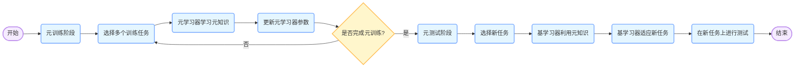

# 元学习：构建能够自我改进的AI Agent

> 关键词：元学习、AI Agent、自我改进、机器学习、算法原理、实际应用

> 摘要：本文围绕元学习构建能够自我改进的AI Agent展开深入探讨。首先介绍了元学习的背景知识，包括目的范围、预期读者等。接着详细阐述了元学习的核心概念、联系、算法原理、数学模型。通过项目实战给出具体代码案例及解释，分析其在不同场景下的实际应用。同时推荐了相关的学习资源、开发工具和论文著作。最后总结了元学习未来的发展趋势与挑战，并提供常见问题解答和扩展阅读参考资料，旨在帮助读者全面了解元学习构建自我改进AI Agent的技术和应用。

## 1. 背景介绍 

### 1.1 目的和范围
元学习作为机器学习领域的前沿技术，其目的在于让AI Agent具备快速学习和自我改进的能力。传统机器学习算法往往需要大量的数据和长时间的训练才能达到较好的性能，而元学习旨在打破这一限制，使AI Agent能够在少量数据的情况下快速适应新任务。本文的范围涵盖了元学习的核心概念、算法原理、数学模型、实际应用以及相关的工具和资源推荐，旨在为读者提供一个全面的元学习知识体系。

### 1.2 预期读者
本文预期读者包括机器学习和人工智能领域的研究人员、开发者、学生以及对元学习技术感兴趣的爱好者。对于有一定机器学习基础的读者，本文将深入讲解元学习的高级概念和算法；对于初学者，本文将从基础概念入手，逐步引导读者理解元学习的核心思想和应用场景。

### 1.3 文档结构概述
本文将按照以下结构进行组织：首先介绍元学习的背景知识，包括目的范围、预期读者等；接着详细阐述元学习的核心概念和联系，包括原理和架构的文本示意图以及Mermaid流程图；然后讲解元学习的核心算法原理和具体操作步骤，并使用Python源代码进行详细阐述；之后介绍元学习的数学模型和公式，并通过举例说明；通过项目实战给出具体代码案例及详细解释；分析元学习在不同场景下的实际应用；推荐相关的学习资源、开发工具和论文著作；最后总结元学习未来的发展趋势与挑战，提供常见问题解答和扩展阅读参考资料。

### 1.4 术语表
#### 1.4.1 核心术语定义
- **元学习（Meta - Learning）**：也称为“学习如何学习”，是一种让模型从多个学习任务中学习通用知识和学习策略，以便在新任务上快速学习和适应的技术。
- **AI Agent**：人工智能代理，是一种能够感知环境、做出决策并采取行动以实现特定目标的实体。
- **元知识（Meta - Knowledge）**：在元学习中，元知识是指从多个学习任务中提取的通用知识，可用于指导新任务的学习。
- **基学习器（Base Learner）**：在元学习框架中，基学习器是用于在具体任务上进行学习的模型。
- **元学习器（Meta - Learner）**：负责学习元知识，指导基学习器在新任务上的学习过程。

#### 1.4.2 相关概念解释
- **少样本学习（Few - Shot Learning）**：是元学习的一个重要应用场景，指在仅有少量样本的情况下，模型能够快速学习并做出准确预测的能力。
- **模型无关元学习（Model - Agnostic Meta - Learning，MAML）**：一种流行的元学习算法，它可以与各种类型的基学习器结合使用，通过在多个任务上进行元训练，使基学习器能够快速适应新任务。

#### 1.4.3 缩略词列表
- **MAML**：Model - Agnostic Meta - Learning
- **FSL**：Few - Shot Learning

## 2. 核心概念与联系 
### 核心概念原理
元学习的核心思想是让AI Agent学会如何学习，即从多个学习任务中提取通用的学习策略和知识。传统的机器学习方法通常是针对单个任务进行训练，而元学习则关注多个任务之间的共性，通过在多个任务上进行训练，使模型能够在新任务上快速学习和适应。

元学习的基本原理可以分为两个阶段：元训练阶段和元测试阶段。在元训练阶段，模型会在多个不同的任务上进行训练，学习到通用的元知识。在元测试阶段，模型会遇到一个新的任务，利用在元训练阶段学到的元知识，快速调整自身参数以适应新任务。

### 架构的文本示意图
元学习的架构通常包含元学习器和基学习器。元学习器负责学习元知识，它通过在多个任务上进行训练，提取出通用的学习策略。基学习器则是在具体的任务上进行学习，利用元学习器学到的元知识，快速适应新任务。

例如，在一个图像分类的元学习系统中，元学习器会在多个不同的图像分类任务上进行训练，学习到图像特征提取和分类的通用策略。当遇到一个新的图像分类任务时，基学习器会利用元学习器学到的策略，快速调整自身的参数，对新的图像进行分类。

### Mermaid流程图


## 3. 核心算法原理 & 具体操作步骤 
### 模型无关元学习（MAML）算法原理
模型无关元学习（MAML）是一种广泛应用的元学习算法，它的核心思想是找到一组初始参数，使得模型在经过少量梯度更新后，能够在新任务上取得较好的性能。

MAML的算法原理可以分为以下几个步骤：
1. **初始化参数**：随机初始化基学习器的参数 $\theta$。
2. **采样任务**：从任务分布 $p(\mathcal{T})$ 中采样一组任务 $\{\mathcal{T}_1, \mathcal{T}_2, \cdots, \mathcal{T}_n\}$。
3. **内部循环**：对于每个任务 $\mathcal{T}_i$，从任务 $\mathcal{T}_i$ 中采样一个支持集 $S_i$，使用支持集 $S_i$ 对基学习器进行一次或多次梯度更新，得到更新后的参数 $\theta_i'$。
4. **外部循环**：对于每个任务 $\mathcal{T}_i$，从任务 $\mathcal{T}_i$ 中采样一个查询集 $Q_i$，计算在查询集 $Q_i$ 上的损失 $L_i(\theta_i')$，并使用所有任务的损失之和 $\sum_{i = 1}^{n}L_i(\theta_i')$ 对初始参数 $\theta$ 进行更新。

### Python源代码详细阐述
```python
import torch
import torch.nn as nn
import torch.optim as optim

# 定义一个简单的基学习器
class BaseLearner(nn.Module):
    def __init__(self, input_size, hidden_size, output_size):
        super(BaseLearner, self).__init__()
        self.fc1 = nn.Linear(input_size, hidden_size)
        self.relu = nn.ReLU()
        self.fc2 = nn.Linear(hidden_size, output_size)

    def forward(self, x):
        out = self.fc1(x)
        out = self.relu(out)
        out = self.fc2(out)
        return out

# MAML算法实现
def maml(base_learner, tasks, num_inner_steps, inner_lr, outer_lr, num_epochs):
    meta_optimizer = optim.Adam(base_learner.parameters(), lr=outer_lr)

    for epoch in range(num_epochs):
        meta_loss = 0
        for task in tasks:
            # 复制基学习器的参数
            fast_weights = list(base_learner.parameters())

            # 内部循环
            for _ in range(num_inner_steps):
                support_inputs, support_labels = task.sample_support_set()
                logits = base_learner(support_inputs)
                loss = nn.CrossEntropyLoss()(logits, support_labels)
                grads = torch.autograd.grad(loss, fast_weights)
                fast_weights = [w - inner_lr * g for w, g in zip(fast_weights, grads)]

            # 外部循环
            query_inputs, query_labels = task.sample_query_set()
            logits = base_learner.forward_with_weights(query_inputs, fast_weights)
            loss = nn.CrossEntropyLoss()(logits, query_labels)
            meta_loss += loss

        # 更新元学习器的参数
        meta_optimizer.zero_grad()
        meta_loss.backward()
        meta_optimizer.step()

        if (epoch + 1) % 10 == 0:
            print(f'Epoch {epoch + 1}, Meta Loss: {meta_loss.item()}')

    return base_learner

# 示例使用
input_size = 10
hidden_size = 20
output_size = 5
base_learner = BaseLearner(input_size, hidden_size, output_size)

# 假设tasks是一组任务
tasks = []
num_inner_steps = 3
inner_lr = 0.01
outer_lr = 0.001
num_epochs = 100

trained_learner = maml(base_learner, tasks, num_inner_steps, inner_lr, outer_lr, num_epochs)
```

### 具体操作步骤解释
1. **定义基学习器**：在代码中，我们定义了一个简单的两层全连接神经网络作为基学习器。
2. **初始化元优化器**：使用Adam优化器来更新基学习器的初始参数。
3. **训练循环**：在每个训练周期中，我们会对一组任务进行训练。对于每个任务，首先进行内部循环，在支持集上对基学习器进行梯度更新，得到更新后的参数。然后进行外部循环，在查询集上计算损失，并使用所有任务的损失之和对初始参数进行更新。
4. **输出结果**：每隔10个训练周期，打印一次元损失，方便观察训练过程。

## 4. 数学模型和公式 & 详细讲解 & 举例说明 
### 数学模型
元学习的数学模型可以用以下公式来描述。假设我们有一个任务分布 $p(\mathcal{T})$，每个任务 $\mathcal{T}$ 包含一个支持集 $S$ 和一个查询集 $Q$。基学习器的参数为 $\theta$，损失函数为 $L$。

在元训练阶段，我们的目标是找到一组初始参数 $\theta$，使得在经过少量梯度更新后，基学习器能够在新任务上取得较好的性能。具体来说，对于每个任务 $\mathcal{T}_i$，我们首先在支持集 $S_i$ 上对基学习器进行梯度更新，得到更新后的参数 $\theta_i'$：

$$\theta_i' = \theta - \alpha \nabla_{\theta} L(\theta; S_i)$$

其中，$\alpha$ 是内部学习率。

然后，我们在查询集 $Q_i$ 上计算更新后的参数 $\theta_i'$ 的损失 $L(\theta_i'; Q_i)$，并使用所有任务的损失之和来更新初始参数 $\theta$：

$$\theta \leftarrow \theta - \beta \nabla_{\theta} \sum_{i = 1}^{n} L(\theta_i'; Q_i)$$

其中，$\beta$ 是外部学习率，$n$ 是采样的任务数量。

### 详细讲解
- **内部循环**：内部循环的目的是让基学习器在支持集上进行快速适应。通过在支持集上进行一次或多次梯度更新，基学习器能够根据当前任务的特点调整自身参数。
- **外部循环**：外部循环的目的是更新初始参数 $\theta$，使得基学习器在不同任务上都能快速适应。通过在查询集上计算损失，并使用所有任务的损失之和来更新初始参数，我们可以让基学习器学习到通用的学习策略。

### 举例说明
假设我们有一个图像分类任务，每个任务包含10个类别，每个类别有5个样本作为支持集，10个样本作为查询集。我们使用MAML算法进行元学习。

在内部循环中，基学习器会在支持集上进行3次梯度更新，每次更新的学习率为0.01。在外部循环中，我们会使用所有任务的查询集上的损失之和来更新初始参数，外部学习率为0.001。

经过多个训练周期后，基学习器能够学习到通用的图像特征提取和分类策略，当遇到一个新的图像分类任务时，只需要在少量样本上进行梯度更新，就能够快速适应新任务。

## 5. 项目实战：代码实际案例和详细解释说明 
### 5.1 开发环境搭建
#### 安装Python和相关库
首先，确保你已经安装了Python 3.6及以上版本。然后，使用以下命令安装必要的库：
```bash
pip install torch torchvision numpy matplotlib
```

#### 数据集准备
我们以Omniglot数据集为例，这是一个用于少样本学习的常用数据集，包含1623个不同的手写字符类别，每个类别有20个样本。可以使用以下代码下载和加载数据集：
```python
from torchvision.datasets import Omniglot
from torchvision.transforms import transforms

transform = transforms.Compose([
    transforms.Resize((28, 28)),
    transforms.ToTensor()
])

train_dataset = Omniglot(root='./data', background=True, transform=transform, download=True)
test_dataset = Omniglot(root='./data', background=False, transform=transform, download=True)
```

### 5.2 源代码详细实现和代码解读
```python
import torch
import torch.nn as nn
import torch.optim as optim
from torch.utils.data import DataLoader
from torchmeta.datasets import Omniglot
from torchmeta.transforms import ClassSplitter, Categorical
from torchmeta.utils.data import BatchMetaDataLoader

# 定义基学习器
class ConvNet(nn.Module):
    def __init__(self, num_classes):
        super(ConvNet, self).__init__()
        self.conv1 = nn.Conv2d(1, 64, kernel_size=3, padding=1)
        self.bn1 = nn.BatchNorm2d(64)
        self.relu1 = nn.ReLU(inplace=True)
        self.pool1 = nn.MaxPool2d(2)

        self.conv2 = nn.Conv2d(64, 64, kernel_size=3, padding=1)
        self.bn2 = nn.BatchNorm2d(64)
        self.relu2 = nn.ReLU(inplace=True)
        self.pool2 = nn.MaxPool2d(2)

        self.conv3 = nn.Conv2d(64, 64, kernel_size=3, padding=1)
        self.bn3 = nn.BatchNorm2d(64)
        self.relu3 = nn.ReLU(inplace=True)
        self.pool3 = nn.MaxPool2d(2)

        self.conv4 = nn.Conv2d(64, 64, kernel_size=3, padding=1)
        self.bn4 = nn.BatchNorm2d(64)
        self.relu4 = nn.ReLU(inplace=True)
        self.pool4 = nn.MaxPool2d(2)

        self.fc = nn.Linear(64, num_classes)

    def forward(self, x):
        x = self.pool1(self.relu1(self.bn1(self.conv1(x))))
        x = self.pool2(self.relu2(self.bn2(self.conv2(x))))
        x = self.pool3(self.relu3(self.bn3(self.conv3(x))))
        x = self.pool4(self.relu4(self.bn4(self.conv4(x))))
        x = x.view(x.size(0), -1)
        x = self.fc(x)
        return x

# MAML算法实现
def maml(meta_model, meta_dataloader, num_inner_steps, inner_lr, outer_lr, num_epochs):
    meta_optimizer = optim.Adam(meta_model.parameters(), lr=outer_lr)
    criterion = nn.CrossEntropyLoss()

    for epoch in range(num_epochs):
        meta_loss = 0
        for batch in meta_dataloader:
            support_inputs, support_labels = batch['train']
            query_inputs, query_labels = batch['test']

            fast_weights = list(meta_model.parameters())

            # 内部循环
            for _ in range(num_inner_steps):
                support_logits = meta_model.forward_with_weights(support_inputs, fast_weights)
                support_loss = criterion(support_logits, support_labels)
                grads = torch.autograd.grad(support_loss, fast_weights)
                fast_weights = [w - inner_lr * g for w, g in zip(fast_weights, grads)]

            # 外部循环
            query_logits = meta_model.forward_with_weights(query_inputs, fast_weights)
            query_loss = criterion(query_logits, query_labels)
            meta_loss += query_loss

        # 更新元学习器的参数
        meta_optimizer.zero_grad()
        meta_loss.backward()
        meta_optimizer.step()

        if (epoch + 1) % 10 == 0:
            print(f'Epoch {epoch + 1}, Meta Loss: {meta_loss.item()}')

    return meta_model

# 准备数据集和数据加载器
dataset = Omniglot('./data', num_classes_per_task=5, meta_train=True,
                   transform=transforms.ToTensor(),
                   target_transform=Categorical(num_classes=5),
                   download=True)
dataset = ClassSplitter(dataset, shuffle=True, num_train_per_class=1, num_test_per_class=15)
meta_dataloader = BatchMetaDataLoader(dataset, batch_size=4, num_workers=4)

# 初始化模型
num_classes = 5
meta_model = ConvNet(num_classes)

# 训练模型
num_inner_steps = 3
inner_lr = 0.01
outer_lr = 0.001
num_epochs = 100

trained_model = maml(meta_model, meta_dataloader, num_inner_steps, inner_lr, outer_lr, num_epochs)
```

### 5.3 代码解读与分析
#### 基学习器定义
`ConvNet` 类定义了一个简单的卷积神经网络作为基学习器。该网络包含4个卷积层和1个全连接层，用于对手写字符进行分类。

#### MAML算法实现
`maml` 函数实现了MAML算法的核心逻辑。在每个训练周期中，从元数据加载器中获取一批任务，对于每个任务，先进行内部循环，在支持集上对基学习器进行梯度更新，得到更新后的参数。然后进行外部循环，在查询集上计算损失，并使用所有任务的损失之和来更新初始参数。

#### 数据集和数据加载器
使用 `torchmeta` 库来处理元学习数据集。`Omniglot` 数据集被划分为支持集和查询集，使用 `BatchMetaDataLoader` 来批量加载任务。

#### 训练过程
在训练过程中，我们设置了内部学习率、外部学习率和训练周期数。每隔10个训练周期，打印一次元损失，方便观察训练过程。

## 6. 实际应用场景 
### 少样本学习
少样本学习是元学习最常见的应用场景之一。在实际应用中，获取大量标注数据往往是困难且昂贵的，少样本学习可以让模型在仅有少量样本的情况下快速学习和做出准确预测。例如，在医疗影像诊断中，由于某些疾病的病例较少，很难收集到大量的标注数据。元学习可以帮助模型在少量病例数据上快速学习，提高诊断的准确性。

### 机器人学习
在机器人学习中，元学习可以让机器人快速适应新的环境和任务。机器人在执行任务时，可能会遇到各种不同的场景和任务，传统的学习方法需要机器人在每个新场景下进行大量的训练。而元学习可以让机器人从多个任务中学习通用的策略，当遇到新任务时，能够快速调整自身的行为。例如，机器人在不同的地形上行走、抓取不同形状的物体等任务中，元学习可以帮助机器人快速适应新的情况。

### 自然语言处理
在自然语言处理中，元学习可以用于解决新领域的文本分类、情感分析等任务。不同领域的文本数据具有不同的语言风格和特征，传统的模型需要在每个新领域上进行大量的训练。元学习可以让模型从多个领域的文本数据中学习通用的语言知识和分类策略，当遇到新领域的文本时，能够快速适应并做出准确的分类。例如，在新闻分类、社交媒体情感分析等任务中，元学习可以提高模型的泛化能力和适应能力。

### 推荐系统
在推荐系统中，元学习可以帮助系统快速适应新用户和新物品。随着用户和物品的不断增加，推荐系统需要不断地学习新的用户偏好和物品特征。元学习可以让推荐系统从多个用户和物品的数据中学习通用的推荐策略，当遇到新用户或新物品时，能够快速为其提供个性化的推荐。例如，在电商平台、音乐推荐平台等应用中，元学习可以提高推荐系统的准确性和效率。

## 7. 工具和资源推荐
### 7.1 学习资源推荐
#### 7.1.1 书籍推荐
- 《Deep Learning》（Ian Goodfellow、Yoshua Bengio和Aaron Courville著）：深度学习领域的经典教材，涵盖了深度学习的基本概念、算法和应用，对于理解元学习的基础理论有很大帮助。
- 《Reinforcement Learning: An Introduction》（Richard S. Sutton和Andrew G. Barto著）：强化学习领域的经典教材，介绍了强化学习的基本概念、算法和应用，元学习与强化学习有一定的关联，这本书可以帮助读者拓宽知识面。
- 《Meta - Learning: A Survey》（Antreas Antoniou、Hugh Edwards和Amos Storkey著）：专门介绍元学习的综述性书籍，对元学习的各种算法和应用进行了详细的介绍和分析。

#### 7.1.2 在线课程
- Coursera上的“Deep Learning Specialization”：由Andrew Ng教授讲授的深度学习专项课程，涵盖了深度学习的各个方面，包括神经网络、卷积神经网络、循环神经网络等，对于初学者来说是一个很好的入门课程。
- edX上的“Reinforcement Learning”：由David Silver教授讲授的强化学习课程，介绍了强化学习的基本概念、算法和应用，对于理解元学习在强化学习中的应用有很大帮助。
- OpenAI的“Spinning Up in Deep Reinforcement Learning”：一个免费的在线课程，提供了强化学习的基础知识和实践经验，适合有一定编程基础的读者学习。

#### 7.1.3 技术博客和网站
- Medium上的“Towards Data Science”：一个专注于数据科学和机器学习的技术博客，上面有很多关于元学习的文章和教程，涵盖了元学习的最新研究成果和应用案例。
- arXiv.org：一个预印本网站，上面有很多关于元学习的最新研究论文，读者可以及时了解元学习领域的最新动态。
- OpenAI的官方博客：OpenAI是人工智能领域的领先研究机构，其官方博客上经常发布关于元学习、强化学习等领域的最新研究成果和技术文章。

### 7.2 开发工具框架推荐
#### 7.2.1 IDE和编辑器
- PyCharm：一款专门为Python开发设计的集成开发环境，提供了丰富的代码编辑、调试和版本控制功能，适合开发大型的Python项目。
- Jupyter Notebook：一个交互式的开发环境，支持Python、R等多种编程语言，适合进行数据探索、模型训练和可视化等工作。
- Visual Studio Code：一款轻量级的代码编辑器，支持多种编程语言和插件扩展，具有丰富的代码编辑和调试功能，适合开发小型的Python项目。

#### 7.2.2 调试和性能分析工具
- PyTorch Profiler：PyTorch提供的性能分析工具，可以帮助开发者分析模型的运行时间、内存使用等情况，找出性能瓶颈。
- TensorBoard：TensorFlow提供的可视化工具，也可以用于PyTorch项目。它可以帮助开发者可视化模型的训练过程、损失曲线、准确率等指标，方便调试和优化模型。
- cProfile：Python标准库中的性能分析工具，可以帮助开发者分析Python代码的运行时间和函数调用情况，找出性能瓶颈。

#### 7.2.3 相关框架和库
- PyTorch：一个开源的深度学习框架，提供了丰富的神经网络层和优化算法，支持GPU加速，适合进行元学习的研究和开发。
- Torchmeta：一个专门用于元学习的Python库，提供了各种元学习数据集和算法的实现，方便开发者进行元学习的实验和研究。
- Scikit - learn：一个开源的机器学习库，提供了各种机器学习算法和工具，适合进行数据预处理、模型选择和评估等工作。

### 7.3 相关论文著作推荐
#### 7.3.1 经典论文
- “Model - Agnostic Meta - Learning for Fast Adaptation of Deep Networks”（Chelsea Finn、Pieter Abbeel和Sergey Levine著）：提出了模型无关元学习（MAML）算法，是元学习领域的经典论文之一。
- “Matching Networks for One Shot Learning”（Oriol Vinyals、Charles Blundell、Tim Lillicrap、Koray Kavukcuoglu和Daan Wierstra著）：提出了匹配网络（Matching Networks）算法，用于解决少样本学习问题。
- “Prototypical Networks for Few - Shot Learning”（Jake Snell、Kevin Swersky和Richard S. Zemel著）：提出了原型网络（Prototypical Networks）算法，是少样本学习领域的经典算法之一。

#### 7.3.2 最新研究成果
- 关注arXiv.org上的最新研究论文，例如“Meta - Learning with Differentiable Convex Optimization”（Kwonjoon Lee、Subhransu Maji、Avital Oliver和Stefano Soatto著），提出了一种基于可微凸优化的元学习方法。
- 参加相关的学术会议，如NeurIPS、ICML、CVPR等，了解元学习领域的最新研究动态。

#### 7.3.3 应用案例分析
- 一些知名科技公司的技术博客会分享元学习的应用案例，例如Google的AI博客、Facebook的Research博客等。这些案例可以帮助读者了解元学习在实际应用中的具体实现和效果。

## 8. 总结：未来发展趋势与挑战
### 未来发展趋势
#### 与其他技术的融合
元学习有望与强化学习、迁移学习、生成对抗网络等技术进行更深入的融合。例如，将元学习与强化学习相结合，可以让智能体在复杂环境中更快地学习到最优策略；将元学习与迁移学习相结合，可以提高模型在不同领域之间的迁移能力。

#### 应用领域的拓展
随着元学习技术的不断发展，其应用领域将不断拓展。除了现有的少样本学习、机器人学习、自然语言处理和推荐系统等领域，元学习还可能应用于医疗保健、金融、交通等更多领域，为这些领域带来更高效、更智能的解决方案。

#### 理论基础的完善
目前，元学习的理论基础还不够完善，一些算法的收敛性和泛化能力还需要进一步研究。未来，研究人员将致力于完善元学习的理论基础，为元学习的发展提供更坚实的理论支持。

### 挑战
#### 计算资源的需求
元学习通常需要在多个任务上进行训练，计算资源的需求较大。尤其是在处理大规模数据集和复杂模型时，计算资源的瓶颈可能会限制元学习的发展。因此，如何提高元学习算法的计算效率，减少计算资源的需求，是一个亟待解决的问题。

#### 数据的多样性和质量
元学习的性能很大程度上依赖于训练数据的多样性和质量。如果训练数据的多样性不足，模型可能无法学习到通用的学习策略；如果训练数据的质量不高，模型的性能可能会受到影响。因此，如何获取高质量、多样化的训练数据，是元学习面临的一个挑战。

#### 模型的可解释性
元学习模型通常比较复杂，其决策过程和学习策略往往难以解释。在一些对模型可解释性要求较高的应用场景中，如医疗诊断、金融风险评估等，模型的可解释性是一个重要的问题。因此，如何提高元学习模型的可解释性，是未来研究的一个方向。

## 9. 附录：常见问题与解答
### 问题1：元学习和传统机器学习有什么区别？
传统机器学习通常是针对单个任务进行训练，需要大量的数据和长时间的训练才能达到较好的性能。而元学习关注多个任务之间的共性，通过在多个任务上进行训练，使模型能够在新任务上快速学习和适应，即使在少量数据的情况下也能取得较好的性能。

### 问题2：MAML算法的优缺点是什么？
优点：MAML算法具有模型无关性，可以与各种类型的基学习器结合使用；它能够在少量梯度更新后使模型快速适应新任务，具有较好的少样本学习能力。
缺点：MAML算法的计算复杂度较高，训练时间较长；在处理大规模数据集和复杂模型时，可能会遇到计算资源的瓶颈。

### 问题3：如何评估元学习模型的性能？
通常可以使用少样本学习任务的准确率、召回率、F1值等指标来评估元学习模型的性能。在评估时，需要使用与训练任务不同的测试任务，以检验模型的泛化能力和快速适应新任务的能力。

### 问题4：元学习在实际应用中有哪些限制？
元学习在实际应用中的限制主要包括计算资源的需求较大、数据的多样性和质量要求较高、模型的可解释性较差等。此外，元学习模型的训练过程通常比较复杂，需要一定的专业知识和经验。

## 10. 扩展阅读 & 参考资料
### 扩展阅读
- “Meta - Learning in Neural Networks: A Survey”（Ying Wen、Yonggang Wen、Jianwu Dang和Xing Xu著）：对神经网络中的元学习进行了全面的综述，介绍了元学习的各种方法和应用。
- “Meta - Learning for Computer Vision: A Survey”（Kangning Liu、Yonghong Tian、Tieniu Tan和Liang Wang著）：对计算机视觉领域中的元学习进行了综述，介绍了元学习在图像分类、目标检测、语义分割等任务中的应用。

### 参考资料
- Finn, C., Abbeel, P., & Levine, S. (2017). Model - Agnostic Meta - Learning for Fast Adaptation of Deep Networks. arXiv preprint arXiv:1703.03400.
- Vinyals, O., Blundell, C., Lillicrap, T., Kavukcuoglu, K., & Wierstra, D. (2016). Matching Networks for One Shot Learning. In Advances in neural information processing systems (pp. 3630 - 3638).
- Snell, J., Swersky, K., & Zemel, R. S. (2017). Prototypical Networks for Few - Shot Learning. In Advances in neural information processing systems (pp. 4077 - 4087).