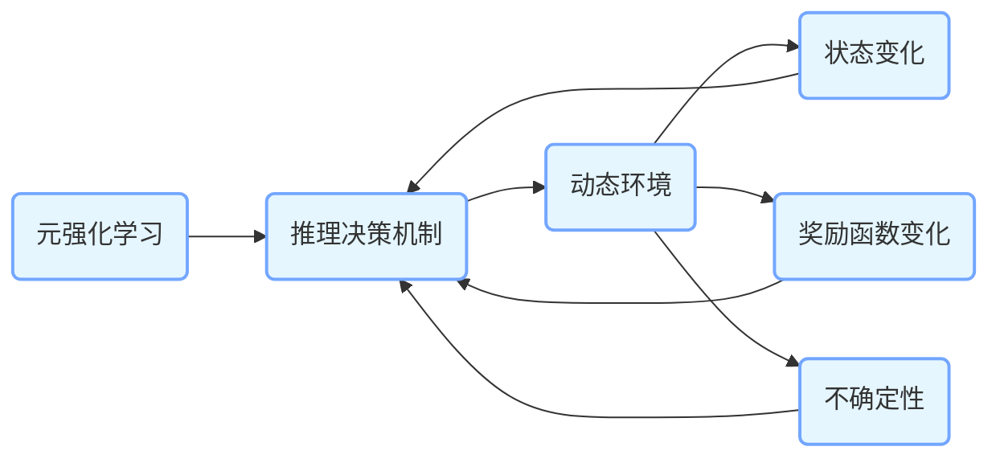

# 元强化学习优化动态环境下的推理决策机制设计

> 关键词：元强化学习、动态环境、推理决策机制、优化、智能体

> 摘要：本文聚焦于元强化学习在动态环境下对推理决策机制的优化设计。首先介绍了研究的背景和相关概念，包括元强化学习的原理、动态环境的特点等。接着深入探讨了核心算法原理，通过Python代码详细阐述具体操作步骤。同时给出了相关的数学模型和公式，并进行详细讲解与举例说明。通过项目实战，展示了如何实现优化的推理决策机制。还介绍了该技术的实际应用场景，推荐了相关的学习资源、开发工具框架以及论文著作。最后总结了未来发展趋势与挑战，并提供了常见问题解答和扩展阅读参考资料，旨在为相关领域的研究和实践提供全面且深入的指导。

## 1. 背景介绍 
### 1.1 目的和范围
在当今复杂多变的现实世界中，许多任务所处的环境是动态变化的，例如自动驾驶场景中交通状况的实时变化、机器人在未知环境中的探索等。传统的强化学习方法在处理这类动态环境时面临诸多挑战，如学习效率低、泛化能力差等。元强化学习作为一种新兴的技术，旨在通过学习如何学习，使智能体能够快速适应新的环境和任务。本研究的目的在于设计一种基于元强化学习的推理决策机制，以优化智能体在动态环境下的决策能力，提高其适应性和性能。研究范围涵盖了元强化学习的理论基础、算法实现、数学模型，以及在不同实际场景中的应用。

### 1.2 预期读者
本文预期读者包括人工智能、机器学习、控制理论等相关领域的研究人员、学生，以及对智能决策和优化技术感兴趣的工程师和技术爱好者。对于希望深入了解元强化学习及其在动态环境中应用的读者，本文将提供系统且深入的知识和实践指导。

### 1.3 文档结构概述
本文将按照以下结构进行组织：首先介绍相关的背景知识和核心概念，包括元强化学习和动态环境的定义和特点；接着详细阐述核心算法原理和具体操作步骤，并给出Python代码示例；然后介绍相关的数学模型和公式，并进行详细讲解和举例说明；通过项目实战展示如何实现优化的推理决策机制；探讨该技术的实际应用场景；推荐相关的学习资源、开发工具框架和论文著作；最后总结未来发展趋势与挑战，提供常见问题解答和扩展阅读参考资料。

### 1.4 术语表
#### 1.4.1 核心术语定义
- **元强化学习（Meta-Reinforcement Learning）**：一种能够学习学习过程的强化学习方法，通过在多个任务或环境中进行训练，使智能体能够快速适应新的任务或环境。
- **动态环境（Dynamic Environment）**：环境的状态和奖励函数随时间变化的环境，智能体需要不断调整策略以适应环境的变化。
- **推理决策机制（Inference Decision-Making Mechanism）**：智能体根据当前环境状态和历史经验，选择最优动作的机制。
- **智能体（Agent）**：在环境中执行动作并接收奖励的实体，通过学习不断优化自己的行为策略。

#### 1.4.2 相关概念解释
- **强化学习（Reinforcement Learning）**：一种通过智能体与环境进行交互，根据环境反馈的奖励信号来学习最优行为策略的机器学习方法。
- **策略（Policy）**：智能体在给定环境状态下选择动作的规则。
- **价值函数（Value Function）**：用于评估智能体在某个状态或状态-动作对下的长期价值。

#### 1.4.3 缩略词列表
- **MDP**：马尔可夫决策过程（Markov Decision Process）
- **RL**：强化学习（Reinforcement Learning）
- **Meta-RL**：元强化学习（Meta-Reinforcement Learning）

## 2. 核心概念与联系 

### 2.1 元强化学习原理
元强化学习的核心思想是在多个任务或环境中进行训练，使智能体能够学习到通用的学习策略，从而能够快速适应新的任务或环境。传统的强化学习方法通常是在单个任务或环境中进行训练，智能体需要花费大量的时间和样本才能学习到有效的策略。而元强化学习通过在多个任务上进行训练，智能体可以学习到如何利用过去的经验来快速适应新的任务，从而提高学习效率和泛化能力。

元强化学习的训练过程可以分为两个阶段：元训练阶段和元测试阶段。在元训练阶段，智能体在多个任务或环境中进行训练，学习到通用的学习策略。在元测试阶段，智能体将学习到的策略应用到新的任务或环境中，快速适应新的情况。

### 2.2 动态环境特点
动态环境具有以下特点：
- **状态变化**：环境的状态随时间不断变化，智能体需要不断感知环境的变化并调整自己的策略。
- **奖励函数变化**：环境的奖励函数可能随时间或任务的变化而变化，智能体需要根据新的奖励函数来调整自己的行为。
- **不确定性**：环境中存在许多不确定性因素，如噪声、干扰等，智能体需要具备一定的鲁棒性来应对这些不确定性。

### 2.3 推理决策机制与元强化学习、动态环境的联系
推理决策机制是智能体在动态环境中选择最优动作的关键。元强化学习可以为推理决策机制提供学习能力，使智能体能够快速适应动态环境的变化。在动态环境中，智能体需要不断更新自己的推理决策机制，以根据新的环境状态和奖励函数做出最优决策。元强化学习通过学习到的通用学习策略，可以帮助智能体更快地更新推理决策机制，提高决策的效率和准确性。

### 2.4 文本示意图
元强化学习、动态环境和推理决策机制之间的关系可以用以下文本示意图表示：

元强化学习通过在多个任务或环境中学习通用的学习策略，为推理决策机制提供学习能力。推理决策机制根据环境状态和奖励函数选择最优动作，以适应动态环境的变化。动态环境的状态和奖励函数随时间变化，促使智能体不断更新推理决策机制。

### 2.5 Mermaid 流程图


## 3. 核心算法原理 & 具体操作步骤 

### 3.1 元强化学习算法原理
元强化学习的一种常见算法是基于模型无关的元学习（Model-Agnostic Meta-Learning，MAML）。MAML的核心思想是找到一个初始的参数，使得在经过少量的梯度更新后，智能体能够在新的任务上快速收敛到最优策略。

具体来说，MAML的训练过程如下：
1. **采样任务**：从任务分布中采样一组任务。
2. **内部更新**：对于每个采样的任务，使用当前的参数进行一次或多次梯度更新，得到每个任务的临时参数。
3. **外部更新**：使用所有任务的临时参数计算元梯度，更新初始参数。

### 3.2 Python代码实现
以下是一个简单的基于MAML的元强化学习算法的Python代码示例：

```python
import torch
import torch.nn as nn
import torch.optim as optim

# 定义一个简单的策略网络
class PolicyNetwork(nn.Module):
    def __init__(self, input_dim, output_dim):
        super(PolicyNetwork, self).__init__()
        self.fc1 = nn.Linear(input_dim, 64)
        self.fc2 = nn.Linear(64, output_dim)

    def forward(self, x):
        x = torch.relu(self.fc1(x))
        x = self.fc2(x)
        return x

# 定义MAML算法
class MAML:
    def __init__(self, input_dim, output_dim, lr_inner=0.01, lr_outer=0.001):
        self.policy = PolicyNetwork(input_dim, output_dim)
        self.optimizer_inner = optim.SGD(self.policy.parameters(), lr=lr_inner)
        self.optimizer_outer = optim.Adam(self.policy.parameters(), lr=lr_outer)

    def inner_update(self, task, num_steps=1):
        temp_policy = PolicyNetwork(*list(self.policy.parameters()))
        temp_optimizer = optim.SGD(temp_policy.parameters(), lr=self.optimizer_inner.param_groups[0]['lr'])
        for _ in range(num_steps):
            states, actions, rewards = task.sample_data()
            logits = temp_policy(states)
            loss = self.compute_loss(logits, actions, rewards)
            temp_optimizer.zero_grad()
            loss.backward()
            temp_optimizer.step()
        return temp_policy

    def outer_update(self, tasks, num_steps=1):
        meta_gradients = []
        for task in tasks:
            temp_policy = self.inner_update(task, num_steps)
            states, actions, rewards = task.sample_data()
            logits = temp_policy(states)
            loss = self.compute_loss(logits, actions, rewards)
            gradients = torch.autograd.grad(loss, temp_policy.parameters())
            meta_gradients.append(gradients)
        avg_meta_gradients = [torch.mean(torch.stack([gradients[i] for gradients in meta_gradients]), dim=0) for i in range(len(meta_gradients[0]))]
        for param, grad in zip(self.policy.parameters(), avg_meta_gradients):
            param.grad = grad
        self.optimizer_outer.step()

    def compute_loss(self, logits, actions, rewards):
        # 简单的损失函数示例，实际应用中可能需要根据具体任务进行调整
        probs = torch.softmax(logits, dim=1)
        log_probs = torch.log(probs)
        selected_log_probs = log_probs.gather(1, actions.unsqueeze(1)).squeeze(1)
        loss = -torch.mean(selected_log_probs * rewards)
        return loss
```

### 3.3 具体操作步骤
1. **初始化**：初始化策略网络和MAML算法的参数。
2. **元训练**：
    - 从任务分布中采样一组任务。
    - 对于每个任务，进行内部更新，得到临时参数。
    - 使用所有任务的临时参数进行外部更新，更新初始参数。
3. **元测试**：将训练好的策略应用到新的任务或环境中，进行推理决策。

## 4. 数学模型和公式 & 详细讲解 & 举例说明 

### 4.1 马尔可夫决策过程（MDP）
马尔可夫决策过程是强化学习中常用的数学模型，用于描述智能体与环境的交互过程。一个MDP可以用一个五元组 $<S, A, P, R, \gamma>$ 表示，其中：
- $S$ 是状态空间，表示环境的所有可能状态。
- $A$ 是动作空间，表示智能体可以采取的所有可能动作。
- $P(s'|s, a)$ 是状态转移概率，表示在状态 $s$ 下采取动作 $a$ 后转移到状态 $s'$ 的概率。
- $R(s, a)$ 是奖励函数，表示在状态 $s$ 下采取动作 $a$ 后获得的奖励。
- $\gamma \in [0, 1]$ 是折扣因子，表示未来奖励的重要性。

### 4.2 策略和价值函数
- **策略**：策略 $\pi(a|s)$ 表示在状态 $s$ 下选择动作 $a$ 的概率。
- **状态价值函数**：状态价值函数 $V^{\pi}(s)$ 表示在策略 $\pi$ 下从状态 $s$ 开始的长期价值，定义为：
$$V^{\pi}(s) = \mathbb{E}_{\pi}\left[\sum_{t=0}^{\infty} \gamma^t R(s_t, a_t) | s_0 = s\right]$$
- **动作价值函数**：动作价值函数 $Q^{\pi}(s, a)$ 表示在策略 $\pi$ 下从状态 $s$ 采取动作 $a$ 开始的长期价值，定义为：
$$Q^{\pi}(s, a) = \mathbb{E}_{\pi}\left[\sum_{t=0}^{\infty} \gamma^t R(s_t, a_t) | s_0 = s, a_0 = a\right]$$

### 4.3 MAML的数学原理
MAML的目标是找到一个初始参数 $\theta$，使得在经过少量的梯度更新后，智能体能够在新的任务上快速收敛到最优策略。具体来说，对于一个任务 $\tau$，其损失函数为 $L(\tau, \theta')$，其中 $\theta'$ 是经过一次或多次梯度更新后的参数。MAML的优化目标可以表示为：
$$\min_{\theta} \sum_{\tau \sim p(\tau)} L\left(\tau, \theta - \alpha \nabla_{\theta} L(\tau, \theta)\right)$$
其中 $\alpha$ 是内部学习率，$p(\tau)$ 是任务分布。

### 4.4 举例说明
假设我们有一个简单的机器人导航任务，机器人需要在一个二维网格世界中从起点移动到终点。状态空间 $S$ 是网格世界中所有可能的位置，动作空间 $A$ 是机器人可以采取的四个方向的移动动作（上、下、左、右）。奖励函数 $R(s, a)$ 在机器人到达终点时为正奖励，否则为负奖励。

我们可以使用MAML算法来训练机器人的导航策略。在元训练阶段，我们可以采样多个不同的网格世界任务，每个任务有不同的起点、终点和障碍物分布。通过MAML算法，机器人可以学习到通用的学习策略，从而在新的网格世界任务中快速找到最优路径。

## 5. 项目实战：代码实际案例和详细解释说明 

### 5.1  开发环境搭建
- **操作系统**：推荐使用Ubuntu 18.04或更高版本，或者Windows 10。
- **Python版本**：Python 3.7或更高版本。
- **依赖库**：安装PyTorch、NumPy、Matplotlib等库，可以使用以下命令进行安装：
```sh
pip install torch numpy matplotlib
```

### 5.2  源代码详细实现和代码解读
以下是一个完整的基于MAML的机器人导航任务的代码示例：

```python
import torch
import torch.nn as nn
import torch.optim as optim
import numpy as np
import matplotlib.pyplot as plt

# 定义网格世界环境
class GridWorld:
    def __init__(self, grid_size=5, start=(0, 0), goal=(4, 4)):
        self.grid_size = grid_size
        self.start = start
        self.goal = goal
        self.current_state = start
        self.actions = [(0, 1), (0, -1), (1, 0), (-1, 0)]  # 右、左、下、上

    def reset(self):
        self.current_state = self.start
        return self.get_state()

    def step(self, action):
        new_state = (self.current_state[0] + self.actions[action][0], self.current_state[1] + self.actions[action][1])
        if new_state[0] < 0 or new_state[0] >= self.grid_size or new_state[1] < 0 or new_state[1] >= self.grid_size:
            new_state = self.current_state
        self.current_state = new_state
        reward = 1 if self.current_state == self.goal else -0.1
        done = self.current_state == self.goal
        return self.get_state(), reward, done

    def get_state(self):
        state = np.zeros((self.grid_size, self.grid_size))
        state[self.current_state[0], self.current_state[1]] = 1
        return state.flatten()

# 定义策略网络
class PolicyNetwork(nn.Module):
    def __init__(self, input_dim, output_dim):
        super(PolicyNetwork, self).__init__()
        self.fc1 = nn.Linear(input_dim, 64)
        self.fc2 = nn.Linear(64, output_dim)

    def forward(self, x):
        x = torch.relu(self.fc1(x))
        x = self.fc2(x)
        return x

# 定义MAML算法
class MAML:
    def __init__(self, input_dim, output_dim, lr_inner=0.01, lr_outer=0.001):
        self.policy = PolicyNetwork(input_dim, output_dim)
        self.optimizer_inner = optim.SGD(self.policy.parameters(), lr=lr_inner)
        self.optimizer_outer = optim.Adam(self.policy.parameters(), lr=lr_outer)

    def inner_update(self, env, num_steps=1):
        temp_policy = PolicyNetwork(*list(self.policy.parameters()))
        temp_optimizer = optim.SGD(temp_policy.parameters(), lr=self.optimizer_inner.param_groups[0]['lr'])
        for _ in range(num_steps):
            state = env.reset()
            state = torch.FloatTensor(state).unsqueeze(0)
            logits = temp_policy(state)
            probs = torch.softmax(logits, dim=1)
            action = torch.multinomial(probs, 1).item()
            next_state, reward, done = env.step(action)
            next_state = torch.FloatTensor(next_state).unsqueeze(0)
            loss = -torch.log(probs[0, action]) * reward
            temp_optimizer.zero_grad()
            loss.backward()
            temp_optimizer.step()
        return temp_policy

    def outer_update(self, envs, num_steps=1):
        meta_gradients = []
        for env in envs:
            temp_policy = self.inner_update(env, num_steps)
            state = env.reset()
            state = torch.FloatTensor(state).unsqueeze(0)
            logits = temp_policy(state)
            probs = torch.softmax(logits, dim=1)
            action = torch.multinomial(probs, 1).item()
            next_state, reward, done = env.step(action)
            next_state = torch.FloatTensor(next_state).unsqueeze(0)
            loss = -torch.log(probs[0, action]) * reward
            gradients = torch.autograd.grad(loss, temp_policy.parameters())
            meta_gradients.append(gradients)
        avg_meta_gradients = [torch.mean(torch.stack([gradients[i] for gradients in meta_gradients]), dim=0) for i in range(len(meta_gradients[0]))]
        for param, grad in zip(self.policy.parameters(), avg_meta_gradients):
            param.grad = grad
        self.optimizer_outer.step()

# 训练过程
grid_size = 5
input_dim = grid_size * grid_size
output_dim = 4
maml = MAML(input_dim, output_dim)

num_tasks = 10
num_epochs = 100
envs = [GridWorld(grid_size, start=(0, 0), goal=(np.random.randint(grid_size), np.random.randint(grid_size))) for _ in range(num_tasks)]

rewards_history = []
for epoch in range(num_epochs):
    maml.outer_update(envs)
    total_reward = 0
    test_env = GridWorld(grid_size, start=(0, 0), goal=(4, 4))
    state = test_env.reset()
    state = torch.FloatTensor(state).unsqueeze(0)
    done = False
    while not done:
        logits = maml.policy(state)
        probs = torch.softmax(logits, dim=1)
        action = torch.multinomial(probs, 1).item()
        next_state, reward, done = test_env.step(action)
        next_state = torch.FloatTensor(next_state).unsqueeze(0)
        total_reward += reward
        state = next_state
    rewards_history.append(total_reward)
    if epoch % 10 == 0:
        print(f'Epoch {epoch}: Total Reward = {total_reward}')

# 绘制奖励曲线
plt.plot(rewards_history)
plt.xlabel('Epoch')
plt.ylabel('Total Reward')
plt.title('Training Rewards')
plt.show()
```

### 5.3  代码解读与分析
- **GridWorld类**：定义了网格世界环境，包括环境的初始化、重置、状态获取和动作执行等方法。
- **PolicyNetwork类**：定义了策略网络，用于根据环境状态输出动作的概率分布。
- **MAML类**：实现了MAML算法，包括内部更新和外部更新方法。
- **训练过程**：在训练过程中，我们首先创建多个不同的网格世界任务，然后使用MAML算法进行元训练。每个epoch中，我们进行一次外部更新，然后在一个测试环境中测试智能体的性能，并记录总奖励。最后，我们绘制奖励曲线，观察智能体的训练效果。

从代码中可以看出，MAML算法通过在多个任务上进行训练，使得智能体能够学习到通用的学习策略，从而在新的任务中快速适应并取得较好的性能。

## 6. 实际应用场景 
### 6.1 自动驾驶
在自动驾驶领域，车辆需要在动态变化的交通环境中做出实时决策。元强化学习可以帮助自动驾驶车辆快速适应不同的交通场景，如拥堵、事故等。通过在多个不同的交通场景中进行训练，自动驾驶车辆可以学习到通用的决策策略，从而在新的场景中快速做出最优决策，提高行驶的安全性和效率。

### 6.2 机器人探索
机器人在未知环境中进行探索时，环境的状态和奖励函数可能随时间变化。元强化学习可以使机器人快速适应新的环境，学习到有效的探索策略。例如，在搜索救援任务中，机器人需要在复杂的灾难现场中寻找幸存者，元强化学习可以帮助机器人快速适应不同的现场环境，提高搜索效率。

### 6.3 游戏AI
在游戏领域，游戏环境通常是动态变化的，如对手的策略变化、游戏规则的调整等。元强化学习可以使游戏AI快速适应这些变化，提高游戏的智能水平。例如，在实时策略游戏中，元强化学习可以帮助AI快速调整自己的策略，应对对手的不同战术。

### 6.4 资源管理
在云计算、数据中心等领域，资源的需求和可用性是动态变化的。元强化学习可以用于优化资源的分配和调度，使系统能够快速适应资源需求的变化，提高资源利用率和系统性能。例如，在云计算中，元强化学习可以帮助调度器根据用户的请求和资源的状态，动态地分配虚拟机和存储资源。

## 7. 工具和资源推荐
### 7.1 学习资源推荐
#### 7.1.1 书籍推荐
- 《Reinforcement Learning: An Introduction》：由Richard S. Sutton和Andrew G. Barto所著，是强化学习领域的经典教材，全面介绍了强化学习的基本概念、算法和应用。
- 《Deep Reinforcement Learning Hands-On》：由Max Lapan所著，通过实际案例介绍了深度强化学习的应用和实现，适合有一定编程基础的读者。
- 《Meta-Learning: A Survey》：对元学习领域进行了全面的综述，介绍了元学习的基本概念、算法和应用，是深入了解元学习的重要参考资料。

#### 7.1.2 在线课程
- Coursera上的“Reinforcement Learning Specialization”：由University of Alberta的教授授课，系统介绍了强化学习的理论和实践。
- edX上的“Deep Reinforcement Learning”：由UC Berkeley的教授授课，深入讲解了深度强化学习的算法和应用。
- OpenAI的Spinning Up in Deep RL：提供了深度强化学习的教程和代码示例，适合初学者快速入门。

#### 7.1.3 技术博客和网站
- OpenAI博客：发布了许多关于强化学习和人工智能的最新研究成果和技术文章。
- DeepMind博客：分享了DeepMind在人工智能领域的研究进展和实践经验。
- Towards Data Science：是一个数据科学和人工智能领域的技术博客，有许多关于强化学习和元学习的优质文章。

### 7.2 开发工具框架推荐
#### 7.2.1 IDE和编辑器
- PyCharm：是一款专业的Python集成开发环境，提供了丰富的代码编辑、调试和版本控制功能，适合Python开发者使用。
- Visual Studio Code：是一款轻量级的代码编辑器，支持多种编程语言和插件，具有强大的代码编辑和调试功能。
- Jupyter Notebook：是一个交互式的编程环境，适合进行数据分析、模型训练和实验验证，方便用户进行代码的编写和展示。

#### 7.2.2 调试和性能分析工具
- TensorBoard：是TensorFlow提供的可视化工具，可以用于查看模型的训练过程、损失曲线、参数分布等信息，帮助用户调试和优化模型。
- PyTorch Profiler：是PyTorch提供的性能分析工具，可以帮助用户分析模型的性能瓶颈，优化代码的执行效率。
- cProfile：是Python标准库中的性能分析工具，可以用于分析Python代码的运行时间和函数调用关系，帮助用户找出性能瓶颈。

#### 7.2.3 相关框架和库
- PyTorch：是一个开源的深度学习框架，提供了丰富的神经网络模块和优化算法，支持GPU加速，方便用户进行模型的开发和训练。
- TensorFlow：是另一个广泛使用的深度学习框架，具有强大的分布式训练和部署能力，提供了丰富的工具和库，适合大规模的深度学习应用。
- Gym：是OpenAI开发的一个开源的强化学习环境库，提供了许多经典的强化学习任务，方便用户进行算法的测试和验证。

### 7.3 相关论文著作推荐
#### 7.3.1 经典论文
- “Model-Agnostic Meta-Learning for Fast Adaptation of Deep Networks”：提出了MAML算法，是元学习领域的经典论文。
- “Proximal Policy Optimization Algorithms”：提出了近端策略优化（PPO）算法，是一种高效的强化学习算法。
- “Human-level control through deep reinforcement learning”：介绍了深度Q网络（DQN）算法，开启了深度强化学习的时代。

#### 7.3.2 最新研究成果
- 关注arXiv等预印本平台，搜索“Meta-Reinforcement Learning”等关键词，可以获取元强化学习领域的最新研究成果。
- 参加NeurIPS、ICML、AAAI等人工智能领域的顶级学术会议，了解最新的研究进展和趋势。

#### 7.3.3 应用案例分析
- 许多公司和研究机构会发布他们在元强化学习领域的应用案例和实践经验，可以通过他们的官方网站、博客等渠道获取相关信息。
- 一些技术论坛和社区，如Reddit的r/MachineLearning板块，也会有用户分享元强化学习的应用案例和心得体会。

## 8. 总结：未来发展趋势与挑战
### 8.1 未来发展趋势
- **多模态元强化学习**：结合多种模态的信息，如图像、语音、文本等，提高智能体在复杂环境中的感知和决策能力。
- **元强化学习与其他技术的融合**：与深度学习、迁移学习、进化算法等技术相结合，进一步提高元强化学习的性能和应用范围。
- **实际应用的拓展**：将元强化学习应用到更多的实际领域，如医疗、金融、教育等，解决实际问题，创造更大的价值。

### 8.2 挑战
- **计算资源需求**：元强化学习通常需要大量的计算资源和时间来进行训练，如何降低计算成本是一个重要的挑战。
- **数据效率**：如何提高元强化学习的数据效率，减少训练所需的样本数量，是当前研究的热点问题。
- **可解释性**：元强化学习模型通常是黑盒模型，如何提高模型的可解释性，让用户理解模型的决策过程，是一个亟待解决的问题。

## 9. 附录：常见问题与解答
### 9.1 元强化学习和传统强化学习有什么区别？
传统强化学习通常是在单个任务或环境中进行训练，智能体需要花费大量的时间和样本才能学习到有效的策略。而元强化学习通过在多个任务或环境中进行训练，使智能体能够学习到通用的学习策略，从而能够快速适应新的任务或环境，提高学习效率和泛化能力。

### 9.2 MAML算法的复杂度高吗？
MAML算法的复杂度相对较高，主要体现在内部更新和外部更新的过程中需要进行多次梯度计算和参数更新。为了降低复杂度，可以采用一些优化方法，如使用更高效的优化算法、减少内部更新的步数等。

### 9.3 如何选择合适的学习率？
学习率的选择是一个关键问题，直接影响到模型的训练效果和收敛速度。通常可以采用网格搜索、随机搜索等方法来寻找合适的学习率。此外，还可以使用学习率调度策略，如学习率衰减，来动态调整学习率。

### 9.4 元强化学习在实际应用中面临哪些困难？
元强化学习在实际应用中面临一些困难，如计算资源需求大、数据效率低、可解释性差等。此外，实际环境通常非常复杂，存在许多不确定性因素，如何使元强化学习模型能够适应这些复杂环境也是一个挑战。

## 10. 扩展阅读 & 参考资料
- Sutton, R. S., & Barto, A. G. (2018). Reinforcement Learning: An Introduction. MIT press.
- Finn, C., Abbeel, P., & Levine, S. (2017). Model-Agnostic Meta-Learning for Fast Adaptation of Deep Networks. arXiv preprint arXiv:1703.03400.
- OpenAI. (n.d.). Spinning Up in Deep RL. Retrieved from https://spinningup.openai.com/
- PyTorch. (n.d.). PyTorch Documentation. Retrieved from https://pytorch.org/docs/stable/index.html
- TensorFlow. (n.d.). TensorFlow Documentation. Retrieved from https://www.tensorflow.org/api_docs
- Gym. (n.d.). Gym Documentation. Retrieved from https://gym.openai.com/docs/