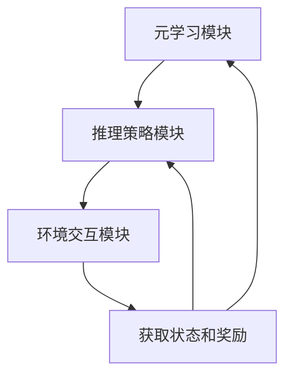

# 元强化学习优化复杂环境下的推理策略

> 关键词：元强化学习、复杂环境、推理策略、优化、机器学习

> 摘要：本文聚焦于元强化学习在复杂环境下对推理策略的优化。首先介绍了相关背景知识，包括目的范围、预期读者等内容。接着阐述了元强化学习及推理策略的核心概念与联系，详细讲解了核心算法原理并给出 Python 代码示例，分析了其数学模型和公式。通过项目实战，展示了如何搭建开发环境、实现源代码并进行解读。探讨了元强化学习优化推理策略在多个领域的实际应用场景，推荐了相关的学习资源、开发工具框架以及论文著作。最后总结了未来发展趋势与挑战，并提供了常见问题解答和扩展阅读参考资料，旨在为相关领域的研究者和开发者提供全面且深入的技术指导。

## 1. 背景介绍 

### 1.1 目的和范围
在当今复杂多变的环境中，传统的强化学习方法在处理动态、不确定和高维的问题时往往面临诸多挑战。元强化学习作为一种新兴的技术，旨在通过学习如何学习，使得智能体能够快速适应新的任务和环境。本文的目的是深入探讨元强化学习如何优化复杂环境下的推理策略，涵盖了从理论原理到实际应用的多个方面。具体范围包括元强化学习的核心概念、算法原理、数学模型，以及如何在实际项目中应用元强化学习来提升推理策略的性能，同时分析其在不同领域的应用场景和未来发展趋势。

### 1.2 预期读者
本文预期读者主要包括人工智能、机器学习领域的研究者、开发者，以及对元强化学习和复杂环境推理策略感兴趣的技术爱好者。对于有一定机器学习基础的读者，本文将提供深入的技术分析和实践指导；对于初学者，也能通过详细的解释和示例，逐步了解元强化学习的基本概念和应用方法。

### 1.3 文档结构概述
本文共分为十个部分。第一部分为背景介绍，阐述了文章的目的、范围、预期读者和文档结构概述，并对相关术语进行了定义。第二部分介绍了元强化学习和推理策略的核心概念与联系，通过文本示意图和 Mermaid 流程图进行直观展示。第三部分详细讲解了核心算法原理，并给出了 Python 源代码示例。第四部分分析了数学模型和公式，并通过具体例子进行说明。第五部分进行项目实战，包括开发环境搭建、源代码实现和代码解读。第六部分探讨了元强化学习优化推理策略的实际应用场景。第七部分推荐了相关的学习资源、开发工具框架和论文著作。第八部分总结了未来发展趋势与挑战。第九部分为附录，解答了常见问题。第十部分提供了扩展阅读和参考资料。

### 1.4 术语表

#### 1.4.1 核心术语定义
- **元强化学习（Meta-Reinforcement Learning）**：一种强化学习的扩展，通过在多个任务上进行学习，使得智能体能够快速适应新的任务，学习如何学习。
- **推理策略（Inference Strategy）**：智能体在面对具体问题时，根据当前状态和历史信息，做出决策的方法和规则。
- **复杂环境（Complex Environment）**：具有动态性、不确定性、高维性等特点的环境，传统方法难以有效处理。
- **智能体（Agent）**：在环境中执行动作并与环境进行交互的实体。
- **奖励函数（Reward Function）**：用于评估智能体在环境中执行动作的好坏，引导智能体学习最优策略。

#### 1.4.2 相关概念解释
- **学习如何学习（Learning to Learn）**：元强化学习的核心思想，通过在多个任务上积累经验，智能体能够学会如何更快地适应新任务，而不仅仅是学习单个任务的最优策略。
- **任务分布（Task Distribution）**：多个任务的集合，元强化学习在这个任务分布上进行训练，以提高对新任务的泛化能力。
- **策略网络（Policy Network）**：用于生成智能体的动作策略，根据当前状态输出动作的概率分布。
- **价值网络（Value Network）**：用于评估状态的价值，预测智能体在某个状态下未来的累积奖励。

#### 1.4.3 缩略词列表
- **MDP（Markov Decision Process）**：马尔可夫决策过程，是强化学习中常用的数学模型。
- **A2C（Advantage Actor-Critic）**：一种基于策略梯度的强化学习算法。
- **PPO（Proximal Policy Optimization）**：一种高效的策略优化算法。
- **VAE（Variational Autoencoder）**：变分自编码器，常用于处理高维数据和学习数据的潜在表示。

## 2. 核心概念与联系 

### 核心概念原理
元强化学习的核心思想是在多个任务上进行学习，从而让智能体学会如何快速适应新的任务。传统的强化学习通常是在单个任务上进行训练，智能体需要花费大量的时间和样本才能收敛到最优策略。而元强化学习通过在不同的任务上进行交互，学习到一种通用的学习策略，使得智能体在面对新任务时能够更快地调整自己的策略。

推理策略是智能体在复杂环境中做出决策的依据。在复杂环境中，智能体需要根据当前的状态和历史信息，选择最优的动作来实现目标。推理策略的好坏直接影响智能体在环境中的性能。

元强化学习与推理策略的联系在于，元强化学习可以优化推理策略。通过在多个任务上的学习，智能体能够学习到更有效的特征表示和决策规则，从而在复杂环境中更快地找到最优的推理策略。

### 架构的文本示意图
元强化学习优化推理策略的架构可以分为三个主要部分：元学习模块、推理策略模块和环境交互模块。

元学习模块负责在多个任务上进行学习，提取通用的特征和学习策略。它通过与环境进行交互，收集不同任务的数据，并使用这些数据来更新元学习模型。

推理策略模块根据元学习模块学习到的知识，生成智能体在当前任务中的推理策略。它接收当前状态作为输入，输出智能体的动作。

环境交互模块负责智能体与环境的交互。智能体根据推理策略模块生成的动作在环境中执行，环境返回下一个状态和奖励。智能体根据奖励来评估自己的动作，并将经验数据反馈给元学习模块进行更新。

### Mermaid 流程图


## 3. 核心算法原理 & 具体操作步骤 

### 核心算法原理
元强化学习中有多种算法，这里以基于模型无关的元强化学习算法（Model-Free Meta-Reinforcement Learning）为例进行讲解。这种算法主要基于策略梯度方法，通过在多个任务上进行梯度更新来学习元策略。

策略梯度方法的核心思想是通过最大化累积奖励的期望来更新策略网络的参数。在元强化学习中，我们不仅要在单个任务上最大化累积奖励，还要在多个任务上进行优化，使得智能体能够快速适应新任务。

具体来说，我们可以使用 A2C 或 PPO 等算法来进行策略优化。A2C 算法结合了策略网络和价值网络，通过计算优势函数来更新策略网络的参数。PPO 算法则是在 A2C 的基础上进行改进，通过限制策略更新的步长，提高了算法的稳定性和收敛速度。

### 具体操作步骤
1. **初始化元学习模型**：包括策略网络和价值网络的参数。
2. **采样任务**：从任务分布中随机采样一个任务。
3. **在任务上进行交互**：智能体根据当前的推理策略在任务环境中进行交互，收集状态、动作、奖励等数据。
4. **计算优势函数**：使用价值网络评估状态的价值，计算优势函数。
5. **更新策略网络和价值网络**：根据优势函数和策略梯度算法，更新策略网络和价值网络的参数。
6. **重复步骤 2 - 5**：在多个任务上进行训练，直到元学习模型收敛。

### Python 源代码示例
```python
import torch
import torch.nn as nn
import torch.optim as optim
import numpy as np

# 定义策略网络
class PolicyNetwork(nn.Module):
    def __init__(self, input_dim, output_dim):
        super(PolicyNetwork, self).__init__()
        self.fc1 = nn.Linear(input_dim, 64)
        self.fc2 = nn.Linear(64, output_dim)

    def forward(self, x):
        x = torch.relu(self.fc1(x))
        x = torch.softmax(self.fc2(x), dim=-1)
        return x

# 定义价值网络
class ValueNetwork(nn.Module):
    def __init__(self, input_dim):
        super(ValueNetwork, self).__init__()
        self.fc1 = nn.Linear(input_dim, 64)
        self.fc2 = nn.Linear(64, 1)

    def forward(self, x):
        x = torch.relu(self.fc1(x))
        x = self.fc2(x)
        return x

# 定义 A2C 算法
class A2C:
    def __init__(self, input_dim, output_dim, lr=0.001):
        self.policy_network = PolicyNetwork(input_dim, output_dim)
        self.value_network = ValueNetwork(input_dim)
        self.policy_optimizer = optim.Adam(self.policy_network.parameters(), lr=lr)
        self.value_optimizer = optim.Adam(self.value_network.parameters(), lr=lr)

    def select_action(self, state):
        state = torch.FloatTensor(state).unsqueeze(0)
        probs = self.policy_network(state)
        action = torch.multinomial(probs, 1).item()
        return action

    def update(self, states, actions, rewards):
        states = torch.FloatTensor(states)
        actions = torch.LongTensor(actions)
        rewards = torch.FloatTensor(rewards)

        # 计算价值估计
        values = self.value_network(states).squeeze()

        # 计算优势函数
        advantages = rewards - values.detach()

        # 计算策略损失
        probs = self.policy_network(states)
        log_probs = torch.log(probs.gather(1, actions.unsqueeze(1)).squeeze())
        policy_loss = -(log_probs * advantages).mean()

        # 计算价值损失
        value_loss = ((values - rewards) ** 2).mean()

        # 更新策略网络
        self.policy_optimizer.zero_grad()
        policy_loss.backward()
        self.policy_optimizer.step()

        # 更新价值网络
        self.value_optimizer.zero_grad()
        value_loss.backward()
        self.value_optimizer.step()

# 示例使用
input_dim = 4
output_dim = 2
a2c = A2C(input_dim, output_dim)

# 模拟环境交互
states = []
actions = []
rewards = []
for _ in range(10):
    state = np.random.rand(input_dim)
    action = a2c.select_action(state)
    reward = np.random.rand()
    states.append(state)
    actions.append(action)
    rewards.append(reward)

# 更新模型
a2c.update(states, actions, rewards)
```

## 4. 数学模型和公式 & 详细讲解 & 举例说明 

### 马尔可夫决策过程（MDP）
在强化学习中，通常使用马尔可夫决策过程（MDP）来描述环境和智能体的交互。MDP 可以用一个五元组 $\langle S, A, P, R, \gamma \rangle$ 表示，其中：
- $S$ 是状态空间，表示环境的所有可能状态。
- $A$ 是动作空间，表示智能体可以执行的所有动作。
- $P: S \times A \times S \to [0, 1]$ 是状态转移概率函数，表示在状态 $s$ 执行动作 $a$ 后转移到状态 $s'$ 的概率。
- $R: S \times A \to \mathbb{R}$ 是奖励函数，表示在状态 $s$ 执行动作 $a$ 后获得的即时奖励。
- $\gamma \in [0, 1]$ 是折扣因子，用于平衡即时奖励和未来奖励。

### 策略和价值函数
策略 $\pi: S \times A \to [0, 1]$ 表示在状态 $s$ 下选择动作 $a$ 的概率。价值函数 $V^\pi(s)$ 表示在策略 $\pi$ 下从状态 $s$ 开始的未来累积奖励的期望：
$$V^\pi(s) = \mathbb{E}_\pi \left[ \sum_{t=0}^{\infty} \gamma^t R(s_t, a_t) \mid s_0 = s \right]$$
动作价值函数 $Q^\pi(s, a)$ 表示在策略 $\pi$ 下从状态 $s$ 执行动作 $a$ 后未来累积奖励的期望：
$$Q^\pi(s, a) = \mathbb{E}_\pi \left[ \sum_{t=0}^{\infty} \gamma^t R(s_t, a_t) \mid s_0 = s, a_0 = a \right]$$

### 策略梯度定理
策略梯度定理表明，策略网络参数 $\theta$ 的梯度可以表示为：
$$\nabla_\theta J(\theta) = \mathbb{E}_\pi \left[ \nabla_\theta \log \pi(a \mid s) Q^\pi(s, a) \right]$$
其中 $J(\theta)$ 是策略的目标函数，通常是累积奖励的期望。

### 优势函数
为了减少方差，我们可以使用优势函数 $A^\pi(s, a) = Q^\pi(s, a) - V^\pi(s)$ 来代替 $Q^\pi(s, a)$。这样，策略梯度可以表示为：
$$\nabla_\theta J(\theta) = \mathbb{E}_\pi \left[ \nabla_\theta \log \pi(a \mid s) A^\pi(s, a) \right]$$

### 举例说明
假设我们有一个简单的 MDP，状态空间 $S = \{s_1, s_2\}$，动作空间 $A = \{a_1, a_2\}$，状态转移概率和奖励函数如下：
- $P(s_2 \mid s_1, a_1) = 0.8$，$P(s_1 \mid s_1, a_1) = 0.2$，$R(s_1, a_1) = 1$
- $P(s_2 \mid s_1, a_2) = 0.2$，$P(s_1 \mid s_1, a_2) = 0.8$，$R(s_1, a_2) = -1$
- $P(s_2 \mid s_2, a_1) = 0.5$，$P(s_1 \mid s_2, a_1) = 0.5$，$R(s_2, a_1) = 2$
- $P(s_2 \mid s_2, a_2) = 0.3$，$P(s_1 \mid s_2, a_2) = 0.7$，$R(s_2, a_2) = -2$

假设折扣因子 $\gamma = 0.9$，策略 $\pi$ 为 $\pi(a_1 \mid s_1) = 0.6$，$\pi(a_2 \mid s_1) = 0.4$，$\pi(a_1 \mid s_2) = 0.7$，$\pi(a_2 \mid s_2) = 0.3$。

我们可以计算状态 $s_1$ 的价值函数 $V^\pi(s_1)$：
$$
\begin{align*}
V^\pi(s_1) &= \pi(a_1 \mid s_1) \left[ R(s_1, a_1) + \gamma \left( P(s_2 \mid s_1, a_1) V^\pi(s_2) + P(s_1 \mid s_1, a_1) V^\pi(s_1) \right) \right] \\
&+ \pi(a_2 \mid s_1) \left[ R(s_1, a_2) + \gamma \left( P(s_2 \mid s_1, a_2) V^\pi(s_2) + P(s_1 \mid s_1, a_2) V^\pi(s_1) \right) \right]
\end{align*}
$$
同理可以计算 $V^\pi(s_2)$。

为了更新策略，我们可以使用策略梯度定理计算梯度，并使用梯度上升法更新策略网络的参数。

## 5. 项目实战：代码实际案例和详细解释说明 

### 5.1  开发环境搭建
#### 操作系统
推荐使用 Linux 系统，如 Ubuntu 18.04 或更高版本。也可以使用 Windows 10 或 macOS。

#### Python 环境
安装 Python 3.7 或更高版本。可以使用 Anaconda 来管理 Python 环境，以下是创建和激活虚拟环境的命令：
```bash
conda create -n meta_rl python=3.8
conda activate meta_rl
```

#### 依赖库安装
安装必要的 Python 库，包括 PyTorch、NumPy、OpenAI Gym 等：
```bash
pip install torch numpy gym
```

### 5.2  源代码详细实现和代码解读
以下是一个使用元强化学习优化推理策略的完整代码示例：
```python
import torch
import torch.nn as nn
import torch.optim as optim
import numpy as np
import gym

# 定义策略网络
class PolicyNetwork(nn.Module):
    def __init__(self, input_dim, output_dim):
        super(PolicyNetwork, self).__init__()
        self.fc1 = nn.Linear(input_dim, 64)
        self.fc2 = nn.Linear(64, output_dim)

    def forward(self, x):
        x = torch.relu(self.fc1(x))
        x = torch.softmax(self.fc2(x), dim=-1)
        return x

# 定义价值网络
class ValueNetwork(nn.Module):
    def __init__(self, input_dim):
        super(ValueNetwork, self).__init__()
        self.fc1 = nn.Linear(input_dim, 64)
        self.fc2 = nn.Linear(64, 1)

    def forward(self, x):
        x = torch.relu(self.fc1(x))
        x = self.fc2(x)
        return x

# 定义 A2C 算法
class A2C:
    def __init__(self, input_dim, output_dim, lr=0.001):
        self.policy_network = PolicyNetwork(input_dim, output_dim)
        self.value_network = ValueNetwork(input_dim)
        self.policy_optimizer = optim.Adam(self.policy_network.parameters(), lr=lr)
        self.value_optimizer = optim.Adam(self.value_network.parameters(), lr=lr)

    def select_action(self, state):
        state = torch.FloatTensor(state).unsqueeze(0)
        probs = self.policy_network(state)
        action = torch.multinomial(probs, 1).item()
        return action

    def update(self, states, actions, rewards):
        states = torch.FloatTensor(states)
        actions = torch.LongTensor(actions)
        rewards = torch.FloatTensor(rewards)

        # 计算价值估计
        values = self.value_network(states).squeeze()

        # 计算优势函数
        advantages = rewards - values.detach()

        # 计算策略损失
        probs = self.policy_network(states)
        log_probs = torch.log(probs.gather(1, actions.unsqueeze(1)).squeeze())
        policy_loss = -(log_probs * advantages).mean()

        # 计算价值损失
        value_loss = ((values - rewards) ** 2).mean()

        # 更新策略网络
        self.policy_optimizer.zero_grad()
        policy_loss.backward()
        self.policy_optimizer.step()

        # 更新价值网络
        self.value_optimizer.zero_grad()
        value_loss.backward()
        self.value_optimizer.step()

# 主训练循环
def train():
    env = gym.make('CartPole-v1')
    input_dim = env.observation_space.shape[0]
    output_dim = env.action_space.n
    a2c = A2C(input_dim, output_dim)

    num_episodes = 1000
    for episode in range(num_episodes):
        state = env.reset()
        states = []
        actions = []
        rewards = []

        while True:
            action = a2c.select_action(state)
            next_state, reward, done, _ = env.step(action)

            states.append(state)
            actions.append(action)
            rewards.append(reward)

            state = next_state

            if done:
                break

        # 计算累积奖励
        discounted_rewards = []
        cumulative_reward = 0
        for reward in reversed(rewards):
            cumulative_reward = reward + 0.9 * cumulative_reward
            discounted_rewards.insert(0, cumulative_reward)

        # 更新模型
        a2c.update(states, actions, discounted_rewards)

        if episode % 100 == 0:
            print(f'Episode {episode}: Total reward = {sum(rewards)}')

    env.close()

if __name__ == '__main__':
    train()
```

### 5.3  代码解读与分析
#### 策略网络和价值网络
- `PolicyNetwork`：用于生成智能体的动作策略。输入是环境的状态，输出是动作的概率分布。通过两层全连接层和 ReLU 激活函数，最后使用 Softmax 函数将输出转换为概率分布。
- `ValueNetwork`：用于评估状态的价值。输入是环境的状态，输出是一个标量值，表示该状态的价值。同样使用两层全连接层和 ReLU 激活函数。

#### A2C 算法
- `select_action` 方法：根据当前状态，通过策略网络生成动作的概率分布，然后使用 `torch.multinomial` 函数采样一个动作。
- `update` 方法：计算价值估计和优势函数，然后计算策略损失和价值损失。使用梯度下降法更新策略网络和价值网络的参数。

#### 主训练循环
- 在每个训练周期中，智能体与环境进行交互，收集状态、动作和奖励数据。
- 计算累积奖励，并使用折扣因子进行折扣。
- 调用 `update` 方法更新模型。
- 每 100 个周期打印一次总奖励，用于监控训练进度。

## 6. 实际应用场景 
### 机器人控制
在机器人控制领域，元强化学习可以帮助机器人快速适应不同的任务和环境。例如，机器人在执行抓取任务时，可能会遇到不同形状、大小和材质的物体。通过元强化学习，机器人可以学习到一种通用的抓取策略，能够快速适应新的物体。同时，在复杂的环境中，如未知的地形或有障碍物的空间，机器人可以使用元强化学习优化推理策略，更好地规划路径和执行动作。

### 游戏领域
在游戏中，元强化学习可以用于优化智能体的策略。例如，在实时策略游戏中，智能体需要根据不同的游戏场景和对手的策略做出决策。通过元强化学习，智能体可以学习到如何在不同的游戏局面下快速调整自己的策略，提高游戏的胜率。在多智能体游戏中，元强化学习还可以用于学习智能体之间的协作策略，实现更高效的团队合作。

### 金融投资
在金融投资领域，市场环境复杂多变，传统的投资策略往往难以适应市场的变化。元强化学习可以帮助投资者学习到如何在不同的市场条件下做出最优的投资决策。例如，通过在多个不同的市场环境下进行学习，智能体可以学习到市场的规律和趋势，快速调整投资组合，降低风险并提高收益。

### 医疗保健
在医疗保健领域，元强化学习可以用于优化医疗决策。例如，在疾病诊断和治疗方案选择方面，医生需要根据患者的症状、病史和检查结果等信息做出决策。元强化学习可以帮助医生学习到在不同的病例情况下如何做出最优的诊断和治疗方案，提高医疗质量和效率。同时，在药物研发方面，元强化学习可以用于优化药物筛选和研发过程，加快新药的研发速度。

## 7. 工具和资源推荐
### 7.1 学习资源推荐
#### 7.1.1 书籍推荐
- 《Reinforcement Learning: An Introduction》（Richard S. Sutton 和 Andrew G. Barto 著）：这是强化学习领域的经典教材，全面介绍了强化学习的基本概念、算法和应用。
- 《Deep Reinforcement Learning Hands-On》（Max Lapan 著）：这本书通过实际代码示例，详细介绍了深度强化学习的各种算法和应用，适合初学者和有一定基础的开发者。
- 《Meta-Learning: Theory and Practice》（Yoshua Bengio、Richard L. Lewis 和 Mark Schmidt 编著）：专注于元学习的理论和实践，涵盖了元学习的各种方法和应用场景。

#### 7.1.2 在线课程
- Coursera 上的 “Reinforcement Learning Specialization”：由 Andrew G. Barto 等教授授课，系统地介绍了强化学习的理论和实践。
- Udemy 上的 “Deep Reinforcement Learning: Hands-On”：通过实际项目，深入讲解了深度强化学习的算法和应用。
- OpenAI Gym 官方文档和教程：提供了丰富的强化学习环境和示例代码，帮助开发者快速上手。

#### 7.1.3 技术博客和网站
- OpenAI 官方博客：发布了许多关于强化学习和元学习的最新研究成果和应用案例。
- DeepMind 官方博客：分享了深度强化学习领域的前沿研究和技术。
- Towards Data Science：一个数据科学和机器学习的社区，有很多关于强化学习和元学习的优质文章。

### 7.2 开发工具框架推荐
#### 7.2.1 IDE和编辑器
- PyCharm：一款专业的 Python IDE，提供了丰富的代码编辑、调试和项目管理功能。
- Jupyter Notebook：交互式的开发环境，适合进行实验和数据分析。
- Visual Studio Code：轻量级的代码编辑器，支持多种编程语言和插件，方便进行开发和调试。

#### 7.2.2 调试和性能分析工具
- TensorBoard：用于可视化训练过程和模型性能的工具，集成在 TensorFlow 中，也可以与 PyTorch 结合使用。
- PyTorch Profiler：用于分析 PyTorch 模型的性能，帮助开发者找出性能瓶颈。
- cProfile：Python 内置的性能分析工具，可以分析代码的运行时间和函数调用次数。

#### 7.2.3 相关框架和库
- PyTorch：一个开源的深度学习框架，提供了丰富的神经网络模块和优化算法，广泛应用于强化学习和元学习领域。
- TensorFlow：另一个流行的深度学习框架，具有强大的分布式训练和部署能力。
- OpenAI Gym：一个用于开发和比较强化学习算法的工具包，提供了多种环境和基准测试。

### 7.3 相关论文著作推荐
#### 7.3.1 经典论文
- “Model-Agnostic Meta-Learning for Fast Adaptation of Deep Networks”（Chelsea Finn、Pieter Abbeel 和 Sergey Levine 著）：提出了模型无关的元学习方法，是元学习领域的经典论文。
- “Proximal Policy Optimization Algorithms”（John Schulman 等著）：介绍了 PPO 算法，是一种高效的策略优化算法。
- “Asynchronous Methods for Deep Reinforcement Learning”（Volodymyr Mnih 等著）：提出了异步优势演员 - 评论家（A3C）算法，为深度强化学习的发展做出了重要贡献。

#### 7.3.2 最新研究成果
- 关注 NeurIPS、ICML、AAAI 等顶级机器学习会议的论文，这些会议上会发布元强化学习领域的最新研究成果。
- 订阅 arXiv 上的相关主题，及时获取最新的预印本论文。

#### 7.3.3 应用案例分析
- 研究各大科技公司的技术博客和开源项目，了解元强化学习在实际应用中的案例和经验。例如，OpenAI 在机器人控制和游戏领域的应用案例，DeepMind 在医疗保健和金融投资领域的研究成果。

## 8. 总结：未来发展趋势与挑战
### 未来发展趋势
#### 与其他领域的融合
元强化学习将与计算机视觉、自然语言处理等领域进行更深入的融合。例如，在计算机视觉中，元强化学习可以用于优化图像分类、目标检测等任务的模型；在自然语言处理中，可以用于优化对话系统、机器翻译等任务的策略。

#### 多智能体系统
随着多智能体系统的发展，元强化学习将在智能体之间的协作和竞争中发挥重要作用。例如，在自动驾驶领域，多个车辆可以通过元强化学习学习到协作策略，提高交通效率和安全性。

#### 可解释性和安全性
未来的元强化学习研究将更加关注模型的可解释性和安全性。例如，如何让智能体的决策过程更加透明，如何避免智能体在复杂环境中做出危险的决策等。

### 挑战
#### 数据效率
元强化学习通常需要大量的数据进行训练，如何提高数据效率是一个重要的挑战。例如，如何使用更少的样本进行学习，如何利用先验知识和迁移学习来加速学习过程。

#### 泛化能力
在复杂环境中，智能体需要具备良好的泛化能力，能够适应新的任务和环境。如何提高元强化学习模型的泛化能力，使其在不同的场景下都能取得良好的性能，是一个亟待解决的问题。

#### 计算资源需求
元强化学习的训练过程通常需要大量的计算资源，如何降低计算成本，提高训练效率，是一个实际应用中面临的挑战。例如，如何使用分布式计算和硬件加速技术来提高训练速度。

## 9. 附录：常见问题与解答
### 问题 1：元强化学习和传统强化学习有什么区别？
元强化学习的核心是学习如何学习，通过在多个任务上进行学习，智能体能够快速适应新的任务。而传统强化学习通常是在单个任务上进行训练，需要花费大量的时间和样本才能收敛到最优策略。元强化学习可以提高智能体的泛化能力和学习效率。

### 问题 2：如何选择合适的元强化学习算法？
选择合适的元强化学习算法需要考虑多个因素，如任务的复杂度、数据的规模、计算资源等。如果任务比较简单，数据量较小，可以选择基于模型无关的元强化学习算法，如 A2C、PPO 等。如果任务比较复杂，需要处理高维数据和不确定性，可以考虑使用基于模型的元强化学习算法。

### 问题 3：元强化学习在实际应用中有哪些限制？
元强化学习在实际应用中面临一些限制，如数据效率低、泛化能力不足、计算资源需求大等。此外，元强化学习模型的可解释性较差，在一些对安全性和可靠性要求较高的领域，如医疗保健和自动驾驶，应用起来可能会存在一定的风险。

### 问题 4：如何评估元强化学习模型的性能？
评估元强化学习模型的性能可以使用多种指标，如累积奖励、收敛速度、泛化能力等。在实际应用中，还需要考虑模型的可解释性、安全性等因素。可以通过在多个任务上进行测试，比较不同模型的性能，选择最优的模型。

## 10. 扩展阅读 & 参考资料
### 扩展阅读
- 阅读更多关于机器学习和人工智能的书籍和论文，深入了解相关领域的技术和方法。
- 关注行业动态和最新研究成果，了解元强化学习在不同领域的应用案例和发展趋势。
- 参与开源项目和技术社区，与其他开发者交流经验和心得。

### 参考资料
- Sutton, R. S., & Barto, A. G. (2018). Reinforcement Learning: An Introduction. MIT Press.
- Finn, C., Abbeel, P., & Levine, S. (2017). Model-Agnostic Meta-Learning for Fast Adaptation of Deep Networks. Proceedings of the 34th International Conference on Machine Learning-Volume 70.
- Schulman, J., Wolski, F., Dhariwal, P., Radford, A., & Klimov, O. (2017). Proximal Policy Optimization Algorithms. arXiv preprint arXiv:1707.06347.
- Mnih, V., Badia, A. P., Mirza, M., Graves, A., Lillicrap, T., Harley, T., ... & Kavukcuoglu, K. (2016). Asynchronous Methods for Deep Reinforcement Learning. Proceedings of the 33rd International Conference on Machine Learning-Volume 48.