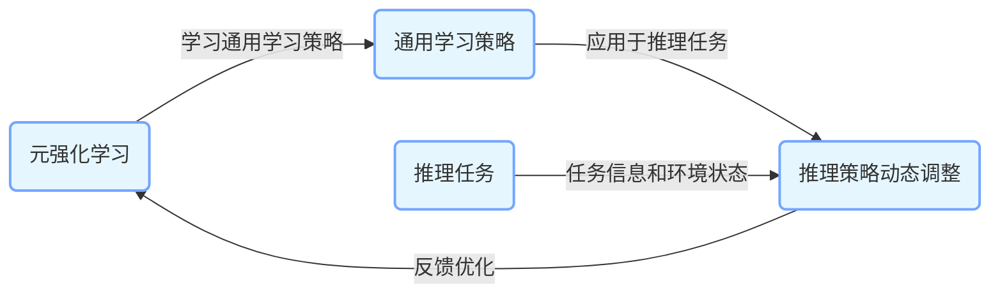

# 元强化学习在推理策略动态调整中的作用

> 关键词：元强化学习、推理策略、动态调整、强化学习算法、策略优化

> 摘要：本文深入探讨了元强化学习在推理策略动态调整中的重要作用。首先介绍了元强化学习和推理策略动态调整的背景知识，明确了研究目的和范围。接着阐述了核心概念及其联系，详细讲解了核心算法原理和具体操作步骤，并给出了相应的Python代码示例。通过数学模型和公式进一步剖析了其内在机制，并举例说明。在项目实战部分，给出了开发环境搭建、源代码实现和代码解读。分析了元强化学习在推理策略动态调整中的实际应用场景，推荐了相关的学习资源、开发工具框架以及论文著作。最后总结了未来发展趋势与挑战，解答了常见问题并提供了扩展阅读和参考资料，旨在为相关领域的研究和实践提供全面而深入的指导。

## 1. 背景介绍 
### 1.1 目的和范围
元强化学习是强化学习领域的一个新兴研究方向，旨在让智能体能够快速适应新的任务和环境。推理策略动态调整则是在智能体执行推理任务时，根据不同的情况实时优化推理策略。本文的目的是深入研究元强化学习如何在推理策略动态调整中发挥作用，探讨其原理、算法和应用。研究范围涵盖了元强化学习的基本概念、核心算法，推理策略动态调整的机制，以及两者结合在实际场景中的应用。

### 1.2 预期读者
本文预期读者包括人工智能、机器学习、强化学习领域的研究人员、开发者，以及对元强化学习和推理策略动态调整感兴趣的技术爱好者。对于有一定编程基础和机器学习知识的读者，能够更好地理解文中的算法原理和代码实现。

### 1.3 文档结构概述
本文将按照以下结构展开：首先介绍核心概念与联系，包括元强化学习和推理策略动态调整的定义和相互关系；接着详细讲解核心算法原理和具体操作步骤，并给出Python代码示例；然后通过数学模型和公式进一步阐述其内在机制；在项目实战部分，介绍开发环境搭建、源代码实现和代码解读；分析实际应用场景；推荐相关的学习资源、开发工具框架和论文著作；最后总结未来发展趋势与挑战，解答常见问题并提供扩展阅读和参考资料。

### 1.4 术语表
#### 1.4.1 核心术语定义
- **元强化学习（Meta-Reinforcement Learning）**：是一种能够让智能体通过学习如何学习，快速适应新任务和环境的强化学习方法。它通过在多个任务上进行训练，学习到一种通用的学习策略，从而能够在面对新任务时更快地收敛到最优策略。
- **推理策略（Inference Strategy）**：指智能体在执行任务时，根据当前的状态和环境信息，选择合适的动作以达到目标的策略。
- **动态调整（Dynamic Adjustment）**：在智能体执行任务的过程中，根据实时的状态变化、奖励反馈等信息，对推理策略进行实时修改和优化的过程。

#### 1.4.2 相关概念解释
- **强化学习（Reinforcement Learning）**：是一种通过智能体与环境进行交互，根据环境反馈的奖励信号来学习最优策略的机器学习方法。智能体在环境中执行动作，环境根据动作给出奖励，智能体的目标是最大化长期累积奖励。
- **策略梯度（Policy Gradient）**：是强化学习中的一种算法，通过直接对策略进行优化，使得策略朝着获得更高奖励的方向更新。
- **元学习（Meta-Learning）**：也称为“学习如何学习”，旨在让模型能够快速适应新的任务和数据，通过在多个任务上进行训练，学习到一种通用的学习能力。

#### 1.4.3 缩略词列表
- **MRL**：Meta-Reinforcement Learning（元强化学习）
- **RL**：Reinforcement Learning（强化学习）
- **PG**：Policy Gradient（策略梯度）

## 2. 核心概念与联系 

### 元强化学习的原理
元强化学习的核心思想是让智能体学习如何学习，即在多个任务上进行训练，使得智能体能够快速适应新的任务。传统的强化学习方法需要在每个新任务上进行大量的训练才能收敛到最优策略，而元强化学习通过学习一个通用的学习策略，能够在面对新任务时更快地调整策略。

元强化学习通常采用基于模型的方法或基于策略的方法。基于模型的方法通过学习环境的动态模型，预测未来的状态和奖励，从而指导策略的更新；基于策略的方法则直接对策略进行优化，使得策略能够在不同的任务上表现良好。

### 推理策略动态调整的机制
推理策略动态调整是指在智能体执行推理任务时，根据实时的状态变化、奖励反馈等信息，对推理策略进行实时修改和优化。其机制主要包括以下几个方面：
- **状态感知**：智能体实时感知当前的状态信息，包括环境状态、自身状态等。
- **奖励评估**：根据环境反馈的奖励信号，评估当前策略的优劣。
- **策略更新**：根据状态感知和奖励评估的结果，对推理策略进行更新。

### 元强化学习与推理策略动态调整的联系
元强化学习为推理策略动态调整提供了一种有效的方法。通过元强化学习，智能体可以学习到一种通用的学习策略，使得在面对不同的推理任务时，能够快速调整推理策略。具体来说，元强化学习可以帮助智能体在以下几个方面实现推理策略的动态调整：
- **快速适应新任务**：当遇到新的推理任务时，元强化学习可以让智能体快速调整策略，以适应新的任务要求。
- **处理动态环境**：在动态环境中，元强化学习可以让智能体实时调整推理策略，以应对环境的变化。
- **优化长期性能**：通过学习通用的学习策略，元强化学习可以让智能体在长期的推理任务中，不断优化推理策略，提高整体性能。

### 文本示意图
元强化学习与推理策略动态调整的关系可以用以下示意图表示：

元强化学习通过在多个任务上进行训练，学习到通用的学习策略。当智能体执行推理任务时，根据当前的任务信息和环境状态，利用通用学习策略对推理策略进行动态调整。推理策略的调整结果反馈给元强化学习，进一步优化通用学习策略。

### Mermaid流程图


## 3. 核心算法原理 & 具体操作步骤 

### 核心算法原理
在元强化学习中，一种常用的算法是基于策略梯度的元强化学习算法，如MAML（Model-Agnostic Meta-Learning）。MAML的核心思想是在多个任务上进行训练，找到一个初始的策略参数，使得在新任务上进行少量的梯度更新后，能够快速收敛到最优策略。

具体来说，MAML的训练过程包括以下两个步骤：
1. **内循环**：在每个任务上，使用当前的策略参数进行一定步数的梯度更新，得到新的策略参数。
2. **外循环**：在所有任务上，对新的策略参数进行评估，计算损失函数，并根据损失函数更新初始的策略参数。

### 具体操作步骤
以下是使用MAML进行元强化学习的具体操作步骤：

1. **初始化策略参数 $\theta$**：随机初始化策略网络的参数 $\theta$。
2. **采样任务**：从任务分布中采样一批任务 $\mathcal{T} = \{T_1, T_2, \cdots, T_n\}$。
3. **内循环**：
    - 对于每个任务 $T_i$：
        - 初始化任务特定的参数 $\theta_i' = \theta$。
        - 在任务 $T_i$ 上进行 $k$ 步的梯度更新：
            - 采样一批轨迹 $\tau_i$，根据策略 $\pi_{\theta_i'}$ 与环境交互。
            - 计算损失函数 $L(\theta_i')$。
            - 使用梯度下降法更新参数：$\theta_i' = \theta_i' - \alpha \nabla_{\theta_i'} L(\theta_i')$，其中 $\alpha$ 是内循环的学习率。
4. **外循环**：
    - 对于每个任务 $T_i$，在更新后的参数 $\theta_i'$ 上计算损失函数 $L(\theta_i')$。
    - 计算所有任务的平均损失 $\bar{L} = \frac{1}{n} \sum_{i=1}^{n} L(\theta_i')$。
    - 使用梯度下降法更新初始参数 $\theta$：$\theta = \theta - \beta \nabla_{\theta} \bar{L}$，其中 $\beta$ 是外循环的学习率。
5. **重复步骤2 - 4**：直到策略收敛。

### Python源代码示例
以下是一个简单的Python代码示例，使用PyTorch实现MAML算法：

```python
import torch
import torch.nn as nn
import torch.optim as optim

# 定义策略网络
class PolicyNetwork(nn.Module):
    def __init__(self, input_dim, output_dim):
        super(PolicyNetwork, self).__init__()
        self.fc1 = nn.Linear(input_dim, 64)
        self.fc2 = nn.Linear(64, output_dim)

    def forward(self, x):
        x = torch.relu(self.fc1(x))
        x = self.fc2(x)
        return x

# 内循环更新
def inner_loop(policy, optimizer, task, num_steps, alpha):
    for _ in range(num_steps):
        states, actions, rewards = task.sample_trajectory(policy)
        loss = -torch.mean(rewards)  # 简单的损失函数
        optimizer.zero_grad()
        loss.backward()
        for p in policy.parameters():
            p.data = p.data - alpha * p.grad.data
    return policy

# 外循环更新
def outer_loop(policy, tasks, num_steps, alpha, beta):
    meta_optimizer = optim.Adam(policy.parameters(), lr=beta)
    meta_loss = 0
    for task in tasks:
        inner_policy = PolicyNetwork(policy.fc1.in_features, policy.fc2.out_features)
        inner_policy.load_state_dict(policy.state_dict())
        inner_optimizer = optim.SGD(inner_policy.parameters(), lr=alpha)
        inner_policy = inner_loop(inner_policy, inner_optimizer, task, num_steps, alpha)
        states, actions, rewards = task.sample_trajectory(inner_policy)
        loss = -torch.mean(rewards)
        meta_loss += loss
    meta_loss /= len(tasks)
    meta_optimizer.zero_grad()
    meta_loss.backward()
    meta_optimizer.step()
    return policy

# 主训练函数
def train(policy, tasks, num_epochs, num_steps, alpha, beta):
    for epoch in range(num_epochs):
        policy = outer_loop(policy, tasks, num_steps, alpha, beta)
        print(f'Epoch {epoch+1}: Policy updated')
    return policy

# 示例使用
input_dim = 10
output_dim = 2
policy = PolicyNetwork(input_dim, output_dim)
tasks = [Task() for _ in range(10)]  # 假设Task是自定义的任务类
num_epochs = 100
num_steps = 5
alpha = 0.01
beta = 0.001
trained_policy = train(policy, tasks, num_epochs, num_steps, alpha, beta)
```

## 4. 数学模型和公式 & 详细讲解 & 举例说明 

### 数学模型和公式
#### 策略梯度
在强化学习中，策略梯度算法的目标是最大化累积奖励的期望，即：
$$J(\theta) = \mathbb{E}_{\tau \sim \pi_{\theta}} \left[ \sum_{t=0}^{T} r(s_t, a_t) \right]$$
其中，$\theta$ 是策略网络的参数，$\pi_{\theta}$ 是基于参数 $\theta$ 的策略，$\tau = (s_0, a_0, r_0, s_1, a_1, r_1, \cdots)$ 是一条轨迹，$s_t$ 是第 $t$ 时刻的状态，$a_t$ 是第 $t$ 时刻的动作，$r(s_t, a_t)$ 是在状态 $s_t$ 执行动作 $a_t$ 获得的奖励。

策略梯度定理表明，策略梯度可以表示为：
$$\nabla_{\theta} J(\theta) = \mathbb{E}_{\tau \sim \pi_{\theta}} \left[ \sum_{t=0}^{T} \nabla_{\theta} \log \pi_{\theta}(a_t | s_t) Q^{\pi_{\theta}}(s_t, a_t) \right]$$
其中，$Q^{\pi_{\theta}}(s_t, a_t)$ 是动作价值函数，表示在状态 $s_t$ 执行动作 $a_t$ 并遵循策略 $\pi_{\theta}$ 所能获得的期望累积奖励。

#### MAML算法
在MAML算法中，内循环的更新公式为：
$$\theta_i' = \theta - \alpha \nabla_{\theta} L(\theta, T_i)$$
其中，$\theta$ 是初始的策略参数，$\theta_i'$ 是在任务 $T_i$ 上更新后的参数，$\alpha$ 是内循环的学习率，$L(\theta, T_i)$ 是在任务 $T_i$ 上的损失函数。

外循环的更新公式为：
$$\theta = \theta - \beta \nabla_{\theta} \sum_{i=1}^{n} L(\theta_i', T_i)$$
其中，$\beta$ 是外循环的学习率，$n$ 是任务的数量。

### 详细讲解
#### 策略梯度
策略梯度算法通过直接对策略进行优化，使得策略朝着获得更高奖励的方向更新。动作价值函数 $Q^{\pi_{\theta}}(s_t, a_t)$ 可以看作是对动作 $a_t$ 在状态 $s_t$ 下的重要性的评估，策略梯度的方向是让策略更倾向于选择 $Q$ 值高的动作。

#### MAML算法
MAML算法的核心思想是找到一个初始的策略参数 $\theta$，使得在新任务上进行少量的梯度更新后，能够快速收敛到最优策略。内循环在每个任务上进行局部的梯度更新，得到任务特定的参数 $\theta_i'$；外循环则根据所有任务的损失函数，对初始参数 $\theta$ 进行更新，使得 $\theta$ 能够在多个任务上表现良好。

### 举例说明
假设我们有两个任务 $T_1$ 和 $T_2$，每个任务的环境和奖励函数不同。我们使用MAML算法进行训练。

1. **初始化策略参数 $\theta$**：随机初始化策略网络的参数。
2. **内循环**：
    - 在任务 $T_1$ 上，使用当前的策略参数 $\theta$ 进行一定步数的梯度更新，得到参数 $\theta_1'$。
    - 在任务 $T_2$ 上，同样使用参数 $\theta$ 进行梯度更新，得到参数 $\theta_2'$。
3. **外循环**：
    - 计算在参数 $\theta_1'$ 下任务 $T_1$ 的损失函数 $L(\theta_1', T_1)$ 和在参数 $\theta_2'$ 下任务 $T_2$ 的损失函数 $L(\theta_2', T_2)$。
    - 计算平均损失 $\bar{L} = \frac{1}{2} (L(\theta_1', T_1) + L(\theta_2', T_2))$。
    - 根据平均损失更新初始参数 $\theta$。

通过不断重复内循环和外循环，最终得到一个能够在多个任务上快速适应的初始策略参数。

## 5. 项目实战：代码实际案例和详细解释说明 

### 5.1  开发环境搭建
#### 安装Python
首先，确保你已经安装了Python 3.6或以上版本。你可以从Python官方网站（https://www.python.org/downloads/）下载并安装。

#### 安装PyTorch
PyTorch是一个常用的深度学习框架，我们可以使用以下命令安装：
```sh
pip install torch torchvision
```

#### 安装其他依赖库
还需要安装一些其他的依赖库，如NumPy、Matplotlib等：
```sh
pip install numpy matplotlib
```

### 5.2  源代码详细实现和代码解读
以下是一个完整的项目实战代码示例，实现了一个简单的元强化学习任务，用于推理策略的动态调整：

```python
import torch
import torch.nn as nn
import torch.optim as optim
import numpy as np
import matplotlib.pyplot as plt

# 定义任务类
class Task:
    def __init__(self):
        self.target = np.random.uniform(-1, 1)

    def sample_trajectory(self, policy):
        states = []
        actions = []
        rewards = []
        state = np.random.uniform(-1, 1, size=(10,))
        for _ in range(10):
            state_tensor = torch.FloatTensor(state)
            action = policy(state_tensor).detach().numpy()
            reward = -np.abs(action - self.target)
            next_state = np.random.uniform(-1, 1, size=(10,))
            states.append(state)
            actions.append(action)
            rewards.append(reward)
            state = next_state
        states = np.array(states)
        actions = np.array(actions)
        rewards = np.array(rewards)
        return states, actions, rewards

# 定义策略网络
class PolicyNetwork(nn.Module):
    def __init__(self, input_dim, output_dim):
        super(PolicyNetwork, self).__init__()
        self.fc1 = nn.Linear(input_dim, 64)
        self.fc2 = nn.Linear(64, output_dim)

    def forward(self, x):
        x = torch.relu(self.fc1(x))
        x = self.fc2(x)
        return x

# 内循环更新
def inner_loop(policy, optimizer, task, num_steps, alpha):
    for _ in range(num_steps):
        states, actions, rewards = task.sample_trajectory(policy)
        rewards_tensor = torch.FloatTensor(rewards)
        loss = -torch.mean(rewards_tensor)
        optimizer.zero_grad()
        loss.backward()
        for p in policy.parameters():
            p.data = p.data - alpha * p.grad.data
    return policy

# 外循环更新
def outer_loop(policy, tasks, num_steps, alpha, beta):
    meta_optimizer = optim.Adam(policy.parameters(), lr=beta)
    meta_loss = 0
    for task in tasks:
        inner_policy = PolicyNetwork(policy.fc1.in_features, policy.fc2.out_features)
        inner_policy.load_state_dict(policy.state_dict())
        inner_optimizer = optim.SGD(inner_policy.parameters(), lr=alpha)
        inner_policy = inner_loop(inner_policy, inner_optimizer, task, num_steps, alpha)
        states, actions, rewards = task.sample_trajectory(inner_policy)
        rewards_tensor = torch.FloatTensor(rewards)
        loss = -torch.mean(rewards_tensor)
        meta_loss += loss
    meta_loss /= len(tasks)
    meta_optimizer.zero_grad()
    meta_loss.backward()
    meta_optimizer.step()
    return policy

# 主训练函数
def train(policy, tasks, num_epochs, num_steps, alpha, beta):
    losses = []
    for epoch in range(num_epochs):
        policy = outer_loop(policy, tasks, num_steps, alpha, beta)
        states, actions, rewards = tasks[0].sample_trajectory(policy)
        rewards_tensor = torch.FloatTensor(rewards)
        loss = -torch.mean(rewards_tensor)
        losses.append(loss.item())
        print(f'Epoch {epoch+1}: Loss = {loss.item()}')
    plt.plot(losses)
    plt.xlabel('Epoch')
    plt.ylabel('Loss')
    plt.show()
    return policy

# 示例使用
input_dim = 10
output_dim = 1
policy = PolicyNetwork(input_dim, output_dim)
tasks = [Task() for _ in range(10)]
num_epochs = 100
num_steps = 5
alpha = 0.01
beta = 0.001
trained_policy = train(policy, tasks, num_epochs, num_steps, alpha, beta)
```

### 5.3  代码解读与分析
#### 任务类 `Task`
`Task` 类表示一个具体的任务，每个任务有一个随机生成的目标值 `target`。`sample_trajectory` 方法用于生成一条轨迹，智能体在轨迹中与环境交互，根据策略选择动作，并获得相应的奖励。

#### 策略网络 `PolicyNetwork`
`PolicyNetwork` 是一个简单的全连接神经网络，用于表示策略。输入是状态，输出是动作。

#### 内循环更新 `inner_loop`
在每个任务上进行一定步数的梯度更新，更新后的参数用于外循环的评估。

#### 外循环更新 `outer_loop`
在所有任务上对更新后的参数进行评估，计算平均损失，并根据平均损失更新初始的策略参数。

#### 主训练函数 `train`
在多个任务上进行多个轮次的训练，记录每一轮的损失，并绘制损失曲线。

通过这个项目实战，我们可以看到元强化学习如何在多个任务上进行训练，使得智能体能够快速适应新的任务，实现推理策略的动态调整。

## 6. 实际应用场景 
### 机器人控制
在机器人控制领域，机器人需要在不同的环境中执行各种任务，如导航、抓取等。元强化学习可以帮助机器人快速适应新的环境和任务，动态调整推理策略。例如，当机器人进入一个新的房间时，它可以利用元强化学习学到的通用策略，快速调整导航策略，找到目标位置。

### 游戏智能体
在游戏中，游戏环境和规则经常会发生变化。元强化学习可以让游戏智能体快速适应新的游戏规则和环境，动态调整策略。例如，在策略游戏中，当游戏地图、资源分布等发生变化时，智能体可以利用元强化学习快速调整策略，制定新的战术。

### 金融投资
在金融投资领域，市场环境复杂多变，投资者需要根据不同的市场情况调整投资策略。元强化学习可以帮助投资者快速适应新的市场环境，动态调整投资策略。例如，当市场出现突发情况时，如经济危机、政策变化等，投资者可以利用元强化学习快速调整投资组合，降低风险。

### 医疗诊断
在医疗诊断中，患者的病情和症状各不相同，医生需要根据患者的具体情况制定诊断和治疗方案。元强化学习可以帮助医生快速适应不同的患者情况，动态调整诊断策略。例如，当遇到罕见病患者时，医生可以利用元强化学习学到的通用策略，快速调整诊断思路，提高诊断准确性。

## 7. 工具和资源推荐
### 7.1 学习资源推荐
#### 7.1.1 书籍推荐
- 《Reinforcement Learning: An Introduction》：这是一本经典的强化学习教材，详细介绍了强化学习的基本概念、算法和应用。
- 《Deep Reinforcement Learning Hands-On》：本书通过实际案例和代码示例，介绍了深度强化学习的实现方法和应用场景。
- 《Meta-Learning: A Survey》：对元学习领域进行了全面的综述，包括元学习的概念、算法和应用。

#### 7.1.2 在线课程
- Coursera上的“Reinforcement Learning Specialization”：由DeepMind的专家授课，系统介绍了强化学习的理论和实践。
- Udemy上的“Deep Reinforcement Learning: Hands-On with Python and PyTorch”：通过实际项目，介绍了深度强化学习的实现方法。
- OpenAI的Spinning Up：提供了强化学习的教程和代码实现，帮助学习者快速上手。

#### 7.1.3 技术博客和网站
- arXiv.org：是一个预印本平台，提供了大量的机器学习和人工智能领域的最新研究成果。
- Medium上的“Towards Data Science”：有许多关于强化学习和元学习的优秀文章。
- OpenAI的官方博客：发布了许多关于强化学习和元学习的研究成果和技术文章。

### 7.2 开发工具框架推荐
#### 7.2.1 IDE和编辑器
- PyCharm：是一个专业的Python集成开发环境，提供了丰富的功能和插件，适合开发机器学习和深度学习项目。
- Jupyter Notebook：是一个交互式的开发环境，适合进行数据分析和模型实验。
- Visual Studio Code：是一个轻量级的代码编辑器，支持多种编程语言和插件，适合快速开发和调试。

#### 7.2.2 调试和性能分析工具
- TensorBoard：是TensorFlow提供的可视化工具，可以用于查看模型的训练过程、损失曲线等。
- PyTorch Profiler：是PyTorch提供的性能分析工具，可以帮助开发者找出代码中的性能瓶颈。
- cProfile：是Python内置的性能分析工具，可以分析代码的运行时间和函数调用次数。

#### 7.2.3 相关框架和库
- PyTorch：是一个开源的深度学习框架，提供了丰富的神经网络模块和优化算法，适合开发强化学习和元学习模型。
- TensorFlow：是另一个常用的深度学习框架，具有广泛的应用和社区支持。
- Gym：是OpenAI开发的一个开源的强化学习环境库，提供了许多标准的强化学习任务和环境。

### 7.3 相关论文著作推荐
#### 7.3.1 经典论文
- “Model-Agnostic Meta-Learning for Fast Adaptation of Deep Networks”：提出了MAML算法，是元强化学习领域的经典论文。
- “Proximal Policy Optimization Algorithms”：提出了PPO算法，是一种高效的策略梯度算法。
- “Asynchronous Methods for Deep Reinforcement Learning”：提出了A3C算法，是一种异步的深度强化学习算法。

#### 7.3.2 最新研究成果
- 关注arXiv.org上的最新论文，了解元强化学习领域的最新研究进展。
- 参加相关的学术会议，如NeurIPS、ICML等，获取最新的研究成果和技术动态。

#### 7.3.3 应用案例分析
- 可以在各大科技公司的博客和研究报告中找到元强化学习在实际应用中的案例分析，如Google、DeepMind等公司的相关文章。

## 8. 总结：未来发展趋势与挑战
### 未来发展趋势
#### 多模态元强化学习
将元强化学习与多模态数据（如图像、语音、文本等）相结合，使得智能体能够在更复杂的环境中进行学习和决策。例如，在机器人导航中，结合图像和语音信息，让机器人更好地理解环境和任务要求。

#### 元强化学习与其他技术的融合
将元强化学习与迁移学习、终身学习等技术相结合，进一步提高智能体的学习能力和适应性。例如，通过迁移学习将在一个任务上学到的知识迁移到另一个相关任务上，加快学习速度。

#### 大规模应用
随着计算能力的提升和数据的丰富，元强化学习将在更多的领域得到大规模应用，如自动驾驶、工业自动化等。在自动驾驶中，元强化学习可以帮助车辆快速适应不同的路况和交通规则。

### 挑战
#### 计算资源需求
元强化学习通常需要大量的计算资源来进行训练，尤其是在处理复杂任务和大规模数据时。如何降低计算成本，提高训练效率是一个亟待解决的问题。

#### 可解释性
元强化学习模型通常是黑盒模型，难以解释其决策过程和行为。在一些对安全性和可靠性要求较高的领域，如医疗诊断、金融投资等，模型的可解释性至关重要。

#### 泛化能力
虽然元强化学习旨在提高智能体的泛化能力，但在实际应用中，智能体仍然可能遇到未见过的任务和环境，导致性能下降。如何进一步提高元强化学习的泛化能力是一个挑战。

## 9. 附录：常见问题与解答
### 元强化学习与传统强化学习有什么区别？
传统强化学习需要在每个新任务上进行大量的训练才能收敛到最优策略，而元强化学习通过在多个任务上进行训练，学习到一种通用的学习策略，能够在面对新任务时更快地调整策略。

### MAML算法的优缺点是什么？
优点：MAML算法具有模型无关性，可以应用于各种不同的深度学习模型；能够快速适应新任务，提高学习效率。缺点：计算复杂度较高，需要大量的计算资源；对任务分布的要求较高，如果任务分布变化较大，可能会影响性能。

### 如何评估元强化学习模型的性能？
可以使用以下指标来评估元强化学习模型的性能：
- **平均奖励**：在多个任务上的平均累积奖励，反映了模型的整体性能。
- **适应速度**：在新任务上达到一定性能所需的训练步数，反映了模型的快速适应能力。
- **泛化能力**：模型在未见过的任务上的性能，反映了模型的泛化能力。

## 10. 扩展阅读 & 参考资料
### 扩展阅读
- 可以阅读更多关于强化学习和元学习的高级算法和技术，如基于模型的元强化学习、基于注意力机制的元强化学习等。
- 关注相关领域的学术会议和期刊，了解最新的研究成果和技术动态。

### 参考资料
- Sutton, R. S., & Barto, A. G. (2018). Reinforcement Learning: An Introduction. MIT press.
- Finn, C., Abbeel, P., & Levine, S. (2017). Model-Agnostic Meta-Learning for Fast Adaptation of Deep Networks. arXiv preprint arXiv:1703.03400.
- Schulman, J., Wolski, F., Dhariwal, P., Radford, A., & Klimov, O. (2017). Proximal Policy Optimization Algorithms. arXiv preprint arXiv:1707.06347.