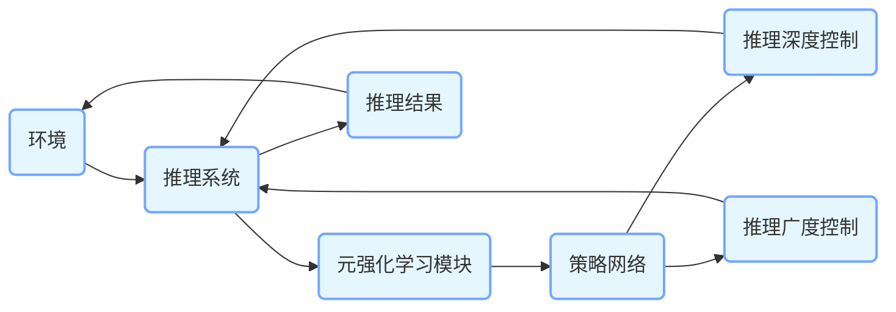

# 元强化学习驱动的自适应推理深度与广度控制

> 关键词：元强化学习、自适应推理、推理深度控制、推理广度控制、深度强化学习

> 摘要：本文围绕元强化学习驱动的自适应推理深度与广度控制展开深入探讨。首先介绍了该研究的背景、目的、预期读者等内容。接着详细阐述了核心概念、联系以及相关的架构和原理，通过 Mermaid 流程图进行直观展示。对核心算法原理使用 Python 代码进行了详细讲解，并给出了数学模型和公式。在项目实战部分，提供了开发环境搭建、源代码实现及解读。同时分析了实际应用场景，推荐了相关的学习资源、开发工具框架和论文著作。最后总结了未来发展趋势与挑战，并给出常见问题解答和扩展阅读参考资料。

## 1. 背景介绍 
### 1.1 目的和范围
在当今复杂的人工智能和机器学习领域，推理过程的效率和准确性至关重要。传统的推理方法往往采用固定的推理深度和广度，难以适应不同的任务和环境变化。元强化学习驱动的自适应推理深度与广度控制旨在解决这一问题，通过元强化学习技术，使推理系统能够根据具体的任务需求和环境反馈，动态地调整推理的深度和广度，从而提高推理的效率和准确性。

本文的范围涵盖了从理论基础到实际应用的多个方面。包括核心概念的介绍、算法原理的讲解、数学模型的构建、项目实战案例的分析以及实际应用场景的探讨等。

### 1.2 预期读者
本文的预期读者主要包括人工智能、机器学习领域的研究人员、工程师和学生。对于希望深入了解元强化学习和自适应推理技术的专业人士，本文提供了系统的理论和实践指导。对于相关专业的学生，本文可以作为学习和研究的参考资料，帮助他们掌握该领域的核心知识和技术。

### 1.3 文档结构概述
本文将按照以下结构进行组织：
1. 背景介绍：介绍研究的目的、范围、预期读者和文档结构概述。
2. 核心概念与联系：阐述元强化学习、自适应推理、推理深度和广度等核心概念，并展示它们之间的联系和架构。
3. 核心算法原理 & 具体操作步骤：详细讲解元强化学习驱动的自适应推理深度与广度控制的核心算法原理，并给出具体的操作步骤和 Python 代码实现。
4. 数学模型和公式 & 详细讲解 & 举例说明：构建数学模型，给出相关公式，并通过具体例子进行详细讲解。
5. 项目实战：代码实际案例和详细解释说明：提供一个项目实战案例，包括开发环境搭建、源代码实现和代码解读。
6. 实际应用场景：分析该技术在不同领域的实际应用场景。
7. 工具和资源推荐：推荐相关的学习资源、开发工具框架和论文著作。
8. 总结：未来发展趋势与挑战：总结该技术的未来发展趋势和面临的挑战。
9. 附录：常见问题与解答：解答读者可能遇到的常见问题。
10. 扩展阅读 & 参考资料：提供扩展阅读的建议和参考资料。

### 1.4 术语表
#### 1.4.1 核心术语定义
- **元强化学习（Meta-Reinforcement Learning）**：一种强化学习的扩展，通过在多个任务上进行学习，使智能体能够快速适应新的任务。元强化学习关注的是学习如何学习，即在不同的任务中获取通用的学习策略。
- **自适应推理（Adaptive Reasoning）**：推理系统能够根据任务需求和环境反馈，动态地调整推理过程，以提高推理的效率和准确性。
- **推理深度（Reasoning Depth）**：在推理过程中，从初始状态到最终结论所经过的推理步骤的数量。较深的推理深度可以获取更复杂的信息，但也会增加计算成本。
- **推理广度（Reasoning Breadth）**：在每一步推理中，同时考虑的可能路径或选择的数量。较广的推理广度可以增加找到最优解的可能性，但也会增加计算复杂度。

#### 1.4.2 相关概念解释
- **强化学习（Reinforcement Learning）**：一种机器学习范式，智能体通过与环境进行交互，根据环境反馈的奖励信号来学习最优的行为策略。
- **策略网络（Policy Network）**：在强化学习中，用于生成智能体行为策略的神经网络。
- **价值网络（Value Network）**：用于估计状态价值的神经网络，帮助智能体评估不同状态的优劣。

#### 1.4.3 缩略词列表
- **MDP（Markov Decision Process）**：马尔可夫决策过程，是强化学习中的一种经典模型。
- **DQN（Deep Q-Network）**：深度 Q 网络，是一种基于深度神经网络的强化学习算法。
- **A2C（Advantage Actor-Critic）**：优势演员 - 评论家算法，是一种基于策略梯度的强化学习算法。

## 2. 核心概念与联系 
### 核心概念原理
元强化学习驱动的自适应推理深度与广度控制涉及到多个核心概念，下面分别进行介绍。

#### 元强化学习
元强化学习的核心思想是在多个任务上进行学习，以获取通用的学习策略。传统的强化学习通常在单个任务上进行训练，智能体需要花费大量的时间和数据来学习最优策略。而元强化学习通过在多个相关任务上进行训练，使智能体能够学习到如何快速适应新的任务。

元强化学习的训练过程可以分为两个阶段：元训练阶段和元测试阶段。在元训练阶段，智能体在多个不同的任务上进行训练，学习到通用的学习策略。在元测试阶段，智能体面对一个新的任务，利用在元训练阶段学习到的策略，快速适应新任务。

#### 自适应推理
自适应推理是指推理系统能够根据任务需求和环境反馈，动态地调整推理过程。在传统的推理方法中，推理深度和广度通常是固定的，无法根据具体情况进行调整。而自适应推理系统可以根据任务的复杂度、可用的计算资源等因素，动态地选择合适的推理深度和广度，以提高推理的效率和准确性。

#### 推理深度和广度
推理深度和广度是推理过程中的两个重要参数。推理深度决定了从初始状态到最终结论所经过的推理步骤的数量，推理广度决定了在每一步推理中同时考虑的可能路径或选择的数量。

较深的推理深度可以获取更复杂的信息，但也会增加计算成本。较广的推理广度可以增加找到最优解的可能性，但也会增加计算复杂度。因此，在实际应用中，需要根据具体情况选择合适的推理深度和广度。

### 架构示意图
下面是元强化学习驱动的自适应推理深度与广度控制的架构示意图：



### 架构解释
- **环境**：提供推理任务的相关信息，如任务描述、初始状态等。
- **推理系统**：根据环境提供的信息进行推理，生成推理结果。
- **元强化学习模块**：在多个任务上进行学习，生成通用的学习策略。
- **策略网络**：根据元强化学习模块学习到的策略，生成推理深度和广度的控制策略。
- **推理深度控制**：根据策略网络的输出，动态调整推理的深度。
- **推理广度控制**：根据策略网络的输出，动态调整推理的广度。
- **推理结果**：推理系统生成的最终结果，反馈给环境。

## 3. 核心算法原理 & 具体操作步骤 
### 核心算法原理
元强化学习驱动的自适应推理深度与广度控制的核心算法基于深度强化学习。我们可以使用 A2C 算法作为元强化学习的基础算法，通过策略网络来生成推理深度和广度的控制策略。

A2C 算法是一种基于策略梯度的强化学习算法，它结合了策略网络和价值网络。策略网络用于生成智能体的行为策略，价值网络用于估计状态的价值。在元强化学习中，策略网络的输入是当前任务的状态信息，输出是推理深度和广度的控制策略。

### 具体操作步骤
1. **环境初始化**：初始化推理环境，包括任务描述、初始状态等。
2. **元强化学习模块初始化**：初始化元强化学习模块，包括策略网络和价值网络的参数。
3. **训练循环**：
    - 在每个训练周期中，从环境中获取当前任务的状态信息。
    - 将状态信息输入到策略网络中，生成推理深度和广度的控制策略。
    - 根据控制策略，调整推理系统的推理深度和广度。
    - 推理系统进行推理，生成推理结果。
    - 根据推理结果，计算奖励信号。
    - 使用奖励信号更新策略网络和价值网络的参数。
4. **测试阶段**：在测试阶段，使用训练好的策略网络，对新的任务进行自适应推理。

### Python 代码实现
```python
import torch
import torch.nn as nn
import torch.optim as optim
import numpy as np

# 定义策略网络
class PolicyNetwork(nn.Module):
    def __init__(self, input_dim, output_dim):
        super(PolicyNetwork, self).__init__()
        self.fc1 = nn.Linear(input_dim, 64)
        self.fc2 = nn.Linear(64, output_dim)

    def forward(self, x):
        x = torch.relu(self.fc1(x))
        x = torch.softmax(self.fc2(x), dim=-1)
        return x

# 定义价值网络
class ValueNetwork(nn.Module):
    def __init__(self, input_dim):
        super(ValueNetwork, self).__init__()
        self.fc1 = nn.Linear(input_dim, 64)
        self.fc2 = nn.Linear(64, 1)

    def forward(self, x):
        x = torch.relu(self.fc1(x))
        x = self.fc2(x)
        return x

# 定义 A2C 算法
class A2C:
    def __init__(self, input_dim, output_dim, lr=0.001):
        self.policy_network = PolicyNetwork(input_dim, output_dim)
        self.value_network = ValueNetwork(input_dim)
        self.policy_optimizer = optim.Adam(self.policy_network.parameters(), lr=lr)
        self.value_optimizer = optim.Adam(self.value_network.parameters(), lr=lr)

    def select_action(self, state):
        state = torch.FloatTensor(state).unsqueeze(0)
        probs = self.policy_network(state)
        action = torch.multinomial(probs, 1).item()
        return action

    def update(self, states, actions, rewards):
        states = torch.FloatTensor(states)
        actions = torch.LongTensor(actions)
        rewards = torch.FloatTensor(rewards)

        # 计算优势函数
        values = self.value_network(states).squeeze()
        advantages = rewards - values

        # 计算策略损失
        probs = self.policy_network(states)
        log_probs = torch.log(probs.gather(1, actions.unsqueeze(1)).squeeze())
        policy_loss = -(log_probs * advantages).mean()

        # 计算价值损失
        value_loss = advantages.pow(2).mean()

        # 更新策略网络
        self.policy_optimizer.zero_grad()
        policy_loss.backward(retain_graph=True)
        self.policy_optimizer.step()

        # 更新价值网络
        self.value_optimizer.zero_grad()
        value_loss.backward()
        self.value_optimizer.step()

# 示例使用
input_dim = 10
output_dim = 5
a2c = A2C(input_dim, output_dim)

# 模拟训练数据
states = np.random.rand(100, input_dim)
actions = np.random.randint(0, output_dim, 100)
rewards = np.random.rand(100)

# 训练
a2c.update(states, actions, rewards)
```

## 4. 数学模型和公式 & 详细讲解 & 举例说明 
### 数学模型
我们可以使用马尔可夫决策过程（MDP）来描述元强化学习驱动的自适应推理深度与广度控制问题。MDP 由一个四元组 $(S, A, P, R)$ 组成，其中：
- $S$ 是状态空间，表示推理系统的所有可能状态。
- $A$ 是动作空间，表示推理深度和广度的所有可能控制策略。
- $P(s'|s, a)$ 是状态转移概率，表示在状态 $s$ 下采取动作 $a$ 后转移到状态 $s'$ 的概率。
- $R(s, a)$ 是奖励函数，表示在状态 $s$ 下采取动作 $a$ 所获得的奖励。

### 策略网络和价值网络
策略网络 $\pi(a|s; \theta)$ 表示在状态 $s$ 下采取动作 $a$ 的概率，其中 $\theta$ 是策略网络的参数。价值网络 $V(s; \phi)$ 表示状态 $s$ 的价值，其中 $\phi$ 是价值网络的参数。

### 策略梯度
策略梯度是用于更新策略网络参数的方法。策略梯度的目标是最大化累积奖励的期望。策略梯度的公式如下：
$$\nabla_{\theta} J(\theta) = \mathbb{E}_{s \sim \rho^{\pi}} \left[ \nabla_{\theta} \log \pi(a|s; \theta) A^{\pi}(s, a) \right]$$
其中，$J(\theta)$ 是策略网络的目标函数，$\rho^{\pi}$ 是策略 $\pi$ 下的状态分布，$A^{\pi}(s, a)$ 是优势函数，表示在状态 $s$ 下采取动作 $a$ 相对于平均动作的优势。

### 优势函数
优势函数可以通过价值网络来估计：
$$A^{\pi}(s, a) = R(s, a) + \gamma V(s'; \phi) - V(s; \phi)$$
其中，$\gamma$ 是折扣因子，$s'$ 是采取动作 $a$ 后转移到的下一个状态。

### 举例说明
假设我们有一个简单的推理任务，状态空间 $S = \{s_1, s_2, s_3\}$，动作空间 $A = \{a_1, a_2\}$。奖励函数 $R(s, a)$ 如下表所示：

| 状态 \ 动作 | $a_1$ | $a_2$ |
| --- | --- | --- |
| $s_1$ | 1 | 2 |
| $s_2$ | 3 | 1 |
| $s_3$ | 2 | 4 |

策略网络 $\pi(a|s; \theta)$ 输出在每个状态下采取每个动作的概率。价值网络 $V(s; \phi)$ 估计每个状态的价值。

在训练过程中，我们根据策略网络选择动作，根据奖励函数计算奖励，然后使用策略梯度和优势函数来更新策略网络和价值网络的参数。

## 5. 项目实战：代码实际案例和详细解释说明 
### 5.1  开发环境搭建
为了实现元强化学习驱动的自适应推理深度与广度控制，我们需要搭建以下开发环境：
- **Python**：建议使用 Python 3.7 及以上版本。
- **PyTorch**：用于构建和训练神经网络。可以使用以下命令安装：
```sh
pip install torch torchvision
```
- **NumPy**：用于处理数值计算。可以使用以下命令安装：
```sh
pip install numpy
```

### 5.2  源代码详细实现和代码解读
以下是一个完整的项目实战代码示例：

```python
import torch
import torch.nn as nn
import torch.optim as optim
import numpy as np

# 定义策略网络
class PolicyNetwork(nn.Module):
    def __init__(self, input_dim, output_dim):
        super(PolicyNetwork, self).__init__()
        self.fc1 = nn.Linear(input_dim, 64)
        self.fc2 = nn.Linear(64, output_dim)

    def forward(self, x):
        x = torch.relu(self.fc1(x))
        x = torch.softmax(self.fc2(x), dim=-1)
        return x

# 定义价值网络
class ValueNetwork(nn.Module):
    def __init__(self, input_dim):
        super(ValueNetwork, self).__init__()
        self.fc1 = nn.Linear(input_dim, 64)
        self.fc2 = nn.Linear(64, 1)

    def forward(self, x):
        x = torch.relu(self.fc1(x))
        x = self.fc2(x)
        return x

# 定义 A2C 算法
class A2C:
    def __init__(self, input_dim, output_dim, lr=0.001):
        self.policy_network = PolicyNetwork(input_dim, output_dim)
        self.value_network = ValueNetwork(input_dim)
        self.policy_optimizer = optim.Adam(self.policy_network.parameters(), lr=lr)
        self.value_optimizer = optim.Adam(self.value_network.parameters(), lr=lr)

    def select_action(self, state):
        state = torch.FloatTensor(state).unsqueeze(0)
        probs = self.policy_network(state)
        action = torch.multinomial(probs, 1).item()
        return action

    def update(self, states, actions, rewards):
        states = torch.FloatTensor(states)
        actions = torch.LongTensor(actions)
        rewards = torch.FloatTensor(rewards)

        # 计算优势函数
        values = self.value_network(states).squeeze()
        advantages = rewards - values

        # 计算策略损失
        probs = self.policy_network(states)
        log_probs = torch.log(probs.gather(1, actions.unsqueeze(1)).squeeze())
        policy_loss = -(log_probs * advantages).mean()

        # 计算价值损失
        value_loss = advantages.pow(2).mean()

        # 更新策略网络
        self.policy_optimizer.zero_grad()
        policy_loss.backward(retain_graph=True)
        self.policy_optimizer.step()

        # 更新价值网络
        self.value_optimizer.zero_grad()
        value_loss.backward()
        self.value_optimizer.step()

# 模拟推理环境
class InferenceEnv:
    def __init__(self, input_dim):
        self.input_dim = input_dim

    def reset(self):
        state = np.random.rand(self.input_dim)
        return state

    def step(self, action):
        # 模拟推理过程，这里简单返回随机奖励
        reward = np.random.rand()
        next_state = np.random.rand(self.input_dim)
        done = False
        return next_state, reward, done

# 主训练循环
def main():
    input_dim = 10
    output_dim = 5
    a2c = A2C(input_dim, output_dim)
    env = InferenceEnv(input_dim)

    num_episodes = 100
    for episode in range(num_episodes):
        state = env.reset()
        states = []
        actions = []
        rewards = []

        for step in range(10):
            action = a2c.select_action(state)
            next_state, reward, done = env.step(action)

            states.append(state)
            actions.append(action)
            rewards.append(reward)

            state = next_state

            if done:
                break

        a2c.update(states, actions, rewards)

        if episode % 10 == 0:
            print(f"Episode {episode}: Total Reward = {sum(rewards)}")

if __name__ == "__main__":
    main()
```

### 代码解读与分析
- **策略网络（PolicyNetwork）**：接收状态信息作为输入，输出在该状态下采取每个动作的概率。使用全连接层和 ReLU 激活函数进行特征提取，最后使用 softmax 函数将输出转换为概率分布。
- **价值网络（ValueNetwork）**：接收状态信息作为输入，输出该状态的价值估计。同样使用全连接层和 ReLU 激活函数进行特征提取，最后输出一个标量值。
- **A2C 算法（A2C）**：实现了 A2C 算法的核心逻辑，包括选择动作和更新策略网络和价值网络的参数。
- **推理环境（InferenceEnv）**：模拟推理过程，提供重置环境和执行动作的接口。
- **主训练循环（main）**：在多个回合中进行训练，每个回合中智能体与环境进行交互，收集状态、动作和奖励信息，然后使用这些信息更新策略网络和价值网络的参数。

## 6. 实际应用场景 
元强化学习驱动的自适应推理深度与广度控制在多个领域有着广泛的应用：

### 自然语言处理
在自然语言处理中，推理过程通常涉及到语义理解、问答系统、机器翻译等任务。自适应推理深度与广度控制可以根据输入文本的复杂度和任务需求，动态地调整推理的深度和广度，提高推理的效率和准确性。例如，在问答系统中，如果问题比较简单，可以选择较浅的推理深度和较窄的推理广度，快速给出答案；如果问题比较复杂，可以选择较深的推理深度和较广的推理广度，进行更深入的推理。

### 计算机视觉
在计算机视觉中，推理过程包括图像分类、目标检测、语义分割等任务。自适应推理深度与广度控制可以根据图像的内容和任务需求，动态地调整推理的深度和广度。例如，在图像分类任务中，如果图像的特征比较明显，可以选择较浅的推理深度和较窄的推理广度，快速进行分类；如果图像的特征比较复杂，可以选择较深的推理深度和较广的推理广度，提高分类的准确性。

### 机器人控制
在机器人控制中，推理过程涉及到路径规划、动作决策等任务。自适应推理深度与广度控制可以根据机器人的环境和任务需求，动态地调整推理的深度和广度。例如，在机器人路径规划中，如果环境比较简单，可以选择较浅的推理深度和较窄的推理广度，快速规划出路径；如果环境比较复杂，可以选择较深的推理深度和较广的推理广度，找到更优的路径。

### 金融领域
在金融领域，推理过程包括风险评估、投资决策等任务。自适应推理深度与广度控制可以根据市场的变化和投资目标，动态地调整推理的深度和广度。例如，在风险评估中，如果市场情况比较稳定，可以选择较浅的推理深度和较窄的推理广度，快速评估风险；如果市场情况比较复杂，可以选择较深的推理深度和较广的推理广度，进行更全面的风险评估。

## 7. 工具和资源推荐
### 7.1 学习资源推荐
#### 7.1.1 书籍推荐
- 《Reinforcement Learning: An Introduction》：由 Richard S. Sutton 和 Andrew G. Barto 所著，是强化学习领域的经典教材，详细介绍了强化学习的基本概念、算法和应用。
- 《Deep Learning》：由 Ian Goodfellow、Yoshua Bengio 和 Aaron Courville 所著，是深度学习领域的权威书籍，涵盖了深度学习的各个方面，包括神经网络、优化算法、卷积神经网络等。
- 《Artificial Intelligence: A Modern Approach》：由 Stuart Russell 和 Peter Norvig 所著，是人工智能领域的经典教材，全面介绍了人工智能的各个领域，包括搜索算法、知识表示、推理、机器学习等。

#### 7.1.2 在线课程
- **Coursera - Reinforcement Learning Specialization**：由 University of Alberta 提供的强化学习专项课程，包括四门课程，涵盖了强化学习的基础知识、算法和应用。
- **edX - Deep Learning MicroMasters Program**：由 MIT 提供的深度学习微硕士项目，包括多门课程，深入介绍了深度学习的各个方面。
- **Udemy - Artificial Intelligence A-Z™: Learn How To Build An AI**：由 Kirill Eremenko 和 Hadelin de Ponteves 提供的人工智能课程，包括机器学习、深度学习、强化学习等多个方面的内容。

#### 7.1.3 技术博客和网站
- **OpenAI Blog**：OpenAI 官方博客，发布了许多关于人工智能、强化学习的最新研究成果和技术文章。
- **Medium - Towards Data Science**：一个专注于数据科学和人工智能的技术博客平台，有许多优秀的技术文章和教程。
- **ArXiv.org**：一个预印本服务器，提供了大量的学术论文，包括人工智能、机器学习、强化学习等领域的最新研究成果。

### 7.2 开发工具框架推荐
#### 7.2.1 IDE和编辑器
- **PyCharm**：一款专门为 Python 开发设计的集成开发环境（IDE），提供了丰富的功能，如代码编辑、调试、版本控制等。
- **Jupyter Notebook**：一个交互式的开发环境，适合进行数据分析、模型训练和实验。可以方便地将代码、文本和可视化结果整合在一起。
- **Visual Studio Code**：一款轻量级的代码编辑器，支持多种编程语言，包括 Python。具有丰富的插件生态系统，可以扩展其功能。

#### 7.2.2 调试和性能分析工具
- **PyTorch Profiler**：PyTorch 提供的性能分析工具，可以帮助开发者分析模型的性能瓶颈，优化代码。
- **TensorBoard**：TensorFlow 提供的可视化工具，也可以与 PyTorch 结合使用。可以用于可视化训练过程中的损失函数、准确率等指标。
- **pdb**：Python 内置的调试器，可以帮助开发者调试代码，定位问题。

#### 7.2.3 相关框架和库
- **PyTorch**：一个开源的深度学习框架，提供了丰富的神经网络层和优化算法，支持 GPU 加速。
- **TensorFlow**：另一个流行的深度学习框架，具有强大的分布式训练和部署能力。
- **OpenAI Gym**：一个用于开发和比较强化学习算法的工具包，提供了许多标准的环境和评估指标。

### 7.3 相关论文著作推荐
#### 7.3.1 经典论文
- **"Playing Atari with Deep Reinforcement Learning"**：由 Volodymyr Mnih 等人发表的论文，提出了深度 Q 网络（DQN）算法，开启了深度强化学习的时代。
- **"Asynchronous Methods for Deep Reinforcement Learning"**：由 Volodymyr Mnih 等人发表的论文，提出了异步优势演员 - 评论家（A3C）算法，提高了强化学习的训练效率。
- **"Model-Agnostic Meta-Learning for Fast Adaptation of Deep Networks"**：由 Chelsea Finn 等人发表的论文，提出了模型无关元学习（MAML）算法，是元强化学习领域的经典论文。

#### 7.3.2 最新研究成果
- 可以关注 ArXiv.org 上关于元强化学习和自适应推理的最新研究论文，了解该领域的最新进展。
- 参加相关的学术会议，如 NeurIPS、ICML、AAAI 等，获取最新的研究成果和技术报告。

#### 7.3.3 应用案例分析
- 可以阅读一些关于元强化学习和自适应推理在实际应用中的案例分析文章，了解该技术在不同领域的应用场景和实现方法。
- 参考一些开源项目的文档和代码，学习如何将该技术应用到实际项目中。

## 8. 总结：未来发展趋势与挑战
### 未来发展趋势
- **更高效的算法**：随着研究的深入，未来可能会出现更高效的元强化学习算法，能够更快地适应新的任务，提高推理的效率和准确性。
- **跨领域应用**：元强化学习驱动的自适应推理深度与广度控制技术将在更多的领域得到应用，如医疗、交通、能源等，为这些领域带来更智能的解决方案。
- **与其他技术的融合**：该技术可能会与其他人工智能技术，如深度学习、知识图谱等进行融合，实现更强大的推理能力。

### 挑战
- **数据需求**：元强化学习通常需要大量的训练数据，如何获取和处理这些数据是一个挑战。
- **计算资源**：深度强化学习算法的训练通常需要大量的计算资源，如何在有限的计算资源下实现高效的训练是一个挑战。
- **可解释性**：元强化学习和深度强化学习模型通常是黑盒模型，如何提高模型的可解释性，让用户理解模型的决策过程是一个挑战。

## 9. 附录：常见问题与解答
### 问题 1：元强化学习和传统强化学习有什么区别？
元强化学习关注的是学习如何学习，即在多个任务上进行学习，获取通用的学习策略。而传统强化学习通常在单个任务上进行训练，智能体需要花费大量的时间和数据来学习最优策略。元强化学习可以使智能体在面对新的任务时，能够快速适应。

### 问题 2：如何选择合适的推理深度和广度？
推理深度和广度的选择需要根据具体的任务需求和环境反馈来决定。一般来说，如果任务比较简单，可以选择较浅的推理深度和较窄的推理广度；如果任务比较复杂，可以选择较深的推理深度和较广的推理广度。在实际应用中，可以通过元强化学习来动态地调整推理深度和广度。

### 问题 3：A2C 算法有什么优点？
A2C 算法结合了策略网络和价值网络，具有以下优点：
- **训练效率高**：A2C 算法采用了单线程的训练方式，避免了多线程训练中的通信开销，提高了训练效率。
- **稳定性好**：通过引入价值网络，A2C 算法可以更准确地估计状态的价值，减少了策略梯度的方差，提高了训练的稳定性。
- **易于实现**：A2C 算法的实现相对简单，不需要复杂的超参数调整。

### 问题 4：如何评估元强化学习驱动的自适应推理深度与广度控制的性能？
可以使用以下指标来评估该技术的性能：
- **推理准确率**：衡量推理结果的准确性。
- **推理效率**：衡量推理过程的时间和计算资源消耗。
- **适应性**：衡量智能体在不同任务和环境下的适应能力。

## 10. 扩展阅读 & 参考资料
### 扩展阅读
- 深入研究元强化学习的其他算法，如 MAML、Reptile 等。
- 学习强化学习的其他应用领域，如自动驾驶、游戏等。
- 关注人工智能领域的最新研究成果和技术趋势。

### 参考资料
- Richard S. Sutton 和 Andrew G. Barto, 《Reinforcement Learning: An Introduction》
- Ian Goodfellow、Yoshua Bengio 和 Aaron Courville, 《Deep Learning》
- Stuart Russell 和 Peter Norvig, 《Artificial Intelligence: A Modern Approach》
- Volodymyr Mnih 等人, "Playing Atari with Deep Reinforcement Learning"
- Volodymyr Mnih 等人, "Asynchronous Methods for Deep Reinforcement Learning"
- Chelsea Finn 等人, "Model-Agnostic Meta-Learning for Fast Adaptation of Deep Networks"
- OpenAI Blog: https://openai.com/blog/
- Medium - Towards Data Science: https://towardsdatascience.com/
- ArXiv.org: https://arxiv.org/