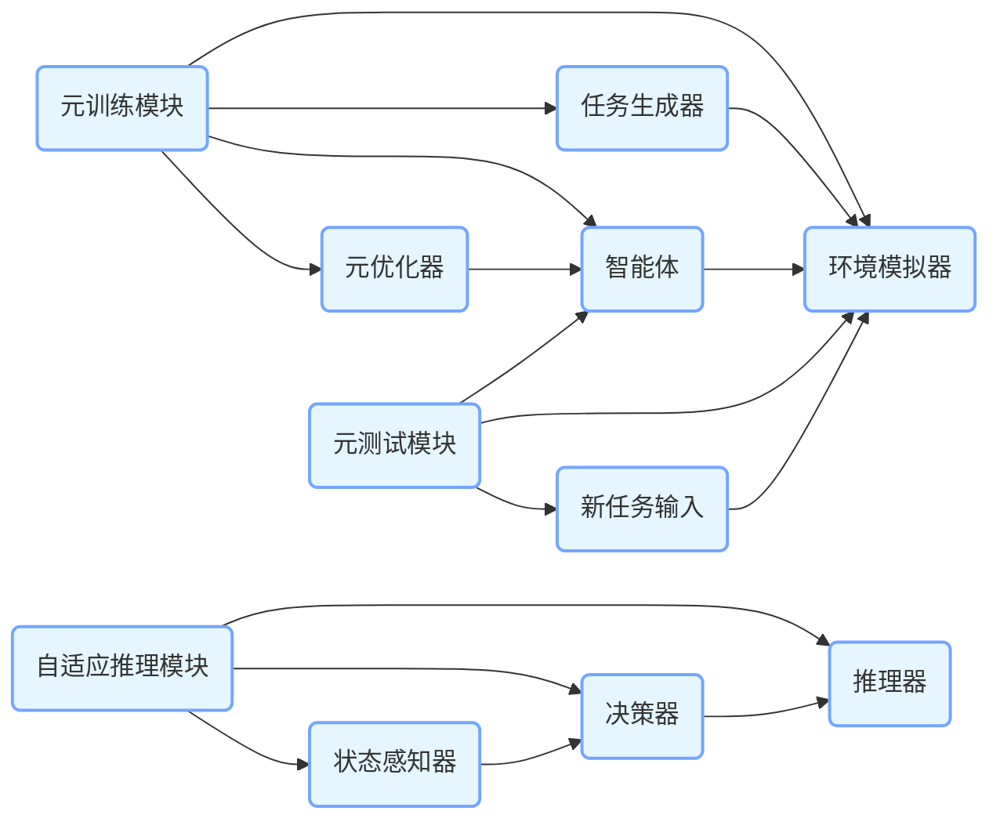

# 元强化学习驱动的自适应推理策略生成

> 关键词：元强化学习、自适应推理策略、策略生成、智能决策、强化学习算法

> 摘要：本文聚焦于元强化学习驱动的自适应推理策略生成这一前沿技术领域。详细阐述了元强化学习和自适应推理策略的核心概念及其联系，深入剖析了相关核心算法原理，并给出具体操作步骤，同时结合数学模型和公式进行详细讲解与举例说明。通过项目实战，展示了代码的实际案例及详细解释。探讨了该技术在不同场景下的实际应用，推荐了学习所需的工具和资源，最后对未来发展趋势与挑战进行总结，旨在为相关领域的研究者和开发者提供全面而深入的技术参考。

## 1. 背景介绍 
### 1.1 目的和范围
在当今复杂多变的环境中，智能系统需要具备快速适应新任务和环境变化的能力。传统的强化学习方法在处理新任务时往往需要大量的训练数据和时间，难以满足实时性和高效性的要求。元强化学习作为一种新兴的技术，旨在通过学习如何学习，使智能体能够在不同的任务和环境中快速适应并生成有效的推理策略。本文的目的是深入探讨元强化学习驱动的自适应推理策略生成技术，包括其核心概念、算法原理、数学模型、实际应用等方面，为该领域的研究和应用提供理论和实践指导。

本文的范围涵盖了元强化学习和自适应推理策略生成的基本概念、核心算法、数学模型、项目实战、实际应用场景以及相关的工具和资源推荐等方面。通过对这些内容的详细阐述，读者可以全面了解该技术的原理和应用方法，为进一步的研究和开发奠定基础。

### 1.2 预期读者
本文的预期读者包括人工智能、机器学习、强化学习等领域的研究者、开发者和学生。对于对元强化学习和自适应推理策略生成技术感兴趣的初学者，本文可以作为入门指南，帮助他们了解该技术的基本概念和原理；对于有一定经验的研究者和开发者，本文可以提供深入的技术分析和实践案例，为他们的研究和开发工作提供参考。

### 1.3 文档结构概述
本文共分为十个部分，具体结构如下：
1. 背景介绍：介绍本文的目的和范围、预期读者、文档结构概述以及相关术语表。
2. 核心概念与联系：阐述元强化学习和自适应推理策略的核心概念，以及它们之间的联系，并给出相应的文本示意图和 Mermaid 流程图。
3. 核心算法原理 & 具体操作步骤：详细介绍元强化学习驱动的自适应推理策略生成的核心算法原理，并给出具体的操作步骤，同时使用 Python 源代码进行详细阐述。
4. 数学模型和公式 & 详细讲解 & 举例说明：给出元强化学习和自适应推理策略生成的数学模型和公式，并进行详细讲解和举例说明。
5. 项目实战：代码实际案例和详细解释说明：通过一个具体的项目实战，展示元强化学习驱动的自适应推理策略生成的代码实际案例，并进行详细的解释说明。
6. 实际应用场景：探讨元强化学习驱动的自适应推理策略生成技术在不同场景下的实际应用。
7. 工具和资源推荐：推荐学习元强化学习和自适应推理策略生成所需的工具和资源，包括学习资源、开发工具框架和相关论文著作等。
8. 总结：未来发展趋势与挑战：对元强化学习驱动的自适应推理策略生成技术的未来发展趋势和挑战进行总结。
9. 附录：常见问题与解答：提供一些常见问题的解答，帮助读者更好地理解本文的内容。
10. 扩展阅读 & 参考资料：提供一些扩展阅读的建议和相关的参考资料，供读者进一步深入研究。

### 1.4 术语表
#### 1.4.1 核心术语定义
- **元强化学习（Meta-Reinforcement Learning）**：一种学习如何学习的强化学习方法，通过在多个任务上进行训练，使智能体能够快速适应新任务。
- **自适应推理策略（Adaptive Inference Strategy）**：智能体根据当前环境和任务的变化，自动调整推理过程和策略的能力。
- **策略生成（Policy Generation）**：根据给定的环境和任务，生成智能体的行为策略的过程。
- **智能体（Agent）**：在环境中执行动作并与环境进行交互的实体。
- **环境（Environment）**：智能体所处的外部世界，提供状态信息和奖励信号。
- **状态（State）**：环境在某一时刻的描述，用于表示智能体所处的情况。
- **动作（Action）**：智能体在某一状态下可以执行的操作。
- **奖励（Reward）**：环境根据智能体的动作给予的反馈信号，用于评价智能体的行为好坏。

#### 1.4.2 相关概念解释
- **强化学习（Reinforcement Learning）**：一种通过智能体与环境进行交互，以最大化累积奖励为目标的机器学习方法。
- **元学习（Meta-Learning）**：一种学习如何学习的方法，旨在使模型能够快速适应新任务，减少训练时间和数据需求。
- **推理（Inference）**：根据已知信息得出结论的过程，在智能系统中通常指根据输入数据生成输出结果的过程。

#### 1.4.3 缩略词列表
- **MRL**：Meta-Reinforcement Learning（元强化学习）
- **AIS**：Adaptive Inference Strategy（自适应推理策略）
- **RL**：Reinforcement Learning（强化学习）

## 2. 核心概念与联系 
### 核心概念原理
#### 元强化学习
元强化学习是强化学习和元学习的结合。传统的强化学习方法在每个新任务上都需要从头开始训练，而元强化学习通过在多个相关任务上进行训练，学习到一种通用的学习能力。这种能力使得智能体能够在面对新任务时，利用之前学习到的经验，快速调整自己的策略，以适应新的环境和任务要求。

元强化学习的核心思想是在元训练阶段，智能体在多个不同的任务上进行学习，通过优化元目标函数，学习到一种能够快速适应新任务的初始化策略或学习规则。在元测试阶段，当遇到新任务时，智能体可以基于之前学习到的知识，快速调整自己的策略，以获得更好的性能。

#### 自适应推理策略
自适应推理策略是指智能体在推理过程中，能够根据当前环境和任务的变化，自动调整推理的过程和策略。在实际应用中，环境和任务往往是动态变化的，传统的固定推理策略可能无法适应这种变化，导致推理结果不准确或效率低下。自适应推理策略通过实时监测环境和任务的变化，动态调整推理的参数、算法或步骤，以提高推理的准确性和效率。

自适应推理策略的实现通常需要结合智能体的感知能力、决策能力和学习能力。智能体通过感知环境的状态信息，利用决策机制选择合适的推理策略，并通过学习机制不断优化推理策略，以适应环境和任务的变化。

### 架构的文本示意图
元强化学习驱动的自适应推理策略生成的架构主要包括元训练模块、元测试模块和自适应推理模块。

在元训练模块中，智能体在多个不同的任务上进行训练，学习到一种通用的学习能力。元训练模块包括任务生成器、环境模拟器、智能体和元优化器。任务生成器生成不同的任务，环境模拟器模拟任务的环境，智能体在环境中执行动作并与环境进行交互，元优化器根据智能体的表现优化元目标函数，学习到一种能够快速适应新任务的初始化策略或学习规则。

在元测试模块中，当遇到新任务时，智能体基于之前学习到的知识，快速调整自己的策略。元测试模块包括新任务输入、环境模拟器和智能体。新任务输入提供新任务的信息，环境模拟器模拟新任务的环境，智能体根据之前学习到的初始化策略或学习规则，快速调整自己的策略，以适应新任务。

在自适应推理模块中，智能体在推理过程中，根据当前环境和任务的变化，自动调整推理的过程和策略。自适应推理模块包括状态感知器、决策器和推理器。状态感知器实时监测环境的状态信息，决策器根据状态信息选择合适的推理策略，推理器根据选择的推理策略进行推理。

### Mermaid 流程图


## 3. 核心算法原理 & 具体操作步骤 
### 核心算法原理
元强化学习驱动的自适应推理策略生成的核心算法主要基于模型无关的元强化学习方法，如 MAML（Model-Agnostic Meta-Learning）和 RL^2（Recurrent Reinfocement Learning）。

#### MAML 算法原理
MAML 算法的核心思想是通过在多个任务上进行训练，找到一个通用的初始化参数，使得在新任务上进行少量的梯度更新后，能够快速获得较好的性能。具体来说，MAML 算法分为两个阶段：元训练阶段和元测试阶段。

在元训练阶段，对于每个任务，智能体首先使用当前的初始化参数进行一次或多次梯度更新，得到一个新的参数。然后，使用这个新的参数在该任务上进行评估，计算损失函数。最后，将所有任务的损失函数相加，使用元优化器对初始化参数进行更新。

在元测试阶段，当遇到新任务时，智能体使用之前学习到的初始化参数，在新任务上进行少量的梯度更新，得到一个适应新任务的参数。然后，使用这个适应新任务的参数进行推理。

#### RL^2 算法原理
RL^2 算法通过引入循环神经网络（RNN）来学习智能体的策略。RNN 可以记住智能体之前的经验，使得智能体能够在不同的任务和环境中快速适应。具体来说，RL^2 算法将智能体的策略表示为一个 RNN，RNN 的输入包括当前状态和之前的动作、奖励等信息，输出为当前动作的概率分布。

在训练过程中，智能体在多个任务上进行训练，RNN 不断学习如何根据之前的经验和当前状态选择合适的动作。在测试过程中，当遇到新任务时，智能体使用之前学习到的 RNN 策略，根据当前状态和之前的经验选择合适的动作。

### 具体操作步骤
#### MAML 算法操作步骤
1. **初始化参数**：随机初始化智能体的参数 $\theta$。
2. **元训练循环**：
    - 从任务分布 $\mathcal{T}$ 中采样一组任务 $\{T_1, T_2, \cdots, T_n\}$。
    - 对于每个任务 $T_i$：
        - 在任务 $T_i$ 上使用当前参数 $\theta$ 进行一次或多次梯度更新，得到新的参数 $\theta_i'$。
        - 使用参数 $\theta_i'$ 在任务 $T_i$ 上进行评估，计算损失函数 $L_{T_i}(\theta_i')$。
    - 计算所有任务的损失函数之和 $L(\theta) = \sum_{i=1}^{n} L_{T_i}(\theta_i')$。
    - 使用元优化器（如 Adam）对参数 $\theta$ 进行更新，使得 $L(\theta)$ 最小化。
3. **元测试**：
    - 当遇到新任务 $T_{new}$ 时，使用之前学习到的参数 $\theta$ 在任务 $T_{new}$ 上进行少量的梯度更新，得到适应新任务的参数 $\theta_{new}$。
    - 使用参数 $\theta_{new}$ 在任务 $T_{new}$ 上进行推理。

#### RL^2 算法操作步骤
1. **初始化 RNN 网络**：随机初始化 RNN 网络的参数 $\theta$。
2. **训练循环**：
    - 从任务分布 $\mathcal{T}$ 中采样一组任务 $\{T_1, T_2, \cdots, T_n\}$。
    - 对于每个任务 $T_i$：
        - 初始化 RNN 的隐藏状态 $h_0$。
        - 在任务 $T_i$ 上进行交互，根据当前状态 $s_t$ 和隐藏状态 $h_{t-1}$，使用 RNN 网络计算动作 $a_t$ 的概率分布 $\pi(a_t|s_t, h_{t-1})$。
        - 执行动作 $a_t$，得到奖励 $r_t$ 和下一个状态 $s_{t+1}$。
        - 更新隐藏状态 $h_t$。
        - 计算损失函数 $L_{T_i}(\theta)$，如策略梯度损失。
    - 计算所有任务的损失函数之和 $L(\theta) = \sum_{i=1}^{n} L_{T_i}(\theta)$。
    - 使用优化器（如 Adam）对参数 $\theta$ 进行更新，使得 $L(\theta)$ 最小化。
3. **测试**：
    - 当遇到新任务 $T_{new}$ 时，初始化 RNN 的隐藏状态 $h_0$。
    - 在任务 $T_{new}$ 上进行交互，根据当前状态 $s_t$ 和隐藏状态 $h_{t-1}$，使用 RNN 网络计算动作 $a_t$ 的概率分布 $\pi(a_t|s_t, h_{t-1})$。
    - 选择动作 $a_t$ 并执行，得到奖励 $r_t$ 和下一个状态 $s_{t+1}$。
    - 更新隐藏状态 $h_t$。

### Python 源代码详细阐述
以下是一个简单的 MAML 算法的 Python 实现示例：

```python
import torch
import torch.nn as nn
import torch.optim as optim

# 定义一个简单的神经网络模型
class SimpleModel(nn.Module):
    def __init__(self, input_size, output_size):
        super(SimpleModel, self).__init__()
        self.fc = nn.Linear(input_size, output_size)

    def forward(self, x):
        return self.fc(x)

# 元训练函数
def meta_train(model, meta_optimizer, tasks, inner_lr, num_inner_steps):
    meta_loss = 0
    for task in tasks:
        # 复制模型参数
        fast_weights = list(model.parameters())
        for _ in range(num_inner_steps):
            # 计算损失
            loss = task_loss(model, fast_weights, task)
            # 计算梯度
            grads = torch.autograd.grad(loss, fast_weights)
            # 更新参数
            fast_weights = [w - inner_lr * g for w, g in zip(fast_weights, grads)]
        # 计算元损失
        meta_loss += task_loss(model, fast_weights, task)
    meta_loss /= len(tasks)
    # 元优化
    meta_optimizer.zero_grad()
    meta_loss.backward()
    meta_optimizer.step()
    return meta_loss

# 计算任务损失
def task_loss(model, weights, task):
    inputs, targets = task
    outputs = model.forward(inputs)
    criterion = nn.MSELoss()
    loss = criterion(outputs, targets)
    return loss

# 示例任务生成
def generate_tasks(num_tasks, input_size, output_size):
    tasks = []
    for _ in range(num_tasks):
        inputs = torch.randn(10, input_size)
        targets = torch.randn(10, output_size)
        tasks.append((inputs, targets))
    return tasks

# 主函数
if __name__ == "__main__":
    input_size = 10
    output_size = 1
    model = SimpleModel(input_size, output_size)
    meta_optimizer = optim.Adam(model.parameters(), lr=0.001)
    inner_lr = 0.01
    num_inner_steps = 5
    num_tasks = 10
    tasks = generate_tasks(num_tasks, input_size, output_size)
    for epoch in range(100):
        meta_loss = meta_train(model, meta_optimizer, tasks, inner_lr, num_inner_steps)
        print(f"Epoch {epoch}: Meta Loss = {meta_loss.item()}")
```

## 4. 数学模型和公式 & 详细讲解 & 举例说明 
### 数学模型和公式
#### MAML 数学模型
在 MAML 算法中，设 $\theta$ 为模型的初始化参数，$T$ 为一个任务，$L_T(\theta)$ 为在任务 $T$ 上的损失函数。在元训练阶段，对于每个任务 $T$，首先使用当前参数 $\theta$ 进行一次或多次梯度更新，得到新的参数 $\theta'$：

$$\theta' = \theta - \alpha \nabla_{\theta} L_T(\theta)$$

其中，$\alpha$ 为内循环学习率。然后，使用新的参数 $\theta'$ 在任务 $T$ 上进行评估，计算损失函数 $L_T(\theta')$。元目标函数为所有任务的损失函数之和：

$$\mathcal{L}(\theta) = \sum_{T \in \mathcal{T}} L_T(\theta')$$

其中，$\mathcal{T}$ 为任务分布。最后，使用元优化器对参数 $\theta$ 进行更新，使得 $\mathcal{L}(\theta)$ 最小化：

$$\theta \leftarrow \theta - \beta \nabla_{\theta} \mathcal{L}(\theta)$$

其中，$\beta$ 为元学习率。

#### RL^2 数学模型
在 RL^2 算法中，设 $s_t$ 为时刻 $t$ 的状态，$a_t$ 为时刻 $t$ 的动作，$r_t$ 为时刻 $t$ 的奖励，$h_t$ 为 RNN 在时刻 $t$ 的隐藏状态。RNN 的输入为 $[s_t, a_{t-1}, r_{t-1}]$，输出为动作 $a_t$ 的概率分布 $\pi(a_t|s_t, h_{t-1})$：

$$h_t = \text{RNN}([s_t, a_{t-1}, r_{t-1}], h_{t-1})$$

$$\pi(a_t|s_t, h_{t-1}) = \text{Softmax}(W h_t + b)$$

其中，$W$ 和 $b$ 为 RNN 的输出层参数。策略梯度损失函数为：

$$L(\theta) = - \sum_{t=0}^{T-1} \log \pi(a_t|s_t, h_{t-1}) A_t$$

其中，$A_t$ 为优势函数，表示在状态 $s_t$ 下执行动作 $a_t$ 相对于平均动作的优势。

### 详细讲解
#### MAML 讲解
MAML 算法的核心思想是通过在多个任务上进行训练，找到一个通用的初始化参数，使得在新任务上进行少量的梯度更新后，能够快速获得较好的性能。在元训练阶段，通过内循环更新得到新的参数 $\theta'$，然后使用 $\theta'$ 计算元损失。元损失反映了在新任务上进行少量梯度更新后的性能。通过最小化元损失，可以使得初始化参数 $\theta$ 更适合快速适应新任务。

#### RL^2 讲解
RL^2 算法通过引入 RNN 来学习智能体的策略。RNN 可以记住智能体之前的经验，使得智能体能够在不同的任务和环境中快速适应。在训练过程中，RNN 不断学习如何根据之前的经验和当前状态选择合适的动作。策略梯度损失函数通过最大化优势函数来优化策略，使得智能体能够选择更优的动作。

### 举例说明
#### MAML 举例
假设我们有一个回归任务，输入为一维向量，输出为一维标量。我们有多个不同的回归任务，每个任务的数据集不同。在元训练阶段，我们从任务分布中采样多个任务，对于每个任务，首先使用当前的初始化参数进行一次梯度更新，得到新的参数。然后，使用新的参数在该任务上进行评估，计算损失函数。最后，将所有任务的损失函数相加，使用元优化器对初始化参数进行更新。在元测试阶段，当遇到新的回归任务时，我们使用之前学习到的初始化参数，在新任务上进行少量的梯度更新，得到适应新任务的参数。然后，使用这个适应新任务的参数进行回归预测。

#### RL^2 举例
假设我们有一个机器人导航任务，机器人需要在不同的环境中找到目标位置。在训练过程中，我们让机器人在多个不同的环境中进行导航，每次导航的起点和目标位置都不同。机器人使用 RNN 作为策略网络，根据当前状态和之前的经验选择动作。在每个时间步，机器人执行动作，得到奖励和下一个状态，并更新 RNN 的隐藏状态。通过不断地训练，RNN 学习到如何根据之前的经验和当前状态选择合适的动作。在测试过程中，当机器人遇到新的环境时，它使用之前学习到的 RNN 策略，根据当前状态和之前的经验选择动作，以找到目标位置。

## 5. 项目实战：代码实际案例和详细解释说明 
### 5.1  开发环境搭建
#### 安装 Python
首先，需要安装 Python 环境。建议使用 Python 3.7 及以上版本。可以从 Python 官方网站（https://www.python.org/downloads/）下载并安装适合自己操作系统的 Python 版本。

#### 安装深度学习框架
本文使用 PyTorch 作为深度学习框架。可以使用以下命令安装 PyTorch：
```sh
pip install torch torchvision
```

#### 安装其他依赖库
还需要安装一些其他的依赖库，如 NumPy、Matplotlib 等。可以使用以下命令安装：
```sh
pip install numpy matplotlib
```

### 5.2  源代码详细实现和代码解读
以下是一个基于 MAML 算法的元强化学习项目实战代码：

```python
import torch
import torch.nn as nn
import torch.optim as optim
import numpy as np
import matplotlib.pyplot as plt

# 定义一个简单的神经网络模型
class SimpleModel(nn.Module):
    def __init__(self, input_size, output_size):
        super(SimpleModel, self).__init__()
        self.fc = nn.Linear(input_size, output_size)

    def forward(self, x):
        return self.fc(x)

# 元训练函数
def meta_train(model, meta_optimizer, tasks, inner_lr, num_inner_steps):
    meta_loss = 0
    for task in tasks:
        # 复制模型参数
        fast_weights = list(model.parameters())
        for _ in range(num_inner_steps):
            # 计算损失
            loss = task_loss(model, fast_weights, task)
            # 计算梯度
            grads = torch.autograd.grad(loss, fast_weights)
            # 更新参数
            fast_weights = [w - inner_lr * g for w, g in zip(fast_weights, grads)]
        # 计算元损失
        meta_loss += task_loss(model, fast_weights, task)
    meta_loss /= len(tasks)
    # 元优化
    meta_optimizer.zero_grad()
    meta_loss.backward()
    meta_optimizer.step()
    return meta_loss

# 计算任务损失
def task_loss(model, weights, task):
    inputs, targets = task
    outputs = model.forward(inputs)
    criterion = nn.MSELoss()
    loss = criterion(outputs, targets)
    return loss

# 示例任务生成
def generate_tasks(num_tasks, input_size, output_size):
    tasks = []
    for _ in range(num_tasks):
        inputs = torch.randn(10, input_size)
        targets = torch.randn(10, output_size)
        tasks.append((inputs, targets))
    return tasks

# 主函数
if __name__ == "__main__":
    input_size = 10
    output_size = 1
    model = SimpleModel(input_size, output_size)
    meta_optimizer = optim.Adam(model.parameters(), lr=0.001)
    inner_lr = 0.01
    num_inner_steps = 5
    num_tasks = 10
    num_epochs = 100
    losses = []
    for epoch in range(num_epochs):
        tasks = generate_tasks(num_tasks, input_size, output_size)
        meta_loss = meta_train(model, meta_optimizer, tasks, inner_lr, num_inner_steps)
        losses.append(meta_loss.item())
        print(f"Epoch {epoch}: Meta Loss = {meta_loss.item()}")
    # 绘制损失曲线
    plt.plot(losses)
    plt.xlabel('Epoch')
    plt.ylabel('Meta Loss')
    plt.title('Meta Training Loss')
    plt.show()
```

### 代码解读与分析
#### 模型定义
`SimpleModel` 类定义了一个简单的神经网络模型，包含一个全连接层。该模型接受输入大小为 `input_size` 的向量，输出大小为 `output_size` 的向量。

#### 元训练函数
`meta_train` 函数实现了 MAML 算法的元训练过程。对于每个任务，首先复制模型的参数，然后在内循环中进行多次梯度更新，得到新的参数。接着，使用新的参数计算元损失。最后，使用元优化器对模型的参数进行更新。

#### 任务损失计算
`task_loss` 函数计算在一个任务上的损失。使用均方误差损失函数（MSE）来计算模型输出和目标值之间的损失。

#### 任务生成
`generate_tasks` 函数生成一组随机的任务。每个任务包含输入数据和目标数据，输入数据和目标数据都是随机生成的。

#### 主函数
在主函数中，首先初始化模型和元优化器。然后，在每个 epoch 中，生成一组新的任务，并调用 `meta_train` 函数进行元训练。记录每个 epoch 的元损失，并绘制损失曲线。

通过这个项目实战，我们可以看到 MAML 算法如何通过元训练学习到一个通用的初始化参数，使得在新任务上进行少量的梯度更新后，能够快速获得较好的性能。

## 6. 实际应用场景 
### 机器人领域
在机器人领域，元强化学习驱动的自适应推理策略生成技术可以使机器人快速适应不同的任务和环境。例如，在机器人导航任务中，机器人可能需要在不同的室内和室外环境中找到目标位置。传统的导航算法需要针对每个环境进行单独的训练，而使用元强化学习技术，机器人可以在多个不同的环境中进行元训练，学习到一种通用的导航策略。当遇到新的环境时，机器人可以基于之前学习到的经验，快速调整自己的导航策略，以适应新环境。

另外，在机器人操作任务中，如抓取不同形状和大小的物体，元强化学习可以使机器人快速学习到适应不同物体的抓取策略。通过在多个不同的抓取任务上进行元训练，机器人可以学习到如何根据物体的特征和当前环境选择合适的抓取动作。

### 游戏领域
在游戏领域，元强化学习可以用于生成自适应的游戏策略。例如，在实时策略游戏中，游戏的环境和对手的策略都是动态变化的。传统的游戏策略往往是固定的，难以应对不同的对手和游戏情况。使用元强化学习技术，游戏智能体可以在多个不同的游戏场景和对手策略下进行元训练，学习到一种通用的游戏策略生成能力。当遇到新的游戏场景和对手时，智能体可以快速调整自己的策略，以获得更好的游戏成绩。

### 金融领域
在金融领域，元强化学习驱动的自适应推理策略生成技术可以用于投资决策和风险控制。例如，在股票投资中，市场情况是不断变化的，传统的投资策略可能无法适应市场的动态变化。使用元强化学习技术，投资者可以在多个不同的市场环境和投资场景下进行元训练，学习到一种自适应的投资策略生成能力。当遇到新的市场情况时，投资者可以根据之前学习到的经验，快速调整自己的投资策略，以降低风险并提高收益。

### 医疗领域
在医疗领域，元强化学习可以用于个性化医疗决策和疾病诊断。例如，在制定个性化的治疗方案时，每个患者的病情和身体状况都是不同的。传统的治疗方案往往是基于经验和统计数据制定的，难以满足每个患者的个性化需求。使用元强化学习技术，医生可以在多个不同的患者病例和治疗方案上进行元训练，学习到一种自适应的治疗方案生成能力。当遇到新的患者时，医生可以根据患者的病情和身体状况，快速生成适合该患者的个性化治疗方案。

## 7. 工具和资源推荐
### 7.1 学习资源推荐
#### 7.1.1 书籍推荐
- 《Reinforcement Learning: An Introduction》（《强化学习：原理与Python实现》）：这本书是强化学习领域的经典教材，详细介绍了强化学习的基本概念、算法和应用。对于学习元强化学习来说，这本书可以帮助读者建立扎实的强化学习基础。
- 《Meta-Learning: A Survey》：这是一篇关于元学习的综述论文，全面介绍了元学习的概念、方法和应用。通过阅读这篇论文，读者可以了解元学习的最新研究进展和发展趋势。

#### 7.1.2 在线课程
- Coursera 上的 “Reinforcement Learning Specialization”：这是一个由 DeepMind 科学家和其他知名学者讲授的强化学习专项课程，包括强化学习的基础、高级算法和应用等方面的内容。课程中包含了大量的实践项目和案例分析，有助于读者深入理解强化学习和元强化学习。
- edX 上的 “Artificial Intelligence: Reinforcement Learning”：这门课程介绍了强化学习的基本概念、算法和应用，同时也涉及了一些元学习的内容。课程采用了理论讲解和实践操作相结合的方式，适合初学者学习。

#### 7.1.3 技术博客和网站
- OpenAI Blog：OpenAI 是人工智能领域的知名研究机构，其博客上经常发布关于强化学习、元学习等领域的最新研究成果和技术文章。通过阅读 OpenAI Blog，读者可以了解到该领域的前沿动态和研究趋势。
- Towards Data Science：这是一个专注于数据科学和人工智能领域的技术博客平台，上面有很多关于强化学习、元学习的技术文章和实践案例。读者可以在上面找到很多有价值的学习资源和经验分享。

### 7.2 开发工具框架推荐
#### 7.2.1 IDE和编辑器
- PyCharm：PyCharm 是一款专门为 Python 开发设计的集成开发环境（IDE），具有代码编辑、调试、版本控制等功能。它提供了丰富的插件和工具，方便开发者进行强化学习和元强化学习的开发。
- Jupyter Notebook：Jupyter Notebook 是一个交互式的开发环境，支持 Python、R 等多种编程语言。它可以将代码、文本、图表等内容集成在一个文档中，方便开发者进行代码演示和实验。在强化学习和元强化学习的开发中，Jupyter Notebook 可以用于快速验证算法和展示实验结果。

#### 7.2.2 调试和性能分析工具
- TensorBoard：TensorBoard 是 TensorFlow 提供的一个可视化工具，可以用于监控和分析深度学习模型的训练过程和性能。在元强化学习的开发中，TensorBoard 可以用于可视化损失函数、奖励曲线等指标，帮助开发者了解模型的训练情况和性能表现。
- Py-Spy：Py-Spy 是一个用于 Python 程序的性能分析工具，可以实时监测 Python 程序的 CPU 使用率和函数调用情况。在元强化学习的开发中，Py-Spy 可以用于分析代码的性能瓶颈，帮助开发者优化代码。

#### 7.2.3 相关框架和库
- PyTorch：PyTorch 是一个开源的深度学习框架，具有动态图和自动求导等功能，方便开发者进行模型的构建和训练。在元强化学习的开发中，PyTorch 可以用于实现各种强化学习和元学习算法。
- Gym：Gym 是 OpenAI 开发的一个开源的强化学习环境库，提供了各种经典的强化学习环境，如 CartPole、MountainCar 等。在元强化学习的开发中，Gym 可以用于测试和验证算法的性能。

### 7.3 相关论文著作推荐
#### 7.3.1 经典论文
- “Model-Agnostic Meta-Learning for Fast Adaptation of Deep Networks”：这篇论文提出了 MAML 算法，是元学习领域的经典论文之一。MAML 算法通过在多个任务上进行训练，学习到一个通用的初始化参数，使得在新任务上进行少量的梯度更新后，能够快速获得较好的性能。
- “Recurrent Reinfocement Learning: A Unified Approach for Learning in Sequential Tasks”：这篇论文提出了 RL^2 算法，通过引入循环神经网络来学习智能体的策略。RL^2 算法可以记住智能体之前的经验，使得智能体能够在不同的任务和环境中快速适应。

#### 7.3.2 最新研究成果
- “Meta-Learning with Implicit Gradients”：这篇论文提出了一种基于隐式梯度的元学习方法，通过隐式地计算元梯度，避免了传统元学习方法中的双重反向传播问题，提高了元学习的效率。
- “Meta-Reinforcement Learning of Structured Exploration Strategies”：这篇论文研究了如何使用元强化学习来学习结构化的探索策略，通过在多个任务上进行训练，智能体可以学习到一种通用的探索策略，提高在新任务上的探索效率。

#### 7.3.3 应用案例分析
- “Meta-Learning for Robot Manipulation”：这篇论文介绍了如何使用元强化学习来解决机器人操作任务中的问题，通过在多个不同的操作任务上进行元训练，机器人可以学习到一种通用的操作策略，快速适应新的操作任务。
- “Meta-Reinforcement Learning for Portfolio Management”：这篇论文研究了如何使用元强化学习来进行投资组合管理，通过在多个不同的市场环境和投资场景下进行元训练，投资者可以学习到一种自适应的投资策略，提高投资收益和降低风险。

## 8. 总结：未来发展趋势与挑战
### 未来发展趋势
#### 多模态元强化学习
未来，元强化学习将与多模态数据处理相结合，如视觉、语音、文本等。通过处理多模态数据，智能体可以获得更丰富的环境信息，从而生成更复杂和准确的自适应推理策略。例如，在机器人导航任务中，智能体可以同时利用视觉图像和语音指令来理解环境和任务要求，提高导航的准确性和效率。

#### 与其他技术的融合
元强化学习将与其他人工智能技术，如深度学习、迁移学习、进化算法等进行更深入的融合。通过融合不同的技术，可以充分发挥各自的优势，提高元强化学习的性能和应用范围。例如，将元强化学习与迁移学习相结合，可以更好地利用已有的知识和经验，加速在新任务上的学习过程。

#### 大规模应用
随着计算能力的不断提升和数据的不断丰富，元强化学习将在更多的领域得到大规模应用。例如，在工业自动化、智能交通、医疗保健等领域，元强化学习可以帮助系统快速适应不同的任务和环境，提高生产效率和服务质量。

### 挑战
#### 计算资源需求
元强化学习通常需要大量的计算资源来进行训练，尤其是在处理复杂的任务和大规模的数据集时。如何降低元强化学习的计算成本，提高训练效率，是未来需要解决的一个重要问题。

#### 数据效率
元强化学习需要在多个任务上进行训练，以学习到通用的学习能力。然而，在实际应用中，获取大量的任务数据往往是困难的。如何提高元强化学习的数据效率，减少对数据的依赖，是另一个需要解决的挑战。

#### 可解释性
元强化学习生成的自适应推理策略往往是复杂的，难以解释其决策过程和原理。在一些对安全性和可靠性要求较高的领域，如医疗、金融等，可解释性是一个关键问题。如何提高元强化学习的可解释性，使得人们能够理解和信任智能体的决策，是未来需要研究的方向之一。

## 9. 附录：常见问题与解答
### 什么是元强化学习？
元强化学习是强化学习和元学习的结合，旨在通过在多个任务上进行训练，使智能体能够快速适应新任务。元强化学习学习到的是一种通用的学习能力，使得智能体在面对新任务时，能够利用之前学习到的经验，快速调整自己的策略。

### 元强化学习和传统强化学习有什么区别？
传统强化学习在每个新任务上都需要从头开始训练，而元强化学习通过在多个相关任务上进行训练，学习到一种通用的学习能力。在面对新任务时，元强化学习可以利用之前学习到的经验，快速调整自己的策略，减少训练时间和数据需求。

### 自适应推理策略有什么作用？
自适应推理策略可以使智能体在推理过程中，根据当前环境和任务的变化，自动调整推理的过程和策略。在实际应用中，环境和任务往往是动态变化的，自适应推理策略可以提高推理的准确性和效率，使智能体能够更好地适应不同的情况。

### 如何选择合适的元强化学习算法？
选择合适的元强化学习算法需要考虑多个因素，如任务的复杂度、数据的可用性、计算资源等。不同的元强化学习算法有不同的特点和适用场景，例如，MAML 算法适用于模型无关的元学习，而 RL^2 算法适用于序列任务的元学习。在选择算法时，需要根据具体的任务和需求进行评估和选择。

### 元强化学习在实际应用中有哪些挑战？
元强化学习在实际应用中面临着一些挑战，如计算资源需求大、数据效率低、可解释性差等。计算资源需求大是因为元强化学习需要在多个任务上进行训练，计算成本较高；数据效率低是因为获取大量的任务数据往往是困难的；可解释性差是因为元强化学习生成的策略往往是复杂的，难以解释其决策过程和原理。

## 10. 扩展阅读 & 参考资料
### 扩展阅读
- 《Deep Reinforcement Learning Hands-On》：这本书详细介绍了深度强化学习的各种算法和应用，包括元强化学习的相关内容。通过阅读这本书，读者可以深入了解深度强化学习的原理和实践方法。
- 《Meta-Learning: Theory and Practice》：这本书是关于元学习的一本专著，全面介绍了元学习的理论和实践。书中包含了大量的案例分析和实验结果，有助于读者深入理解元学习的概念和方法。

### 参考资料
- Finn, C., Abbeel, P., & Levine, S. (2017). Model-Agnostic Meta-Learning for Fast Adaptation of Deep Networks. arXiv preprint arXiv:1703.03400.
- Duan, Y., Schulman, J., Chen, X., Bartlett, P. L., Sutskever, I., & Abbeel, P. (2016). RL^2: Fast Reinforcement Learning via Slow Reinforcement Learning. arXiv preprint arXiv:1611.02779.
- OpenAI Gym Documentation: https://gym.openai.com/docs/
- PyTorch Documentation: https://pytorch.org/docs/stable/index.html