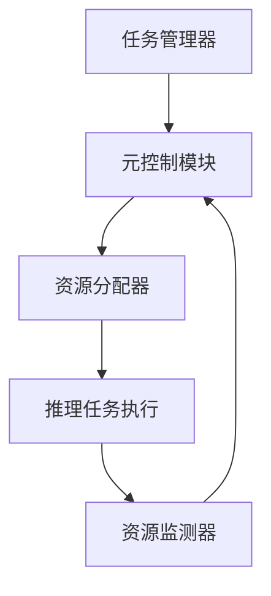

# 元控制框架下的推理资源动态分配

> 关键词：元控制框架、推理资源、动态分配、智能系统、资源优化

> 摘要：本文聚焦于元控制框架下的推理资源动态分配问题。在当今复杂多变的智能系统环境中，如何高效地分配推理资源以提升系统性能是关键挑战。文章首先介绍了相关背景，包括目的、预期读者等内容。接着阐述了核心概念与联系，通过文本示意图和 Mermaid 流程图清晰展示其原理和架构。详细讲解了核心算法原理及具体操作步骤，并使用 Python 源代码进行阐述。深入探讨了数学模型和公式，通过举例说明其应用。在项目实战部分，给出代码实际案例并进行详细解释。分析了实际应用场景，推荐了相关工具和资源。最后总结了未来发展趋势与挑战，提供了常见问题解答和扩展阅读参考资料，旨在为研究和实践元控制框架下推理资源动态分配的人员提供全面且深入的技术指导。

## 1. 背景介绍 
### 1.1 目的和范围
在现代智能系统中，推理任务的复杂性和多样性不断增加，对推理资源的有效利用提出了更高的要求。元控制框架下的推理资源动态分配旨在解决如何根据不同的任务需求、系统状态和环境变化，实时、合理地分配计算资源、存储资源等推理资源，以提高系统的整体性能、效率和响应速度。本文章的范围涵盖了元控制框架的基本概念、推理资源动态分配的核心算法、数学模型，以及在实际项目中的应用案例和相关工具资源的推荐等方面。

### 1.2 预期读者
本文预期读者包括计算机科学、人工智能、自动化等领域的研究人员，他们希望深入了解元控制框架下推理资源动态分配的理论和技术；软件开发者，期望在实际项目中应用相关技术来优化系统性能；以及对智能系统资源管理感兴趣的技术爱好者，希望通过本文获得全面的知识和技术指导。

### 1.3 文档结构概述
本文将按照以下结构进行阐述：首先介绍背景信息，包括目的、预期读者和文档结构概述等。接着深入讲解核心概念与联系，通过示意图和流程图展示其原理和架构。然后详细阐述核心算法原理及具体操作步骤，结合 Python 源代码进行说明。随后探讨数学模型和公式，并举例说明其应用。在项目实战部分，给出开发环境搭建、源代码实现和代码解读。分析实际应用场景，推荐相关工具和资源。最后总结未来发展趋势与挑战，提供常见问题解答和扩展阅读参考资料。

### 1.4 术语表
#### 1.4.1 核心术语定义
- **元控制框架**：一种高级的控制架构，用于对系统的行为和资源进行管理和决策。它通过收集系统的状态信息和环境信息，运用特定的策略和算法，对系统的各个组件进行协调和控制。
- **推理资源**：指在智能系统中用于执行推理任务的各种资源，包括计算资源（如 CPU、GPU 等）、存储资源（如内存、磁盘等）、网络资源等。
- **动态分配**：根据系统的实时状态、任务需求和环境变化，实时地对资源进行分配和调整的过程。

#### 1.4.2 相关概念解释
- **推理任务**：智能系统中根据已知信息推导出新信息的任务，如机器学习模型的预测、逻辑推理等。
- **资源利用率**：指系统中各种资源被实际使用的程度，通常用百分比表示。
- **系统性能**：衡量系统运行效率和效果的指标，如响应时间、吞吐量、准确率等。

#### 1.4.3 缩略词列表
- **CPU**：Central Processing Unit，中央处理器
- **GPU**：Graphics Processing Unit，图形处理器
- **RAM**：Random Access Memory，随机存取存储器

## 2. 核心概念与联系 
### 核心概念原理
元控制框架下的推理资源动态分配的核心原理在于通过元控制模块对系统的整体状态进行感知和分析，包括推理任务的类型、优先级、资源需求，以及系统中各种资源的使用情况和可用性等信息。元控制模块根据这些信息，运用特定的策略和算法，动态地调整推理资源的分配，以满足不同任务的需求，提高系统的整体性能。

### 架构的文本示意图
元控制框架主要由以下几个部分组成：
1. **任务管理器**：负责接收和管理推理任务，对任务进行分类、排序和优先级设定。
2. **资源监测器**：实时监测系统中各种资源的使用情况，包括 CPU 使用率、内存占用、网络带宽等。
3. **元控制模块**：根据任务管理器和资源监测器提供的信息，运用资源分配策略和算法，做出资源分配决策。
4. **资源分配器**：根据元控制模块的决策，将推理资源分配给相应的任务。

### Mermaid 流程图


该流程图展示了元控制框架下推理资源动态分配的主要流程。任务管理器接收推理任务并将相关信息传递给元控制模块，资源监测器实时监测资源状态并反馈给元控制模块。元控制模块根据这些信息做出资源分配决策，资源分配器根据决策进行资源分配，推理任务执行后，资源监测器再次监测资源状态，形成一个闭环的控制过程。

## 3. 核心算法原理 & 具体操作步骤 
### 核心算法原理
元控制框架下推理资源动态分配的核心算法通常基于启发式算法、优化算法或机器学习算法。这里我们以基于优先级的启发式算法为例进行讲解。该算法的基本思想是根据推理任务的优先级和资源需求，优先分配资源给优先级高的任务，同时考虑资源的可用性和任务的执行时间等因素，以提高系统的整体性能。

### 具体操作步骤
1. **任务优先级设定**：根据任务的重要性、紧急程度等因素，为每个推理任务设定一个优先级。
2. **资源需求评估**：对每个推理任务的资源需求进行评估，包括计算资源、存储资源等。
3. **资源监测**：实时监测系统中各种资源的使用情况和可用性。
4. **资源分配决策**：根据任务优先级和资源需求，结合资源监测信息，做出资源分配决策。优先分配资源给优先级高的任务，确保资源的合理利用。
5. **资源分配执行**：根据资源分配决策，将资源分配给相应的任务。
6. **任务执行和监测**：任务开始执行，同时继续监测资源使用情况和任务执行进度。
7. **动态调整**：根据任务执行情况和资源变化，动态调整资源分配，确保系统性能的优化。

### Python 源代码实现
```python
import random

# 定义推理任务类
class InferenceTask:
    def __init__(self, task_id, priority, resource_demand):
        self.task_id = task_id
        self.priority = priority
        self.resource_demand = resource_demand
        self.is_completed = False

# 定义资源监测器类
class ResourceMonitor:
    def __init__(self, total_resources):
        self.total_resources = total_resources
        self.used_resources = 0

    def get_available_resources(self):
        return self.total_resources - self.used_resources

    def allocate_resources(self, amount):
        if self.get_available_resources() >= amount:
            self.used_resources += amount
            return True
        else:
            return False

    def release_resources(self, amount):
        self.used_resources -= amount

# 定义元控制模块类
class MetaController:
    def __init__(self, resource_monitor):
        self.resource_monitor = resource_monitor

    def allocate_resources_to_tasks(self, tasks):
        sorted_tasks = sorted(tasks, key=lambda task: task.priority, reverse=True)
        for task in sorted_tasks:
            if self.resource_monitor.allocate_resources(task.resource_demand):
                print(f"Task {task.task_id} allocated {task.resource_demand} resources.")
                # 模拟任务执行
                task.is_completed = True
                self.resource_monitor.release_resources(task.resource_demand)
            else:
                print(f"Not enough resources for Task {task.task_id}.")

# 主程序
if __name__ == "__main__":
    # 初始化资源监测器
    total_resources = 100
    resource_monitor = ResourceMonitor(total_resources)

    # 初始化推理任务
    tasks = []
    for i in range(5):
        priority = random.randint(1, 10)
        resource_demand = random.randint(10, 30)
        task = InferenceTask(i, priority, resource_demand)
        tasks.append(task)

    # 初始化元控制模块
    meta_controller = MetaController(resource_monitor)

    # 进行资源分配
    meta_controller.allocate_resources_to_tasks(tasks)
```

### 代码解释
1. **InferenceTask 类**：用于表示推理任务，包含任务 ID、优先级和资源需求等属性。
2. **ResourceMonitor 类**：用于监测资源的使用情况，包括总资源量、已使用资源量等。提供了获取可用资源、分配资源和释放资源等方法。
3. **MetaController 类**：元控制模块，根据任务优先级对任务进行排序，然后依次尝试为任务分配资源。如果资源足够，则分配资源并模拟任务执行，任务完成后释放资源；如果资源不足，则输出提示信息。
4. **主程序**：初始化资源监测器、推理任务和元控制模块，然后调用元控制模块的资源分配方法进行资源分配。

## 4. 数学模型和公式 & 详细讲解 & 举例说明 
### 数学模型
假设系统中有 $n$ 个推理任务 $\{T_1, T_2, \cdots, T_n\}$，每个任务 $T_i$ 有一个优先级 $p_i$ 和资源需求 $r_i$。系统中总资源量为 $R$，已使用资源量为 $U$，可用资源量为 $A = R - U$。

### 资源分配决策公式
我们可以使用以下公式来判断是否可以为任务 $T_i$ 分配资源：
$$
\begin{cases}
\text{allocate}(T_i) = \text{True}, & \text{if } r_i \leq A \\
\text{allocate}(T_i) = \text{False}, & \text{if } r_i > A
\end{cases}
$$

### 任务优先级排序公式
为了优先分配资源给优先级高的任务，我们可以根据任务的优先级对任务进行排序。排序公式可以表示为：
$$
\text{sort}(T_1, T_2, \cdots, T_n) = \text{sort}(p_1, p_2, \cdots, p_n), \text{ in descending order}
$$

### 举例说明
假设系统总资源量 $R = 100$，已使用资源量 $U = 30$，则可用资源量 $A = 100 - 30 = 70$。有三个推理任务：
- $T_1$：优先级 $p_1 = 8$，资源需求 $r_1 = 20$
- $T_2$：优先级 $p_2 = 5$，资源需求 $r_2 = 30$
- $T_3$：优先级 $p_3 = 3$，资源需求 $r_3 = 40$

首先，根据任务优先级对任务进行排序，得到排序后的任务序列为 $\{T_1, T_2, T_3\}$。

对于任务 $T_1$，由于 $r_1 = 20 \leq A = 70$，所以可以为 $T_1$ 分配资源。分配后，可用资源量变为 $A = 70 - 20 = 50$。

对于任务 $T_2$，由于 $r_2 = 30 \leq A = 50$，所以可以为 $T_2$ 分配资源。分配后，可用资源量变为 $A = 50 - 30 = 20$。

对于任务 $T_3$，由于 $r_3 = 40 > A = 20$，所以不能为 $T_3$ 分配资源。

## 5. 项目实战：代码实际案例和详细解释说明 
### 5.1  开发环境搭建
在进行项目实战之前，需要搭建相应的开发环境。以下是搭建开发环境的步骤：
1. **安装 Python**：从 Python 官方网站（https://www.python.org/downloads/）下载并安装 Python 3.x 版本。
2. **安装开发工具**：推荐使用 PyCharm 或 Visual Studio Code 作为开发工具。可以从官方网站下载并安装相应的版本。
3. **创建虚拟环境**：使用 Python 的 `venv` 模块创建虚拟环境，以隔离项目的依赖项。在命令行中执行以下命令：
```bash
python -m venv myenv
```
4. **激活虚拟环境**：在命令行中执行以下命令激活虚拟环境：
```bash
# Windows
myenv\Scripts\activate

# Linux/Mac
source myenv/bin/activate
```

### 5.2  源代码详细实现和代码解读
以下是一个更完整的项目实战代码示例，结合了多线程和任务队列，模拟了元控制框架下推理资源动态分配的过程。

```python
import threading
import time
import queue

# 定义推理任务类
class InferenceTask:
    def __init__(self, task_id, priority, resource_demand, execution_time):
        self.task_id = task_id
        self.priority = priority
        self.resource_demand = resource_demand
        self.execution_time = execution_time
        self.is_completed = False

# 定义资源监测器类
class ResourceMonitor:
    def __init__(self, total_resources):
        self.total_resources = total_resources
        self.used_resources = 0
        self.lock = threading.Lock()

    def get_available_resources(self):
        with self.lock:
            return self.total_resources - self.used_resources

    def allocate_resources(self, amount):
        with self.lock:
            if self.get_available_resources() >= amount:
                self.used_resources += amount
                return True
            else:
                return False

    def release_resources(self, amount):
        with self.lock:
            self.used_resources -= amount

# 定义元控制模块类
class MetaController:
    def __init__(self, resource_monitor, task_queue):
        self.resource_monitor = resource_monitor
        self.task_queue = task_queue

    def allocate_resources_to_tasks(self):
        while True:
            try:
                # 获取任务队列中的任务
                task = self.task_queue.get(timeout=1)
                if self.resource_monitor.allocate_resources(task.resource_demand):
                    print(f"Task {task.task_id} allocated {task.resource_demand} resources.")
                    # 启动线程执行任务
                    task_thread = threading.Thread(target=self.execute_task, args=(task,))
                    task_thread.start()
                else:
                    print(f"Not enough resources for Task {task.task_id}.")
                    self.task_queue.put(task)
            except queue.Empty:
                break

    def execute_task(self, task):
        # 模拟任务执行
        time.sleep(task.execution_time)
        task.is_completed = True
        self.resource_monitor.release_resources(task.resource_demand)
        print(f"Task {task.task_id} completed.")
        self.task_queue.task_done()

# 主程序
if __name__ == "__main__":
    # 初始化资源监测器
    total_resources = 100
    resource_monitor = ResourceMonitor(total_resources)

    # 初始化任务队列
    task_queue = queue.PriorityQueue()

    # 初始化推理任务
    tasks = []
    for i in range(5):
        priority = random.randint(1, 10)
        resource_demand = random.randint(10, 30)
        execution_time = random.randint(1, 5)
        task = InferenceTask(i, priority, resource_demand, execution_time)
        tasks.append(task)
        task_queue.put((-task.priority, task))

    # 初始化元控制模块
    meta_controller = MetaController(resource_monitor, task_queue)

    # 进行资源分配
    meta_controller.allocate_resources_to_tasks()

    # 等待所有任务完成
    task_queue.join()
```

### 5.3  代码解读与分析
1. **InferenceTask 类**：新增了 `execution_time` 属性，用于模拟任务的执行时间。
2. **ResourceMonitor 类**：使用 `threading.Lock()` 来保证资源操作的线程安全。
3. **MetaController 类**：
    - `allocate_resources_to_tasks` 方法：从任务队列中获取任务，尝试为任务分配资源。如果资源足够，则启动线程执行任务；如果资源不足，则将任务放回任务队列。
    - `execute_task` 方法：模拟任务的执行过程，使用 `time.sleep()` 来模拟任务的执行时间。任务完成后，释放资源并标记任务为已完成。
4. **主程序**：
    - 初始化资源监测器、任务队列和推理任务。
    - 将推理任务加入任务队列，使用 `PriorityQueue` 按任务优先级排序。
    - 初始化元控制模块并调用 `allocate_resources_to_tasks` 方法进行资源分配。
    - 使用 `task_queue.join()` 等待所有任务完成。

## 6. 实际应用场景 
### 人工智能推理服务平台
在人工智能推理服务平台中，会同时处理大量的推理任务，如图像识别、自然语言处理等。不同的推理任务对资源的需求和优先级不同。通过元控制框架下的推理资源动态分配，可以根据任务的优先级和资源需求，合理分配计算资源（如 GPU、CPU）和存储资源，提高平台的整体性能和响应速度，确保高优先级任务能够及时得到处理。

### 边缘计算环境
在边缘计算环境中，设备资源有限，且任务的实时性要求较高。元控制框架下的推理资源动态分配可以根据边缘设备的资源状态和任务需求，动态调整推理资源的分配，使边缘设备能够高效地处理本地推理任务，减少数据传输延迟，提高系统的可靠性和性能。

### 云计算数据中心
在云计算数据中心中，需要管理大量的虚拟机和计算资源。通过元控制框架下的推理资源动态分配，可以根据用户的推理任务需求和数据中心的资源使用情况，动态分配虚拟机和计算资源，提高资源利用率，降低成本，同时保证服务质量。

## 7. 工具和资源推荐
### 7.1 学习资源推荐
#### 7.1.1 书籍推荐
- 《人工智能：一种现代的方法》：全面介绍了人工智能的基本概念、算法和应用，对理解推理任务和资源管理有很大帮助。
- 《Python 深度学习》：详细讲解了 Python 在深度学习中的应用，包括模型训练和推理，有助于深入理解推理资源的需求和优化。

#### 7.1.2 在线课程
- Coursera 上的“人工智能基础”课程：由知名教授授课，系统地介绍了人工智能的基础知识和技术。
- edX 上的“深度学习”课程：深入讲解了深度学习的原理和实践，对理解推理任务的资源需求和优化有很大帮助。

#### 7.1.3 技术博客和网站
- Medium 上的人工智能相关博客：有很多专业人士分享的关于人工智能和资源管理的技术文章。
- arXiv 网站：提供了大量的人工智能领域的学术论文，可用于深入研究相关技术。

### 7.2 开发工具框架推荐
#### 7.2.1 IDE和编辑器
- PyCharm：功能强大的 Python 集成开发环境，提供了代码编辑、调试、版本控制等功能。
- Visual Studio Code：轻量级的代码编辑器，支持多种编程语言和插件扩展，适合快速开发和调试。

#### 7.2.2 调试和性能分析工具
- Py-Spy：用于分析 Python 程序的性能，找出性能瓶颈。
- cProfile：Python 内置的性能分析工具，可用于分析函数调用时间和次数。

#### 7.2.3 相关框架和库
- TensorFlow：开源的深度学习框架，提供了丰富的模型训练和推理工具。
- PyTorch：另一个流行的深度学习框架，具有动态图和易于使用的特点。

### 7.3 相关论文著作推荐
#### 7.3.1 经典论文
- “Resource Allocation in Cloud Computing: A Survey”：对云计算中的资源分配问题进行了全面的综述，介绍了各种资源分配算法和策略。
- “Dynamic Resource Allocation for Deep Learning Inference in Edge Computing”：研究了边缘计算中深度学习推理的动态资源分配问题，提出了一些有效的算法和方法。

#### 7.3.2 最新研究成果
- 关注顶级学术会议（如 NeurIPS、ICML 等）上的最新研究成果，了解元控制框架下推理资源动态分配的最新进展。

#### 7.3.3 应用案例分析
- 一些大型科技公司（如 Google、Microsoft 等）的技术博客和研究报告中，会分享他们在推理资源动态分配方面的应用案例和实践经验，可以作为参考。

## 8. 总结：未来发展趋势与挑战
### 未来发展趋势
1. **智能化程度不断提高**：随着人工智能技术的不断发展，元控制框架将更加智能化，能够自动学习和适应不同的任务需求和环境变化，实现更加精准的推理资源动态分配。
2. **与其他技术的融合**：元控制框架将与区块链、物联网等技术深度融合，实现更加安全、高效的资源管理和分配。
3. **跨平台和跨设备的资源管理**：未来的智能系统将涉及多种平台和设备，元控制框架需要能够实现跨平台和跨设备的推理资源动态分配，提高系统的整体性能和资源利用率。

### 挑战
1. **复杂的任务需求和环境变化**：随着智能系统的不断发展，推理任务的需求和环境变化越来越复杂，如何准确地感知和分析这些信息，并做出合理的资源分配决策是一个挑战。
2. **资源管理的安全性**：在资源动态分配过程中，需要保证资源的安全性和可靠性，防止资源被恶意攻击和滥用。
3. **算法的复杂度和效率**：为了实现更加精准的资源分配，需要使用复杂的算法和模型，但这些算法和模型的计算复杂度较高，可能会影响系统的性能和响应速度，如何在算法复杂度和效率之间找到平衡是一个挑战。

## 9. 附录：常见问题与解答
### 问题 1：如何确定推理任务的优先级？
解答：推理任务的优先级可以根据任务的重要性、紧急程度、业务需求等因素来确定。例如，对于实时性要求较高的任务，可以设置较高的优先级；对于对系统性能影响较大的任务，也可以设置较高的优先级。

### 问题 2：资源分配决策出现错误怎么办？
解答：可以采用容错机制和反馈机制。容错机制可以在资源分配出现错误时，进行错误恢复和重试；反馈机制可以根据任务执行的结果，对资源分配策略进行调整和优化，避免类似错误的再次发生。

### 问题 3：如何处理资源竞争问题？
解答：可以采用资源调度算法，如先来先服务、优先级调度等，来解决资源竞争问题。同时，可以对资源进行合理的划分和管理，提高资源的利用率，减少资源竞争的发生。

## 10. 扩展阅读 & 参考资料
### 扩展阅读
- 《智能系统资源管理与优化》：深入探讨了智能系统中资源管理的理论和方法，对元控制框架下的推理资源动态分配有更深入的研究。
- 《云计算与边缘计算技术》：介绍了云计算和边缘计算的相关技术，对理解推理资源动态分配在不同计算环境中的应用有帮助。

### 参考资料
- 相关学术论文和研究报告，如上述推荐的经典论文和最新研究成果。
- 开源项目的文档和代码，如 TensorFlow、PyTorch 等开源框架的官方文档和代码实现。