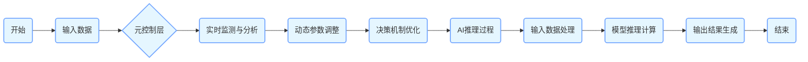

# 元控制策略优化AI推理过程的新思路

> 关键词：元控制策略、AI推理过程、优化、新思路、决策机制、智能系统

> 摘要：本文围绕元控制策略优化AI推理过程展开深入探讨。在人工智能技术不断发展的背景下，AI推理过程的效率和准确性至关重要。元控制策略作为一种新兴的方法，为优化AI推理过程提供了全新的思路。文章首先介绍了相关背景，包括目的、预期读者等内容。接着详细阐述了核心概念与联系，通过文本示意图和Mermaid流程图清晰展示其原理和架构。深入讲解了核心算法原理及具体操作步骤，并用Python源代码进行详细说明。同时，给出了相关的数学模型和公式，并举例说明。通过项目实战，展示了代码实际案例并进行详细解释。分析了实际应用场景，推荐了相关的工具和资源。最后总结了未来发展趋势与挑战，提供了常见问题与解答以及扩展阅读和参考资料，旨在为读者全面呈现元控制策略优化AI推理过程的新思路。

## 1. 背景介绍 
### 1.1 目的和范围
随着人工智能技术的飞速发展，AI推理过程在各个领域的应用日益广泛，如自然语言处理、计算机视觉、智能决策等。然而，现有的AI推理过程在效率、准确性和灵活性等方面仍面临诸多挑战。本研究的目的在于探索元控制策略如何优化AI推理过程，提高推理效率和准确性，增强AI系统的智能决策能力。

本研究的范围涵盖了元控制策略的基本概念、核心算法、数学模型，以及在不同领域的实际应用。通过理论分析和项目实战，深入探讨元控制策略在优化AI推理过程中的作用和价值。

### 1.2 预期读者
本文预期读者包括人工智能领域的研究人员、开发者、工程师，以及对AI推理过程优化感兴趣的技术爱好者。对于正在从事AI相关项目开发的专业人士，本文提供了新的技术思路和实践方法；对于初学者，有助于他们了解元控制策略的基本概念和应用场景，为进一步学习和研究打下基础。

### 1.3 文档结构概述
本文共分为十个部分。第一部分为背景介绍，阐述研究的目的、预期读者和文档结构概述。第二部分介绍核心概念与联系，通过文本示意图和Mermaid流程图展示元控制策略与AI推理过程的关系。第三部分详细讲解核心算法原理及具体操作步骤，并用Python源代码进行说明。第四部分给出数学模型和公式，并举例说明。第五部分进行项目实战，展示代码实际案例并详细解释。第六部分分析实际应用场景。第七部分推荐相关的工具和资源。第八部分总结未来发展趋势与挑战。第九部分为附录，提供常见问题与解答。第十部分为扩展阅读和参考资料。

### 1.4 术语表
#### 1.4.1 核心术语定义
- **元控制策略**：是一种对控制过程进行控制的策略，通过对AI推理过程中的各种参数、决策机制等进行动态调整和优化，以提高推理效率和准确性。
- **AI推理过程**：指人工智能系统根据输入数据，运用已有的知识和模型，进行逻辑推理和计算，得出输出结果的过程。
- **智能决策**：指AI系统在面对复杂的环境和任务时，能够根据当前状态和目标，自主地做出最优决策的能力。

#### 1.4.2 相关概念解释
- **控制理论**：是研究如何通过信息反馈来实现对系统的控制和优化的理论。元控制策略借鉴了控制理论的思想，通过对AI推理过程的反馈信息进行分析和处理，实现对推理过程的动态调整。
- **机器学习**：是一门多领域交叉学科，涉及概率论、统计学、逼近论、凸分析、算法复杂度理论等多门学科。AI推理过程中常常运用机器学习算法来构建模型和进行推理。

#### 1.4.3 缩略词列表
- **AI**：Artificial Intelligence，人工智能
- **ML**：Machine Learning，机器学习

## 2. 核心概念与联系 

### 核心概念原理
元控制策略的核心思想是在AI推理过程中引入一个元控制层，该层能够对推理过程进行实时监测和分析，根据当前的状态和目标，动态调整推理过程中的各种参数和决策机制，以达到优化推理过程的目的。

元控制策略与AI推理过程的关系可以类比为人类的元认知与认知过程的关系。人类的元认知能够对自己的认知过程进行监控、评估和调整，从而提高认知效率和准确性。同样，元控制策略能够对AI推理过程进行监控、评估和调整，提高推理效率和准确性。

### 架构的文本示意图
```plaintext
+---------------------+
|     元控制层        |
|  实时监测与分析     |
|  动态参数调整       |
|  决策机制优化       |
+---------------------+
          |
          v
+---------------------+
|    AI推理过程       |
|  输入数据处理       |
|  模型推理计算       |
|  输出结果生成       |
+---------------------+
```

### Mermaid流程图


## 3. 核心算法原理 & 具体操作步骤 

### 核心算法原理
元控制策略的核心算法主要包括状态监测、评估函数、决策机制和参数调整四个部分。

- **状态监测**：实时监测AI推理过程中的各种状态信息，如输入数据的特征、模型的计算时间、输出结果的准确性等。
- **评估函数**：根据监测到的状态信息，计算一个评估值，用于衡量当前推理过程的性能。评估函数可以根据具体的应用场景和目标进行设计，如最小化计算时间、最大化输出结果的准确性等。
- **决策机制**：根据评估值，选择合适的决策策略，如调整模型的参数、选择不同的推理算法等。
- **参数调整**：根据决策机制的结果，对AI推理过程中的各种参数进行动态调整，以优化推理过程。

### 具体操作步骤
1. **初始化**：设置元控制策略的初始参数，如评估函数的权重、决策机制的阈值等。
2. **状态监测**：在AI推理过程中，实时监测各种状态信息，并将其存储在一个状态向量中。
3. **评估计算**：根据状态向量，计算评估值。
4. **决策选择**：根据评估值，选择合适的决策策略。
5. **参数调整**：根据决策策略，对AI推理过程中的参数进行调整。
6. **重复步骤2 - 5**：直到达到终止条件，如推理过程结束或达到最大迭代次数。

### Python源代码详细阐述
```python
import numpy as np

# 初始化元控制策略的参数
class MetaControlStrategy:
    def __init__(self, weight1=0.5, weight2=0.5, threshold=0.8):
        self.weight1 = weight1  # 评估函数中计算时间的权重
        self.weight2 = weight2  # 评估函数中输出结果准确性的权重
        self.threshold = threshold  # 决策机制的阈值

    # 状态监测
    def monitor_state(self, input_data, computation_time, output_accuracy):
        state_vector = [input_data.shape[0], computation_time, output_accuracy]
        return state_vector

    # 评估计算
    def evaluate(self, state_vector):
        computation_time_score = state_vector[1]
        output_accuracy_score = state_vector[2]
        evaluation_value = self.weight1 * computation_time_score + self.weight2 * output_accuracy_score
        return evaluation_value

    # 决策选择
    def make_decision(self, evaluation_value):
        if evaluation_value < self.threshold:
            decision = "调整模型参数"
        else:
            decision = "继续当前推理过程"
        return decision

    # 参数调整
    def adjust_parameters(self, decision):
        if decision == "调整模型参数":
            # 这里可以实现具体的参数调整逻辑
            print("正在调整模型参数...")
        else:
            print("继续当前推理过程...")

# 模拟AI推理过程
def ai_inference_process(input_data):
    computation_time = np.random.rand()  # 模拟计算时间
    output_accuracy = np.random.rand()  # 模拟输出结果的准确性
    return computation_time, output_accuracy

# 主程序
if __name__ == "__main__":
    meta_control = MetaControlStrategy()
    input_data = np.random.rand(100, 10)  # 模拟输入数据

    for i in range(10):
        computation_time, output_accuracy = ai_inference_process(input_data)
        state_vector = meta_control.monitor_state(input_data, computation_time, output_accuracy)
        evaluation_value = meta_control.evaluate(state_vector)
        decision = meta_control.make_decision(evaluation_value)
        meta_control.adjust_parameters(decision)
```

## 4. 数学模型和公式 & 详细讲解 & 举例说明 

### 数学模型和公式
设 $S$ 为状态向量，$S = [s_1, s_2, \cdots, s_n]$，其中 $s_i$ 表示第 $i$ 个状态信息，如输入数据的特征、模型的计算时间、输出结果的准确性等。

评估函数 $E(S)$ 可以表示为：
$$
E(S) = \sum_{i=1}^{n} w_i s_i
$$
其中 $w_i$ 为第 $i$ 个状态信息的权重，且 $\sum_{i=1}^{n} w_i = 1$。

决策机制可以表示为：
$$
D(E(S)) = 
\begin{cases}
\text{调整模型参数}, & E(S) < \theta \\
\text{继续当前推理过程}, & E(S) \geq \theta
\end{cases}
$$
其中 $\theta$ 为决策阈值。

### 详细讲解
- **状态向量**：状态向量 $S$ 用于存储AI推理过程中的各种状态信息，通过实时监测这些信息，可以全面了解推理过程的运行状态。
- **评估函数**：评估函数 $E(S)$ 根据状态向量中的信息，计算一个评估值，用于衡量当前推理过程的性能。权重 $w_i$ 可以根据具体的应用场景和目标进行调整，以突出不同状态信息的重要性。
- **决策机制**：决策机制 $D(E(S))$ 根据评估值与决策阈值 $\theta$ 的比较结果，选择合适的决策策略。如果评估值小于阈值，则认为当前推理过程的性能不佳，需要调整模型参数；否则，继续当前推理过程。

### 举例说明
假设状态向量 $S = [100, 2.5, 0.8]$，其中 $s_1 = 100$ 表示输入数据的样本数量，$s_2 = 2.5$ 表示模型的计算时间（秒），$s_3 = 0.8$ 表示输出结果的准确性。

权重 $w_1 = 0.1$，$w_2 = 0.3$，$w_3 = 0.6$，决策阈值 $\theta = 0.7$。

首先计算评估值：
$$
E(S) = 0.1 \times 100 + 0.3 \times 2.5 + 0.6 \times 0.8 = 10 + 0.75 + 0.48 = 11.23
$$

由于 $E(S) = 11.23 > \theta = 0.7$，根据决策机制，选择“继续当前推理过程”的决策策略。

## 5. 项目实战：代码实际案例和详细解释说明 

### 5.1  开发环境搭建
本项目使用Python语言进行开发，需要安装以下库：
- **NumPy**：用于数值计算和数组操作。
- **Matplotlib**：用于数据可视化。

可以使用以下命令进行安装：
```sh
pip install numpy matplotlib
```

### 5.2  源代码详细实现和代码解读
```python
import numpy as np
import matplotlib.pyplot as plt

# 初始化元控制策略的参数
class MetaControlStrategy:
    def __init__(self, weight1=0.5, weight2=0.5, threshold=0.8):
        self.weight1 = weight1  # 评估函数中计算时间的权重
        self.weight2 = weight2  # 评估函数中输出结果准确性的权重
        self.threshold = threshold  # 决策机制的阈值

    # 状态监测
    def monitor_state(self, input_data, computation_time, output_accuracy):
        state_vector = [input_data.shape[0], computation_time, output_accuracy]
        return state_vector

    # 评估计算
    def evaluate(self, state_vector):
        computation_time_score = state_vector[1]
        output_accuracy_score = state_vector[2]
        evaluation_value = self.weight1 * computation_time_score + self.weight2 * output_accuracy_score
        return evaluation_value

    # 决策选择
    def make_decision(self, evaluation_value):
        if evaluation_value < self.threshold:
            decision = "调整模型参数"
        else:
            decision = "继续当前推理过程"
        return decision

    # 参数调整
    def adjust_parameters(self, decision):
        if decision == "调整模型参数":
            # 这里可以实现具体的参数调整逻辑
            print("正在调整模型参数...")
        else:
            print("继续当前推理过程...")

# 模拟AI推理过程
def ai_inference_process(input_data):
    computation_time = np.random.rand()  # 模拟计算时间
    output_accuracy = np.random.rand()  # 模拟输出结果的准确性
    return computation_time, output_accuracy

# 主程序
if __name__ == "__main__":
    meta_control = MetaControlStrategy()
    input_data = np.random.rand(100, 10)  # 模拟输入数据

    evaluation_values = []
    for i in range(10):
        computation_time, output_accuracy = ai_inference_process(input_data)
        state_vector = meta_control.monitor_state(input_data, computation_time, output_accuracy)
        evaluation_value = meta_control.evaluate(state_vector)
        decision = meta_control.make_decision(evaluation_value)
        meta_control.adjust_parameters(decision)
        evaluation_values.append(evaluation_value)

    # 绘制评估值随迭代次数的变化曲线
    plt.plot(range(10), evaluation_values)
    plt.xlabel('迭代次数')
    plt.ylabel('评估值')
    plt.title('评估值随迭代次数的变化')
    plt.show()
```

### 代码解读与分析
- **MetaControlStrategy类**：实现了元控制策略的核心功能，包括状态监测、评估计算、决策选择和参数调整。
- **ai_inference_process函数**：模拟AI推理过程，返回计算时间和输出结果的准确性。
- **主程序**：初始化元控制策略，模拟输入数据，进行10次迭代，每次迭代中调用元控制策略的各个方法，并记录评估值。最后，使用Matplotlib库绘制评估值随迭代次数的变化曲线。

通过分析评估值随迭代次数的变化曲线，可以直观地了解元控制策略对AI推理过程的优化效果。如果评估值逐渐增大，说明推理过程的性能在不断提高；如果评估值波动较大，可能需要调整元控制策略的参数。

## 6. 实际应用场景 
### 自然语言处理
在自然语言处理任务中，如机器翻译、文本分类等，AI推理过程需要处理大量的文本数据。元控制策略可以实时监测输入数据的长度、复杂度，以及模型的计算时间和输出结果的准确性。根据监测结果，动态调整模型的参数和推理算法，以提高推理效率和翻译质量。

### 计算机视觉
在计算机视觉任务中，如图像识别、目标检测等，AI推理过程需要处理大量的图像数据。元控制策略可以根据图像的分辨率、光照条件等因素，动态调整模型的参数和推理算法，以提高识别准确率和检测速度。

### 智能决策系统
在智能决策系统中，如自动驾驶、机器人控制等，AI推理过程需要在复杂的环境中做出实时决策。元控制策略可以实时监测环境信息、任务状态和决策结果，动态调整决策机制和参数，以提高决策的准确性和可靠性。

## 7. 工具和资源推荐
### 7.1 学习资源推荐
#### 7.1.1 书籍推荐
- 《人工智能：一种现代的方法》：全面介绍了人工智能的基本概念、算法和应用，是学习人工智能的经典教材。
- 《机器学习》：详细讲解了机器学习的各种算法和模型，对于理解AI推理过程中的机器学习原理有很大帮助。
- 《控制理论基础》：介绍了控制理论的基本概念和方法，有助于深入理解元控制策略的原理。

#### 7.1.2 在线课程
- Coursera上的“人工智能基础”课程：由知名教授授课，系统地介绍了人工智能的基本概念和技术。
- edX上的“机器学习”课程：提供了丰富的教学资源和实践项目，帮助学习者掌握机器学习的算法和应用。
- 中国大学MOOC上的“控制理论”课程：讲解了控制理论的基本原理和应用，对于理解元控制策略有一定的帮助。

#### 7.1.3 技术博客和网站
- Medium上的人工智能相关博客：有很多专业人士分享的最新技术和研究成果。
- 机器之心：专注于人工智能领域的资讯和技术分享，提供了丰富的行业动态和技术文章。
- 开源中国：提供了大量的开源项目和技术文章，对于学习和实践AI推理过程优化有很大帮助。

### 7.2 开发工具框架推荐
#### 7.2.1 IDE和编辑器
- PyCharm：一款专业的Python集成开发环境，提供了丰富的代码编辑、调试和分析功能。
- Jupyter Notebook：一种交互式的开发环境，适合进行数据探索和模型实验。
- Visual Studio Code：一款轻量级的代码编辑器，支持多种编程语言和插件扩展。

#### 7.2.2 调试和性能分析工具
- PDB：Python自带的调试工具，用于调试Python代码。
- cProfile：Python的性能分析工具，用于分析代码的运行时间和性能瓶颈。
- TensorBoard：TensorFlow的可视化工具，用于可视化模型的训练过程和性能指标。

#### 7.2.3 相关框架和库
- TensorFlow：一个开源的机器学习框架，提供了丰富的深度学习模型和工具。
- PyTorch：另一个开源的机器学习框架，具有动态计算图和易于使用的特点。
- Scikit-learn：一个用于机器学习的Python库，提供了各种机器学习算法和工具。

### 7.3 相关论文著作推荐
#### 7.3.1 经典论文
- “Artificial Intelligence: A Modern Approach”：人工智能领域的经典论文，系统地介绍了人工智能的基本概念和方法。
- “Gradient-Based Learning Applied to Document Recognition”：介绍了卷积神经网络在文档识别中的应用，是深度学习领域的经典论文。
- “Reinforcement Learning: An Introduction”：强化学习领域的经典著作，详细讲解了强化学习的基本概念和算法。

#### 7.3.2 最新研究成果
- 关注顶级学术会议，如NeurIPS、ICML、CVPR等，这些会议上的论文代表了人工智能领域的最新研究成果。
- 关注知名学术期刊，如Journal of Artificial Intelligence Research (JAIR)、Artificial Intelligence等，这些期刊上的论文具有较高的学术水平。

#### 7.3.3 应用案例分析
- 研究一些实际应用案例，如谷歌的AlphaGo、特斯拉的自动驾驶系统等，了解元控制策略在实际应用中的实现方法和效果。

## 8. 总结：未来发展趋势与挑战
### 未来发展趋势
- **与其他技术的融合**：元控制策略将与区块链、物联网、量子计算等技术深度融合，拓展其应用领域和功能。例如，与区块链技术结合，可以提高AI推理过程的安全性和可信度；与物联网技术结合，可以实现对物理世界的实时感知和智能控制。
- **智能化程度的提高**：元控制策略将不断提高自身的智能化程度，能够自动学习和适应不同的应用场景和任务需求。例如，通过强化学习算法，元控制策略可以自动调整决策机制和参数，以达到最优的推理效果。
- **应用领域的拓展**：元控制策略将在更多的领域得到应用，如医疗、金融、教育等。在医疗领域，元控制策略可以优化医疗诊断过程，提高诊断的准确性和效率；在金融领域，元控制策略可以优化投资决策过程，降低投资风险。

### 挑战
- **计算资源的需求**：元控制策略需要实时监测和分析大量的状态信息，进行复杂的计算和决策，对计算资源的需求较高。如何在有限的计算资源下实现高效的元控制策略是一个挑战。
- **模型的可解释性**：元控制策略中的模型和算法往往比较复杂，缺乏可解释性。在一些对决策过程要求较高的应用场景中，如医疗、金融等，如何提高模型的可解释性是一个需要解决的问题。
- **数据的安全性和隐私性**：元控制策略需要处理大量的数据，这些数据可能包含敏感信息。如何保证数据的安全性和隐私性是一个重要的挑战。

## 9. 附录：常见问题与解答
### 问题1：元控制策略与传统控制策略有什么区别？
答：传统控制策略通常是基于固定的规则和模型，对系统进行控制和优化。而元控制策略能够对控制过程进行实时监测和分析，根据当前的状态和目标，动态调整控制策略和参数，具有更高的灵活性和适应性。

### 问题2：如何选择合适的评估函数和决策机制？
答：评估函数和决策机制的选择需要根据具体的应用场景和目标进行设计。评估函数应该能够准确地衡量当前推理过程的性能，决策机制应该能够根据评估结果做出合理的决策。可以通过实验和调优的方法，选择最合适的评估函数和决策机制。

### 问题3：元控制策略在实际应用中需要注意哪些问题？
答：在实际应用中，需要注意以下问题：
- **计算资源的管理**：合理分配计算资源，避免计算资源的浪费和瓶颈。
- **数据的质量和安全性**：保证输入数据的质量和安全性，避免数据泄露和恶意攻击。
- **模型的训练和优化**：定期对模型进行训练和优化，以适应不同的应用场景和任务需求。

## 10. 扩展阅读 & 参考资料
### 扩展阅读
- 阅读相关的学术论文和研究报告，深入了解元控制策略的最新研究进展和应用案例。
- 参与相关的技术社区和论坛，与其他技术爱好者和专业人士交流和分享经验。

### 参考资料
- 《人工智能：一种现代的方法》，Stuart J. Russell, Peter Norvig 著
- 《机器学习》，周志华 著
- 《控制理论基础》，刘豹, 唐万生 著
- 相关学术会议和期刊上的论文，如NeurIPS、ICML、CVPR、Journal of Artificial Intelligence Research (JAIR)、Artificial Intelligence等。