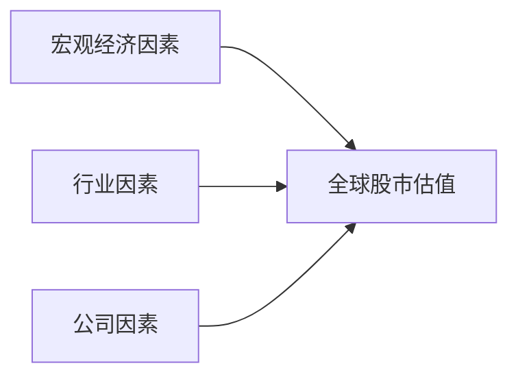
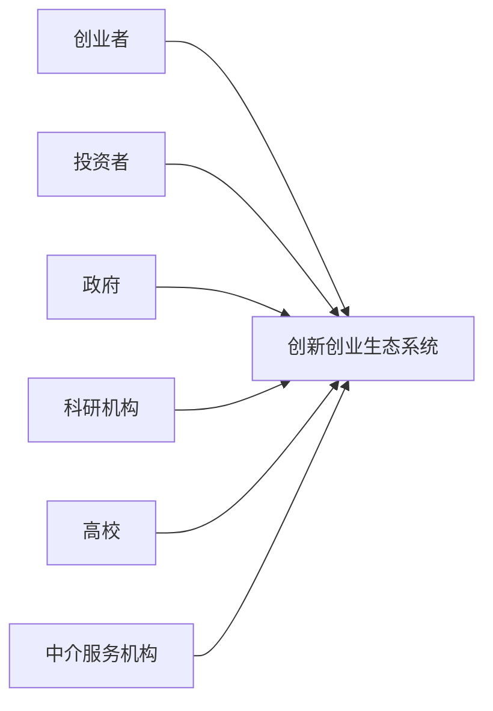
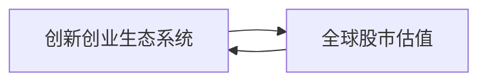

# 全球股市估值与创新创业生态系统的关系

> 关键词：全球股市估值、创新创业生态系统、经济增长、风险投资、市场信心

> 摘要：本文深入探讨了全球股市估值与创新创业生态系统之间的关系。通过对两者核心概念的剖析、相关算法原理的阐述、数学模型的建立以及实际案例的分析，揭示了股市估值与创新创业生态系统相互影响、相互促进的内在机制。同时，结合实际应用场景，探讨了两者关系在不同领域的体现，并推荐了相关的学习资源、开发工具和论文著作。最后，对未来发展趋势与挑战进行了总结，旨在为投资者、创业者和政策制定者提供有价值的参考。

## 1. 背景介绍 
### 1.1 目的和范围
本研究的目的在于全面深入地探究全球股市估值与创新创业生态系统之间的内在联系。通过分析两者之间的相互作用机制，揭示它们对经济发展的影响，为投资者、创业者和政策制定者提供决策依据。研究范围涵盖全球主要股票市场以及不同国家和地区的创新创业生态系统，包括风险投资、创业企业发展、科技创新等多个方面。

### 1.2 预期读者
本文的预期读者包括金融领域的投资者、分析师、基金经理，创新创业领域的创业者、创业服务机构从业者，以及政府相关部门的政策制定者和研究人员。同时，对经济、金融和创新创业领域感兴趣的学者和学生也可以从本文中获得有价值的信息和启示。

### 1.3 文档结构概述
本文将按照以下结构进行阐述：首先介绍全球股市估值与创新创业生态系统的背景信息，包括目的、预期读者和文档结构概述等；接着详细阐述两者的核心概念与联系，通过文本示意图和 Mermaid 流程图进行直观展示；然后深入分析核心算法原理和具体操作步骤，结合 Python 源代码进行详细讲解；随后建立数学模型和公式，并通过具体例子进行说明；再通过项目实战，展示代码实际案例并进行详细解释；接着探讨实际应用场景；之后推荐相关的工具和资源；最后总结未来发展趋势与挑战，并提供常见问题与解答以及扩展阅读和参考资料。

### 1.4 术语表
#### 1.4.1 核心术语定义
- **全球股市估值**：指对全球范围内各个股票市场中上市公司的价值进行评估和计算的过程和结果。它反映了市场对上市公司未来盈利能力和发展前景的预期。
- **创新创业生态系统**：是一个由创业者、投资者、政府、科研机构、高校、中介服务机构等多种主体构成的，相互作用、相互影响的有机整体。其目的是促进创新和创业活动的开展，推动经济的发展和社会的进步。
- **风险投资**：是指向初创企业或高成长型企业提供资金支持，并通过获取股权或其他权益性投资的方式，分享企业成长带来的收益的一种投资方式。
- **市场信心**：是指投资者对股票市场和整个经济环境的信心程度。它反映了投资者对市场未来走势的预期和判断，对股市估值和创新创业活动有着重要的影响。

#### 1.4.2 相关概念解释
- **股票市场**：是股票发行和交易的场所，是资本市场的重要组成部分。股票市场的主要功能包括融资、资源配置、价格发现和风险管理等。
- **创新创业**：创新是指创造新的产品、服务、技术或商业模式的过程；创业是指创业者利用创新成果，创办新的企业或组织，实现商业价值的过程。创新创业是推动经济发展和社会进步的重要动力。
- **经济增长**：是指一个国家或地区在一定时期内生产的商品和服务总量的增加。经济增长通常用国内生产总值（GDP）的增长率来衡量。

#### 1.4.3 缩略词列表
- **GDP**：国内生产总值（Gross Domestic Product）
- **VC**：风险投资（Venture Capital）
- **PE**：私募股权投资（Private Equity）

## 2. 核心概念与联系 

### 全球股市估值的原理和架构
全球股市估值是一个复杂的过程，它涉及到多个因素的综合考虑。其基本原理是通过对上市公司的财务状况、盈利能力、发展前景等因素进行分析和评估，来确定其股票的合理价值。常见的估值方法包括市盈率法、市净率法、现金流折现法等。

以下是全球股市估值的文本示意图：

全球股市估值
|--宏观经济因素
|   |--经济增长
|   |--通货膨胀
|   |--利率水平
|--行业因素
|   |--行业发展前景
|   |--行业竞争格局
|--公司因素
|   |--财务状况
|   |--盈利能力
|   |--发展战略

以下是全球股市估值的 Mermaid 流程图：



### 创新创业生态系统的原理和架构
创新创业生态系统是一个由多种主体构成的有机整体，其核心原理是通过各主体之间的协同合作，实现创新和创业资源的有效配置，促进创新创业活动的开展。创新创业生态系统的架构包括创业者、投资者、政府、科研机构、高校、中介服务机构等多个组成部分。

以下是创新创业生态系统的文本示意图：

创新创业生态系统
|--创业者
|   |--创新想法
|   |--创业能力
|--投资者
|   |--风险投资
|   |--私募股权投资
|--政府
|   |--政策支持
|   |--资金投入
|--科研机构
|   |--科研成果
|   |--技术支持
|--高校
|   |--人才培养
|   |--知识传播
|--中介服务机构
|   |--法律咨询
|   |--财务服务

以下是创新创业生态系统的 Mermaid 流程图：



### 全球股市估值与创新创业生态系统的联系
全球股市估值与创新创业生态系统之间存在着密切的联系。一方面，创新创业生态系统的发展状况会影响全球股市估值。创新型企业的涌现和发展会为股市带来新的投资机会，推动股市估值的上升；同时，创新创业生态系统的完善和优化也会增强市场信心，促进股市的稳定发展。另一方面，全球股市估值也会对创新创业生态系统产生影响。较高的股市估值可以为创新创业企业提供更多的融资机会，吸引更多的投资者参与创新创业活动；同时，股市的波动也会影响投资者的信心和投资决策，进而影响创新创业生态系统的发展。

以下是全球股市估值与创新创业生态系统联系的 Mermaid 流程图：



## 3. 核心算法原理 & 具体操作步骤 

### 全球股市估值的算法原理
全球股市估值的算法原理主要基于各种估值模型，其中市盈率法是最常用的一种方法。市盈率法的基本原理是通过计算上市公司的市盈率（P/E），来评估其股票的价值。市盈率是指股票价格与每股收益的比值，反映了市场对上市公司未来盈利能力的预期。

以下是市盈率法的 Python 源代码实现：

```python
# 定义计算市盈率的函数
def calculate_pe(stock_price, earnings_per_share):
    if earnings_per_share == 0:
        return None
    else:
        return stock_price / earnings_per_share

# 示例数据
stock_price = 50
earnings_per_share = 5

# 计算市盈率
pe_ratio = calculate_pe(stock_price, earnings_per_share)

# 输出结果
if pe_ratio is not None:
    print(f"该股票的市盈率为: {pe_ratio}")
else:
    print("每股收益为0，无法计算市盈率。")
```

### 创新创业生态系统评估的算法原理
创新创业生态系统评估的算法原理主要基于多指标综合评价方法。通过选取多个反映创新创业生态系统发展状况的指标，如创业企业数量、风险投资金额、科研投入等，构建评估指标体系，然后采用加权平均法或其他综合评价方法，对创新创业生态系统进行评估。

以下是创新创业生态系统评估的 Python 源代码实现：

```python
# 定义创新创业生态系统评估函数
def evaluate_innovation_ecosystem(enterprise_count, venture_capital_amount, research_investment):
    # 定义各指标的权重
    weight_enterprise_count = 0.3
    weight_venture_capital_amount = 0.4
    weight_research_investment = 0.3

    # 计算综合得分
    score = enterprise_count * weight_enterprise_count + venture_capital_amount * weight_venture_capital_amount + research_investment * weight_research_investment

    return score

# 示例数据
enterprise_count = 100
venture_capital_amount = 5000
research_investment = 2000

# 计算综合得分
score = evaluate_innovation_ecosystem(enterprise_count, venture_capital_amount, research_investment)

# 输出结果
print(f"创新创业生态系统的综合得分为: {score}")
```

### 具体操作步骤
1. **数据收集**：收集全球股市估值和创新创业生态系统相关的数据，包括股票价格、每股收益、创业企业数量、风险投资金额、科研投入等。
2. **数据预处理**：对收集到的数据进行清洗、整理和转换，确保数据的准确性和一致性。
3. **算法实现**：根据上述算法原理，使用 Python 等编程语言实现全球股市估值和创新创业生态系统评估的算法。
4. **结果分析**：对算法计算得到的结果进行分析和解释，评估全球股市估值和创新创业生态系统的发展状况，并探讨两者之间的关系。

## 4. 数学模型和公式 & 详细讲解 & 举例说明 

### 全球股市估值的数学模型和公式
#### 市盈率法
市盈率法的数学模型为：

$$P/E = \frac{P}{EPS}$$

其中，$P/E$ 表示市盈率，$P$ 表示股票价格，$EPS$ 表示每股收益。

举例说明：假设某上市公司的股票价格为 50 元，每股收益为 5 元，则该股票的市盈率为：

$$P/E = \frac{50}{5} = 10$$

#### 现金流折现法
现金流折现法的数学模型为：

$$V = \sum_{t=1}^{n} \frac{CF_t}{(1 + r)^t}$$

其中，$V$ 表示股票的内在价值，$CF_t$ 表示第 $t$ 期的现金流量，$r$ 表示折现率，$n$ 表示预测期数。

举例说明：假设某上市公司未来三年的现金流量分别为 100 万元、120 万元和 150 万元，折现率为 10%，则该股票的内在价值为：

$$V = \frac{100}{(1 + 0.1)^1} + \frac{120}{(1 + 0.1)^2} + \frac{150}{(1 + 0.1)^3} \approx 295.45$$（万元）

### 创新创业生态系统评估的数学模型和公式
创新创业生态系统评估的数学模型可以采用加权平均法，其公式为：

$$S = \sum_{i=1}^{n} w_i x_i$$

其中，$S$ 表示创新创业生态系统的综合得分，$w_i$ 表示第 $i$ 个指标的权重，$x_i$ 表示第 $i$ 个指标的数值，$n$ 表示指标的数量。

举例说明：假设选取创业企业数量、风险投资金额、科研投入三个指标来评估创新创业生态系统，其权重分别为 0.3、0.4 和 0.3，对应的数值分别为 100、5000 和 2000，则该创新创业生态系统的综合得分为：

$$S = 0.3 \times 100 + 0.4 \times 5000 + 0.3 \times 2000 = 2630$$

## 5. 项目实战：代码实际案例和详细解释说明 

### 5.1  开发环境搭建
本项目使用 Python 进行开发，需要安装以下库：
- **pandas**：用于数据处理和分析。
- **numpy**：用于数值计算。
- **matplotlib**：用于数据可视化。

可以使用以下命令进行安装：

```sh
pip install pandas numpy matplotlib
```

### 5.2  源代码详细实现和代码解读
以下是一个综合分析全球股市估值和创新创业生态系统关系的 Python 代码示例：

```python
import pandas as pd
import numpy as np
import matplotlib.pyplot as plt

# 读取全球股市估值数据
stock_valuation_data = pd.read_csv('stock_valuation.csv')

# 读取创新创业生态系统数据
innovation_ecosystem_data = pd.read_csv('innovation_ecosystem.csv')

# 数据预处理
# 处理缺失值
stock_valuation_data = stock_valuation_data.dropna()
innovation_ecosystem_data = innovation_ecosystem_data.dropna()

# 计算全球股市估值的均值
stock_valuation_mean = stock_valuation_data['pe_ratio'].mean()

# 计算创新创业生态系统的综合得分
innovation_ecosystem_data['score'] = 0.3 * innovation_ecosystem_data['enterprise_count'] + 0.4 * innovation_ecosystem_data['venture_capital_amount'] + 0.3 * innovation_ecosystem_data['research_investment']

# 合并数据
merged_data = pd.merge(stock_valuation_data, innovation_ecosystem_data, on='country')

# 分析两者之间的相关性
correlation = merged_data['pe_ratio'].corr(merged_data['score'])

# 数据可视化
plt.scatter(merged_data['pe_ratio'], merged_data['score'])
plt.xlabel('全球股市市盈率')
plt.ylabel('创新创业生态系统综合得分')
plt.title('全球股市估值与创新创业生态系统关系')
plt.show()

# 输出结果
print(f"全球股市估值的均值为: {stock_valuation_mean}")
print(f"全球股市估值与创新创业生态系统的相关性为: {correlation}")
```

### 5.3  代码解读与分析
1. **数据读取**：使用 `pandas` 库的 `read_csv` 函数读取全球股市估值数据和创新创业生态系统数据。
2. **数据预处理**：使用 `dropna` 函数处理数据中的缺失值。
3. **计算全球股市估值的均值**：使用 `mean` 函数计算全球股市估值的均值。
4. **计算创新创业生态系统的综合得分**：根据前面介绍的加权平均法，计算创新创业生态系统的综合得分。
5. **合并数据**：使用 `merge` 函数将全球股市估值数据和创新创业生态系统数据按国家进行合并。
6. **分析两者之间的相关性**：使用 `corr` 函数计算全球股市估值和创新创业生态系统综合得分之间的相关性。
7. **数据可视化**：使用 `matplotlib` 库的 `scatter` 函数绘制散点图，直观展示全球股市估值和创新创业生态系统之间的关系。
8. **输出结果**：打印全球股市估值的均值和两者之间的相关性。

## 6. 实际应用场景 
### 投资者决策
投资者可以通过分析全球股市估值和创新创业生态系统的关系，来制定投资策略。当创新创业生态系统发展良好时，创新型企业的发展前景较好，可能会带来较高的投资回报，投资者可以增加对相关股票的投资；反之，当创新创业生态系统发展不佳时，投资者可以减少对相关股票的投资。

### 创业者融资
创业者可以根据全球股市估值和创新创业生态系统的状况，选择合适的融资时机和方式。当股市估值较高、创新创业生态系统活跃时，创业者更容易获得风险投资和上市融资的机会；反之，当股市估值较低、创新创业生态系统低迷时，创业者可以选择其他融资渠道，如银行贷款、政府扶持资金等。

### 政策制定
政府可以通过研究全球股市估值和创新创业生态系统的关系，制定相关政策来促进创新创业活动的开展和股市的稳定发展。例如，政府可以出台税收优惠政策、财政补贴政策等，鼓励风险投资和创新创业企业的发展；同时，政府也可以加强对股市的监管，维护股市的稳定运行。

## 7. 工具和资源推荐
### 7.1 学习资源推荐
#### 7.1.1 书籍推荐
- 《金融市场与金融机构》：介绍了金融市场的基本原理和金融机构的运作模式，对于理解全球股市估值有很大帮助。
- 《创新与创业管理》：系统阐述了创新创业的理论和实践，对于了解创新创业生态系统有重要参考价值。
- 《Python 数据分析实战》：详细介绍了使用 Python 进行数据分析的方法和技巧，对于进行全球股市估值和创新创业生态系统分析有很大帮助。

#### 7.1.2 在线课程
- Coursera 上的“金融市场”课程：由知名高校教授授课，深入讲解金融市场的理论和实践。
- edX 上的“创新创业基础”课程：系统介绍创新创业的基本概念和方法。
- 网易云课堂上的“Python 数据分析入门”课程：适合初学者学习 Python 数据分析。

#### 7.1.3 技术博客和网站
- 雪球网：提供全球股市的实时行情和分析评论，是投资者获取股市信息的重要渠道。
- 创业邦：专注于创新创业领域，提供创业项目、投资机构、行业动态等信息。
- 掘金：技术开发者社区，提供 Python 等编程语言的技术文章和代码示例。

### 7.2 开发工具框架推荐
#### 7.2.1 IDE和编辑器
- PyCharm：功能强大的 Python 集成开发环境，适合开发 Python 数据分析项目。
- Jupyter Notebook：交互式的开发环境，方便进行数据探索和分析。

#### 7.2.2 调试和性能分析工具
- PDB：Python 自带的调试工具，用于调试 Python 代码。
- cProfile：Python 自带的性能分析工具，用于分析 Python 代码的性能。

#### 7.2.3 相关框架和库
- pandas：用于数据处理和分析的 Python 库。
- numpy：用于数值计算的 Python 库。
- matplotlib：用于数据可视化的 Python 库。

### 7.3 相关论文著作推荐
#### 7.3.1 经典论文
- 《资本资产定价模型》：提出了资本资产定价模型，为股票估值提供了理论基础。
- 《创新的扩散》：阐述了创新在社会中的传播和扩散过程，对于理解创新创业生态系统有重要启示。

#### 7.3.2 最新研究成果
- 《全球股市估值与经济增长的关系研究》：探讨了全球股市估值与经济增长之间的内在联系。
- 《创新创业生态系统的构建与优化研究》：研究了创新创业生态系统的构建和优化方法。

#### 7.3.3 应用案例分析
- 《美国硅谷创新创业生态系统案例分析》：分析了美国硅谷创新创业生态系统的成功经验和发展模式。
- 《中国科创板对创新创业企业的支持作用研究》：研究了中国科创板对创新创业企业的支持作用和影响。

## 8. 总结：未来发展趋势与挑战
### 未来发展趋势
- **科技创新推动创新创业生态系统升级**：随着人工智能、大数据、区块链等新兴技术的不断发展，创新创业生态系统将不断升级和完善。创新型企业将更加注重技术创新和商业模式创新，推动经济的高质量发展。
- **全球股市估值与创新创业生态系统的联系更加紧密**：随着全球经济一体化的深入发展，全球股市估值与创新创业生态系统的联系将更加紧密。创新型企业的发展将对股市估值产生更大的影响，股市的波动也将对创新创业生态系统产生更直接的影响。
- **政策支持力度不断加大**：为了促进创新创业活动的开展和股市的稳定发展，各国政府将加大对创新创业生态系统的政策支持力度。政府将出台更多的税收优惠政策、财政补贴政策等，鼓励风险投资和创新创业企业的发展。

### 挑战
- **技术创新带来的不确定性**：科技创新的速度越来越快，技术创新带来的不确定性也越来越大。创新型企业面临着技术研发失败、市场竞争激烈等风险，这将对创新创业生态系统的发展带来挑战。
- **全球经济形势的不确定性**：全球经济形势的不确定性增加，如贸易摩擦、经济衰退等，将对全球股市估值和创新创业生态系统产生负面影响。投资者的信心可能会受到打击，创新创业企业的融资难度可能会增加。
- **监管难度加大**：随着创新创业生态系统的不断发展和全球股市的日益复杂，监管难度也在不断加大。监管部门需要不断完善监管制度和监管手段，加强对创新创业活动和股市的监管，防范金融风险。

## 9. 附录：常见问题与解答
### 1. 全球股市估值的方法有哪些？
全球股市估值的方法主要包括市盈率法、市净率法、现金流折现法等。不同的估值方法适用于不同类型的企业和市场环境。

### 2. 创新创业生态系统包括哪些组成部分？
创新创业生态系统包括创业者、投资者、政府、科研机构、高校、中介服务机构等多个组成部分。这些组成部分相互作用、相互影响，共同推动创新创业活动的开展。

### 3. 全球股市估值与创新创业生态系统之间的关系是怎样的？
全球股市估值与创新创业生态系统之间存在着密切的联系。创新创业生态系统的发展状况会影响全球股市估值，创新型企业的涌现和发展会为股市带来新的投资机会，推动股市估值的上升；同时，全球股市估值也会对创新创业生态系统产生影响，较高的股市估值可以为创新创业企业提供更多的融资机会，吸引更多的投资者参与创新创业活动。

### 4. 如何评估创新创业生态系统的发展状况？
可以通过选取多个反映创新创业生态系统发展状况的指标，如创业企业数量、风险投资金额、科研投入等，构建评估指标体系，然后采用加权平均法或其他综合评价方法，对创新创业生态系统进行评估。

### 5. 投资者如何利用全球股市估值和创新创业生态系统的关系进行投资决策？
投资者可以通过分析全球股市估值和创新创业生态系统的关系，来制定投资策略。当创新创业生态系统发展良好时，创新型企业的发展前景较好，可能会带来较高的投资回报，投资者可以增加对相关股票的投资；反之，当创新创业生态系统发展不佳时，投资者可以减少对相关股票的投资。

## 10. 扩展阅读 & 参考资料
- 《金融市场学》，张亦春，高等教育出版社
- 《创新创业学》，苗晋平，清华大学出版社
- 《Python 数据分析实战》，徐子航，人民邮电出版社
- 雪球网：https://xueqiu.com/
- 创业邦：https://www.cyzone.cn/
- 掘金：https://juejin.cn/