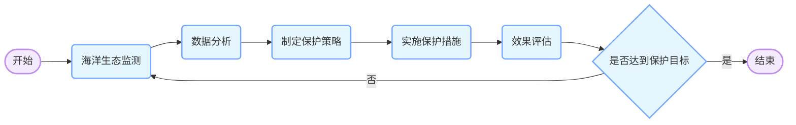

# 全球股市估值与海洋生物多样性保护技术的关系

> 关键词：全球股市估值、海洋生物多样性保护技术、经济影响、生态价值、协同发展、市场机制、可持续发展

> 摘要：本文旨在深入探讨全球股市估值与海洋生物多样性保护技术之间的关系。通过对两者背景、核心概念的分析，阐述其内在联系和相互影响。详细介绍相关的核心算法原理、数学模型，结合实际项目案例进行解读。同时探讨实际应用场景，推荐相关的工具和资源。最后总结未来发展趋势与挑战，为实现经济与生态的协同可持续发展提供理论支持和实践指导。

## 1. 背景介绍 
### 1.1 目的和范围
本研究的目的在于揭示全球股市估值与海洋生物多样性保护技术之间复杂而微妙的关系。通过全面的分析，帮助投资者、政策制定者、环保组织等相关方更好地理解经济活动与生态保护之间的相互作用，为制定合理的投资策略、政策措施以及保护方案提供依据。研究范围涵盖全球股票市场的主要板块以及海洋生物多样性保护的各个技术领域，包括但不限于海洋生态监测、物种保护、栖息地修复等技术。

### 1.2 预期读者
本文预期读者包括金融领域的投资者、分析师、基金经理，环保领域的科研人员、政策制定者、环保组织工作人员，以及对经济与生态关系感兴趣的学者和普通公众。

### 1.3 文档结构概述
本文首先介绍研究的背景，包括目的、预期读者和文档结构概述。接着阐述核心概念与联系，包括全球股市估值和海洋生物多样性保护技术的原理、架构以及两者之间的关系。然后详细讲解核心算法原理和具体操作步骤，通过数学模型和公式进行深入分析，并举例说明。随后通过项目实战案例，展示代码实现和详细解释。之后探讨实际应用场景，推荐相关的工具和资源。最后总结未来发展趋势与挑战，并提供常见问题与解答以及扩展阅读和参考资料。

### 1.4 术语表
#### 1.4.1 核心术语定义
- **全球股市估值**：指对全球范围内股票市场中各类股票价值的评估，通常基于公司的财务状况、盈利能力、市场前景等因素，采用不同的估值方法来确定股票的合理价格。
- **海洋生物多样性**：指海洋生态系统中生物种类的丰富程度、物种之间的遗传差异以及生态系统的多样性，包括海洋中的各种动植物、微生物以及它们所栖息的生态环境。
- **海洋生物多样性保护技术**：指用于保护海洋生物多样性的各种技术手段，包括监测技术、保护技术、修复技术等，旨在减少人类活动对海洋生态系统的破坏，维护海洋生物的生存和繁衍。

#### 1.4.2 相关概念解释
- **生态系统服务价值**：指生态系统为人类提供的各种服务和福利，包括提供食物、调节气候、保护海岸带等，这些服务具有重要的经济价值。
- **绿色金融**：指为支持环境改善、应对气候变化和资源节约高效利用的经济活动，即对环保、节能、清洁能源、绿色交通、绿色建筑等领域的项目投融资、项目运营、风险管理等所提供的金融服务。

#### 1.4.3 缩略词列表
- **ESG**：环境、社会和治理（Environmental, Social and Governance），是一种关注企业环境、社会和治理绩效的投资理念和评价标准。
- **GDP**：国内生产总值（Gross Domestic Product），是衡量一个国家或地区经济活动总量的指标。

## 2. 核心概念与联系 
### 2.1 全球股市估值原理和架构
全球股市估值是一个复杂的过程，涉及多个因素和方法。其基本原理是通过对公司的财务报表、行业前景、宏观经济环境等因素的分析，评估公司的内在价值，并结合市场供求关系来确定股票的价格。

常见的估值方法包括市盈率法（P/E）、市净率法（P/B）、现金流折现法（DCF）等。市盈率法是通过将公司的股票价格除以每股收益来计算市盈率，然后与同行业的平均市盈率进行比较，以评估股票的估值水平。市净率法是将公司的股票价格除以每股净资产来计算市净率，反映了市场对公司净资产的估值。现金流折现法是通过预测公司未来的现金流，并将其折现到当前时点，来计算公司的内在价值。

全球股市估值的架构可以分为宏观层面和微观层面。宏观层面包括全球经济增长、利率水平、通货膨胀率等因素，这些因素会影响整个股票市场的估值水平。微观层面包括公司的财务状况、盈利能力、市场竞争力等因素，这些因素会影响单个股票的估值。

以下是全球股市估值的 Mermaid 流程图：


### 2.2 海洋生物多样性保护技术原理和架构
海洋生物多样性保护技术的原理是基于对海洋生态系统的科学认识，通过采取各种措施来减少人类活动对海洋生物的影响，保护海洋生物的生存和繁衍。

海洋生物多样性保护技术的架构可以分为监测技术、保护技术和修复技术三个方面。监测技术包括卫星遥感、水下机器人、生物传感器等技术，用于实时监测海洋生态系统的变化，掌握海洋生物的分布和数量情况。保护技术包括海洋保护区的设立、渔业管理、污染控制等措施，用于保护海洋生物的栖息地和生态环境。修复技术包括海洋生态系统的恢复、物种的增殖放流等措施，用于恢复受损的海洋生态系统。

以下是海洋生物多样性保护技术的 Mermaid 流程图：


### 2.3 全球股市估值与海洋生物多样性保护技术的联系
全球股市估值与海洋生物多样性保护技术之间存在着密切的联系。一方面，海洋生物多样性保护技术的发展可以为相关企业带来商业机会，从而影响股市估值。例如，随着对海洋生态环境的重视，从事海洋生态监测、污染治理、海洋资源可持续利用等领域的企业将面临更多的市场需求，其股票价格可能会上涨。另一方面，股市估值的变化也会影响海洋生物多样性保护技术的发展。如果股市表现良好，投资者可能会更愿意投资于环保相关的企业，从而为海洋生物多样性保护技术的研发和应用提供资金支持。

此外，全球股市估值还可以反映社会对海洋生物多样性保护的重视程度。如果市场对环保企业的估值较高，说明社会对海洋生物多样性保护的认可度较高，这将有助于推动相关政策的出台和实施，促进海洋生物多样性保护技术的发展。

## 3. 核心算法原理 & 具体操作步骤 
### 3.1 全球股市估值算法原理及 Python 实现
#### 3.1.1 市盈率法（P/E）
市盈率法是一种简单而常用的股市估值方法。其原理是将公司的股票价格除以每股收益，得到市盈率，然后与同行业的平均市盈率进行比较，以评估股票的估值水平。

市盈率的计算公式为：
$$P/E = \frac{股票价格}{每股收益}$$

以下是使用 Python 实现市盈率法的代码示例：
```python
# 定义股票价格和每股收益
stock_price = 50
earnings_per_share = 5

# 计算市盈率
pe_ratio = stock_price / earnings_per_share

print(f"市盈率: {pe_ratio}")
```

#### 3.1.2 现金流折现法（DCF）
现金流折现法是一种更复杂但更准确的股市估值方法。其原理是通过预测公司未来的现金流，并将其折现到当前时点，来计算公司的内在价值。

现金流折现法的计算公式为：
$$V = \sum_{t=1}^{n} \frac{CF_t}{(1 + r)^t}$$
其中，$V$ 表示公司的内在价值，$CF_t$ 表示第 $t$ 期的现金流，$r$ 表示折现率，$n$ 表示预测期数。

以下是使用 Python 实现现金流折现法的代码示例：
```python
import numpy as np

# 定义预测期数、折现率和各期现金流
n = 5
r = 0.1
cash_flows = np.array([100, 120, 140, 160, 180])

# 计算各期现金流的折现值
discounted_cash_flows = cash_flows / (1 + r) ** np.arange(1, n + 1)

# 计算公司的内在价值
intrinsic_value = discounted_cash_flows.sum()

print(f"公司的内在价值: {intrinsic_value}")
```

### 3.2 海洋生物多样性保护技术评估算法原理及 Python 实现
#### 3.2.1 生态系统服务价值评估算法
生态系统服务价值评估算法是一种用于评估海洋生态系统为人类提供的各种服务和福利的价值的方法。常用的评估方法包括市场价值法、替代成本法、意愿调查法等。

以下是一个简单的市场价值法的 Python 实现示例，假设通过市场价值法评估海洋渔业的生态系统服务价值：
```python
# 定义渔业产量和市场价格
fishery_production = 1000  # 吨
market_price = 50  # 元/吨

# 计算渔业的生态系统服务价值
ecosystem_service_value = fishery_production * market_price

print(f"渔业的生态系统服务价值: {ecosystem_service_value} 元")
```

#### 3.2.2 保护效果评估算法
保护效果评估算法是一种用于评估海洋生物多样性保护措施实施效果的方法。常用的评估指标包括物种数量变化、栖息地面积变化、生态系统健康指数等。

以下是一个简单的保护效果评估算法的 Python 实现示例，假设通过物种数量变化来评估保护效果：
```python
# 定义保护前和保护后的物种数量
species_count_before = 100
species_count_after = 120

# 计算物种数量变化率
species_change_rate = (species_count_after - species_count_before) / species_count_before * 100

print(f"物种数量变化率: {species_change_rate}%")
```

## 4. 数学模型和公式 & 详细讲解 & 举例说明 
### 4.1 全球股市估值数学模型
#### 4.1.1 资本资产定价模型（CAPM）
资本资产定价模型是一种用于计算股票预期收益率的数学模型。其公式为：
$$E(R_i) = R_f + \beta_i (E(R_m) - R_f)$$
其中，$E(R_i)$ 表示股票 $i$ 的预期收益率，$R_f$ 表示无风险收益率，$\beta_i$ 表示股票 $i$ 的贝塔系数，$E(R_m)$ 表示市场组合的预期收益率。

贝塔系数 $\beta_i$ 衡量了股票 $i$ 的收益率相对于市场组合收益率的波动程度。如果 $\beta_i > 1$，说明股票 $i$ 的收益率波动比市场组合大；如果 $\beta_i < 1$，说明股票 $i$ 的收益率波动比市场组合小。

举例说明：假设无风险收益率 $R_f = 3\%$，市场组合的预期收益率 $E(R_m) = 10\%$，某股票的贝塔系数 $\beta_i = 1.2$，则该股票的预期收益率为：
$$E(R_i) = 3\% + 1.2 \times (10\% - 3\%) = 11.4\%$$

#### 4.1.2 多因素模型
多因素模型是在资本资产定价模型的基础上发展而来的，考虑了多个因素对股票收益率的影响。常见的多因素模型包括 Fama - French 三因素模型和 Carhart 四因素模型。

Fama - French 三因素模型的公式为：
$$R_i - R_f = \alpha_i + \beta_{i,M} (R_M - R_f) + \beta_{i,SMB} SMB + \beta_{i,HML} HML + \epsilon_i$$
其中，$R_i$ 表示股票 $i$ 的收益率，$R_f$ 表示无风险收益率，$R_M$ 表示市场组合的收益率，$SMB$ 表示规模因子，$HML$ 表示价值因子，$\alpha_i$ 表示股票 $i$ 的超额收益率，$\epsilon_i$ 表示随机误差项。

### 4.2 海洋生物多样性保护技术数学模型
#### 4.2.1 种群动态模型
种群动态模型是一种用于描述海洋生物种群数量随时间变化的数学模型。常用的种群动态模型包括 Logistic 模型和 Leslie 矩阵模型。

Logistic 模型的公式为：
$$\frac{dN}{dt} = rN(1 - \frac{N}{K})$$
其中，$N$ 表示种群数量，$t$ 表示时间，$r$ 表示种群的内禀增长率，$K$ 表示环境容纳量。

举例说明：假设某海洋生物种群的内禀增长率 $r = 0.1$，环境容纳量 $K = 1000$，初始种群数量 $N_0 = 100$，则可以使用 Python 求解该 Logistic 模型：
```python
from scipy.integrate import odeint
import numpy as np
import matplotlib.pyplot as plt

# 定义 Logistic 模型的微分方程
def logistic_model(N, t, r, K):
    dNdt = r * N * (1 - N / K)
    return dNdt

# 定义参数
r = 0.1
K = 1000
N0 = 100
t = np.linspace(0, 100, 1000)

# 求解微分方程
N = odeint(logistic_model, N0, t, args=(r, K))

# 绘制种群数量随时间的变化曲线
plt.plot(t, N)
plt.xlabel('时间')
plt.ylabel('种群数量')
plt.title('Logistic 模型种群动态')
plt.show()
```

#### 4.2.2 生态系统服务价值评估模型
生态系统服务价值评估模型是一种用于评估海洋生态系统为人类提供的各种服务和福利的价值的数学模型。常用的评估模型包括条件价值法、旅行成本法等。

条件价值法是通过问卷调查的方式，询问人们对某种生态系统服务的支付意愿或接受补偿意愿，从而评估其价值。假设通过条件价值法评估某海洋保护区的生态系统服务价值，共调查了 $n$ 个人，每个人的支付意愿为 $WTP_i$，则该海洋保护区的生态系统服务价值为：
$$V = \sum_{i=1}^{n} WTP_i$$

## 5. 项目实战：代码实际案例和详细解释说明 
### 5.1  开发环境搭建
#### 5.1.1 安装 Python
首先，需要安装 Python 开发环境。可以从 Python 官方网站（https://www.python.org/downloads/） 下载适合自己操作系统的 Python 安装包，并按照安装向导进行安装。

#### 5.1.2 安装必要的库
在项目中，需要使用一些 Python 库来进行数据处理、分析和可视化。可以使用以下命令安装这些库：
```sh
pip install numpy pandas matplotlib scipy
```

### 5.2  源代码详细实现和代码解读
#### 5.2.1 全球股市估值分析
以下是一个简单的全球股市估值分析的代码示例，使用 Pandas 库读取股票数据，并计算市盈率和市净率：
```python
import pandas as pd

# 读取股票数据
stock_data = pd.read_csv('stock_data.csv')

# 计算市盈率
stock_data['P/E'] = stock_data['股票价格'] / stock_data['每股收益']

# 计算市净率
stock_data['P/B'] = stock_data['股票价格'] / stock_data['每股净资产']

# 输出结果
print(stock_data[['股票代码', '股票名称', 'P/E', 'P/B']])
```
代码解读：
- 首先，使用 `pandas` 库的 `read_csv` 函数读取股票数据文件 `stock_data.csv`。
- 然后，通过将股票价格除以每股收益计算市盈率，并将结果存储在新的列 `P/E` 中。
- 接着，通过将股票价格除以每股净资产计算市净率，并将结果存储在新的列 `P/B` 中。
- 最后，输出股票代码、股票名称、市盈率和市净率。

#### 5.2.2 海洋生物多样性保护技术效果评估
以下是一个简单的海洋生物多样性保护技术效果评估的代码示例，使用 `numpy` 库计算物种数量变化率：
```python
import numpy as np

# 定义保护前和保护后的物种数量
species_count_before = np.array([100, 200, 300])
species_count_after = np.array([120, 220, 320])

# 计算物种数量变化率
species_change_rate = (species_count_after - species_count_before) / species_count_before * 100

# 输出结果
print(f"物种数量变化率: {species_change_rate}%")
```
代码解读：
- 首先，使用 `numpy` 数组定义保护前和保护后的物种数量。
- 然后，通过计算保护后和保护前物种数量的差值，并除以保护前的物种数量，再乘以 100，得到物种数量变化率。
- 最后，输出物种数量变化率。

### 5.3  代码解读与分析
#### 5.3.1 全球股市估值分析代码分析
在全球股市估值分析代码中，使用 `pandas` 库可以方便地读取和处理股票数据。通过计算市盈率和市净率，可以对股票的估值水平进行初步评估。但是，需要注意的是，市盈率和市净率只是一种简单的估值方法，不能完全反映股票的真实价值。在实际应用中，还需要考虑其他因素，如公司的盈利能力、行业前景、宏观经济环境等。

#### 5.3.2 海洋生物多样性保护技术效果评估代码分析
在海洋生物多样性保护技术效果评估代码中，使用 `numpy` 数组可以高效地进行数值计算。通过计算物种数量变化率，可以直观地了解保护措施的实施效果。但是，物种数量变化率只是一个简单的评估指标，不能全面反映海洋生物多样性的变化情况。在实际应用中，还需要综合考虑其他指标，如栖息地面积变化、生态系统健康指数等。

## 6. 实际应用场景 
### 6.1 投资决策
全球股市估值与海洋生物多样性保护技术的关系可以为投资者提供重要的参考信息。投资者可以关注从事海洋生物多样性保护技术研发和应用的企业，评估其发展前景和投资价值。如果这些企业能够在保护海洋生物多样性的同时实现盈利增长，其股票可能具有较高的投资价值。

例如，一些从事海洋生态监测技术的企业，随着对海洋环境监测需求的增加，其市场份额可能会不断扩大，股票价格也可能会上涨。投资者可以通过分析这些企业的财务报表、技术实力和市场前景，做出合理的投资决策。

### 6.2 政策制定
政府和相关部门可以根据全球股市估值与海洋生物多样性保护技术的关系，制定相关的政策措施。例如，政府可以通过税收优惠、财政补贴等政策，鼓励企业投资于海洋生物多样性保护技术的研发和应用，促进海洋生态环境的改善。

同时，政府还可以通过制定相关的法律法规，加强对海洋生物多样性的保护，规范企业的行为，引导资金流向环保领域。例如，建立海洋保护区、限制渔业捕捞强度、加强海洋污染治理等措施，都可以有效地保护海洋生物多样性。

### 6.3 科研与教育
全球股市估值与海洋生物多样性保护技术的关系也为科研和教育提供了新的研究方向和教学内容。科研人员可以深入研究两者之间的内在联系和相互影响机制，为实现经济与生态的协同发展提供理论支持。

在教育方面，可以将相关的知识纳入到金融、环境科学等专业的课程中，培养学生的经济与生态综合素养。例如，开设“绿色金融”、“生态经济学”等课程，让学生了解经济活动与生态保护之间的关系，提高学生的环保意识和社会责任感。

## 7. 工具和资源推荐
### 7.1 学习资源推荐
#### 7.1.1 书籍推荐
- 《金融市场与金融机构基础》：全面介绍了金融市场和金融机构的基本概念、理论和实践，是学习金融知识的经典教材。
- 《海洋生态学》：系统阐述了海洋生态系统的结构、功能和动态变化，以及人类活动对海洋生态系统的影响，是学习海洋生态知识的重要参考书。
- 《生态经济学》：探讨了经济活动与生态环境之间的相互关系，介绍了生态系统服务价值评估、绿色金融等重要概念和方法，为理解全球股市估值与海洋生物多样性保护技术的关系提供了理论基础。

#### 7.1.2 在线课程
- Coursera 平台上的“Financial Markets”：由耶鲁大学教授罗伯特·席勒（Robert Shiller）讲授，介绍了金融市场的基本原理和运行机制。
- edX 平台上的“Oceanography: Exploring Earth's Final Wilderness”：由伍兹霍尔海洋研究所（Woods Hole Oceanographic Institution）的专家讲授，介绍了海洋科学的基本概念和研究方法。
- 中国大学 MOOC 平台上的“生态经济学”：由国内知名高校的教授讲授，介绍了生态经济学的基本理论和应用。

#### 7.1.3 技术博客和网站
- Seeking Alpha：提供全球股市的分析和评论，包括公司财报分析、行业研究等内容，是投资者获取股市信息的重要渠道。
- MarineBio Conservation Society：专注于海洋生物多样性保护的网站，提供海洋生态系统保护、物种保护等方面的信息和资源。
- 中国生态环境部官网：发布国家生态环境政策、法规、标准等信息，提供生态环境监测数据和研究报告，是了解中国生态环境状况的重要平台。

### 7.2 开发工具框架推荐
#### 7.2.1 IDE和编辑器
- PyCharm：一款功能强大的 Python 集成开发环境，提供代码编辑、调试、版本控制等功能，适合开发复杂的 Python 项目。
- Jupyter Notebook：一种交互式的开发环境，支持 Python、R 等多种编程语言，适合进行数据分析和可视化。
- Visual Studio Code：一款轻量级的代码编辑器，支持多种编程语言和插件，具有丰富的扩展功能，适合快速开发和调试代码。

#### 7.2.2 调试和性能分析工具
- pdb：Python 内置的调试工具，可以在代码中设置断点，逐步执行代码，查看变量的值和程序的执行流程。
- cProfile：Python 内置的性能分析工具，可以分析代码的运行时间和函数调用次数，帮助优化代码性能。
- Py-Spy：一个跨平台的 Python 性能分析工具，可以实时监测 Python 程序的 CPU 使用情况和函数调用栈，帮助找出性能瓶颈。

#### 7.2.3 相关框架和库
- Pandas：一个强大的数据分析库，提供数据结构和数据处理工具，适合处理和分析股票数据、海洋生态监测数据等。
- NumPy：一个用于科学计算的库，提供多维数组和数学函数，适合进行数值计算和矩阵运算。
- Matplotlib：一个用于数据可视化的库，提供各种绘图函数和工具，适合绘制股票走势图、海洋生态数据可视化图表等。

### 7.3 相关论文著作推荐
#### 7.3.1 经典论文
- “The Pricing of Options and Corporate Liabilities” by Fischer Black and Myron Scholes：提出了著名的 Black - Scholes 期权定价模型，对金融市场的定价理论产生了深远影响。
- “The Economics of Ecosystems and Biodiversity (TEEB)”：由联合国环境规划署（UNEP）发起的研究项目，全面评估了生态系统和生物多样性的经济价值，为生态保护和可持续发展提供了重要的理论支持。
- “Valuing Ecosystem Services: Toward Better Environmental Decision - Making” by Robert Costanza et al.：探讨了生态系统服务价值评估的方法和应用，为生态经济学的发展做出了重要贡献。

#### 7.3.2 最新研究成果
- 关注《Nature》、《Science》、《Journal of Financial Economics》、《Ecological Economics》等国际顶级学术期刊，获取全球股市估值与海洋生物多样性保护技术领域的最新研究成果。

#### 7.3.3 应用案例分析
- 参考世界银行、亚洲开发银行等国际金融机构发布的关于绿色金融和生态保护项目的案例分析报告，了解全球股市估值与海洋生物多样性保护技术在实际项目中的应用和实践经验。

## 8. 总结：未来发展趋势与挑战
### 8.1 未来发展趋势
#### 8.1.1 绿色金融的兴起
随着全球对生态环境保护的重视程度不断提高，绿色金融将迎来快速发展。越来越多的投资者将关注企业的环境、社会和治理（ESG）绩效，将资金投向环保相关的企业和项目。这将为海洋生物多样性保护技术的研发和应用提供更多的资金支持，促进相关企业的发展，进而影响全球股市估值。

#### 8.1.2 技术创新的推动
海洋生物多样性保护技术将不断创新和发展。例如，随着人工智能、大数据、物联网等技术的应用，海洋生态监测将更加精准和高效；基因编辑、克隆等生物技术的发展，将为海洋物种保护和恢复提供新的手段。这些技术创新将提高海洋生物多样性保护的效果，同时也将为相关企业带来新的商业机会，影响全球股市估值。

#### 8.1.3 国际合作的加强
海洋生物多样性保护是一个全球性的问题，需要各国之间加强合作。未来，国际社会将进一步加强在海洋生物多样性保护领域的合作，共同制定保护政策和标准，开展联合研究和项目合作。这将促进海洋生物多样性保护技术的交流和共享，推动全球海洋生态环境的改善，同时也将对全球股市估值产生积极影响。

### 8.2 挑战
#### 8.2.1 数据获取和分析的困难
全球股市估值和海洋生物多样性保护技术都需要大量的数据支持。然而，目前在数据获取和分析方面还存在一些困难。例如，海洋生态监测数据的获取成本较高，数据质量也存在一定的问题；股市数据的分析需要专业的知识和技能，普通投资者难以准确把握。

#### 8.2.2 政策协调的复杂性
全球股市估值和海洋生物多样性保护技术涉及到多个领域和部门，政策协调的复杂性较高。例如，金融政策和环保政策之间可能存在一定的冲突，需要在两者之间寻求平衡。同时，不同国家和地区的政策差异也会给国际合作带来一定的困难。

#### 8.2.3 经济利益与生态保护的矛盾
在实际发展过程中，经济利益与生态保护之间往往存在一定的矛盾。一些企业为了追求经济利益，可能会忽视海洋生物多样性保护；而一些保护措施可能会对经济发展产生一定的影响。如何在经济发展和生态保护之间找到平衡点，是未来需要解决的重要问题。

## 9. 附录：常见问题与解答
### 9.1 全球股市估值与海洋生物多样性保护技术之间的关系是否具有普遍性？
全球股市估值与海洋生物多样性保护技术之间的关系在一定程度上具有普遍性。随着全球对生态环境保护的重视程度不断提高，越来越多的投资者开始关注企业的环境绩效，海洋生物多样性保护技术相关的企业将面临更多的市场机会，其股票价格可能会受到影响。然而，这种关系也会受到不同国家和地区的经济发展水平、政策环境、文化背景等因素的影响，因此在具体情况下可能会存在差异。

### 9.2 如何评估海洋生物多样性保护技术的经济价值？
评估海洋生物多样性保护技术的经济价值可以采用多种方法，如市场价值法、替代成本法、意愿调查法等。市场价值法是通过计算海洋生物资源的市场价格来评估其经济价值；替代成本法是通过计算替代海洋生态系统服务所需的成本来评估其经济价值；意愿调查法是通过问卷调查的方式，询问人们对海洋生物多样性保护的支付意愿或接受补偿意愿来评估其经济价值。在实际应用中，可以根据具体情况选择合适的评估方法。

### 9.3 投资者如何在全球股市中寻找与海洋生物多样性保护技术相关的投资机会？
投资者可以通过以下途径在全球股市中寻找与海洋生物多样性保护技术相关的投资机会：
- 关注环保行业的上市公司，了解其在海洋生物多样性保护技术领域的研发和应用情况。
- 研究相关的行业报告和分析，了解海洋生物多样性保护技术的发展趋势和市场前景。
- 参加环保行业的研讨会和展会，与企业和专家进行交流，获取第一手信息。
- 关注政府的政策动态，了解政府对海洋生物多样性保护的支持力度和政策导向。

## 10. 扩展阅读 & 参考资料
### 10.1 扩展阅读
- 《可持续金融》：深入探讨了可持续金融的理论和实践，包括绿色金融、社会责任投资等内容，为理解全球股市估值与海洋生物多样性保护技术的关系提供了更广阔的视角。
- 《海洋命运共同体：理念与实践》：介绍了海洋命运共同体的理念和实践，强调了国际合作在海洋生物多样性保护中的重要性。
- 《金融科技与绿色金融创新》：探讨了金融科技在绿色金融领域的应用和创新，为海洋生物多样性保护技术的发展提供了新的思路和方法。

### 10.2 参考资料
- 联合国环境规划署（UNEP）发布的相关报告和数据。
- 世界银行、亚洲开发银行等国际金融机构发布的关于绿色金融和生态保护项目的报告和数据。
- 各国政府发布的关于海洋生物多样性保护的政策、法规和统计数据。
- 学术期刊上发表的关于全球股市估值、海洋生物多样性保护技术等领域的研究论文。