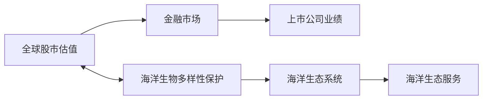

# 全球股市估值与海洋生物多样性保护的关联

> 关键词：全球股市估值、海洋生物多样性保护、生态经济、市场影响、可持续发展

> 摘要：本文旨在深入探讨全球股市估值与海洋生物多样性保护之间的关联。通过剖析两者背后的核心概念、相关算法原理、数学模型，结合实际项目案例，阐述了它们在生态经济层面的相互作用机制。同时，分析了其实际应用场景，推荐了相关的学习资源、开发工具和研究论文，最后对未来发展趋势与挑战进行总结，并解答常见问题。揭示了海洋生物多样性保护不仅具有生态意义，还对全球股市估值产生潜在且重要的影响，为实现经济与生态的可持续发展提供理论依据。

## 1. 背景介绍 
### 1.1 目的和范围
本研究的目的在于揭示全球股市估值和海洋生物多样性保护之间的内在联系，探索海洋生态系统健康状况对金融市场的影响机制，以及股市表现对海洋生物多样性保护工作的反作用。范围涵盖了全球主要股票市场的估值情况以及全球海洋生物多样性的现状、面临的威胁和保护措施等方面。

### 1.2 预期读者
本文预期读者包括金融领域的专业人士，如投资者、分析师、基金经理等，他们可以从生态角度理解股市估值的潜在影响因素；环保组织和科研人员，有助于他们认识到经济因素在海洋生物多样性保护中的作用；政策制定者能够基于此研究制定更综合的经济和环保政策；以及对生态经济交叉领域感兴趣的普通读者。

### 1.3 文档结构概述
本文首先介绍核心概念及其联系，包括全球股市估值和海洋生物多样性保护的定义、相关原理和架构。接着阐述核心算法原理和具体操作步骤，通过Python代码进行详细说明。然后给出数学模型和公式，并结合实际例子进行讲解。之后通过项目实战展示两者关联在实际中的体现，包括开发环境搭建、源代码实现和解读。再分析实际应用场景，推荐相关的工具和资源。最后总结未来发展趋势与挑战，解答常见问题并提供扩展阅读和参考资料。

### 1.4 术语表
#### 1.4.1 核心术语定义
- **全球股市估值**：指对全球范围内各个股票市场上上市公司股票价值的评估，通常通过各种估值指标如市盈率（P/E）、市净率（P/B）等进行衡量。
- **海洋生物多样性**：指海洋生态系统中生物种类的丰富程度、基因的多样性以及生态系统的多样性，包括海洋中的各种动植物、微生物及其所构成的生态系统。
- **生态经济**：是指在生态系统承载能力范围内，运用生态经济学原理和系统工程方法改变生产和消费方式，挖掘一切可以利用的资源潜力，发展一些经济发达、生态高效的产业，建设体制合理、社会和谐的文化以及生态健康、景观适宜的环境。

#### 1.4.2 相关概念解释
- **股市波动**：指股票市场价格在一定时间内的上下变动情况，受到多种因素影响，如宏观经济数据、公司业绩、政策法规等。
- **海洋生态服务**：指海洋生态系统为人类提供的各种服务，如食物供应、气候调节、海岸保护等。
- **可持续发展**：指既满足当代人的需求，又不损害后代人满足其需求的能力的发展模式，强调经济、社会和环境的协调发展。

#### 1.4.3 缩略词列表
- **P/E**：Price-to-Earnings Ratio，市盈率
- **P/B**：Price-to-Book Ratio，市净率
- **GDP**：Gross Domestic Product，国内生产总值

## 2. 核心概念与联系 

### 全球股市估值
全球股市估值是金融市场中的一个重要概念，它反映了市场对上市公司未来盈利能力和发展前景的预期。常见的估值方法有绝对估值法和相对估值法。绝对估值法如现金流折现法（DCF），通过预测公司未来的现金流并折现到当前来计算股票的内在价值；相对估值法如市盈率法，通过比较同行业公司的市盈率来评估目标公司的股票价值。

### 海洋生物多样性保护
海洋生物多样性保护旨在维护海洋生态系统的健康和稳定，保护海洋中的各种生物资源。海洋生物多样性面临着多种威胁，如过度捕捞、海洋污染、气候变化等。保护措施包括建立海洋保护区、实施可持续渔业管理、减少海洋污染等。

### 两者的联系
海洋生物多样性的健康状况会通过影响海洋生态服务进而影响相关产业的发展，从而对股市估值产生影响。例如，海洋渔业是全球重要的产业之一，海洋生物多样性的减少可能导致渔业资源的枯竭，影响渔业公司的业绩，进而导致其股票估值下降。另一方面，股市表现也会影响海洋生物多样性保护工作。当股市繁荣时，企业和投资者可能有更多的资金投入到海洋生物多样性保护项目中；而股市低迷时，保护资金可能会减少。

### 文本示意图
```plaintext
全球股市估值 <----> 海洋生物多样性保护
      |                     |
      |                     |
 金融市场                海洋生态系统
      |                     |
      |                     |
上市公司业绩            海洋生态服务
```

### Mermaid 流程图


## 3. 核心算法原理 & 具体操作步骤 

### 股市估值算法 - 市盈率法
市盈率法是一种常用的相对估值方法，其基本原理是通过比较同行业公司的市盈率来评估目标公司的股票价值。计算公式为：

$$P = EPS \times PE$$

其中，$P$ 表示股票价格，$EPS$ 表示每股收益，$PE$ 表示市盈率。

### Python 代码实现
```python
def calculate_stock_price(eps, pe):
    """
    计算股票价格
    :param eps: 每股收益
    :param pe: 市盈率
    :return: 股票价格
    """
    return eps * pe

# 示例数据
eps = 2.0  # 每股收益为 2 元
pe = 15    # 市盈率为 15

stock_price = calculate_stock_price(eps, pe)
print(f"股票价格为: {stock_price} 元")
```

### 海洋生物多样性评估算法 - Shannon-Wiener 指数
Shannon-Wiener 指数是一种常用的生物多样性评估指标，用于衡量生物群落的物种多样性。计算公式为：

$$H' = -\sum_{i=1}^{S} p_i \ln(p_i)$$

其中，$H'$ 表示 Shannon-Wiener 指数，$S$ 表示物种总数，$p_i$ 表示第 $i$ 个物种的个体数占总个体数的比例。

### Python 代码实现
```python
import math

def shannon_wiener_index(species_counts):
    """
    计算 Shannon-Wiener 指数
    :param species_counts: 各物种的个体数列表
    :return: Shannon-Wiener 指数
    """
    total_count = sum(species_counts)
    h = 0
    for count in species_counts:
        if count > 0:
            p = count / total_count
            h -= p * math.log(p)
    return h

# 示例数据
species_counts = [10, 20, 30, 40]
h_index = shannon_wiener_index(species_counts)
print(f"Shannon-Wiener 指数为: {h_index}")
```

### 两者关联的分析步骤
1. 收集全球股市中与海洋相关产业（如渔业、海洋旅游等）的上市公司数据，包括每股收益、市盈率等。
2. 收集海洋生物多样性的监测数据，如物种种类、个体数量等。
3. 计算股市估值和海洋生物多样性指标。
4. 分析两者之间的相关性，可以使用统计方法如线性回归分析。

### Python 代码实现关联分析
```python
import numpy as np
import pandas as pd
from scipy.stats import linregress

# 示例数据：假设我们有 10 年的股市估值数据和海洋生物多样性指数数据
stock_valuations = np.array([100, 110, 120, 130, 140, 150, 160, 170, 180, 190])
biodiversity_indices = np.array([2.0, 2.1, 2.2, 2.3, 2.4, 2.5, 2.6, 2.7, 2.8, 2.9])

# 进行线性回归分析
slope, intercept, r_value, p_value, std_err = linregress(stock_valuations, biodiversity_indices)

print(f"斜率: {slope}")
print(f"截距: {intercept}")
print(f"相关系数: {r_value}")
print(f"p 值: {p_value}")
print(f"标准误差: {std_err}")
```

## 4. 数学模型和公式 & 详细讲解 & 举例说明 

### 股市估值模型 - 现金流折现模型（DCF）
现金流折现模型是一种绝对估值方法，其基本思想是将公司未来的现金流折现到当前来计算股票的内在价值。公式如下：

$$V = \sum_{t=1}^{n} \frac{CF_t}{(1 + r)^t} + \frac{TV}{(1 + r)^n}$$

其中，$V$ 表示股票的内在价值，$CF_t$ 表示第 $t$ 期的现金流，$r$ 表示折现率，$n$ 表示预测期数，$TV$ 表示终值。

### 详细讲解
该模型的核心在于预测公司未来的现金流，并选择合适的折现率将其折现到当前。预测期数通常根据公司的发展阶段和行业特点来确定。终值是指预测期结束后公司的价值，一般可以使用永续增长模型来计算。

### 举例说明
假设一家公司未来 5 年的现金流分别为 100 万元、120 万元、140 万元、160 万元、180 万元，折现率为 10%，预测期结束后公司的终值为 2000 万元。则该公司股票的内在价值为：

$$V = \frac{100}{(1 + 0.1)^1} + \frac{120}{(1 + 0.1)^2} + \frac{140}{(1 + 0.1)^3} + \frac{160}{(1 + 0.1)^4} + \frac{180}{(1 + 0.1)^5} + \frac{2000}{(1 + 0.1)^5}$$

```python
import numpy as np

cash_flows = np.array([100, 120, 140, 160, 180])
discount_rate = 0.1
terminal_value = 2000
n = len(cash_flows)

present_values = cash_flows / (1 + discount_rate) ** np.arange(1, n + 1)
terminal_value_pv = terminal_value / (1 + discount_rate) ** n

intrinsic_value = present_values.sum() + terminal_value_pv
print(f"股票的内在价值为: {intrinsic_value} 万元")
```

### 海洋生物多样性与股市估值的关联模型
可以建立一个简单的线性回归模型来描述海洋生物多样性与股市估值之间的关系：

$$Y = \beta_0 + \beta_1 X + \epsilon$$

其中，$Y$ 表示股市估值，$X$ 表示海洋生物多样性指标（如 Shannon-Wiener 指数），$\beta_0$ 表示截距，$\beta_1$ 表示斜率，$\epsilon$ 表示误差项。

### 详细讲解
该模型假设股市估值与海洋生物多样性之间存在线性关系。斜率 $\beta_1$ 表示海洋生物多样性指标每变化一个单位，股市估值的平均变化量。截距 $\beta_0$ 表示当海洋生物多样性指标为 0 时的股市估值。误差项 $\epsilon$ 表示模型无法解释的随机因素。

### 举例说明
假设通过统计分析得到 $\beta_0 = 100$，$\beta_1 = 20$，当海洋生物多样性指标 $X = 2.5$ 时，股市估值 $Y$ 为：

$$Y = 100 + 20 \times 2.5 = 150$$

这意味着当海洋生物多样性指标为 2.5 时，预测的股市估值为 150。

## 5. 项目实战：代码实际案例和详细解释说明 

### 5.1  开发环境搭建
#### 操作系统
建议使用 Linux 或 macOS 系统，这些系统在数据处理和科学计算方面具有较好的稳定性和兼容性。也可以使用 Windows 系统，但需要安装相应的开发工具和依赖库。

#### Python 环境
安装 Python 3.7 及以上版本，可以从 Python 官方网站（https://www.python.org/downloads/）下载安装包进行安装。

#### 依赖库安装
使用 pip 安装以下依赖库：
```sh
pip install numpy pandas scipy matplotlib seaborn
```

### 5.2  源代码详细实现和代码解读
#### 数据收集与预处理
```python
import pandas as pd

# 假设我们有两个 CSV 文件，分别存储股市估值数据和海洋生物多样性数据
stock_data = pd.read_csv('stock_valuations.csv')
biodiversity_data = pd.read_csv('biodiversity_indices.csv')

# 合并数据
merged_data = pd.merge(stock_data, biodiversity_data, on='year')

# 数据清洗
merged_data = merged_data.dropna()

print(merged_data.head())
```

**代码解读**：首先使用 `pandas` 库读取存储股市估值数据和海洋生物多样性数据的 CSV 文件。然后使用 `merge` 函数将两个数据集按照年份进行合并。最后使用 `dropna` 函数去除包含缺失值的行。

#### 数据分析与可视化
```python
import numpy as np
import matplotlib.pyplot as plt
import seaborn as sns
from scipy.stats import linregress

# 提取股市估值和海洋生物多样性指标列
stock_valuations = merged_data['stock_valuation']
biodiversity_indices = merged_data['biodiversity_index']

# 进行线性回归分析
slope, intercept, r_value, p_value, std_err = linregress(stock_valuations, biodiversity_indices)

# 绘制散点图和拟合直线
plt.figure(figsize=(10, 6))
sns.scatterplot(x=stock_valuations, y=biodiversity_indices)
plt.plot(stock_valuations, intercept + slope * stock_valuations, 'r', label='拟合直线')
plt.xlabel('股市估值')
plt.ylabel('海洋生物多样性指标')
plt.title('股市估值与海洋生物多样性的关系')
plt.legend()
plt.show()

print(f"斜率: {slope}")
print(f"截距: {intercept}")
print(f"相关系数: {r_value}")
print(f"p 值: {p_value}")
print(f"标准误差: {std_err}")
```

**代码解读**：首先从合并后的数据集中提取股市估值和海洋生物多样性指标列。然后使用 `linregress` 函数进行线性回归分析，得到斜率、截距、相关系数、p 值和标准误差。接着使用 `seaborn` 库绘制散点图，并使用 `matplotlib` 库绘制拟合直线。最后打印回归分析的结果。

### 5.3  代码解读与分析
通过上述代码，我们完成了数据的收集、预处理、分析和可视化。从线性回归分析的结果中，我们可以判断股市估值和海洋生物多样性之间是否存在显著的线性关系。如果相关系数接近 1 或 -1，且 p 值小于 0.05，则说明两者之间存在显著的线性关系；如果 p 值大于 0.05，则说明两者之间的线性关系不显著。

在实际应用中，我们可以根据分析结果制定相应的投资策略或环保政策。例如，如果发现股市估值与海洋生物多样性呈正相关，投资者可以考虑投资与海洋生物多样性保护相关的企业；政策制定者可以加大对海洋生物多样性保护的投入，以促进相关产业的发展和股市的繁荣。

## 6. 实际应用场景 
### 投资决策
投资者可以将海洋生物多样性指标纳入投资分析框架，关注与海洋生物多样性保护相关的行业和企业。例如，海洋渔业公司如果采用可持续的捕捞方式，有助于保护海洋生物多样性，其未来的业绩可能更具稳定性，股票估值也可能更高。投资者可以选择投资这类公司，以获得长期的投资回报。

### 企业战略规划
企业在制定战略规划时，需要考虑海洋生物多样性保护对自身业务的影响。例如，海洋旅游企业如果所在地区的海洋生物多样性遭到破坏，可能会影响游客的体验，进而影响企业的收入。因此，企业可以采取措施支持海洋生物多样性保护，如参与海洋保护区的建设、推广环保旅游项目等，以提升企业的可持续发展能力和市场竞争力。

### 政策制定
政策制定者可以根据股市估值与海洋生物多样性的关联，制定更加综合的经济和环保政策。例如，政府可以通过税收优惠、补贴等政策鼓励企业投资海洋生物多样性保护项目，同时加强对海洋资源开发的监管，确保其可持续性。这样既可以促进海洋生物多样性的保护，又可以推动相关产业的发展，实现经济与生态的双赢。

### 风险评估
金融机构在进行风险评估时，可以将海洋生物多样性风险纳入考虑范围。例如，对于向海洋相关企业提供贷款的银行，如果该企业的业务活动对海洋生物多样性造成较大破坏，可能会面临政策风险、声誉风险等，银行需要对这些风险进行评估并采取相应的措施。

## 7. 工具和资源推荐
### 7.1 学习资源推荐
#### 7.1.1 书籍推荐
- 《金融市场学》：全面介绍金融市场的基本概念、理论和实践，有助于读者深入理解股市估值的相关知识。
- 《生物多样性保护概论》：系统阐述生物多样性的概念、价值、面临的威胁和保护措施，为学习海洋生物多样性保护提供基础。
- 《生态经济学》：探讨经济系统与生态系统之间的相互关系，对于理解股市估值与海洋生物多样性保护的关联具有重要意义。

#### 7.1.2 在线课程
- Coursera 上的“Financial Markets”：由耶鲁大学教授 Robert Shiller 授课，讲解金融市场的基本原理和投资策略。
- edX 上的“Biodiversity Conservation”：介绍生物多样性保护的科学方法和实践经验。
- Udemy 上的“Ecological Economics: Principles and Applications”：深入探讨生态经济学的理论和应用。

#### 7.1.3 技术博客和网站
- Seeking Alpha：提供全球股市的分析和评论，帮助投资者了解股市动态。
- Conservation International：专注于生物多样性保护的研究和实践，发布相关的新闻和报告。
- The World Bank：世界银行的官方网站，提供有关生态经济和可持续发展的研究成果和政策建议。

### 7.2 开发工具框架推荐
#### 7.2.1 IDE和编辑器
- PyCharm：功能强大的 Python 集成开发环境，提供代码编辑、调试、版本控制等功能。
- Jupyter Notebook：交互式的编程环境，适合进行数据分析和可视化。
- Visual Studio Code：轻量级的代码编辑器，支持多种编程语言和插件扩展。

#### 7.2.2 调试和性能分析工具
- pdb：Python 内置的调试器，用于调试 Python 代码。
- cProfile：Python 标准库中的性能分析工具，用于分析代码的运行时间和性能瓶颈。
- Numba：用于加速 Python 代码的 JIT 编译器，提高代码的执行效率。

#### 7.2.3 相关框架和库
- Pandas：用于数据处理和分析的 Python 库，提供高效的数据结构和数据操作方法。
- Numpy：用于科学计算的 Python 库，提供多维数组和数学函数。
- Scikit-learn：用于机器学习的 Python 库，提供各种机器学习算法和工具。
- Matplotlib：用于数据可视化的 Python 库，提供丰富的绘图功能。

### 7.3 相关论文著作推荐
#### 7.3.1 经典论文
- “The Economics of Biodiversity Loss”：探讨生物多样性损失的经济影响，为生态经济研究奠定了基础。
- “Stock Market Valuation and Corporate Social Responsibility”：研究股市估值与企业社会责任之间的关系，为理解股市估值的影响因素提供了新的视角。
- “The Role of Marine Biodiversity in Ecosystem Services”：阐述海洋生物多样性在生态系统服务中的作用，强调了保护海洋生物多样性的重要性。

#### 7.3.2 最新研究成果
- 关注《Nature》、《Science》、《Ecological Economics》等学术期刊上发表的关于股市估值和海洋生物多样性保护的最新研究论文，了解该领域的前沿动态。

#### 7.3.3 应用案例分析
- 一些国际组织和研究机构会发布关于股市估值与海洋生物多样性保护关联的应用案例分析报告，如联合国环境规划署（UNEP）、世界自然基金会（WWF）等，这些报告可以为实际应用提供参考。

## 8. 总结：未来发展趋势与挑战
### 未来发展趋势
- **生态经济融合加深**：随着人们对可持续发展的重视，股市估值与海洋生物多样性保护的关联将更加紧密。未来，生态经济将成为经济发展的重要方向，金融市场将更加关注企业的生态责任和可持续发展能力。
- **技术创新推动**：大数据、人工智能、区块链等技术的发展将为股市估值和海洋生物多样性保护提供更强大的工具和方法。例如，通过大数据分析可以更准确地评估海洋生物多样性的变化对股市估值的影响；区块链技术可以实现海洋资源交易的透明化和可追溯性。
- **国际合作加强**：海洋生物多样性保护是全球性的问题，需要各国共同努力。未来，国际间在海洋生物多样性保护和金融领域的合作将不断加强，共同制定相关的政策和标准，推动全球可持续发展。

### 挑战
- **数据获取与质量**：目前，关于全球股市估值和海洋生物多样性的数据存在获取困难和质量不高的问题。需要建立更加完善的数据收集和监测体系，提高数据的准确性和可靠性。
- **模型复杂性**：股市估值和海洋生物多样性保护之间的关系非常复杂，受到多种因素的影响。建立准确的数学模型和分析方法具有一定的难度，需要不断地进行研究和改进。
- **利益协调**：在股市估值与海洋生物多样性保护的关联中，涉及到不同利益主体的利益。例如，企业追求利润最大化，可能会忽视海洋生物多样性保护；而环保组织则更关注生态环境的保护。如何协调不同利益主体的利益，是一个需要解决的难题。

## 9. 附录：常见问题与解答
### 问题 1：股市估值与海洋生物多样性保护之间的关联是直接的还是间接的？
答：两者之间的关联是间接的。海洋生物多样性的健康状况会影响海洋生态服务，进而影响相关产业的发展，最终对股市估值产生影响。例如，海洋生物多样性的减少可能导致渔业资源的枯竭，影响渔业公司的业绩，从而使该公司的股票估值下降。

### 问题 2：如何衡量海洋生物多样性的变化对股市估值的影响程度？
答：可以通过建立数学模型，如线性回归模型、时间序列模型等，来分析海洋生物多样性指标与股市估值之间的关系。同时，可以使用统计方法计算相关系数、p 值等指标，来判断两者之间的关联程度和显著性。

### 问题 3：企业在海洋生物多样性保护中应该承担哪些责任？
答：企业应该采取可持续的生产和经营方式，减少对海洋生物多样性的破坏。例如，渔业企业应该采用可持续的捕捞方式，避免过度捕捞；海洋旅游企业应该推广环保旅游项目，减少对海洋生态环境的影响。此外，企业还可以参与海洋生物多样性保护项目，如资助海洋保护区的建设等。

### 问题 4：政策制定者如何利用股市估值与海洋生物多样性保护的关联来制定政策？
答：政策制定者可以通过税收优惠、补贴等政策鼓励企业投资海洋生物多样性保护项目，促进相关产业的发展，从而提升股市估值。同时，加强对海洋资源开发的监管，确保其可持续性，保护海洋生物多样性。此外，政策制定者还可以引导投资者关注与海洋生物多样性保护相关的企业，推动金融市场向可持续发展方向转型。

## 10. 扩展阅读 & 参考资料
### 扩展阅读
- 《可持续金融：原理与实践》：深入探讨可持续金融的理论和实践，为理解股市估值与海洋生物多样性保护的关联提供更广阔的视角。
- 《海洋生态系统服务的经济价值评估》：介绍海洋生态系统服务的经济价值评估方法和案例，有助于读者了解海洋生物多样性的经济价值。
- 《金融科技与可持续发展》：探讨金融科技在可持续发展中的应用，包括如何利用金融科技手段促进股市估值与海洋生物多样性保护的协同发展。

### 参考资料
- 相关学术期刊上发表的研究论文，如《Journal of Financial Economics》、《Conservation Biology》等。
- 国际组织和研究机构发布的报告，如联合国《生物多样性公约》、世界银行《全球生态经济报告》等。
- 金融数据提供商的数据库，如 Bloomberg、Wind 等，用于获取全球股市估值数据。
- 海洋生物多样性监测机构的网站，如 Ocean Biodiversity Information System（OBIS），用于获取海洋生物多样性数据。